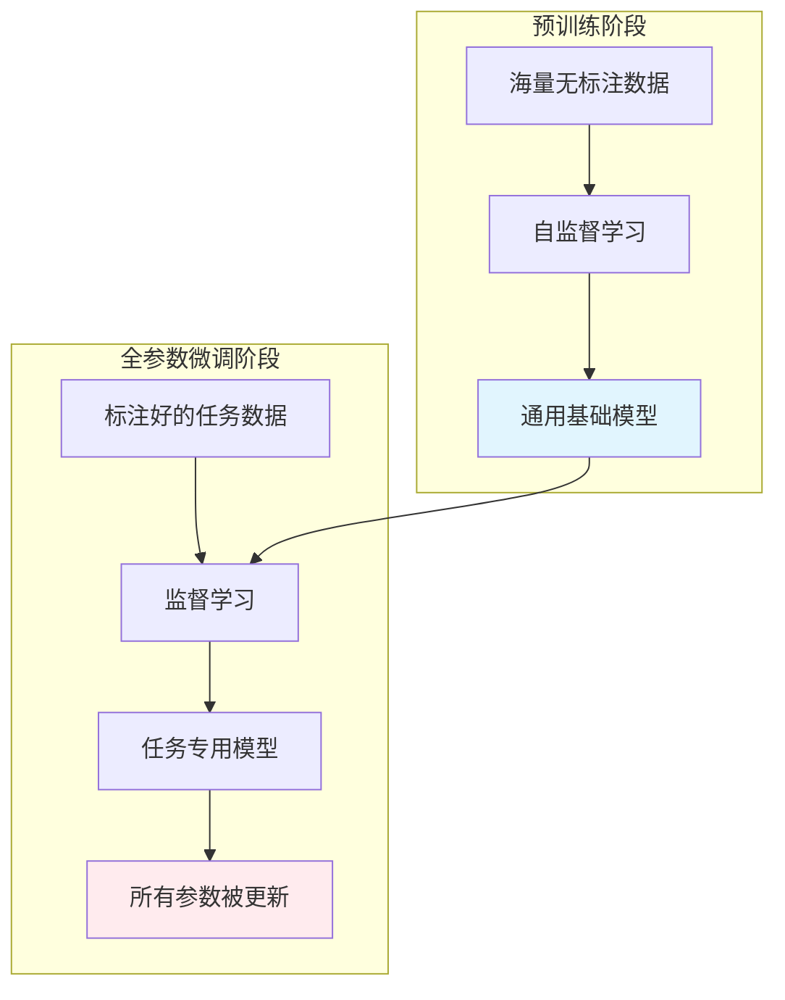
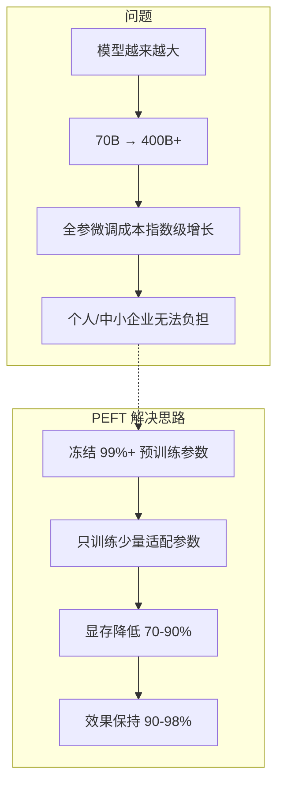
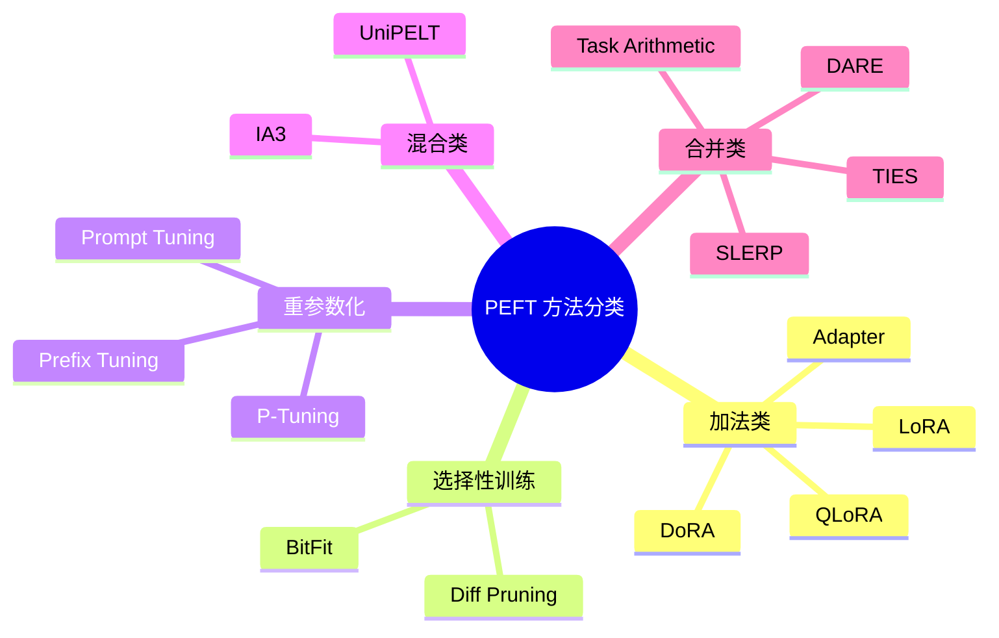
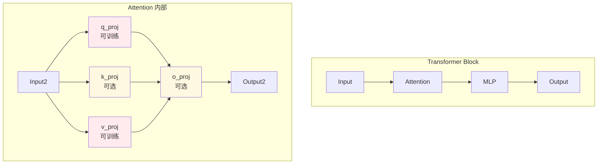
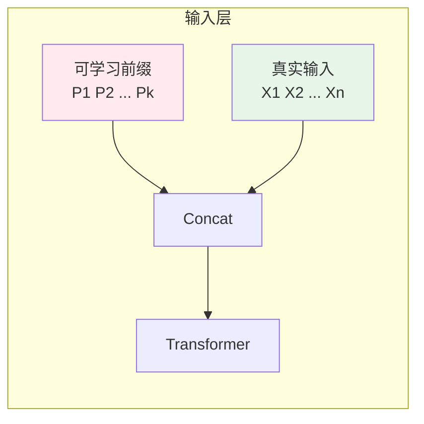
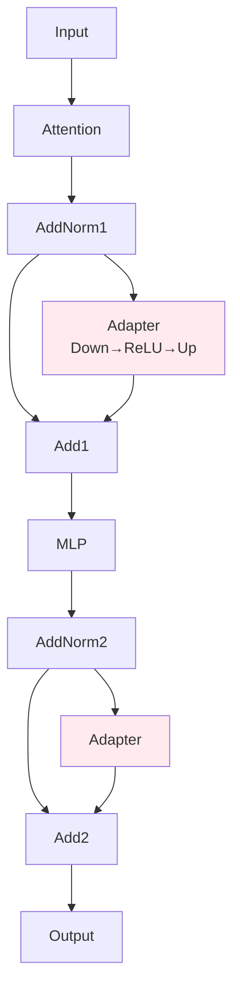
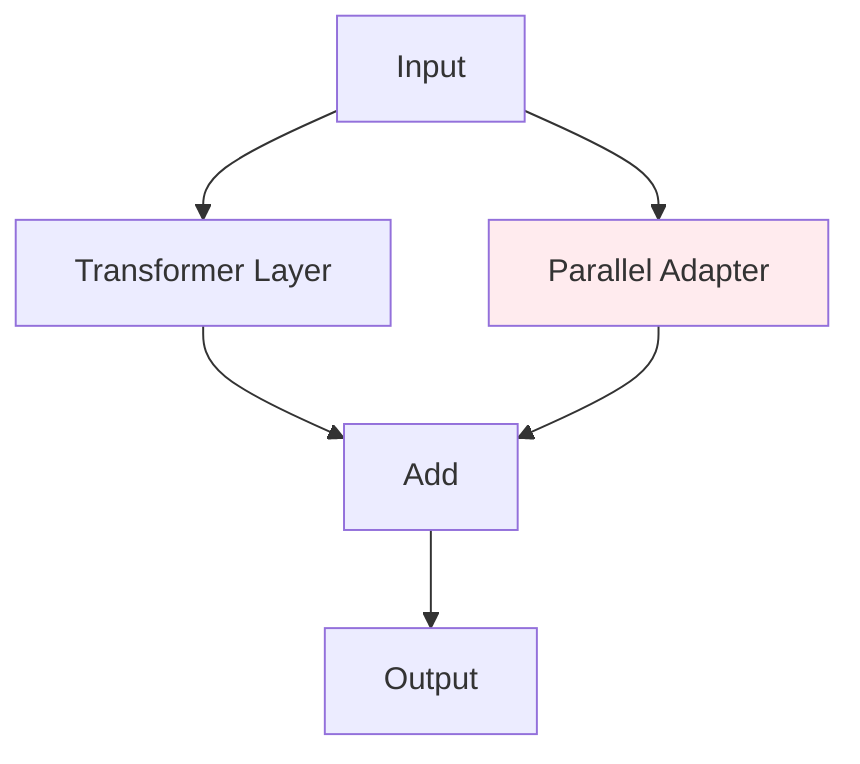
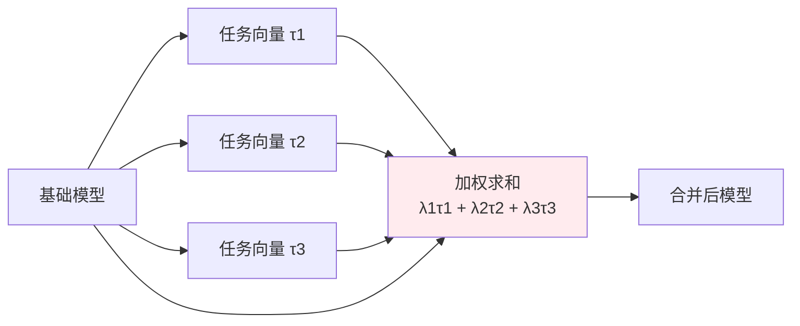
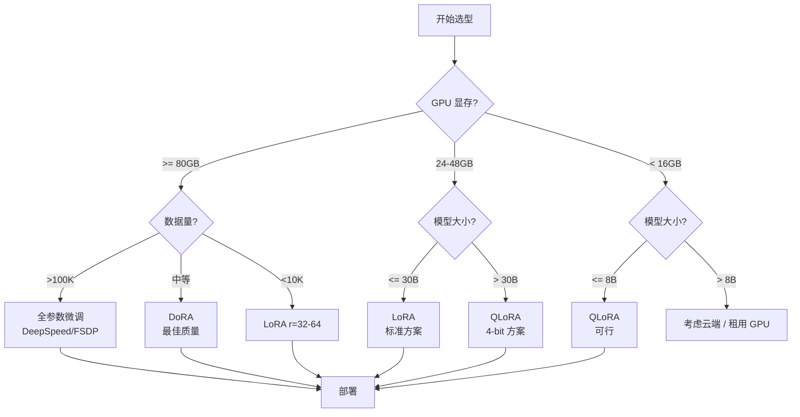

# 微调策略完全指南 (Fine-tuning Strategies)

> **一句话理解**: 微调策略是大模型"因材施教"的核心方法论——从全参数重塑到轻量级适配，选择正确的微调方法能在效果、成本与效率之间找到最优平衡。

---

## 目录

1. [全参数微调 (Full Fine-tuning)](#1-全参数微调-full-fine-tuning)
2. [参数高效微调概述 (PEFT Overview)](#2-参数高效微调概述-peft-overview)
3. [LoRA: 低秩适配](#3-lora-低秩适配)
4. [QLoRA: 量化低秩适配](#4-qlora-量化低秩适配)
5. [DoRA: 权重分解低秩适配](#5-dora-权重分解低秩适配)
6. [Prefix Tuning / P-Tuning](#6-prefix-tuning--p-tuning)
7. [Adapter: 瓶颈适配器](#7-adapter-瓶颈适配器)
8. [IA³: 学习缩放向量](#8-ia³-学习缩放向量)
9. [模型合并技术](#9-模型合并技术)
10. [实战代码](#10-实战代码)
11. [选型指南](#11-选型指南)
12. [常见问题 FAQ](#12-常见问题-faq)

---

## 1. 全参数微调 (Full Fine-tuning)

### 1.1 核心概念

全参数微调是指在下游任务数据上更新模型的**所有可训练参数**。预训练模型相当于一个受过通识教育的学生，全参数微调则是让其彻底转专业——所有知识结构都会被重新调整。



### 1.2 适用场景

| 场景 | 说明 |
|------|------|
| **领域迁移** | 目标领域与预训练领域差异极大 (法律/医疗) |
| **知识注入** | 需要模型掌握大量全新知识 (企业知识库) |
| **架构改造** | 需要改变模型输出结构 (新增分类头、修改词表) |
| **极致性能** | 任务对准确率要求极高，PEFT 无法满足 |

### 1.3 资源需求与计算成本 (LLaMA-3-70B, AdamW, BF16)

| 组件 | 计算方式 | 显存占用 |
|------|----------|----------|
| 模型参数 | 70B × 2 Byte | ~140 GB |
| 梯度 | 70B × 2 Byte | ~140 GB |
| 优化器状态 (AdamW) | 70B × 2 × 4 Byte | ~560 GB |
| **总计** | — | **~840 GB** |

DeepSpeed ZeRO / FSDP 优化后：

| 优化策略 | 每卡显存 (8 卡) | 总显存需求 |
|----------|---------------|------------|
| 无优化 | 840 GB | 8×A100 80GB |
| ZeRO-2 | ~210 GB | 8×A100 40GB |
| ZeRO-3 + Offload | ~50 GB | 8×A100 40GB |
| ZeRO-3 + CPU Offload | ~20 GB | 8×RTX 4090 24GB |

### 1.4 优缺点对比

| 维度 | 全参数微调 | 说明 |
|------|-----------|------|
| **效果上限** | ⭐⭐⭐⭐⭐ 最优 | 理论上可达到该架构下的最佳性能 |
| **训练成本** | ⭐☆☆☆☆ 极高 | 需要多卡 A100/H100 集群 |
| **存储成本** | ⭐☆☆☆☆ 极高 | 每个任务需存储 140GB+ 的完整模型 |
| **灾难性遗忘** | ⭐⭐☆☆☆ 高风险 | 通用能力可能显著下降 |
| **多任务部署** | ⭐☆☆☆☆ 困难 | N 个任务需 N 份完整模型 |
| **收敛稳定性** | ⭐⭐⭐⭐☆ 好 | 监督学习，训练过程稳定 |

### 1.5 全参数微调最佳实践

```python
# 全参数微调配置示例 (使用 DeepSpeed)
from transformers import TrainingArguments

training_args = TrainingArguments(
    output_dir="./full_ft_output",
    num_train_epochs=3,
    per_device_train_batch_size=4,
    gradient_accumulation_steps=8,      # 有效 batch = 32
    learning_rate=1e-5,                 # 全参微调学习率更低
    warmup_ratio=0.03,
    lr_scheduler_type="cosine",
    
    # 混合精度
    bf16=True,
    fp16=False,
    
    # 梯度检查点 (用时间换显存)
    gradient_checkpointing=True,
    
    # 分布式
    deepspeed="ds_config_zero3.json",   # ZeRO-3 配置
    
    # 日志与保存
    logging_steps=10,
    save_strategy="epoch",
    evaluation_strategy="steps",
    eval_steps=100,
    load_best_model_at_end=True,
)
```

---

## 2. 参数高效微调概述 (PEFT Overview)

### 2.1 为什么需要 PEFT？



### 2.2 PEFT 核心思想分类



### 2.3 计算与显存节省对比 (LLaMA-3-8B, bs=1, seq=2048)

| 方法 | 可训练参数 | 训练显存 | 相对全参比例 | 效果保持 |
|------|-----------|----------|-------------|----------|
| **Full FT** | 8B (100%) | ~80 GB | 100% | 100% |
| **LoRA (r=16)** | ~16M (0.2%) | ~16 GB | 20% | ~97% |
| **QLoRA (4-bit)** | ~16M (0.2%) | ~6 GB | 7.5% | ~95% |
| **Adapter** | ~3M (0.04%) | ~14 GB | 17.5% | ~94% |
| **Prefix Tuning** | ~0.5M (0.006%) | ~12 GB | 15% | ~90% |
| **IA³** | ~8M (0.1%) | ~15 GB | 18.8% | ~96% |

### 2.4 PEFT 方法演进时间线

```
2019: Adapter (Houlsby et al.)
       └── 在 Transformer 层中插入小型瓶颈模块
       
2021: Prefix Tuning (Li & Liang)
       └── 在输入前添加可学习的连续前缀
       
2021: LoRA (Hu et al.)
       └── 低秩分解矩阵作为旁路，训练参数量极少
       
2022: P-Tuning v2 (Liu et al.)
       └── 深层提示微调，解决小模型效果差的问题
       
2022: IA³ (Liu et al.)
       └── 学习缩放向量，逐元素重校准激活值
       
2023: QLoRA (Dettmers et al.)
       └── 4-bit 量化 + LoRA，单卡微调 65B+ 模型
       
2024: DoRA (Liu et al.)
       └── 权重分解 LoRA，幅度与方向分离微调
       
2024: rsLoRA / PiSSA / LoftQ
       └── 高秩稳定训练、SVD 初始化、量化感知初始化
```

---

## 3. LoRA: 低秩适配

### 3.1 核心原理

LoRA (Low-Rank Adaptation) 的核心洞察是：**微调过程中权重的增量矩阵 ΔW 具有很低的内在秩 (intrinsic rank)**。因此，可以用低秩分解来近似这个增量。

冻结预训练权重 $W_0 \in \mathbb{R}^{d \times k}$，通过低秩矩阵学习增量：

$$
W = W_0 + \Delta W = W_0 + \frac{\alpha}{r} B A
$$

其中：
- $B \in \mathbb{R}^{d \times r}$，$A \in \mathbb{R}^{r \times k}$
- $r \ll \min(d, k)$ 为秩 (rank)，通常取 4-64
- $\alpha$ 为缩放因子，通常设为 $2r$ 或 $4r$
- 可训练参数从 $d \times k$ 降至 $r(d + k)$

```mermaid
flowchart LR
    subgraph 原始微调
        O1[W0] --> O2[ΔW]
        O2 --> O3[W = W0 + ΔW]
        O4[可训练参数: d×k] -.-> O3
    end
    
    subgraph LoRA
        L1[W0<br/>冻结] --> L3[W = W0 + BA]
        L2[B × A<br/>可训练] --> L3
        L4[可训练参数: r×(d+k)] -.-> L2
    end
    
    style L1 fill:#e8f5e9
    style L2 fill:#ffebee
```

### 3.2 秩 (Rank) 的选择策略

秩 $r$ 决定了 LoRA 的表达能力与参数量之间的权衡：

| 秩 r | 参数量 (d=k=4096) | 效果 | 适用场景 |
|------|-------------------|------|----------|
| **r = 1-4** | ~16-32K | 一般 | 简单格式转换、快速实验 |
| **r = 8-16** | ~64-128K | **优秀** (推荐起点) | 通用指令微调、风格迁移 |
| **r = 32-64** | ~256-512K | 接近全参 | 复杂推理、领域适配、代码任务 |
| **r = 128-256** | ~1-2M | 边际收益递减 | 极限性能需求、大模型 (>70B) |
| **r > 256** | >2M | 通常无提升 | 不推荐，考虑全参微调 |

**秩选择决策树**：

```
任务类型?
├── 风格/格式/简单分类 → r=8-16
├── 指令跟随/对话 → r=16-32  
├── 领域知识适配 → r=32-64
├── 数学/代码/复杂推理 → r=64-128
└── 多任务联合训练 → r=64-128 + 更高 alpha

数据量?
├── <1K 样本 → 降低 r，增加 dropout
├── 1K-10K → r=16-32 (标准)
└── >10K → r=32-64，可训练更多模块

模型大小?
├── 7B-13B → r=8-32
├── 30B-70B → r=16-64
└── 100B+ → r=32-128
```

### 3.3 目标模块 (Target Modules) 选择

不同模型架构的投影矩阵命名有所不同，但通常都作用于 Attention 层：

| 模型系列 | Attention 模块名称 | 推荐目标模块 |
|----------|-------------------|-------------|
| **LLaMA / Mistral / Qwen** | q_proj, k_proj, v_proj, o_proj | `["q_proj", "v_proj"]` (最小)<br>`["q_proj", "k_proj", "v_proj", "o_proj"]` (标准) |
| **GPT-2 / GPT-Neo** | c_attn, c_proj | `["c_attn", "c_proj"]` |
| **BERT / RoBERTa** | query, key, value, dense | `["query", "value"]` |
| **T5** | q, k, v, o | `["q", "v"]` |
| **Falcon** | query_key_value, dense | `["query_key_value", "dense"]` |



**模块扩展策略**：

| 策略 | 目标模块 | 适用场景 | 额外参数 |
|------|----------|----------|----------|
| **最小** | q_proj, v_proj | 显存极度受限、简单任务 | ~0.1% |
| **标准** | q, k, v, o_proj | 通用微调 (推荐) | ~0.2% |
| **扩展** | + gate_proj, up_proj, down_proj | 领域适配、复杂任务 | ~0.5% |
| **全部线性层** | 所有 Linear | 极限性能 | ~1-2% |

### 3.4 Alpha 缩放与 Dropout

缩放因子 $\alpha$ 控制 LoRA 旁路对原始权重的贡献程度：

```python
# 实际缩放系数 = alpha / r
# 推荐配置
lora_alpha = 2 * r    # 保守 (推荐起点)
lora_alpha = 4 * r    # 激进 (任务差异大时)

# 例如
r = 16, alpha = 32   # 标准配置
r = 64, alpha = 128  # 复杂任务
```

| alpha/r 比例 | 效果 | 建议 |
|-------------|------|------|
| **1×** | 保守，保留更多预训练知识 | 领域相近的任务 |
| **2×** | 平衡 (最常用) | 通用推荐 |
| **4×** | 激进，LoRA 影响更大 | 领域差异大、数据充足 |
| **>4×** | 容易过拟合 | 一般不建议 |

**Dropout** 用于防止过拟合，LoRA 特有的 `lora_dropout` 只作用于旁路：

```python
lora_dropout = 0.0   # 无正则化 (数据充足)
lora_dropout = 0.05  # 轻度正则化 (推荐)
lora_dropout = 0.1   # 中度正则化 (小数据集)
lora_dropout = 0.2   # 强度正则化 (<1K 样本)
```

---

## 4. QLoRA: 量化低秩适配

### 4.1 核心架构

QLoRA = 4-bit 量化 (NF4) + 双量化 (Double Quantization) + 分页优化器 (Paged Optimizers) + LoRA

```
QLoRA 技术栈 = NF4 量化 + 双量化 + 分页优化器 + LoRA
├── NF4 量化: 将模型权重压缩到 4-bit
├── 双量化: 对量化常数再次量化，进一步节省显存
├── BF16 计算: 前向/反向传播时动态反量化到 BF16
├── LoRA 旁路: 在 BF16 精度下训练低秩适配器
└── 分页优化器: GPU 显存不足时自动换页到 CPU
```

### 4.2 NF4 (Normal Float 4-bit) 量化

传统 INT4 采用均匀分布的量化点，但神经网络权重通常服从**零均值正态分布**。NF4 针对正态分布设计信息论最优的量化表：

```
标准 INT4 (均匀分布):  -8, -7, -6, -5, -4, -3, -2, -1, 0, 1, 2, 3, 4, 5, 6, 7
NF4 (正态分布优化):   更密集地覆盖 [-1σ, 1σ] 区间，尾部更稀疏
```

**效果对比** (相同 4-bit 位宽下)：

| 量化类型 | 权重分布假设 | 均方误差 | 适用性 |
|----------|-------------|----------|--------|
| INT4 | 均匀分布 | 较高 | 通用硬件 |
| FP4 (E2M1) | 浮点分布 | 中等 | 部分硬件 |
| **NF4** | **正态分布** | **最低** | **QLoRA 专用** |

### 4.3 双量化 (Double Quantization)

对量化常数 (scaling factors) 再次进行量化，进一步压缩显存：

```
第一次量化: 权重 W → NF4 + 32-bit 量化常数
第二次量化: 32-bit 常数 → 8-bit + 32-bit 块常数

显存节省:
- 单量化: 4-bit 权重 + 32-bit 常数 → ~4.5 bit/参数
- 双量化: 4-bit 权重 + 8-bit 常数 + 32-bit 块常数 → ~4.25 bit/参数
```

### 4.4 分页优化器 (Paged Optimizers)

当 GPU 显存不足时，自动将优化器状态分页换出到 CPU 内存：


### 4.5 QLoRA 显存需求详解

| 模型 | BF16 全参微调 | LoRA | QLoRA (4-bit) | QLoRA 实际配置 |
|------|--------------|------|---------------|---------------|
| **LLaMA-3-8B** | ~80 GB | ~16 GB | **~6 GB** | RTX 3060 12GB |
| **LLaMA-3-70B** | ~640 GB | ~160 GB | **~48 GB** | 单张 A100 80GB 或 2×RTX 4090 |
| **Qwen-72B** | ~576 GB | ~144 GB | **~44 GB** | 单张 A100 80GB |
| **Mixtral-8x22B** | ~1.2 TB | ~300 GB | **~90 GB** | 2×A100 80GB |

---

## 5. DoRA: 权重分解低秩适配

### 5.1 核心思想

DoRA (Weight-Decomposed Low-Rank Adaptation) 将预训练权重分解为**幅度 (magnitude)** 和**方向 (direction)**，只对方向进行低秩微调：

$$
W = m \cdot \frac{W_0}{\|W_0\|} + B A = m \cdot (W_0^{\text{norm}} + \Delta W^{\text{dir}})
$$

其中 $m$ 为可学习幅度向量，$W_0^{\text{norm}}$ 冻结，$\Delta W^{\text{dir}} = BA$ 低秩更新。

```mermaid
flowchart TB
    W0[预训练权重 W0] --> Decomp[分解]
    Decomp --> M[幅度 m<br/>可训练]
    Decomp --> Dir0[方向 W0/\|\|W0\|\|<br/>冻结]
    Dir0 --> DirUpdate[+ BA<br/>低秩更新]
    M --> Combine[×]
    DirUpdate --> Combine
    Combine --> W[最终权重 W]
    style M fill:#ffebee
    style DirUpdate fill:#ffebee
    style Dir0 fill:#e8f5e9
```

### 5.2 DoRA vs 标准 LoRA

| 维度 | LoRA | DoRA | 说明 |
|------|------|------|------|
| **额外参数量** | $r(d+k)$ | $r(d+k) + d$ | 幅度向量增加约 0.01% |
| **训练稳定性** | 良好 | **更优** | 幅度与方向解耦 |
| **保留预训练知识** | 较好 | **更好** | 方向微调幅度可控 |
| **灾难性遗忘** | 中等风险 | **更低风险** | 适合通用能力保留 |
| **训练速度** | 快 | 略慢 (~5%) | 需要归一化操作 |
| **显存开销** | 低 | 略高 (~3%) | 可忽略 |

**实验效果** (LLaMA-2-7B, Common Sense Reasoning)：

| 方法 | 平均准确率 | 相对提升 |
|------|-----------|----------|
| 基座 (零样本) | 58.2% | — |
| LoRA (r=8) | 62.1% | +3.9% |
| **DoRA (r=8)** | **63.4%** | **+5.2%** |
| LoRA (r=64) | 64.8% | +6.6% |
| **DoRA (r=64)** | **65.9%** | **+7.7%** |

### 5.3 使用场景

- **质量优先**的任务：对准确率要求极高的医疗、法律、金融场景
- **灾难性遗忘敏感**：需要同时保持通用对话能力和领域知识
- **数据量中等** (1K-10K)：DoRA 的稳定性优势在小到中等数据量下更明显

---

## 6. Prefix Tuning / P-Tuning

### 6.1 Prefix Tuning

Prefix Tuning 在输入序列前添加一组可学习的**虚拟 token** (soft prompts)，冻结整个预训练模型：



公式表达：

$$
h_i = \begin{cases}
P_\theta[i, :] & \text{if } i \in \text{prefix indices} \\
\text{LM}(h_{<i}, x_i) & \text{otherwise}
\end{cases}
$$

其中 $P_\theta \in \mathbb{R}^{k \times d}$ 为可学习的前缀嵌入，$k$ 为前缀长度 (通常 10-100)。

### 6.2 P-Tuning v2

P-Tuning v2 将可学习提示添加到**每一层 Transformer**，解决 Prefix Tuning 在小模型上效果差的问题：

| 特性 | Prefix Tuning | P-Tuning v2 |
|------|--------------|-------------|
| **提示位置** | 仅输入层 | 每一层 |
| **参数量** | 较少 | 略多 |
| **小模型效果** | 较差 (<10B) | **更好** |
| **大模型效果** | 可用 (>10B) | 优秀 |
| **实现复杂度** | 简单 | 中等 |

### 6.3 Prompt Tuning (简化版)

Prompt Tuning 只在输入嵌入层前添加可学习的 token：

```python
# Prompt Tuning 配置
from peft import PromptTuningConfig, TaskType, get_peft_model

prompt_config = PromptTuningConfig(
    task_type=TaskType.CAUSAL_LM,
    prompt_tuning_init="TEXT",           # 或 "RANDOM"
    prompt_tuning_init_text="分类任务：",  # 用文本初始化
    num_virtual_tokens=20,               # 虚拟 token 数量
    tokenizer_name_or_path="meta-llama/Llama-3-8b",
)

model = get_peft_model(model, prompt_config)
```

---

## 7. Adapter: 瓶颈适配器

### 7.1 串行 Adapter (Houlsby)

在 Transformer 每个子层后插入小型瓶颈前馈网络：



数学表达：$h \leftarrow h + f(h W_{\text{down}}) W_{\text{up}}$，瓶颈维度 $m \ll d$ (通常 16-64)。

### 7.2 并行 Adapter (Pfeiffer)

将 Adapter 与主路径并行计算，减少推理延迟：



### 7.3 Adapter 的变体

| 变体 | 结构 | 插入位置 | 推理开销 |
|------|------|----------|----------|
| **Houlsby Adapter** | 串行瓶颈 | Attention + FFN 后 | 增加延迟 |
| **Pfeiffer Adapter** | 并行瓶颈 | 每层输出 | 较小 |
| **Compacter** | 超复数线性层 + 低秩 | 每层 | 较小 |
| **AdapterDrop** | 动态丢弃部分 Adapter | 选择性层 | 可忽略 |

### 7.4 Adapter 的优缺点

| 优点 | 缺点 |
|------|------|
| 超轻量 (~0.1-1M 参数) | 推理时增加计算开销 (串行版本) |
| 训练稳定 | 效果通常略逊于 LoRA |
| 多任务切换方便 | 需要修改模型前向逻辑 |
| 适合多语言/多领域堆叠 | 大模型上性价比不如 LoRA |

---

## 8. IA³: 学习缩放向量

### 8.1 核心原理

IA³ (Infused Adapter by Inhibiting and Amplifying Inner Activations) 通过学习**缩放向量**来重校准 (rescaling) 激活值，而不是添加新的参数矩阵：

$$
h' = (l_k \odot k) \cdot (l_v \odot v)^T \cdot (l_{ff} \odot \text{FFN}(x))
$$

其中 $l_k, l_v, l_{ff}$ 为可学习的缩放向量，$\odot$ 为逐元素乘法 (Hadamard product)。

```mermaid
flowchart TB
    subgraph IA³ 缩放机制
        Input --> Q[Q]
        Input --> K[K]
        Input --> V[V]
        
        K --> SK[× lk<br/>可学习缩放]
        V --> SV[× lv<br/>可学习缩放]
        
        Q & SK & SV --> Attention[Attention]
        Attention --> Output1
        
        Input --> FFN[FFN]
        FFN --> SFFN[× lff<br/>可学习缩放]
        SFFN --> Output2
    end
    
    style SK fill:#ffebee
    style SV fill:#ffebee
    style SFFN fill:#ffebee
```

### 8.2 IA³ 的特点与对比

| 特性 | 说明 |
|------|------|
| **参数量** | 极少 (~0.01%)，只有 3 组缩放向量 |
| **推理开销** | 无额外开销 (合并后为逐元素乘法) |
| **效果** | 接近 LoRA，某些任务超越 |
| **训练稳定性** | 好，但学习率需要更谨慎 |

### 8.3 IA³ vs LoRA

| 维度 | IA³ | LoRA |
|------|-----|------|
| **参数效率** | ⭐⭐⭐⭐⭐ (0.01%) | ⭐⭐⭐⭐☆ (0.1-0.5%) |
| **效果** | ⭐⭐⭐⭐☆ | ⭐⭐⭐⭐⭐ |
| **推理速度** | ⭐⭐⭐⭐⭐ (无额外计算) | ⭐⭐⭐⭐★ (合并后相同) |
| **实现复杂度** | ⭐⭐⭐☆☆ | ⭐⭐⭐⭐⭐ (生态成熟) |
| **多任务切换** | ⭐⭐⭐⭐⭐ | ⭐⭐⭐⭐⭐ |
| **推荐优先级** | 实验/特定任务 | 通用首选 |

---

## 9. 模型合并技术

模型合并 (Model Merging) 是一种**无需训练**的模型组合技术，将多个微调后的模型（或其适配器）融合成一个新模型，继承多任务能力。

### 9.1 SLERP (Spherical Linear Interpolation)

SLERP 在参数空间超球面上插值，保持向量长度一致：

$$
\text{SLERP}(\theta_1, \theta_2, t) = \frac{\sin((1-t)\Omega)}{\sin(\Omega)} \theta_1 + \frac{\sin(t\Omega)}{\sin(\Omega)} \theta_2
$$

其中 $\Omega = \arccos\left( \frac{\theta_1 \cdot \theta_2}{\|\theta_1\| \|\theta_2\|} \right)$，$t \in [0,1]$。

**适用场景**：两个相似任务的模型平滑融合。

```python
import torch

def slerp(theta1, theta2, t=0.5):
    """球面线性插值 (Spherical Linear Interpolation)"""
    theta1_norm = theta1 / torch.norm(theta1)
    theta2_norm = theta2 / torch.norm(theta2)
    omega = torch.arccos(torch.clamp((theta1_norm * theta2_norm).sum(), -1, 1))
    if omega.abs() < 1e-6:
        return (1 - t) * theta1 + t * theta2
    sin_omega = torch.sin(omega)
    return (torch.sin((1 - t) * omega) / sin_omega * theta1 +
            torch.sin(t * omega) / sin_omega * theta2)
```

### 9.2 Task Arithmetic

Task Arithmetic 通过向量加减法实现能力编辑：

```
θ_task = θ_base + (θ_finetuned - θ_base) = θ_base + τ_task

多任务合并:
θ_multi = θ_base + λ1·τ1 + λ2·τ2 + ... + λn·τn
```



| 操作 | 公式 | 效果 |
|------|------|------|
| **任务添加** | $\theta_{\text{base}} + \tau_{\text{task}}$ | 赋予新能力 |
| **任务删除** | $\theta_{\text{base}} - \tau_{\text{task}}$ | 移除有害能力 |
| **多任务平均** | $\theta_{\text{base}} + \frac{1}{n}\sum \tau_i$ | 多任务平衡 |
| **加权组合** | $\theta_{\text{base}} + \sum \lambda_i \tau_i$ | 定制化能力 |

### 9.3 TIES (Trim, Elect Sign & Merge)

TIES 解决多任务合并时的参数冲突问题，通过三步处理：

1. **Trim (修剪)**：保留每个任务向量中幅值最大的 Top-k% 参数，丢弃噪声
2. **Elect Sign (符号选举)**：对每个参数位置，统计所有任务向量的符号，取多数派
3. **Merge (合并)**：只合并与多数派符号一致的任务向量

```
TIES 三步流程:
1. Trim: 保留每个任务向量中幅值最大的 Top-k% 参数
2. Elect Sign: 对每个参数位置统计符号，取多数派
3. Merge: 只合并与多数派符号一致的任务向量
```

### 9.4 DARE (Drop And REscale)

DARE 通过随机丢弃大部分参数差异并重新缩放剩余部分，实现高效合并：

1. **Drop**：以概率 $p$ 将任务向量中的元素置零 (通常 $p=0.5-0.9$)
2. **Rescale**：将剩余元素乘以 $1/(1-p)$ 以保持期望不变
3. **Merge**：将处理后的任务向量加到基础模型上

```python
def dare_merge(base_param, task_param, drop_rate=0.9):
    """DARE: 随机丢弃并重新缩放"""
    task_vector = task_param - base_param
    mask = torch.rand_like(task_vector) > drop_rate   # Step 1: Drop
    dropped = task_vector * mask
    rescaled = dropped / (1 - drop_rate)               # Step 2: Rescale
    return base_param + rescaled                       # Step 3: Merge
```

### 9.5 模型合并方法对比

| 方法 | 核心操作 | 处理冲突 | 适用场景 | 实现难度 |
|------|----------|----------|----------|----------|
| **SLERP** | 球面插值 | 无 | 两个相似模型 | 低 |
| **Task Arithmetic** | 向量加减 | 无 | 明确的能力编辑 | 低 |
| **TIES** | 修剪+选举+合并 | **显式处理** | 多任务 (>2) 合并 | 中 |
| **DARE** | 随机丢弃+缩放 | **隐式处理** | 大量任务合并 | 中 |
| **Model Stock** | 几何平均 | 隐式 | 同任务多检查点 | 低 |

---

## 10. 实战代码

### 10.1 LoRA 微调完整流程 (PEFT + TRL)

```python
"""LoRA 微调完整流程 (transformers >= 4.36, peft >= 0.8, trl >= 0.7)"""
import torch
from transformers import AutoModelForCausalLM, AutoTokenizer, TrainingArguments
from peft import LoraConfig, get_peft_model, TaskType
from trl import SFTTrainer
from datasets import load_dataset

MODEL_NAME = "meta-llama/Llama-3-8b-Instruct"

tokenizer = AutoTokenizer.from_pretrained(MODEL_NAME, trust_remote_code=True)
tokenizer.pad_token = tokenizer.eos_token
tokenizer.padding_side = "right"

model = AutoModelForCausalLM.from_pretrained(
    MODEL_NAME,
    torch_dtype=torch.bfloat16,
    device_map="auto",
    trust_remote_code=True,
    attn_implementation="flash_attention_2",
)

lora_config = LoraConfig(
    r=16,
    lora_alpha=32,
    lora_dropout=0.05,
    bias="none",
    task_type=TaskType.CAUSAL_LM,
    target_modules=["q_proj", "k_proj", "v_proj", "o_proj",
                    "gate_proj", "up_proj", "down_proj"],
)
model = get_peft_model(model, lora_config)
model.print_trainable_parameters()

def format_chat_example(example):
    messages = [
        {"role": "system", "content": example.get("system", "You are helpful.")},
        {"role": "user", "content": example["instruction"]},
        {"role": "assistant", "content": example["output"]},
    ]
    return {"text": tokenizer.apply_chat_template(messages, tokenize=False)}

dataset = load_dataset("tatsu-lab/alpaca", split="train[:10000]")
dataset = dataset.map(format_chat_example, remove_columns=dataset.column_names)

training_args = TrainingArguments(
    output_dir="./lora_output",
    num_train_epochs=1,
    per_device_train_batch_size=2,
    gradient_accumulation_steps=4,
    learning_rate=2e-4,
    max_grad_norm=0.3,
    warmup_ratio=0.03,
    lr_scheduler_type="cosine",
    bf16=True,
    optim="adamw_torch",
    weight_decay=0.01,
    gradient_checkpointing=True,
    logging_steps=10,
    save_strategy="epoch",
    save_total_limit=2,
    evaluation_strategy="steps",
    eval_steps=100,
    load_best_model_at_end=True,
)

trainer = SFTTrainer(
    model=model,
    args=training_args,
    train_dataset=dataset.select(range(8000)),
    eval_dataset=dataset.select(range(8000, 9000)),
    tokenizer=tokenizer,
    max_seq_length=2048,
    dataset_text_field="text",
    packing=True,
)
trainer.train()
model.save_pretrained("./lora_adapter")
tokenizer.save_pretrained("./lora_adapter")
```

### 10.2 QLoRA 训练脚本

```python
"""QLoRA 训练脚本 — 单张 24GB GPU 微调 70B 模型"""
import torch
from transformers import AutoModelForCausalLM, AutoTokenizer, BitsAndBytesConfig, TrainingArguments
from peft import LoraConfig, get_peft_model, prepare_model_for_kbit_training, TaskType
from trl import SFTTrainer
from datasets import load_dataset

def train_qlora(model_name="meta-llama/Llama-3-70b", dataset_name="your-dataset",
                output_dir="./qlora_output"):
    bnb_config = BitsAndBytesConfig(
        load_in_4bit=True,
        bnb_4bit_quant_type="nf4",
        bnb_4bit_compute_dtype=torch.bfloat16,
        bnb_4bit_use_double_quant=True,
    )
    tokenizer = AutoTokenizer.from_pretrained(model_name)
    tokenizer.pad_token = tokenizer.eos_token
    tokenizer.padding_side = "right"

    model = AutoModelForCausalLM.from_pretrained(
        model_name,
        quantization_config=bnb_config,
        device_map="auto",
        trust_remote_code=True,
        attn_implementation="flash_attention_2",
    )
    model = prepare_model_for_kbit_training(model)

    lora_config = LoraConfig(
        r=64,
        lora_alpha=16,
        target_modules=["q_proj", "k_proj", "v_proj", "o_proj",
                        "gate_proj", "up_proj", "down_proj"],
        lora_dropout=0.05,
        bias="none",
        task_type=TaskType.CAUSAL_LM,
        use_rslora=True,
    )
    model = get_peft_model(model, lora_config)
    model.print_trainable_parameters()

    dataset = load_dataset(dataset_name, split="train")
    training_args = TrainingArguments(
        output_dir=output_dir,
        num_train_epochs=1,
        per_device_train_batch_size=1,
        gradient_accumulation_steps=4,
        learning_rate=1e-4,
        optim="paged_adamw_8bit",
        weight_decay=0.01,
        warmup_ratio=0.03,
        lr_scheduler_type="cosine",
        max_grad_norm=0.3,
        bf16=True,
        gradient_checkpointing=True,
        logging_steps=10,
        save_strategy="epoch",
        save_total_limit=1,
    )
    trainer = SFTTrainer(
        model=model, args=training_args, train_dataset=dataset,
        tokenizer=tokenizer, max_seq_length=2048,
        dataset_text_field="text", packing=True,
    )
    trainer.train()
    model.save_pretrained(f"{output_dir}/lora_adapter")
    return model, tokenizer

if __name__ == "__main__":
    train_qlora()
```

### 10.3 合并 Adapter 与推理部署

```python
"""LoRA Adapter 合并与推理部署脚本"""
import torch
from transformers import AutoModelForCausalLM, AutoTokenizer
from peft import PeftModel

def load_with_adapter(base_model_path: str, adapter_path: str):
    """动态加载 (多任务切换)"""
    tokenizer = AutoTokenizer.from_pretrained(base_model_path)
    model = AutoModelForCausalLM.from_pretrained(
        base_model_path, torch_dtype=torch.bfloat16, device_map="auto",
    )
    model = PeftModel.from_pretrained(model, adapter_path)
    model.eval()
    return model, tokenizer

def merge_and_save(base_model_path: str, adapter_path: str, output_path: str):
    """合并权重 (最佳推理性能)"""
    tokenizer = AutoTokenizer.from_pretrained(base_model_path)
    model = AutoModelForCausalLM.from_pretrained(
        base_model_path, torch_dtype=torch.bfloat16, device_map="auto",
    )
    model = PeftModel.from_pretrained(model, adapter_path)
    merged_model = model.merge_and_unload()  # W = W0 + BA
    merged_model.save_pretrained(output_path)
    tokenizer.save_pretrained(output_path)
    print(f"合并模型已保存到: {output_path}")
    return merged_model, tokenizer

def merge_multiple_adapters(base_model_path: str, adapter_paths: list[str],
                            weights: list[float], output_path: str):
    """Task Arithmetic 合并多个 Adapter"""
    tokenizer = AutoTokenizer.from_pretrained(base_model_path)
    model = AutoModelForCausalLM.from_pretrained(
        base_model_path, torch_dtype=torch.bfloat16, device_map="auto",
    )
    model = PeftModel.from_pretrained(model, adapter_paths[0])
    base_state = model.state_dict()

    for adapter_path, weight in zip(adapter_paths[1:], weights[1:]):
        adapter_model = PeftModel.from_pretrained(
            AutoModelForCausalLM.from_pretrained(base_model_path), adapter_path
        )
        adapter_state = adapter_model.state_dict()
        for key in base_state:
            if "lora" in key:
                base_state[key] = base_state[key] * (1 - weight) + adapter_state[key] * weight

    model.load_state_dict(base_state, strict=False)
    merged = model.merge_and_unload()
    merged.save_pretrained(output_path)
    tokenizer.save_pretrained(output_path)
    return merged, tokenizer

def generate(model, tokenizer, prompt: str, max_new_tokens: int = 256):
    inputs = tokenizer(prompt, return_tensors="pt").to(model.device)
    with torch.no_grad():
        outputs = model.generate(
            **inputs, max_new_tokens=max_new_tokens,
            temperature=0.7, top_p=0.9, do_sample=True,
            pad_token_id=tokenizer.eos_token_id,
        )
    return tokenizer.decode(outputs[0], skip_special_tokens=True)
```

### 10.4 使用 MergeKit 进行高级模型合并

```yaml
# ties.yml 配置文件 (安装: pip install mergekit)
models:
  - model: meta-llama/Llama-3-8b-Instruct
    parameters: { weight: 0.5 }
  - model: path/to/medical-lora-adapter
    parameters: { weight: 0.3 }
  - model: path/to/legal-lora-adapter
    parameters: { weight: 0.2 }
merge_method: ties
density: 0.6
base_model: meta-llama/Llama-3-8b-Instruct
output_path: ./merged_model
```

```bash
mergekit-yaml ties.yml --cuda --low-cpu-memory
```

---

## 11. 选型指南

### 11.1 全方法综合对比

| 方法 | 训练参数 | 显存 (8B / 70B) | 效果保持 | 推理开销 | 推荐指数 |
|------|----------|----------------|----------|----------|----------|
| **Full FT** | 100% | ~80G / ~640G | 100% | 无 | ⭐⭐⭐ |
| **LoRA** | ~0.5% | ~16G / ~160G | ~97% | 无 (合并后) | ⭐⭐⭐⭐⭐ |
| **QLoRA** | ~0.5% | **~6G** / **~48G** | ~95% | 无 (合并后) | ⭐⭐⭐⭐⭐ |
| **DoRA** | ~0.5% | ~17G / ~165G | ~98% | 无 (合并后) | ⭐⭐⭐⭐⭐ |
| **Adapter** | ~0.04% | ~14G / ~140G | ~94% | 有 (串行) | ⭐⭐⭐ |
| **Prefix Tuning** | ~0.01% | ~12G / ~120G | ~90% | 无 | ⭐⭐⭐ |
| **P-Tuning v2** | ~0.05% | ~13G / ~130G | ~93% | 无 | ⭐⭐⭐⭐ |
| **IA³** | ~0.01% | ~15G / ~150G | ~96% | 无 | ⭐⭐⭐⭐ |
| **SLERP 合并** | — | — | — | 无 | ⭐⭐⭐⭐ |
| **TIES 合并** | — | — | — | 无 | ⭐⭐⭐⭐⭐ |

### 11.2 按场景选型



### 11.3 按任务类型选型

| 任务类型 | 推荐方法 | Rank/配置 | 说明 |
|----------|----------|-----------|------|
| **通用指令微调** | LoRA / QLoRA | r=16, alpha=32 | 标准方案，效果与成本平衡 |
| **聊天/对话模型** | LoRA / DoRA | r=16-32 | 注意 mask 掉 user 部分 loss |
| **领域知识适配** | DoRA / LoRA (扩展模块) | r=32-64, 含 MLP | 领域差异大时需更高秩 |
| **代码生成** | LoRA / QLoRA | r=32-64, seq_len=4096+ | 代码需要长上下文 |
| **数学推理** | DoRA / LoRA | r=32-64 | 推理链需较强表达能力 |
| **风格/格式转换** | LoRA / Prefix Tuning | r=8-16 | 简单任务，低秩即可 |
| **多语言扩展** | LoRA (扩展词表) | r=32-64 | 通常需要全参数扩展 embedding |
| **分类/抽取任务** | LoRA / IA³ | r=8-16 | 判别任务比生成任务简单 |
| **多任务服务** | LoRA (动态加载) | — | vLLM 支持多 LoRA 同时服务 |
| **能力融合** | TIES / DARE 合并 | — | 无需训练，多模型合并 |

### 11.4 超参数速查表

| 参数 | Full FT | LoRA | QLoRA | DoRA | Adapter |
|------|---------|------|-------|------|---------|
| **learning_rate** | 1e-5 | 1e-4 ~ 2e-4 | 1e-4 | 1e-4 | 1e-4 |
| **batch_size (有效)** | 32-128 | 32-128 | 4-32 | 32-128 | 32-128 |
| **epochs** | 3-5 | 1-3 | 1-3 | 1-3 | 3-10 |
| **warmup** | 0.03-0.1 | 0.03 | 0.03 | 0.03 | 0.1 |
| **weight_decay** | 0.01 | 0.01 | 0.01 | 0.01 | 0.1 |
| **dropout** | 0.1 | 0.05-0.1 | 0.05 | 0.05 | 0.1 |
| **max_grad_norm** | 1.0 | 0.3 | 0.3 | 0.3 | 1.0 |
| **scheduler** | cosine | cosine | cosine | cosine | linear |

---

## 12. 常见问题 FAQ

### Q1: 什么是灾难性遗忘 (Catastrophic Forgetting)？如何缓解？

**灾难性遗忘**是指模型在微调后丢失预训练阶段学到的通用知识，只在微调任务上表现好，通用能力下降。

**缓解策略**：

| 策略 | 方法 | 效果 |
|------|------|------|
| **使用 PEFT** | LoRA/DoRA 冻结大部分参数 | ⭐⭐⭐⭐⭐ 最有效 |
| **混合通用数据** | 训练集中保留 10-20% 通用指令数据 | ⭐⭐⭐⭐⭐ 推荐 |
| **更低学习率** | 降至 5e-5 甚至 1e-5 | ⭐⭐⭐⭐☆ |
| **使用 DoRA** | 幅度与方向分离，更好保留原始知识 | ⭐⭐⭐⭐⭐ |
| **PISSA 初始化** | SVD 初始化保留主成分 | ⭐⭐⭐⭐☆ |
| **正则化** | 增加 weight decay 和 dropout | ⭐⭐⭐☆☆ |

```python
lora_config = LoraConfig(r=16, lora_alpha=32, use_dora=True,
                         lora_dropout=0.1, target_modules=["q_proj", "v_proj"])
training_args = TrainingArguments(learning_rate=5e-5, weight_decay=0.1,
                                   num_train_epochs=1)
```

### Q2: 如何判断模型过拟合？如何解决？

**过拟合症状**：
- 训练 loss 持续下降，验证 loss 上升或停滞
- 训练集准确率很高，验证集显著下降
- 模型输出"记住"训练样本，缺乏泛化

**解决方案**：

| 方法 | 操作 | 优先级 |
|------|------|--------|
| **减少 epochs** | 从 3 降至 1 | ⭐⭐⭐⭐⭐ |
| **增加数据** | 扩充训练样本多样性 | ⭐⭐⭐⭐⭐ |
| **降低 rank** | 从 64 降至 16 或 8 | ⭐⭐⭐⭐☆ |
| **增加 dropout** | lora_dropout 从 0.05 调至 0.1-0.2 | ⭐⭐⭐⭐☆ |
| **增加 weight decay** | 从 0.01 调至 0.1 | ⭐⭐⭐⭐☆ |
| **早停 (Early Stopping)** | patience=3，监控 eval loss | ⭐⭐⭐⭐☆ |
| **降低学习率** | 从 2e-4 降至 5e-5 | ⭐⭐⭐☆☆ |
| **数据增强** | 对训练样本进行改写/重述 | ⭐⭐⭐☆☆ |

### Q3: Rank 应该怎么选？选大了有什么坏处？

**Rank 选择原则**：

1. **从保守开始**：r=16 是大多数任务的最佳起点
2. **观察验证指标**：
   - 欠拟合 (train/eval loss 都高) → 增大 rank
   - 过拟合 (train loss 低, eval loss 高) → 减小 rank
3. **考虑任务复杂度**：简单分类 r=4-8，复杂推理 r=32-64
4. **模型越大，rank 可越大**：7B 用 r=16，70B 可用 r=64

**Rank 过大的坏处**：

| 问题 | 说明 |
|------|------|
| **过拟合风险** | 参数量增加，对小数据集更容易记忆 |
| **显存增加** | 可训练参数线性增长，梯度/优化器状态占用更多 |
| **训练不稳定** | 标准 LoRA 在 r>64 时可能不稳定 (可用 rsLoRA 解决) |
| **边际收益递减** | r>128 通常无明显提升 |
| **合并后体积** | Adapter 文件从 10MB 增至 100MB+ |

```python
from peft import LoraConfig
standard = LoraConfig(r=16, lora_alpha=32, use_rslora=False)
rs_lora = LoraConfig(r=256, lora_alpha=32, use_rslora=True)  # 高 rank 稳定训练
```

### Q4: QLoRA 的 4-bit 量化会显著降低效果吗？

**答案：通常不会，但取决于任务。**

| 任务类型 | 精度损失 | 说明 |
|----------|----------|------|
| **指令微调** | < 1% | 几乎无感知 |
| **领域适配** | 1-3% | 可接受 |
| **数学/代码推理** | 2-5% | 复杂推理可能受影响 |
| **知识密集型 QA** | 1-3% | 事实 recall 可能略降 |

**减小量化损失的方案**：
1. 使用 NF4 (优于 INT4)
2. 双量化进一步减少常数误差
3. 计算时用 BF16 (而非 FP16)
4. 对量化敏感任务考虑 LoftQ 初始化
5. 评估后若效果不佳，可换 LoRA (不量化)

### Q5: 多个 LoRA Adapter 如何同时服务？

| 方案 | 显存占用 | 切换延迟 | 适用场景 |
|------|----------|----------|----------|
| **各自合并** | N × 完整模型 | 无 | 任务固定、长期运行 |
| **动态加载** | 1 × 基础 + N × Adapter | ~1s | 任务频繁切换 |
| **vLLM Multi-LoRA** | 1 × 基础 + 共享 KV Cache | ~0ms | 生产级多租户 |

```python
from vllm import LLM
from vllm.lora.request import LoRARequest

llm = LLM(model="meta-llama/Llama-3-8b", enable_lora=True,
          max_loras=4, max_lora_rank=64)

output1 = llm.generate("患者症状: 头痛...",
    lora_request=LoRARequest("medical", 1, "/path/to/medical_lora"))
output2 = llm.generate("合同纠纷...",
    lora_request=LoRARequest("legal", 2, "/path/to/legal_lora"))
```

### Q6: 微调后模型如何评估？

```python
from evaluate import load
import torch

# 1. 困惑度 (Perplexity) — 语言建模能力
perplexity = load("perplexity")
results = perplexity.compute(
    model_id="your-model",
    predictions=test_texts,
    batch_size=8,
)

# 2. 生成质量 — BLEU / ROUGE
bleu = load("bleu")
rouge = load("rouge")

# 3. 多选/分类准确率
from sklearn.metrics import accuracy_score, f1_score

# 4. 领域特定评估
# - 代码: HumanEval / MBPP
# - 数学: GSM8K / MATH
# - 常识: HellaSwag / ARC
# - 指令遵循: MT-Bench / AlpacaEval

# 5. 灾难性遗忘检测 — 测试通用能力
base_acc = evaluate_base_tasks(base_model)
finetuned_acc = evaluate_base_tasks(finetuned_model)
retention_rate = finetuned_acc / base_acc  # 应 > 0.85
```

### Q7: Vision Model (多模态) 的微调策略有何不同？

| 维度 | LLM 微调 | Vision-Language 微调 |
|------|----------|---------------------|
| **可训练模块** | Attention / MLP | Vision Encoder + Projector + LLM |
| **LoRA 目标** | q_proj, v_proj 等 | vision_model + language_model |
| **数据格式** | 纯文本 | 图像-文本对 |
| **显存占用** | 模型参数 + 序列长度 | 额外增加图像 patch 嵌入 |
| **常见实践** | 只训 LLM 部分 | 冻结 vision encoder，微调 projector + LLM |

```python
from peft import LoraConfig
# LLaVA 风格: 冻结 Vision Encoder，LoRA 微调 LLM 部分
lora_config = LoraConfig(
    r=64, lora_alpha=128,
    target_modules=["q_proj", "k_proj", "v_proj", "o_proj",
                    "gate_proj", "up_proj", "down_proj"],
)
# 训练时: Vision Encoder 冻结, Projector 全参数训练, LLM LoRA 微调
```

---

## 参考与延伸阅读

### 关键论文

| 论文 | 年份 | 核心贡献 |
|------|------|----------|
| [LoRA: Low-Rank Adaptation](https://arxiv.org/abs/2106.09685) | 2021 | 低秩适配，PEFT 里程碑 |
| [QLoRA: Efficient Finetuning of Quantized LLMs](https://arxiv.org/abs/2305.14314) | 2023 | 4-bit 量化 + LoRA |
| [DoRA: Weight-Decomposed Low-Rank Adaptation](https://arxiv.org/abs/2402.09353) | 2024 | 幅度方向分离 |
| [Prefix-Tuning: Optimizing Continuous Prompts](https://aclmrc.com/paper/1039) | 2021 | 连续前缀微调 |
| [Adapter: Parameter-Efficient Transfer Learning](https://arxiv.org/abs/1902.00751) | 2019 | 瓶颈适配器 |
| [(IA)³: Infusing Adapter into Inhibiting and Amplifying](https://arxiv.org/abs/2205.05638) | 2022 | 学习缩放向量 |
| [TIES-Merging: Resolving Interference](https://arxiv.org/abs/2306.01708) | 2023 | 任务向量合并 |
| [DARE: Drop And REscale](https://arxiv.org/abs/2311.03099) | 2023 | 随机丢弃合并 |

### 工具与框架

| 工具 | 用途 | 链接 |
|------|------|------|
| **PEFT** | HuggingFace 官方 PEFT 库 | [GitHub](https://github.com/huggingface/peft) |
| **TRL** | Transformer Reinforcement Learning | [GitHub](https://github.com/huggingface/trl) |
| **Unsloth** | 2-5x 加速微调 | [GitHub](https://github.com/unslothai/unsloth) |
| **LLaMA-Factory** | 一站式微调框架 | [GitHub](https://github.com/hiyouga/LLaMA-Factory) |
| **Axolotl** | YAML 配置微调 | [GitHub](https://github.com/OpenAccess-AI-Collective/axolotl) |
| **mergekit** | 模型合并工具包 | [GitHub](https://github.com/cg123/mergekit) |
| **Ludwig** | 无代码微调平台 | [GitHub](https://github.com/ludwig-ai/ludwig) |

---

## 与其他章节的关联

### 前置知识
- [深度学习基础](../03_Deep_Learning/README.md) — 反向传播、优化器原理
- [机器学习](../02_Machine_Learning/README.md) — 监督学习、正则化
- [NLP 与 LLMs](../05_NLP_LLMs/README.md) — Transformer 架构、预训练模型

### 进阶内容
- [微调技术深度专题](../05_NLP_LLMs/Fine_tuning_Techniques/) — 更全面的微调方法、RLHF/DPO 对齐
- [部署与推理](../10_Deployment_Inference/README.md) — 微调后模型的生产部署、推理加速
- [RAG 系统](../14_RAG_Systems/README.md) — RAG + 微调的混合策略，检索增强与微调结合
- [模型评估](../08_Model_Evaluation/) — 微调后的系统评估方法

---

*Last updated: 2026-05-07*

## Related

- [[07_Model_Training/Distributed_Training_2026.md|Distributed_Training_2026]]
- [[07_Model_Training/Distributed_Training_for_dummy.md|Distributed_Training_for_dummy]]
- [[07_Model_Training/Mixed_Precision_Training.md|Mixed_Precision_Training]]
- [[07_Model_Training/Model-Training-in-nutshell.md|Model-Training-in-nutshell]]
- [[07_Model_Training/Model_Training_for_dummy.md|Model_Training_for_dummy]]

- [[_synthesis/alignment-rlhf|价值对齐 × RLHF：从人类反馈到可扩展监督]]
