# 混合精度训练 (Mixed Precision Training)

> **一句话理解**: 混合精度训练是在保持模型精度的前提下，用 FP16/BF16/FP8 等低精度格式存储和计算大部分张量，从而显著降低显存占用、提升计算吞吐量的工程艺术。

---

## 📋 内容导航

| 章节 | 内容 | 难度 |
|------|------|------|
| [为什么需要混合精度](#为什么需要混合精度) | 内存带宽、Tensor Core、吞吐量分析 | 入门 |
| [FP16 vs BF16](#fp16-vs-bf16) | 范围与精度、硬件支持、选型指南 | 入门 |
| [Automatic Mixed Precision (AMP)](#automatic-mixed-precision-amp) | PyTorch autocast、GradScaler 原理 | 进阶 |
| [Loss Scaling](#loss-scaling) | 动态 vs 静态、梯度下溢/溢出处理 | 进阶 |
| [BF16 训练](#bf16-训练) | 为什么 BF16 更安全、无需 Loss Scaling | 进阶 |
| [FP8 训练](#fp8-训练) | Hopper/Blackwell FP8、Transformer Engine | 前沿 |
| [实战代码](#实战代码) | PyTorch AMP、BF16、FP8 完整示例 | 实战 |
| [精度保持技巧](#精度保持技巧) | Master Weights、LayerNorm FP32、梯度裁剪 | 进阶 |
| [常见问题 FAQ](#常见问题-faq) | Loss NaN、精度退化、硬件兼容性 | 查错 |

---

## 为什么需要混合精度

### 计算瓶颈分析

现代深度学习训练面临三大瓶颈：**显存容量**、**内存带宽**、**计算吞吐量**。混合精度训练同时优化这三个维度。

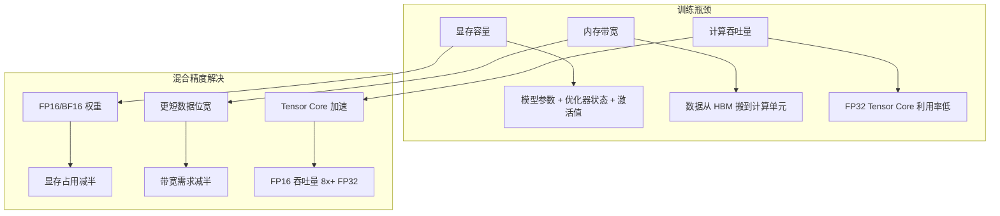

### 精度格式与显存占用

| 精度格式 | 位宽 | 单参数显存 | 1B 参数显存 | Adam 优化器状态 |
|---------|------|-----------|------------|----------------|
| **FP32** | 32 bit | 4 bytes | 4 GB | 8 GB |
| **FP16** | 16 bit | 2 bytes | 2 GB | 4 GB |
| **BF16** | 16 bit | 2 bytes | 2 GB | 4 GB |
| **FP8 (E4M3)** | 8 bit | 1 byte | 1 GB | 2 GB |

> 💡 **关键洞察**: LLM 训练中优化器状态占显存大头。FP16 + FP32 Master + Adam 下 1B 参数约需 **16GB**；若使用 8-bit Adam 可压缩至 **~8GB**。

### Tensor Core 吞吐量对比

| GPU 架构 | FP32 峰值 | FP16/BF16 峰值 | FP8 峰值 | 加速比 |
|---------|----------|---------------|---------|--------|
| V100 (Volta) | 15.7 TFLOPS | 125 TFLOPS | - | **8x** |
| A100 (Ampere) | 19.5 TFLOPS | 312 TFLOPS | - | **16x** |
| H100 (Hopper) | 51 TFLOPS | 989 TFLOPS | 1979 TFLOPS | **19x / 39x** |
| B200 (Blackwell) | ~90 TFLOPS | ~4500 TFLOPS | ~9000 TFLOPS | **50x / 100x** |

> ⚠️ **注意**: 上述为理论峰值。实际加速在 **1.5x - 6x** 之间，取决于模型架构和内存带宽瓶颈。

### 内存带宽收益

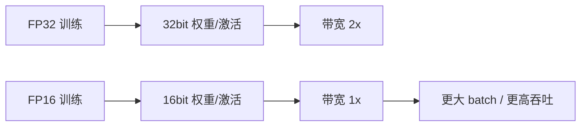

---

## FP16 vs BF16

### 数值格式解剖

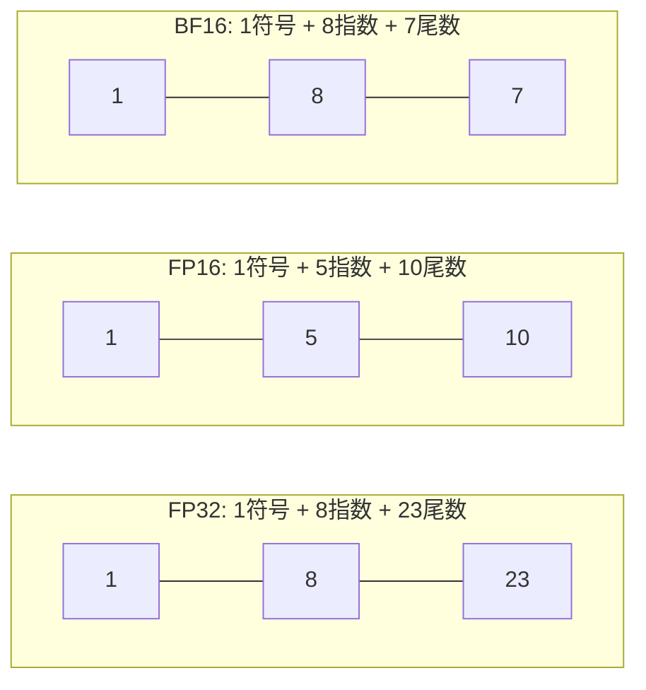

### FP16 vs BF16 对比

| 特性 | FP16 | BF16 | 说明 |
|------|------|------|------|
| **总位宽** | 16 bit | 16 bit | 相同 |
| **指数位** | 5 bit | 8 bit | BF16 与 FP32 相同 |
| **尾数位** | 10 bit | 7 bit | FP16 精度更高 |
| **动态范围** | ~6e-8 to 65504 | ~1.2e-38 to 3.4e38 | BF16 接近 FP32 |
| **最小正数** | 5.96e-8 | 1.18e-38 | BF16 不易下溢 |
| **NaN 风险** | 较高 | 较低 | FP16 范围小易溢出 |
| **Loss Scaling** | 需要 | 不需要 | BF16 更安全 |
| **硬件支持** | Pascal+ | Ampere+ | BF16 需 Tensor Core |

### 何时用 FP16，何时用 BF16

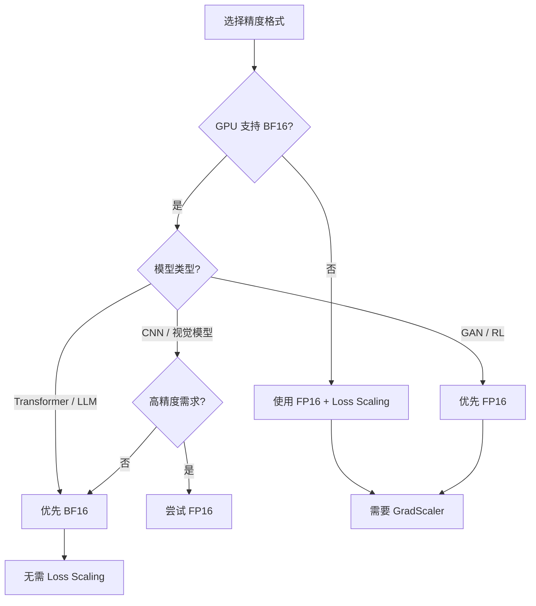

| 场景 | 推荐格式 | 理由 |
|------|---------|------|
| **BERT/GPT/Transformer** | BF16 | 注意力分数范围大，BF16 不易溢出 |
| **Vision Transformer** | BF16 | LayerNorm 后值分布广 |
| **ResNet / CNN** | FP16 或 BF16 | 均可，FP16 精度略高 |
| **GAN / 强化学习** | FP16 | 生成/奖励对精度敏感 |
| **训练不稳定 / NaN** | BF16 | 更大动态范围，容错性强 |

> 🔑 **经验法则**: 硬件支持 BF16 时，**Transformer 无脑选 BF16**；训练 NaN 且已尝试 Loss Scaling，切 BF16 往往立竿见影。

---

## Automatic Mixed Precision (AMP)

### PyTorch AMP 架构

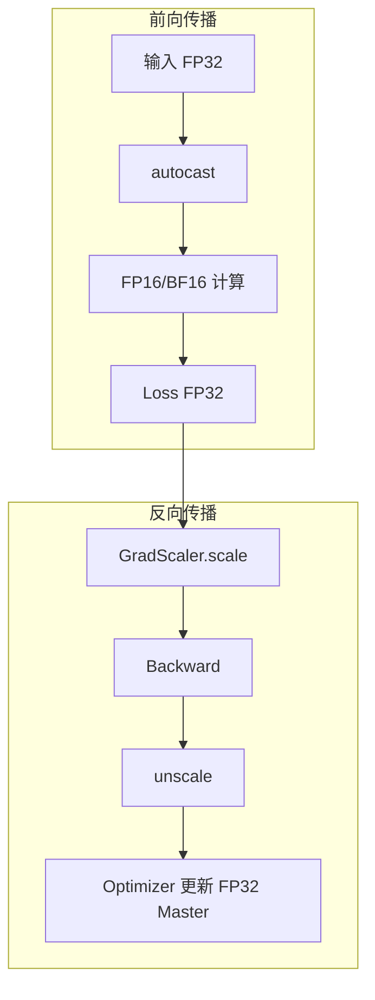

### autocast 的工作原理

`torch.autocast` 自动决定哪些操作使用低精度，哪些保持 FP32：

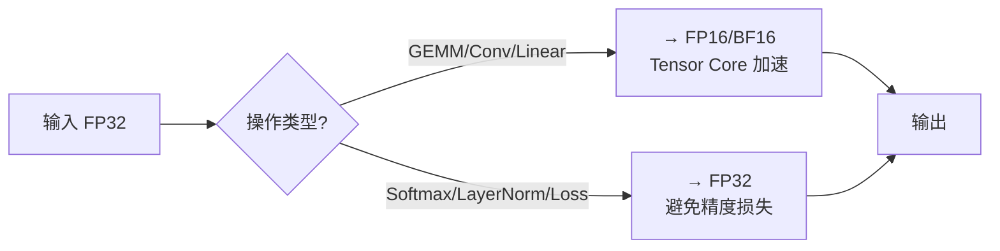

### autocast 操作类型速查

| 操作类别 | 典型操作 | autocast 行为 | 原因 |
|---------|---------|--------------|------|
| **线性代数** | `linear`, `matmul`, `conv` | → FP16/BF16 | Tensor Core 加速 |
| **激活函数** | `relu`, `gelu` | → FP16/BF16 | 逐元素，无精度风险 |
| **归一化** | `batch_norm`, `layer_norm` | → FP32 | 小数值精度关键 |
| **Softmax / CrossEntropy** | `softmax`, `cross_entropy` | → FP32 | 指数易溢出 |
| **Loss 函数** | `mse_loss`, `nll_loss` | → FP32 | 累加精度要求 |
| **优化器更新** | `optimizer.step()` | FP32 权重 | Master Weights |

### GradScaler 机制详解

```mermaid
flowchart TB
    A[开始训练步] --> B[scale(loss)]
    B --> C[backward]
    C --> D{梯度含 Inf/NaN?}
    
    D -->|是| E[跳过更新] --> F[scale *= 0.5] --> H
    D -->|否| G[step(optimizer)] --> I[update scale] --> H
    
    I --> J{连续 N 步无溢出?} -->|是| K[scale *= 2.0] --> H
    J -->|否| H[下一步]
```

| 参数 | 默认值 | 说明 |
|------|--------|------|
| `init_scale` | `65536.0` | 初始缩放因子 |
| `growth_factor` | `2.0` | 无溢出时增长倍数 |
| `backoff_factor` | `0.5` | 溢出时回退倍数 |
| `growth_interval` | `2000` | 增长所需连续步数 |

---

## Loss Scaling

### 为什么需要 Loss Scaling

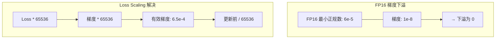

FP16 最小正规数约 $6.1 \times 10^{-5}$，而深度学习梯度常更小，导致**下溢 (underflow)** 为 0，权重无法更新。

### 动态 vs 静态 Loss Scaling

| 特性 | 静态 Loss Scaling | 动态 Loss Scaling (GradScaler) |
|------|------------------|------------------------------|
| **缩放因子** | 固定值 | 自动调整 |
| **适应性** | 差，需人工调参 | 强，自动适应梯度分布 |
| **溢出处理** | 无，可能发散 | 自动检测并跳过 |
| **推荐场景** | 研究/调试 | 生产训练 |

### 梯度下溢/溢出处理策略

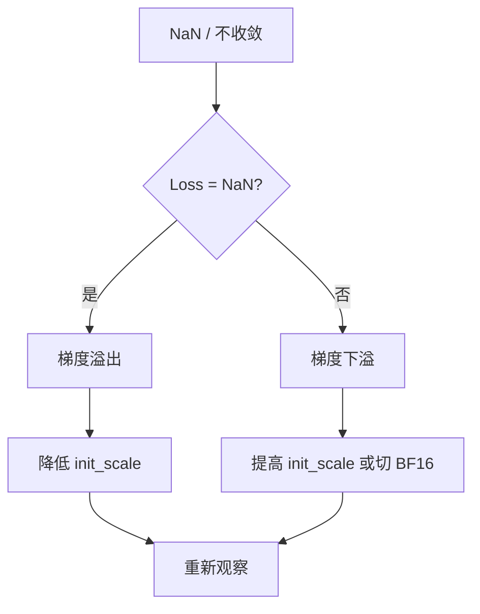

| 现象 | 根因 | 解决策略 |
|------|------|---------|
| **Loss 突然 NaN** | 梯度溢出 | 降低 `init_scale`，检查学习率 |
| **Loss 不降 (FP32 正常)** | 梯度下溢为 0 | 提高 `init_scale`，或切 BF16 |
| **scale 持续下降** | 模型不稳定 | 降低学习率，检查数据归一化 |
| **scale 始终很高** | 梯度分布健康 | 正常现象 |

---

## BF16 训练

### 为什么 BF16 更安全

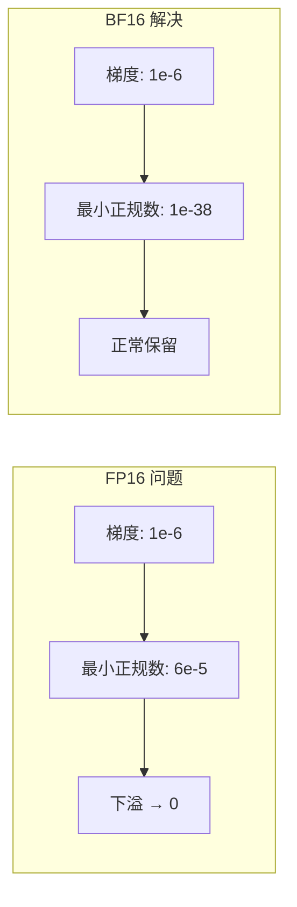

BF16 指数位与 FP32 相同（8 bit），动态范围接近 FP32，**天然避免梯度下溢**。

### BF16 无需 Loss Scaling


| 对比项 | FP16 + AMP | BF16 |
|-------|-----------|------|
| **代码复杂度** | 需要 GradScaler | 无需 GradScaler |
| **超参数调优** | init_scale, growth_interval | 无 |
| **溢出检测** | 需要 | 通常不需要 |
| **有效训练步** | ~98% (偶尔跳过) | 100% |
| **收敛稳定性** | 良好 | 更优 |

### BF16 训练代码片段

```python
import torch
from torch.cuda.amp import autocast

model = model.cuda()
optimizer = torch.optim.AdamW(model.parameters(), lr=1e-4)

for batch in dataloader:
    inputs, targets = batch
    inputs = inputs.cuda()
    targets = targets.cuda()
    
    with autocast(device_type='cuda', dtype=torch.bfloat16):
        outputs = model(inputs)
        loss = criterion(outputs, targets)
    
    loss.backward()
    optimizer.step()
    optimizer.zero_grad()
```

> ⚠️ **注意**: BF16 尾数仅 7 bit，精度低于 FP16。GAN、RL 等需高精度小数位的场景，FP16 可能更合适。

---

## FP8 训练

### FP8 格式简介

Hopper (H100) 和 Blackwell (B200) 引入原生 FP8 Tensor Core。FP8 有两种变体：

| 格式 | 指数位 | 尾数位 | 动态范围 | 典型用途 |
|------|--------|--------|---------|---------|
| **E4M3** | 4 bit | 3 bit | ±448 | 前向激活、权重 |
| **E5M2** | 5 bit | 2 bit | ±57344 | 梯度、反向传播 |

### Transformer Engine

[NVIDIA Transformer Engine (TE)](https://github.com/NVIDIA/TransformerEngine) 是 FP8 训练核心库，通过**per-tensor scaling** 动态管理 FP8 精度：

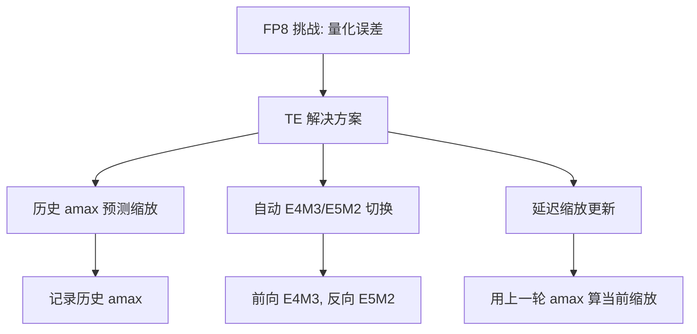

| TE 特性 | 说明 |
|---------|------|
| **Recipe** | `DelayedScaling`, `MXFP8` |
| **自动精度切换** | 前向 E4M3，反向 E5M2 |
| **Scaling Factor** | 基于历史 amax 动态计算 |
| **回退机制** | FP8 不可行时自动回退 FP16/BF16 |
| **融合算子** | LayerNorm + GEMM 融合 |

### FP8 训练收益

| 指标 | FP16/BF16 | FP8 | 提升 |
|------|----------|-----|------|
| **峰值算力 (H100)** | 989 TFLOPS | 1979 TFLOPS | **2x** |
| **显存占用** | 100% | ~50% | **2x** |
| **实际训练吞吐** | 基准 | 1.5x - 2.0x | **显著** |
| **端到端收敛** | 基准 | 基本一致 | **可接受** |

> ⚠️ **FP8 限制**: 需 Hopper+；主要适用 Transformer；需 TE 库支持；Embedding/Loss 仍需 FP32/BF16。

---

## 实战代码

### 1. PyTorch FP16 AMP 完整训练循环

```python
import torch
import torch.nn as nn
from torch.cuda.amp import autocast, GradScaler

model = MyTransformerModel().cuda()
criterion = nn.CrossEntropyLoss()
optimizer = torch.optim.AdamW(model.parameters(), lr=1e-4, weight_decay=0.01)
scaler = GradScaler()

model.train()
for epoch in range(num_epochs):
    for batch_idx, (inputs, targets) in enumerate(dataloader):
        inputs = inputs.cuda(non_blocking=True)
        targets = targets.cuda(non_blocking=True)
        
        # 前向：autocast 自动将支持 op 转为 FP16
        with autocast(device_type='cuda', dtype=torch.float16):
            outputs = model(inputs)
            loss = criterion(outputs, targets)
        
        # 缩放 loss 并反向传播
        scaler.scale(loss).backward()
        
        # scaler.step 先检查 Inf/NaN；有则跳过并降 scale，无则正常更新
        scaler.step(optimizer)
        scaler.update()
        optimizer.zero_grad(set_to_none=True)
        
        if batch_idx % 100 == 0:
            print(f"Epoch {epoch} Batch {batch_idx}: "
                  f"Loss={loss.item():.4f} Scale={scaler.get_scale()}")
```

### 2. PyTorch BF16 完整训练循环

```python
import torch
import torch.nn as nn

assert torch.cuda.is_bf16_supported(), "当前 GPU 不支持 BF16"

model = MyTransformerModel().cuda()
criterion = nn.CrossEntropyLoss()
optimizer = torch.optim.AdamW(model.parameters(), lr=1e-4)

model.train()
for epoch in range(num_epochs):
    for inputs, targets in dataloader:
        inputs = inputs.cuda(non_blocking=True)
        targets = targets.cuda(non_blocking=True)
        
        with autocast(device_type='cuda', dtype=torch.bfloat16):
            outputs = model(inputs)
            loss = criterion(outputs, targets)
        
        loss.backward()
        torch.nn.utils.clip_grad_norm_(model.parameters(), max_norm=1.0)
        optimizer.step()
        optimizer.zero_grad(set_to_none=True)
```

### 3. FSDP + BF16 分布式训练

```python
import torch
import torch.distributed as dist
from torch.distributed.fsdp import FullyShardedDataParallel as FSDP
from torch.distributed.fsdp import MixedPrecision
from torch.cuda.amp import autocast

dist.init_process_group("nccl")
local_rank = int(os.environ["LOCAL_RANK"])
torch.cuda.set_device(local_rank)

model = MyTransformerModel().cuda()

mp_policy = MixedPrecision(
    param_dtype=torch.bfloat16,
    reduce_dtype=torch.bfloat16,
    buffer_dtype=torch.float32
)

model = FSDP(
    model,
    mixed_precision=mp_policy,
    device_id=torch.cuda.current_device()
)

optimizer = torch.optim.AdamW(model.parameters(), lr=1e-4)

for inputs, targets in dataloader:
    inputs = inputs.cuda()
    targets = targets.cuda()
    
    with autocast(device_type='cuda', dtype=torch.bfloat16):
        outputs = model(inputs)
        loss = criterion(outputs, targets)
    
    loss.backward()
    optimizer.step()
    optimizer.zero_grad()
```

### 4. FP8 训练 with TransformerEngine

```python
# pip install transformer-engine[pytorch]
import torch
import transformer_engine.pytorch as te
from transformer_engine.common.recipe import Format, DelayedScaling

class FP8TransformerLayer(nn.Module):
    def __init__(self, hidden_size):
        super().__init__()
        self.qkv = te.Linear(hidden_size, hidden_size * 3, bias=True)
        self.out = te.Linear(hidden_size, hidden_size, bias=True)
        self.ln = te.LayerNorm(hidden_size)
        
    def forward(self, x):
        qkv = self.qkv(x)
        out = self.out(qkv)
        return self.ln(out + x)

fp8_recipe = DelayedScaling(
    fp8_format=Format.E4M3,
    amax_history_len=1024,
    amax_compute_algo="max"
)

model = MyFP8Model().cuda()
optimizer = torch.optim.AdamW(model.parameters(), lr=1e-4)

for inputs, targets in dataloader:
    inputs = inputs.cuda()
    targets = targets.cuda()
    
    with te.fp8_autocast(enabled=True, fp8_recipe=fp8_recipe):
        outputs = model(inputs)
        loss = criterion(outputs, targets)
    
    loss.backward()
    optimizer.step()
    optimizer.zero_grad()
```

### 5. 检查当前环境的混合精度支持

```python
import torch

def check_mixed_precision_support():
    if not torch.cuda.is_available():
        print("❌ CUDA 不可用")
        return
    
    props = torch.cuda.get_device_properties(0)
    capability = props.major, props.minor
    
    print(f"GPU: {props.name}")
    print(f"计算能力: {capability[0]}.{capability[1]}")
    print(f"显存: {props.total_memory / 1e9:.1f} GB")
    
    fp16_supported = capability[0] >= 6
    bf16_supported = capability[0] >= 8
    fp8_supported = capability[0] >= 9
    
    print(f"FP16 Tensor Core: {'✅' if fp16_supported else '❌'}")
    print(f"BF16 Tensor Core: {'✅' if bf16_supported else '❌'}")
    print(f"FP8 Tensor Core: {'✅' if fp8_supported else '❌'}")
    print(f"PyTorch BF16: {'✅' if torch.cuda.is_bf16_supported() else '❌'}")
    
    try:
        import transformer_engine.pytorch as te
        print("Transformer Engine: ✅")
    except ImportError:
        print("Transformer Engine: ❌ (pip install transformer-engine[pytorch])")

check_mixed_precision_support()
```

---

## 精度保持技巧

### Master Weights in FP32

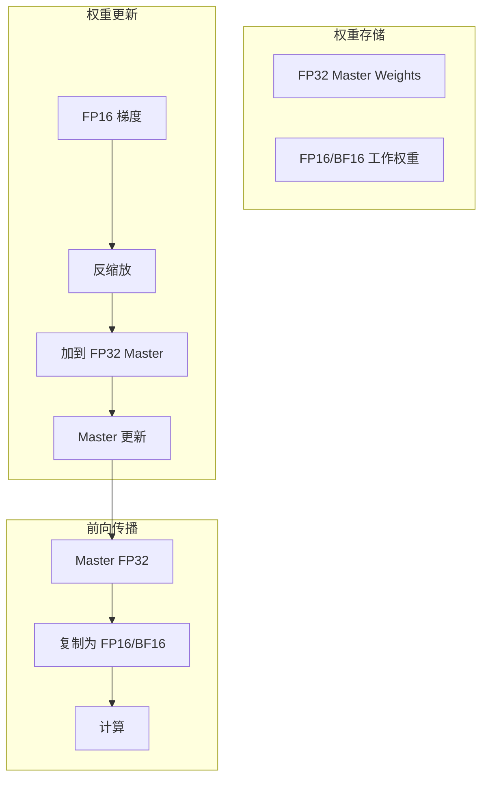

| 配置 | 显存占用 | 精度 | 推荐 |
|------|---------|------|------|
| **纯 FP16** | 最小 | 低 | ❌ 不推荐 |
| **FP16 + FP32 Master** | 中 | 高 | ✅ FP16 标准方案 |
| **BF16 + FP32 Master** | 中 | 高 | ✅ BF16 标准方案 |
| **BF16 (无 Master)** | 小 | 中 | ⚠️ 大模型可尝试 |

> 💡 **PyTorch AMP 默认行为**: 参数保持 FP32，前向时临时转 FP16/BF16，优化器在 FP32 更新。用户无需手动管理 Master Weights。

### LayerNorm / BatchNorm 保持 FP32

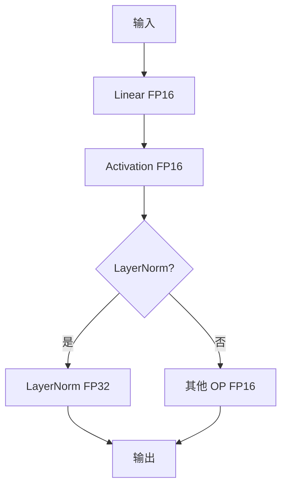

```python
class StableTransformerBlock(nn.Module):
    def __init__(self, hidden_size):
        super().__init__()
        self.ln = nn.LayerNorm(hidden_size, dtype=torch.float32)
        self.linear = nn.Linear(hidden_size, hidden_size)
        
    def forward(self, x):
        normalized = self.ln(x.float())
        return self.linear(normalized.to(x.dtype))
```

### 梯度裁剪与混合精度

```python
# 错误：裁剪 scaled 梯度
scaler.scale(loss).backward()
torch.nn.utils.clip_grad_norm_(model.parameters(), max_norm=1.0)  # ❌
scaler.step(optimizer)

# 正确：先 unscale，再裁剪
scaler.scale(loss).backward()
scaler.unscale_(optimizer)  # 先反缩放
torch.nn.utils.clip_grad_norm_(model.parameters(), max_norm=1.0)  # ✅
scaler.step(optimizer)
scaler.update()
```

| 技巧 | 作用 | 实现方式 |
|------|------|---------|
| **FP32 Master Weights** | 避免权重更新精度损失 | AMP 自动处理 |
| **LayerNorm FP32** | 小数值稳定 | autocast 自动 + 手动兜底 |
| **Softmax FP32** | 指数不溢出 | autocast 自动 |
| **Loss FP32** | 累加精度 | autocast 自动 |
| **梯度裁剪** | 防梯度爆炸 | `unscale_` 后裁剪 |
| **Gradient Accumulation** | 模拟大 batch | 注意 scale 时机 |

### Gradient Accumulation 与 AMP

```python
accumulation_steps = 4
scaler = GradScaler()

for batch_idx, (inputs, targets) in enumerate(dataloader):
    with autocast(device_type='cuda', dtype=torch.float16):
        outputs = model(inputs)
        loss = criterion(outputs, targets) / accumulation_steps
    
    scaler.scale(loss).backward()
    
    if (batch_idx + 1) % accumulation_steps == 0:
        scaler.unscale_(optimizer)
        torch.nn.utils.clip_grad_norm_(model.parameters(), max_norm=1.0)
        scaler.step(optimizer)
        scaler.update()
        optimizer.zero_grad()
```

---

## 常见问题 FAQ

### Q1: 训练出现 Loss NaN，如何排查？

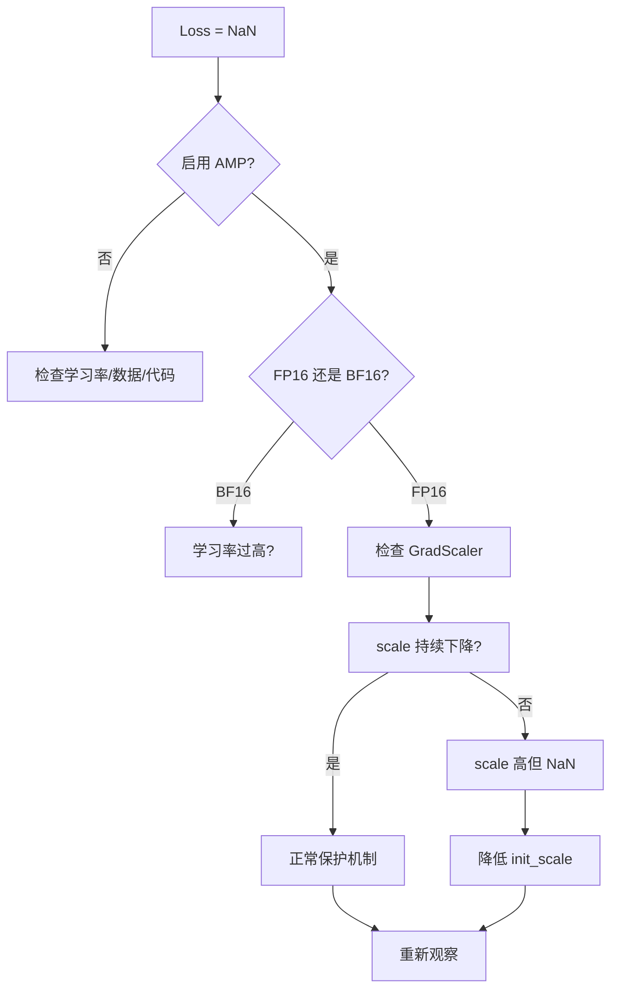

**排查清单**:

| 检查项 | 方法 | 预期 |
|--------|------|------|
| Scale 值 | `scaler.get_scale()` | 不持续暴跌到 <1 |
| 输入数据 | `torch.isfinite(inputs).all()` | `True` |
| 模型权重 | `torch.isfinite(p).all()` | `True` |
| 学习率 | 对比 FP32 基线 | 不过高 |

### Q2: BF16 比 FP16 慢，正常吗？

**A**: BF16 在**不支持原生 BF16 Tensor Core** 的 GPU 上可能走软件模拟。

| GPU | BF16 硬件支持 | 预期 |
|-----|-------------|------|
| V100 | ❌ | 极慢 |
| A100/H100 | ✅ | 与 FP16 相当 |
| T4 / RTX 3090/4090 | ❌ | 慢或报错 |

```python
print(f"SM: {torch.cuda.get_device_capability()}")
print(f"BF16: {torch.cuda.is_bf16_supported()}")
```

### Q3: 模型精度下降，混合精度导致了吗？

| 步骤 | 操作 | 判断 |
|------|------|------|
| 1 | 训练 FP32 基线 | 确认 FP32 正常 |
| 2 | 对比 FP16 vs BF16 | BF16 通常更稳定 |
| 3 | 检查 LayerNorm/Softmax | 确保 FP32 |
| 4 | FP32 推理测试 | 排除训练精度问题 |
| 5 | 对比下游任务指标 | 非 Loss |

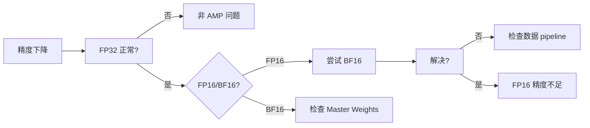

### Q4: 混合精度与分布式训练 (DDP/FSDP) 如何配合？

| 框架 | 混合精度方式 | 注意事项 |
|------|------------|---------|
| **PyTorch DDP + AMP** | `autocast` + `GradScaler` | 各 rank 独立 scaler |
| **PyTorch FSDP** | `MixedPrecision` 策略 | 显存优化更激进 |
| **DeepSpeed** | `fp16` / `bf16` 配置 | ZeRO + AMP 组合 |
| **Megatron-LM** | 内置 BF16/FP8 | 专为 Transformer 优化 |

```python
# DDP + AMP
from torch.nn.parallel import DistributedDataParallel as DDP

model = DDP(model)
scaler = GradScaler()

with autocast(device_type='cuda', dtype=torch.float16):
    loss = model(inputs).loss

scaler.scale(loss).backward()
scaler.step(optimizer)
scaler.update()
```

### Q5: FP8 训练需要修改模型代码吗？

| 方式 | 修改量 | 性能 | 推荐 |
|------|--------|------|------|
| **TE 替换层** | 中 | 高 | ✅ 生产 |
| **PyTorch 原生 FP8** | 高 | 中 | ⚠️ 研究 |
| **HuggingFace TE** | 低 | 高 | ✅ 优先尝试 |

```python
from transformers import TrainingArguments

training_args = TrainingArguments(
    output_dir="./output",
    fp8=True,  # 一键启用 (需 TE 后端)
)
```

### Q6: 为什么我的 AMP 训练没有加速？

| 原因 | 说明 | 解决 |
|------|------|------|
| **GPU 无 Tensor Core** | Pascal 之前 | 换 GPU 或不用 AMP |
| **模型太小** | AMP 开销 > 收益 | < 1M 参数可能无收益 |
| **CPU 瓶颈** | DataLoader 慢 | 增加 `num_workers`, `pin_memory=True` |
| **Batch Size 太小** | 无法饱和 GPU | 增大 batch 或梯度累积 |
| **频繁 CPU-GPU 同步** | `item()`, `.cpu()` | 减少同步点 |

### Q7: 混合精度与模型量化 (INT8/INT4) 的区别？

| 特性 | 混合精度训练 (FP16/BF16/FP8) | 训练后量化 (INT8/INT4) |
|------|---------------------------|----------------------|
| **阶段** | 训练时 | 推理时 |
| **目的** | 加速训练、省显存 | 加速推理、省显存 |
| **精度损失** | 通常 < 0.1% | 1-5% 或更多 |
| **是否需要 fine-tune** | 本身就是训练 | QAT 需要，PTQ 不需要 |
| **代表技术** | AMP, TransformerEngine | GPTQ, AWQ, SmoothQuant |

---

## 📊 快速选型决策表

| 你的情况 | 推荐方案 | 代码关键词 |
|---------|---------|-----------|
| A100/H100 + Transformer | **BF16** | `autocast(dtype=torch.bfloat16)` |
| V100 / 旧 GPU | **FP16 + GradScaler** | `autocast(dtype=torch.float16)` + `GradScaler()` |
| H100/B200 + 大 Transformer | **FP8 + TE** | `te.fp8_autocast()` |
| 训练不稳定 / NaN | **切换到 BF16** | `dtype=torch.bfloat16` |
| 显存极度紧张 | **FP8 或 8-bit 优化器** | `bitsandbytes` / `TE` |
| 需要精确复现 | **FP32 基线** | 不用 AMP |
| 分布式大模型 | **FSDP + BF16** | `MixedPrecision(param_dtype=bf16)` |

---

## 🔗 相关章节

- 更多训练优化技巧 → [训练优化 2026](./Training_Optimization_2026.md)
- 分布式训练中的混合精度 → [分布式训练 2026](./Distributed_Training_2026.md)
- 优化器基础与原理 → [../03_Deep_Learning/Optimization/Optimization.md](../03_Deep_Learning/Optimization/Optimization.md)
- 模型评估指标 → [../08_Model_Evaluation/Model_Evaluation.md](../08_Model_Evaluation/Model_Evaluation.md)
- 部署推理优化 → [../09_Deployment_Inference/Inference-in-nutshell.md](../09_Deployment_Inference/Inference-in-nutshell.md)

---

## 📚 扩展阅读

| 资源 | 链接 | 说明 |
|------|------|------|
| PyTorch AMP 官方文档 | https://pytorch.org/docs/stable/amp.html | API 参考 |
| NVIDIA Transformer Engine | https://github.com/NVIDIA/TransformerEngine | FP8 训练库 |
| Mixed Precision Paper | Micikevicius et al., 2018 | 原始 FP16 论文 |
| BF16 Paper | Google Brain, 2019 | Brain Floating Point |
| FP8 Paper | Noune et al., 2022 | 8-bit 数值格式 |

---

*Last updated: 2026-05-07*
