# 模型训练速成指南

> 🎯 **目标**：用最简单的方式理解如何从零开始训练 AI/ML 模型。

---

## 🤔 什么是模型训练？

模型训练就像 **教小孩认识动物**：
- 你展示图片："这是狗"、"这是猫"
- 小孩学习规律：狗有某些特征，猫有其他特征
- 最终，他们能识别从未见过的新动物

**模型训练是同样的过程，只不过是教计算机。**


---

## 🧩 核心组件

### 整体架构

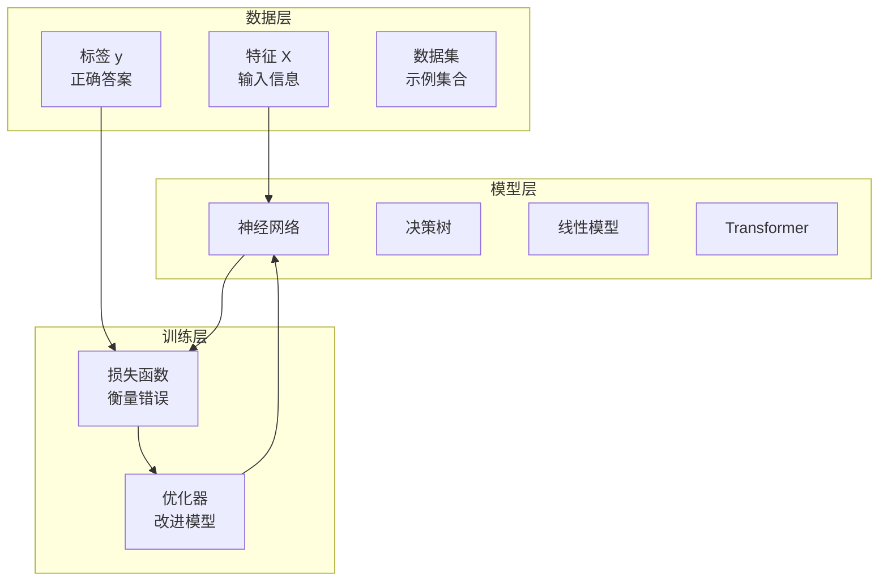

### 1. 训练数据
模型的"教科书"。

| 组件 | 含义 | 示例 |
|------|------|------|
| **特征 (X)** | 输入信息 | 图像像素、文本词语 |
| **标签 (y)** | 正确答案 | "猫"、"垃圾邮件"、"正面" |
| **数据集** | 示例集合 | 10,000 张标注图片 |

### 2. 模型架构
将要学习的"大脑结构"。

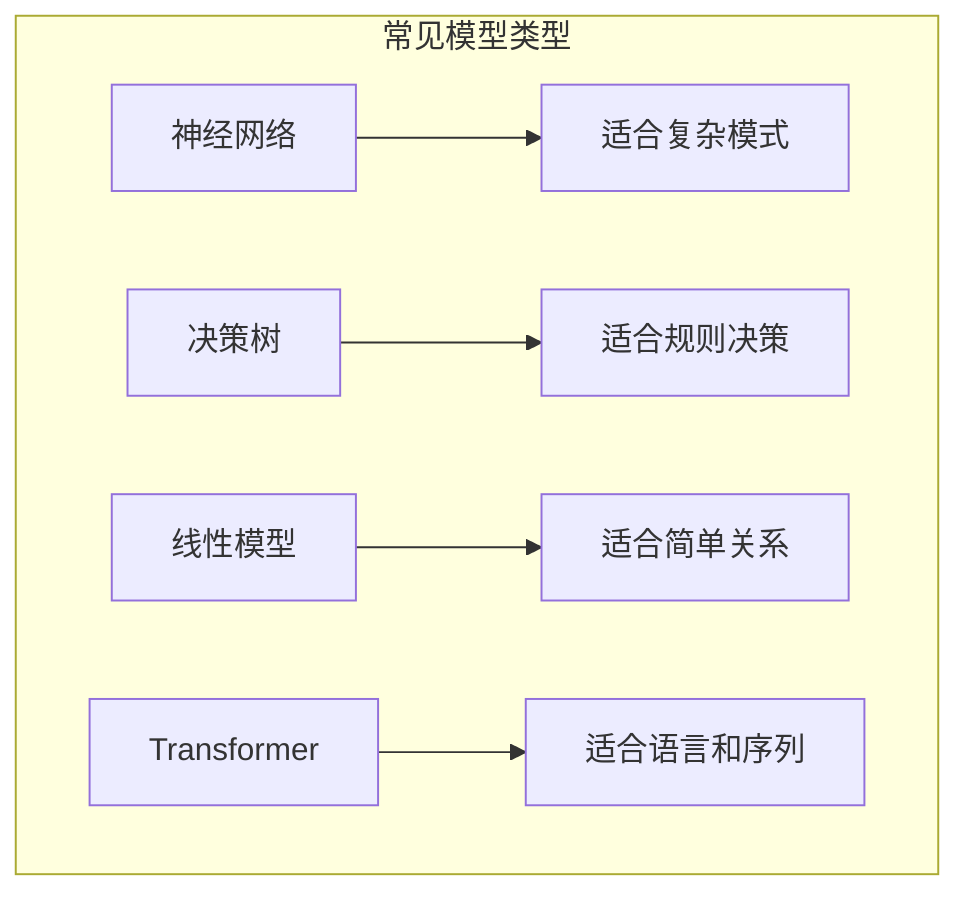

### 3. 损失函数
衡量模型"错得多离谱"。

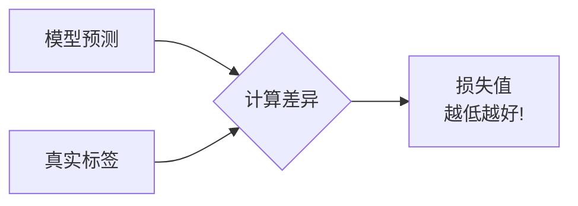

### 4. 优化器
改进模型的"教练"。

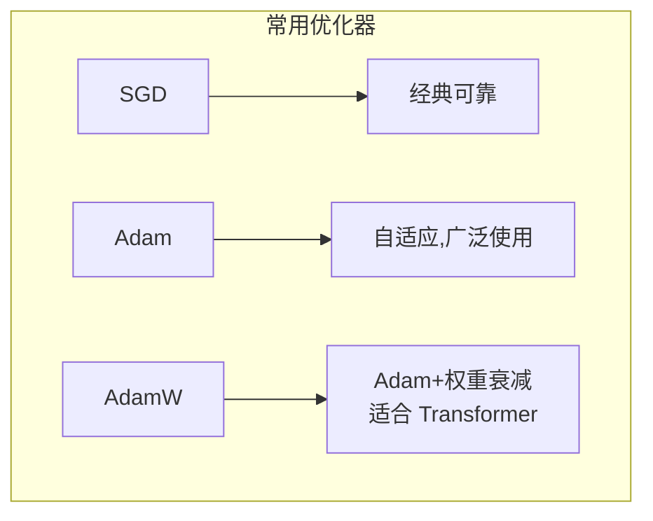

---

## 📋 训练流程详解

### 训练循环

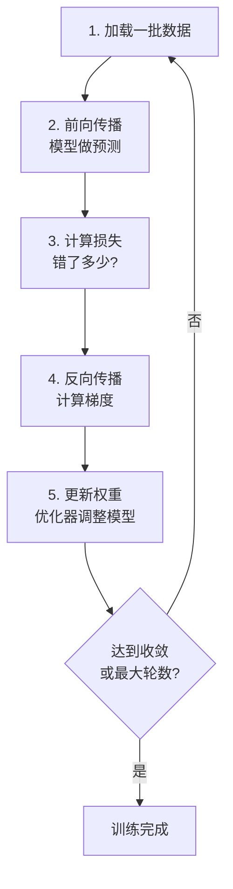

### Python 示例 (PyTorch)

```python
import torch
import torch.nn as nn
import torch.optim as optim

# 1. 准备模型
model = YourModel()

# 2. 定义损失函数
criterion = nn.CrossEntropyLoss()

# 3. 定义优化器
optimizer = optim.Adam(model.parameters(), lr=0.001)

# 4. 训练循环
for epoch in range(num_epochs):
    for batch_data, batch_labels in dataloader:
        
        # 前向传播
        outputs = model(batch_data)
        loss = criterion(outputs, batch_labels)
        
        # 反向传播
        optimizer.zero_grad()  # 清除旧梯度
        loss.backward()        # 计算新梯度
        optimizer.step()       # 更新权重
        
    print(f"轮次 {epoch}, 损失: {loss.item()}")
```

---

## 🔧 关键超参数

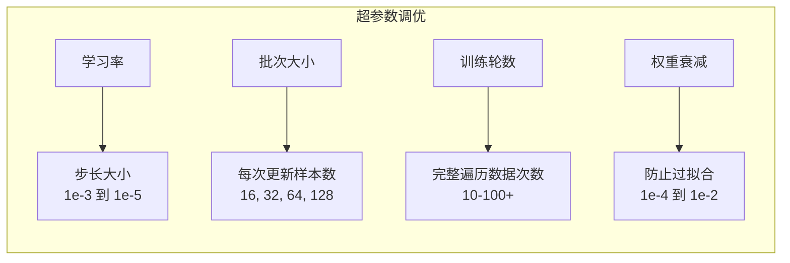

| 参数 | 作用 | 典型值 | 提示 |
|------|------|--------|------|
| **学习率** | 更新步长 | 1e-3 到 1e-5 | 从 1e-3 开始，不稳定就降低 |
| **批次大小** | 每次更新样本数 | 16, 32, 64, 128 | 越大越稳定，但需要更多内存 |
| **训练轮数** | 完整遍历数据次数 | 10-100+ | 使用早停法 |
| **权重衰减** | 防止过拟合 | 1e-4 到 1e-2 | 正则化技术 |

---

## 📊 监控训练

### 关键指标观察

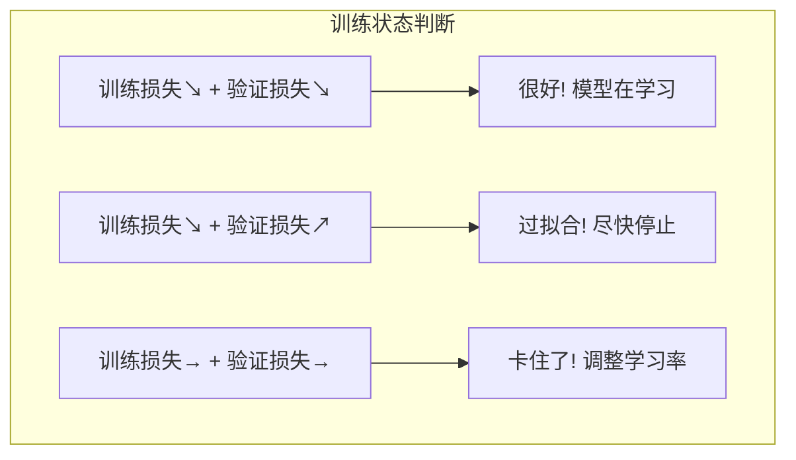

### 监控工具

```bash
# TensorBoard（最常用）
pip install tensorboard
tensorboard --logdir=./logs

# Weights & Biases (W&B)
pip install wandb
wandb login
```

---

## 🛠️ 运维实操清单

### 训练前检查


```bash
# 检查 GPU 可用性
nvidia-smi

# 检查磁盘空间（存储检查点）
df -h

# 验证数据加载
python -c "from dataset import load_data; load_data()"
```

### 训练中监控

```bash
# 监控 GPU 使用
watch -n 1 nvidia-smi

# 查看训练日志
tail -f training.log

# 监控系统资源
htop
```

### 训练后操作

```bash
# 保存模型
torch.save(model.state_dict(), 'model_checkpoint.pt')

# 在测试集评估
python evaluate.py --model model_checkpoint.pt

# 导出部署格式
python export_model.py --format onnx
```

---

## ⚠️ 常见问题与解决方案

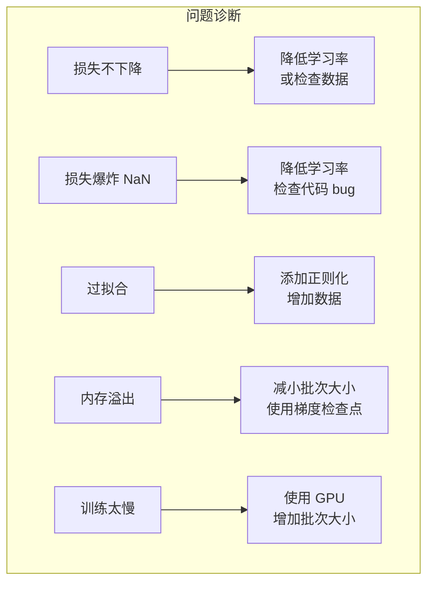

| 问题 | 症状 | 解决方案 |
|------|------|----------|
| **损失不下降** | 损失保持平稳 | 降低学习率或检查数据 |
| **损失爆炸 (NaN)** | 损失变成无穷大 | 降低学习率，检查 bug |
| **过拟合** | 验证损失上升 | 添加正则化，增加数据 |
| **内存溢出** | CUDA OOM 错误 | 减小批次大小，使用梯度检查点 |
| **训练太慢** | 耗时过长 | 使用 GPU，增加批次大小 |

---

## 💡 最佳实践

### 1. 始终划分数据

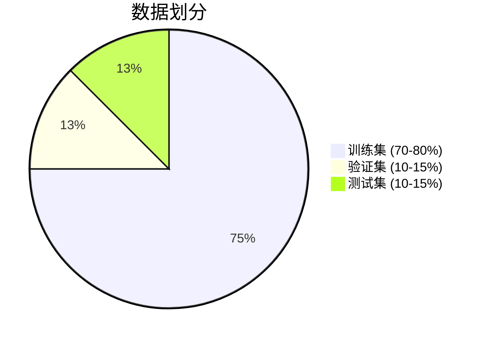

### 2. 使用早停法

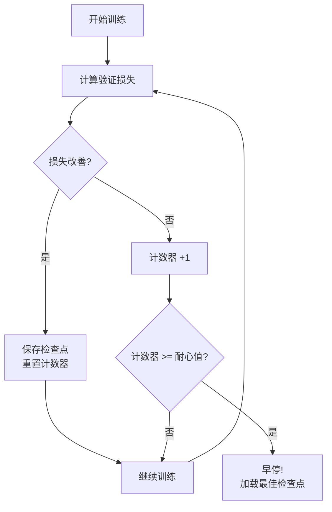

```python
# 如果验证损失连续 N 轮不改善就停止
patience = 5
best_loss = float('inf')
counter = 0

for epoch in range(max_epochs):
    val_loss = validate()
    if val_loss < best_loss:
        best_loss = val_loss
        save_checkpoint()
        counter = 0
    else:
        counter += 1
        if counter >= patience:
            print("早停!")
            break
```

### 3. 定期保存检查点

```python
# 每 N 轮保存一次
if epoch % save_interval == 0:
    torch.save({
        'epoch': epoch,
        'model_state_dict': model.state_dict(),
        'optimizer_state_dict': optimizer.state_dict(),
        'loss': loss,
    }, f'checkpoint_epoch_{epoch}.pt')
```

---

## 🚀 快速上手命令

```bash
# 典型训练命令结构
python train.py \
    --data_path /path/to/data \
    --model_name bert-base \
    --batch_size 32 \
    --learning_rate 1e-4 \
    --epochs 10 \
    --output_dir ./output \
    --save_steps 1000 \
    --logging_steps 100

# 从检查点恢复训练
python train.py \
    --resume_from_checkpoint ./output/checkpoint-5000
```

---

## 📚 核心要点

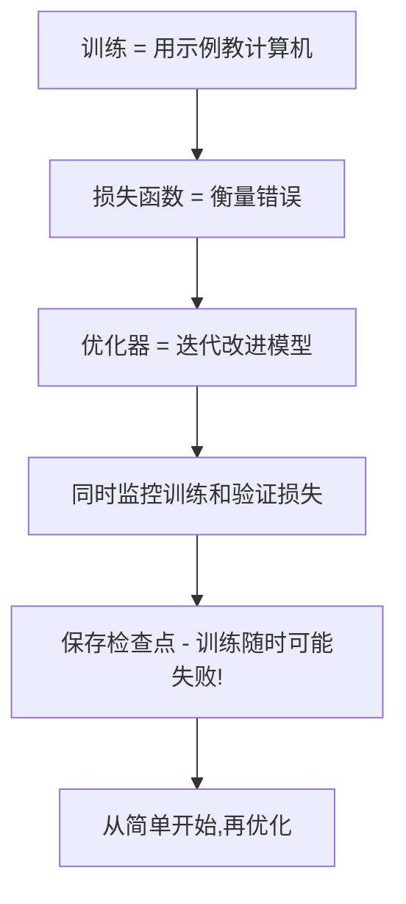

---

## 🔗 相关主题

- 学习 [推理](../10_Deployment_Inference/Inference-in-nutshell.md) - 使用训练好的模型
- 探索 [MLOps](../MLOps_Pipeline/) - 自动化训练流水线
- 理解 [模型评估](../Model_Evaluation/) - 衡量模型质量

## Related

- [[07_Model_Training/Distributed_Training/Distributed_Training_2026]] — Distributed Training 2026 (共享: distributed-training, fsdp, model-training, optimization)
- [[07_Model_Training/Distributed_Training/Distributed_Training_for_dummy]] — 分布式训练 - 小白版 (共享: distributed-training, fsdp, model-training, optimization)
- [[07_Model_Training/Optimization/Mixed_Precision_Training]] — 混合精度训练 (Mixed Precision Training) (共享: distributed-training, fsdp, model-training, optimization)
- [[07_Model_Training/Model_Training_for_dummy]] — 模型训练小白指南 (共享: distributed-training, fsdp, model-training, optimization)
- [[07_Model_Training/Fine_tuning_Strategies.md|Fine_tuning_Strategies]]
