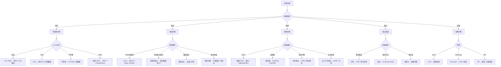

# 模型问题排查手册 — 预训练/微调/推理全链路故障诊断

> **一句话理解**: 模型排查就像看病——先望闻问切（看 loss 曲线、梯度范数、日志），再对症下药（调 LR、换数据、改架构），最后复查验收（benchmark 评测）。

---

## 快速诊断流程



---

## Part 1: 预训练问题 (Pre-training Issues)

### 1.1 Loss Spike (损失突刺)

**症状**: Loss 曲线中出现突然的尖峰，可能恢复也可能持续恶化。

**常见原因**:
| 原因 | 概率 | 诊断方法 |
|------|------|---------|
| 学习率过大 | 40% | 检查 spike 是否发生在 LR 变化点 |
| 数据质量问题 | 25% | 检查 spike 时刻 batch 中的异常样本 |
| 梯度爆炸 | 20% | 监控梯度范数 (gradient norm) |
| Batch 中极端样本 | 15% | 对比 spike batch vs 正常 batch 统计 |

**诊断代码**:
```python
# 梯度监控 — 在每个 training step 后添加
def monitor_gradients(model, step, log_interval=100):
    if step % log_interval == 0:
        total_norm = 0.0
        for name, param in model.named_parameters():
            if param.grad is not None:
                param_norm = param.grad.data.norm(2).item()
                total_norm += param_norm ** 2
                if param_norm > 100:  # 单个参数梯度异常
                    print(f"⚠️ Step {step}: {name} grad norm = {param_norm:.2f}")
        total_norm = total_norm ** 0.5
        print(f"Step {step}: Total gradient norm = {total_norm:.4f}")
        if total_norm > 10:
            print(f"🚨 Gradient explosion detected! Consider clipping.")
```

**解决方案**:

| 方案 | 实施 | 效果 |
|------|------|------|
| Gradient Clipping | `torch.nn.utils.clip_grad_norm_(model.parameters(), max_norm=1.0)` | 防止梯度爆炸 |
| LR Warmup | 前 2000 步线性增长到目标 LR | 避免初始不稳定 |
| Skip Bad Batch | 检测 loss > 3× moving_avg 时跳过 | 过滤异常样本 |
| 数据去重 | MinHash deduplication | 减少重复导致的 spike |

```python
# 自动跳过异常 batch
class SafeTrainer:
    def __init__(self, loss_threshold_multiplier=3.0):
        self.loss_history = []
        self.threshold_mult = loss_threshold_multiplier
    
    def should_skip_batch(self, loss):
        if len(self.loss_history) < 100:
            self.loss_history.append(loss)
            return False
        moving_avg = sum(self.loss_history[-100:]) / 100
        if loss > moving_avg * self.threshold_mult:
            print(f"⚠️ Skipping batch: loss={loss:.4f} > {moving_avg * self.threshold_mult:.4f}")
            return True
        self.loss_history.append(loss)
        return False
```

### 1.2 NaN Loss

**症状**: Loss 变成 NaN，训练完全崩溃，所有权重被污染。

**原因与解决**:

| 原因 | 诊断 | 解决 |
|------|------|------|
| FP16 数值溢出 | 检查 activation 值范围 | 切换到 BF16 (更大动态范围) |
| 学习率过大 | NaN 出现在 LR 增大后 | 降低 LR 到 1e-4 以下 |
| 数据含 NaN/Inf | `torch.isnan(tensor).any()` | 数据清洗 |
| log(0) 或除零 | 检查 loss 计算 | 添加 epsilon: `log(x + 1e-8)` |
| Gradient 累积溢出 | GradScaler 报错 | 增大 loss scaling 初始值 |

```python
# NaN 检测与自动恢复
def train_step_with_nan_check(model, batch, optimizer, scaler):
    # Forward
    with torch.autocast(device_type='cuda', dtype=torch.bfloat16):
        loss = model(batch).loss
    
    # NaN 检测
    if torch.isnan(loss) or torch.isinf(loss):
        print("🚨 NaN/Inf detected! Skipping batch.")
        optimizer.zero_grad()
        return float('inf')
    
    # Backward with gradient check
    scaler.scale(loss).backward()
    
    # 梯度 NaN 检查
    has_nan_grad = any(
        p.grad is not None and (torch.isnan(p.grad).any() or torch.isinf(p.grad).any())
        for p in model.parameters()
    )
    if has_nan_grad:
        print("🚨 NaN gradient! Zeroing and skipping.")
        optimizer.zero_grad()
        return float('inf')
    
    scaler.step(optimizer)
    scaler.update()
    optimizer.zero_grad()
    return loss.item()
```

### 1.3 训练不收敛

**症状**: Loss 震荡不下降，或下降极其缓慢。

**诊断清单**:
1. ✅ 学习率是否合适? → 运行 LR Range Test
2. ✅ 数据配比是否均衡? → 分数据源统计 loss
3. ✅ 模型容量是否足够? → 检查 scaling law 预测
4. ✅ Tokenizer 是否匹配? → 检查 fertility ratio
5. ✅ Optimizer 状态是否正常? → 检查 Adam 的 m, v 分布

```python
# Learning Rate Range Test
def lr_range_test(model, dataloader, min_lr=1e-7, max_lr=1e-2, steps=200):
    """找到最优学习率范围"""
    optimizer = torch.optim.AdamW(model.parameters(), lr=min_lr)
    scheduler = torch.optim.lr_scheduler.ExponentialLR(
        optimizer, gamma=(max_lr / min_lr) ** (1 / steps)
    )
    losses, lrs = [], []
    
    for i, batch in enumerate(dataloader):
        if i >= steps:
            break
        loss = model(batch).loss
        loss.backward()
        optimizer.step()
        scheduler.step()
        optimizer.zero_grad()
        losses.append(loss.item())
        lrs.append(optimizer.param_groups[0]['lr'])
    
    # 找 loss 下降最快的 LR (梯度最小点)
    best_idx = min(range(1, len(losses)-1), 
                   key=lambda i: losses[i+1] - losses[i-1])
    optimal_lr = lrs[best_idx] / 10  # 取最快下降点的 1/10
    print(f"推荐学习率: {optimal_lr:.2e}")
    return lrs, losses
```

### 1.4 训练 OOM

| 方案 | 内存节省 | 速度影响 | 适用场景 |
|------|---------|---------|---------|
| Gradient Checkpointing | ~60% | 慢 20-30% | 通用 |
| Gradient Accumulation | 等效增大 batch | 无 | batch size 受限 |
| DeepSpeed ZeRO-2 | ~50% | 慢 5-10% | 多 GPU |
| DeepSpeed ZeRO-3 | ~80% | 慢 15-25% | 超大模型 |
| FSDP (PyTorch) | ~70% | 慢 10% | PyTorch 原生 |
| 模型并行 (TP/PP) | 按 GPU 分 | 通信开销 | 超大规模 |
| 减小 batch size | 线性 | 无 | 快速解决 |

---

## Part 2: 微调问题 (Fine-tuning Issues)

### 2.1 LoRA / QLoRA 问题

#### LoRA 训练 loss 不下降

| 原因 | 诊断 | 解决 |
|------|------|------|
| rank 太小 | r=4 对复杂任务不够 | 增大到 r=16/32/64 |
| 学习率不当 | LoRA 需要比全微调更高的 LR | 使用 1e-4 ~ 3e-4 |
| target_modules 选错 | 只选了 q_proj | 添加 v_proj, k_proj, o_proj, gate/up/down |
| 数据格式错误 | chat template 不匹配 | 检查 tokenizer.apply_chat_template |

```python
# LoRA rank 选择指南
LORA_RANK_GUIDE = {
    "简单分类/格式调整": {"r": 8, "alpha": 16, "target": ["q_proj", "v_proj"]},
    "指令跟随/SFT": {"r": 16, "alpha": 32, "target": ["q_proj", "k_proj", "v_proj", "o_proj"]},
    "复杂推理/代码": {"r": 32, "alpha": 64, "target": ["q_proj", "k_proj", "v_proj", "o_proj", 
                                                         "gate_proj", "up_proj", "down_proj"]},
    "知识注入/领域适配": {"r": 64, "alpha": 128, "target": "all-linear"},
}

# LoRA 权重分布检查
def check_lora_health(model):
    """检查 LoRA adapter 是否在有效学习"""
    for name, param in model.named_parameters():
        if "lora_A" in name and param.grad is not None:
            grad_norm = param.grad.norm().item()
            weight_norm = param.norm().item()
            ratio = grad_norm / (weight_norm + 1e-8)
            if ratio < 1e-6:
                print(f"⚠️ {name}: 几乎不更新 (ratio={ratio:.2e})")
            elif ratio > 1:
                print(f"🚨 {name}: 更新过大 (ratio={ratio:.2e})")
```

#### QLoRA 4-bit 精度问题

| 问题 | 原因 | 解决 |
|------|------|------|
| 精度明显下降 | NF4 量化误差 | 尝试 FP4 格式; 增大 bnb_4bit_compute_dtype 到 bfloat16 |
| 训练不稳定 | double quantization 节省内存但增加误差 | 关闭 double_quant: `bnb_4bit_use_double_quant=False` |
| 某些层特别差 | 均匀量化忽略层重要性 | 使用 GPTQ/AWQ 替代 bitsandbytes |

#### LoRA Merge 后效果变差

```python
# 正确的 LoRA merge 流程
from peft import PeftModel

# 1. 确保基础模型版本一致
base_model = AutoModelForCausalLM.from_pretrained(
    "meta-llama/Llama-3.1-8B",  # 必须与训练时完全一致
    torch_dtype=torch.bfloat16
)

# 2. 加载 adapter
model = PeftModel.from_pretrained(base_model, "path/to/adapter")

# 3. Merge (注意: 不可逆操作)
merged_model = model.merge_and_unload()

# 4. 验证 merge 精度
# 在 merge 前后分别跑 benchmark, 差距应 <1%
print("Merge 前:", evaluate(model))       # e.g. MMLU: 72.3
print("Merge 后:", evaluate(merged_model)) # e.g. MMLU: 72.1 (差距 <1% 正常)

# 5. 保存
merged_model.save_pretrained("path/to/merged")
```

### 2.2 灾难性遗忘 (Catastrophic Forgetting)

**症状**: 微调后在目标任务上表现好，但原有通用能力 (MMLU, 代码) 大幅下降。

**解决方案对比**:

| 方案 | 效果 | 成本 | 适用场景 |
|------|------|------|---------|
| 混合数据 (replay) | ⭐⭐⭐⭐⭐ | 低 | 有原始数据时首选 |
| 降低学习率 (1e-5) | ⭐⭐⭐⭐ | 无 | 快速缓解 |
| 使用 LoRA | ⭐⭐⭐⭐ | 低 | 默认推荐 |
| 冻结底层 | ⭐⭐⭐ | 无 | 底层保留通用知识 |
| EWC (弹性权重固化) | ⭐⭐⭐ | 中 | 研究场景 |
| 渐进式微调 | ⭐⭐⭐⭐ | 高 | 多阶段微调 |

```python
# 混合数据策略 — 最有效的防遗忘方法
from datasets import concatenate_datasets

# 比例: 70% 新任务数据 + 30% 通用数据
task_data = load_dataset("my_task_data")
general_data = load_dataset("OpenHermes-2.5", split="train").shuffle(seed=42).select(range(5000))

# 混合时保持通用数据的多样性
mixed_data = concatenate_datasets([
    task_data["train"],
    general_data
]).shuffle(seed=42)

# 微调时监控原始 benchmark
eval_callbacks = [
    EvalBenchmarkCallback(model, benchmarks=["mmlu", "humaneval"], every_steps=200)
]
```

### 2.3 微调后模型重复/退化

**症状**: 模型输出重复句子、重复段落，或对所有输入给出类似回答。

| 原因 | 解决 |
|------|------|
| 训练数据大量重复 | 数据去重: `datasketch.MinHash` |
| 训练 epoch 过多 | 使用早停 (early stopping), 通常 1-3 epoch |
| 学习率过大导致模式崩塌 | 降低 LR 到 5e-6 ~ 2e-5 |
| Temperature 设置过低 | 推理时 temperature >= 0.7 |
| 数据多样性不足 | 数据增强: paraphrase, back-translation |

### 2.4 Function Calling / Tool Use 微调

**症状**: 模型不按 JSON 格式调用函数，参数名错误，或幻觉出不存在的函数。

```python
# Function Calling 训练数据格式规范
CORRECT_FORMAT = {
    "messages": [
        {"role": "system", "content": "You have access to these tools: ..."},
        {"role": "user", "content": "What's the weather in Beijing?"},
        {"role": "assistant", "content": None,
         "tool_calls": [{
             "id": "call_1",
             "type": "function",
             "function": {
                 "name": "get_weather",           # 必须完全匹配
                 "arguments": '{"city": "Beijing"}' # 必须是合法 JSON
             }
         }]},
        {"role": "tool", "tool_call_id": "call_1",
         "content": '{"temperature": 22, "condition": "sunny"}'},
        {"role": "assistant", "content": "Beijing is sunny, 22°C."}
    ]
}

# 常见错误与修复
COMMON_ERRORS = {
    "参数名拼写错误": "训练数据中参数名必须与 tool definition 完全一致",
    "arguments 不是 JSON": "确保 arguments 是 JSON string, 不是 Python dict",
    "幻觉函数名": "添加负样本: 用户请求不存在的功能 → 模型拒绝",
    "不调用函数直接回答": "混合训练: 部分样本需要 tool call, 部分不需要",
}
```

---

## Part 3: 推理问题 (Inference Issues)

### 3.1 推理 OOM

**诊断**: `nvidia-smi` 查看显存使用，区分 model weights vs KV cache vs activations。

| 组件 | 占用估算 | 优化方法 |
|------|---------|---------|
| **模型权重** | params × bytes (FP16=2B, INT8=1B, INT4=0.5B) | 量化 (GPTQ/AWQ/GGUF) |
| **KV Cache** | 2 × layers × heads × dim × seq_len × batch × bytes | PagedAttention, 减小 max_model_len |
| **Activations** | 随 batch_size 和 seq_len 增长 | Gradient checkpointing (仅训练), FlashAttention |

```python
# vLLM 内存优化配置
from vllm import LLM

llm = LLM(
    model="meta-llama/Llama-3.1-70B",
    quantization="awq",           # 量化: FP16→INT4, 内存减 75%
    tensor_parallel_size=2,       # 多 GPU 分片
    max_model_len=8192,           # 限制最大上下文
    gpu_memory_utilization=0.90,  # 允许使用 90% GPU 内存
    enforce_eager=True,           # 调试时关闭 CUDA graph
    kv_cache_dtype="fp8",         # KV cache 也用 FP8
)
```

### 3.2 推理速度慢

| 优化 | 加速比 | 实施难度 | 适用场景 |
|------|--------|---------|---------|
| Continuous Batching | 2-5× | 低 (vLLM 自带) | 高并发 |
| FlashAttention-2/3 | 1.5-2× | 低 (安装即可) | 通用 |
| 投机解码 | 2-3× | 中 (需 draft model) | 长文本生成 |
| 量化 (INT8/INT4) | 1.5-3× | 低 | 内存带宽瓶颈 |
| Prefix Caching | 1.5-2× | 低 (vLLM 配置) | 重复前缀 |
| Speculative Decoding | 2-3× | 中 | 可预测性高的文本 |
| Chunked Prefill | 1.3-1.5× | 低 | 长 prompt |

```python
# vLLM 性能调优参数
llm = LLM(
    model="Qwen/Qwen3.7-Plus",
    enable_prefix_caching=True,      # 前缀缓存
    enable_chunked_prefill=True,     # 分块预填充
    max_num_batched_tokens=32768,    # 批量 token 上限
    max_num_seqs=256,                # 最大并发序列
    scheduling_mode="fcfs",          # 调度策略
    # 投机解码
    speculative_model="Qwen/Qwen3.5-3B",  # draft 模型
    num_speculative_tokens=5,              # 每步预测 5 token
    speculative_draft_tensor_parallel_size=1,
)
```

### 3.3 量化后精度下降

**诊断流程**:
1. 计算 Perplexity 对比: 原始 FP16 vs 量化后
2. 逐层分析: 哪些层误差最大
3. 在目标任务 benchmark 上评测

| 量化方法 | 精度损失 (4-bit) | 推荐场景 |
|----------|-----------------|---------|
| AWQ | 低 (~1%) | 首选通用方案 |
| GPTQ | 低-中 (~1-2%) | 有 Hessian 校准数据时 |
| GGUF Q4_K_M | 低 (~1-2%) | llama.cpp CPU/GPU 混合 |
| GGUF Q4_0 | 中 (~2-4%) | 仅当 Q4_K_M 不可用时 |
| bitsandbytes NF4 | 中 (~2-3%) | QLoRA 训练 |
| Round-to-Nearest | 高 (~3-5%) | 避免使用 |

```python
# 量化精度对比测试
import torch
from transformers import AutoModelForCausalLM

def compare_quantization_ppl(model_name, test_texts):
    """对比不同量化方案的 Perplexity"""
    results = {}
    
    # FP16 baseline
    model_fp16 = AutoModelForCausalLM.from_pretrained(model_name, torch_dtype=torch.float16)
    results["FP16"] = compute_perplexity(model_fp16, test_texts)
    
    # AWQ 4-bit
    model_awq = AutoModelForCausalLM.from_pretrained(model_name + "-AWQ-4bit")
    results["AWQ-4bit"] = compute_perplexity(model_awq, test_texts)
    
    # GPTQ 4-bit
    model_gptq = AutoModelForCausalLM.from_pretrained(model_name + "-GPTQ-4bit")
    results["GPTQ-4bit"] = compute_perplexity(model_gptq, test_texts)
    
    for method, ppl in results.items():
        delta = (ppl - results["FP16"]) / results["FP16"] * 100
        status = "✅" if delta < 2 else ("⚠️" if delta < 5 else "🚨")
        print(f"{status} {method}: PPL={ppl:.2f} (delta={delta:+.1f}%)")
```

### 3.4 长上下文退化 (Lost in the Middle)

**症状**: 模型对长文本开头和结尾的信息处理好，但中间部分信息丢失。

```python
# Needle-in-Haystack 测试
def needle_in_haystack_test(model, context_lengths=[4096, 8192, 16384, 32768, 65536]):
    """测试模型在不同上下文长度下的信息检索能力"""
    needle = "The secret code is ALPHA-7749."
    
    for ctx_len in context_lengths:
        for depth_pct in [0, 25, 50, 75, 100]:  # needle 放置位置
            # 构造 haystack
            haystack = generate_haystack(ctx_len)
            insert_pos = int(len(haystack) * depth_pct / 100)
            text = haystack[:insert_pos] + needle + haystack[insert_pos:]
            
            # 提问
            prompt = f"{text}\n\nQuestion: What is the secret code?"
            response = model.generate(prompt)
            
            found = "ALPHA-7749" in response
            print(f"ctx={ctx_len:>6}, depth={depth_pct:>3}%: {'✅' if found else '❌'}")
```

---

## Part 4: 输出质量问题 (Output Quality Issues)

### 4.1 幻觉 (Hallucination)

**症状**: 模型生成看似合理但事实错误的内容，自信地编造不存在的引用/数据。

| 解决方案 | 效果 | 成本 | 延迟影响 |
|----------|------|------|---------|
| RAG (检索增强生成) | ⭐⭐⭐⭐⭐ | 中 | +200ms |
| Self-Consistency (多次采样投票) | ⭐⭐⭐⭐ | 高 (N×调用) | N× |
| 降低 temperature | ⭐⭐⭐ | 无 | 无 |
| "I don't know" 训练 | ⭐⭐⭐ | 一次性 | 无 |
| Grounding (搜索引擎) | ⭐⭐⭐⭐ | 中 | +500ms |
| Citation 强制引用 | ⭐⭐⭐⭐ | 低 | 无 |

### 4.2 格式不遵循

```python
# Structured Output 方案对比
STRUCTURED_OUTPUT_SOLUTIONS = {
    "vLLM Guided Decoding": {
        "method": "lm-format-ensforcer / outlines",
        "pros": "100% 格式保证, 无后处理",
        "cons": "速度降低 10-30%",
        "code": "SamplingParams(guided_json=schema)"
    },
    "SGLang JSON Mode": {
        "method": "内置 JSON schema 约束",
        "pros": "速度快, 原生支持",
        "cons": "仅 JSON",
        "code": "response_format={type: json_schema, ...}"
    },
    "Outlines": {
        "method": "正则/JSON Schema/CFG 约束",
        "pros": "灵活, 支持复杂格式",
        "cons": "需要单独安装",
        "code": "outlines.generate.json(schema)"
    },
}
```

### 4.3 多语言质量不均

| 语言 | 典型问题 | 解决方案 |
|------|---------|---------|
| 中文 | Tokenizer fertility 高 (2-3× English) | 使用大 vocab tokenizer (Qwen, GLM) |
| 日文/韩文 | 训练数据不足 | 翻译回译增强 |
| 小语种 | 几乎没有训练数据 | 多语言 LoRA adapter |
| 代码切换 | 中英混杂时质量下降 | 混合语言训练数据 |

---

## Part 5: 部署问题 (Deployment Issues)

### 5.1 vLLM 常见问题

| 问题 | 原因 | 解决 |
|------|------|------|
| `ValueError: model architectures not supported` | 模型架构不在支持列表 | 更新 vLLM; 检查模型 config |
| Tokenizer 不匹配 | tokenizer_config.json 缺失/版本不对 | 从 HuggingFace 重新下载完整文件 |
| Tensor parallel 失败 | NCCL 通信错误 | 检查 `NCCL_P2P_DISABLE=0`; GPU 间 NVLink |
| 性能低于预期 | 未启用 CUDA graph | 设置 `enforce_eager=False` (默认) |
| OOM with long context | KV cache 过大 | 减小 `max_model_len`; 启用 `kv_cache_dtype="fp8"` |

```bash
# vLLM 启动模板 — 70B 模型双卡部署
python -m vllm.entrypoints.openai.api_server \
    --model meta-llama/Llama-3.1-70B-Instruct \
    --tensor-parallel-size 2 \
    --quantization awq \
    --max-model-len 8192 \
    --gpu-memory-utilization 0.90 \
    --enable-prefix-caching \
    --dtype auto \
    --port 8000 \
    --trust-remote-code
```

### 5.2 llama.cpp 常见问题

| 问题 | 解决 |
|------|------|
| GGUF 格式选择困难 | Q4_K_M (平衡) > Q5_K_M (精度) > Q8_0 (最大精度) |
| CPU 推理太慢 | 添加 `-ngl 99` 将全部层 offload 到 GPU |
| 上下文长度不对 | 添加 `-c 32768` 设置上下文; 检查 RoPE scaling |
| 量化后乱码 | GGUF 文件损坏; 重新转换 |
| M系列 Mac 性能 | 使用 Metal: `-ngl 99` 自动启用 |

### 5.3 API 服务问题

| 问题 | 诊断 | 解决 |
|------|------|------|
| 429 Too Many Requests | 超过 rate limit | 实现 exponential backoff + 请求队列 |
| 504 Gateway Timeout | 推理超时 | 增大 timeout; 减小 max_tokens; 优化模型 |
| 连接拒绝 | 服务未启动/端口错误 | 检查 `curl localhost:8000/health` |
| 负载均衡不均 | 请求分配算法不当 | Round-robin → Least-connections |
| 冷启动慢 | 模型加载时间长 | 保持 warm instance; 预加载 |

---

## 问题总览表

| # | 问题 | 症状 | 常见原因 | 快速解决 (5 分钟) | 深度解决 (需要工作) |
|---|------|------|---------|-----------------|-------------------|
| 1 | Loss Spike | Loss 突增 | LR/数据/梯度 | Gradient clipping | 数据清洗 + LR schedule |
| 2 | NaN Loss | Loss=NaN | FP16/数据 | 换 BF16 | 数据清洗 + GradScaler |
| 3 | 不收敛 | Loss 震荡 | LR/数据/容量 | LR finder | 调整数据 mixture |
| 4 | 训练 OOM | CUDA OOM | 内存不足 | 减 batch size | ZeRO + checkpointing |
| 5 | LoRA 效果差 | Loss 不降 | rank/LR/modules | 增大 rank 到 32 | 全 target_modules + 调 LR |
| 6 | 灾难性遗忘 | 通用能力降 | LR/数据/epoch | 降低 LR | 混合数据 + LoRA |
| 7 | 输出重复 | 重复文本 | 数据/epoch/LR | 增 temperature | 数据去重 + 早停 |
| 8 | 推理 OOM | CUDA OOM | 模型大/KV大 | 量化 INT4 | PagedAttention + TP |
| 9 | 推理慢 | tokens/s 低 | 未优化 | 增 batch size | FlashAttn + 投机解码 |
| 10 | 量化退化 | 精度下降 | 量化误差 | 换 AWQ | 混合精度 + 敏感层保护 |
| 11 | 长上下文差 | 中间丢失 | 注意力分散 | 分段处理 | 支持长上下文的模型 |
| 12 | 幻觉 | 事实错误 | 模型限制 | 降 temperature | RAG + self-consistency |
| 13 | 格式错误 | JSON 损坏 | 未约束 | 后处理修复 | Structured output |
| 14 | vLLM 故障 | 启动失败 | 配置错误 | 检查模型路径 | TP 配置 + NCCL 调试 |

---

## 相关文档

- [分布式训练](07_Model_Training/Distributed_Training/Distributed_Training_2026.md) — ZeRO、TP/PP 详细配置
- [混合精度训练](07_Model_Training/Optimization/Mixed_Precision_Training.md) — FP16/BF16/FP8 深度解析
- [PEFT/LoRA 详解](05_NLP_LLMs/Fine_tuning_Techniques/PEFT_2026.md) — LoRA/QLoRA/DoRA 全面指南
- [量化技术](10_Deployment_Inference/Quantization/Quantization_Techniques_2026.md) — GPTQ/AWQ/GGUF 量化深度解析
- [vLLM 深度解析](10_Deployment_Inference/Inference_Engines/vLLM_Deep_Dive.md) — vLLM 配置与优化
- [llama.cpp 深度解析](10_Deployment_Inference/Inference_Engines/llama_cpp_Deep_Dive.md) — llama.cpp 使用指南
- [投机解码](10_Deployment_Inference/Caching/Speculative_Decoding_Advanced_2026.md) — 推理加速方案

---

*Last updated: 2026-06-12*
