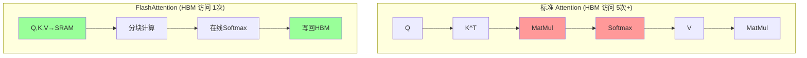
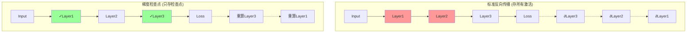
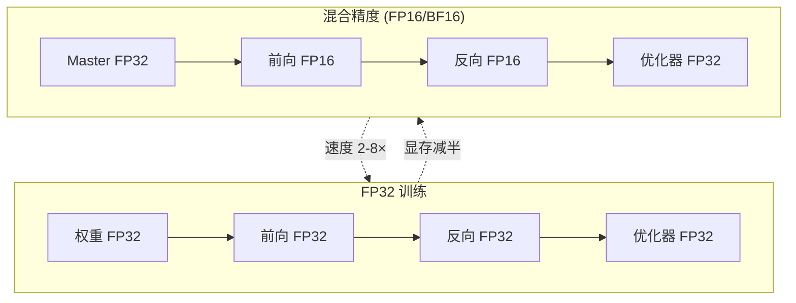
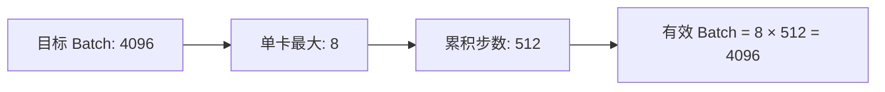
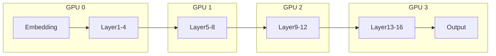
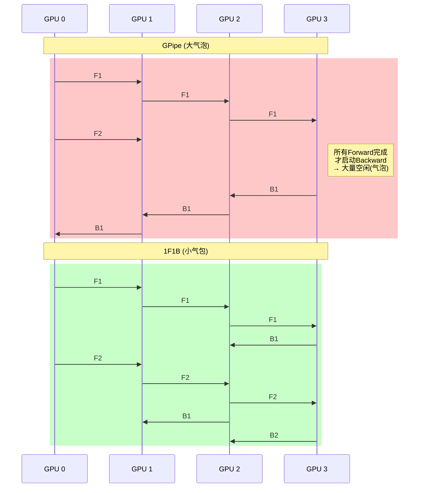
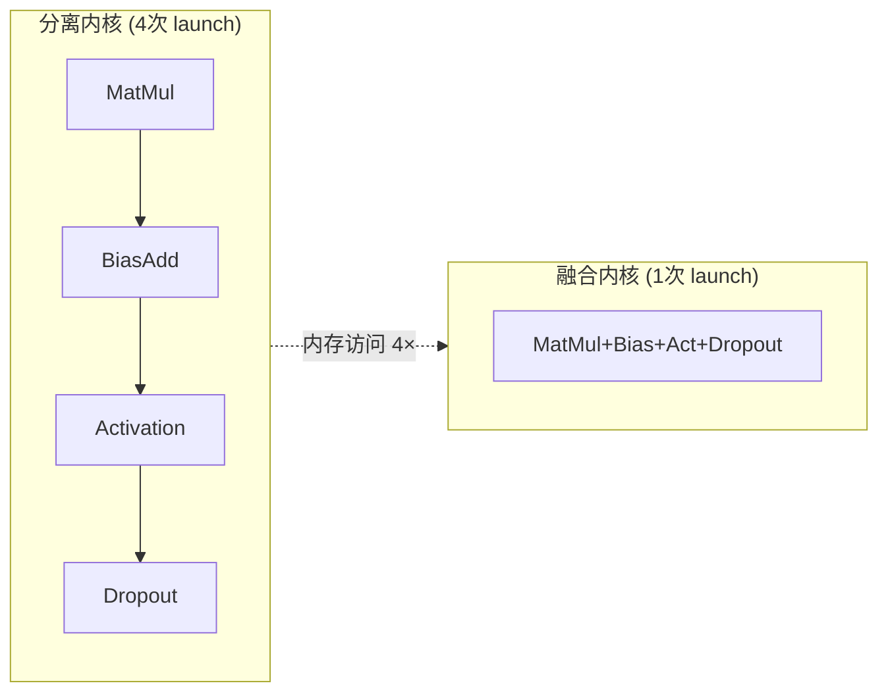
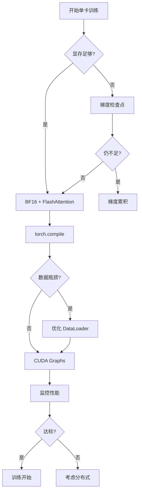
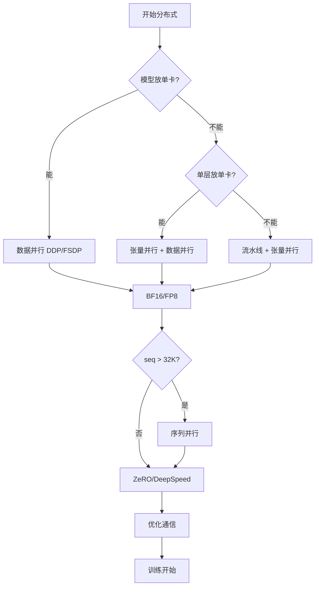

# 训练优化技术 2026: 从显存到吞吐的全栈加速

> **一句话理解**: 2026年的模型训练优化已从单一技巧进化为系统工程——FlashAttention削减O(n²)内存墙、梯度检查点用计算换空间、流水线并行打破单卡边界，十二种核心技术的组合策略让大模型训练速度提升3-10倍、显存节省50-90%。

---

## 📋 内容导航

| 章节 | 内容 | 难度 |
|------|------|------|
| [FlashAttention v1/v2/v3](#1-flashattention-v1v2v3) | 内存高效注意力、IO感知、内核融合 | 进阶 |
| [梯度检查点](#2-梯度检查点-gradient-checkpointing) | 计算换内存、实现原理 | 进阶 |
| [混合精度训练](#3-混合精度训练-mixed-precision) | FP16/BF16、损失缩放、自动类型转换 | 入门 |
| [梯度累积](#4-梯度累积-gradient-accumulation) | 模拟大批量训练 | 入门 |
| [流水线并行](#5-流水线并行-pipeline-parallelism) | GPipe、PipeDream、气泡优化 | 进阶 |
| [序列并行](#6-序列并行-sequence-parallelism) | 长上下文训练 | 进阶 |
| [优化器状态分片](#7-优化器状态分片-optimizer-states-sharding) | 8-bit Adam、AdamW分片 | 进阶 |
| [数据加载优化](#8-数据加载优化) | 预取、num_workers、pin_memory、WebDataset | 入门 |
| [内核融合](#9-内核融合-kernel-fusion) | torch.compile、Triton、自定义CUDA | 进阶 |
| [实战代码](#10-实战代码) | FlashAttention、梯度检查点、torch.compile | 实战 |
| [性能基准](#11-性能基准) | 各技术的加速比与内存节省 | 查错 |
| [组合策略](#12-组合策略) | 多技术协同的最佳实践 | 实战 |
| [常见问题 FAQ](#13-常见问题-faq) | 选型、调试、性能调优 | 查错 |

---

## 1. FlashAttention v1/v2/v3

### 1.1 为什么需要 FlashAttention

标准 Self-Attention 的计算复杂度为 O(n²)，但**真正的瓶颈是内存访问 (HBM ↔ SRAM)**。

```
GPU 内存层级:
┌────────────────────────────────────────────┐
│  HBM: 40-80GB, 带宽 1.5-3 TB/s            │
│       ↑↓ 延迟 ~300 cycles                  │
│  SRAM: ~100KB/SM, 带宽 ~19 TB/s           │
│       ↑↓ 延迟 ~10 cycles                   │
│  Tensor Cores: 312-989 TFLOPS (FP16)      │
└────────────────────────────────────────────┘

问题: 标准 Attention 需要 5+ 次 HBM 读写
→ Q/K/V 加载、Score 读写、Softmax、输出
→ HBM 访问量 ≈ O(n²)，成为瓶颈
```

### 1.2 核心思想: IO-Awareness

减少 HBM 访问次数，而非仅降低 FLOPs。



### 1.3 三代演进对比

| 特性 | FlashAttention v1 | FlashAttention v2 | FlashAttention v3 |
|------|-------------------|-------------------|-------------------|
| **发布时间** | 2022.05 | 2023.07 | 2024.07 |
| **核心优化** | Tiling + Recomputation | 减少非MatMul FLOPs | Warp-specialization, FP8 |
| **Softmax 计算** | 在线重缩放 | 顺序更新，减少同步 | 双缓冲重叠 |
| **速度提升 (vs 标准)** | 2-4× | 2-3× (v1之上) | 1.5-2× (v2之上) |
| **显存节省** | O(n) vs O(n²) | O(n) vs O(n²) | O(n) vs O(n²) |
| **FP8 支持** | ❌ | ❌ | ✅ (Hopper+) |
| **硬件要求** | Ampere+ | Ampere+ | Hopper+ (最佳) |

### 1.4 在线 Softmax (核心创新)

FlashAttention 不 materialize 完整的 Attention 矩阵，分块计算并维护运行中的 max 和 sum。

```python
def online_softmax_block(q_block, k_blocks, v_blocks):
    """在线 Softmax 核心思想 (简化版)"""
    m = float('-inf')
    l = 0.0
    o = torch.zeros_like(q_block)
    
    for k_block, v_block in zip(k_blocks, v_blocks):
        s = q_block @ k_block.T
        m_new = torch.max(torch.stack([m, s.max(dim=-1, keepdim=True).values]), dim=0).values
        l = l * torch.exp(m - m_new) + torch.exp(s - m_new).sum(dim=-1, keepdim=True)
        o = o * torch.exp(m - m_new) + torch.exp(s - m_new) @ v_block
        m = m_new
    
    return o / l  # 最终归一化
```

### 1.5 分块策略

| GPU 架构 | SRAM/SM | 推荐 Br | 推荐 Bc |
|----------|---------|---------|---------|
| A100 | 164 KB | 128 | 64 |
| H100 | 228 KB | 128-256 | 64-128 |
| RTX 4090 | 128 KB | 64-128 | 64 |

---

## 2. 梯度检查点 (Gradient Checkpointing)

### 2.1 核心思想: 计算换内存



### 2.2 内存与计算权衡

| 策略 | 激活值内存 | 额外计算 | 适用场景 |
|------|-----------|----------|----------|
| **标准反向传播** | O(L × batch × d) | 0% | 小模型、充足显存 |
| **全量检查点** | O(√L × batch × d) | ~30-40% | 大模型、显存紧张 |
| **选择性检查点** | O(k × batch × d) | ~10-20% | Transformer (每2层存1层) |

### 2.3 PyTorch 实现

```python
import torch
from torch.utils.checkpoint import checkpoint

class TransformerBlock(nn.Module):
    def __init__(self, hidden_size, num_heads):
        super().__init__()
        self.attn = torch.nn.MultiheadAttention(hidden_size, num_heads)
        self.ffn = torch.nn.Sequential(
            torch.nn.Linear(hidden_size, hidden_size * 4),
            torch.nn.GELU(),
            torch.nn.Linear(hidden_size * 4, hidden_size)
        )
        self.norm1 = torch.nn.LayerNorm(hidden_size)
        self.norm2 = torch.nn.LayerNorm(hidden_size)
    
    def forward(self, x):
        def _forward(x):
            attn_out, _ = self.attn(x, x, x)
            x = self.norm1(x + attn_out)
            x = self.norm2(x + self.ffn(x))
            return x
        
        if self.training:
            return checkpoint(_forward, x, use_reentrant=False)
        return _forward(x)
```

---

## 3. 混合精度训练 (Mixed Precision)

> **详细内容** → [./Mixed_Precision_Training.md](./Mixed_Precision_Training.md)

### 3.1 快速概览



### 3.2 FP16 vs BF16 选型速查

| 特性 | FP16 | BF16 | FP32 |
|------|------|------|------|
| **位宽** | 16 bit | 16 bit | 32 bit |
| **动态范围** | ±65,504 | ±3.4×10³⁸ | ±3.4×10³⁸ |
| **需要 Loss Scaling** | ✅ 必须 | ❌ 通常不需要 | ❌ |
| **Tensor Core 加速** | ✅ | ✅ | ❌ |
| **推荐 GPU** | V100, A100 | A100, H100 | 任意 |
| **训练稳定性** | 中 (易下溢) | 高 | 最高 |

**2026 年推荐**: A100/H100 优先使用 **BF16**，无需 Loss Scaling，训练更稳定。

```python
# PyTorch AMP 快速示例
from torch.cuda.amp import autocast, GradScaler

scaler = GradScaler(enabled=True)  # FP16 需要; BF16 可禁用

with autocast(device_type='cuda', dtype=torch.bfloat16):
    outputs = model(inputs)
    loss = criterion(outputs, targets)

scaler.scale(loss).backward()
scaler.step(optimizer)
scaler.update()
```

---

## 4. 梯度累积 (Gradient Accumulation)

### 4.1 为什么需要梯度累积

大 Batch Size (如 2048, 4096) 能提升训练稳定性，但单卡显存放不下。



### 4.2 实现与学习率调整

```python
def train_with_gradient_accumulation(model, dataloader, optimizer,
                                     target_batch_size=4096, micro_batch_size=8):
    accumulation_steps = target_batch_size // micro_batch_size
    
    for step, (inputs, labels) in enumerate(dataloader):
        outputs = model(inputs)
        loss = criterion(outputs, labels) / accumulation_steps
        loss.backward()
        
        if (step + 1) % accumulation_steps == 0:
            torch.nn.utils.clip_grad_norm_(model.parameters(), max_norm=1.0)
            optimizer.step()
            optimizer.zero_grad()
```

| 有效 Batch Size | 推荐 LR (以 256 为基准) |
|----------------|------------------------|
| 256 | 1e-4 |
| 1024 | 4e-4 (Linear) / 2e-4 (√Scaling) |
| 4096 | 1.6e-3 / 4e-4 |
| 8192+ | 3.2e-3 / 5.7e-4 + 更长 Warmup |

---

## 5. 流水线并行 (Pipeline Parallelism)

### 5.1 核心概念

将模型按层切分到不同 GPU，每张卡只负责部分层的计算。



### 5.2 GPipe vs PipeDream

| 特性 | GPipe | PipeDream |
|------|-------|-----------|
| **并行策略** | 同步流水线填充 | 异步 1F1B |
| **气泡 (Bubble)** | 大 | 小 |
| **权重版本** | 统一 | 多版本 (Weight Stashing) |
| **收敛稳定性** | **高** | 中 |
| **代表框架** | DeepSpeed Pipe | Megatron-LM Pipe |

### 5.3 1F1B (One Forward One Backward) 气泡优化



### 5.4 气泡率对比

| 并行度 P | Micro-batches m | GPipe 气泡率 | 1F1B 气泡率 |
|---------|----------------|-------------|------------|
| 4 | 4 | 75% | 37.5% |
| 4 | 16 | 22.2% | 11.1% |
| 8 | 16 | 36.4% | 18.2% |
| 8 | 32 | 19.5% | 9.8% |

> **公式**: 1F1B Bubble Rate = (P - 1) / (P - 1 + m)

---

## 6. 序列并行 (Sequence Parallelism)

### 6.1 为什么需要序列并行

长上下文训练 (100K+ tokens) 时，Activation 内存随序列长度线性增长。

```
Activation 内存 (batch=1, seq=100K, d=8192, layers=80):
├── Attention: 4 × 100K × 8192 × 80 × 2 ≈ 524 GB
├── FFN: 8 × 100K × 8192 × 80 × 2 ≈ 1048 GB
└── 总计: ~1.5 TB per GPU → 不可能

序列并行 (8 GPUs, 每卡 12.5K):
└── 总计: ~200 GB per GPU → 可行
```

### 6.2 序列并行 + 张量并行

```mermaid
flowchart TB
    subgraph TP["张量并行"]
        A1[X [b,n,d]] --> A2[All-Gather] --> A3[Linear d→d/2] --> A4[Attn local] --> A5[All-Reduce]
    end
    subgraph SP["序列并行"]
        B1[X [b,n/4,d]] --> B2[Linear] --> B3[All-Gather seq] --> B4[Attn full] --> B5[Scatter seq]
    end
```

### 6.3 Ring Attention (环注意力)

KV Block 在 GPU 环中传递，每轮计算局部 Attention，通过 Online Softmax 累积全局结果。

**特点**:
- 支持 **百万级 token** 上下文训练
- 通信与计算完全重叠
- 2026 年长上下文训练标配

---

## 7. 优化器状态分片 (Optimizer States Sharding)

### 7.1 优化器显存占用分析

```
1B 参数模型显存 (Adam, BF16):
├── 参数 (BF16): 2 GB
├── 梯度 (BF16): 2 GB
├── 优化器状态 (FP32 m,v): 8 GB
└── 激活值: ~12-24 GB
→ 单卡总计: ~28 GB，超出 A100 安全边际
```

### 7.2 分片策略对比

| 策略 | 显存占用 | 通信开销 | 代表框架 |
|------|---------|----------|----------|
| **标准 Adam** | 12× params | 无 | PyTorch |
| **ZeRO-1 (OS)** | 4× params + 2/P | 1.5× | DeepSpeed |
| **ZeRO-3 (全分片)** | 4× params / P | 2-3× | DeepSpeed/FSDP |
| **8-bit Adam** | ~6× params | 无 | bitsandbytes |
| **4-bit Adam** | ~4.5× params | 无 | bitsandbytes |

### 7.3 8-bit Adam 与 FSDP

```python
# 方式1: bitsandbytes 8-bit 优化器
import bitsandbytes as bnb

optimizer = bnb.optim.Adam8bit(
    model.parameters(), lr=1e-4,
    block_size=2048,  # 分块大小
)

# 方式2: PyTorch FSDP 自动分片
from torch.distributed.fsdp import FullyShardedDataParallel as FSDP

model = FSDP(model, mixed_precision=torch.bfloat16, limit_all_gathers=True)
# FSDP 自动将优化器状态、梯度、参数分片到各 GPU
```

---

## 8. 数据加载优化

### 8.1 PyTorch DataLoader 优化参数

```python
from torch.utils.data import DataLoader

dataloader = DataLoader(
    dataset,
    batch_size=32,
    num_workers=8,        # 建议 = CPU 核心数
    pin_memory=True,      # 页锁定内存
    prefetch_factor=4,    # 每个 worker 预取 batch 数
    persistent_workers=True,
    drop_last=True,
)
```

### 8.2 参数调优指南

| 参数 | 作用 | 推荐值 |
|------|------|--------|
| **num_workers** | 数据预加载并行度 | 4-16 |
| **pin_memory** | 页锁定内存 | True (配 non_blocking=True) |
| **prefetch_factor** | 预取 batch 数 | 2-4 |
| **persistent_workers** | Worker 复用 | True |

### 8.3 WebDataset: 大规模数据加载

```python
import webdataset as wds

dataset = (
    wds.WebDataset("s3://bucket/data-{000000..000999}.tar")
    .shuffle(10000)
    .decode("torchrgb")
    .to_tuple("jpg;png", "json")
    .map(preprocess)
    .batched(64)
)

dataloader = wds.WebLoader(dataset, batch_size=None, num_workers=4, pin_memory=True)
```

**优势**: 流式读取 (无需完整下载)、单 worker 1000+ samples/s、支持数千 shards 分布式训练。

---

## 9. 内核融合 (Kernel Fusion)

### 9.1 为什么需要内核融合

每次 CUDA kernel launch 都有开销 (~5-10μs)，且 kernel 间需要读写 HBM。



### 9.2 torch.compile

```python
import torch

# 全模型编译
model = torch.compile(model, mode="default", dynamic=True)

# mode 选择:
# - default: 1.2-1.5×, 编译时间中
# - reduce-overhead: 1.1-1.3×, 编译时间短
# - max-autotune: 1.5-3×, 编译时间长
```

### 9.3 CUDA Graphs

```python
# 适用条件: 输入形状固定、控制流静态
graph = torch.cuda.CUDAGraph()

with torch.cuda.graph(graph):
    static_output = model(static_input)
    loss = static_output.mean()
    loss.backward()
    optimizer.step()
    optimizer.zero_grad()

# 零开销重放
for _ in range(num_iters):
    static_input.copy_(batch)
    graph.replay()
```

**效果**: 小 batch / kernel launch 密集型模型加速 10-50%。

---

## 10. 实战代码

### 10.1 FlashAttention 实战

```python
"""
FlashAttention 实战: pip install flash-attn
"""
import torch
from flash_attn import flash_attn_func

def pytorch_attention(q, k, v, causal=False):
    """标准 PyTorch Attention (baseline)"""
    scores = torch.einsum('bqhd,bkhd->bhqk', q, k) / (q.size(-1) ** 0.5)
    if causal:
        mask = torch.triu(torch.ones_like(scores), diagonal=1).bool()
        scores = scores.masked_fill(mask, float('-inf'))
    attn = torch.softmax(scores, dim=-1)
    return torch.einsum('bhqk,bkhd->bqhd', attn, v)

def flash_attention(q, k, v, causal=False):
    """FlashAttention v2/v3"""
    return flash_attn_func(q, k, v, causal=causal)


def benchmark_attention(batch=4, seq_len=8192, num_heads=32, head_dim=128):
    device, dtype = 'cuda', torch.bfloat16
    q = torch.randn(batch, seq_len, num_heads, head_dim, device=device, dtype=dtype)
    k = v = torch.randn_like(q)
    
    # 测试 FlashAttention
    torch.cuda.synchronize()
    start = torch.cuda.Event(enable_timing=True)
    end = torch.cuda.Event(enable_timing=True)
    
    start.record()
    for _ in range(100):
        out = flash_attention(q, k, v, causal=True)
    end.record()
    torch.cuda.synchronize()
    flash_time = start.elapsed_time(end) / 100
    
    print(f"FlashAttention ({seq_len}): {flash_time:.3f} ms")
    
    # 测试标准 Attention (小序列)
    if seq_len <= 2048:
        start.record()
        for _ in range(100):
            out = pytorch_attention(q, k, v, causal=True)
        end.record()
        torch.cuda.synchronize()
        std_time = start.elapsed_time(end) / 100
        print(f"标准 Attention: {std_time:.3f} ms")
        print(f"加速比: {std_time / flash_time:.2f}×")
    else:
        print("标准 Attention: OOM (跳过)")

# 运行
if __name__ == "__main__":
    for seq in [2048, 8192, 32768]:
        print(f"\n=== Sequence: {seq} ===")
        benchmark_attention(seq_len=seq)
```

### 10.2 组合优化训练脚本

```python
"""
组合训练优化: FlashAttention + 梯度检查点 + BF16 + 累积 + torch.compile
"""
import torch
import torch.nn as nn
from torch.cuda.amp import autocast
from flash_attn.modules.mha import FlashSelfAttention

class OptimizedTransformerLayer(nn.Module):
    def __init__(self, hidden_size, num_heads):
        super().__init__()
        self.norm1 = nn.LayerNorm(hidden_size)
        self.attn = FlashSelfAttention(num_heads=num_heads, causal=True)
        self.norm2 = nn.LayerNorm(hidden_size)
        self.ffn = nn.Sequential(
            nn.Linear(hidden_size, hidden_size * 4), nn.GELU(),
            nn.Linear(hidden_size * 4, hidden_size)
        )
    
    def forward(self, x):
        def _forward(x):
            x = x + self.attn(self.norm1(x))
            x = x + self.ffn(self.norm2(x))
            return x
        
        if self.training:
            return torch.utils.checkpoint.checkpoint(_forward, x, use_reentrant=False)
        return _forward(x)


class OptimizedModel(nn.Module):
    def __init__(self, vocab_size, hidden_size, num_layers, num_heads, use_compile=True):
        super().__init__()
        self.embedding = nn.Embedding(vocab_size, hidden_size)
        self.layers = nn.ModuleList([
            OptimizedTransformerLayer(hidden_size, num_heads)
            for _ in range(num_layers)
        ])
        self.output = nn.Linear(hidden_size, vocab_size)
        
        if use_compile:
            self.layers = nn.ModuleList([torch.compile(l, mode="default") for l in self.layers])
    
    def forward(self, input_ids):
        x = self.embedding(input_ids)
        for layer in self.layers:
            x = layer(x)
        return self.output(x)


def train_optimized(model, dataloader, target_batch_size=1024,
                    micro_batch_size=8, lr=1e-4, device='cuda'):
    model = model.to(device)
    accumulation_steps = target_batch_size // micro_batch_size
    optimizer = torch.optim.AdamW(model.parameters(), lr=lr)
    model.train()
    
    for step, (input_ids, labels) in enumerate(dataloader):
        input_ids = input_ids.to(device, non_blocking=True)
        labels = labels.to(device, non_blocking=True)
        
        with autocast(device_type='cuda', dtype=torch.bfloat16):
            logits = model(input_ids)
            loss = nn.functional.cross_entropy(
                logits.view(-1, logits.size(-1)), labels.view(-1)
            ) / accumulation_steps
        
        loss.backward()
        
        if (step + 1) % accumulation_steps == 0:
            torch.nn.utils.clip_grad_norm_(model.parameters(), max_norm=1.0)
            optimizer.step()
            optimizer.zero_grad()


def print_checklist():
    print("✅ 训练优化配置清单:")
    print("  1. FlashAttention: pip install flash-attn")
    print("  2. 梯度检查点: checkpoint(use_reentrant=False)")
    print("  3. 混合精度: autocast(dtype=torch.bfloat16)")
    print("  4. 梯度累积: target // micro")
    print("  5. torch.compile: mode='default'")
    print("  6. DataLoader: num_workers=8, pin_memory=True")
    print("  7. 非阻塞传输: .to(device, non_blocking=True)")
    print("  8. 梯度裁剪: clip_grad_norm_(..., 1.0)")
```

---

## 11. 性能基准

### 11.1 单项技术加速比

| 优化技术 | 速度提升 | 显存节省 | 额外计算 | 实现难度 |
|----------|---------|----------|----------|----------|
| **FlashAttention v2** | **2-4×** | **O(n²)→O(n)** | 0% | 低 |
| **FlashAttention v3** | **3-6×** | **O(n²)→O(n)** | 0% | 低 |
| **梯度检查点 (全量)** | 0.6-0.7× | **70%** | 30-40% | 低 |
| **梯度检查点 ( selective)** | 0.8-0.9× | **50%** | 10-20% | 低 |
| **BF16 训练** | **1.5-2×** | **50%** | 0% | 极低 |
| **FP8 训练 (TE)** | **2-3×** | **75%** | 0% | 低 |
| **梯度累积** | 0.9-1.0× | 0% | 0% | 极低 |
| **1F1B 流水线** | 0.8-0.95× | 模型切分 | 气泡 | 中 |
| **序列并行** | 模型切分 | **序列/P** | 通信 | 高 |
| **ZeRO-3** | 0.7-0.85× | **参数/P** | 通信 | 低 |
| **8-bit Adam** | 0.95× | **优化器 4×** | 反量化 | 极低 |
| **torch.compile** | **1.2-2×** | 0% | 编译时间 | 极低 |
| **CUDA Graphs** | **1.1-1.5×** | 0% | 捕获时间 | 低 |

### 11.2 组合策略效果

```
Llama 3 8B 训练优化 (A100 80GB × 8, seq=8192):
═══════════════════════════════════════════════

基线 (FP32, 标准 Attention):
├── 单卡 batch: 1, 速度: ~20 samples/s, 显存: ~78 GB

组合1 (BF16 + FlashAttention v2):
├── 单卡 batch: 2, 速度: ~80 samples/s (4×), 显存: ~40 GB

组合2 (+ 检查点 + 累积):
├── 有效 batch: 16, 速度: ~75 samples/s, 显存: ~22 GB

组合3 (+ compile + ZeRO-2):
├── 有效 batch: 32, 速度: ~110 samples/s (5.5×), 显存: ~12 GB

组合4 (全栈 FP8 + 3D并行):
├── 适用: 70B+, 速度: ~3× 基线, 显存: ~6 GB/GPU
```

### 11.3 不同规模模型推荐配置

| 模型规模 | GPU 配置 | 推荐技术组合 | 期望吞吐量 |
|----------|---------|-------------|-----------|
| **< 1B** | 单卡 RTX 4090 | BF16 + torch.compile | ~1000 tok/s |
| **1-7B** | 单/双卡 A100 | BF16 + FlashAttn + 检查点 | ~500-2000 tok/s |
| **7-13B** | 4-8 × A100 | BF16 + FlashAttn + ZeRO-2 + 检查点 | ~1000-3000 tok/s |
| **13-70B** | 8-32 × A100/H100 | BF16 + FlashAttn v3 + FSDP + 1F1B | ~2000-5000 tok/s |
| **70B-1T** | 64-512 × H100 | FP8 + 3D并行 (TP+PP+DP) + 序列并行 | ~5000+ tok/s |

---

## 12. 组合策略

### 12.1 单卡优化流程图



### 12.2 分布式优化流程图



### 12.3 技术互斥与协同矩阵

| | FlashAttn | 检查点 | BF16 | 累积 | 流水线 | 序列并行 | compile | ZeRO |
|---|:---:|:---:|:---:|:---:|:---:|:---:|:---:|:---:|
| **FlashAttn** | - | ✅ | ✅ | ✅ | ✅ | ✅ | ✅ | ✅ |
| **检查点** | ✅ | - | ✅ | ✅ | ✅ | ✅ | ✅ | ✅ |
| **BF16** | ✅ | ✅ | - | ✅ | ✅ | ✅ | ✅ | ✅ |
| **累积** | ✅ | ✅ | ✅ | - | ✅ | ✅ | ✅ | ✅ |
| **流水线** | ✅ | ✅ | ✅ | ✅ | - | ✅ | ⚠️ | ✅ |
| **序列并行** | ✅ | ✅ | ✅ | ✅ | ✅ | - | ⚠️ | ✅ |
| **compile** | ✅ | ✅ | ✅ | ✅ | ⚠️ | ⚠️ | - | ✅ |
| **ZeRO** | ✅ | ✅ | ✅ | ✅ | ✅ | ✅ | ✅ | - |

> ⚠️: 需要额外配置或有限制

### 12.4 实战: 70B 模型训练配置

```python
"""
70B 模型全栈训练配置 (8 × H100)
组合: 3D 并行 + FlashAttention v3 + BF16 + 梯度检查点
"""

PARALLEL_CONFIG = {
    "tensor_parallel_size": 4,      # 张量并行
    "pipeline_parallel_size": 2,    # 流水线并行
    "data_parallel_size": 1,        # 数据并行
    "sequence_parallel_size": 4,    # 序列并行
}

DEEPSPEED_CONFIG = {
    "bf16": {"enabled": True},
    "zero_optimization": {
        "stage": 3,
        "offload_optimizer": {"device": "cpu", "pin_memory": True},
        "overlap_comm": True,
        "contiguous_gradients": True,
    },
    "gradient_clipping": 1.0,
    "train_micro_batch_size_per_gpu": 1,
}

TRAINING_CONFIG = {
    "seq_length": 32768,
    "global_batch_size": 512,
    "learning_rate": 1.5e-4,
    "warmup_steps": 2000,
    "gradient_checkpointing": True,
    "max_grad_norm": 1.0,
}

# 预期性能 (8 × H100 NVLink):
# - 吞吐量: ~2500-3500 tokens/s/GPU
# - 显存占用: ~70-75 GB/GPU
# - 训练 70B 模型 1T tokens: ~15-20 天
```

---

## 13. 常见问题 FAQ

### Q1: FlashAttention 安装失败怎么办?

| 问题 | 原因 | 解决方案 |
|------|------|----------|
| `CUDA_ARCH` 错误 | GPU 架构不支持 | 确认 Ampere (A100/3090) 或更新 |
| 编译超时 | 编译时间长 | `MAX_JOBS=4 pip install flash-attn --no-build-isolation` |
| 导入失败 | CUDA 版本不匹配 | PyTorch CUDA 与系统 CUDA 一致 |
| 无速度提升 | 序列太短 | seq_len < 512 时优势不明显 |

### Q2: 梯度检查点和 torch.compile 能否同时使用?

**A**: 可以，需设置 `use_reentrant=False`，关闭 `dynamic=True`:
```python
layer = torch.compile(layer, mode="default", dynamic=False)
return checkpoint(forward_fn, x, use_reentrant=False)
```

### Q3: 如何选择 BF16 vs FP16 vs FP8?

| 场景 | 推荐 | 理由 |
|------|------|------|
| A100/H100 + Transformer | **BF16** | 无需 Loss Scaling，稳定 |
| V100 | **FP16 + GradScaler** | 不支持 BF16 |
| H100/B200 追求极致速度 | **FP8** | 2× 吞吐，需 TransformerEngine |
| 训练出现 NaN | **BF16** | FP16 梯度下溢导致 |
| 精确复现 | **FP32** | 混合精度有非确定性 |

### Q4: 梯度累积时学习率如何调整?

**A**:
- **Linear Scaling**: `lr_new = lr_base × (effective_batch / base_batch)`
- **Square Root Scaling**: `lr_new = lr_base × √(effective_batch / base_batch)` (更稳定)
- 必须配合 Linear Warmup (步数同比例增加) 和 Gradient Clipping

### Q5: torch.compile 编译时间太长怎么办?

| 策略 | 效果 |
|------|------|
| 使用 FX graph cache | 跨运行复用 |
| 只编译部分层 | 减少编译范围 |
| `mode="reduce-overhead"` | 最快编译 |
| `mode="default"` | 编译快 5-10× (vs max-autotune) |

### Q6: 序列并行和张量并行有什么区别?

| 维度 | 张量并行 (TP) | 序列并行 (SP) |
|------|--------------|---------------|
| **切分维度** | hidden_dim | seq_len |
| **通信** | All-Reduce | All-Gather/Scatter |
| **扩展性** | 通常 ≤ 8 | 可 ≥ 64 |
| **最佳实践** | TP 和 SP 同时使用且大小相同 |

### Q7: 8-bit 优化器会损失精度吗?

**A**: 8-bit Adam 通常 < 0.1%，可忽略。关键设置 `block_size=2048`，embedding/head 层保持 FP32。

### Q8: 数据加载成为瓶颈的特征和解决?

**瓶颈特征**: GPU 利用率 < 80%，DataLoader 时间 > 20% 训练时间，CPU 100%。

**解决 (按优先级)**:
1. 增加 num_workers (直到 CPU 饱和)
2. pin_memory=True + non_blocking=True
3. 本地 NVMe / 内存盘 (/dev/shm)
4. WebDataset 流式读取
5. 预处理离线化

### Q9: 流水线并行的气泡如何最小化?

**A**: Bubble Rate = (P - 1) / (P - 1 + m)。推荐 m ≥ 4 × P，此时气泡率 < 20%。

### Q10: 这些优化对推理是否同样有效?

| 技术 | 训练 | 推理 | 推理注意 |
|------|:---:|:---:|:---------|
| FlashAttention | ✅ | ✅ | KV Cache 优化更重要 |
| 梯度检查点 | ✅ | ❌ | 推理不需要反向传播 |
| BF16/FP8 | ✅ | ✅ | INT8/INT4 更常用 |
| torch.compile | ✅ | ✅ | 推理收益更大 |
| CUDA Graphs | ⚠️ | ✅ | 推理 shape 固定 |
| 序列并行 | ✅ | ✅ | 长上下文推理必需 |

**推理专属优化** → [../09_Deployment_Inference/Inference-in-nutshell.md](../09_Deployment_Inference/Inference-in-nutshell.md)

---

## 🔗 相关章节

### 前置知识
- [优化器基础与原理](../03_Deep_Learning/Optimization/Optimization.md) — SGD/Adam/AdamW 数学基础
- [神经网络核心](../03_Deep_Learning/Neural_Network_Core/Neural_Network_Core.md) — 反向传播、激活函数

### 横向关联
- [混合精度训练详解](./Mixed_Precision_Training.md) — FP16/BF16/FP8 深度解析
- [分布式训练 2026](./Distributed_Training_2026.md) — DDP/FSDP/DeepSpeed/Megatron-LM
- [长上下文模型](../04_NLP_LLMs/Long_Context_Models_2026.md) — Ring Attention、稀疏注意力

### 纵向进阶
- [模型评估](../08_Model_Evaluation/Model_Evaluation.md) — 训练后验证模型质量
- [部署推理优化](../09_Deployment_Inference/Inference-in-nutshell.md) — 模型上线推理加速
- [MLOps 流水线](../10_MLOps_Pipeline/MLOps_Pipeline.md) — 自动化训练与监控
- [AI 基础设施](../12_Architecture_Infrastructure/AI_Infrastructure_2026.md) — 集群网络与存储优化

---

## 📚 参考资源

### 论文
- [FlashAttention-1](https://arxiv.org/abs/2205.14135) — Dao et al., 2022
- [FlashAttention-2](https://arxiv.org/abs/2307.08691) — Dao, 2023
- [FlashAttention-3](https://arxiv.org/abs/2407.08608) — Shah et al., 2024
- [Gradient Checkpointing](https://arxiv.org/abs/1604.06174) — Chen et al., 2016
- [Megatron-LM](https://arxiv.org/abs/1909.08053) — Shoeybi et al., 2019
- [ZeRO](https://arxiv.org/abs/1910.02054) — Rajbhandari et al., 2019
- [PipeDream](https://arxiv.org/abs/1806.03377) — Harlap et al., 2018
- [Ring Attention](https://arxiv.org/abs/2310.01889) — Liu et al., 2023

### 开源工具
- [FlashAttention](https://github.com/Dao-AILab/flash-attention)
- [xFormers](https://github.com/facebookresearch/xformers)
- [DeepSpeed](https://github.com/microsoft/DeepSpeed)
- [Megatron-LM](https://github.com/NVIDIA/Megatron-LM)
- [Triton](https://github.com/openai/triton)
- [bitsandbytes](https://github.com/TimDettmers/bitsandbytes)
- [WebDataset](https://github.com/webdataset/webdataset)

### 性能调优文档
- [PyTorch Performance Tuning Guide](https://pytorch.org/tutorials/recipes/recipes/tuning_guide.html)
- [NVIDIA Transformer Engine](https://github.com/NVIDIA/TransformerEngine)
- [NCCL Tests](https://github.com/NVIDIA/nccl-tests)

---

*Last updated: 2026-05-07*
