# 模型训练小白指南

> **一句话理解**: 模型训练就像教小孩认东西——给例子、指出错误、反复练习，直到学会。

---

## 🧒 1. 什么是模型训练？

想象你教一个 3 岁小孩认动物：

1. 📖 你拿出一张猫的图片，说：**"这是猫"**
2. 🖼️ 再拿出一张狗的图片，说：**"这是狗"**
3. 🔁 重复很多很多次
4. ✅ 最后，小孩看到新图片也能认出来

**模型训练就是教计算机做同样的事。**

只是计算机不是用眼睛看，而是用数字学习。你给它成千上万的例子，它慢慢找出规律。

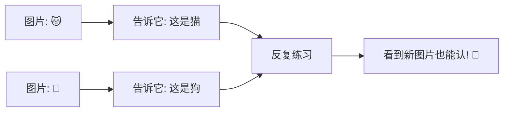

---

## 🎒 2. 训练需要三样东西

教小孩需要三样东西。训练模型也一样。

### 📊 第一样：数据（例子）

就像小孩需要看很多图片才能学会。

数据分成两种：
- **输入 (X)**：图片、文字、数字 —— 给模型看的东西
- **标签 (y)**：正确答案 —— "这是猫"、"这是狗"

```mermaid
flowchart TB
    subgraph 数据集就像一本练习册
        A[第1页: 猫的图片 + "猫"]
        B[第2页: 狗的图片 + "狗"]
        C[第3页: 鸟的图片 + "鸟"]
        D[...还有几千页]
    end
```

### 🧠 第二样：模型（学生的大脑）

模型是计算机里的"虚拟大脑"。

一开始这个大脑什么都不知道。训练就是让它变聪明。


### 🎯 第三样：目标（判断对错的标准）

也叫"损失函数"。它就像一个严格的老师：

- 模型猜错了 → 损失高 😢
- 模型猜对了 → 损失低 😊

训练的目标就是让损失越来越小。

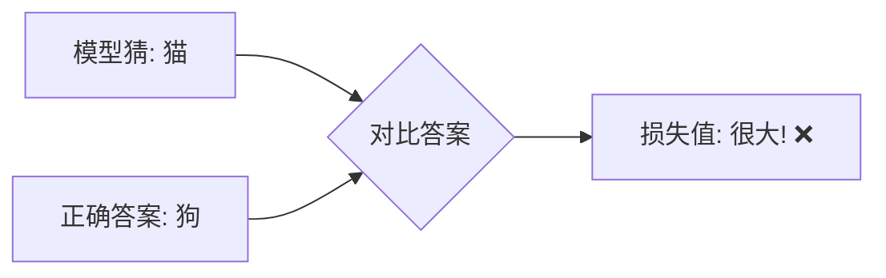

---

## 🔄 3. 训练过程：四步走

训练其实就是不断重复四个步骤。就像小孩学习一样：做题 → 对答案 → 找原因 → 改正。

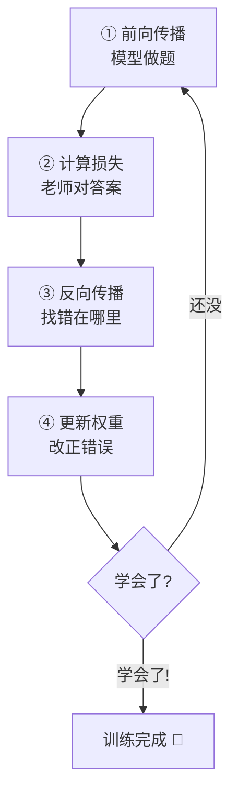

### ① 前向传播 —— 模型做题

给模型一张图片，让它猜是什么。

```
输入: [猫的图片]
      ↓
模型: "我觉得这是... 猫? 概率 70%"
```

### ② 计算损失 —— 老师对答案

老师拿出标准答案，看看模型错得多离谱。

```
模型猜: 猫 (70%)
正确答案: 猫 (100%)
损失: 很小! ✅

模型猜: 狗 (80%)
正确答案: 猫
损失: 很大! ❌
```

### ③ 反向传播 —— 找错在哪里

就像小孩想："我刚才为什么错了？是哪一步想歪了？"

反向传播就是告诉模型：**"你哪里猜错了，哪里的参数要改。"**

### ④ 更新权重 —— 改正错误

也叫"优化"。模型微调自己内部的数字（权重），下次争取猜对。

```
旧的权重 → 旧的答案 (错了)
  ↓
优化器调整一点点
  ↓
新的权重 → 新的答案 (好了一点!)
```

---

## 🎛️ 4. 关键概念简化版

### 🐢🐇 学习率 —— 步子迈多大

想象你在山上走路，想走到最低的谷底（损失最小）。

- **学习率太大** = 步子太大 🐇 → 容易跳过谷底，甚至摔倒（训练不稳定）
- **学习率太小** = 步子太小 🐢 → 走得超级慢，永远到不了
- **学习率刚好** = 快步走到谷底 ✅

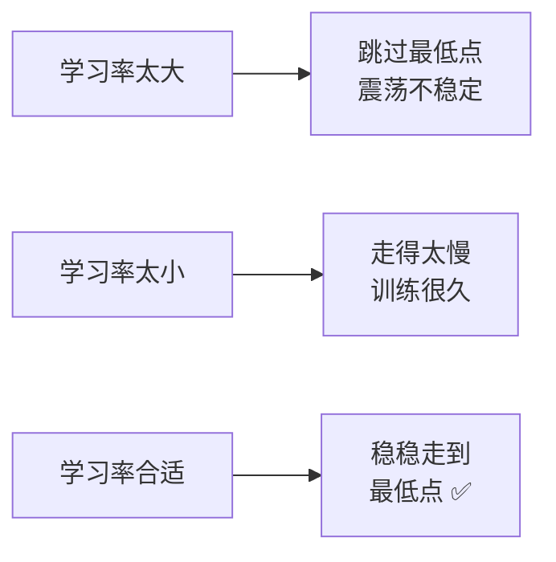

通常从 **0.001** 开始试。

---

### 📦 Batch size —— 一次看多少样本

Batch size 就是模型一次看多少张图片再调整自己。

| Batch size | 就像... | 优点 | 缺点 |
|-----------|--------|------|------|
| 1 | 看一张改一下 | 内存占用小 | 学得很乱 |
| 32 | 看一小叠再改 | 比较稳定 | 需要更多内存 |
| 128 | 看一大叠再改 | 很稳定 | 需要很多内存 |

**常见选择：16、32、64。**

---

### 📖 Epoch —— 完整看一遍数据

想象一本 1000 页的练习册。

- **1 个 Epoch** = 从头到尾做完一遍 📖
- **10 个 Epoch** = 做了 10 遍 🔁

通常需要几十个 Epoch 才能学会。

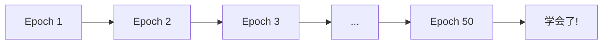

---

### 😵 过拟合 —— 死记硬背

想象一个学生：

- 他把练习册的每道题答案都背下来了
- 练习册上的题全对 ✅
- 但考试时遇到新题，完全不会 ❌

这就是**过拟合**。

模型记住了训练数据的细节，但没有真正学会规律。

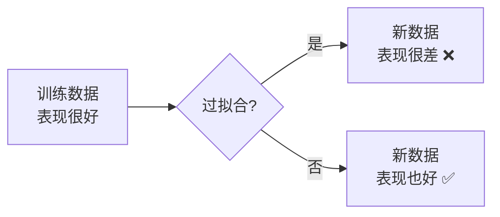

**解决办法**：
- 多给一些不同的例子（数据增强）
- 让模型别学得太复杂（正则化）
- 早停：发现开始死记硬背就停止

---

### 😴 欠拟合 —— 学得太少

还是这个学生：

- 练习册都没做完
- 题目都没看懂
- 训练和考试都很差 ❌

这就是**欠拟合**。

模型太简单了，或者训练不够，什么都没学会。

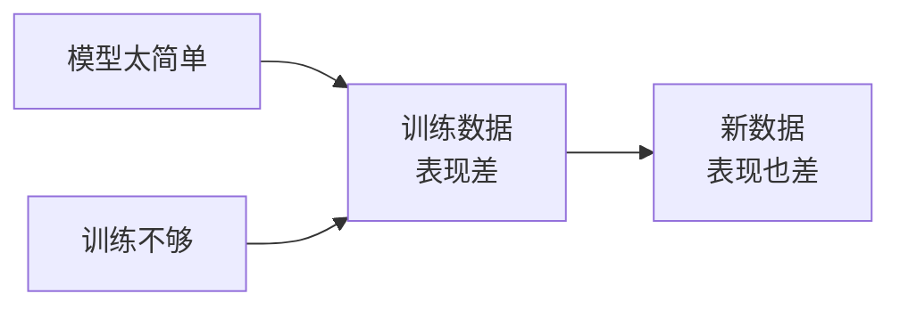

**解决办法**：
- 让模型更复杂一点
- 多训练几轮
- 检查数据有没有问题

---

### 📊 过拟合 vs 欠拟合 对比

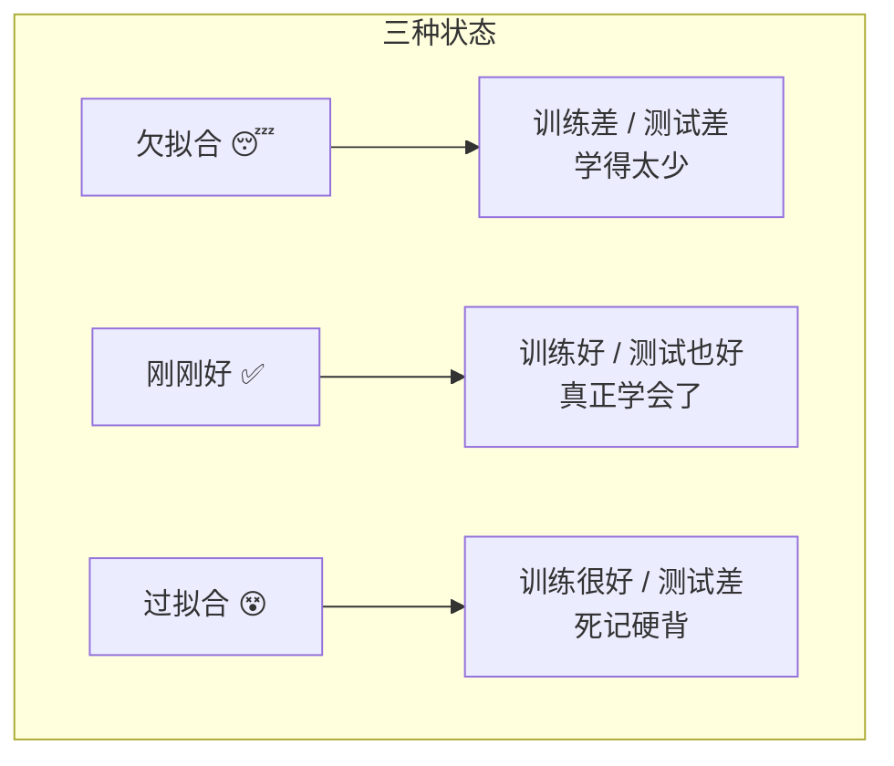

---

## 🏗️ 5. 常见模型类型（一句话解释）

| 模型类型 | 一句话解释 | 适合做什么 |
|---------|----------|----------|
| 🧠 **神经网络 (Neural Network)** | 像人脑一样层层传递信息，适合找复杂规律 | 图像识别、语音识别 |
| 🌲 **决策树 (Decision Tree)** | 像流程图一样做判断，每一步选一个分支 | 信用评分、推荐系统 |
| 🔮 **Transformer** | 会"注意力机制"，能同时看所有词再理解 | ChatGPT、翻译、写文章 |
| 📈 **线性模型** | 画一条线来区分东西，最简单 | 房价预测、趋势分析 |

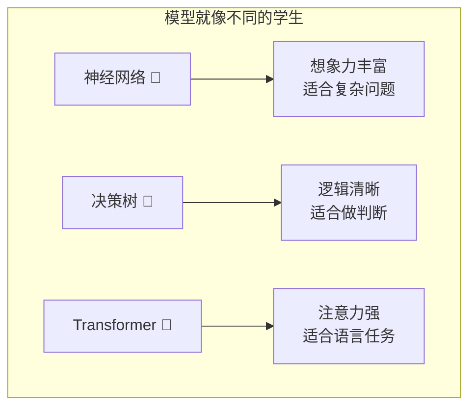

---

## 🛠️ 6. 训练工具简化版

### PyTorch vs TensorFlow

| 工具 | 一句话区别 | 谁在用 |
|-----|----------|--------|
| 🔥 **PyTorch** | 写法像 Python，灵活好改，学术界最爱 | 研究人员、学生 |
| 🧊 **TensorFlow** | Google 出品，生产部署很方便 | 大公司、工业界 |

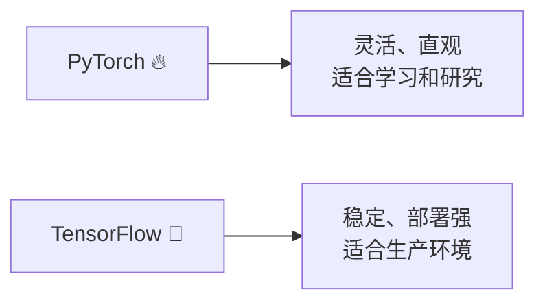

**新手建议**：先学 PyTorch，因为它更像写普通 Python 代码。

---

## 💻 7. 最简单的训练代码（30 行以内）

下面是一个最简化的 PyTorch 训练示例。就算是小白，也能看出它在做什么：

```python
import torch
import torch.nn as nn

# ① 造一个最简单的模型（一层神经网络）
model = nn.Linear(10, 1)  # 输入10个数，输出1个数

# ② 定义损失函数（算错多少）和优化器（怎么改）
loss_fn = nn.MSELoss()
optimizer = torch.optim.SGD(model.parameters(), lr=0.01)

# ③ 假装有一些数据（真实场景中这里换成你的数据）
X = torch.randn(100, 10)  # 100个样本，每个10个数
y = torch.randn(100, 1)   # 100个正确答案

# ④ 训练循环（重复100次）
for epoch in range(100):
    # 前向传播：模型做预测
    pred = model(X)
    
    # 计算损失：错多少
    loss = loss_fn(pred, y)
    
    # 反向传播：找哪里错了
    optimizer.zero_grad()  # 清空上次的错误记录
    loss.backward()        # 计算这次哪里错了
    
    # 更新权重：改！
    optimizer.step()       # 把参数往对的方向调一点点
    
    # 每10轮打印一下，看看有没有进步
    if epoch % 10 == 0:
        print(f"第{epoch}轮，损失：{loss.item():.4f}")

print("训练完成！🎉")
```

**代码在干什么？**

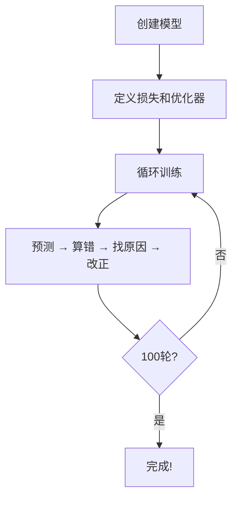

就算看不懂每一行，记住这个顺序就行：
> **预测 → 算错 → 找原因 → 改正 → 重复**

### 🧪 你可以复制粘贴运行！

只要装了 PyTorch，上面的代码直接就能跑：

```bash
pip install torch
python train_demo.py
```

你会看到损失值从大到小慢慢下降，就像学生成绩慢慢提高一样！📈

---

## ❓ 8. 常见问题速查表

训练模型时经常会遇到问题。下面是新手最常遇到的：

| 问题 🤔 | 可能的原因 🔍 | 解决办法 💡 |
|--------|-------------|-----------|
| **损失一直不下降** 😐 | 学习率太大/太小；数据有问题；模型太简单 | 换学习率；检查数据；换复杂模型 |
| **损失变成 NaN** 💥 | 学习率太大；数据有无穷大或空值 | 降低学习率；清洗数据 |
| **训练太慢** 🐢 | 没用 GPU；Batch size 太小；数据太多 | 用 GPU；增大 Batch size；减少数据 |
| **训练很好，测试很差** 😵 | 过拟合！模型死记硬背了 | 增加数据；早停；加正则化 |
| **内存不够 (OOM)** 🚫 | Batch size 太大；模型太大 | 减小 Batch size；换小模型 |
| **损失震荡不定** 📈📉 | 学习率太大；Batch size 太小 | 降低学习率；增大 Batch size |

### 💡 快速自查流程

遇到问题不要慌，按这个顺序检查：

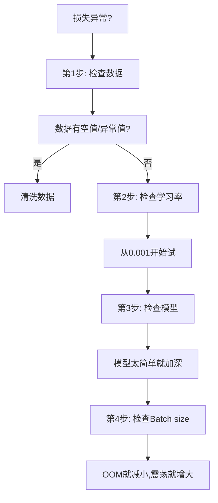

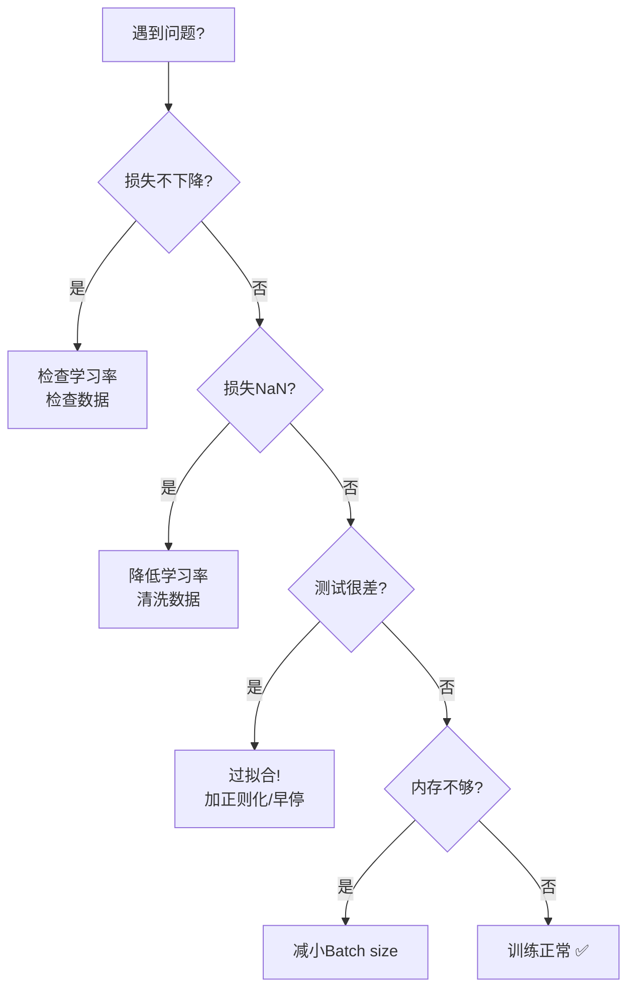

---

## 🖥️ 9. 分布式训练 —— 一句话解释

```
💡 多 GPU 就像多个学生一起学：
   一个学生看一半书，另一个学生看另一半，
   最后把笔记合起来，学得更快！
```

普通训练：1 个 GPU 慢慢算。

分布式训练：4 个 GPU 同时算，速度 ×4！🚀

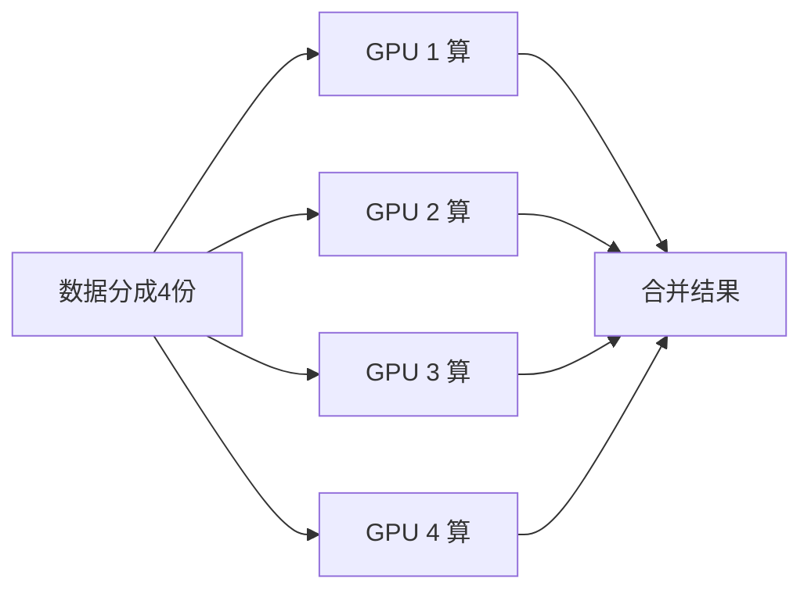

---

## 🔧 10. 微调 —— 一句话解释

```
💡 微调就像：一个学生已经学完了小学数学，
   现在直接学初中数学，不需要从小学重新来！
```

**预训练模型** = 已经学了很多知识的模型（比如 GPT、BERT）

**微调** = 在这个基础上，用你的数据再教一教


**为什么要微调？**
- 从头训练一个大模型需要几百万美元 💰
- 微调只需要一张显卡和几小时 ⏱️
- 效果往往很好！

---

## 📝 模型保存 —— 别忘了存作业！

训练很久的模型，一定要保存下来。就像学生把作业本收好：

```python
# 保存模型
torch.save(model.state_dict(), "my_model.pth")

# 加载模型（下次直接用）
model.load_state_dict(torch.load("my_model.pth"))
```


---

## 📚 总结

模型训练其实不难理解：

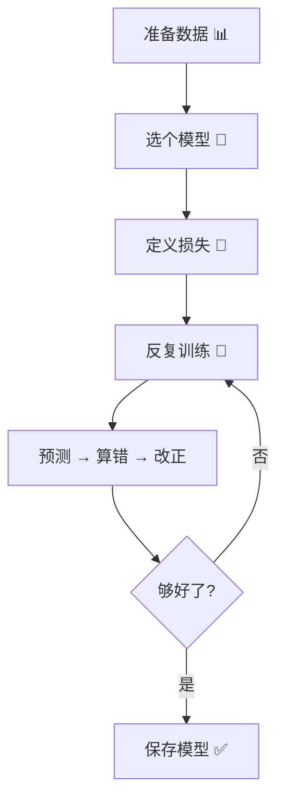

记住这几句话：

> 🧒 **训练就像教小孩** —— 给例子、指错误、反复练
> 
> 🎯 **损失函数是老师** —— 告诉模型错多少
> 
> 🔄 **反向传播找原因** —— 知道哪里错了
> 
> 📝 **优化器来改正** —— 调整模型变得更好

---

## 🔗 延伸阅读

- 想快速复习？看 [**模型训练速成指南**](./Model-Training-in-nutshell.md)
- 想了解机器学习基础？看 [**02 机器学习基础**](../机器学习/README.md)
- 想了解神经网络原理？看 [**03 深度学习基础**](../深度学习/README.md)

---

*Last updated: 2026-05-07*

## Related

- [[模型训练/Distributed_Training/Distributed_Training_2026]] — Distributed Training 2026 (共享: distributed-training, fsdp, model-training, optimization)
- [[模型训练/Distributed_Training/Distributed_Training_for_dummy]] — 分布式训练 - 小白版 (共享: distributed-training, fsdp, model-training, optimization)
- [[模型训练/Optimization/Mixed_Precision_Training]] — 混合精度训练 (Mixed Precision Training) (共享: distributed-training, fsdp, model-training, optimization)
- [[模型训练/Model-Training-in-nutshell]] — 模型训练速成指南 (共享: distributed-training, fsdp, model-training, optimization)
- [[模型训练/README_for_dummy.md|README_for_dummy]]
