# Distributed Training 2026

> **一句话理解**: 分布式训练通过将数据和模型切分到多个 GPU/节点并行计算，使得原本无法在单卡上完成的大规模模型训练成为可能，是 2026 年训练百亿到万亿参数模型的核心基础设施。

---

## Table of Contents

- [Why Distributed Training](#why-distributed-training)
- [Data Parallelism (DP/DDP)](#data-parallelism-dpddp)
- [Fully Sharded Data Parallel (FSDP)](#fully-sharded-data-parallel-fsdp)
- [DeepSpeed](#deepspeed)
- [Megatron-LM](#megatron-lm)
- [混合策略](#混合策略)
- [通信优化](#通信优化)
- [实战代码](#实战代码)
- [性能调优](#性能调优)
- [常见问题](#常见问题)
- [References](#参考)

---

## Why Distributed Training

### The Scaling Challenge in 2026

By 2026, state-of-the-art models have reached trillions of parameters. Training such models on a single GPU is impossible due to:

1. **Memory constraints**: A 1T parameter model in FP16 requires ~2TB of GPU memory just for parameters
2. **Compute constraints**: Training would take years on a single device
3. **Data volume**: Datasets contain trillions of tokens that must be processed efficiently

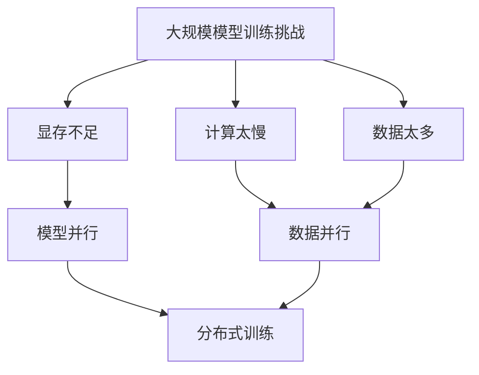

### Three Fundamental Parallelism Strategies

| 维度 | 数据并行 (DP) | 模型并行 (MP) | 流水线并行 (PP) |
|------|--------------|--------------|----------------|
| **切分对象** | 训练数据批次 | 模型层/参数 | 模型层序列 |
| **通信量** | 梯度 AllReduce | 激活值/张量 | 中间激活值 |
| **适用场景** | 模型可放入单卡 | 模型超单卡显存 | 模型极深 |
| **扩展性** | 随 GPU 数量线性 | 受层数限制 | 受流水线阶段限制 |
| **代表实现** | PyTorch DDP, FSDP | Megatron-LM TP | GPipe, PipeDream |
| **显存节省** | 无 | 参数分片 | 参数分片 |
| **2026 趋势** | FSDP 成为默认 | TP 标配 + SP | 虚拟流水线阶段 |

### Memory Breakdown for a Single GPU

For a model with $P$ parameters, training memory includes:

| 组件 | 显存占用 | 以 GPT-3 175B (FP16) 为例 |
|------|---------|------------------------|
| 模型参数 | $2P$ bytes | 350 GB |
| 梯度 | $2P$ bytes | 350 GB |
| 优化器状态 (Adam) | $12P$ bytes | 2,100 GB |
| 激活值 (activation) | 取决于序列长度和批量 | ~500 GB |
| **总计** | **$\sim 16P$ + activations** | **~3.3 TB** |

This is why even GPT-3 (175B) cannot be trained on a single A100 (80GB) without parallelism.

---

## Data Parallelism (DP/DDP)

### From DP to DDP

**DataParallel (DP)** — the legacy PyTorch approach:
- Single-process, multi-threaded
- Replicates model on each GPU forward pass
- GIL contention, poor GPU utilization
- ❌ Deprecated in 2026

**DistributedDataParallel (DDP)** — the production standard:
- Multi-process, one process per GPU
- Model replicated at initialization
- Gradient synchronization via AllReduce
- Overlaps communication with backward computation
- ✅ Default choice for models that fit in single GPU memory

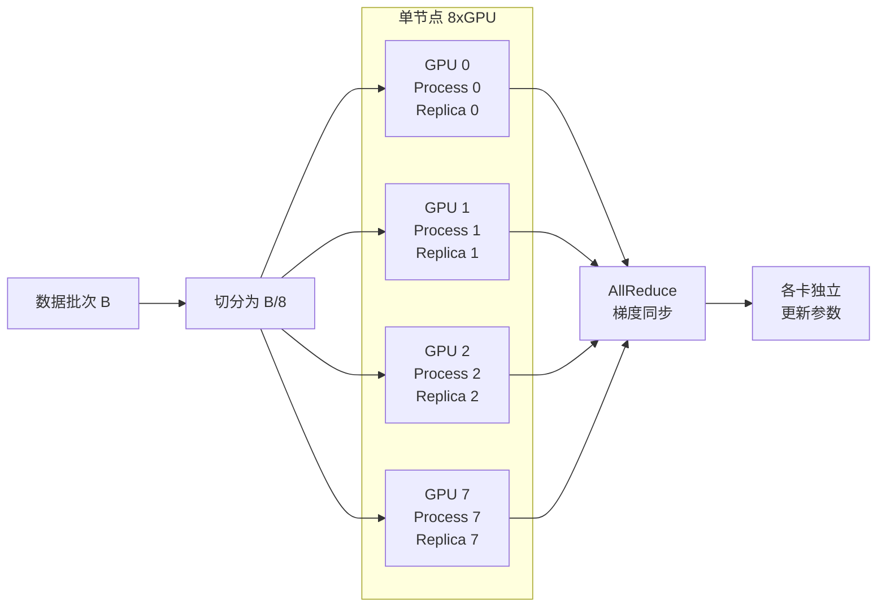

### DDP Communication: Ring AllReduce

DDP uses the **Ring AllReduce** algorithm for gradient synchronization:

1. **Scatter-Reduce**: Each GPU accumulates a chunk of gradients from all GPUs
2. **AllGather**: Each GPU broadcasts its final chunk to all others

For $N$ GPUs and $M$ bytes of gradients:
- Total data transferred: $2(N-1)M/N$ per GPU
- Time: $\approx 2M\alpha + 2M\beta/N$ where $\alpha$ = latency, $\beta$ = bandwidth

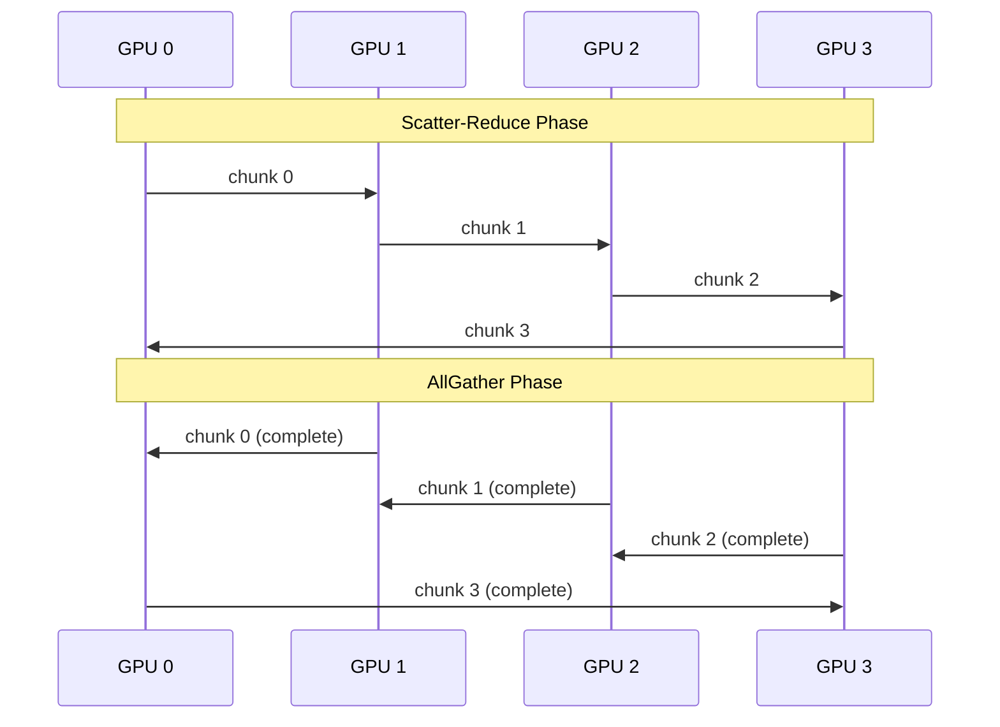

### DDP Key Concepts

| 概念 | 说明 | 2026 最佳实践 |
|------|------|-------------|
| `bucket_size_mb` | 梯度桶大小，控制 AllReduce 触发时机 | 25-50MB，根据网络调整 |
| `gradient_as_bucket_view` | 梯度直接写入 bucket 避免拷贝 | 默认开启 |
| `static_graph` | 静态图优化，首次迭代后缓存通信路径 | 模型结构不变时开启 |
| `delay_all_reduce_named_params` | 延迟 AllReduce 到特定参数 | 大模型分阶段同步 |
| `mixed_precision` | AMP 自动混合精度 | 默认 BF16，训练稳定 |

### DDP 与梯度累积

```python
# DDP + Gradient Accumulation 伪代码
for i, batch in enumerate(dataloader):
    with autocast(dtype=torch.bfloat16):
        loss = model(batch) / accumulation_steps
    loss.backward()  # DDP hooks trigger AllReduce on final step only

    if (i + 1) % accumulation_steps == 0:
        optimizer.step()
        optimizer.zero_grad()
```

In DDP, `no_sync()` context disables gradient synchronization during accumulation steps:

```python
with model.no_sync():
    for _ in range(accumulation_steps - 1):
        loss = model(batch).backward()
loss = model(final_batch).backward()  # Only this triggers AllReduce
```

---

## Fully Sharded Data Parallel (FSDP)

### The Problem DDP Cannot Solve

DDP replicates the **entire model** on every GPU. For a 70B parameter model:
- FP16 parameters: 140 GB
- FP16 gradients: 140 GB
- Adam states: 840 GB
- **Total per GPU: > 1TB** — impossible even on H100 (96GB)

**FSDP shards parameters, gradients, and optimizer states across GPUs.**

### FSDP Sharding Strategies

| 策略 | 简称 | 显存占用 | 通信量/层 |
|------|------|---------|----------|
| **FULL_SHARD** | ZeRO-3 | $O(P/N + P)$ | $2P$ |
| **SHARD_GRAD_OP** | ZeRO-2 | $O(P + P/N)$ | $P$ |
| **NO_SHARD** | DDP | $O(P)$ | $P$ |
| **HYBRID_SHARD** | FSDP + DDP | $O(P/G + P)$ | $2P/G$ |

Where $N$ = total GPUs, $G$ = 节点内 GPU 数。

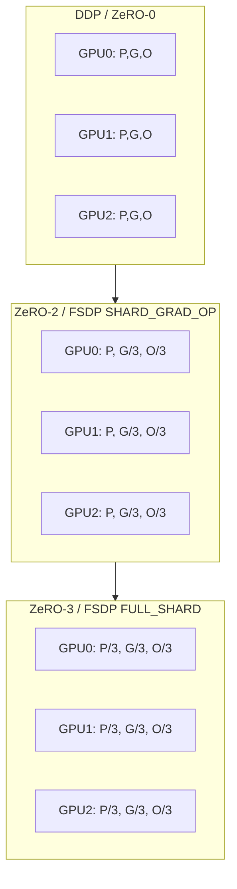

### FSDP Parameter Sharding (ZeRO-3)

In ZeRO-3/FSDP FULL_SHARD:

1. **Forward pass**: Each layer's parameters are gathered from all GPUs via AllGather, then immediately freed after use
2. **Backward pass**: Parameters gathered again for gradient computation
3. **Gradient reduction**: Gradients are reduced-scatter so each GPU owns a shard
4. **Optimizer step**: Each GPU updates only its parameter shard

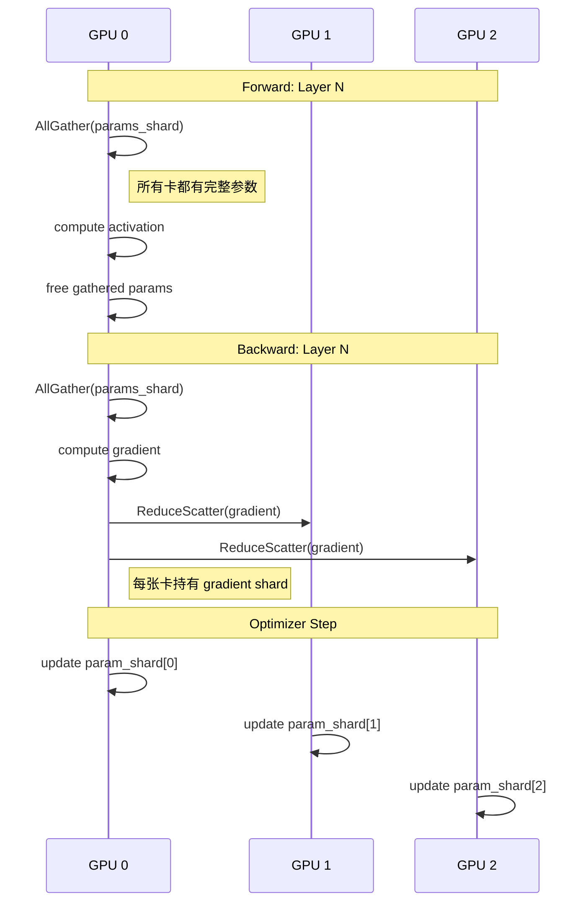

### FSDP Wrapping Strategies

```python
# 1. 默认: 每个 Transformer Layer 一个 FSDP 单元
auto_wrap_policy = functools.partial(
    transformer_auto_wrap_policy,
    transformer_layer_cls={TransformerBlock}
)

# 2. 基于大小的策略: 每个 FSDP 单元至少 1B 参数
auto_wrap_policy = functools.partial(
    size_based_auto_wrap_policy,
    min_num_params=1_000_000_000
)

# 3. 手动包装: 精确控制
model = FSDP(
    model,
    auto_wrap_policy=auto_wrap_policy,
    mixed_precision=torch.bfloat16,
    device_id=torch.cuda.current_device(),
    limit_all_gathers=True,  # 限制并发 AllGather 防止 OOM
    forward_prefetch=True,   # 预取下一层参数
    backward_prefetch=BackwardPrefetch.BACKWARD_PRE,  # 预取梯度
)
```

### FSDP 显存分析

| 配置 | 7B 模型 | 70B 模型 | 405B 模型 |
|------|--------|---------|----------|
| 单卡 (BF16) | ~14 GB | ~140 GB | ~810 GB |
| DDP 8xA100 | 每张 14 GB | ❌ OOM | ❌ OOM |
| FSDP ZeRO-2 8xA100 | 每张 ~8 GB | 每张 ~90 GB | ❌ OOM |
| FSDP ZeRO-3 8xA100 | 每张 ~2 GB | 每张 ~18 GB | 每张 ~102 GB |
| FSDP ZeRO-3 64xH100 | - | - | 每张 ~13 GB |

---

## DeepSpeed

### DeepSpeed ZeRO Stages

DeepSpeed, developed by Microsoft, pioneered the ZeRO (Zero Redundancy Optimizer) family:

| Stage | 名称 | 切分内容 | 显存公式 |
|-------|------|---------|---------|
| ZeRO-0 | 无优化 | 无 | $4\psi + 12\psi + K\psi \approx 16\psi$ |
| ZeRO-1 | 优化器状态分片 | $O$ | $4\psi + 12\psi/N + K\psi$ |
| ZeRO-2 | + 梯度分片 | $O + G$ | $4\psi + (12\psi + 4\psi)/N + K\psi$ |
| ZeRO-3 | + 参数分片 | $O + G + P$ | $(4\psi + 12\psi + 4\psi)/N + K\psi$ |
| ZeRO-Infinity | + NVMe Offload | $O + G + P$ to CPU/NVMe | 可训练任意大模型 |
| ZeRO-Offload | CPU Offload | 优化器状态+计算 offload 到 CPU | 单卡可训更大模型 |

Where $\psi$ = parameter count, $K$ = activation memory factor.

```mermaid
graph LR
    subgraph ZeRO0[ZeRO-0: DDP]
        Z00[GPU0: P+G+O]
        Z01[GPU1: P+G+O]
        Z02[GPU2: P+G+O]
    end

    subgraph ZeRO1[ZeRO-1]
        Z10[GPU0: P+G+O/3]
        Z11[GPU1: P+G+O/3]
        Z12[GPU2: P+G+O/3]
    end

    subgraph ZeRO2[ZeRO-2]
        Z20[GPU0: P+(G+O)/3]
        Z21[GPU1: P+(G+O)/3]
        Z22[GPU2: P+(G+O)/3]
    end

    subgraph ZeRO3[ZeRO-3]
        Z30[GPU0: (P+G+O)/3]
        Z31[GPU1: (P+G+O)/3]
        Z32[GPU2: (P+G+O)/3]
    end

    ZeRO0 --> ZeRO1 --> ZeRO2 --> ZeRO3
```

### DeepSpeed Config JSON (2026 标准模板)

```json
{
    "bf16": {
        "enabled": true
    },
    "zero_optimization": {
        "stage": 3,
        "offload_optimizer": {
            "device": "nvme",
            "nvme_path": "/local_nvme",
            "pin_memory": true
        },
        "offload_param": {
            "device": "nvme",
            "nvme_path": "/local_nvme",
            "pin_memory": true
        },
        "overlap_comm": true,
        "overlap_grad_reduce": true,
        "contiguous_gradients": true,
        "sub_group_size": 1e9,
        "reduce_bucket_size": "auto",
        "stage3_prefetch_bucket_size": "auto",
        "stage3_param_persistence_threshold": "auto",
        "stage3_max_live_parameters": 1e9,
        "stage3_max_reuse_distance": 1e9,
        "gather_16bit_weights_on_model_save": true
    },
    "gradient_accumulation_steps": 4,
    "gradient_clipping": 1.0,
    "train_batch_size": "auto",
    "train_micro_batch_size_per_gpu": "auto",
    "wall_clock_breakdown": false,
    "flops_profiler": {
        "enabled": false,
        "profile_step": 10,
        "module_depth": -1,
        "top_modules": 3,
        "detailed": true
    }
}
```

### DeepSpeed Inference (2026 更新)

DeepSpeed Inference provides optimized inference for massive models:

| 特性 | 说明 |
|------|------|
| **Kernel Injection** | 替换 PyTorch 算子为融合 CUDA kernel |
| **Meta Tensor** | 延迟加载，减少 CPU 内存 |
| **Multi-GPU** | 张量并行推理 |
| **Quantization** | INT8/FP8/INT4 支持 |
| **NUMA 感知** | CPU offload 优化 |

```python
import deepspeed
import torch

model = ...  # 大模型

ds_config = {
    "tensor_parallel": {"tp_size": 8},
    "dtype": "fp16",
    "replace_with_kernel_inject": True,
    "enable_cuda_graph": True,
}

model = deepspeed.init_inference(
    model,
    config=ds_config,
)
# 模型现在以张量并行方式分布在 8 张 GPU 上
```

### DeepSpeed vs FSDP 对比 (2026)

| 特性 | DeepSpeed | PyTorch FSDP |
|------|-----------|-------------|
| **维护方** | Microsoft | Meta / PyTorch |
| **ZeRO-3 稳定性** | ⭐⭐⭐⭐⭐ 成熟多年 | ⭐⭐⭐⭐☆ 持续改进 |
| **CPU/NVMe Offload** | ⭐⭐⭐⭐⭐ 完善 | ⭐⭐⭐☆☆ 有限支持 |
| **易用性** | ⭐⭐⭐☆☆ 需 JSON 配置 | ⭐⭐⭐⭐⭐ Python API |
| **与生态集成** | HuggingFace, Megatron | 原生 PyTorch |
| **3D 并行** | 需 Megatron-DeepSpeed | 需 torch.distributed |
| **2026 推荐** | 超大规模 + Offload | 中等规模 + 易用 |

---

## Megatron-LM

### NVIDIA Megatron-LM 架构

Megatron-LM, developed by NVIDIA, is the industry standard for training GPT-style models at scale. It implements three core parallelisms:

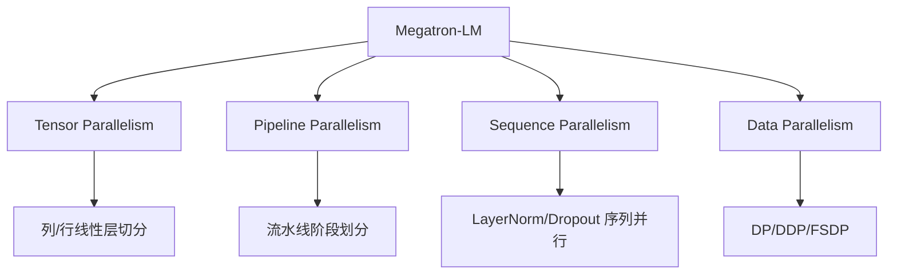

### Tensor Parallelism (TP)

Tensor Parallelism splits **individual layers** across GPUs, specifically:

**1. Column-wise Parallel Linear**:
```
Input X (b, s, h) --> [Linear A] --> Output Y1 (b, s, h/n)
                 --> [Linear B] --> Output Y2 (b, s, h/n)
                 [on GPU 0]       [on GPU 1]
                 
最终 Concat(Y1, Y2) = Y (b, s, h)
```

**2. Row-wise Parallel Linear**:
```
Input X (b, s, h) --split--> X1 (b, s, h/n) --> [Linear A] --> Y1
                          --> X2 (b, s, h/n) --> [Linear B] --> Y2
                          [to GPU 0]          [to GPU 1]

最终 AllReduce(Y1 + Y2) = Y
```

**3. Self-Attention TP**:
- Q, K, V projections: Column-wise parallel
- Attention output projection: Row-wise parallel
- AllReduce only at the very end of attention block

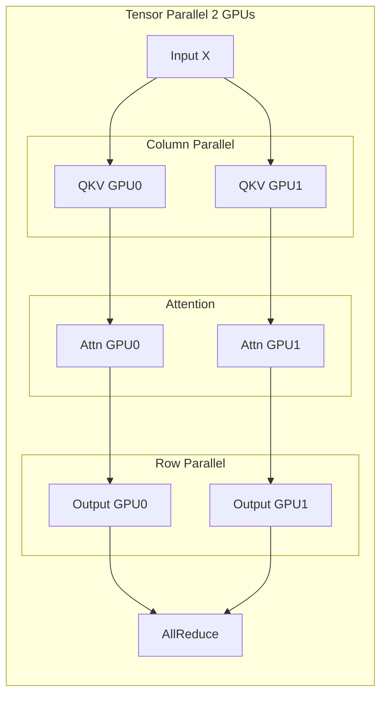

### Pipeline Parallelism (PP)

Pipeline Parallelism splits the **model layers** into stages:

```
Stage 0 (GPU 0-3):  Layers 0-11   -->  send activation --> 
Stage 1 (GPU 4-7):  Layers 12-23  -->  send activation --> 
Stage 2 (GPU 8-11): Layers 24-35  -->  send activation --> 
Stage 3 (GPU 12-15): Layers 36-47  -->  output
```

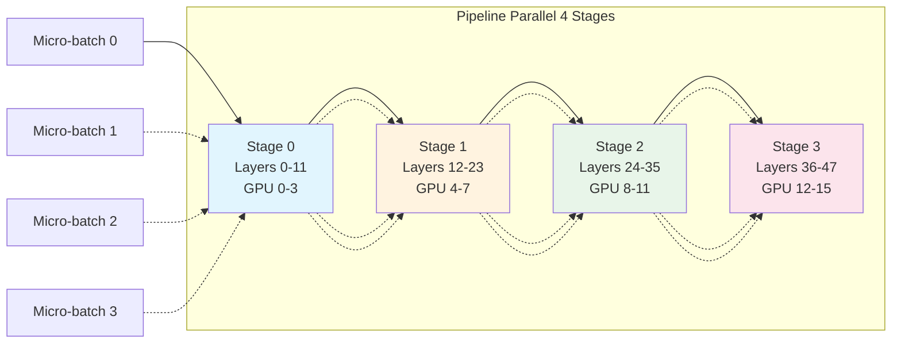

### Pipeline Scheduling Strategies

| 策略 | Bubble 占比 | 显存峰值 | 实现复杂度 |
|------|-----------|---------|----------|
| **GPipe** | $(p-1)/(m+p-1)$ | $O(m \times p)$ | 低 |
| **PipeDream** | 0 (1F1B) | $O(p)$ | 中 |
| **Interleaved 1F1B** | $(p-1)/(m \times v + p -1)$ | $O(v \times p)$ | 高 |
| **Zero Bubble** | $\approx 0$ | $O(p)$ | 很高 |

Where $p$ = pipeline stages, $m$ = micro-batches, $v$ = virtual stages.

**2026 推荐**: Interleaved 1F1B with virtual stages or Zero Bubble for maximum efficiency.

```mermaid
graph TD
    subgraph GPipeSchedule[GPipe 调度]
        direction LR
        F0[F0] --> F1[F1] --> F2[F2] --> F3[F3] --> B0[B0] --> B1[B1] --> B2[B2] --> B3[B3]
        Note right of F0: 大 Bubble，高显存
    end

    subgraph F1B1[1F1B 调度]
        direction LR
        F0_1[F0] --> F1_1[F1] --> B0_1[B0] --> F2_1[F2] --> B1_1[B1] --> F3_1[F3] --> B2_1[B2] --> B3_1[B3]
        Note right of F0_1: 小 Bubble，低显存
    end
```

### Sequence Parallelism (SP)

Introduced in Megatron-LM to reduce activation memory for long sequences:

- Standard TP: LayerNorm and Dropout replicated on all TP ranks
- Sequence Parallelism: These are also partitioned along sequence dimension
- Reduces activation memory by TP degree
- Combined with TP: `reduce_scatter` after attention, `all_gather` before MLP

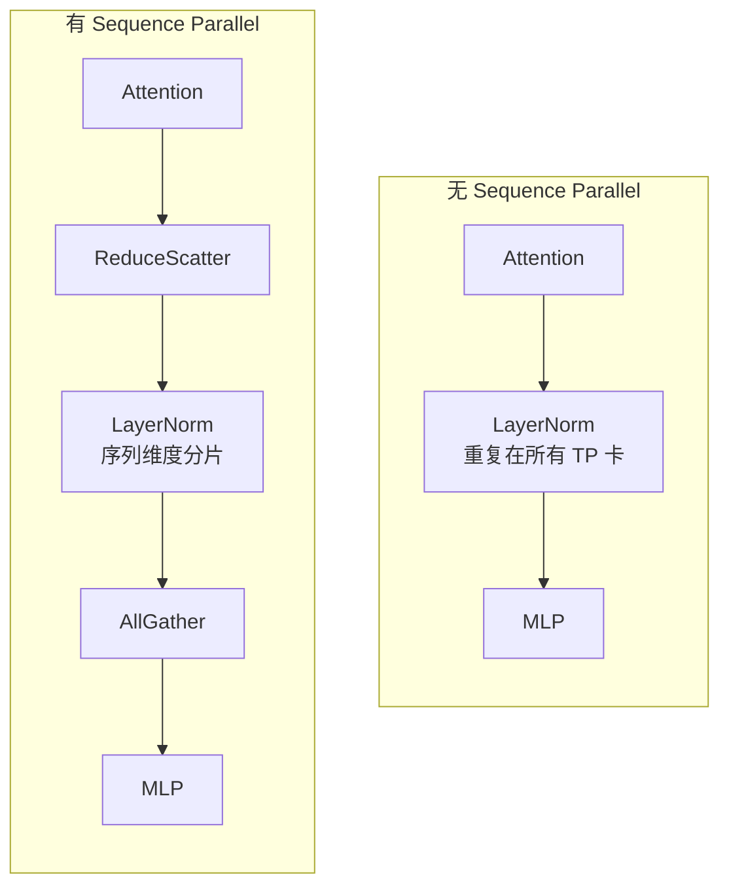

---

## 混合策略

### 3D Parallelism

Modern large model training (100B+) requires combining parallelism strategies:

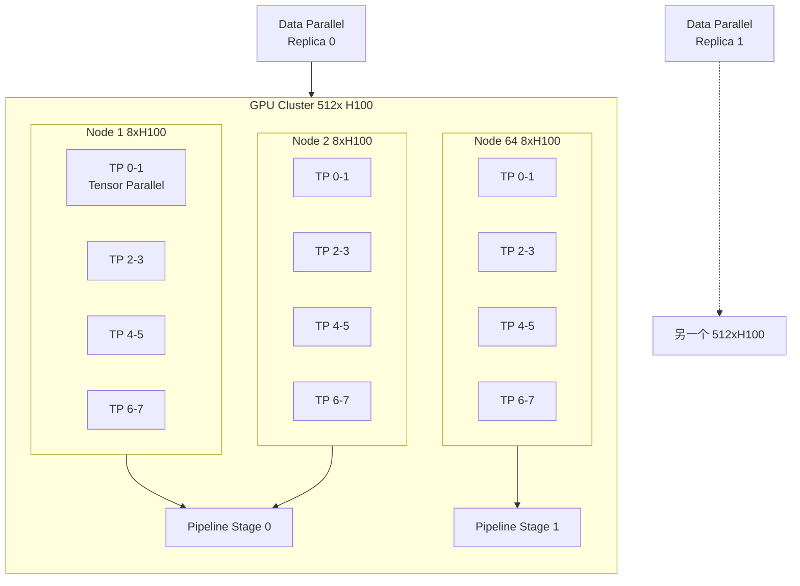

### 并行维度选择矩阵

| 模型大小 | TP | PP | DP | 说明 |
|---------|----|----|----|------|
| 7B-13B | 1-2 | 1 | 4-64 | 小模型，纯 DP+FSDP 即可 |
| 30B-70B | 4-8 | 1-2 | 8-32 | 中等模型，单节点 TP + 跨节点 DP |
| 175B-300B | 8 | 4-8 | 16-64 | 大模型，3D 并行 |
| 1T+ | 8 | 16+ | 64-256 | 超大模型，需仔细调优各维度 |

### FSDP + Tensor Parallelism (2026 推荐)

For models in the 30B-200B range, **FSDP + TP** has become the preferred stack:

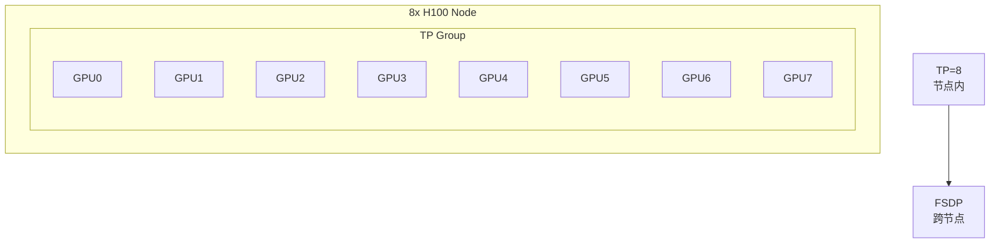

**Why this combination?**
- TP within node (fast NVLink): minimal communication overhead
- FSDP across nodes: simple, robust, good scaling
- Avoids pipeline bubbles entirely

### FSDP + TP Configuration

```python
from torch.distributed.distributed_c10d import _get_default_group
from torch.distributed._tensor import DeviceMesh, DTensor
from torch.distributed.fsdp import FullyShardedDataParallel as FSDP
from torch.distributed.fsdp.wrap import transformer_auto_wrap_policy
from torch.distributed.tensor.parallel import parallelize_module, ColwiseParallel, RowwiseParallel

# Step 1: 创建 2D mesh: [dp, tp]
mesh = DeviceMesh("cuda", torch.arange(world_size).view(dp_size, tp_size))
tp_mesh = mesh["tp"]   # Tensor Parallel mesh
dp_mesh = mesh["dp"]   # Data Parallel mesh

# Step 2: 先应用 Tensor Parallel
model = parallelize_module(
    model,
    tp_mesh,
    {
        "attention.qkv": ColwiseParallel(),
        "attention.out_proj": RowwiseParallel(),
        "mlp.gate_up_proj": ColwiseParallel(),
        "mlp.down_proj": RowwiseParallel(),
    }
)

# Step 3: 再应用 FSDP (在 DP 维度)
model = FSDP(
    model,
    process_group=dp_mesh.get_process_group(),
    auto_wrap_policy=...
)
```

### 4D Parallelism (2026 Frontier)

Some cutting-edge systems add a fourth dimension:

| 维度 | 名称 | 范围 | 通信 |
|------|------|------|------|
| DP | 数据并行 | 跨所有节点 | 梯度 AllReduce |
| TP | 张量并行 | 节点内 (8 GPUs) | 激活值 AllReduce |
| PP | 流水线并行 | 跨节点子集 | 点对点 |
| EP | 专家并行 (MoE) | 跨所有节点 | All-to-All |

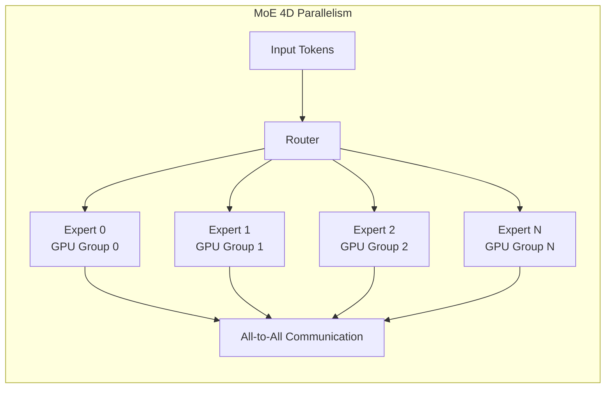

---

## 通信优化

### Inter-GPU Communication Technologies (2026)

| 技术 | 带宽 | 延迟 | 范围 | 2026 状态 |
|------|------|------|------|----------|
| **PCIe Gen5 x16** | 64 GB/s | ~1μs | 单节点 | 基础连接 |
| **NVLink 4** | 900 GB/s | ~0.5μs | 单节点 (GPU-GPU) | H100/B200 标配 |
| **NVSwitch** | 900 GB/s per port | ~0.5μs | 单节点全互联 | DGX/HGX 标配 |
| **InfiniBand NDR** | 400 Gbps | ~0.6μs | 跨节点 | 主流集群网络 |
| **InfiniBand XDR** | 800 Gbps | ~0.5μs | 跨节点 | 2026 新部署 |
| **Spectrum-X** | 400 Gbps | ~1μs | 跨节点 | NVIDIA 以太网方案 |
| **AWS EFA** | 400 Gbps | ~1μs | 跨节点 | 云原生 RDMA |

### NCCL: The Communication Backbone

NCCL (NVIDIA Collective Communications Library) is the standard for GPU collectives:

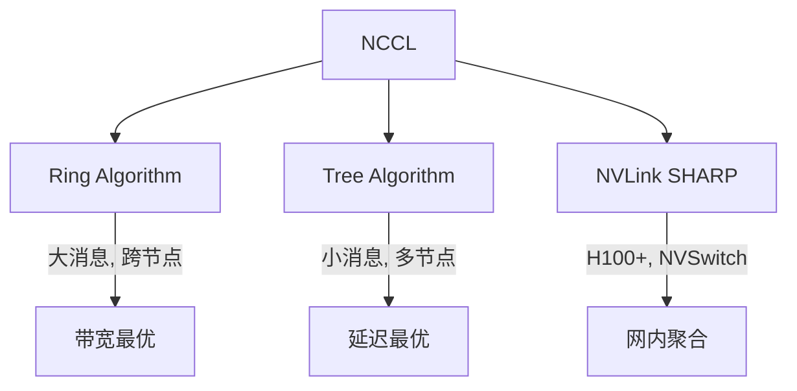

**NCCL Environment Variables (2026 调优)**:

| 环境变量 | 默认值 | 调优建议 | 作用 |
|---------|-------|---------|------|
| `NCCL_ALGO` | Ring/Tree | NVLS (H100) | 选择集合算法 |
| `NCCL_IB_HCA` | auto | 指定网卡 | IB 网卡选择 |
| `NCCL_SOCKET_IFNAME` | auto | eth0/ib0 | 网络接口 |
| `NCCL_BUFFSIZE` | 4M | 8-16M | 通信缓冲区 |
| `NCCL_P2P_DISABLE` | 0 | 保持 0 | 禁用 P2P (调试) |
| `NCCL_SHM_DISABLE` | 0 | 保持 0 | 禁用共享内存 |
| `NCCL_NSOCKS_PERTHREAD` | auto | 2-4 | IB 连接数 |
| `NCCL_MIN_NCHANNELS` | auto | 32+ | 最小通道数 |

### Gradient Compression

For bandwidth-constrained environments:

| 方法 | 压缩率 | 对收敛影响 | 2026 适用性 |
|------|--------|-----------|------------|
| **FP16/BF16 梯度** | 2x | 无 | 默认 |
| **1-bit Adam** | 32x | 小 | 已较少使用 |
| **Top-K Sparsification** | 10-100x | 中 | 研究为主 |
| **Error Compensation** | 随方法 | 小 | 配合 Top-K |
| **Quantization (INT8)** | 4x | 小 | 训练后量化 |

```python
# DeepSpeed 1-bit Adam 示例 (历史参考)
"zero_optimization": {
    "stage": 1,
    "reduce_scatter": True,
    "communication_data_type": "fp16",
    # 2026 推荐: 直接用 BF16 + 高速网络，无需激进压缩
}
```

### Communication-Computation Overlap

Modern training frameworks aggressively overlap communication with computation:

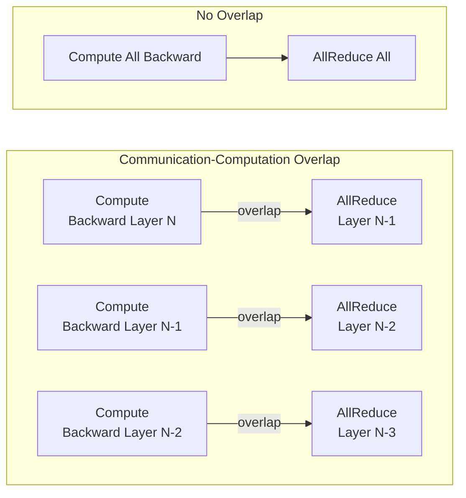

**Techniques for Better Overlap**:
1. **Bucket-based AllReduce**: Group small gradients into buckets
2. **Delay gradient reduction**: Start AllReduce when bucket fills
3. **FSDP forward prefetch**: Pre-gather next layer parameters
4. **FSDP backward prefetch**: Pre-gather next backward layer

---

## 实战代码

### Complete DDP Training Example

```python
#!/usr/bin/env python
"""
分布式训练完整示例: PyTorch DDP + AMP
运行: torchrun --nproc_per_node=8 ddp_example.py
"""

import os
import torch
import torch.nn as nn
import torch.distributed as dist
from torch.nn.parallel import DistributedDataParallel as DDP
from torch.utils.data import DataLoader, DistributedSampler
from torch.utils.data.dataset import TensorDataset
from torch.cuda.amp import autocast, GradScaler


def setup():
    """初始化分布式环境"""
    dist.init_process_group("nccl")
    local_rank = int(os.environ["LOCAL_RANK"])
    torch.cuda.set_device(local_rank)
    return local_rank


def cleanup():
    dist.destroy_process_group()


class SimpleTransformer(nn.Module):
    """简化版 Transformer 用于示例"""
    def __init__(self, vocab_size=32000, dim=1024, num_layers=12):
        super().__init__()
        self.embedding = nn.Embedding(vocab_size, dim)
        encoder_layer = nn.TransformerEncoderLayer(
            d_model=dim,
            nhead=16,
            dim_feedforward=4 * dim,
            batch_first=True,
            dtype=torch.bfloat16,
        )
        self.transformer = nn.TransformerEncoder(encoder_layer, num_layers)
        self.lm_head = nn.Linear(dim, vocab_size, bias=False)

    def forward(self, input_ids):
        x = self.embedding(input_ids)
        x = self.transformer(x)
        logits = self.lm_head(x)
        return logits


def create_dummy_dataset(seq_length=2048, num_samples=10000):
    """创建模拟数据集"""
    input_ids = torch.randint(0, 32000, (num_samples, seq_length))
    labels = torch.randint(0, 32000, (num_samples, seq_length))
    return TensorDataset(input_ids, labels)


def train():
    local_rank = setup()
    world_size = dist.get_world_size()
    global_rank = dist.get_rank()

    # 1. 创建模型并移到当前 GPU
    model = SimpleTransformer(vocab_size=32000, dim=1024, num_layers=12)
    model = model.to(f"cuda:{local_rank}")

    # 2. 包装为 DDP
    model = DDP(
        model,
        device_ids=[local_rank],
        output_device=local_rank,
        bucket_cap_mb=25,           # 梯度桶大小
        gradient_as_bucket_view=True,  # 避免梯度拷贝
        static_graph=True,          # 静态图优化
    )

    # 3. 优化器
    optimizer = torch.optim.AdamW(model.parameters(), lr=1e-4, fused=True)
    scaler = GradScaler()  # 混合精度

    # 4. 数据加载 (DistributedSampler 保证数据不重复)
    dataset = create_dummy_dataset()
    sampler = DistributedSampler(
        dataset,
        num_replicas=world_size,
        rank=global_rank,
        shuffle=True,
    )
    dataloader = DataLoader(
        dataset,
        batch_size=4,  # 每卡 batch size
        sampler=sampler,
        num_workers=4,
        pin_memory=True,
    )

    # 5. 训练循环
    model.train()
    for epoch in range(3):
        sampler.set_epoch(epoch)  # 必须！保证打乱顺序不同
        for step, (input_ids, labels) in enumerate(dataloader):
            input_ids = input_ids.to(local_rank)
            labels = labels.to(local_rank)

            optimizer.zero_grad()

            with autocast(dtype=torch.bfloat16):
                logits = model(input_ids)
                loss = nn.functional.cross_entropy(
                    logits.view(-1, logits.size(-1)),
                    labels.view(-1),
                )

            scaler.scale(loss).backward()
            scaler.step(optimizer)
            scaler.update()

            if step % 10 == 0 and global_rank == 0:
                print(f"Epoch {epoch}, Step {step}, Loss: {loss.item():.4f}")

    # 6. 保存 (只在 rank 0 保存)
    if global_rank == 0:
        torch.save(model.module.state_dict(), "model.pt")

    cleanup()


if __name__ == "__main__":
    train()
```

### FSDP Training Example

```python
#!/usr/bin/env python
"""
FSDP 训练完整示例
运行: torchrun --nproc_per_node=8 fsdp_example.py
"""

import os
import functools
import torch
import torch.distributed as dist
from torch.distributed.fsdp import FullyShardedDataParallel as FSDP
from torch.distributed.fsdp.wrap import transformer_auto_wrap_policy
from torch.distributed.fsdp.api import BackwardPrefetch, CPUOffload
from torch.distributed.algorithms._checkpoint.checkpoint_wrapper import (
    checkpoint_wrapper,
    CheckpointImpl,
    apply_activation_checkpointing,
)


def setup():
    dist.init_process_group("nccl")
    local_rank = int(os.environ["LOCAL_RANK"])
    torch.cuda.set_device(local_rank)
    return local_rank


class TransformerBlock(nn.Module):
    """单个 Transformer 层"""
    def __init__(self, dim, num_heads):
        super().__init__()
        self.attn = nn.MultiheadAttention(dim, num_heads, batch_first=True)
        self.mlp = nn.Sequential(
            nn.Linear(dim, 4 * dim),
            nn.GELU(),
            nn.Linear(4 * dim, dim),
        )
        self.ln1 = nn.LayerNorm(dim)
        self.ln2 = nn.LayerNorm(dim)

    def forward(self, x):
        x = x + self.attn(self.ln1(x), self.ln1(x), self.ln1(x))[0]
        x = x + self.mlp(self.ln2(x))
        return x


class GPTModel(nn.Module):
    def __init__(self, vocab_size=32000, dim=4096, num_layers=32, num_heads=32):
        super().__init__()
        self.embedding = nn.Embedding(vocab_size, dim)
        self.layers = nn.ModuleList([
            TransformerBlock(dim, num_heads) for _ in range(num_layers)
        ])
        self.ln_f = nn.LayerNorm(dim)
        self.lm_head = nn.Linear(dim, vocab_size, bias=False)

    def forward(self, input_ids):
        x = self.embedding(input_ids)
        for layer in self.layers:
            x = layer(x)
        x = self.ln_f(x)
        return self.lm_head(x)


def train():
    local_rank = setup()
    global_rank = dist.get_rank()

    # 1. 创建模型
    model = GPTModel(vocab_size=32000, dim=4096, num_layers=32, num_heads=32)

    # 2. 激活值重计算 (省显存)
    apply_activation_checkpointing(
        model,
        checkpoint_wrapper_fn=functools.partial(
            checkpoint_wrapper,
            checkpoint_impl=CheckpointImpl.NO_REENTRANT,
        ),
        check_fn=lambda submodule: isinstance(submodule, TransformerBlock),
    )

    # 3. FSDP 包装
    model = FSDP(
        model,
        auto_wrap_policy=functools.partial(
            transformer_auto_wrap_policy,
            transformer_layer_cls={TransformerBlock},
        ),
        mixed_precision=torch.bfloat16,
        device_id=torch.cuda.current_device(),
        limit_all_gathers=True,
        forward_prefetch=True,
        backward_prefetch=BackwardPrefetch.BACKWARD_PRE,
        cpu_offload=CPUOffload(offload_params=False),  # 可改为 True offload 到 CPU
    )

    # 4. 优化器
    optimizer = torch.optim.AdamW(model.parameters(), lr=1e-4, fused=True)

    # 5. 模拟训练
    for step in range(100):
        batch = torch.randint(0, 32000, (2, 2048)).to(local_rank)

        with torch.autocast(device_type="cuda", dtype=torch.bfloat16):
            logits = model(batch)
            loss = logits.mean()  # 模拟损失

        loss.backward()
        optimizer.step()
        optimizer.zero_grad()

        if step % 10 == 0 and global_rank == 0:
            print(f"Step {step}, Loss: {loss.item():.4f}")

    # 6. 保存完整状态
    from torch.distributed.fsdp import FullStateDictConfig
    from torch.distributed.fsdp.api import StateDictType

    FSDP.set_state_dict_type(
        model,
        StateDictType.FULL_STATE_DICT,
        state_dict_config=FullStateDictConfig(offload_to_cpu=True, rank0_only=True),
    )

    if global_rank == 0:
        state_dict = model.state_dict()
        torch.save(state_dict, "fsdp_model.pt")

    dist.destroy_process_group()


if __name__ == "__main__":
    train()
```

### DeepSpeed Training with Config

```python
#!/usr/bin/env python
"""
DeepSpeed 训练示例
运行: deepspeed --num_gpus=8 deepspeed_example.py --deepspeed ds_config.json
"""

import torch
import torch.nn as nn
import deepspeed


class SimpleModel(nn.Module):
    def __init__(self):
        super().__init__()
        self.net = nn.Sequential(
            nn.Linear(1024, 4096),
            nn.GELU(),
            nn.Linear(4096, 4096),
            nn.GELU(),
            nn.Linear(4096, 32000),
        )

    def forward(self, x):
        return self.net(x)


def train():
    model = SimpleModel()

    # DeepSpeed 自动解析命令行参数和配置文件
    model_engine, optimizer, _, _ = deepspeed.initialize(
        model=model,
        model_parameters=model.parameters(),
        config="ds_config.json",
    )

    for step in range(100):
        batch = torch.randn(4, 2048, 1024).to(model_engine.local_rank)

        loss = model_engine(batch).mean()
        model_engine.backward(loss)
        model_engine.step()

        if model_engine.global_rank == 0 and step % 10 == 0:
            print(f"Step {step}, Loss: {loss.item():.4f}")

    # 保存
    model_engine.save_checkpoint("./checkpoints")


if __name__ == "__main__":
    train()
```

### Checkpoint Save/Load with FSDP

```python
"""
FSDP Checkpoint 最佳实践
"""
import torch.distributed.checkpoint as dcp
from torch.distributed.checkpoint import FileSystemWriter, FileSystemReader
from torch.distributed.fsdp import FullyShardedDataParallel as FSDP
from torch.distributed.fsdp.api import StateDictType, FullStateDictConfig, ShardedStateDictConfig


def save_sharded_checkpoint(model, optimizer, checkpoint_dir):
    """保存分片 checkpoint (推荐，所有 rank 并行写入)"""
    # 设置分片状态字典
    FSDP.set_state_dict_type(
        model,
        StateDictType.SHARDED_STATE_DICT,
        state_dict_config=ShardedStateDictConfig(),
    )

    state_dict = {
        "model": model.state_dict(),
        "optimizer": FSDP.optim_state_dict(model, optimizer),
    }

    dcp.save(
        state_dict=state_dict,
        storage_writer=FileSystemWriter(checkpoint_dir),
    )


def load_sharded_checkpoint(model, optimizer, checkpoint_dir):
    """加载分片 checkpoint"""
    FSDP.set_state_dict_type(
        model,
        StateDictType.SHARDED_STATE_DICT,
    )

    state_dict = {
        "model": model.state_dict(),
        "optimizer": FSDP.optim_state_dict(model, optimizer),
    }

    dcp.load(
        state_dict=state_dict,
        storage_reader=FileSystemReader(checkpoint_dir),
    )

    # 加载优化器状态
    optim_state = state_dict["optimizer"]
    flattened_osd = FSDP.optim_state_dict_to_load(model, optimizer, optim_state)
    optimizer.load_state_dict(flattened_osd)


def save_full_model(model, output_path):
    """保存完整模型到单个文件 (仅 rank 0)"""
    FSDP.set_state_dict_type(
        model,
        StateDictType.FULL_STATE_DICT,
        state_dict_config=FullStateDictConfig(
            offload_to_cpu=True,
            rank0_only=True,
        ),
    )

    state_dict = model.state_dict()
    if dist.get_rank() == 0:
        torch.save(state_dict, output_path)
```

---

## 性能调优

### Batch Size 选择

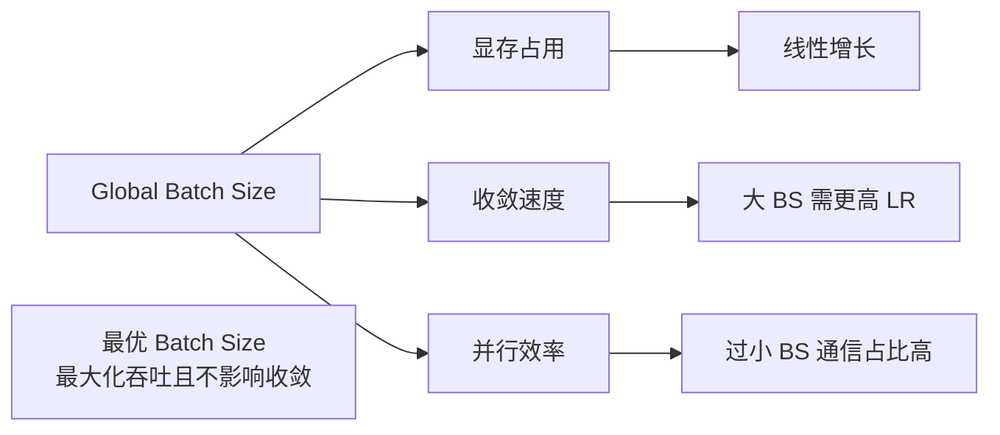

**批量大小缩放法则 (2026 实践)**:

| 模型大小 | 每卡 batch | Global batch | 梯度累积 | 说明 |
|---------|-----------|-------------|---------|------|
| 1B-7B | 4-8 | 512-2048 | 1-4 | 小批量即可 |
| 13B-30B | 1-2 | 1024-2048 | 4-8 | 序列长度 4096+ |
| 70B-100B | 1 | 2048-4096 | 8-16 | 需仔细调优 |
| 300B+ | 1 | 4096-8192 | 16-32 | 参考论文设置 |

**学习率缩放规则**:
- Linear scaling: $\eta = \eta_0 \times (B / B_0)$ — 适用于小范围调整
- Square root scaling: $\eta = \eta_0 \times \sqrt{B / B_0}$ — 更稳定
- 2026 实践: 使用 warmup + cosine decay，根据验证集调优

### GPU 利用率分析

```bash
# 1. 实时监控 GPU
watch -n 1 nvidia-smi

# 2. PyTorch Profiler
torch.profiler.profile(
    activities=[
        torch.profiler.ProfilerActivity.CPU,
        torch.profiler.ProfilerActivity.CUDA,
    ],
    schedule=torch.profiler.schedule(wait=1, warmup=1, active=3, repeat=2),
    on_trace_ready=torch.profiler.tensorboard_trace_handler("./log"),
    with_stack=True,
)

# 3. 检查通信瓶颈: NCCL 时间占比应 < 20%
# 4. 检查内存带宽: 应接近理论峰值 80%+
# 5. 检查 Tensor Core 利用率: 应 > 70%
```

### 性能调优 Checklist

| 检查项 | 目标 | 调优方法 |
|--------|------|---------|
| GPU 计算利用率 | > 90% | 增大 batch，减少 CPU-GPU 拷贝 |
| 显存占用 | < 90% | 激活重计算，FSDP，Offload |
| 通信时间占比 | < 20% | 增大 batch，梯度累积，压缩 |
| NCCL 带宽 | > 80% 理论 | 调优 NCCL 参数，检查网络 |
| CPU 瓶颈 | 无 | `pin_memory=True`, 增加 `num_workers` |
| 加载时间 | < 5% | 预取，异步数据加载 |

### Mixed Precision Strategy

| 精度 | 显存节省 | 速度提升 | 稳定性 | 2026 建议 |
|------|---------|---------|--------|----------|
| FP32 | 基准 | 基准 | ⭐⭐⭐⭐⭐ | 仅调试 |
| AMP FP16 | 2x | 2-8x | ⭐⭐⭐☆☆ | 不推荐 |
| AMP BF16 | 2x | 2-8x | ⭐⭐⭐⭐⭐ | **默认推荐** |
| FP8 (H100+) | 4x | 2-8x | ⭐⭐⭐⭐☆ | Transformer Engine |
| TF32 | 无 | 2-4x | ⭐⭐⭐⭐⭐ | Matmul 默认 |

```python
# BF16 配置 (2026 默认)
from torch.cuda.amp import autocast

with autocast(dtype=torch.bfloat16):
    output = model(input)

# FP8 (需 Transformer Engine)
import transformer_engine.pytorch as te

# 自动将 Linear 替换为 FP8 版本
model = te.replace._replace_linear(model)
```

### Memory Profiling

```python
"""显存分析工具"""
import torch
from torch.distributed.fsdp import FullyShardedDataParallel as FSDP

# 1. PyTorch 显存统计
torch.cuda.memory_summary(device=local_rank)
torch.cuda.reset_peak_memory_stats()

# 2. FSDP 显存汇总
from torch.distributed.fsdp import FSDP
FSDP.summon_full_params(model):
    # 临时汇聚所有参数，查看总大小
    total_params = sum(p.numel() for p in model.parameters())
    print(f"Total parameters: {total_params / 1e9:.2f}B")

# 3. 激活值显存估算
# activation_memory ≈ batch_size × seq_len × hidden_dim × num_layers × 4 bytes
```

---

## 常见问题

### 1. 死锁 (Deadlock)

**症状**: 训练卡住，GPU 利用率 100% 但无进展，NCCL timeout。

**原因与解决**:

| 原因 | 诊断 | 解决 |
|------|------|------|
| 不均匀的输入长度 | 某些 rank 处理更长序列 | 使用 padding + `batch_sampler` |
| `barrier()` 不匹配 | 部分 rank 跳过同步点 | 确保所有 rank 执行相同分支 |
| 文件系统操作只在 rank 0 | 其他 rank 等待 | 用 `dist.barrier()` 同步 |
| 自定义 `__getitem__` 异常 | 某些 rank 数据加载失败 | 添加异常处理和日志 |
| 混合 DDP + non-DDP forward | 某些调用跳过 gradient sync | 统一使用 DDP forward |

```python
# 安全的 barrier 模式
if global_rank == 0:
    # 只在 rank 0 执行 IO
    data = load_data()
    dist.broadcast_object_list([data], src=0)
else:
    data = [None]
    dist.broadcast_object_list(data, src=0)
    data = data[0]
```

### 2. OOM (Out of Memory)

**诊断流程**:

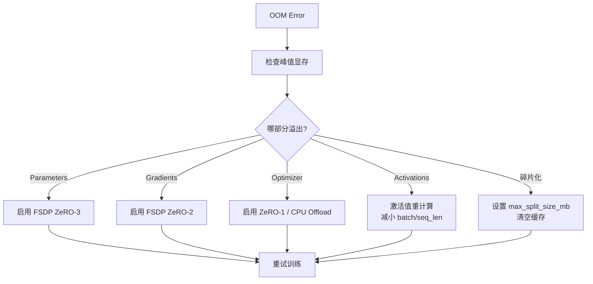

**OOM 解决速查表**:

| OOM 来源 | 解决手段 | 显存节省 |
|---------|---------|---------|
| 模型参数 | FSDP ZeRO-3, DeepSpeed ZeRO-3 | $\sim N$ 倍 |
| 优化器状态 | FSDP ZeRO-2, DeepSpeed ZeRO-1/2 | $\sim N$ 倍 |
| 激活值 | Activation Checkpointing | $\sim \sqrt{L}$ 倍 |
| 长序列 | Sequence Parallelism | TP 倍 |
| 临时buffer | `limit_all_gathers=True` | 避免峰值 |
| 显存碎片 | `PYTORCH_CUDA_ALLOC_CONF=max_split_size_mb:512` | 减少碎片 |

```bash
# 环境变量控制显存分配
export PYTORCH_CUDA_ALLOC_CONF="max_split_size_mb:512,garbage_collection_threshold:0.6"
```

### 3. 收敛问题

| 现象 | 可能原因 | 解决 |
|------|---------|------|
| 损失不下降 | 学习率过大/过小 | 使用 LR warmup + decay |
| 损失震荡 | Batch size 过小 | 增大 global batch |
| 发散 (NaN) | FP16 溢出 | 改用 BF16 / 梯度裁剪 / 损失缩放 |
| 收敛慢 | 梯度同步问题 | 检查 DDP/FSDP 配置 |
| 随机种子不同步 | 各 rank 初始化不同 | `torch.manual_seed(seed + rank)` |
| Dropout/BN 不一致 | 未同步 RNG | 手动同步或检查 `torch.cuda.manual_seed` |

```python
# 安全的分布式初始化
import random
import numpy as np

def set_seed(seed=42):
    random.seed(seed)
    np.random.seed(seed)
    torch.manual_seed(seed)
    torch.cuda.manual_seed_all(seed)
    # 注意：不同 rank 的数据顺序仍由 DistributedSampler 保证
```

### 4. 慢节点 (Straggler)

**症状**: 某些迭代明显慢于其他，总体吞吐受最慢节点限制。

| 原因 | 解决 |
|------|------|
| 数据加载慢 | 增加 `num_workers`, `pin_memory=True`, 预缓存 |
| 网络拥塞 | 检查 IB 带宽，避免与其他作业共享网络 |
| CPU 瓶颈 | 减少预处理复杂度，使用 NVJPEG 等 GPU 解码 |
| GPU 降频 | 检查散热，监控 `nvidia-smi` 时钟 |
| 坏 GPU | 替换硬件，使用 `CUDA_VISIBLE_DEVICES` 绕过 |

```python
# 检测慢节点：记录每个 iteration 时间
import time

start = time.time()
# ... training step ...
elapsed = time.time() - start
# 收集所有 rank 的时间
all_times = [torch.zeros(1, device="cuda") for _ in range(world_size)]
dist.all_gather(all_times, torch.tensor([elapsed], device="cuda"))
if rank == 0:
    max_time = max(t.item() for t in all_times)
    min_time = min(t.item() for t in all_times)
    if max_time > min_time * 1.5:
        print(f"WARNING: Straggler detected! Min: {min_time:.3f}, Max: {max_time:.3f}")
```

### 5. Checkpoint 相关

| 问题 | 原因 | 解决 |
|------|------|------|
| 保存 OOM | FSDP full state dict 汇聚到单卡 | 使用 ShardedStateDict |
| 加载 shape 不匹配 | 模型结构或 TP/PP 维度不同 | 确保相同并行配置 |
| 优化器状态丢失 | 只保存了模型权重 | 使用 `FSDP.optim_state_dict` |
| 保存太慢 | 单进程写入大文件 | 使用分布式 checkpoint (dcp) |

### 6. 通信错误

| 错误信息 | 原因 | 解决 |
|---------|------|------|
| `NCCL communicator was aborted` | 某 rank 异常退出 | 检查所有 rank 日志 |
| `NCCL timeout` | 死锁或不均匀负载 | 增加 `NCCL_TIMEOUT` 或修复死锁 |
| `Connection refused` | 网络配置错误 | 检查 `NCCL_SOCKET_IFNAME`, IB 配置 |
| `CUDA error: invalid device ordinal` | GPU 编号错误 | 检查 `CUDA_VISIBLE_DEVICES` |
| `RuntimeError: Address already in use` | 端口冲突 | 设置不同 `MASTER_PORT` |

---

## References

### 交叉引用

- 神经网络基础与反向传播原理，请参阅 [`../深度学习/README.md`](../../深度学习/README.md)
- 模型推理优化与部署，请参阅 [`.部署推理/README.md`](../../部署推理/README.md)
- GPU 集群硬件配置与网络拓扑，请参阅 [`../架构基建/Architecture_Overview/AI_Infrastructure_2026`](架构基建/Architecture_Overview/AI_Infrastructure_2026)
- 模型评估方法，请参阅 [`模型评估/Evaluation_Fundamentals/Model_Evaluation.md`](模型评估/Evaluation_Fundamentals/Model_Evaluation.md)
- MLOps 训练流水线，请参阅 [`模型运维/MLOps_Fundamentals/MLOps_Pipeline.md`](模型运维/MLOps_Fundamentals/MLOps_Pipeline.md)

### 核心论文

1. **ZeRO**: Rajbhandari et al., "ZeRO: Memory Optimizations Toward Training Trillion Parameter Models," SC 2020.
2. **Megatron-LM**: Shoeybi et al., "Megatron-LM: Training Multi-Billion Parameter Language Models Using Model Parallelism," 2019.
3. **FSDP**: Facebook (Meta), "Fully Sharded Data Parallel: faster AI training with fewer GPUs," 2021.
4. **DeepSpeed**: Rasley et al., "DeepSpeed: System Optimizations Enable Training Deep Learning Models with Over 100 Billion Parameters," KDD 2020.
5. **Zero Bubble Pipeline**: Qi et al., "Zero Bubble Pipeline Parallelism," ICLR 2024.
6. **Sequence Parallelism**: Korthikanti et al., "Reducing Activation Recomputation in Large Transformer Models," 2022.
7. **FP8 Training**: NVIDIA, "Transformer Engine: Accelerated Transformer Training," 2022.

### 官方文档

- [PyTorch Distributed](https://pytorch.org/tutorials/beginner/dist_overview.html)
- [PyTorch FSDP](https://pytorch.org/docs/stable/fsdp.html)
- [DeepSpeed Documentation](https://www.deepspeed.ai/docs/)
- [NVIDIA Megatron-LM](https://github.com/NVIDIA/Megatron-LM)
- [NCCL Documentation](https://docs.nvidia.com/deeplearning/nccl/)

---

*Last updated: 2026-05-07*

## Related

- [[模型训练/Distributed_Training/Distributed_Training_for_dummy]] — 分布式训练 - 小白版 (共享: distributed-training, fsdp, model-training, optimization)
- [[模型训练/Optimization/Mixed_Precision_Training]] — 混合精度训练 (Mixed Precision Training) (共享: distributed-training, fsdp, model-training, optimization)
- [[模型训练/Model-Training-in-nutshell]] — 模型训练速成指南 (共享: distributed-training, fsdp, model-training, optimization)
- [[模型训练/Model_Training_for_dummy]] — 模型训练小白指南 (共享: distributed-training, fsdp, model-training, optimization)
- [[模型训练/Optimization/Training_Optimization_2026.md|Training_Optimization_2026]]
