# GRPO 与新一代对齐方法 (GRPO and New Alignment Methods)

> **一句话理解**: 如果 RLHF 是给模型请了一整套"教练团队"（裁判、助教、陪练），那 GRPO 就是让模型自己组队互评——省掉了最贵的裁判，效果却一样好。

---

## 目录

1. [对齐方法演进总览](#1-对齐方法演进总览)
2. [RLHF (PPO-based) 回顾](#2-rlhf-ppo-based-回顾)
3. [DPO (Direct Preference Optimization)](#3-dpo-direct-preference-optimization)
4. [GRPO (Group Relative Policy Optimization)](#4-grpo-group-relative-policy-optimization)
5. [RLOO (REINFORCE Leave-One-Out)](#5-rloo-reinforce-leave-one-out)
6. [Rejection Sampling 拒绝采样](#6-rejection-sampling-拒绝采样)
7. [Reasoning RL: o1/R1 风格推理强化学习](#7-reasoning-rl-o1r1-风格推理强化学习)
8. [Process Reward Models vs Outcome Reward Models](#8-process-reward-models-vs-outcome-reward-models)
9. [对齐方法全景对比表](#9-对齐方法全景对比表)
10. [实战代码与工具链](#10-实战代码与工具链)
11. [前沿挑战与未来方向](#11-前沿挑战与未来方向)
12. [与其他章节的关联](#12-与其他章节的关联)

---

## 1. 对齐方法演进总览

### 1.1 从 SFT 到 GRPO：对齐方法的"简化革命"

大语言模型对齐 (Alignment) 的目标是让预训练模型变得 **有用 (Helpful)、诚实 (Honest)、无害 (Harmless)**。从 2022 年到 2024 年，对齐方法经历了一场从复杂到简洁的演进：

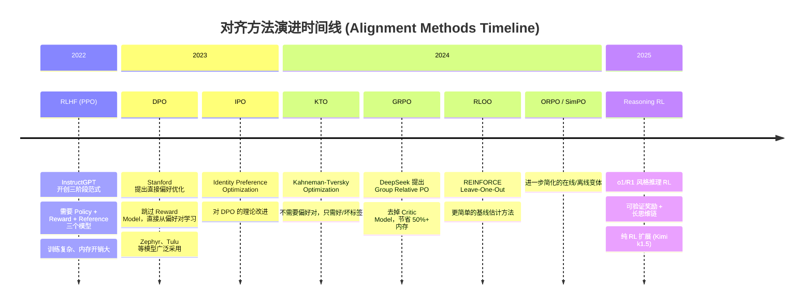

### 1.2 核心趋势：从"重型工程"到"优雅算法"

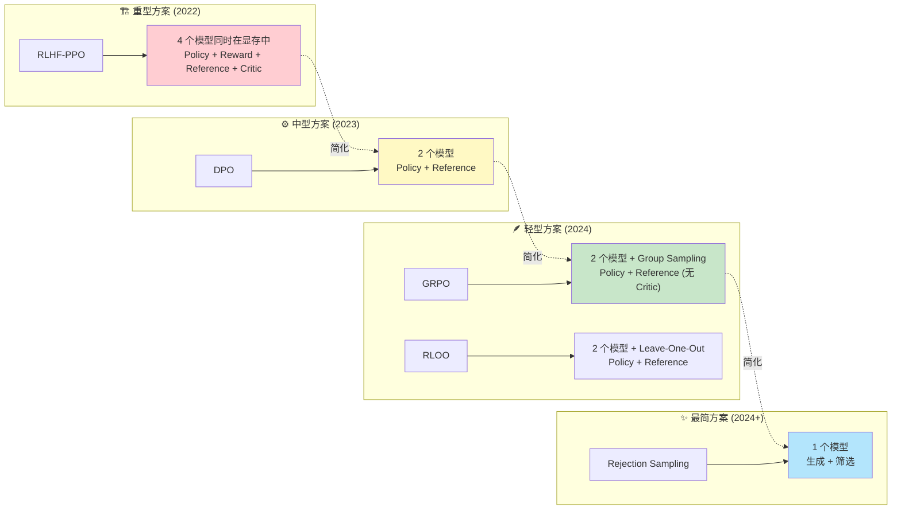

**核心洞察 (Key Insight)**：每一代对齐方法都在减少需要同时训练的模型数量，降低工程复杂度，同时保持甚至提升对齐效果。

### 1.3 方法分类框架

| 维度 | 在线方法 (Online) | 离线方法 (Offline) |
|------|-------------------|-------------------|
| **定义** | 训练过程中持续生成新样本 | 使用预先收集的固定数据集 |
| **代表方法** | RLHF (PPO), GRPO, RLOO | DPO, KTO, IPO |
| **优点** | 探索性更强，能发现数据分布外的优质回答 | 训练稳定，工程简单 |
| **缺点** | 训练不稳定，工程复杂 | 受限于数据集质量和覆盖度 |
| **典型使用者** | OpenAI, DeepSeek | HuggingFace Zephyr, Allen AI Tulu |

---

## 2. RLHF (PPO-based) 回顾

### 2.1 三阶段训练范式

RLHF (Reinforcement Learning from Human Feedback) 由 InstructGPT (2022) 确立，是 LLM 对齐的开创性方法。其核心流程分为三个阶段：

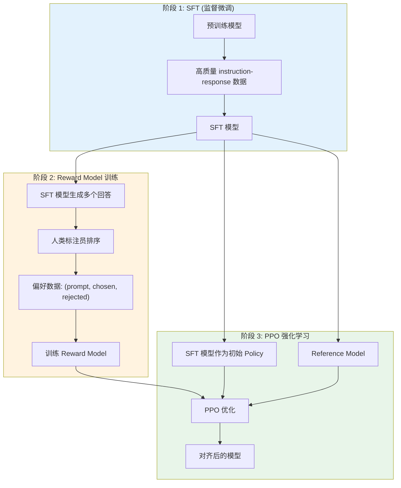

### 2.2 PPO 算法核心数学

PPO (Proximal Policy Optimization) 的核心思想是限制策略更新幅度，避免训练崩溃。

**目标函数 (Clipped Surrogate Objective)**:

$$
L^{CLIP}(\theta) = \mathbb{E}_t \left[ \min \left( r_t(\theta) \hat{A}_t, \; \text{clip}(r_t(\theta), 1-\epsilon, 1+\epsilon) \hat{A}_t \right) \right]
$$

其中:
- $r_t(\theta) = \frac{\pi_\theta(a_t | s_t)}{\pi_{old}(a_t | s_t)}$ 是策略比率 (policy ratio)
- $\hat{A}_t$ 是优势函数估计 (advantage estimate)
- $\epsilon$ 是裁剪范围 (通常 0.1~0.2)

**RLHF 中的 KL 惩罚**:

为了防止策略偏离 SFT 模型太远，在奖励中加入 KL 散度惩罚：

$$
R(x, y) = r_\phi(x, y) - \beta \cdot D_{KL}(\pi_\theta \| \pi_{ref})
$$

其中：
- $r_\phi(x, y)$ 是 Reward Model 给出的分数
- $\beta$ 是 KL 惩罚系数
- $\pi_{ref}$ 是 Reference Model (通常是 SFT 模型)

**Value Function (Critic Model)**:

PPO 使用 Actor-Critic 架构，Critic 模型 $V_\psi(s)$ 估计状态价值：

$$
\hat{A}_t = R_t + \gamma V_\psi(s_{t+1}) - V_\psi(s_t)
$$

> **类比理解**: PPO 就像一个小心翼翼的学习者——每次只迈出一小步 (clip)，还要不断回头看老师 (KL penalty) 有没有走偏。

### 2.3 RLHF 的工程复杂度

RLHF-PPO 需要同时维护 **4 个模型**在显存中，这是其最大的工程挑战：

| 模型 | 角色 | 参数量 | 是否需要梯度 |
|------|------|--------|-------------|
| **Policy Model** $\pi_\theta$ | 正在训练的对话模型 | 完整模型 | 是 |
| **Reward Model** $r_\phi$ | 评估回答质量 | 完整模型 | 否 (frozen) |
| **Reference Model** $\pi_{ref}$ | KL 散度约束基准 | 完整模型 | 否 (frozen) |
| **Critic Model** $V_\psi$ | 估计状态价值 | 完整模型 | 是 |

**显存需求 (以 LLaMA-70B 为例, BF16)**:

| 组件 | 显存占用 | 说明 |
|------|----------|------|
| Policy Model 参数 | 140 GB | 70B × 2 bytes |
| Policy Model 梯度 | 140 GB | 与参数同尺寸 |
| Policy Model 优化器状态 (Adam) | 560 GB | 70B × 8 bytes |
| Reward Model | 140 GB | frozen, 仅推理 |
| Reference Model | 140 GB | frozen, 仅推理 |
| Critic Model 参数 + 梯度 + 优化器 | 840 GB | 与 Policy 同规模 |
| **总计** | **~1960 GB** | 需要 25+ A100-80GB |

> **关键痛点**: Critic Model 是 RLHF-PPO 中最"昂贵"的组件——它需要一个与 Policy 同规模的模型来估计价值函数，但对最终对话质量没有直接贡献。

### 2.4 主流 RLHF 实现框架

| 框架 | 特点 | 链接 |
|------|------|------|
| **TRLX** | CarperAI 出品，支持 PPO/ILQL | [GitHub](https://github.com/CarperAI/trlx) |
| **OpenRLHF** | 高效分布式 RLHF 训练 | [GitHub](https://github.com/OpenRLHF/OpenRLHF) |
| **TRL** | HuggingFace 官方 RLHF 库 | [GitHub](https://github.com/huggingface/trl) |
| **DeepSpeed-Chat** | Microsoft 端到端 RLHF 方案 | [GitHub](https://github.com/microsoft/DeepSpeedExamples) |
| **veRL** | VolcEngine RL 框架 (字节) | [GitHub](https://github.com/volcengine/verl) |

### 2.5 RLHF 的主要问题总结

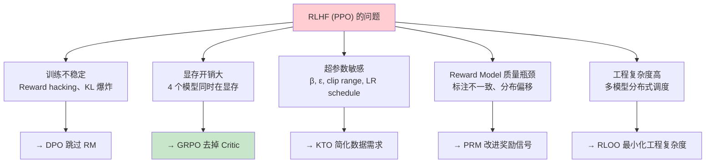

---

## 3. DPO (Direct Preference Optimization)

### 3.1 核心思想：跳过 Reward Model

DPO (Direct Preference Optimization, Stanford 2023) 的核心洞察是：**Reward Model 的训练目标可以直接用 Policy Model 的参数来表达**。

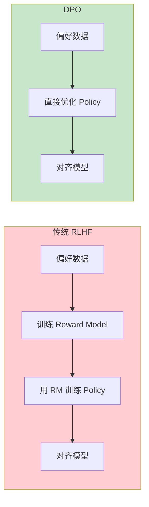

### 3.2 数学推导：隐式奖励 (Implicit Reward)

DPO 的优雅之处在于推导出 **Policy 本身就隐含地定义了一个 Reward Model**。

**Step 1**: 从 RLHF 的最优策略公式出发：

$$
\pi^*(y|x) = \frac{1}{Z(x)} \pi_{ref}(y|x) \exp\left(\frac{r(x,y)}{\beta}\right)
$$

**Step 2**: 反解出 reward 的表达式：

$$
r(x,y) = \beta \log \frac{\pi_\theta(y|x)}{\pi_{ref}(y|x)} + \beta \log Z(x)
$$

**Step 3**: 在偏好对 $(y_w, y_l)$ 上，用 Bradley-Terry 模型得到 DPO 损失：

$$
\mathcal{L}_{DPO}(\theta) = -\mathbb{E}_{(x, y_w, y_l)} \left[ \log \sigma \left( \beta \log \frac{\pi_\theta(y_w|x)}{\pi_{ref}(y_w|x)} - \beta \log \frac{\pi_\theta(y_l|x)}{\pi_{ref}(y_l|x)} \right) \right]
$$

其中：
- $y_w$ = chosen (偏好的回答)
- $y_l$ = rejected (被拒绝的回答)
- $\pi_{ref}$ = Reference Model (frozen SFT 模型)
- $\beta$ = 温度参数，控制偏离程度

**直觉理解**: DPO 的损失函数就是让 Policy 对 "好回答" 的概率相对于 Reference Model 增加，对 "坏回答" 的概率相对减少。

### 3.3 DPO 的优缺点分析

**优点 (Pros)**:

| 优点 | 说明 |
|------|------|
| **无需 Reward Model** | 减少一个模型的训练和显存占用 |
| **训练稳定** | 标准的交叉熵损失，无 RL 的方差问题 |
| **工程简单** | 只需 Policy + Reference 两个模型 |
| **效果优秀** | Zephyr-7B 用 DPO 对齐，在多项 benchmark 上超越 RLHF |

**缺点 (Cons)**:

| 缺点 | 说明 |
|------|------|
| **对数据质量敏感** | 偏好数据中的噪声直接影响训练效果 |
| **分布偏移 (Distribution Shift)** | 离线学习，无法探索训练分布外的回答 |
| **过度优化 chosen** | 可能过度降低 rejected 的概率而非提升 chosen |
| **缺乏在线探索** | 不能像 PPO 那样在训练中发现新的优质回答 |

### 3.4 DPO 变体家族

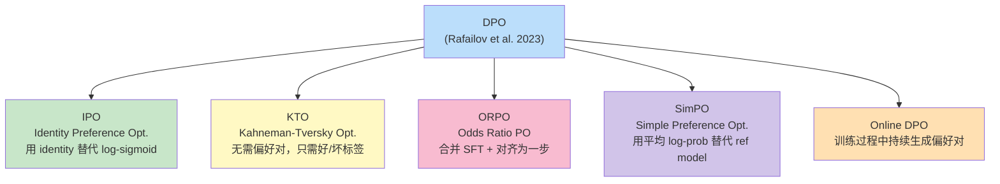

#### DPO 变体对比

| 变体 | 核心改进 | 是否需要偏好对 | 是否需要 Reference Model | 关键公式差异 |
|------|----------|---------------|------------------------|-------------|
| **DPO** | 原始方法 | 是 | 是 | $\log \sigma(\beta \log \frac{\pi}{\pi_{ref}}|_w - \beta \log \frac{\pi}{\pi_{ref}}|_l)$ |
| **IPO** | 避免过拟合 | 是 | 是 | 用 $\Phi(r)$ 替代 $\log \sigma(r)$ |
| **KTO** | 无需偏好对 | 否 (只需标签) | 是 | 基于前景理论的不对称损失 |
| **ORPO** | 合并 SFT + DPO | 是 | 否 | $\mathcal{L}_{SFT} + \lambda \mathcal{L}_{OR}$ |
| **SimPO** | 无需 Reference Model | 是 | 否 | 用 $\frac{1}{|y|}\sum \log \pi(y_i|x)$ 替代 |

### 3.5 DPO 代码示例

```python
# 使用 HuggingFace TRL 进行 DPO 训练
from trl import DPOConfig, DPOTrainer
from transformers import AutoModelForCausalLM, AutoTokenizer

# 加载模型
model = AutoModelForCausalLM.from_pretrained("sft-model")
ref_model = AutoModelForCausalLM.from_pretrained("sft-model")
tokenizer = AutoTokenizer.from_pretrained("sft-model")

# DPO 训练配置
training_args = DPOConfig(
    beta=0.1,                  # KL 温度参数 β
    learning_rate=5e-7,        # DPO 通常用较小的学习率
    per_device_train_batch_size=4,
    gradient_accumulation_steps=4,
    max_length=2048,
    max_prompt_length=1024,
    num_train_epochs=3,
    bf16=True,
    logging_steps=10,
    output_dir="./dpo-output",
)

# 偏好数据格式:
# {"prompt": "...", "chosen": "好的回答...", "rejected": "差的回答..."}
trainer = DPOTrainer(
    model=model,
    ref_model=ref_model,
    args=training_args,
    train_dataset=preference_dataset,
    processing_class=tokenizer,
)

trainer.train()
```

---

## 4. GRPO (Group Relative Policy Optimization)

### 4.1 GRPO 的诞生背景

GRPO 由 DeepSeek 团队在 **DeepSeekMath (2024)** 中首次提出，并在 **DeepSeek-R1** 中成为训练推理能力的核心算法。其动机直指 RLHF-PPO 的最大痛点：

> **"Critic Model 占据了一半的显存，但对最终输出质量没有直接贡献——能不能去掉它？"**

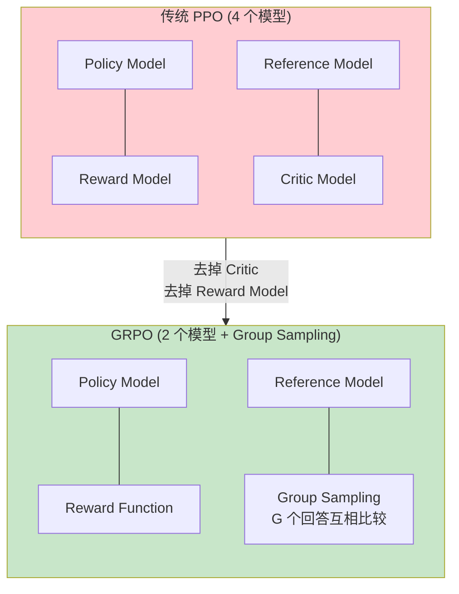

### 4.2 GRPO 核心创新：Group Relative Baseline

GRPO 的关键创新是用 **组内相对奖励** 替代 Critic Model 的价值估计。

**核心思想**: 对于同一个 prompt，生成 $G$ 个回答，然后用这 $G$ 个回答的平均奖励作为基线 (baseline)，而不是用一个单独的 Critic Model 来估计价值。

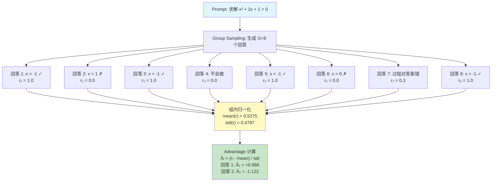

### 4.3 GRPO 数学公式

**Step 1: Group Sampling**

给定 prompt $x$，从当前策略 $\pi_\theta$ 采样 $G$ 个回答：

$$
\{y_1, y_2, \ldots, y_G\} \sim \pi_\theta(\cdot | x)
$$

**Step 2: 计算每个回答的奖励**

$$
r_i = R(x, y_i), \quad i = 1, 2, \ldots, G
$$

其中 $R$ 可以是：
- **规则奖励** (Rule-based): 数学答案正确=1，错误=0
- **模型奖励** (Model-based): 用 Reward Model 打分
- **混合奖励** (Hybrid): 规则 + 格式奖励

**Step 3: 组内归一化 (Group Normalization)**

$$
\hat{A}_i = \frac{r_i - \text{mean}(\{r_1, \ldots, r_G\})}{\text{std}(\{r_1, \ldots, r_G\})}
$$

> 这就是 "Group Relative" 的含义——每个回答的优势是相对于同组其他回答来衡量的。

**Step 4: GRPO 目标函数**

$$
\mathcal{J}_{GRPO}(\theta) = \mathbb{E}_{x, \{y_i\}} \left[ \frac{1}{G} \sum_{i=1}^{G} \frac{1}{|y_i|} \sum_{t=1}^{|y_i|} \left\{ \min\left[ \rho_{i,t} \hat{A}_i, \; \text{clip}(\rho_{i,t}, 1-\epsilon, 1+\epsilon) \hat{A}_i \right] - \beta \cdot D_{KL}(\pi_\theta \| \pi_{ref}) \right\} \right]
$$

其中:
- $\rho_{i,t} = \frac{\pi_\theta(y_{i,t} | x, y_{i,<t})}{\pi_{old}(y_{i,t} | x, y_{i,<t})}$ 是 token 级别的策略比率
- $\hat{A}_i$ 是组内归一化的优势（对同一回答的所有 token 共享）
- $\epsilon$ 是 PPO 裁剪参数
- $\beta$ 是 KL 惩罚系数

**GRPO 与 PPO 的关键区别**:

| 对比项 | PPO | GRPO |
|--------|-----|------|
| **Advantage 计算** | $\hat{A}_t = R_t + \gamma V(s_{t+1}) - V(s_t)$ (需 Critic) | $\hat{A}_i = \frac{r_i - \bar{r}}{\sigma_r}$ (Group Norm) |
| **是否需要 Critic** | 是 (同规模模型) | 否 |
| **粒度** | token 级别 | 回答级别 (同一回答内 token 共享 advantage) |
| **显存节省** | 基线 | 节省 50%+ |
| **奖励来源** | Reward Model | 规则/模型/混合 |

### 4.4 GRPO 为什么有效：直觉分析

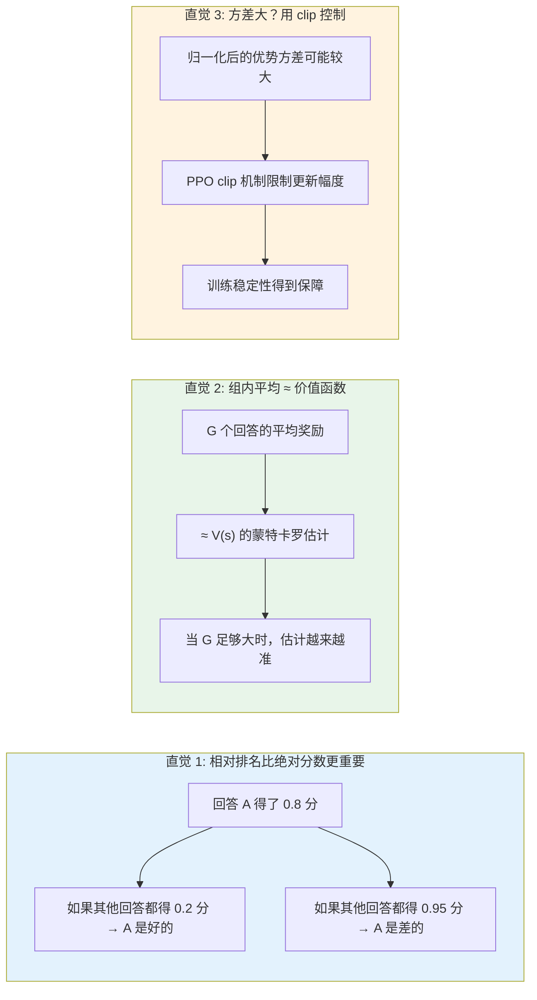

### 4.5 GRPO 实现伪代码

```python
import torch
import torch.nn.functional as F

def grpo_loss(
    policy_model,       # π_θ: 正在训练的策略模型
    reference_model,    # π_ref: Reference Model (frozen)
    reward_fn,          # R: 奖励函数 (可以是规则或模型)
    prompts,            # 一批 prompts: [x_1, ..., x_B]
    group_size=8,       # G: 每个 prompt 生成的回答数
    epsilon=0.2,        # PPO clip 范围
    beta=0.01,          # KL 惩罚系数
):
    """
    GRPO 损失函数伪代码
    """
    total_loss = 0.0

    for prompt in prompts:
        # Step 1: Group Sampling — 生成 G 个回答
        responses = []
        old_log_probs = []
        for _ in range(group_size):
            response, log_prob = policy_model.generate_with_log_prob(prompt)
            responses.append(response)
            old_log_probs.append(log_prob)

        # Step 2: 计算每个回答的奖励
        rewards = torch.tensor([reward_fn(prompt, r) for r in responses])

        # Step 3: 组内归一化 (Group Normalization)
        mean_r = rewards.mean()
        std_r = rewards.std()
        advantages = (rewards - mean_r) / (std_r + 1e-8)  # Â_i

        # Step 4: 计算 GRPO 损失
        for i, response in enumerate(responses):
            # 当前 policy 的 log prob
            new_log_probs = policy_model.get_log_probs(prompt, response)

            # 策略比率 ρ_t
            ratio = torch.exp(new_log_probs - old_log_probs[i])

            # PPO clip 目标
            surr1 = ratio * advantages[i]
            surr2 = torch.clamp(ratio, 1 - epsilon, 1 + epsilon) * advantages[i]
            policy_loss = -torch.min(surr1, surr2).mean()

            # KL 散度惩罚 (与 Reference Model)
            ref_log_probs = reference_model.get_log_probs(prompt, response)
            kl_div = (new_log_probs - ref_log_probs).mean()

            # 总损失 (token 级别平均)
            loss = policy_loss + beta * kl_div
            total_loss += loss / len(response)

    return total_loss / (len(prompts) * group_size)
```

### 4.6 GRPO 在 DeepSeek-R1 中的应用

GRPO 是 DeepSeek-R1 训练流程的核心算法（详见 [DeepSeek-R1 技术分析](05_大模型/09_Reasoning_Models/DeepSeek_R1_Technical_Analysis.md)）：

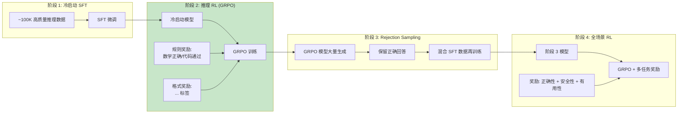

**GRPO 在 R1 中的奖励设计**:

| 奖励类型 | 计算方法 | 权重 | 用途 |
|----------|----------|------|------|
| **Accuracy Reward** | 数学答案精确匹配 / 代码测试通过 | 1.0 | 确保推理正确性 |
| **Format Reward** | 检查 `<think>...</think>` 标签存在 | 0.1 | 强制输出推理过程 |
| **Length Penalty** | 惩罚过长的推理链 | -0.05 | 防止冗余 |

### 4.7 GRPO 的工程优化

在实际部署中，GRPO 有以下关键工程优化点：

| 优化项 | 说明 | 效果 |
|--------|------|------|
| **Dynamic Group Size** | 根据 prompt 难度动态调整 G | 简单题 G=4，难题 G=16 |
| **Reward Clipping** | 将奖励裁剪到 [-1, 1] 范围 | 防止极端奖励主导训练 |
| **Asynchronous Generation** | 生成和训练异步进行 | 训练吞吐量提升 2-3x |
| **Mixed Precision** | BF16 推理 + FP32 损失计算 | 数值稳定性提升 |
| **Gradient Accumulation** | 跨 group 累积梯度 | 有效 batch size 增大 |
| **Filter Degenerate Groups** | 过滤全对或全错的 group | 减少无效梯度 |

> **实践提示**: 当一个 group 中所有回答都正确或都错误时，归一化后的 advantage 全为 0，不会产生有效的梯度信号。实践中应过滤这些"退化组"。

---

## 5. RLOO (REINFORCE Leave-One-Out)

### 5.1 核心思想

RLOO (REINFORCE Leave-One-Out) 是另一种无需 Critic Model 的在线 RL 方法，与 GRPO 思路相似但基线计算方式不同。

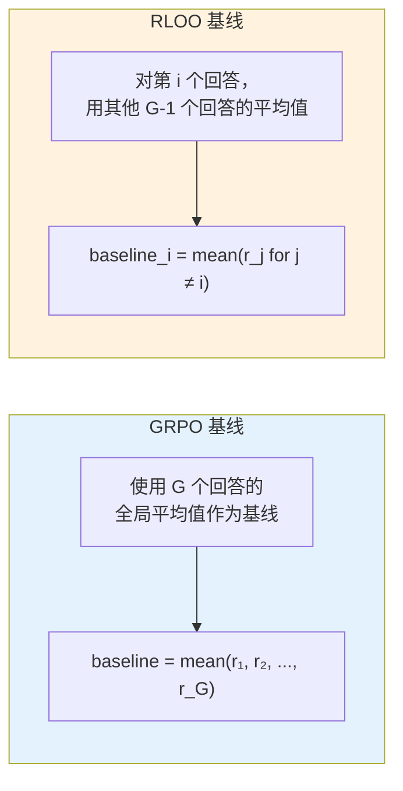

### 5.2 RLOO 数学公式

对于同一个 prompt $x$ 的 $G$ 个采样回答 $\{y_1, \ldots, y_G\}$：

**Leave-One-Out Baseline**:

$$
b_i = \frac{1}{G-1} \sum_{j \neq i} r_j
$$

**Advantage 估计**:

$$
\hat{A}_i = r_i - b_i = r_i - \frac{1}{G-1} \sum_{j \neq i} r_j
$$

**策略梯度更新 (REINFORCE 风格)**:

$$
\nabla_\theta \mathcal{J}(\theta) = \frac{1}{G} \sum_{i=1}^{G} \hat{A}_i \nabla_\theta \log \pi_\theta(y_i | x)
$$

### 5.3 GRPO vs RLOO 详细对比

| 对比维度 | GRPO | RLOO |
|----------|------|------|
| **基线计算** | 全局平均: $\bar{r} = \frac{1}{G}\sum r_i$ | Leave-one-out: $b_i = \frac{1}{G-1}\sum_{j\neq i} r_j$ |
| **Advantage** | 归一化: $\frac{r_i - \bar{r}}{\sigma}$ | 原始差值: $r_i - b_i$ |
| **更新规则** | PPO clip + KL penalty | REINFORCE + optional KL |
| **无偏性** | 有偏 (自身包含在基线中) | 无偏 (自身不在基线中) |
| **方差** | 略高 (归一化引入额外方差) | 略低 (leave-one-out 更准确) |
| **实现复杂度** | 中等 (需要 clip 机制) | 简单 (直接 REINFORCE) |
| **性能** | 在 R1 上表现优异 | 与 GRPO 相当 |
| **使用者** | DeepSeek-R1, DeepSeekMath | 研究场景, 小规模模型 |

### 5.4 RLOO 实现伪代码

```python
def rloo_loss(
    policy_model,
    reference_model,
    reward_fn,
    prompts,
    group_size=4,        # G: 通常比 GRPO 小
    beta=0.01,           # KL 惩罚系数
):
    """
    RLOO (REINFORCE Leave-One-Out) 损失函数
    """
    total_loss = 0.0

    for prompt in prompts:
        # Step 1: 生成 G 个回答
        responses, log_probs = [], []
        for _ in range(group_size):
            resp, lp = policy_model.generate_with_log_prob(prompt)
            responses.append(resp)
            log_probs.append(lp)

        # Step 2: 计算奖励
        rewards = torch.tensor([reward_fn(prompt, r) for r in responses])

        # Step 3: Leave-One-Out Baseline
        for i in range(group_size):
            # 用其他 G-1 个回答的平均值作为基线
            other_rewards = torch.cat([rewards[:i], rewards[i+1:]])
            baseline = other_rewards.mean()
            advantage = rewards[i] - baseline  # Â_i

            # REINFORCE 梯度
            policy_loss = -advantage * log_probs[i].sum()

            # KL 惩罚
            ref_lp = reference_model.get_log_probs(prompt, responses[i])
            kl = (log_probs[i] - ref_lp).sum()

            loss = policy_loss + beta * kl
            total_loss += loss

    return total_loss / (len(prompts) * group_size)
```

### 5.5 何时选择 RLOO

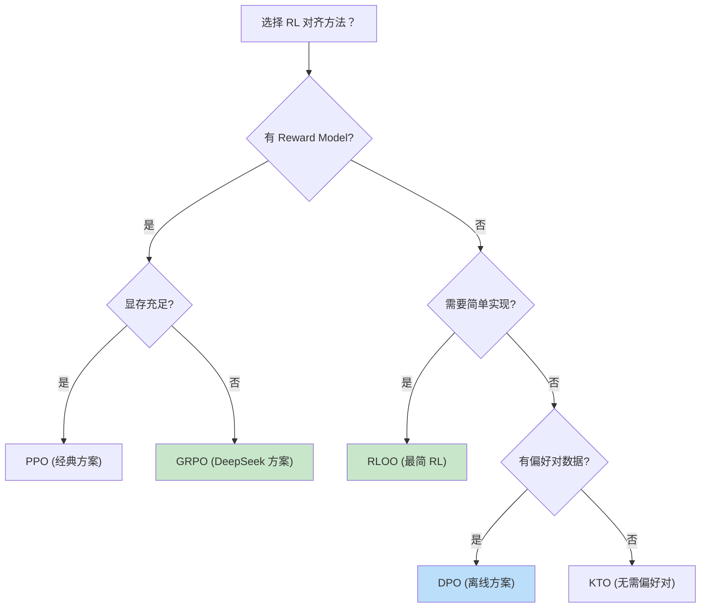

---

## 6. Rejection Sampling 拒绝采样

### 6.1 核心思想：生成-筛选范式

Rejection Sampling 是最简单的对齐方法之一——不需要复杂的 RL 训练循环，只需 **大量生成 + 质量筛选**。

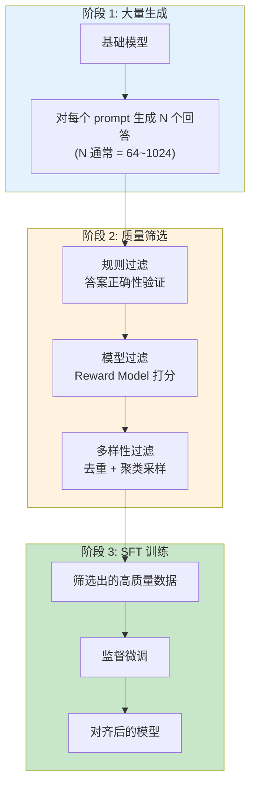

### 6.2 Best-of-N Sampling 策略

Best-of-N 是 Rejection Sampling 的核心策略：从 N 个候选中选择最好的一个（或 K 个）。

**选择策略**:

| 策略 | 方法 | 适用场景 |
|------|------|----------|
| **Best-of-N (max)** | 选择奖励最高的 1 个 | 数学/代码等有明确正确答案的任务 |
| **Best-K-of-N** | 选择奖励最高的 K 个 | 需要多样性的高质量数据 |
| **Weighted Sampling** | 按奖励加权采样 | 平衡质量和多样性 |
| **Threshold Sampling** | 选择奖励超过阈值的 | 保证最低质量 |
| **Nucleus Sampling** | 按奖励排序后 top-p 采样 | 生成推理测试时使用 |

**Best-of-N 的数学分析**:

假设每个回答正确的概率为 $p$，生成 $N$ 个回答后至少有一个正确的概率：

$$
P(\text{至少一个正确}) = 1 - (1-p)^N
$$

| 单次成功率 $p$ | $N=1$ | $N=8$ | $N=64$ | $N=256$ |
|----------------|-------|-------|--------|---------|
| 0.01 | 1% | 7.7% | 47.4% | 92.5% |
| 0.05 | 5% | 33.7% | 96.2% | ~100% |
| 0.10 | 10% | 57.0% | 99.9% | ~100% |
| 0.30 | 30% | 94.2% | ~100% | ~100% |

> **启示**: 即使模型单次成功率只有 5%，通过生成 64 个回答并筛选，也能达到 96% 的成功率。这就是 Rejection Sampling 的威力。

### 6.3 Rejection Sampling 在 DeepSeek-R1 中的应用

在 DeepSeek-R1 的训练流程中，Rejection Sampling 扮演了关键的第三阶段角色（详见 [DeepSeek 深度解析](05_大模型/15_Chinese_LLM_Ecosystem/DeepSeek_Deep_Dive.md)）：

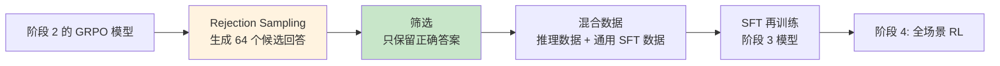

**R1 中 Rejection Sampling 的具体参数**:

| 参数 | 值 | 说明 |
|------|-----|------|
| **采样数 N** | 64 | 每个 prompt 生成 64 个回答 |
| **温度** | 0.7~1.0 | 较高的温度保证多样性 |
| **验证方式** | 规则验证器 | 数学答案精确匹配，代码测试用例 |
| **格式过滤** | 必须包含 `<think>` 标签 | 保留推理链 |
| **长度过滤** | 剔除 >8K token 的回答 | 防止过度冗长 |
| **数据量** | 数十万条 | 最终筛选出的高质量数据 |

### 6.4 Rejection Sampling + RL 的迭代改进

Rejection Sampling 和 RL 可以形成 **正反馈循环**：


每一轮迭代：
1. **RL 阶段**提升模型的推理能力（探索新策略）
2. **Rejection Sampling** 提取模型的最佳表现（利用已知策略）
3. **SFT 阶段**将最佳表现内化到模型参数中

### 6.5 Rejection Sampling 的局限性

| 局限 | 说明 | 缓解方法 |
|------|------|----------|
| **上限受制** | 不能超过模型的最佳表现 | 结合 RL 进行探索 |
| **计算成本高** | 需要大量生成 | 使用投机解码加速 |
| **多样性降低** | 筛选后数据分布可能偏窄 | 聚类去重 + 多样性采样 |
| **无法学到新策略** | 只是利用已知能力 | 与 RL 交替使用 |

---

## 7. Reasoning RL: o1/R1 风格推理强化学习

### 7.1 从"对齐"到"推理"：RL 目标的转变

传统的 RLHF/DPO 主要关注 **行为对齐** (alignment)——让模型"听话"。而 o1/R1 风格的 Reasoning RL 关注 **推理能力** (reasoning)——让模型"思考"。

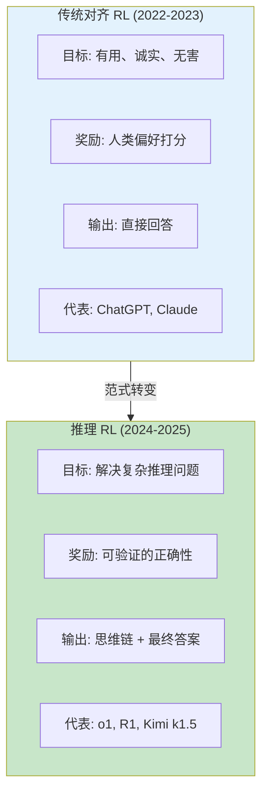

### 7.2 可验证奖励 (Verifiable Rewards)

Reasoning RL 的核心优势在于奖励可以是 **自动验证的**，不需要人类标注：

| 任务类型 | 验证方式 | 奖励信号 | 示例 |
|----------|----------|----------|------|
| **数学** | 答案精确匹配 | 0/1 二元奖励 | "x = -1" vs 正确答案 "x = -1" |
| **代码** | 测试用例通过 | 0/1 或通过率 | 通过 8/10 测试用例 → 0.8 |
| **逻辑推理** | 形式化验证 | 0/1 | 逻辑推理链结论正确 |
| **科学问题** | 标准答案匹配 | 0/1 | 物理公式计算结果正确 |
| **约束满足** | 约束检查 | 0/1 | 数独/填字游戏合法性 |

**可验证奖励 vs 人类偏好奖励**:

| 对比维度 | 人类偏好奖励 | 可验证奖励 |
|----------|-------------|-----------|
| **获取成本** | 高 (需标注员) | 低 (自动验证) |
| **一致性** | 低 (标注员间差异大) | 高 (确定性验证) |
| **可扩展性** | 差 (线性成本) | 好 (几乎零边际成本) |
| **适用范围** | 广 (任何对话) | 窄 (需要可验证答案的任务) |
| **Reward Hacking 风险** | 中 (模型学会讨好标注员) | 低 (难以欺骗验证器) |

### 7.3 DeepSeek-R1 四阶段训练流程

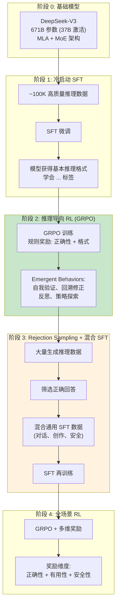

### 7.4 Emergent Behaviors：RL 训练中的"顿悟"

DeepSeek-R1 在 RL 训练过程中观察到了一系列 **涌现行为 (Emergent Behaviors)**，这些行为没有被显式教授，而是模型自发学会的：

| 涌现行为 | 描述 | 示例 |
|----------|------|------|
| **自我验证 (Self-Verification)** | 模型在得出答案后主动验证 | "让我验证一下... 代入 x=-1，等式成立 ✓" |
| **回溯修正 (Backtracking)** | 发现推理错误后回退重做 | "等等，这一步算错了，让我重新计算..." |
| **反思 (Reflection)** | 质疑自己的推理假设 | "我假设了 x>0，但题目没有这个条件..." |
| **策略选择 (Strategy Selection)** | 尝试多种解题策略 | "方法 1: 因式分解... 方法 2: 求根公式..." |
| **Aha Moment** | 从困惑到顿悟的转变 | "等等！我突然意识到可以换元..." |

> **类比理解**: 这些涌现行为就像一个学生在大量做题后，自然而然地学会了"做完检查"、"换种方法试试"等解题策略——老师没有教，但通过反复练习和反馈自己悟出来了。

### 7.5 Kimi k1.5: Long2Short 方法

Kimi k1.5 (Moonshot AI, 2025) 提出了另一种推理 RL 的路径：

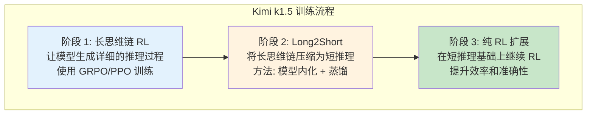

**Long2Short 的核心思想**:
1. 先让模型学会 **详细但冗长** 的推理（长思维链）
2. 然后通过 RL + 长度惩罚，让模型学会 **简洁但正确** 的推理
3. 最终模型能够在更短的推理步骤中达到相同的准确率

### 7.6 Reasoning RL 的主要挑战

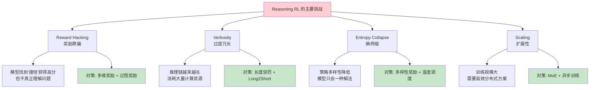

**Reward Hacking 示例**:

```
场景: 数学推理任务，奖励 = 答案正确性
Reward Hacking:
  - 模型学会列举所有可能的答案
  - 例: "x = 1, 2, 3, -1, 0, ..." (总有一个对)
  - 验证器只要匹配到正确答案就给分
  - 模型并没有真正解题

对策:
  - 要求推理过程完整且逻辑正确
  - 加入过程奖励 (PRM)
  - 惩罚冗余输出
```

---

## 8. Process Reward Models vs Outcome Reward Models

### 8.1 核心区别

奖励模型的设计对 RL 训练效果有决定性影响。两种主要范式：

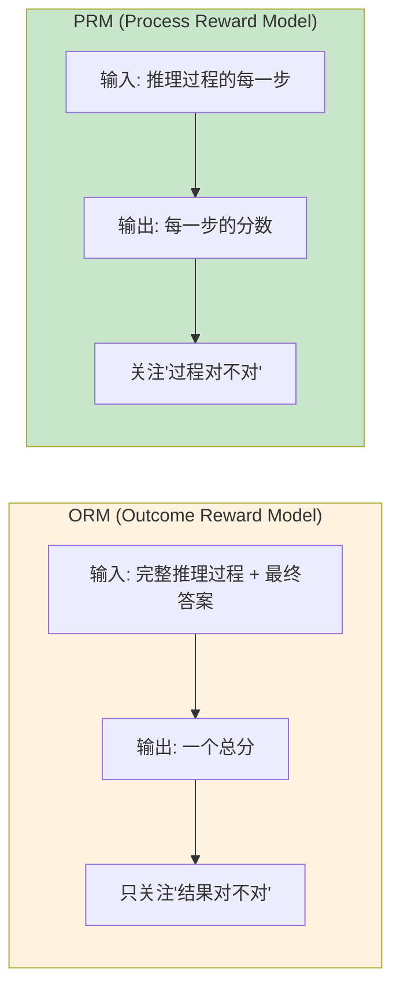

**具体示例**:

```
题目: 求解方程 x² - 5x + 6 = 0

推理过程:
  Step 1: 因式分解 → (x-2)(x-3) = 0     ← 正确
  Step 2: x-2 = 0 或 x-3 = 0             ← 正确
  Step 3: x = 2 或 x = 4                  ← 错误 (应该是 x=3)

ORM 评分:
  整体: 0 (最终答案错误)
  → 无法区分 Step 1-2 是正确的

PRM 评分:
  Step 1: +0.9 (因式分解正确)
  Step 2: +0.8 (逻辑正确)
  Step 3: -0.7 (计算错误，应为 x=3)
  → 精确定位到 Step 3 是问题所在
```

### 8.2 ORM vs PRM 详细对比

| 对比维度 | ORM (Outcome Reward Model) | PRM (Process Reward Model) |
|----------|--------------------------|--------------------------|
| **评估粒度** | 整个回答一个分数 | 每个推理步骤一个分数 |
| **标注成本** | 低 (只需判断最终答案) | 高 (需要逐步标注) |
| **信用分配** | 差 (无法区分哪步对/错) | 好 (精确定位问题步骤) |
| **搜索引导** | 只能在结束时评估 | 可在中间步骤剪枝 |
| **训练数据** | 最终答案正确/错误 | 每步正确/错误的标注 |
| **泛化能力** | 较强 | 对推理结构敏感 |
| **代表工作** | InstructGPT RM, DeepSeek RM | Math-Shepherd, OmegaPRM |

### 8.3 PRM 的训练方法

```mermaid
flowchart TB
    subgraph DataCollection["数据收集"]
        D1["人工标注<br/>专家逐步标注推理质量"]
        D2["自动标注<br/>验证器检查每步正确性"]
        D3["模型生成 + 筛选<br/>MCTS 搜索 + 人工审核"]
    end

    subgraph Training["PRM 训练"]
        T1["基于 LLM backbone<br/>在每步添加评分头"]
        T2["二分类: 每步正确/错误"]
        T3["回归: 每步的连续分数"]
    end

    subgraph Usage["PRM 使用方式"]
        U1["RL 奖励信号<br/>替代/补充 ORM"]
        U2["Best-of-N 选择<br/>选择过程最优的回答"]
        U3["MCTS 引导<br/>在搜索中逐步评估"]
    end

    D1 --> T1
    D2 --> T1
    D3 --> T1
    T2 --> U1
    T2 --> U2
    T3 --> U3

    style DataCollection fill:#e3f2fd
    style Training fill:#fff3e0
    style Usage fill:#c8e6c9
```

### 8.4 Math-Shepherd 和 OmegaPRM

**Math-Shepherd** (2023):
- 自动生成步骤级标注
- 对每个推理步骤，用多个补充完成 (completion) 来估计该步骤的质量
- 核心思想：如果从 Step $k$ 出发的多数完成能得到正确答案，说明 Step $k$ 是对的

$$
\text{Step Score}(s_k) = \frac{\text{从 } s_k \text{ 出发得到正确答案的比例}}{\text{总完成数}}
$$

**OmegaPRM** (2024):
- 大规模 PRM 训练框架
- 支持多种推理任务的步骤级奖励
- 在数学推理上显著优于 ORM

### 8.5 混合奖励：PRM + ORM

实践中最有效的方法是 **混合奖励**，结合 PRM 和 ORM 的优势：

$$
R_{hybrid}(x, y) = \alpha \cdot R_{ORM}(x, y) + (1-\alpha) \cdot \sum_{k=1}^{K} R_{PRM}(x, y, s_k)
$$

其中：
- $R_{ORM}$ 评估最终答案的正确性
- $R_{PRM}$ 评估每个推理步骤的质量
- $\alpha$ 控制两者的权重（通常 0.3~0.5）

**混合奖励在 GRPO 中的应用**:

```python
def hybrid_reward(prompt, response, alpha=0.4):
    """
    混合奖励函数: PRM + ORM
    """
    # ORM: 最终答案正确性
    final_answer = extract_answer(response)
    orm_score = verify_answer(prompt, final_answer)  # 0 or 1

    # PRM: 推理步骤质量
    steps = extract_reasoning_steps(response)
    prm_scores = prm_model.score(prompt, steps)  # 每步的分数
    prm_score = prm_scores.mean()

    # 混合奖励
    return alpha * orm_score + (1 - alpha) * prm_score
```

> **延伸阅读**: 更多关于 PRM 和 ORM 的详细技术分析，参见 [Process Reward Models 深度解析](05_大模型/09_Reasoning_Models/Process_Reward_Models.md)。

---

## 9. 对齐方法全景对比表

### 9.1 核心对比

| 方法 | 需要 Reward Model | 需要 Reference Model | 需要 Critic Model | 内存开销 | 稳定性 | 代表使用者 |
|------|:----------------:|:-------------------:|:----------------:|---------|--------|-----------|
| **RLHF (PPO)** | 是 | 是 | 是 | 4x 模型 | ⭐⭐ (差) | InstructGPT, ChatGPT |
| **DPO** | 否 | 是 | 否 | 2x 模型 | ⭐⭐⭐⭐ (好) | Zephyr, Tulu |
| **IPO** | 否 | 是 | 否 | 2x 模型 | ⭐⭐⭐⭐ (好) | 研究场景 |
| **KTO** | 否 | 是 | 否 | 2x 模型 | ⭐⭐⭐⭐ (好) | 无需偏好对数据 |
| **ORPO** | 否 | 否 | 否 | 1x 模型 | ⭐⭐⭐ (中) | 一步对齐 |
| **SimPO** | 否 | 否 | 否 | 1x 模型 | ⭐⭐⭐ (中) | 轻量对齐 |
| **GRPO** | 否 (规则/函数) | 是 | 否 | 2x 模型 | ⭐⭐⭐⭐ (好) | DeepSeek-R1, DeepSeekMath |
| **RLOO** | 否 (规则/函数) | 是 | 否 | 2x 模型 | ⭐⭐⭐⭐ (好) | 研究场景 |
| **Rejection Sampling** | 否 (规则/函数) | 否 | 否 | 1x 模型 | ⭐⭐⭐⭐⭐ (很好) | DeepSeek-R1 Stage 3 |

### 9.2 方法特性雷达图 (概念性描述)

```mermaid
quadrantChart
    title 对齐方法定位图
    x-axis "离线 (Offline)" --> "在线 (Online)"
    y-axis "简单 (Simple)" --> "复杂 (Complex)"
    quadrant-1 "在线 + 复杂: RLHF (PPO)"
    quadrant-2 "离线 + 复杂: Constitutional AI"
    quadrant-3 "离线 + 简单: DPO, KTO"
    quadrant-4 "在线 + 简单: GRPO, RLOO"
    "RLHF (PPO)": [0.85, 0.90]
    "DPO": [0.15, 0.25]
    "KTO": [0.20, 0.20]
    "GRPO": [0.75, 0.45]
    "RLOO": [0.70, 0.35]
    "Rejection Sampling": [0.60, 0.10]
    "ORPO": [0.25, 0.15]
```

### 9.3 不同场景下的方法选择指南

| 场景 | 推荐方法 | 理由 |
|------|----------|------|
| **通用对话助手** | DPO 或 RLHF | 需要人类偏好数据，DPO 更简单 |
| **数学/代码推理** | GRPO + 规则奖励 | 可验证奖励 + 在线探索 |
| **资源受限 (单卡/少卡)** | DPO 或 SimPO | 显存开销最小 |
| **没有偏好数据** | KTO 或 GRPO | KTO 只需标签，GRPO 用规则奖励 |
| **快速原型** | Rejection Sampling | 最简单的实现 |
| **生产级推理模型** | GRPO (R1 流程) | 经过 DeepSeek-R1 验证的完整流程 |
| **一步到位** | ORPO | 合并 SFT + 对齐为一步 |

### 9.4 性能对比 (公开 Benchmark)

以下为各对齐方法在常见 benchmark 上的典型表现（基于公开论文数据，具体数值因基座模型不同而有差异）：

| 方法 | MMLU (5-shot) | GSM8K (CoT) | HumanEval | MT-Bench |
|------|:-------------:|:-----------:|:---------:|:--------:|
| SFT (基线) | 62.5 | 45.2 | 35.0 | 6.5 |
| RLHF (PPO) | 64.1 | 52.8 | 40.2 | 7.9 |
| DPO | 63.8 | 51.5 | 39.8 | 7.6 |
| KTO | 63.2 | 50.1 | 38.5 | 7.4 |
| GRPO | 64.5 | 58.3 | 42.1 | 7.8 |
| RLOO | 64.0 | 56.7 | 41.5 | 7.5 |
| Rejection Sampling + SFT | 63.5 | 55.0 | 40.0 | 7.2 |
| GRPO + Reasoning RL (R1) | 70.2 | 97.3 | 65.4 | 8.9 |

> **注**: R1 风格的 Reasoning RL 在数学/代码任务上有巨大提升，因为推理链 (CoT) 显著提高了复杂问题的解决能力。

---

## 10. 实战代码与工具链

### 10.1 使用 TRL 实现 GRPO

```python
# 使用 HuggingFace TRL 进行 GRPO 训练
from trl import GRPOConfig, GRPOTrainer
from transformers import AutoModelForCausalLM, AutoTokenizer

# 加载模型
model = AutoModelForCausalLM.from_pretrained("sft-model", torch_dtype="auto")
ref_model = AutoModelForCausalLM.from_pretrained("sft-model", torch_dtype="auto")
tokenizer = AutoTokenizer.from_pretrained("sft-model")

# 定义奖励函数 (可验证奖励)
def reward_fn(prompts, completions, **kwargs):
    """
    规则奖励函数:
    - 数学答案正确性: 0 or 1
    - 格式奖励: 包含 <think> 标签 +0.1
    """
    rewards = []
    for prompt, completion in zip(prompts, completions):
        reward = 0.0

        # 1. 正确性奖励
        answer = extract_answer(completion)
        if verify_math_answer(prompt, answer):
            reward += 1.0

        # 2. 格式奖励
        if "<think>" in completion and "</think>" in completion:
            reward += 0.1

        rewards.append(reward)
    return rewards

# GRPO 训练配置
config = GRPOConfig(
    output_dir="./grpo-output",
    num_train_epochs=3,
    per_device_train_batch_size=4,
    gradient_accumulation_steps=8,
    learning_rate=1e-6,
    bf16=True,
    logging_steps=10,
    # GRPO 特有参数
    num_generations=8,          # G: group size
    max_new_tokens=2048,        # 每个回答的最大长度
    beta=0.04,                  # KL 惩罚系数
)

# 启动训练
trainer = GRPOTrainer(
    model=model,
    ref_model=ref_model,
    reward_funcs=[reward_fn],
    args=config,
    train_dataset=train_dataset,
    processing_class=tokenizer,
)

trainer.train()
```

### 10.2 使用 OpenRLHF 实现 GRPO (分布式)

```python
# OpenRLHF 分布式 GRPO 训练 (多节点)
# 启动命令:
# torchrun --nproc_per_node=8 --nnodes=4 \
#   -m openrlhf.cli.train_grpo \
#   --pretrain sft-model \
#   --reward-func rule_reward \
#   --num-generations 8 \
#   --kl-coeff 0.04 \
#   --micro-train-batch-size 2 \
#   --micro-rollout-batch-size 4 \
#   --gradient-checkpointing \
#   --bf16 \
#   --max-epochs 3 \
#   --max-new-tokens 2048 \
#   --prompt-max-len 1024 \
#   --zero-stage 3 \
#   --flash-attn

# 关键配置说明:
# --num-generations 8    : 每个 prompt 生成 8 个回答 (Group Size G=8)
# --kl-coeff 0.04        : KL 散度惩罚系数 β
# --zero-stage 3         : DeepSpeed ZeRO-3 参数分片
# --gradient-checkpointing: 激活检查点节省显存
```

### 10.3 使用 veRL 实现 GRPO

```python
# veRL (VolcEngine RL) 框架 GRPO 配置
# config/grpo_config.yaml

# model:
#   pretrain: "deepseek-ai/deepseek-math-7b"
#   ref_pretrain: "deepseek-ai/deepseek-math-7b"
#
# algorithm:
#   type: "grpo"
#   num_generations: 16           # G = 16
#   kl_coeff: 0.02
#   clip_range: 0.2
#
# reward:
#   type: "hybrid"
#   components:
#     - name: "accuracy"
#       weight: 1.0
#       type: "rule"              # 规则奖励
#     - name: "format"
#       weight: 0.1
#       type: "rule"
#     - name: "prm"
#       weight: 0.3
#       type: "model"             # PRM 奖励
#       model_path: "prm-checkpoint"
#
# training:
#   total_epochs: 5
#   train_batch_size: 64
#   rollout_batch_size: 128
#   max_new_tokens: 4096
#   bf16: true
#   gradient_checkpointing: true
```

### 10.4 Rejection Sampling 实现

```python
import torch
from transformers import AutoModelForCausalLM, AutoTokenizer

def rejection_sampling(
    model: AutoModelForCausalLM,
    tokenizer: AutoTokenizer,
    prompts: list[str],
    num_samples: int = 64,          # N: 每个 prompt 生成 N 个回答
    temperature: float = 0.8,
    max_new_tokens: int = 2048,
    reward_fn = None,               # 奖励函数 (规则或模型)
    top_k: int = 4,                 # 每个 prompt 保留 top-k 个回答
):
    """
    Rejection Sampling: 大量生成 + 质量筛选
    """
    model.eval()
    selected_data = []

    for prompt in prompts:
        # Step 1: 生成 N 个回答
        inputs = tokenizer(prompt, return_tensors="pt").to(model.device)
        candidates = []

        with torch.no_grad():
            outputs = model.generate(
                **inputs,
                num_return_sequences=num_samples,
                max_new_tokens=max_new_tokens,
                temperature=temperature,
                do_sample=True,
                top_p=0.95,
            )

        for output in outputs:
            response = tokenizer.decode(output[inputs["input_ids"].shape[1]:])
            candidates.append(response)

        # Step 2: 计算奖励并排序
        rewards = [reward_fn(prompt, c) for c in candidates]
        sorted_indices = sorted(range(len(rewards)),
                                key=lambda i: rewards[i],
                                reverse=True)

        # Step 3: 选择 top-k
        for idx in sorted_indices[:top_k]:
            if rewards[idx] > 0:  # 只保留正奖励的回答
                selected_data.append({
                    "prompt": prompt,
                    "response": candidates[idx],
                    "reward": rewards[idx],
                })

    return selected_data


def rejection_sampling_sft_loop(
    model, tokenizer, train_prompts, num_iterations=3, **kwargs
):
    """
    迭代式 Rejection Sampling + SFT
    """
    for iteration in range(num_iterations):
        # Step 1: 用当前模型生成并筛选
        selected = rejection_sampling(model, tokenizer, train_prompts, **kwargs)

        # Step 2: 用筛选出的数据做 SFT
        sft_dataset = format_as_sft(selected)
        model = train_sft(model, sft_dataset, epochs=2)

        print(f"Iteration {iteration+1}: "
              f"Selected {len(selected)} samples, SFT done.")

    return model
```

---

## 11. 前沿挑战与未来方向

### 11.1 当前开放问题

```mermaid
flowchart TB
    subgraph Challenges["前沿挑战"]
        C1["Reward Hacking 2.0<br/>模型在更复杂任务中找到更隐蔽的捷径"]
        C2["Entropy Collapse<br/>RL 训练后期策略多样性急剧降低"]
        C3["Long-horizon Reasoning<br/>超长推理链 (>100 步) 的信用分配"]
        C4["Generalization<br/>RL 训练的推理能力迁移到非数学/代码领域"]
        C5["Scalability<br/>大规模 RL 训练的通信和计算效率"]
    end

    subgraph Solutions["研究方向"]
        S1["过程奖励 + 多维奖励"]
        S2["熵正则化 + 多样性约束"]
        S3["分层 RL + PRM"]
        S4["跨领域推理数据 + 元学习"]
        S5["异步训练 + 模型并行"]
    end

    C1 --> S1
    C2 --> S2
    C3 --> S3
    C4 --> S4
    C5 --> S5

    style Challenges fill:#ffcdd2
    style Solutions fill:#c8e6c9
```

### 11.2 未来趋势预测

| 趋势 | 方向 | 预期时间线 |
|------|------|-----------|
| **RL 替代 SFT** | 从冷启动 SFT 到纯 RL 训练 (Kimi k1.5 已验证可行性) | 2025-2026 |
| **自适应奖励** | 奖励模型根据训练阶段动态调整 | 2025-2026 |
| **Self-Play RL** | 模型通过与自身对弈提升推理能力 | 2026+ |
| **统一对齐框架** | 将对齐 + 推理 + 安全整合为单一 RL 目标 | 2026+ |
| **RL for Agents** | 将 GRPO/RLOO 应用于 Agent 行为训练 | 2025-2026 |
| **Constitutional RL** | 结合 Constitutional AI 原则的 RL 训练 | 2025-2026 |

### 11.3 从对齐到推理：范式转移的总结

```mermaid
flowchart TB
    subgraph Era1["时代 1: 对齐 (2022-2023)"]
        E1A["核心问题: 如何让模型听话"]
        E1B["核心方法: RLHF, DPO"]
        E1C["核心指标: 人类偏好胜率"]
    end

    subgraph Era2["时代 2: 推理 (2024-2025)"]
        E2A["核心问题: 如何让模型思考"]
        E2B["核心方法: GRPO, Reasoning RL"]
        E2C["核心指标: 推理正确率"]
    end

    subgraph Era3["时代 3: 自主 (2026+)"]
        E3A["核心问题: 如何让模型自我进化"]
        E3B["核心方法: Self-Play + 自动验证"]
        E3C["核心指标: 自主解决率"]
    end

    Era1 --> Era2 --> Era3

    style Era1 fill:#e3f2fd
    style Era2 fill:#c8e6c9
    style Era3 fill:#fff3e0
```

---

## 12. 与其他章节的关联

### 前置知识
- [RLHF 与 DPO 深度解读](20_论文精读/06_Alignment/RLHF_DPO_Deep_Dive.md) — InstructGPT、DPO 原始论文的详细解读
- [深度学习基础](../../03_深度学习/README.md) — 反向传播、优化器、损失函数
- [强化学习基础](../06_强化学习/) — PPO、REINFORCE、Actor-Critic 等 RL 算法

### 进阶内容
- [DeepSeek-R1 技术深度解析](05_大模型/09_Reasoning_Models/DeepSeek_R1_Technical_Analysis.md) — GRPO 在 R1 四阶段训练中的详细应用
- [Process Reward Models 深度解析](05_大模型/09_Reasoning_Models/Process_Reward_Models.md) — PRM/ORM 的架构、训练方法和信用分配
- [DeepSeek 深度解析](05_大模型/15_Chinese_LLM_Ecosystem/DeepSeek_Deep_Dive.md) — DeepSeek 全系列产品和技术分析
- [o1 类推理模型](05_大模型/09_Reasoning_Models/o1_Class_Reasoning_Models.md) — OpenAI o1 系列推理模型分析

### 相关训练技术
- [微调策略完全指南](05_大模型/07_Fine_tuning_Techniques/Fine_tuning_Strategies.md) — SFT、LoRA、QLoRA 等微调方法
- [分布式训练](07_模型训练/04_Distributed_Training/Distributed_Training_2026.md) — ZeRO、FSDP、张量并行等分布式策略
- [混合精度训练](07_模型训练/03_Optimization/Mixed_Precision_Training.md) — BF16/FP16 训练优化

---

## 参考文献

1. Ouyang et al. "Training language models to follow instructions with human feedback" (InstructGPT). NeurIPS 2022.
2. Rafailov et al. "Direct Preference Optimization: Your Language Model is Secretly a Reward Model." NeurIPS 2023.
3. Shao et al. "DeepSeekMath: Pushing the Limits of Mathematical Reasoning in Open Language Models." 2024.
4. DeepSeek-AI. "DeepSeek-R1: Incentivizing Reasoning Capability in LLMs via Reinforcement Learning." 2025.
5. Ahmadian et al. "Back to Basics: Revisiting REINFORCE Style Optimization for Learning from Human Feedback." 2024.
6. Ethayarajh et al. "KTO: Model Alignment as Prospect Theoretic Optimization." ICML 2024.
7. Hong et al. "ORPO: Monolithic Preference Optimization without Reference Model." 2024.
8. Kim et al. "Kimi k1.5: Scaling Reinforcement Learning with LLMs." 2025.
9. Lightman et al. "Let's Verify Step by Step." ICML 2024. (Math-Shepherd/PRM)
10. Wang et al. "Math-Shepherd: Verify and Reinforce LLMs Step-by-step without Human Annotations." 2024.

---

*Last updated: 2026-06-04*

## 相关链接

- [[07_模型训练/06_Alignment/index|对齐索引]] — 对齐主题导览
- [[07_模型训练/06_Alignment/RLHF_at_Scale_2026|大规模 RLHF 2026]] — GRPO 的对比方法
- [[06_强化学习/03_RLHF_Alignment/GRPO_Training_Deep_Dive|GRPO 训练深度解析]] — GRPO 训练实践
- [[概念/Training/grpo|GRPO]] — GRPO 概念卡片
- [[概念/Training/dpo|DPO]] — 同类对齐方法
- [[概念/LLM/rlvr|RLVR]] — GRPO 在推理模型中的应用
- [[05_大模型/09_Reasoning_Models/Reasoning_RL_Training_Pipeline|推理模型 RL 训练流水线]] — GRPO 训练推理模型
