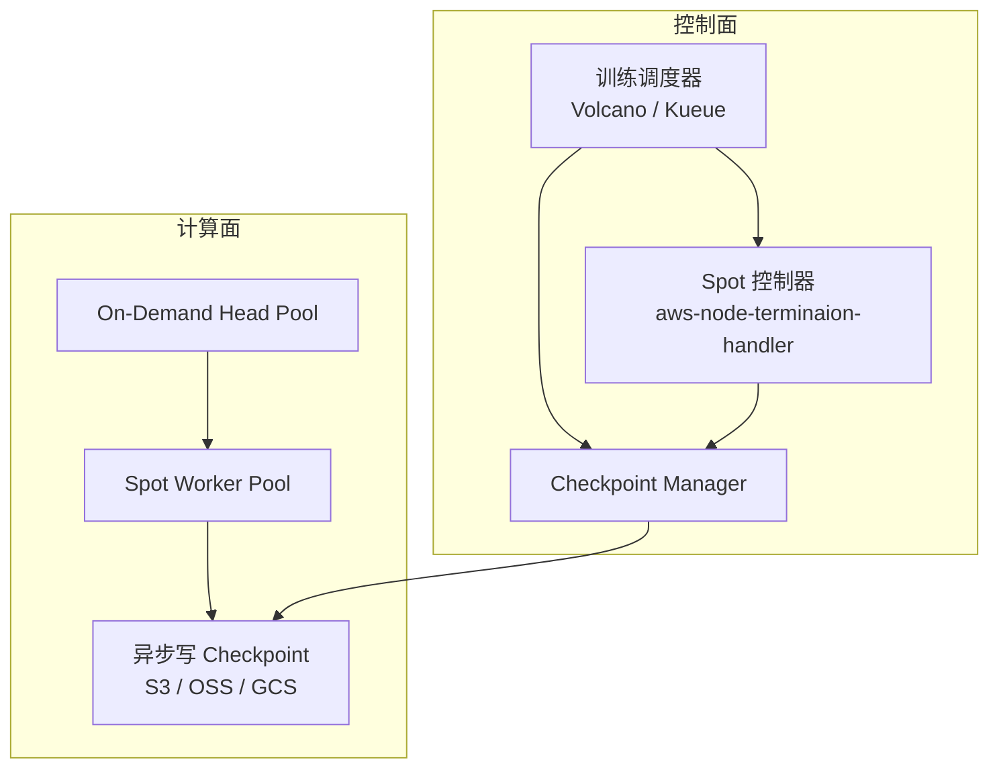
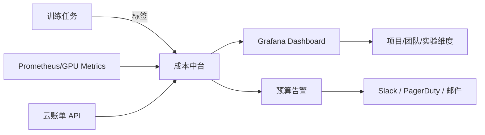

# 大模型训练成本优化与 FinOps 实践 2026

> **一句话理解**: 大模型训练成本优化不是单纯省钱，而是在性能、稳定性与预算之间建立可度量的 FinOps 闭环，让每一美元的 GPU 算力都产生可解释的业务价值。

---

## 目录

1. [FinOps 在大模型训练中的定位](#1-finops-在大模型训练中的定位)
2. [GPU 利用率分析与瓶颈定位](#2-gpu-利用率分析与瓶颈定位)
3. [Spot 与抢占式实例训练策略](#3-spot-与抢占式实例训练策略)
4. [Checkpoint 与恢复策略](#4-checkpoint-与恢复策略)
5. [混合精度、ZeRO 与 Offloading 的成本收益](#5-混合精度zero-与-offloading-的成本收益)
6. [训练任务成本归因与预算告警](#6-训练任务成本归因与预算告警)
7. [云厂商训练服务成本对比](#7-云厂商训练服务成本对比)
8. [生产落地 Checklist](#8-生产落地-checklist)
9. [Related](#related)

---

## 1. FinOps 在大模型训练中的定位

### 1.1 为什么训练成本需要 FinOps

大模型训练成本正在快速逼近企业 AI 预算的核心。以 2024-2025 年公开数据为参考，一次 70B 参数的预训练在 8,192 张 H100 上运行约 2-4 周，仅 GPU 租赁费用即可达到数百万美元。若算上网络、存储、人力与试错迭代，训练成本往往是推理成本的 10-100 倍。

传统云成本管理（FinOps）关注资源分配与账单分摊，但大模型训练场景有其独特性：

- **任务粒度长**: 单次训练可持续数天到数周，资源浪费一旦未被及时发现，损失巨大。
- **分布式复杂**: 数据并行、张量并行、流水线并行混合，单一节点低效会拖累整体吞吐。
- **抢占风险高**: Spot/抢占式实例可降价 60%-90%，但中断会导致进度回滚。
- **隐性成本多**: Checkpoint 写入、数据加载、跨 AZ 流量、对象存储请求费常被忽视。

因此，训练 FinOps 的目标不是压降单卡价格，而是 **提升单位成本下的有效训练 token 数（tokens trained per dollar）**。

### 1.2 FinOps 闭环


---

## 2. GPU 利用率分析与瓶颈定位

### 2.1 关键指标

生产环境中应持续追踪以下指标：

| 指标 | 含义 | 健康阈值 | 优化方向 |
|------|------|----------|----------|
| **GPU Utilization** | CUDA 核心时间占比 | > 85% | 提升 batch size、减少 CPU 阻塞 |
| **GPU Memory Utilization** | 显存占用率 | 70%-90% | 避免 OOM，同时减少显存浪费 |
| **Tensor Core Utilization** | Tensor Core 活跃时间 | > 50% | 使用 TF32/BF16/FP16、增大矩阵乘尺寸 |
| **PCIe/NVLink BW Util** | 卡间通信带宽利用率 | < 70% | 优化通信集合、减少 all-reduce 数据量 |
| **CPU-GPU Data Pipeline** | 数据加载等待时间 | < 10% step time | 增加 DataLoader workers、启用 pin_memory |
| **MFU (Model FLOPs Utilization)** | 实际 FLOPs / 理论峰值 FLOPs | 30%-55% | 优化并行策略、减少通信与空闲 |

### 2.2 常见瓶颈与诊断

**CPU 瓶颈（数据饥饿）**

症状：GPU Utilization 波动大，周期性降至 0。

诊断命令：

```bash
# 查看 GPU 是否等待数据
nvidia-smi dmon -s pucm
# 查看 CPU 与 DataLoader 状态
mpstat -P ALL 1
python -c "import torch; print(torch.utils.data.get_worker_info())"
```

优化措施：

- 提高 `num_workers`，启用 `pin_memory=True`。
- 使用 NVIDIA DALI 或 WebDataset 做 GPU 解码。
- 将数据预处理转为 JIT/TFRecord/Parquet 格式。

**通信瓶颈（分布式扩展性差）**

症状：扩展到更多 GPU 时，单步耗时反而增加，all-reduce 占比高。

诊断工具：

- PyTorch Profiler + NVIDIA Nsight Systems
- [[概念/deepspeed|DeepSpeed]] Wall Clock Breakdown
- Megatron-LM `log_throughput`

优化措施：

- 使用 Gradient Bucket 调大 bucket_size_mb。
- 启用 overlapping：computation/communication overlap。
- 减少 ZeRO 分片粒度，或切换到 Tensor Parallel + Pipeline Parallel 混合。

**显存瓶颈**

症状：batch size 无法放大，频繁触发 activation checkpointing。

优化措施：

- 启用 FlashAttention / FlashAttention-2 / FlashAttention-3。
- 使用 gradient checkpointing 与 activation 重计算。
- 评估 ZeRO-Offload / FSDP Offload 的性价比。

---

## 3. Spot 与抢占式实例训练策略

### 3.1 成本收益

Spot（AWS）、Preemptible（GCP）、Spot/抢占式实例（阿里云）的价格通常为按需实例的 10%-40%。在大模型长周期训练中，合理使用 Spot 可降低成本 50%-70%。

### 3.2 风险与缓解

| 风险 | 影响 | 缓解策略 |
|------|------|----------|
| 实例被回收 | 训练中断、进度丢失 | 高频异步 Checkpoint 到对象存储 |
| 可用区库存波动 | 无法快速恢复相同规模 | 多 AZ 备份池、弹性伸缩组 |
| 节点间网络抖动 | NCCL 超时、训练 hang | 启用 NCCL 重试、RDMA 健康检查 |
| Spot 与按需混部 | 调度复杂 | 使用 Volcano/Kueue + 优先级队列 |

### 3.3 生产架构示例



推荐配置：

- Checkpoint 频率：每 15-30 分钟一次，保留最近 3 个版本。
- 使用高可用对象存储（S3 + Cross-Region Replication 或 OSS 同城冗余）。
- 对超算集群，采用 checkpoint + resume 自动流水线，中断后 5 分钟内恢复。

---

## 4. Checkpoint 与恢复策略

### 4.1 Checkpoint 成本

Checkpoint 是 Spot 训练的必需品，但本身也消耗成本：

- **存储成本**: 一个 70B 模型的 FP16 参数约为 140 GB，加上优化器状态、梯度、随机状态，单次 Checkpoint 可达 500 GB-1 TB。
- **写入时间**: 同步 Checkpoint 会导致训练暂停数分钟；异步 Checkpoint 需要额外 CPU/内存缓冲。
- **网络成本**: 跨 AZ/Region 写入对象存储会产生流量费用。

### 4.2 Checkpoint 策略

**同步 Checkpoint**

- 优点：一致性最强，恢复简单。
- 缺点：训练暂停时间长。
- 适用：小规模微调、关键里程碑。

**异步 Checkpoint**

- 优点：对训练吞吐影响小。
- 缺点：需要额外内存/磁盘缓冲，存在最近几步丢失风险。
- 适用：大规模预训练、Spot 环境。

**增量 Checkpoint**

只保存变化的参数或 LoRA adapter，可将存储量减少 90% 以上。适用于全参数训练中的阶段性微调与持续预训练。

### 4.3 恢复流程

```python
# PyTorch 伪代码：基于最新 Checkpoint 自动恢复
checkpoint_dir = find_latest_checkpoint(storage_path)
if checkpoint_dir:
    model.load_state_dict(torch.load(f"{checkpoint_dir}/model.pt"))
    optimizer.load_state_dict(torch.load(f"{checkpoint_dir}/optimizer.pt"))
    scheduler.load_state_dict(torch.load(f"{checkpoint_dir}/scheduler.pt"))
    rng_state = torch.load(f"{checkpoint_dir}/rng.pt")
    torch.set_rng_state(rng_state)
    start_step = checkpoint_dir.step
else:
    start_step = 0
```

---

## 5. 混合精度、ZeRO 与 Offloading 的成本收益

### 5.1 混合精度训练

| 精度 | 显存节省 | 吞吐影响 | 数值稳定性 | 适用场景 |
|------|----------|----------|------------|----------|
| FP32 | 基准 | 基准 | 最高 | 小模型调试 |
| FP16 | ~50% | +1.5-2x | 需梯度缩放 | Ampere 之前 |
| BF16 | ~50% | +1.5-2x | 优于 FP16 | Ampere/Ada/Hopper |
| FP8 (H100+) | ~75% | +2-3x | 需动态缩放 | Hopper 推理/训练 |
| INT8/INT4 训练 | 实验性 | 不确定 | 低 | 仅研究探索 |

生产建议：

- 在 A100/H100 上优先使用 BF16 + Transformer Engine。
- 使用 `torch.cuda.amp` 或 `TE.fp8_autocast` 自动管理精度。
- 监控 loss scale 与梯度范数，避免 underflow/overflow。

### 5.2 ZeRO 与 Offloading

| 技术 | 显存节省 | 速度影响 | 硬件要求 | 成本收益 |
|------|----------|----------|----------|----------|
| ZeRO-1 | 优化器状态分片 | ~4x | 轻微 | 多卡 | 减少所需 GPU 数 |
| ZeRO-2 | + 梯度分片 | ~8x | 中等 | 多卡 | 进一步减少 GPU |
| ZeRO-3 | + 参数分片 | 与卡数成正比 | 通信增加 | 多卡/NVLink | 用更多便宜卡替代少张贵卡 |
| ZeRO-Offload | 状态卸载到 CPU/NVMe | 10x+ | 明显受 CPU/IO 限制 | 大内存 + NVMe | 单卡/少卡训练大模型 |
| FSDP | PyTorch 原生 ZeRO-3 | 类似 ZeRO-3 | 类似 ZeRO-3 | 多卡 | 与生态集成好 |

**成本收益分析**：

- ZeRO-1/2 通常不会降低训练速度，但可让同样显存的 GPU 训练更大模型，避免购买更高显存型号。
- ZeRO-Offload 可让单张消费级 GPU 微调 7B/13B 模型，但会显著增加 step time，需计算 "有效训练 token 成本" 后决策。
- 在云端，使用更多低显存 Spot 实例 + ZeRO-3 往往比使用少量高显存按需实例更经济。

### 5.3 配置示例：DeepSpeed ZeRO-2 + BF16

```json
{
  "train_batch_size": 512,
  "train_micro_batch_size_per_gpu": 4,
  "gradient_accumulation_steps": 16,
  "optimizer": {
    "type": "AdamW",
    "params": {
      "lr": 1e-4,
      "betas": [0.9, 0.95],
      "eps": 1e-8,
      "weight_decay": 0.1
    }
  },
  "scheduler": {
    "type": "WarmupDecayLR",
    "params": {
      "warmup_min_lr": 0,
      "warmup_max_lr": 1e-4,
      "warmup_num_steps": 500,
      "total_num_steps": 10000
    }
  },
  "bf16": {
    "enabled": true
  },
  "zero_optimization": {
    "stage": 2,
    "offload_optimizer": {
      "device": "cpu",
      "pin_memory": true
    },
    "allgather_partitions": true,
    "allgather_bucket_size": 2e8,
    "overlap_comm": true,
    "reduce_scatter": true
  },
  "gradient_clipping": 1.0,
  "checkpoint": {
    "tag_validation": "Warn"
  }
}
```

---

## 6. 训练任务成本归因与预算告警

### 6.1 标签化成本归因

每个训练任务都应打上标准化标签：

```yaml
labels:
  project: llm-chatbot
  team: nlp-platform
  environment: production
  model: llama3-70b-sft
  experiment: exp-2026q3-r1
  trainer: wangwei
  instance_type: p4de.24xlarge
  billing_code: ai-training-001
```

通过云厂商标签报告或内部成本中台，可将账单拆分到项目、团队、实验、模型维度。

### 6.2 单位成本指标

定义以下核心指标，用于横向比较不同实验的性价比：

- **$/1K tokens trained**: 训练 1000 个 token 的成本。
- **$/GPU-hour**: 单卡每小时综合成本（含实例、存储、网络）。
- **MFU**: 实际算力利用率。
- **Time-to-convergence**: 达到目标 loss 或 eval metric 所需时间。
- **Effective training time**: 剔除 Checkpoint、故障、等待后的纯训练时间占比。

### 6.3 预算告警

推荐告警阈值：

| 级别 | 触发条件 | 响应动作 |
|------|----------|----------|
| Info | 单日费用超过预算 50% | 邮件通知 |
| Warning | 单日费用超过预算 80% 或 MFU < 30% | 通知 + 触发诊断 |
| Critical | 单日费用超过预算 100% 或任务异常 hang | 通知 + 自动暂停/降级 |

### 6.4 成本 Dashboard 示例



---

## 7. 云厂商训练服务成本对比

### 7.1 主流训练平台对比

| 维度 | AWS SageMaker Training | Google Cloud Vertex AI | 阿里云 PAI DLC |
|------|------------------------|------------------------|----------------|
| **核心产品** | SageMaker Training Jobs | Vertex AI Training | PAI DLC (Deep Learning Containers) |
| **实例类型** | P4d/P5e/Trn1/Trn2 | A2/A3/TPU v4/v5p | gn8v/eascluster/eACS |
| **Spot 支持** | Managed Spot Training | Preemptible VMs | 抢占式实例 |
| **分布式框架** | DeepSpeed / Horovod / FSDP | Ray / DeepSpeed / FSDP | DeepSpeed / Megatron / FSDP / swift |
| **Checkpoint 托管** | S3 + 自动恢复 | GCS + 检查点管理 | OSS + NAS |
| **成本模型** | 按需/Spot/预留/Savings Plans | 按需/Committed Use Discounts | 按量/抢占式/包年包月 |
| **生态集成** | 与 Bedrock/S3/IAM 深度集成 | 与 BigQuery/GCS/GKE 集成 | 与 MaxCompute/DataWorks/ACK 集成 |
| **适用场景** | 企业级 ML/LLM 训练 | GCP 生态、TPU 训练 | 中文数据、阿里云生态 |

### 7.2 成本对比示例（H100 等价算力，2024-2025 参考）

> 注：价格受区域、购买方式、折扣影响较大，以下为北美/华东区域公开按需价近似值。

| 平台 | 实例/芯片 | 单卡每小时约价（USD） | 8 卡节点每小时约价（USD） | 备注 |
|------|-----------|----------------------|--------------------------|------|
| AWS | p5e.48xlarge (H200) | ~6.5 | ~52 | 高网络带宽，适合大模型 |
| GCP | a3-megagpu-8g (H100) | ~6.0 | ~48 | 与 TPU 互操作性佳 |
| 阿里云 | gn8v.16xlarge (H20) | ~5.5 | ~44 | 国内合规与数据本地化 |

### 7.3 选型建议

- **已有 AWS 生态 + 需要 Managed Spot**: SageMaker Training。
- **需要 TPU 训练或 GCP BigQuery 数据管道**: Vertex AI。
- **数据与合规要求留在中国境内 + 使用魔搭/swift**: 阿里云 PAI。
- **超大规模预训练（>100B）**: 建议多云比价，并谈判预留实例或私有云托管。

---

## 8. 生产落地 Checklist

### 8.1 训练前

- [ ] 明确目标模型规模、数据量、期望 MFU 与收敛时间。
- [ ] 完成云厂商/实例选型比价，评估 Spot 可用性与折扣。
- [ ] 设计分布式策略（DDP / FSDP / ZeRO / TP / PP），并估算显存与通信开销。
- [ ] 配置混合精度（BF16/FP16/FP8）与梯度缩放策略。
- [ ] 建立标签体系与成本归属规则。
- [ ] 设置预算告警阈值与自动暂停策略。

### 8.2 训练中

- [ ] 持续监控 GPU Utilization、Tensor Core Utilization、MFU、all-reduce 等待时间。
- [ ] 每 15-30 分钟异步写入 Checkpoint，并验证可恢复性。
- [ ] 对 Spot 实例启用中断通知与自动保存。
- [ ] 记录每个实验的 $/1K tokens 与 time-to-convergence。
- [ ] 定期检查存储与网络费用，避免 Checkpoint 堆积。

### 8.3 训练后

- [ ] 汇总成本报告，按项目/团队/实验拆分。
- [ ] 复盘 MFU 与瓶颈，输出下一版本的优化建议。
- [ ] 清理无用 Checkpoint 与临时数据。
- [ ] 将可复用的配置、脚本、标签规范沉淀到 MLOps 模板。

---

## 9. 与其他章节的关联

- 欲了解分布式训练技术细节，参阅 [[模型训练/Distributed_Training/DeepSpeed_Deep_Dive.md|DeepSpeed 深度解析：微软大模型训练与推理优化库]]。
- 欲了解 PyTorch 原生大模型训练，参阅 [[模型训练/Distributed_Training/FSDP_Deep_Dive.md|FSDP Deep Dive]]。
- 欲了解训练监控与实验跟踪，参阅 [[模型训练/Monitoring/Training_Monitoring_2026.md|Training Monitoring & Experiment Tracking 2026]]。
- 欲了解模型压缩带来的推理成本优化，参阅 [[模型训练/Compression/Pruning_and_Knowledge_Distillation.md|剪枝与知识蒸馏]]。
- 欲了解云上 AI 基础设施与 SRE，参阅 [[架构基建/AI_SRE_Runbook.md|AI SRE Runbook]]。

---

## Related

- [[模型训练/Distributed_Training/DeepSpeed_Deep_Dive.md|DeepSpeed 深度解析：微软大模型训练与推理优化库]]
- [[模型训练/Distributed_Training/FSDP_Deep_Dive.md|FSDP Deep Dive]]
- [[模型训练/Monitoring/Training_Monitoring_2026.md|Training Monitoring & Experiment Tracking 2026]]
- [[模型训练/Compression/Pruning_and_Knowledge_Distillation.md|剪枝与知识蒸馏]]
- [[架构基建/AI_SRE_Runbook.md|AI SRE Runbook]]
- [[概念/training-cost-optimization|训练成本优化]] — 概念层总览
