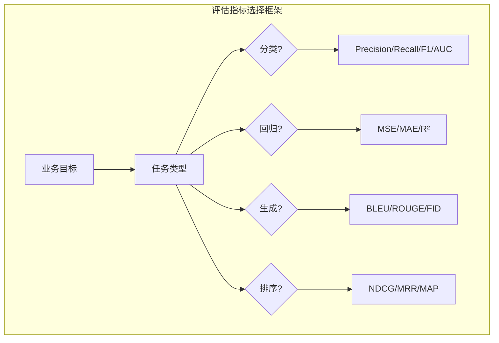

# 评估指标体系 (Evaluation Metrics)

> **一句话理解**: 评估指标是衡量模型性能的标尺——不同任务需要不同的标尺，选错指标就像用体温计量体重，数字再精确也毫无意义。

---

## TL;DR

- **分类任务**: Accuracy / Precision / Recall / F1 / AUC-ROC / AUC-PR
- **回归任务**: MSE / MAE / R² / MAPE
- **排序任务**: NDCG / MRR / MAP
- **NLP/LLM**: BLEU / ROUGE / Perplexity / BERTScore / LLM-as-Judge
- **生成任务**: FID / IS / CLIP Score
- **选择原则**: 指标必须与业务目标对齐，单一指标永远不够



---

## 1. 分类任务指标

### 1.1 混淆矩阵 (Confusion Matrix)

所有分类指标的基础：

```
                 预测: Positive    预测: Negative
实际: Positive    TP (真阳性)      FN (假阴性)
实际: Negative    FP (假阳性)      TN (真阴性)
```

### 1.2 核心指标

| 指标 | 公式 | 适用场景 | 范围 |
|------|------|----------|------|
| **Accuracy** | (TP+TN) / (TP+TN+FP+FN) | 类别均衡 | [0, 1] |
| **Precision** | TP / (TP+FP) | 关注误报（如垃圾邮件） | [0, 1] |
| **Recall** | TP / (TP+FN) | 关注漏报（如癌症检测） | [0, 1] |
| **F1-Score** | 2 × P × R / (P + R) | Precision 与 Recall 平衡 | [0, 1] |
| **AUC-ROC** | ROC 曲线下面积 | 阈值无关的整体性能 | [0, 1] |
| **AUC-PR** | PR 曲线下面积 | 类别严重不平衡 | [0, 1] |

### 1.3 Precision vs Recall 权衡

```python
# 医疗诊断：宁可误报不可漏报 → 优先 Recall
# Precision = 0.6, Recall = 0.95 → 可接受
# 因为漏诊一个癌症患者的代价远大于多做一次检查

# 垃圾邮件过滤：宁可漏过不可误拦 → 优先 Precision
# Precision = 0.99, Recall = 0.80 → 可接受
# 因为把重要邮件误判为垃圾邮件的代价很高
```

### 1.4 多分类扩展

```python
# Macro Average: 对每个类别计算指标后取平均（各类权重相等）
# Micro Average: 汇总所有 TP/FP/FN 后计算（大类主导）
# Weighted Average: 按类别样本数加权平均

from sklearn.metrics import classification_report
print(classification_report(y_true, y_pred, 
      target_names=['cat', 'dog', 'bird'],
      average='macro'))  # 推荐：关注小类表现
```

---

## 2. 回归任务指标

| 指标 | 公式 | 特点 | 适用场景 |
|------|------|------|----------|
| **MSE** | mean((y-ŷ)²) | 对大误差敏感（平方放大） | 通用 |
| **RMSE** | √MSE | 与原始单位一致 | 通用 |
| **MAE** | mean(\|y-ŷ\|) | 对异常值鲁棒 | 有异常值 |
| **MAPE** | mean(\|y-ŷ\|/y) × 100% | 百分比误差，可解释 | 预测任务 |
| **R²** | 1 - SS_res/SS_tot | 相对于均值的改进比例 | 模型解释力 |

```python
# 选择指南
# MSE/RMSE: 对异常值敏感，适用于误差应该被"惩罚"的场景
# MAE: 更鲁棒，适用于数据有噪声的场景  
# MAPE: 当需要向业务方解释时使用（"预测偏差 5%"比"MSE 0.03"更直观）
# R²: 当需要比较不同数据集上的模型时（标准化）
```

---

## 3. 排序与信息检索指标

### 3.1 NDCG (Normalized Discounted Cumulative Gain)

```
DCG@k = Σ(i=1 to k) rel_i / log2(i+1)
NDCG@k = DCG@k / IDCG@k
```

- 考虑了结果的相关性等级和位置折扣
- 值域 [0, 1]，1 表示完美排序
- 搜索引擎和推荐系统的标准指标

### 3.2 MRR (Mean Reciprocal Rank)

```
MRR = (1/|Q|) × Σ(1/rank_i)
```

- 关注第一个正确结果的位置
- 适用于问答系统：用户通常只看第一个结果

### 3.3 MAP (Mean Average Precision)

```
AP = Σ(Precision@k × rel_k) / |relevant docs|
MAP = mean(AP)
```

- 综合考虑 Precision 和 Recall
- 适用于需要返回多个相关结果的场景

---

## 4. NLP/LLM 评估指标

### 4.1 传统 NLP 指标

| 指标 | 适用任务 | 原理 | 局限 |
|------|----------|------|------|
| **BLEU** | 机器翻译 | n-gram 精确率 | 不考虑语义，对同义词不友好 |
| **ROUGE** | 摘要生成 | n-gram 召回率 | 同上 |
| **METEOR** | 翻译/摘要 | 考虑同义词和词形 | 需要外部词典 |
| **Perplexity** | 语言模型 | 预测下一个 token 的困惑度 | 低困惑度≠好生成 |

### 4.2 现代 LLM 评估方法

```python
# BERTScore: 基于 BERT 嵌入的语义相似度
from bert_score import score
P, R, F1 = score(candidates, references, lang='en')

# CLIPScore: 图文匹配（多模态）
# GPTScore: 用 GPT 评估生成质量
# LLM-as-Judge: 用 LLM 打分（推荐）
```

### 4.3 LLM-as-Judge 模式

```python
judge_prompt = """
你是一个严格的评估专家。请根据以下标准对模型回答打分（1-5）：

评估标准：
- 准确性 (Accuracy): 回答是否事实正确
- 完整性 (Completeness): 是否涵盖了问题的所有方面
- 相关性 (Relevance): 是否紧扣问题
- 清晰度 (Clarity): 表达是否清楚

用户问题: {question}
参考答案: {reference}
模型回答: {response}

请输出 JSON 格式的评分：
{"accuracy": X, "completeness": X, "relevance": X, "clarity": X, "reasoning": "..."}
"""
```

**LLM-as-Judge 最佳实践**：
1. **使用强模型评估弱模型**: GPT-4 评估 GPT-3.5 的输出
2. **提供清晰的评分标准**: rubric 比主观打分更一致
3. **多次评估取平均**: 减少随机性
4. **与人类评估对比**: 定期校验 LLM 评估与人类判断的一致性

---

## 5. 生成模型评估指标

| 指标 | 适用模型 | 原理 |
|------|----------|------|
| **FID** (Fréchet Inception Distance) | 图像生成 | 生成图与真实图分布的距离 |
| **IS** (Inception Score) | 图像生成 | 生成图的质量和多样性 |
| **CLIP Score** | 文生图 | 图像与文本描述的匹配度 |
| **LPIPS** | 图像重建 | 感知相似度（基于深度特征） |

---

## 6. 指标选择框架

### 6.1 决策矩阵

```
业务目标 → 任务类型 → 候选指标 → 主次指标 → 阈值设定
```

**常见陷阱**：
1. **准确率陷阱**: 类别不平衡时 Accuracy 无意义
2. **单一指标陷阱**: 只看一个维度会遗漏重要信息
3. **代理指标陷阱**: 低 Perplexity ≠ 好的对话体验
4. **过优化陷阱**: 针对单一指标过度优化导致其他维度恶化

### 6.2 多指标监控面板

```python
# 推荐的评估面板设计
evaluation_dashboard = {
    "primary_metric": "F1-Score",           # 核心业务指标
    "secondary_metrics": ["Precision", "Recall", "AUC-ROC"],
    "guardrail_metrics": ["latency_p99", "memory_usage"],  # 底线指标
    "fairness_metrics": ["equalized_odds", "demographic_parity"],
    "calibration": "ECE (Expected Calibration Error)"
}
```

---

## 相关阅读

- [[模型评估/Model_Evaluation]] — 模型评估全景
- [[模型评估/Evaluation_Tools/LLM_as_Judge_Deep_Dive]] — LLM 评估深度解读
- [[模型评估/Model_Evaluation_for_dummy]] — 模型评估入门版
- [[模型评估/Benchmarks/HF_Leaderboard_Eval_Guide]] — HuggingFace 排行榜实战
- [[模型评估/Fairness_Evaluation_for_dummy]] — 公平性评估入门
