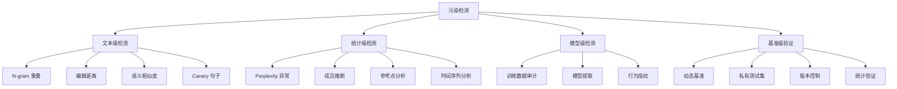

# 数据污染检测指南

> **一句话理解**: 数据污染就像考试前"泄题"——如果模型在训练时已经"看过"测试题，那高分不代表真能力。污染检测就是当"反作弊系统"，确保评估结果反映模型的真实水平。

---

## 目录

- [一、概述](#一概述)
- [二、核心方法论](#二核心方法论)
- [三、N-gram 重叠检测](#三n-gram-重叠检测)
- [四、Canary 句子方法](#四canary-句子方法)
- [五、成员推断攻击](#五成员推断攻击)
- [六、基准有效性验证](#六基准有效性验证)
- [七、去污染策略](#七去污染策略)
- [八、动态基准: LiveBench/DynamicBench](#八动态基准-livebenchdynamicbench)
- [九、对比表](#九对比表)
- [十、实践指南](#十实践指南)
- [十一、2026 前沿](#十一2026-前沿)
- [十二、相关概念](#十二相关概念)

---

## 一、概述

### 1.1 什么是数据污染

数据污染 (Data Contamination) 指评估基准中的测试数据以某种方式进入了模型的训练集，导致评估结果虚高、无法反映模型真实能力。

```
训练数据污染的光谱:

完全干净 ←————————————————————→ 完全泄漏
    ↑                                    ↑
模型从未见过测试数据              测试数据原样出现在训练集中
评估结果完全可信                  评估结果完全不可信

中间地带:
- 语义相似但非完全相同的数据
- 测试数据的变体/改写
- 同一来源的不同分割
- 间接泄漏（通过中间数据集）
```

### 1.2 污染的类型分类

| 污染类型 | 描述 | 严重程度 | 检测难度 |
|----------|------|----------|----------|
| 直接泄漏 | 测试样本原样出现在训练集 | 极高 | 低（精确匹配） |
| 近似重复 | 测试样本的微小变体在训练集 | 高 | 中（模糊匹配） |
| 语义重叠 | 相同知识/模式的不同表述 | 中 | 高（语义分析） |
| 分布泄漏 | 训练集与测试集分布高度重合 | 中 | 极高 |
| 间接泄漏 | 通过中间数据集或网络爬取间接获得 | 高 | 极高 |
| 标签泄漏 | 答案/标签信息泄漏 | 极高 | 中 |

### 1.3 为什么 2026 年污染问题更加严峻

1. **训练数据规模爆炸**: 现代 LLM 训练数据达 15T+ tokens，几乎覆盖所有公开文本
2. **基准公开化**: 大多数基准数据集在 HuggingFace/GitHub 公开可获取
3. **网络爬取**: Common Crawl 等数据源可能包含基准数据
4. **合成数据**: 使用 LLM 生成的训练数据可能"记住"基准模式
5. **竞赛压力**: 排行榜竞争激励了有意或无意的数据泄漏
6. **多模态扩展**: 图像/音频基准的污染检测更加困难

### 1.4 污染的影响量化

```python
# 污染对评估结果的影响估计
contamination_impact = {
    "GSM8K": {
        "clean_accuracy": 0.85,
        "contaminated_accuracy": 0.97,
        "inflation": "+12%",
        "confidence": "高（多项研究证实）"
    },
    "MMLU": {
        "clean_accuracy": 0.72,
        "contaminated_accuracy": 0.88,
        "inflation": "+16%",
        "confidence": "高"
    },
    "HumanEval": {
        "clean_accuracy": 0.65,
        "contaminated_accuracy": 0.90,
        "inflation": "+25%",
        "confidence": "中-高"
    },
    "ARC-Challenge": {
        "clean_accuracy": 0.80,
        "contaminated_accuracy": 0.95,
        "inflation": "+15%",
        "confidence": "中"
    }
}
```

---

## 二、核心方法论

### 2.1 污染检测框架



### 2.2 检测层次

```
Layer 1: 精确匹配检测 (Exact Match)
  → 检测完全相同的文本片段
  → 成本低，但只能发现最明显的污染

Layer 2: 近似匹配检测 (Fuzzy Match)
  → 检测改写/变体/部分重叠
  → 需要 N-gram、编辑距离等方法

Layer 3: 语义级检测 (Semantic Match)
  → 检测语义等价但表述不同的内容
  → 需要 embedding 相似度或 LLM 判断

Layer 4: 统计推断检测 (Statistical Inference)
  → 通过模型行为推断是否见过数据
  → 成员推断、perplexity 分析等

Layer 5: 基准设计防护 (Benchmark Design)
  → 从源头防止污染
  → 动态基准、私有测试集、时间锁
```

---

## 三、N-gram 重叠检测

### 3.1 基本原理

N-gram 重叠检测是最直接的污染检测方法：将测试集中的 N-gram 序列与训练数据进行匹配。

```python
from collections import Counter
from typing import List, Set, Tuple

class NGramContaminationDetector:
    """基于 N-gram 的污染检测器"""
    
    def __init__(self, n: int = 13, threshold: float = 0.8):
        """
        Args:
            n: N-gram 大小。GPT-4 技术报告使用 13-gram
            threshold: 重叠比例阈值，超过则判定为污染
        """
        self.n = n
        self.threshold = threshold
    
    def extract_ngrams(self, text: str) -> Set[str]:
        """提取文本中所有 n-gram"""
        tokens = text.lower().split()
        if len(tokens) < self.n:
            return set()
        return set(
            " ".join(tokens[i:i+self.n]) 
            for i in range(len(tokens) - self.n + 1)
        )
    
    def compute_overlap(self, test_text: str, train_corpus: str) -> dict:
        """计算测试文本与训练语料的重叠度"""
        test_ngrams = self.extract_ngrams(test_text)
        train_ngrams = self.extract_ngrams(train_corpus)
        
        if not test_ngrams:
            return {"overlap_ratio": 0.0, "matched_ngrams": []}
        
        matched = test_ngrams & train_ngrams
        overlap_ratio = len(matched) / len(test_ngrams)
        
        return {
            "overlap_ratio": overlap_ratio,
            "matched_count": len(matched),
            "total_test_ngrams": len(test_ngrams),
            "is_contaminated": overlap_ratio > self.threshold,
            "matched_ngrams": list(matched)[:10],  # 示例
        }
    
    def detect_batch(self, test_dataset: List[str], train_corpus: str) -> dict:
        """批量检测整个测试集"""
        results = []
        for i, test_item in enumerate(test_dataset):
            result = self.compute_overlap(test_item, train_corpus)
            result["item_id"] = i
            results.append(result)
        
        contaminated_items = [r for r in results if r["is_contaminated"]]
        
        return {
            "total_items": len(test_dataset),
            "contaminated_items": len(contaminated_items),
            "contamination_rate": len(contaminated_items) / len(test_dataset),
            "avg_overlap": sum(r["overlap_ratio"] for r in results) / len(results),
            "details": results,
        }
```

### 3.2 N-gram 大小选择

| N-gram 大小 | 敏感度 | 特异性 | 适用场景 | 代表工作 |
|-------------|--------|--------|----------|----------|
| 8-gram | 高 | 低 | 初筛（高召回） | 通用检测 |
| 13-gram | 中-高 | 中 | 标准检测 | GPT-4 技术报告 |
| 20-gram | 中 | 高 | 精确检测（高精度） | 严格审计 |
| 50-gram | 低 | 极高 | 完全复制检测 | 版权/抄袭 |

### 3.3 变体: 跳过 N-gram 和规范化

```python
def normalized_ngram_overlap(text1: str, text2: str, n: int = 13) -> float:
    """
    规范化后的 N-gram 重叠检测
    处理: 大小写、标点、数字格式、空白字符
    """
    def normalize(text: str) -> str:
        text = text.lower()
        text = re.sub(r'[^\w\s]', '', text)  # 去标点
        text = re.sub(r'\d+', 'NUM', text)    # 数字归一化
        text = re.sub(r'\s+', ' ', text)      # 空白归一化
        return text.strip()
    
    norm1 = normalize(text1)
    norm2 = normalize(text2)
    
    ngrams1 = extract_ngrams(norm1, n)
    ngrams2 = extract_ngrams(norm2, n)
    
    if not ngrams1:
        return 0.0
    
    return len(ngrams1 & ngrams2) / len(ngrams1)


def skip_ngram_overlap(text1: str, text2: str, n: int = 8, skip: int = 2) -> float:
    """
    Skip N-gram: 允许中间跳过若干 token
    更鲁棒地检测改写/插入式污染
    """
    tokens1 = text1.lower().split()
    tokens2 = text2.lower().split()
    
    skip_ngrams1 = set()
    for i in range(len(tokens1) - n * (skip + 1)):
        ngram = tuple(tokens1[i + j * (skip + 1)] for j in range(n))
        skip_ngrams1.add(ngram)
    
    skip_ngrams2 = set()
    for i in range(len(tokens2) - n * (skip + 1)):
        ngram = tuple(tokens2[i + j * (skip + 1)] for j in range(n))
        skip_ngrams2.add(ngram)
    
    if not skip_ngrams1:
        return 0.0
    
    return len(skip_ngrams1 & skip_ngrams2) / len(skip_ngrams1)
```

### 3.4 局限性

- **无法检测语义级污染**: 改写后的内容无法通过 N-gram 发现
- **计算成本高**: 对 15T token 训练集进行全量 N-gram 匹配不现实
- **误报**: 常见短语（如数学公式、标准表述）会产生假阳性
- **需要训练数据访问**: 闭源模型无法直接应用

---

## 四、Canary 句子方法

### 4.1 基本原理

Canary 句子（金丝雀句子）是在基准数据集中故意插入的独特句子，用于检测数据是否被爬取或泄漏。

```python
class CanaryInjector:
    """Canary 句子注入器"""
    
    def __init__(self, seed: int = 42):
        self.rng = random.Random(seed)
        self.canaries = []
    
    def generate_canary(self, context: str) -> str:
        """
        生成与上下文语义一致但包含独特标记的句子
        关键: 必须看起来自然，但包含可追踪的独特元素
        """
        # 方法 1: 插入罕见但合理的数字组合
        canary_numbers = self.rng.sample(range(10000, 99999), 3)
        
        # 方法 2: 使用罕见但存在的词汇组合
        rare_phrases = [
            "the iridescent platypus calculated",
            "seventeen crystalline algorithms determined",
            "the quadruple helix of fibonacci",
        ]
        
        canary = f"As verified by experiment #{canary_numbers[0]}-{canary_numbers[1]}, " \
                 f"{self.rng.choice(rare_phrases)} that the result is {canary_numbers[2]}."
        
        self.canaries.append({
            "text": canary,
            "numbers": canary_numbers,
            "context": context,
        })
        return canary
    
    def inject_into_dataset(self, dataset: list, injection_rate: float = 0.01):
        """在数据集中注入 canary 句子"""
        n_inject = int(len(dataset) * injection_rate)
        positions = self.rng.sample(range(len(dataset)), n_inject)
        
        for pos in positions:
            canary = self.generate_canary(dataset[pos]["text"])
            # 将 canary 自然融入文本
            dataset[pos]["text"] += "\n" + canary
            dataset[pos]["has_canary"] = True
        
        return dataset
    
    def detect_canary(self, model_output: str) -> list:
        """检测模型输出中是否包含 canary 信息"""
        detected = []
        for canary in self.canaries:
            # 检查精确匹配
            if canary["text"] in model_output:
                detected.append({"type": "exact", "canary": canary})
            # 检查数字标记
            elif all(str(n) in model_output for n in canary["numbers"]):
                detected.append({"type": "partial", "canary": canary})
        return detected
```

### 4.2 Canary 设计原则

| 原则 | 描述 | 示例 |
|------|------|------|
| 自然性 | 看起来像正常文本 | 融入上下文的补充说明 |
| 独特性 | 包含极低概率的标记 | 罕见数字组合、特殊词汇 |
| 多样性 | 不同 canary 使用不同标记 | 避免模式被学习 |
| 隐蔽性 | 不易被人工发现并删除 | 嵌入在长段落中间 |
| 可验证性 | 能明确判断是否泄漏 | 包含唯一 ID |

### 4.3 实际部署案例

```python
# 基准发布者的 Canary 部署流程
canary_deployment = {
    "设计阶段": [
        "为每个测试集生成 50-100 个 canary 句子",
        "确保 canary 分布在不同难度/类别的题目中",
        "记录 canary 位置和标记信息（加密存储）",
    ],
    "发布阶段": [
        "公开版本包含 canary",
        "私有版本（用于最终评估）不包含 canary",
        "Canary 信息不公开",
    ],
    "检测阶段": [
        "定期用 canary 提示查询各模型",
        "监控模型是否能'回忆'canary 内容",
        "发现泄漏后公开报告",
    ],
    "响应阶段": [
        "确认泄漏后标记受影响的评估结果",
        "发布新版基准（更换 canary）",
        "通知相关排行榜更新",
    ]
}
```

### 4.4 局限性

- 只能检测"记忆"，不能检测"学习"
- 需要预先注入，对已发布的基准无法追溯
- 聪明的数据清洗可能移除 canary
- 对合成数据污染无效

---

## 五、成员推断攻击

### 5.1 基本原理

成员推断攻击 (Membership Inference Attack, MIA) 通过分析模型对特定样本的行为，推断该样本是否在训练集中。

核心假设: 模型对训练过的数据表现出不同的行为模式（如更低的 perplexity、更高的置信度）。

### 5.2 基于 Perplexity 的成员推断

```python
import numpy as np
from typing import List

class PerplexityMIA:
    """基于 Perplexity 的成员推断攻击"""
    
    def __init__(self, model):
        self.model = model
        self.reference_perplexities = []  # 已知非训练数据的 perplexity
    
    def compute_perplexity(self, text: str) -> float:
        """计算文本的 perplexity"""
        log_probs = self.model.get_log_probs(text)
        avg_neg_log_prob = -np.mean(log_probs)
        return np.exp(avg_neg_log_prob)
    
    def calibrate(self, reference_texts: List[str]):
        """
        用已知非训练数据校准基线
        reference_texts: 确定不在训练集中的文本
        """
        self.reference_perplexities = [
            self.compute_perplexity(t) for t in reference_texts
        ]
        self.baseline_mean = np.mean(self.reference_perplexities)
        self.baseline_std = np.std(self.reference_perplexities)
    
    def infer_membership(self, text: str) -> dict:
        """
        推断文本是否为训练数据
        低 perplexity → 可能是训练数据
        """
        ppl = self.compute_perplexity(text)
        
        # Z-score: 与基线的偏离程度
        z_score = (self.baseline_mean - ppl) / self.baseline_std
        
        # 经验阈值: z > 2 表示显著低于基线
        is_member = z_score > 2.0
        
        return {
            "perplexity": ppl,
            "z_score": z_score,
            "is_likely_member": is_member,
            "confidence": min(0.99, 1 - 2 * (1 - norm_cdf(abs(z_score)))),
        }
    
    def batch_infer(self, texts: List[str]) -> dict:
        """批量推断"""
        results = [self.infer_membership(t) for t in texts]
        return {
            "member_count": sum(r["is_likely_member"] for r in results),
            "total": len(results),
            "contamination_rate": sum(r["is_likely_member"] for r in results) / len(results),
            "details": results,
        }
```

### 5.3 基于 Loss 的成员推断

```python
class LossBasedMIA:
    """基于 Token-level Loss 的成员推断"""
    
    def compute_token_losses(self, text: str) -> np.ndarray:
        """获取每个 token 的 loss"""
        return -np.array(self.model.get_log_probs(text))
    
    def mia_features(self, text: str) -> dict:
        """提取成员推断特征"""
        losses = self.compute_token_losses(text)
        
        return {
            "mean_loss": np.mean(losses),
            "median_loss": np.median(losses),
            "max_loss": np.max(losses),
            "loss_variance": np.var(losses),
            "loss_skewness": float(pd.Series(losses).skew()),
            # 低 loss token 的比例（训练数据通常有更多低 loss token）
            "low_loss_ratio": np.mean(losses < np.percentile(losses, 25)),
            # Loss 的自相关（训练数据 loss 模式更规律）
            "loss_autocorrelation": np.corrcoef(losses[:-1], losses[1:])[0, 1],
        }
    
    def train_classifier(self, member_features, non_member_features):
        """训练二分类器区分训练/非训练数据"""
        from sklearn.ensemble import RandomForestClassifier
        
        X = member_features + non_member_features
        y = [1] * len(member_features) + [0] * len(non_member_features)
        
        self.classifier = RandomForestClassifier(n_estimators=100)
        self.classifier.fit(X, y)
    
    def predict_membership(self, text: str) -> float:
        """预测成员概率"""
        features = self.mia_features(text)
        feature_vector = list(features.values())
        return self.classifier.predict_proba([feature_vector])[0][1]
```

### 5.4 Min-K% Prob 方法

2024 年提出的改进方法，使用最低 K% token 的平均 log probability：

```python
def min_k_percent_prob(model, text: str, k: float = 0.2) -> float:
    """
    Min-K% Prob: 取最低 k% token 的平均 log probability
    训练数据的 Min-K% 值通常更高（因为模型"记住"了困难 token）
    
    参考: Shi et al., "Detecting Pretraining Data from Large Language Models" (2024)
    """
    log_probs = model.get_log_probs(text)
    k_count = max(1, int(len(log_probs) * k))
    
    # 取最低的 k% log probs
    sorted_probs = sorted(log_probs)
    min_k_probs = sorted_probs[:k_count]
    
    return np.mean(min_k_probs)
```

### 5.5 成员推断的局限性

| 局限 | 描述 | 影响 |
|------|------|------|
| 需要 API 访问 | 需要获取 logprobs | 部分模型不提供 |
| 假阳性 | 简单/常见文本也低 perplexity | 需要校准 |
| 对 RLHF 后模型效果差 | 对齐训练改变了 loss 分布 | 准确度下降 |
| 无法定位具体来源 | 只知道"见过"，不知道从哪来 | 溯源困难 |
| 对合成数据无效 | 合成数据不产生典型成员信号 | 检测盲区 |

---

## 六、基准有效性验证

### 6.1 验证框架

```python
class BenchmarkValidityValidator:
    """基准有效性验证器"""
    
    def validate(self, benchmark, model) -> dict:
        """全面验证基准对特定模型的有效性"""
        return {
            "contamination_check": self.check_contamination(benchmark, model),
            "discriminative_power": self.check_discrimination(benchmark, model),
            "difficulty_calibration": self.check_difficulty(benchmark, model),
            "temporal_validity": self.check_temporal(benchmark),
            "construct_validity": self.check_construct(benchmark),
        }
    
    def check_contamination(self, benchmark, model) -> dict:
        """污染检查"""
        # 1. 参考点分析: 比较模型在基准发布前后的表现
        # 2. Perplexity 分析: 检查模型对测试数据的 perplexity 是否异常低
        # 3. 变体一致性: 对题目进行微小改写，检查答案是否不变
        pass
    
    def check_discrimination(self, benchmark, model) -> dict:
        """区分度检查: 基准是否能区分不同能力的模型"""
        # 使用多个已知能力水平的模型测试
        # 计算区分度指标
        pass
    
    def check_temporal(self, benchmark) -> dict:
        """时间有效性: 基准是否过时"""
        # 检查基准发布时间
        # 检查是否已被广泛讨论/解析
        # 检查是否有更新版本
        pass
```

### 6.2 参考点分析 (Reference Point Analysis)

```python
def reference_point_analysis(model, benchmark, reference_models):
    """
    参考点分析: 用已知训练截止日期的模型作为参考
    如果模型在基准发布后的表现突然提升，可能存在污染
    """
    results = {}
    
    # 收集各模型在基准上的表现
    for ref_model in reference_models:
        score = evaluate(ref_model, benchmark)
        results[ref_model.name] = {
            "score": score,
            "training_cutoff": ref_model.cutoff_date,
            "benchmark_release": benchmark.release_date,
        }
    
    # 检查: 训练截止在基准发布后的模型是否异常高分
    post_release_models = [
        r for r in results.values() 
        if r["training_cutoff"] > benchmark.release_date
    ]
    pre_release_models = [
        r for r in results.values() 
        if r["training_cutoff"] <= benchmark.release_date
    ]
    
    score_jump = (
        mean([r["score"] for r in post_release_models]) - 
        mean([r["score"] for r in pre_release_models])
    )
    
    return {
        "score_jump": score_jump,
        "suspicious": score_jump > 0.15,  # 15% 以上的跳跃可疑
        "details": results,
    }
```

### 6.3 变体一致性测试

```python
def paraphrase_consistency_test(model, benchmark, n_paraphrases=5):
    """
    改写一致性测试:
    对测试题进行语义保持的改写，检查模型答案是否一致
    如果模型"记住"了原题，改写后表现会显著下降
    """
    results = []
    
    for item in benchmark:
        # 生成多个改写版本
        paraphrases = generate_paraphrases(item.question, n=n_paraphrases)
        
        # 获取原题答案
        original_answer = model.generate(item.question)
        original_correct = is_correct(original_answer, item.answer)
        
        # 获取改写版本答案
        paraphrase_answers = [model.generate(p) for p in paraphrases]
        paraphrase_correct = [is_correct(a, item.answer) for a in paraphrase_answers]
        
        # 一致性: 原题正确但改写后错误的比例
        inconsistency = (
            sum(1 for pc in paraphrase_correct if not pc) / n_paraphrases
            if original_correct else 0
        )
        
        results.append({
            "item_id": item.id,
            "original_correct": original_correct,
            "paraphrase_accuracy": mean(paraphrase_correct),
            "inconsistency": inconsistency,
            "suspicious": inconsistency > 0.5,  # 改写后正确率下降 >50%
        })
    
    return {
        "avg_inconsistency": mean([r["inconsistency"] for r in results]),
        "suspicious_items": sum(r["suspicious"] for r in results),
        "contamination_signal": mean([r["inconsistency"] for r in results]) > 0.3,
    }
```

---

## 七、去污染策略

### 7.1 训练前去污染

```python
class PreTrainingDecontaminator:
    """训练前去污染流水线"""
    
    def __init__(self, benchmarks: list, n_gram_size: int = 13):
        self.benchmark_ngrams = self._build_benchmark_index(benchmarks, n_gram_size)
        self.n_gram_size = n_gram_size
    
    def _build_benchmark_index(self, benchmarks, n):
        """构建基准 N-gram 索引"""
        index = set()
        for benchmark in benchmarks:
            for item in benchmark:
                ngrams = extract_ngrams(item.text, n)
                index.update(ngrams)
        return index
    
    def filter_training_data(self, documents: list) -> list:
        """过滤包含基准内容的训练文档"""
        clean_documents = []
        removed_count = 0
        
        for doc in documents:
            doc_ngrams = extract_ngrams(doc.text, self.n_gram_size)
            overlap = len(doc_ngrams & self.benchmark_ngrams) / max(len(doc_ngrams), 1)
            
            if overlap > 0.3:  # 30% 以上重叠则移除
                removed_count += 1
            else:
                clean_documents.append(doc)
        
        print(f"移除 {removed_count}/{len(documents)} 个文档 ({removed_count/len(documents)*100:.1f}%)")
        return clean_documents
    
    def mask_contaminated_spans(self, document: str) -> str:
        """不移除整个文档，而是遮蔽污染片段"""
        tokens = document.split()
        masked_tokens = []
        i = 0
        while i < len(tokens):
            ngram = " ".join(tokens[i:i+self.n_gram_size])
            if ngram in self.benchmark_ngrams:
                masked_tokens.append("[MASKED]")
                i += self.n_gram_size
            else:
                masked_tokens.append(tokens[i])
                i += 1
        return " ".join(masked_tokens)
```

### 7.2 主要去污染方法对比

| 方法 | 阶段 | 粒度 | 优点 | 缺点 |
|------|------|------|------|------|
| N-gram 过滤 | 训练前 | 文档级 | 简单高效 | 可能误删正常内容 |
| 语义去重 | 训练前 | 段落级 | 更精确 | 计算成本高 |
| Canary 检测 | 发布后 | 句子级 | 明确证据 | 只能检测记忆 |
| 动态更新 | 评估时 | 基准级 | 根本解决 | 维护成本高 |
| 私有测试集 | 评估时 | 基准级 | 完全防污染 | 无法公开验证 |
| 差分隐私训练 | 训练中 | 模型级 | 理论保证 | 性能损失 |

### 7.3 去污染最佳实践

```python
decontamination_best_practices = {
    "数据准备阶段": [
        "维护所有主流基准的 N-gram 索引（GSM8K, MATH, MMLU, HumanEval 等）",
        "对训练数据进行 13-gram 重叠检测",
        "对重叠率 >30% 的文档进行人工审查",
        "记录所有被移除/修改的文档（审计日志）",
    ],
    "模型训练阶段": [
        "使用差分隐私 SGD（如果性能可接受）",
        "监控训练 loss 在基准数据上的异常下降",
        "定期用 canary 检测模型记忆程度",
    ],
    "评估阶段": [
        "优先使用动态基准（LiveBench, LiveCodeBench）",
        "对静态基准进行改写一致性测试",
        "报告训练数据截止日期和去污染方法",
        "使用多个基准交叉验证",
    ],
    "报告阶段": [
        "透明披露去污染流程",
        "报告可能的残余污染风险",
        "提供基准版本号和评估时间戳",
    ]
}
```

---

## 八、动态基准: LiveBench/DynamicBench

### 8.1 动态基准的设计理念

```
静态基准的问题:
  发布 → 被爬取 → 进入训练集 → 评估失效
  时间线: 6-18 个月

动态基准的解决:
  持续更新 → 新题目未公开 → 无法被训练 → 评估有效
  时间线: 永续
```

### 8.2 LiveBench

**基本信息**:
- 维护者: Together AI / Columbia University
- 更新频率: 每月
- 来源: 最新 arXiv 论文、新闻事件、数据集
- 特点: 题目基于最新发布的信息，训练数据不可能包含

```python
# LiveBench 评估维度
livebench_categories = {
    "数学": "基于最新数学竞赛/论文题目",
    "编程": "基于最新编程竞赛题目",
    "推理": "基于最新逻辑/科学推理问题",
    "语言": "基于最新文本理解任务",
    "数据分析": "基于最新数据表格分析",
    "指令遵循": "基于最新指令格式",
}

# LiveBench 防污染机制
livebench_anti_contamination = {
    "时间锁": "题目基于评估月份的最新信息",
    "自动更新": "每月自动生成新题目",
    "来源多样": "arXiv、新闻、竞赛等多来源",
    "答案验证": "自动验证答案正确性",
    "版本控制": "每个版本独立计分",
}
```

### 8.3 LiveCodeBench

- 专注于代码生成评估
- 题目来源: LeetCode/Codeforces/AtCoder 最新竞赛
- 每题标注发布时间，可按时间窗口评估
- 详见 [[Code_Generation_Evaluation]]

### 8.4 DynamicBench / 其他动态方案

| 动态基准 | 领域 | 更新频率 | 防污染机制 |
|----------|------|----------|-----------|
| LiveBench | 综合 | 月度 | 时间锁 + 最新来源 |
| LiveCodeBench | 代码 | 持续 | 竞赛新题 + 时间标注 |
| DynaBench | NLP | 持续 | 人机对抗生成 |
| HELM-Live | 综合 | 季度 | 私有测试集轮换 |
| SWE-bench-Live | 代码 | 月度 | 最新 GitHub Issues |
| ReasoningBench-Live | 推理 | 月度 | 最新竞赛题目 |

### 8.5 动态基准的挑战

```python
dynamic_benchmark_challenges = {
    "质量控制": {
        "问题": "自动生成的题目可能有错误",
        "解决": "多轮验证 + 人工抽检"
    },
    "难度一致性": {
        "问题": "不同批次题目难度波动",
        "解决": "难度校准 + IRT 模型"
    },
    "可比性": {
        "问题": "不同时间评估的分数不可直接比较",
        "解决": "锚定题目 + 统计等值"
    },
    "维护成本": {
        "问题": "持续更新需要大量人力",
        "解决": "自动化流水线 + 社区贡献"
    },
    "覆盖度": {
        "问题": "新题目可能覆盖不全",
        "解决": "分层采样 + 领域配额"
    }
}
```

---

## 九、对比表

### 9.1 污染检测方法对比

| 方法 | 检测层级 | 精度 | 召回率 | 计算成本 | 适用场景 |
|------|----------|------|--------|----------|----------|
| 精确匹配 | 文本 | 100% | 低 | 低 | 完全复制 |
| 13-gram 重叠 | 文本 | 高 | 中 | 中 | 近似复制 |
| 语义相似度 | 语义 | 中 | 中-高 | 高 | 改写污染 |
| Canary 检测 | 文本 | 100% | 低 | 极低 | 预置追踪 |
| Perplexity MIA | 统计 | 中 | 中 | 中 | 黑盒检测 |
| Min-K% Prob | 统计 | 中-高 | 中-高 | 中 | 黑盒检测 |
| 改写一致性 | 行为 | 中 | 中 | 高 | 间接推断 |
| 参考点分析 | 行为 | 低-中 | 低 | 低 | 宏观判断 |

### 9.2 主要基准污染状态 (2026)

| 基准 | 发布时间 | 估计污染率 | 可信度 | 建议 |
|------|----------|-----------|--------|------|
| GSM8K | 2021 | >90% | 低 | 仅作回归测试 |
| MMLU | 2021 | >80% | 低-中 | 使用 MMLU-Pro 替代 |
| HumanEval | 2021 | >85% | 低 | 使用 LiveCodeBench |
| MATH | 2021 | >70% | 中 | 使用 AIME/FrontierMath |
| ARC-Challenge | 2018 | >80% | 低 | 使用 ARC-AGI |
| GPQA | 2024 | <20% | 高 | 推荐使用 |
| AIME 2025 | 2025 | <10% | 高 | 推荐使用 |
| FrontierMath | 2024 | <5% | 极高 | 强烈推荐 |
| LiveBench | 2024+ | <5% | 极高 | 强烈推荐 |
| LiveCodeBench | 2024+ | <5% | 极高 | 强烈推荐 |

---

## 十、实践指南

### 10.1 污染检测流水线

```python
class ContaminationDetectionPipeline:
    """完整的污染检测流水线"""
    
    def __init__(self, model_api, benchmark):
        self.model = model_api
        self.benchmark = benchmark
        self.detector = NGramContaminationDetector(n=13)
        self.mia = PerplexityMIA(model_api)
    
    def run_full_detection(self) -> dict:
        """运行完整检测流程"""
        report = {
            "benchmark": self.benchmark.name,
            "detection_date": "2026-07-19",
            "methods_applied": [],
            "findings": [],
            "overall_risk": None,
        }
        
        # Step 1: N-gram 检测（如果有训练数据访问）
        if self.has_training_data_access:
            ngram_result = self.detector.detect_batch(
                self.benchmark.texts, self.training_corpus
            )
            report["methods_applied"].append("ngram_overlap")
            report["findings"].append(ngram_result)
        
        # Step 2: Perplexity 分析
        self.mia.calibrate(reference_texts=self.get_reference_texts())
        mia_result = self.mia.batch_infer(self.benchmark.texts)
        report["methods_applied"].append("perplexity_mia")
        report["findings"].append(mia_result)
        
        # Step 3: 改写一致性
        paraphrase_result = paraphrase_consistency_test(
            self.model, self.benchmark, n_paraphrases=5
        )
        report["methods_applied"].append("paraphrase_consistency")
        report["findings"].append(paraphrase_result)
        
        # Step 4: 综合风险评估
        report["overall_risk"] = self.assess_overall_risk(report["findings"])
        
        return report
    
    def assess_overall_risk(self, findings) -> str:
        """综合评估污染风险"""
        risk_score = 0
        for finding in findings:
            if finding.get("contamination_rate", 0) > 0.3:
                risk_score += 2
            elif finding.get("contamination_rate", 0) > 0.1:
                risk_score += 1
        
        if risk_score >= 4:
            return "HIGH - 基准结果不可信"
        elif risk_score >= 2:
            return "MEDIUM - 结果需谨慎解读"
        else:
            return "LOW - 结果基本可信"
```

### 10.2 评估报告中的污染声明模板

```markdown
## 数据污染声明

### 训练数据信息
- 训练数据截止日期: {cutoff_date}
- 训练数据规模: {data_size} tokens
- 去污染方法: {decontamination_method}

### 基准有效性评估
- 基准发布时间: {benchmark_release}
- 基准是否在训练截止后发布: {yes/no}
- N-gram 重叠检测结果: {overlap_rate}%
- Perplexity 异常检测结果: {mia_result}
- 改写一致性测试结果: {paraphrase_result}

### 风险评估
- 污染风险等级: {LOW/MEDIUM/HIGH}
- 结果可信度: {confidence_level}
- 建议: {recommendation}
```

### 10.3 基准选择决策树

```
需要评估模型能力？
├── 是否有训练数据访问权限？
│   ├── 是 → 运行 N-gram 检测 → 确认无污染 → 使用静态基准
│   └── 否 → 使用动态基准（LiveBench/LiveCodeBench）
├── 评估目的是什么？
│   ├── 快速对比 → LiveBench 最新版
│   ├── 深度诊断 → 多基准组合（新+旧）
│   ├── 论文发表 → 至少 2 个动态基准 + 污染分析
│   └── 产品发布 → 动态基准 + 内部私有测试集
└── 基准是否已发布 >2 年？
    ├── 是 → 高污染风险，仅作参考
    └── 否 → 中-低污染风险，可使用但需声明
```

---

## 十一、2026 前沿

### 11.1 新检测方法

#### 1. 基于 Watermark 的训练数据追踪

```python
# 2026 新趋势: 在训练数据中嵌入 watermark
# 如果模型输出中检测到 watermark 模式，说明训练数据被使用
class TrainingDataWatermark:
    def embed_watermark(self, text: str, key: str) -> str:
        """在训练数据中嵌入不可见 watermark"""
        # 使用同义词替换编码信息
        # 使用句法变换编码信息
        pass
    
    def detect_watermark(self, model_output: str, key: str) -> bool:
        """检测模型输出中是否包含 watermark"""
        pass
```

#### 2. 联邦污染检测

- 多个机构协作检测污染
- 共享基准指纹（非基准内容）
- 分布式 N-gram 索引

#### 3. 基于 LLM 的语义污染检测

```python
def llm_semantic_contamination_check(test_item, model):
    """使用 LLM 检测语义级污染"""
    prompt = f"""
    以下是一道评估题目。请判断你是否在训练过程中见过这道题或非常相似的题目。
    
    题目: {test_item.question}
    答案: {test_item.answer}
    
    请回答:
    1. 你是否"认识"这道题？(是/否/不确定)
    2. 如果是，你能回忆起哪些细节？
    3. 这道题的解题思路是什么？（不要看答案，凭记忆回答）
    """
    response = model.generate(prompt)
    return analyze_response(response)
```

### 11.2 监管与标准化

- **EU AI Act (2026 执行)**: 要求高风险 AI 系统披露评估基准的污染风险
- **NIST AI RMF**: 将数据污染检测纳入模型评估标准
- **学术规范**: 顶会要求论文包含污染分析报告
- **行业自律**: 主要实验室签署基准完整性协议

### 11.3 未来方向

1. **完全私有评估**: 评估即服务 (Evaluation-as-a-Service)，测试集永不公开
2. **实时污染监控**: 持续监控新发布数据与基准的重叠
3. **合成基准**: 每次评估时即时生成全新题目
4. **形式化验证**: 使用形式化方法证明模型"未见过"特定数据
5. **社区协作**: 建立全球基准污染数据库和预警系统

---

## 十二、相关概念

### 本知识库链接

- [[LLM_Benchmark_Suite_2026]] — LLM 评测基准全览
- [[Reasoning_Benchmarks_2026]] — 推理能力评估基准
- [[Code_Generation_Evaluation]] — 代码生成评估
- [[Evaluation_Metrics]] — 评估指标基础
- [[LM_Evaluation_Harness_Deep_Dive]] — LM Eval Harness 工具
- [[OpenCompass_Deep_Dive]] — OpenCompass 评估框架
- [[LLM_as_Judge_Deep_Dive]] — LLM 评委深度解析
- [[HF_Leaderboard_Eval_Guide]] — HuggingFace 排行榜指南
- [[Unified_Benchmark_Comparison]] — 统一基准对比
- [[Evaluation_Automation_2026]] — 评估自动化
- [[Red_Team_Evaluation_Guide]] — 红队评估指南
- [[Safety_Alignment_Evaluation]] — 安全与对齐评估
- [[LLM_Security_Complete_Guide]] — LLM 安全完整指南

### 外部参考

- Shi et al., "Detecting Pretraining Data from Large Language Models" (ICLR 2024)
- Carlini et al., "Quantifying Memorization Across Neural Language Models" (2023)
- Deng et al., "Can LLMs Generate Novel Research Ideas? A Large-Scale Human Study with 100+ NLP Researchers" (2024)
- LiveBench: A Challenging, Contamination-Free LLM Benchmark (2024)
- LiveCodeBench: Holistic and Contamination Free Evaluation of Code Generation (2024)
- GPT-4 Technical Report: Contamination Analysis Section (OpenAI, 2023)
- "Data Contamination in LLM Benchmarks: A Survey" (2025)

---

> [!warning] 重要提醒
> - 任何发布超过 2 年的公开基准都应假设存在一定程度的污染
> - 论文中报告基准分数时，必须附带污染风险分析
> - 产品评估应优先使用动态基准或私有测试集
> - 去污染是必要但不充分的——残余污染始终可能存在
