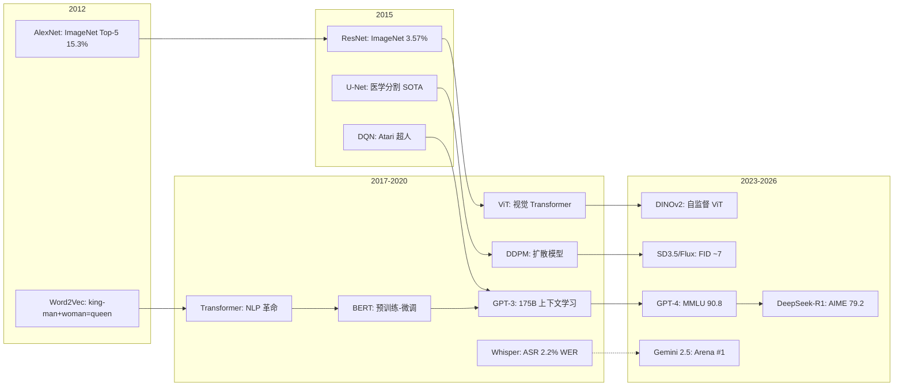

# 统一 Benchmark 对比表 — 跨领域 AI 基准全景

> **一句话理解**: 不同 AI 领域有不同的"高考"——本表将 LLM/视觉/语音/多模态/Agent 的 SOTA 结果汇总为一张全景地图，让你快速定位各领域的能力边界。

---

## 全景索引

| 领域 | 核心基准 | 最佳指标 | SOTA 模型 | 跳转 |
|------|---------|---------|-----------|------|
| LLM 通用 | MMLU / MMLU-Pro | Accuracy | o3 / DeepSeek-R1 | [§1](#1-llm-通用能力) |
| LLM 推理 | GPQA / AIME / MATH | Accuracy | DeepSeek-R1 / o3 | [§2](#2-llm-推理与数学) |
| LLM 代码 | HumanEval+ / SWE-bench | pass@1 | Claude 3.5 Sonnet | [§3](#3-llm-代码能力) |
| 图像分类 | ImageNet | Top-5 Error | ConvNeXt / ViT | [§4](#4-计算机视觉) |
| 目标检测 | COCO | mAP | DINO / Co-DETR | [§4](#4-计算机视觉) |
| 语义分割 | ADE20K | mIoU | Mask2Former | [§4](#4-计算机视觉) |
| 图像生成 | FID / CLIP Score | Lower FID | SD 3.5 / Flux | [§4](#4-计算机视觉) |
| 语音识别 | LibriSpeech / FLEURS | WER | Whisper / USM | [§5](#5-语音与音频) |
| 语音合成 | MOS / WER(TTS) | MOS Score | VALL-E / CosyVoice | [§5](#5-语音与音频) |
| 多模态 | MMMU / MathVista | Accuracy | GPT-4o / Gemini | [§6](#6-多模态模型) |
| 强化学习 | Atari / MuJoCo | Human Norm / Score | DreamerV3 | [§7](#7-强化学习与agent) |
| Agent | SWE-bench / τ-bench | Resolve Rate | Claude 3.5 Sonnet | [§7](#7-强化学习与agent) |

---

## 1. LLM 通用能力

### 1.1 MMLU-Pro 对比 (2026 Q1)

| 模型 | MMLU-Pro | MMLU | 参数量 | 类型 |
|------|---------|------|--------|------|
| **DeepSeek-R1** | 79.8 | 90.1 | 671B MoE | Open |
| **o3-mini** | 79.5 | 89.0 | — | Closed |
| **MMLU-Pro 冠军: o1** | **81.0** | **90.8** | — | Closed |
| Claude 3.5 Sonnet | 76.1 | 88.7 | — | Closed |
| Gemini 2.0 Flash | 77.2 | 90.2 | — | Closed |
| GPT-4o | 72.6 | 88.7 | ~1.7T MoE | Closed |
| Llama 3.1 405B | 66.4 | 87.3 | 405B | Open |
| Qwen2.5-72B | 64.0 | 86.0 | 72B | Open |

### 1.2 LMArena ELO 排名 (2026 Q1)

| 排名 | 模型 | ELO | 优势领域 |
|------|------|-----|---------|
| 1 | Gemini 2.5 Pro | 1407 | 综合最强 |
| 2 | ChatGPT-4o-latest | 1390 | 指令遵循 |
| 3 | Grok 3 | 1380 | 长文本 |
| 4 | Claude 3.5 Sonnet | 1365 | 代码生成 |
| 5 | DeepSeek-R1 | 1335 | 数学推理 |

> 详细 LLM 基准: [LLM Benchmark Suite 2026](./Benchmarks/LLM_Benchmark_Suite_2026.md)

---

## 2. LLM 推理与数学

### 2.1 数学推理对比

| 基准 | o1 | o3-mini | DeepSeek-R1 | QwQ-32B | GPT-4o |
|------|-----|---------|-------------|---------|--------|
| **MATH-500** | 94.8 | 96.2 | **97.3** | 92.0 | 76.4 |
| **AIME 2024** | 83.3 | **87.0** | 79.2 | 70.0 | 13.3 |
| **AIME 2025** | — | — | 70.0 | — | — |
| **GPQA Diamond** | 78.0 | 79.0 | 71.5 | 65.0 | 53.6 |
| **FrontierMath** | — | — | 12.0 | — | 3.0 |

### 2.2 推理能力关键洞察

```
MATH-500: 基本饱和 (>95%), 区分度不足
AIME:    当前最佳区分推理模型的基准
GPQA:    研究生级科学问题, 人类专家 ~65%
FrontierMath: 前沿数学, 人类数学家也需要数月 → 真正的"智力天花板"
```

---

## 3. LLM 代码能力

| 基准 | Claude 3.5 Sonnet | o1 | GPT-4o | DeepSeek-R1 | Gemini 2.0 Flash |
|------|-------------------|-----|--------|-------------|-----------------|
| **HumanEval+ pass@1** | **92.0** | 93.5 | 90.2 | 91.5 | 88.5 |
| **SWE-bench Verified** | **49.0** | — | 33.2 | 42.0 | 35.0 |
| **LiveCodeBench** | 52.0 | **67.0** | 48.5 | 65.0 | 58.0 |
| **Aider Polyglot** | **73.0** | 72.0 | 60.0 | 50.0 | 55.0 |
| **BigCodeBench** | 52.0 | **58.0** | 45.0 | 43.0 | 48.0 |

> SWE-bench 是当前最具挑战性的代码基准 (真实 GitHub issue 修复)

---

## 4. 计算机视觉

### 4.1 图像分类 (ImageNet)

| 模型 | Top-1 Acc | Top-5 Acc | 参数量 | 年份 | 类型 |
|------|----------|----------|--------|------|------|
| **ConvNeXt V2-L** | 88.7 | — | 200M | 2023 | CNN |
| **ViT-L/16 (DINOv2)** | 88.6 | — | 304M | 2023 | ViT |
| **EVA-02-L** | 89.6 | — | 305M | 2023 | ViT |
| ViT-H/14 (CLIP) | 88.2 | — | 632M | 2021 | ViT |
| ResNet-152 | 78.3 | 94.1 | 60M | 2015 | CNN |
| **AlexNet** (历史基线) | **56.5** | **79.5** | 60M | 2012 | CNN |

```
ImageNet 进化: AlexNet(2012, 62.5%) → VGG(2014, 73.2%) → ResNet(2015, 78.3%)
              → ViT(2020, 88.6%) → DINOv2(2023, 88.6%) → EVA-02(2023, 89.6%)
              ↑ 12 年提升 27% top-1, 接近饱和
```

### 4.2 目标检测 (COCO)

| 模型 | mAP | mAP@50 | FPS | 参数量 |
|------|-----|--------|-----|--------|
| **Co-DETR (ViT-L)** | **64.1** | — | — | 304M |
| **DINO-4scale** | 63.2 | 80.2 | — | 200M |
| YOLOv11-X | 54.7 | 72.0 | 50 | 56M |
| RT-DETR-L | 56.3 | 74.2 | 114 | 32M |
| DETR (原始) | 42.0 | 62.4 | 28 | 41M |

### 4.3 语义分割 (ADE20K)

| 模型 | mIoU | 参数量 | 方法 |
|------|------|--------|------|
| **Mask2Former (Swin-L)** | **58.3** | 215M | 掩码分类 |
| OneFormer (Swin-L) | 57.4 | 215M | 统一分割 |
| SAM (ViT-H) | ~47 | 636M | 零样本 |
| UPerNet (Swin-L) | 54.3 | 200M | 经典 |

### 4.4 图像生成

| 模型 | FID↓ (COCO-30K) | CLIP Score↑ | 推理时间 |
|------|-----------------|-------------|---------|
| **Flux.1 [dev]** | **~7.0** | **~32** | 中 |
| **SD 3.5 Large** | ~7.5 | ~31 | 中 |
| DALL-E 3 | ~8.0 | ~31 | 慢 |
| SDXL | 6.7 (MS-COCO) | 30.2 | 快 |
| Imagen 3 | — | — | 慢 |
| Stable Diffusion 1.5 | 9.1 | 28.5 | 快 |

---

## 5. 语音与音频

### 5.1 语音识别 (ASR) — WER (%)

| 模型 | LibriSpeech test-clean | LibriSpeech test-other | FLEURS (en) | 参数量 |
|------|----------------------|----------------------|-------------|--------|
| **Whisper large-v3** | **2.2** | **3.8** | **3.4** | 1.55B |
| USM (Google) | 2.3 | 4.1 | — | 2B |
| Paraformer-L (阿里) | 1.95 | 3.6 | — | 220M |
| Conformer-L | 2.1 | 4.2 | — | 118M |
| Wav2Vec 2.0 | 3.0 | 5.7 | — | 317M |
| DeepSpeech (基线) | 7.4 | 20.3 | — | 47M |

```
ASR 进化: HMM-GMM(2010, ~20%WER) → DNN-Hybrid(2012, ~13%) 
        → CTC(2015, ~8%) → Transformer(2019, ~3%) → Whisper(2022, ~2%)
        ↑ 10 倍改进, 接近人类水平 (~3% WER)
```

### 5.2 语音合成 (TTS)

| 模型 | MOS (1-5) | WER↓ | 推理速度 | 类型 |
|------|----------|------|---------|------|
| **VALL-E** | 4.5 | — | 慢 | 自回归 |
| **CosyVoice** | 4.4 | 2.5 | 实时 | 流式 |
| Bark | 3.9 | 6.0 | 慢 | 多任务 |
| XTTS v2 | 4.2 | 3.0 | 实时 | 克隆 |
| Tacotron 2 (基线) | 4.0 | 4.5 | 慢 | 经典 |

### 5.3 音频理解

| 模型 | AudioSet mAP | ESC-50 Acc | FSD50K mAP |
|------|-------------|-----------|-----------|
| **AST** | 48.5 | 95.5 | 58.3 |
| PANNs (Cnn14) | 43.1 | 89.0 | 50.0 |
| SSAST | 46.8 | 93.0 | 54.5 |

---

## 6. 多模态模型

### 6.1 视觉-语言基准

| 基准 | GPT-4o | Gemini 2.0 Flash | Claude 3.5 Sonnet | Qwen-VL-Max | LLaVA-1.6-34B |
|------|--------|-----------------|-------------------|-------------|---------------|
| **MMMU** | **69.1** | 62.0 | 59.4 | 56.0 | 51.0 |
| **MathVista** | **63.8** | 58.0 | 52.0 | 55.0 | 47.5 |
| **ChartQA** | 85.7 | 82.0 | 80.5 | 78.0 | 70.0 |
| **DocVQA** | 92.8 | 90.0 | 88.0 | 93.0 | 83.0 |
| **OCRBench** | 736 | 720 | 700 | 750 | 650 |
| **POPE (Acc)** | 91.0 | 88.0 | 86.5 | 87.0 | 85.0 |

### 6.2 视频理解

| 基准 | GPT-4o | Gemini 1.5 Pro | Video-LLaMA-2 |
|------|--------|---------------|---------------|
| **MVBench** | 58.0 | 62.0 | 54.0 |
| **Video-MME** | 71.9 | 75.0 | 55.0 |
| **EGOVQA** | — | — | — |

---

## 7. 强化学习与 Agent

### 7.1 经典 RL 基准

| 模型 | Atari (HNS) | MuJoCo (mean) | DMC (score) |
|------|------------|--------------|-------------|
| **DreamerV3** | 1.53 | ~1200 | ~800 |
| Rainbow DQN | 1.00 | — | — |
| SAC | — | ~1100 | — |
| PPO | — | ~800 | ~600 |
| DQN (原始基线) | 0.79 | — | — |

> HNS = Human Normalized Score (>1.0 = 超过人类)

### 7.2 Agent 基准

| 基准 | Claude 3.5 Sonnet | GPT-4o | DeepSeek-R1 | Gemini 2.0 Flash |
|------|-------------------|--------|-------------|-----------------|
| **SWE-bench Verified** | **49.0** | 33.2 | 42.0 | 35.0 |
| **τ-bench (Airline)** | 52.0 | 38.0 | — | 45.0 |
| **BFCL v3** | 72.0 | 68.0 | 60.0 | 65.0 |
| **BrowseComp** | — | ~10 | — | — |

> 详细 Agent 基准: [Agentic Benchmark Guide](./Benchmarks/Agentic_Benchmark_Guide.md)

---

## 8. 跨领域 SOTA 演进时间线



---

## 9. Benchmark 选择决策矩阵

| 你的目标 | 推荐基准 | 不推荐 | 原因 |
|---------|---------|--------|------|
| 比较 LLM 综合能力 | MMLU-Pro + GPQA + MATH-500 | MMLU (饱和) | MMLU-Pro 区分度更高 |
| 评估代码能力 | SWE-bench + LiveCodeBench | HumanEval (饱和) | 真实任务 > 函数级 |
| 评估推理能力 | AIME + FrontierMath | GSM8K (饱和) | 竞赛级数学区分度好 |
| 评估视觉模型 | MMMU + MathVista | ImageNet (饱和) | 多模态理解 > 分类 |
| 评估 ASR | LibriSpeech + FLEURS | TIMIT (过旧) | 现代数据集更有代表性 |
| 评估生成质量 | FID + CLIP Score + 人类评估 | 仅 FID | FID 不反映文本对齐 |
| 评估 Agent | SWE-bench + τ-bench | 单轮 QA | 多步交互 > 单轮 |
| 评估安全性 | TruthfulQA + RedTeam | 仅 TruthfulQA | 需要多维度安全评估 |

---

## 10. 饱和 vs 活跃的基准

| 状态 | 基准 | 说明 |
|------|------|------|
| **已饱和** | MMLU, GSM8K, ImageNet, HumanEval, HellaSwag | Top 模型 >95%, 区分度不足 |
| **接近饱和** | MATH-500, COCO mAP, LibriSpeech | 进步缓慢, 需要更难基准 |
| **活跃** | AIME, SWE-bench, GPQA, MMMU, τ-bench | 当前最佳区分度 |
| **新兴** | FrontierMath, BrowseComp, ARC-AGI | 前沿挑战, 远未饱和 |

---

*Last updated: 2026-06-04*

## Related

- [[08_模型评估/02_Benchmarks/LLM_Benchmark_Suite_2026|LLM Benchmark Suite 2026]] — LLM 专项基准详解
- [[08_模型评估/02_Benchmarks/Agentic_Benchmark_Guide|Agentic Benchmark Guide]] — Agent 评测全景
- [[08_模型评估/02_Benchmarks/Multimodal_Evaluation_Benchmarks|Multimodal Benchmarks]] — 多模态评测基准
- [[08_模型评估/README|模型评估]] — 评估方法论
- [[08_模型评估/README|模型评估概览]]
