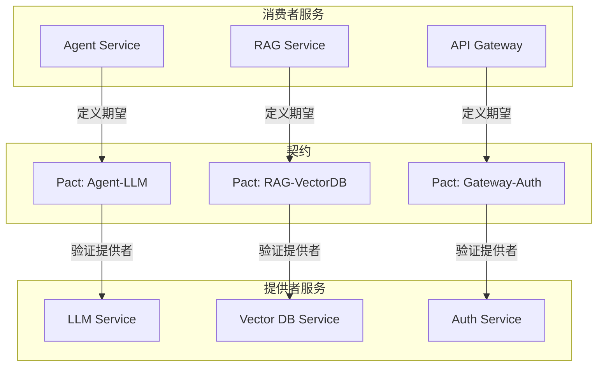
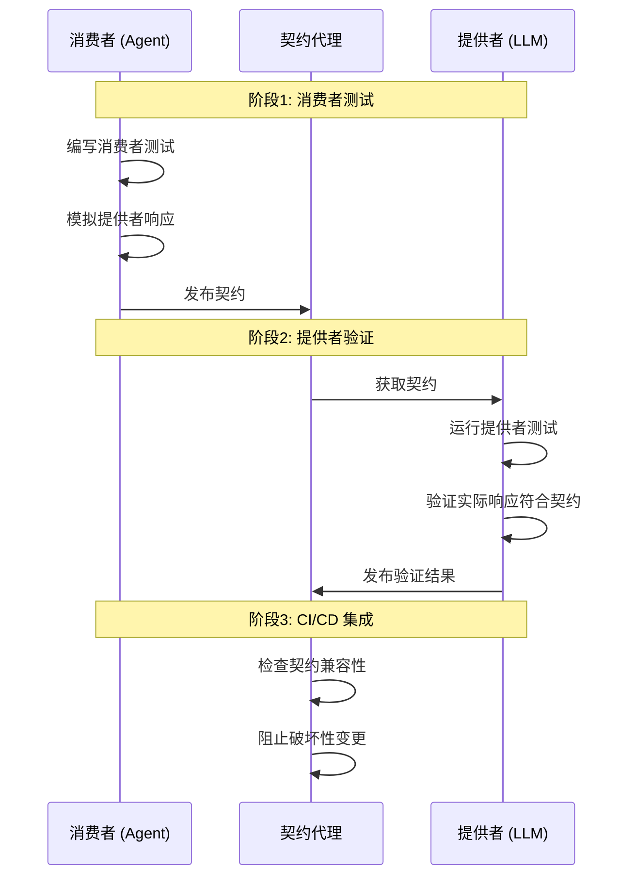

# 契约测试 (Contract Testing for AI Systems)

> **一句话理解**: 契约测试是服务间的"协议保证书"——确保 AI 系统中各服务（LLM、向量库、Agent）之间的 API 交互符合约定，防止版本升级导致的兼容性问题。

---

## 1. 契约测试概述

### 1.1 为什么 AI 系统需要契约测试？

| 挑战 | 传统微服务 | AI 系统 | 契约测试价值 |
|-----|----------|--------|------------|
| **服务依赖复杂** | API 调用链清晰 | LLM + 向量库 + Agent 多服务协作 | 验证服务间接口一致性 |
| **版本迭代频繁** | 定期发布 | 模型/提示词频繁更新 | 防止破坏性变更 |
| **响应格式多变** | 固定 JSON | 模型输出格式不稳定 | 确保输出格式约定 |
| **多团队协作** | 服务边界清晰 | 跨团队服务集成 | 解耦开发和测试 |
| **回归成本高** | 全链路测试复杂 | 模型推理成本高 | 轻量级接口验证 |

### 1.2 契约测试 vs 其他测试类型

```
测试金字塔 - AI 系统视角

                    ┌─────────┐
                    │   E2E   │  端到端测试
                    │  Tests  │  成本最高，覆盖真实场景
                    └────┬────┘
                         │
              ┌──────────┴──────────┐
              │   Integration Tests │  集成测试
              │   (服务间协作)        │  验证服务交互
              └──────────┬──────────┘
                         │
         ┌───────────────┴───────────────┐
         │      Contract Tests           │  ← 契约测试
         │   (服务间接口约定验证)          │  轻量、快速、独立
         └───────────────┬───────────────┘
                         │
    ┌────────────────────┴────────────────────┐
    │              Unit Tests                  │  单元测试
    │        (单个函数/组件逻辑)                │  成本最低，覆盖最广
    └──────────────────────────────────────────┘
```

### 1.3 核心概念

| 概念 | 说明 | AI 系统示例 |
|-----|------|-----------|
| **提供者 (Provider)** | 提供 API 的服务 | LLM 服务、向量数据库服务 |
| **消费者 (Consumer)** | 调用 API 的服务 | Agent 服务、RAG 服务 |
| **契约 (Contract)** | 双方约定的接口规范 | OpenAPI 规范、Pact 文件 |
| **契约测试** | 验证服务符合契约的测试 | 验证 LLM 服务返回格式正确 |
| **消费者驱动** | 消费者定义期望，提供者验证 | Agent 定义期望的 LLM 响应格式 |

---

## 2. 契约测试架构

### 2.1 AI 系统契约关系图



### 2.2 契约测试流程



---

## 3. 契约定义

### 3.1 OpenAPI 契约示例

```yaml
# openapi/llm-service.yaml
openapi: 3.0.3
info:
  title: LLM Service API
  version: 1.0.0
  description: AI 语言模型服务接口规范

servers:
  - url: https://api.example.com/v1

paths:
  /chat/completions:
    post:
      summary: 聊天补全
      operationId: chatCompletion
      tags:
        - Chat
      
      requestBody:
        required: true
        content:
          application/json:
            schema:
              $ref: '#/components/schemas/ChatRequest'
      
      responses:
        '200':
          description: 成功响应
          content:
            application/json:
              schema:
                $ref: '#/components/schemas/ChatResponse'
        
        '400':
          description: 请求错误
          content:
            application/json:
              schema:
                $ref: '#/components/schemas/ErrorResponse'
        
        '429':
          description: 请求过于频繁
          content:
            application/json:
              schema:
                $ref: '#/components/schemas/ErrorResponse'

components:
  schemas:
    ChatRequest:
      type: object
      required:
        - model
        - messages
      properties:
        model:
          type: string
          description: 模型标识
          example: "gpt-4"
        
        messages:
          type: array
          items:
            $ref: '#/components/schemas/Message'
          minItems: 1
        
        temperature:
          type: number
          format: float
          minimum: 0
          maximum: 2
          default: 1.0
        
        max_tokens:
          type: integer
          minimum: 1
          maximum: 128000
        
        stream:
          type: boolean
          default: false
        
        tools:
          type: array
          items:
            $ref: '#/components/schemas/Tool'
    
    ChatResponse:
      type: object
      required:
        - id
        - object
        - created
        - model
        - choices
      properties:
        id:
          type: string
          format: uuid
        
        object:
          type: string
          enum: ["chat.completion"]
        
        created:
          type: integer
          format: int64
        
        model:
          type: string
        
        choices:
          type: array
          items:
            $ref: '#/components/schemas/Choice'
        
        usage:
          $ref: '#/components/schemas/Usage'
    
    Message:
      type: object
      required:
        - role
        - content
      properties:
        role:
          type: string
          enum: ["system", "user", "assistant", "tool"]
        
        content:
          oneOf:
            - type: string
            - type: array
              items:
                $ref: '#/components/schemas/ContentPart'
        
        name:
          type: string
        
        tool_call_id:
          type: string
    
    Choice:
      type: object
      required:
        - index
        - message
        - finish_reason
      properties:
        index:
          type: integer
        
        message:
          $ref: '#/components/schemas/Message'
        
        finish_reason:
          type: string
          enum: ["stop", "length", "tool_calls", "content_filter"]
    
    Usage:
      type: object
      properties:
        prompt_tokens:
          type: integer
        completion_tokens:
          type: integer
        total_tokens:
          type: integer
    
    Tool:
      type: object
      required:
        - type
        - function
      properties:
        type:
          type: string
          enum: ["function"]
        function:
          type: object
          required:
            - name
          properties:
            name:
              type: string
            description:
              type: string
            parameters:
              type: object
    
    ContentPart:
      type: object
      required:
        - type
      properties:
        type:
          type: string
          enum: ["text", "image_url"]
        text:
          type: string
        image_url:
          type: object
          properties:
            url:
              type: string
            detail:
              type: string
              enum: ["auto", "low", "high"]
    
    ErrorResponse:
      type: object
      properties:
        error:
          type: object
          properties:
            message:
              type: string
            type:
              type: string
            code:
              type: string
```

### 3.2 Pact 契约示例

```python
"""
Pact 契约定义 - Agent 与 LLM 服务
"""

from pact import Consumer, Provider, Like, EachLike, Term
import pytest

# 定义消费者和提供者
pact = Consumer("AgentService").has_pact_with(Provider("LLMService"))

class TestLLMContract:
    """LLM 服务契约测试"""
    
    def test_chat_completion_contract(self):
        """测试聊天补全契约"""
        # 定义期望的请求和响应
        (
            pact
            .given("LLM 服务可用")
            .upon_receiving("聊天补全请求")
            .with_request(
                method="POST",
                path="/v1/chat/completions",
                headers={
                    "Content-Type": "application/json",
                    "Authorization": Term(r"Bearer .*", "Bearer test-token")
                },
                body={
                    "model": Like("gpt-4"),
                    "messages": EachLike({
                        "role": Term("user|assistant|system", "user"),
                        "content": Like("你好")
                    }),
                    "temperature": Like(0.7),
                    "max_tokens": Like(1000)
                }
            )
            .will_respond_with(
                status=200,
                headers={
                    "Content-Type": "application/json"
                },
                body={
                    "id": Term(r"chatcmpl-.*", "chatcmpl-abc123"),
                    "object": "chat.completion",
                    "created": Like(1234567890),
                    "model": Like("gpt-4"),
                    "choices": EachLike({
                        "index": Like(0),
                        "message": {
                            "role": "assistant",
                            "content": Like("你好！有什么我可以帮助你的吗？")
                        },
                        "finish_reason": Term("stop|length", "stop")
                    }),
                    "usage": {
                        "prompt_tokens": Like(10),
                        "completion_tokens": Like(20),
                        "total_tokens": Like(30)
                    }
                }
            )
        )
        
        with pact:
            # 消费者调用
            response = agent_service.call_llm(
                messages=[{"role": "user", "content": "你好"}]
            )
            
            # 验证响应
            assert response["choices"][0]["message"]["content"] is not None


class TestVectorDBContract:
    """向量数据库契约测试"""
    
    def test_upsert_vectors_contract(self):
        """测试向量插入契约"""
        pact = Consumer("RAGService").has_pact_with(Provider("VectorDBService"))
        
        (
            pact
            .given("向量集合存在")
            .upon_receiving("向量插入请求")
            .with_request(
                method="POST",
                path="/v1/collections/knowledge/vectors",
                body={
                    "vectors": EachLike({
                        "id": Term(r"[a-f0-9-]+", "abc-123"),
                        "embedding": EachLike(0.1),  # 向量值
                        "metadata": Like({
                            "text": "示例文本",
                            "source": "doc.pdf"
                        })
                    })
                }
            )
            .will_respond_with(
                status=200,
                body={
                    "upserted_count": Like(1),
                    "upserted_ids": EachLike("abc-123")
                }
            )
        )
    
    def test_query_vectors_contract(self):
        """测试向量查询契约"""
        (
            pact
            .given("向量集合包含数据")
            .upon_receiving("向量查询请求")
            .with_request(
                method="POST",
                path="/v1/collections/knowledge/query",
                body={
                    "query_embedding": EachLike(0.1),
                    "top_k": Like(10),
                    "include_metadata": Like(True)
                }
            )
            .will_respond_with(
                status=200,
                body={
                    "matches": EachLike({
                        "id": Term(r"[a-f0-9-]+", "abc-123"),
                        "score": Term(r"0\.\d+", "0.95"),
                        "metadata": Like({
                            "text": "匹配文本",
                            "source": "doc.pdf"
                        })
                    })
                }
            )
        )
```

---

## 4. 消费者端测试

### 4.1 消费者测试框架

```python
"""
消费者端契约测试框架
"""

from typing import Dict, Any, List, Optional
from dataclasses import dataclass
from unittest.mock import Mock, patch
import json

@dataclass
class ContractExpectation:
    """契约期望"""
    provider_state: str          # 提供者状态
    description: str             # 描述
    request: Dict               # 期望的请求
    response: Dict              # 期望的响应

class ConsumerContractTest:
    """消费者契约测试基类"""
    
    def __init__(self, consumer_name: str, provider_name: str):
        self.consumer_name = consumer_name
        self.provider_name = provider_name
        self.expectations: List[ContractExpectation] = []
        self.mock_provider = Mock()
    
    def define_expectation(self,
                           provider_state: str,
                           description: str,
                           request: Dict,
                           response: Dict):
        """定义期望"""
        self.expectations.append(ContractExpectation(
            provider_state=provider_state,
            description=description,
            request=request,
            response=response
        ))
    
    def mock_response(self, expectation: ContractExpectation):
        """模拟提供者响应"""
        self.mock_provider.request.return_value = expectation.response
    
    def generate_pact_file(self) -> Dict:
        """生成 Pact 文件"""
        pact = {
            "consumer": {"name": self.consumer_name},
            "provider": {"name": self.provider_name},
            "interactions": [],
            "metadata": {
                "pactSpecification": {"version": "4.0.0"}
            }
        }
        
        for exp in self.expectations:
            interaction = {
                "description": exp.description,
                "providerStates": [{"name": exp.provider_state}],
                "request": exp.request,
                "response": exp.response
            }
            pact["interactions"].append(interaction)
        
        return pact
    
    def save_pact(self, output_dir: str = "./pacts"):
        """保存 Pact 文件"""
        import os
        os.makedirs(output_dir, exist_ok=True)
        
        pact = self.generate_pact_file()
        filename = f"{self.consumer_name.lower()}-{self.provider_name.lower()}.json"
        filepath = os.path.join(output_dir, filename)
        
        with open(filepath, 'w') as f:
            json.dump(pact, f, indent=2)
        
        return filepath


class AgentServiceContractTest(ConsumerContractTest):
    """Agent 服务契约测试"""
    
    def __init__(self):
        super().__init__("AgentService", "LLMService")
    
    def test_chat_completion(self):
        """测试聊天补全"""
        # 定义期望
        self.define_expectation(
            provider_state="LLM 服务可用",
            description="聊天补全请求",
            request={
                "method": "POST",
                "path": "/v1/chat/completions",
                "headers": {"Content-Type": "application/json"},
                "body": {
                    "model": "gpt-4",
                    "messages": [{"role": "user", "content": "测试"}]
                }
            },
            response={
                "status": 200,
                "body": {
                    "id": "chatcmpl-test",
                    "choices": [{
                        "message": {"role": "assistant", "content": "响应"}
                    }]
                }
            }
        )
        
        # 模拟响应
        exp = self.expectations[-1]
        self.mock_response(exp)
        
        # 执行测试
        with patch('requests.post', return_value=self.mock_provider.request.return_value):
            result = self.call_llm_service()
            assert result["choices"][0]["message"]["content"] is not None
    
    def test_tool_call(self):
        """测试工具调用"""
        self.define_expectation(
            provider_state="LLM 服务支持工具调用",
            description="工具调用请求",
            request={
                "method": "POST",
                "path": "/v1/chat/completions",
                "body": {
                    "model": "gpt-4",
                    "messages": [{"role": "user", "content": "搜索天气"}],
                    "tools": [{
                        "type": "function",
                        "function": {"name": "get_weather"}
                    }]
                }
            },
            response={
                "status": 200,
                "body": {
                    "choices": [{
                        "message": {
                            "role": "assistant",
                            "tool_calls": [{
                                "id": "call-123",
                                "type": "function",
                                "function": {
                                    "name": "get_weather",
                                    "arguments": '{"city": "北京"}'
                                }
                            }]
                        }
                    }]
                }
            }
        )
    
    def call_llm_service(self) -> Dict:
        """调用 LLM 服务"""
        # 实际实现
        import requests
        response = requests.post(
            "http://llm-service/v1/chat/completions",
            json={
                "model": "gpt-4",
                "messages": [{"role": "user", "content": "测试"}]
            }
        )
        return response.json()


class RAGServiceContractTest(ConsumerContractTest):
    """RAG 服务契约测试"""
    
    def __init__(self):
        super().__init__("RAGService", "VectorDBService")
    
    def test_vector_search(self):
        """测试向量搜索"""
        self.define_expectation(
            provider_state="向量库包含文档",
            description="向量搜索请求",
            request={
                "method": "POST",
                "path": "/v1/collections/docs/query",
                "body": {
                    "query_embedding": [0.1] * 768,
                    "top_k": 5
                }
            },
            response={
                "status": 200,
                "body": {
                    "matches": [{
                        "id": "doc-1",
                        "score": 0.95,
                        "metadata": {"text": "匹配文档"}
                    }]
                }
            }
        )
```

---

## 5. 提供者端验证

### 5.1 提供者验证框架

```python
"""
提供者端契约验证框架
"""

from typing import Dict, List, Any, Optional
from dataclasses import dataclass
import json
import requests

@dataclass
class ProviderState:
    """提供者状态"""
    name: str
    setup_action: callable
    teardown_action: callable = None

class ProviderVerifier:
    """提供者验证器"""
    
    def __init__(self, 
                 provider_name: str,
                 provider_base_url: str,
                 pact_broker_url: str = None):
        self.provider_name = provider_name
        self.base_url = provider_base_url
        self.pact_broker_url = pact_broker_url
        self.states: Dict[str, ProviderState] = {}
    
    def register_state(self, 
                       state_name: str,
                       setup: callable,
                       teardown: callable = None):
        """注册提供者状态处理器"""
        self.states[state_name] = ProviderState(
            name=state_name,
            setup_action=setup,
            teardown_action=teardown
        )
    
    def verify_interaction(self, interaction: Dict) -> Dict:
        """验证单个交互"""
        # 1. 设置提供者状态
        provider_states = interaction.get("providerStates", [])
        for state in provider_states:
            state_name = state.get("name")
            if state_name in self.states:
                self.states[state_name].setup_action()
        
        # 2. 执行请求
        request = interaction.get("request", {})
        response = self._execute_request(request)
        
        # 3. 验证响应
        expected_response = interaction.get("response", {})
        verification_result = self._verify_response(response, expected_response)
        
        # 4. 清理状态
        for state in provider_states:
            state_name = state.get("name")
            if state_name in self.states:
                teardown = self.states[state_name].teardown_action
                if teardown:
                    teardown()
        
        return verification_result
    
    def _execute_request(self, request: Dict) -> requests.Response:
        """执行请求"""
        method = request.get("method", "GET").lower()
        path = request.get("path", "/")
        headers = request.get("headers", {})
        body = request.get("body")
        
        url = f"{self.base_url}{path}"
        
        if method == "get":
            return requests.get(url, headers=headers)
        elif method == "post":
            return requests.post(url, json=body, headers=headers)
        elif method == "put":
            return requests.put(url, json=body, headers=headers)
        elif method == "delete":
            return requests.delete(url, headers=headers)
    
    def _verify_response(self, 
                          actual: requests.Response,
                          expected: Dict) -> Dict:
        """验证响应"""
        errors = []
        
        # 状态码验证
        expected_status = expected.get("status", 200)
        if actual.status_code != expected_status:
            errors.append({
                "type": "status_mismatch",
                "expected": expected_status,
                "actual": actual.status_code
            })
        
        # 响应体验证
        expected_body = expected.get("body", {})
        try:
            actual_body = actual.json()
            body_errors = self._verify_body(actual_body, expected_body)
            errors.extend(body_errors)
        except json.JSONDecodeError:
            errors.append({
                "type": "invalid_json",
                "message": "响应不是有效的 JSON"
            })
        
        return {
            "success": len(errors) == 0,
            "errors": errors
        }
    
    def _verify_body(self, actual: Any, expected: Any, path: str = "") -> List[Dict]:
        """递归验证响应体"""
        errors = []
        
        if isinstance(expected, dict):
            if not isinstance(actual, dict):
                errors.append({
                    "type": "type_mismatch",
                    "path": path,
                    "expected": "object",
                    "actual": type(actual).__name__
                })
            else:
                for key, expected_value in expected.items():
                    actual_value = actual.get(key)
                    new_path = f"{path}.{key}" if path else key
                    
                    if actual_value is None and expected_value is not None:
                        errors.append({
                            "type": "missing_field",
                            "path": new_path
                        })
                    else:
                        errors.extend(self._verify_body(
                            actual_value, expected_value, new_path
                        ))
        
        elif isinstance(expected, list):
            if not isinstance(actual, list):
                errors.append({
                    "type": "type_mismatch",
                    "path": path,
                    "expected": "array",
                    "actual": type(actual).__name__
                })
        
        elif isinstance(expected, str):
            # 可能是正则匹配
            import re
            if expected.startswith(r"Term("):
                # 提取正则模式
                pattern = expected.strip("Term()").strip('"').strip("'")
                if not re.match(pattern, str(actual)):
                    errors.append({
                        "type": "pattern_mismatch",
                        "path": path,
                        "pattern": pattern,
                        "actual": actual
                    })
        
        return errors
    
    def verify_pact(self, pact: Dict) -> Dict:
        """验证整个 Pact"""
        results = {
            "provider": pact.get("provider", {}).get("name"),
            "consumer": pact.get("consumer", {}).get("name"),
            "interactions": [],
            "success": True
        }
        
        for interaction in pact.get("interactions", []):
            result = self.verify_interaction(interaction)
            result["description"] = interaction.get("description")
            results["interactions"].append(result)
            
            if not result["success"]:
                results["success"] = False
        
        return results


class LLMServiceVerifier(ProviderVerifier):
    """LLM 服务验证器"""
    
    def __init__(self, base_url: str):
        super().__init__("LLMService", base_url)
        
        # 注册状态处理器
        self.register_state(
            "LLM 服务可用",
            setup=self._setup_service_available,
            teardown=None
        )
        
        self.register_state(
            "LLM 服务支持工具调用",
            setup=self._setup_tool_support,
            teardown=None
        )
    
    def _setup_service_available(self):
        """设置服务可用状态"""
        # 确保服务运行
        pass
    
    def _setup_tool_support(self):
        """设置工具支持状态"""
        # 加载工具定义
        pass


# 测试示例
class TestLLMProviderContract:
    """LLM 提供者契约测试"""
    
    def test_verify_chat_completion_contract(self):
        """验证聊天补全契约"""
        verifier = LLMServiceVerifier("http://localhost:8000")
        
        # 加载消费者发布的契约
        pact = self._load_consumer_pact("AgentService-LLMService.json")
        
        # 验证
        result = verifier.verify_pact(pact)
        
        assert result["success"], f"契约验证失败: {result}"
    
    def _load_consumer_pact(self, filename: str) -> Dict:
        """加载消费者契约"""
        with open(f"./pacts/{filename}") as f:
            return json.load(f)
```

---

## 6. CI/CD 集成

### 6.1 契约测试流水线

```yaml
# .github/workflows/contract-tests.yml
name: Contract Tests

on:
  push:
    branches: [main, develop]
  pull_request:
    branches: [main]
  workflow_dispatch:

jobs:
  # 消费者契约测试
  consumer-tests:
    runs-on: ubuntu-latest
    strategy:
      matrix:
        consumer: [AgentService, RAGService, GatewayService]
    
    steps:
      - uses: actions/checkout@v4
      
      - name: Setup Python
        uses: actions/setup-python@v5
        with:
          python-version: '3.11'
      
      - name: Install Dependencies
        run: |
          pip install -r requirements.txt
          pip install pact-python pytest
      
      - name: Run Consumer Contract Tests
        run: |
          pytest tests/contract/consumers/${{ matrix.consumer }}/ -v
      
      - name: Publish Pact Files
        run: |
          python scripts/publish_pacts.py \
            --consumer ${{ matrix.consumer }} \
            --broker-url ${{ secrets.PACT_BROKER_URL }} \
            --branch ${{ github.ref_name }}
      
      - name: Upload Pact Artifacts
        uses: actions/upload-artifact@v4
        with:
          name: pacts-${{ matrix.consumer }}
          path: pacts/

  # 提供者验证
  provider-verification:
    needs: consumer-tests
    runs-on: ubuntu-latest
    strategy:
      matrix:
        provider: [LLMService, VectorDBService, AuthService]
    
    steps:
      - uses: actions/checkout@v4
      
      - name: Setup Environment
        uses: actions/setup-python@v5
        with:
          python-version: '3.11'
      
      - name: Start Provider Service
        run: |
          docker-compose -f docker-compose.test.yml up -d ${{ matrix.provider }}
          sleep 30  # 等待服务启动
      
      - name: Run Provider Verification
        env:
          PACT_BROKER_URL: ${{ secrets.PACT_BROKER_URL }}
          PACT_BROKER_TOKEN: ${{ secrets.PACT_BROKER_TOKEN }}
        run: |
          python scripts/verify_provider.py \
            --provider ${{ matrix.provider }} \
            --broker-url $PACT_BROKER_URL \
            --publish-results
      
      - name: Stop Services
        if: always()
        run: |
          docker-compose -f docker-compose.test.yml down

  # 契约兼容性检查
  can-i-deploy:
    needs: provider-verification
    runs-on: ubuntu-latest
    
    steps:
      - name: Check Deployment Readiness
        env:
          PACT_BROKER_URL: ${{ secrets.PACT_BROKER_URL }}
          PACT_BROKER_TOKEN: ${{ secrets.PACT_BROKER_TOKEN }}
        run: |
          # 检查是否可以安全部署
          pact-broker can-i-deploy \
            --broker-base-url $PACT_BROKER_URL \
            --broker-token $PACT_BROKER_TOKEN \
            --pacticipant AgentService \
            --version ${{ github.sha }} \
            --to-environment production
      
      - name: Deployment Gate
        run: |
          echo "契约验证通过，可以安全部署"
```

### 6.2 Pact Broker 集成

```python
"""
Pact Broker 集成脚本
"""

import requests
import json
import os
from typing import Optional

class PactBroker:
    """Pact Broker 客户端"""
    
    def __init__(self, 
                 broker_url: str,
                 api_token: str = None):
        self.broker_url = broker_url.rstrip('/')
        self.api_token = api_token
    
    def publish_pact(self, 
                     consumer_name: str,
                     consumer_version: str,
                     pact_file: str,
                     branch: str = None,
                     tags: list = None) -> Dict:
        """发布契约"""
        with open(pact_file) as f:
            pact_content = json.load(f)
        
        url = f"{self.broker_url}/pacts/provider/{pact_content['provider']['name']}/consumer/{consumer_name}/version/{consumer_version}"
        
        headers = {
            "Content-Type": "application/json"
        }
        if self.api_token:
            headers["Authorization"] = f"Bearer {self.api_token}"
        
        response = requests.put(url, json=pact_content, headers=headers)
        response.raise_for_status()
        
        # 添加分支和标签
        if branch:
            self._add_branch(consumer_name, consumer_version, branch)
        
        if tags:
            for tag in tags:
                self._add_tag(consumer_name, consumer_version, tag)
        
        return response.json()
    
    def _add_branch(self, consumer: str, version: str, branch: str):
        """添加分支标识"""
        url = f"{self.broker_url}/pacticipants/{consumer}/versions/{version}/branches/{branch}"
        requests.put(url, headers=self._get_headers())
    
    def _add_tag(self, consumer: str, version: str, tag: str):
        """添加标签"""
        url = f"{self.broker_url}/pacticipants/{consumer}/versions/{version}/tags/{tag}"
        requests.put(url, headers=self._get_headers())
    
    def get_pacts_for_provider(self, provider_name: str) -> list:
        """获取提供者的所有契约"""
        url = f"{self.broker_url}/pacts/provider/{provider_name}/latest"
        response = requests.get(url, headers=self._get_headers())
        response.raise_for_status()
        return response.json().get("_embedded", {}).get("pacts", [])
    
    def verify_results(self, 
                       provider_name: str,
                       provider_version: str,
                       success: bool,
                       branch: str = None) -> Dict:
        """发布验证结果"""
        url = f"{self.broker_url}/pacts/provider/{provider_name}/versions/{provider_version}"
        
        body = {
            "success": success,
            "providerApplicationVersion": provider_version
        }
        
        if branch:
            body["branch"] = branch
        
        response = requests.post(url, json=body, headers=self._get_headers())
        response.raise_for_status()
        return response.json()
    
    def can_i_deploy(self,
                     pacticipant: str,
                     version: str,
                     to_environment: str = "production") -> Dict:
        """检查是否可以部署"""
        url = f"{self.broker_url}/can-i-deploy"
        params = {
            "pacticipant": pacticipant,
            "version": version,
            "to": to_environment
        }
        
        response = requests.get(url, params=params, headers=self._get_headers())
        response.raise_for_status()
        return response.json()
    
    def _get_headers(self) -> Dict:
        headers = {"Content-Type": "application/json"}
        if self.api_token:
            headers["Authorization"] = f"Bearer {self.api_token}"
        return headers


# 使用示例
def publish_consumer_pacts():
    """发布消费者契约"""
    broker = PactBroker(
        broker_url=os.environ["PACT_BROKER_URL"],
        api_token=os.environ.get("PACT_BROKER_TOKEN")
    )
    
    import subprocess
    version = subprocess.check_output(
        ["git", "rev-parse", "--short", "HEAD"]
    ).decode().strip()
    
    branch = subprocess.check_output(
        ["git", "rev-parse", "--abbrev-ref", "HEAD"]
    ).decode().strip()
    
    # 发布所有消费者契约
    for pact_file in os.listdir("./pacts"):
        if pact_file.endswith(".json"):
            consumer_name = pact_file.split("-")[0]
            
            broker.publish_pact(
                consumer_name=consumer_name,
                consumer_version=version,
                pact_file=f"./pacts/{pact_file}",
                branch=branch,
                tags=["latest", branch]
            )
            
            print(f"Published pact: {pact_file}")


def verify_provider(provider_name: str):
    """验证提供者"""
    broker = PactBroker(
        broker_url=os.environ["PACT_BROKER_URL"],
        api_token=os.environ.get("PACT_BROKER_TOKEN")
    )
    
    # 获取契约
    pacts = broker.get_pacts_for_provider(provider_name)
    
    # 运行验证
    verifier = ProviderVerifier(provider_name, "http://localhost:8000")
    
    all_success = True
    for pact_url in pacts:
        pact_response = requests.get(pact_url["_links"]["self"]["href"])
        pact = pact_response.json()
        
        result = verifier.verify_pact(pact)
        
        if not result["success"]:
            all_success = False
            print(f"Verification failed for {pact['consumer']['name']}")
    
    # 发布结果
    import subprocess
    version = subprocess.check_output(
        ["git", "rev-parse", "--short", "HEAD"]
    ).decode().strip()
    
    broker.verify_results(
        provider_name=provider_name,
        provider_version=version,
        success=all_success
    )
    
    return all_success
```

---

## 7. AI 特有契约场景

### 7.1 模型输出格式契约

```python
"""
AI 模型输出格式契约
"""

from typing import Dict, Any, List
from dataclasses import dataclass
import json
import re

@dataclass
class OutputFormatRule:
    """输出格式规则"""
    field: str
    type: str              # string, number, boolean, array, object
    required: bool = True
    pattern: str = None    # 正则表达式
    min_length: int = None
    max_length: int = None
    enum: List[str] = None

class ModelOutputContract:
    """模型输出契约"""
    
    def __init__(self, model_name: str):
        self.model_name = model_name
        self.rules: List[OutputFormatRule] = []
    
    def add_rule(self, rule: OutputFormatRule):
        """添加格式规则"""
        self.rules.append(rule)
    
    def validate(self, output: Dict) -> Dict:
        """验证输出"""
        errors = []
        
        for rule in self.rules:
            value = self._get_nested_value(output, rule.field)
            
            # 检查必填
            if value is None:
                if rule.required:
                    errors.append({
                        "field": rule.field,
                        "error": "required_field_missing"
                    })
                continue
            
            # 类型检查
            if not self._check_type(value, rule.type):
                errors.append({
                    "field": rule.field,
                    "error": "type_mismatch",
                    "expected": rule.type,
                    "actual": type(value).__name__
                })
            
            # 正则检查
            if rule.pattern and isinstance(value, str):
                if not re.match(rule.pattern, value):
                    errors.append({
                        "field": rule.field,
                        "error": "pattern_mismatch",
                        "pattern": rule.pattern
                    })
            
            # 长度检查
            if rule.min_length and len(str(value)) < rule.min_length:
                errors.append({
                    "field": rule.field,
                    "error": "too_short",
                    "min_length": rule.min_length
                })
            
            if rule.max_length and len(str(value)) > rule.max_length:
                errors.append({
                    "field": rule.field,
                    "error": "too_long",
                    "max_length": rule.max_length
                })
            
            # 枚举检查
            if rule.enum and value not in rule.enum:
                errors.append({
                    "field": rule.field,
                    "error": "invalid_value",
                    "allowed": rule.enum,
                    "actual": value
                })
        
        return {
            "valid": len(errors) == 0,
            "errors": errors
        }
    
    def _get_nested_value(self, obj: Dict, path: str) -> Any:
        """获取嵌套值"""
        keys = path.split(".")
        value = obj
        for key in keys:
            if isinstance(value, dict):
                value = value.get(key)
            else:
                return None
        return value
    
    def _check_type(self, value: Any, expected_type: str) -> bool:
        """检查类型"""
        type_map = {
            "string": str,
            "number": (int, float),
            "boolean": bool,
            "array": list,
            "object": dict
        }
        return isinstance(value, type_map.get(expected_type, object))


# 定义 LLM 输出契约
def create_llm_output_contract():
    """创建 LLM 输出契约"""
    contract = ModelOutputContract("gpt-4")
    
    # 添加规则
    contract.add_rule(OutputFormatRule(
        field="choices",
        type="array",
        required=True,
        min_length=1
    ))
    
    contract.add_rule(OutputFormatRule(
        field="choices.0.message.content",
        type="string",
        required=True
    ))
    
    contract.add_rule(OutputFormatRule(
        field="choices.0.message.role",
        type="string",
        required=True,
        enum=["assistant", "user", "system"]
    ))
    
    contract.add_rule(OutputFormatRule(
        field="choices.0.finish_reason",
        type="string",
        required=True,
        enum=["stop", "length", "tool_calls", "content_filter"]
    ))
    
    contract.add_rule(OutputFormatRule(
        field="usage.total_tokens",
        type="number",
        required=True
    ))
    
    return contract


# Agent 工具调用输出契约
def create_tool_call_contract():
    """创建工具调用输出契约"""
    contract = ModelOutputContract("gpt-4-tool")
    
    contract.add_rule(OutputFormatRule(
        field="choices.0.message.tool_calls",
        type="array",
        required=True
    ))
    
    contract.add_rule(OutputFormatRule(
        field="choices.0.message.tool_calls.0.id",
        type="string",
        required=True,
        pattern=r"call_[a-zA-Z0-9]+"
    ))
    
    contract.add_rule(OutputFormatRule(
        field="choices.0.message.tool_calls.0.function.name",
        type="string",
        required=True
    ))
    
    contract.add_rule(OutputFormatRule(
        field="choices.0.message.tool_calls.0.function.arguments",
        type="string",
        required=True
    ))
    
    return contract
```

### 7.2 向量数据库契约

```python
"""
向量数据库契约测试
"""

class VectorDBContract:
    """向量数据库契约"""
    
    # 嵌入维度约定
    EMBEDDING_DIMENSIONS = {
        "text-embedding-3-small": 1536,
        "text-embedding-3-large": 3072,
        "text-embedding-ada-002": 1536,
        "bge-large-zh": 1024
    }
    
    @classmethod
    def validate_embedding(cls, 
                           embedding: List[float],
                           model: str) -> Dict:
        """验证嵌入向量"""
        expected_dim = cls.EMBEDDING_DIMENSIONS.get(model)
        
        if expected_dim is None:
            return {
                "valid": False,
                "error": f"Unknown model: {model}"
            }
        
        if len(embedding) != expected_dim:
            return {
                "valid": False,
                "error": "dimension_mismatch",
                "expected": expected_dim,
                "actual": len(embedding)
            }
        
        # 检查值范围
        for val in embedding:
            if not isinstance(val, (int, float)):
                return {
                    "valid": False,
                    "error": "invalid_value_type"
                }
        
        return {"valid": True}
    
    @classmethod
    def validate_search_result(cls,
                                results: Dict,
                                top_k: int) -> Dict:
        """验证搜索结果"""
        errors = []
        
        matches = results.get("matches", [])
        
        if len(matches) > top_k:
            errors.append({
                "error": "too_many_results",
                "expected": top_k,
                "actual": len(matches)
            })
        
        for i, match in enumerate(matches):
            if "id" not in match:
                errors.append({
                    "error": "missing_id",
                    "match_index": i
                })
            
            if "score" not in match:
                errors.append({
                    "error": "missing_score",
                    "match_index": i
                })
            elif not (0 <= match["score"] <= 1):
                errors.append({
                    "error": "invalid_score_range",
                    "match_index": i,
                    "score": match["score"]
                })
        
        return {
            "valid": len(errors) == 0,
            "errors": errors
        }
```

---

## 8. 最佳实践

### 8.1 契约设计原则

| 原则 | 说明 | 示例 |
|-----|------|------|
| **最小化暴露** | 只暴露必要的字段 | 不返回内部调试信息 |
| **向后兼容** | 新增字段，避免删除 | 用 optional 字段扩展 |
| **明确类型** | 所有字段有明确类型 | 使用严格类型定义 |
| **版本化** | 契约变更需要版本号 | v1/chat → v2/chat |
| **文档化** | 每个字段有描述 | OpenAPI description |

### 8.2 常见陷阱

| 陷阱 | 后果 | 避免 |
|-----|------|------|
| 过于严格的契约 | 无法灵活演进 | 使用 optional 和宽松模式 |
| 忽略版本兼容 | 破坏性变更 | CI 中强制 can-i-deploy |
| 只做消费者测试 | 提供者行为未验证 | 双端都验证 |
| 契约过于宽泛 | 无法发现问题 | 定义精确的期望值 |

### 8.3 检查清单

| 检查项 | 消费者 | 提供者 |
|-------|-------|-------|
| 定义期望请求 | ✅ | - |
| 定义期望响应 | ✅ | - |
| 设置提供者状态 | - | ✅ |
| 执行实际请求 | - | ✅ |
| 验证响应格式 | ✅ | ✅ |
| 发布契约 | ✅ | - |
| 发布验证结果 | - | ✅ |

---

## 9. FAQ

### Q1: 契约测试与集成测试有什么区别？

**A**:
| 维度 | 契约测试 | 集成测试 |
|-----|---------|---------|
| **运行方式** | 独立运行，不需要真实服务 | 需要真实服务 |
| **成本** | 低，快速 | 高，需要环境 |
| **覆盖范围** | 接口约定 | 端到端流程 |
| **问题定位** | 精确定位接口问题 | 难以定位 |

### Q2: 如何处理频繁变更的 API？

**A**:
1. 使用版本化路径（v1, v2）
2. 契约测试失败时快速沟通
3. 提供过渡期（同时支持新旧版本）
4. 使用 feature flag 控制新特性

### Q3: AI 模型输出不稳定如何契约测试？

**A**:
1. 使用模式匹配而非精确值
2. 验证结构而非内容
3. 对关键字段（如 tool_calls）严格验证
4. 非关键字段使用 optional

---

*文档版本: 1.0.0* 
*最后更新: 2026-04-13*

## Related

- [[09_测试/01_Testing_Fundamentals/AI-Testing-in-nutshell.md|AI-Testing-in-nutshell]]
- [[09_测试/01_Testing_Fundamentals/AI_Testing_for_dummy.md|AI_Testing_for_dummy]]
- [[09_测试/02_Testing_Frameworks/Java_AI_Testing.md|Java_AI_Testing]]
- [[09_测试/README.md|测试 README]]
- [[15_智能体/07_Agent_Evaluation/Testing_Methodologies/Testing_Framework.md|Testing_Framework]]
