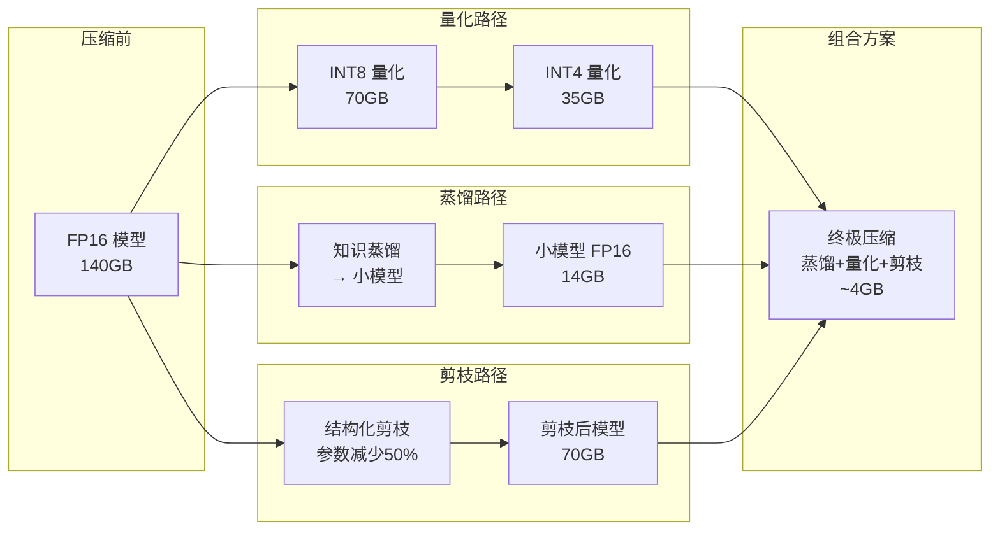
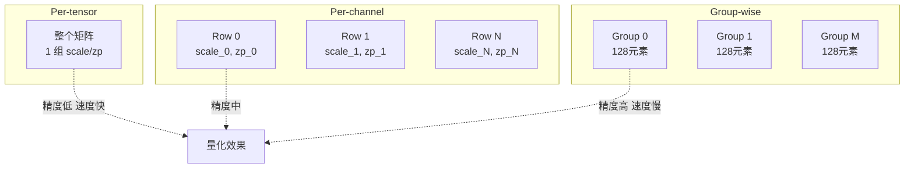
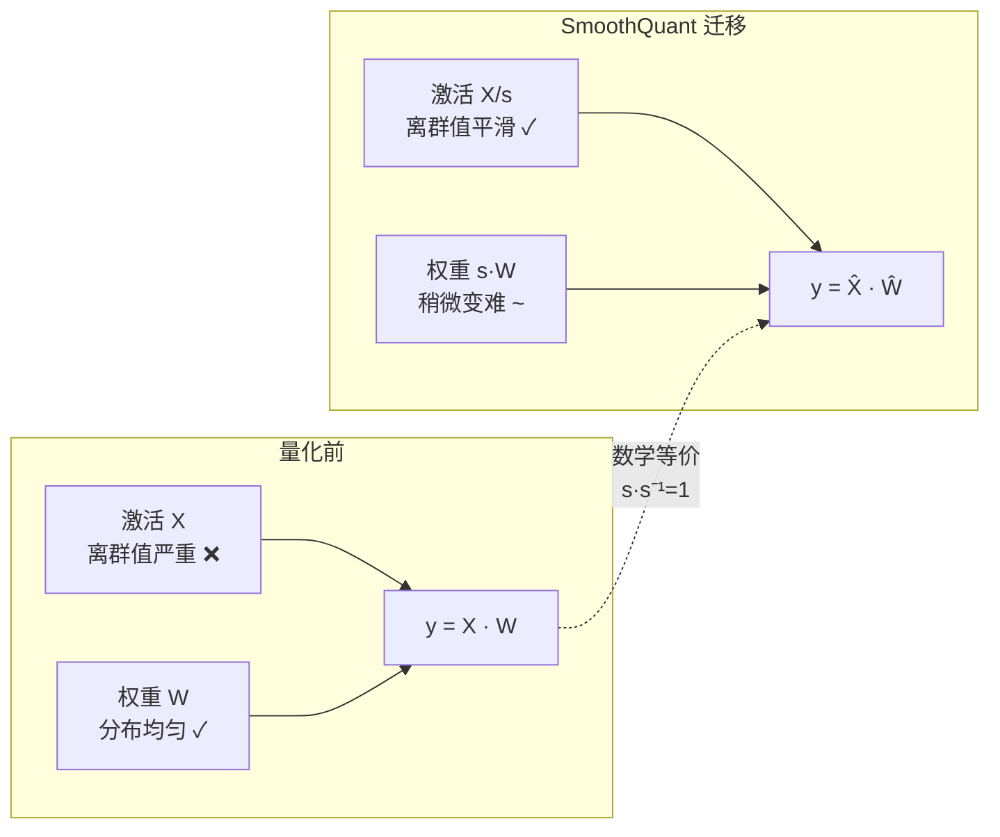
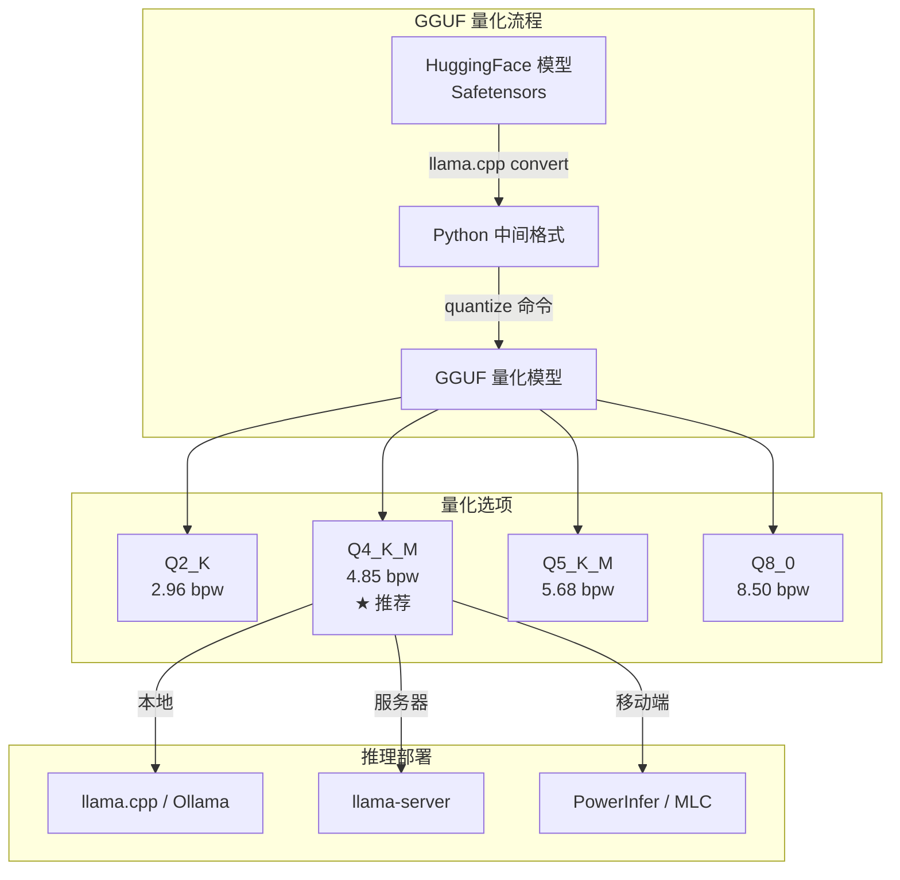
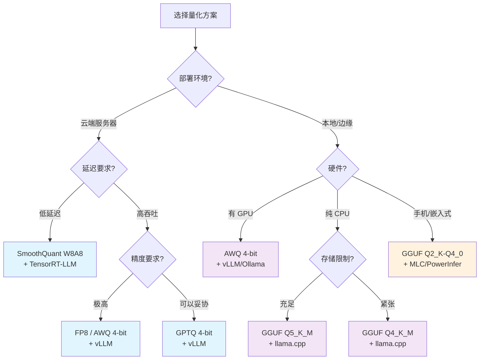
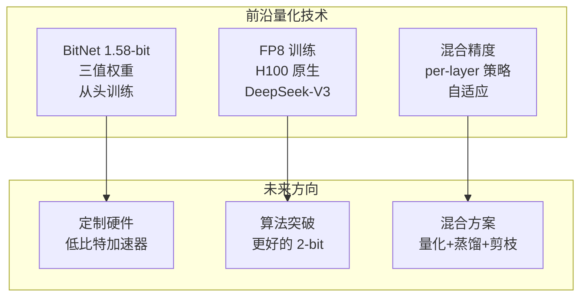

# LLM 量化技术深度解析 2026

> **一句话理解**: 量化是把 LLM 的"高精度浮点体重"压缩成"低精度整数身材"——就像把 4K 视频压成 1080p，肉眼几乎看不出差别，但文件小了 4 倍，播放速度快了 3 倍。

---

## 目录

1. [量化基础理论](#1-量化基础理论)
2. [Post-Training Quantization (PTQ)](#2-post-training-quantization-ptq)
3. [Quantization-Aware Training (QAT)](#3-quantization-aware-training-qat)
4. [FP8 训练与推理](#4-fp8-训练与推理)
5. [量化方法对比](#5-量化方法对比)
6. [实战指南](#6-实战指南)
7. [前沿进展](#7-前沿进展)
8. [参考资料与交叉引用](#8-参考资料与交叉引用)

---

## 1. 量化基础理论

### 1.1 为什么需要量化

```
LLM 部署的核心瓶颈
═══════════════════════════════════════════════════════════════════

模型规模 vs 硬件限制的矛盾:
───────────────────────────────────────────────────────────────────

Llama 3.1 405B (FP16):
  参数量: 405B × 2 bytes = 810 GB 显存
  需要: 10+ 张 A100-80GB
  成本: $150,000+ 硬件 / $50/hr 云

量化后 (4-bit):
  参数量: 405B × 0.5 bytes = 202.5 GB
  需要: 3 张 A100-80GB
  成本: $45,000 硬件 / $15/hr 云

关键洞察:
• 模型参数存在大量冗余
• 人脑用 ~20W 功率运行，GPU 需要 700W
• 研究表明 4-bit 量化对多数任务精度损失 < 1%
```

### 1.2 浮点数格式全景

```
数值格式对比
═══════════════════════════════════════════════════════════════════

FP32 (单精度浮点): 32 bits
┌─────────┬────────────────────────┐
│ 1b sign │ 8b exp │ 23b mantissa │
│         │        │               │
└─────────┴────────────────────────┘
范围: ±3.4×10^38    精度: ~7 位十进制
用途: 训练默认格式

FP16 (半精度浮点): 16 bits
┌─────────┬──────────┬─────────────┐
│ 1b sign │ 5b exp   │ 10b mantissa│
└─────────┴──────────┴─────────────┘
范围: ±65504         精度: ~3.5 位十进制
问题: 动态范围小，容易 overflow/underflow

BF16 (Brain Float 16): 16 bits
┌─────────┬──────────┬─────────────┐
│ 1b sign │ 8b exp   │ 7b mantissa │
└─────────┴──────────┴─────────────┘
范围: ±3.4×10^38     精度: ~2.4 位十进制
优势: 与 FP32 同范围，训练更稳定

FP8 E4M3: 8 bits
┌─────────┬──────────┬─────────────┐
│ 1b sign │ 4b exp   │ 3b mantissa │
└─────────┴──────────┴─────────────┘
范围: ±448           精度: ~1 位十进制
用途: 前向传播 (forward pass)

FP8 E5M2: 8 bits
┌─────────┬──────────┬─────────────┐
│ 1b sign │ 5b exp   │ 2b mantissa │
└─────────┴──────────┴─────────────┘
范围: ±57344         精度: ~0.7 位十进制
用途: 反向传播 (backward pass)

INT8 (8位整数): 8 bits
┌─────────┬─────────────────────────┐
│ 1b sign │ 7b magnitude            │
└─────────┴─────────────────────────┘
范围: -128 ~ 127 (有符号)
特点: 均匀分布，无小数

INT4 (4位整数): 4 bits
范围: -8 ~ 7 (有符号)
特点: 极低精度，需要巧妙量化策略

NF4 (NormalFloat 4-bit): 4 bits
┌──────────────────────────────────────────────────────────┐
│ 非均匀量化，基于正态分布优化                              │
│ 量化级别: {-1.0, -0.6962, -0.5251, -0.3949, -0.2844,   │
│            -0.1848, -0.0911, 0.0, 0.0796, 0.1609,       │
│             0.2461, 0.3379, 0.4407, 0.5626, 0.7230, 1.0}│
│                                                          │
│ 核心: 预训练权重近似正态分布 → NF4 信息论最优             │
└──────────────────────────────────────────────────────────┘
```

#### 格式对比表

| 格式 | 比特数 | 动态范围 | 精度 | 内存占用 (70B 模型) | 主要用途 |
|------|--------|----------|------|---------------------|----------|
| FP32 | 32 | ±3.4×10^38 | ~7 位 | 280 GB | 训练 |
| FP16 | 16 | ±65504 | ~3.5 位 | 140 GB | 训练/推理 |
| BF16 | 16 | ±3.4×10^38 | ~2.4 位 | 140 GB | 训练/推理 |
| FP8 E4M3 | 8 | ±448 | ~1 位 | 70 GB | H100 推理 |
| FP8 E5M2 | 8 | ±57344 | ~0.7 位 | 70 GB | 反向传播 |
| INT8 | 8 | -128~127 | 整数 | 70 GB | W8A8 量化 |
| INT4 | 4 | -8~7 | 整数 | 35 GB | 权重量化 |
| NF4 | 4 | 归一化 | 非均匀 | 35 GB | QLoRA/BNB |

### 1.3 量化 vs 蒸馏 vs 剪枝

```
模型压缩三大流派
═══════════════════════════════════════════════════════════════════

┌──────────────────────────────────────────────────────────────────┐
│                     模型压缩技术全景                                │
├──────────────────┬──────────────────┬────────────────────────────┤
│     量化          │     蒸馏          │     剪枝                    │
│  (Quantization)  │  (Distillation)  │  (Pruning)                 │
├──────────────────┼──────────────────┼────────────────────────────┤
│ 降低数值精度      │ 大模型教小模型    │ 删除不重要的连接/参数       │
│ FP16→INT8/INT4   │ Teacher→Student  │ 结构化/非结构化              │
├──────────────────┼──────────────────┼────────────────────────────┤
│ 类比:            │ 类比:            │ 类比:                       │
│ 4K视频→1080p     │ 教授→学生传承    │ 修剪树枝让树更紧凑          │
├──────────────────┼──────────────────┼────────────────────────────┤
│ 优点:            │ 优点:            │ 优点:                       │
│ • 通用性强        │ • 可跨架构       │ • 模型真正变小              │
│ • 即插即用        │ • 可能超越学生   │ • 推理加速明显              │
│ • 硬件加速支持好  │   原始能力       │ • 可与量化叠加              │
├──────────────────┼──────────────────┼────────────────────────────┤
│ 缺点:            │ 缺点:            │ 缺点:                       │
│ • 极限精度有损    │ • 需要训练       │ • 非结构化需特殊硬件        │
│ • 不能减少参数数量│ • 需要大模型     │ • 结构化可能损精度          │
│                  │ • 训练成本高     │ • 恢复精度需微调            │
├──────────────────┼──────────────────┼────────────────────────────┤
│ 代表:            │ 代表:            │ 代表:                       │
│ GPTQ, AWQ, GGUF  │ DistilBERT,      │ SparseGPT, Wanda,          │
│ SmoothQuant, NF4  │ TinyLlama        │ LLM-Pruner                 │
└──────────────────┴──────────────────┴────────────────────────────┘

最佳实践: 三者可以叠加使用!
───────────────────────────────────────────────────────────────────
Llama 3.1 405B → 蒸馏为 8B → 4-bit 量化 → 结构化剪枝
最终: 手机上跑的 "小 Llama"
```



### 1.4 量化误差来源

```
量化误差的三大来源
═══════════════════════════════════════════════════════════════════

1. 舍入误差 (Rounding Error)
───────────────────────────────────────────────────────────────────
原始值: 0.123456789
量化到 INT8 (scale=0.01): round(0.123456789 / 0.01) = 12
反量化: 12 × 0.01 = 0.12
误差: |0.123456789 - 0.12| = 0.003456789

累积效应:
  Layer 1: error_1 = 0.003
  Layer 2: error_2 = f(error_1) + 0.004  (误差被放大!)
  Layer 80: error_80 ≈ 可能显著

2. 离群值 (Outliers)
───────────────────────────────────────────────────────────────────
权重/激活分布中的极端值:

正常分布:           含离群值分布:
    ╱╲                  ╱╲
   ╱  ╲                ╱  ╲        ← 离群值!
  ╱    ╲              ╱    ╲      |
 ╱      ╲            ╱      ╲    |
╱________╲          ╱________╲___|___
-3  0  +3           -3  0  +3   +120

问题: 一个 +120 的离群值会:
  • 拉大量化 scale
  • 压缩正常值的表示精度
  • 导致大量正常值被量化到同一级别

LLM 特有现象: 某些 channel 的激活值出现 100x 正常范围的离群值!
  (Liu et al., 2023 - "LLM.int8()")

3. 激活分布不均匀 (Non-uniform Activation Distribution)
───────────────────────────────────────────────────────────────────
不同 token 的激活值方差差异巨大:

Token "the": activations = [0.1, 0.2, 0.15, ...]    (平稳)
Token "!!!": activations = [5.0, -3.2, 8.1, ...]    (剧烈)

统一的量化参数无法同时适应两种分布!
```

### 1.5 量化粒度: Per-tensor vs Per-channel vs Group-wise

```
量化粒度对比
═══════════════════════════════════════════════════════════════════

Per-tensor (整个张量共享一组 scale/zero-point):
───────────────────────────────────────────────────────────────────
Weight Matrix [4096 × 4096]:
  scale = (max - min) / (2^n - 1)     ← 全局一个 scale
  zero_point = round(-min / scale)

问题: 一个离群值毁掉整个矩阵的精度
效率: ★★★★★ (最快)    精度: ★★☆☆☆ (最差)

Per-channel (每个输出通道一组 scale/zero-point):
───────────────────────────────────────────────────────────────────
Weight Matrix [4096 × 4096]:
  每行有自己的 scale_i, zero_point_i  ← 4096 组参数

优势: 适应不同通道的分布差异
效率: ★★★★☆            精度: ★★★★☆

Group-wise (每 G 个元素一组 scale/zero-point):
───────────────────────────────────────────────────────────────────
Weight Matrix [4096 × 4096], group_size = 128:
  每 128 个元素共享一组 scale, zp   ← 4096×32 组参数

优势: 细粒度量化，精度接近 Per-channel
效率: ★★★☆☆            精度: ★★★★★ (最好)

典型配置:
  GPTQ: group_size = 128
  AWQ:  group_size = 128
  GGUF: group_size = 32 (K-quant)
```



---

## 2. Post-Training Quantization (PTQ)

PTQ (训练后量化) 是**无需重新训练**直接将已有模型量化的方法。只需要少量校准数据 (通常 128-512 个样本) 即可确定量化参数。

### 2.1 GPTQ: 基于二阶信息的权重量化

**论文**: "GPTQ: Accurate Post-Training Quantization for Generative Pre-trained Transformers" (Frantar et al., 2022)

```
GPTQ 核心思想
═══════════════════════════════════════════════════════════════════

类比: 搬家打包
───────────────────────────────────────────────────────────────────
朴素打包 (RTN - Round-To-Nearest):
  所有东西随便塞进箱子 → 易碎品可能碎

GPTQ 打包:
  1. 先评估每件东西的价值 (Hessian 信息)
  2. 贵重的东西用泡沫仔细包 (优先量化 + 误差补偿)
  3. 打包一件后，调整其他东西的位置 (误差传播补偿)

核心: 基于 OBS (Optimal Brain Surgeon) 理论
  "量化一个权重时，应该同时调整其他权重来补偿误差"
```

#### OBS (Optimal Brain Quantization) 理论

```python
# OBS 核心公式推导
# ═══════════════════════════════════════════════════════════════
#
# 目标: 量化权重 w_i 时，最小化输出误差
#   min_δw || δy ||² = min_δw || H^{-1} · δw ||²
#
# 其中 H 是 Hessian 矩阵 (二阶导数)
#   H = X^T X  (X 是输入激活)
#
# 当量化第 i 个权重时:
#   δw_i = quantize(w_i) - w_i  (量化误差)
#
# 最优补偿 (调整其他权重):
#   δw_j = -(δw_i / [H^{-1}]_{ii}) · [H^{-1}]_{ij}  for j ≠ i
#
# 这意味着:
#   • [H^{-1}]_{ii} 大 → 该权重不重要，量化误差影响小
#   • [H^{-1}]_{ii} 小 → 该权重重要，需要仔细补偿

class GPTQ_Quantizer:
    """GPTQ 量化的核心流程 (伪代码)"""
    
    def quantize_layer(self, W, X, bits=4, group_size=128):
        """
        W: 权重矩阵 [out_features, in_features]
        X: 校准数据输入 [batch, seq_len, in_features]
        """
        # 1. 计算 Hessian 矩阵
        H = X.T @ X  # [in_features, in_features]
        H_inv = torch.linalg.inv(H)  # 逆 Hessian
        
        # 2. 按列顺序量化 (从最重要到最不重要)
        Q = W.clone()
        for i in range(W.shape[1]):
            # 量化当前列
            scale, zero_point = compute_scale_zp(
                Q[:, i], bits, group_size
            )
            q_i = quantize_dequantize(Q[:, i], scale, zero_point)
            
            # 计算量化误差
            error = Q[:, i] - q_i
            
            # OBS 补偿: 将误差传播到剩余未量化的列
            # δw_j -= error * H_inv[i, j] / H_inv[i, i]
            Q[:, i+1:] -= error.unsqueeze(1) * (
                H_inv[i, i+1:] / H_inv[i, i]
            ).unsqueeze(0)
            
            # 存储量化后的值
            Q[:, i] = q_i
        
        return Q
```

#### GPTQ 关键特性

| 特性 | 说明 |
|------|------|
| **量化目标** | 仅权重 (Weight-only) |
| **比特数** | 4-bit / 3-bit / 2-bit |
| **量化粒度** | Group-wise (默认 group_size=128) |
| **校准数据** | 128-512 个样本 (C4/WikiText) |
| **量化时间** | Llama-7B: ~5 分钟, Llama-70B: ~4 小时 |
| **精度损失** | 4-bit: < 1% PPL 增加 (几乎无损) |
| **推理加速** | 2-4x (需专用 kernel: exllama/marlin) |

```
GPTQ 性能数据 (Llama 3.1 系列)
═══════════════════════════════════════════════════════════════════

模型             比特    PPL (WikiText2)   模型大小    推理速度
───────────────────────────────────────────────────────────────────
Llama-3.1-8B
  FP16           16      6.14             16 GB       1.0x (基准)
  GPTQ-4bit      4       6.29 (+2.4%)     4.5 GB      3.2x
  GPTQ-3bit      3       6.71 (+9.3%)     3.5 GB      3.8x
  GPTQ-2bit      2       8.92 (+45%)      2.5 GB      4.1x

Llama-3.1-70B
  FP16           16      2.97             140 GB      1.0x (基准)
  GPTQ-4bit      4       3.03 (+2.0%)     36 GB       2.8x
  GPTQ-3bit      3       3.21 (+8.1%)     27 GB       3.4x

关键发现:
• 大模型更耐量化 (70B 损失 < 8B 损失)
• 4-bit 是精度/效率的甜蜜点
• 2-bit 需要更高级的技术 (AQLM, QuIP#)
```

### 2.2 AWQ: Activation-Aware Weight Quantization

**论文**: "AWQ: Activation-Aware Weight Quantization for LLM Compression and Acceleration" (Lin et al., 2023)

```
AWQ 核心发现
═══════════════════════════════════════════════════════════════════

关键洞察:
───────────────────────────────────────────────────────────────────
权重中只有 ~1% 的 "显著通道" 对模型精度影响巨大!

权重分布 (按 channel):
Channel 0:    ████ 0.02     ← 不显著
Channel 1:    ██ 0.01       ← 不显著
Channel 2:    ████████████████████ 0.15  ← 显著! (激活值大)
Channel 3:    █ 0.005       ← 不显著
...
Channel 4095: ██████████████████ 0.12   ← 显著!

这 1% 的显著通道:
  • 对应的激活值特别大
  • 对输出的贡献远大于其他通道
  • 如果被粗糙量化，精度损失巨大

AWQ 的策略:
  1. 找到显著通道 (通过激活值的统计)
  2. 给显著通道乘以缩放因子 s > 1 (放大)
  3. 给对应激活除以 s (保持数学等价)
  4. 然后量化 → 显著通道的量化误差被缩小了 s 倍!
```

#### AWQ 数学推导

```python
# AWQ 核心数学
# ═══════════════════════════════════════════════════════════════
#
# 线性层: y = x · W
# 其中 x: [batch, seq, in_features], W: [in_features, out_features]
#
# 引入 per-channel 缩放:
#   y = (x · diag(s)^{-1}) · (diag(s) · W)
#     = (x / s) · (s * W)
#
# 量化 s * W 而不是 W:
#   Quantize(s * W) = s * W + ε    (ε 是量化误差)
#
# 反量化后:
#   y_hat = (x / s) · Quantize(s * W)
#         = (x / s) · (s * W + ε)
#         = x · W + x · ε / s
#
# 误差项: x · ε / s
#   • s 大 → 误差小 (但 x/s 的范围变大)
#   • s 小 → 误差大
#
# 最优 s 的确定 (通过激活分布):
#   s_j = mean(|x_j|)^α    (α ≈ 0.5, 经验值)
#
# 显著通道 (|x_j| 大) → s_j 大 → 量化误差被抑制

class AWQ_Quantizer:
    """AWQ 量化流程"""
    
    def find_significant_channels(self, activations):
        """通过激活统计找到显著通道"""
        # 计算每个通道的平均绝对激活值
        # activations: [num_samples, seq_len, hidden_dim]
        channel_salience = activations.abs().mean(dim=[0, 1])
        return channel_salience
    
    def compute_scales(self, salience, alpha=0.5):
        """计算 per-channel 缩放因子"""
        # s_j = salience_j ^ alpha
        scales = salience.pow(alpha)
        # 归一化
        scales = scales / scales.mean()
        return scales
    
    def quantize(self, model, calibration_data, bits=4, group_size=128):
        """AWQ 量化主流程"""
        for name, layer in model.named_modules():
            if isinstance(layer, nn.Linear):
                # 1. 收集该层的激活统计
                acts = collect_activations(layer, calibration_data)
                salience = self.find_significant_channels(acts)
                
                # 2. 计算缩放因子
                scales = self.compute_scales(salience)
                
                # 3. 缩放权重 (数学等价变换)
                layer.weight.data *= scales.unsqueeze(0)
                
                # 4. 量化缩放后的权重 (GPTQ 风格)
                quantized_weight = gptq_quantize(
                    layer.weight.data, bits, group_size
                )
                
                # 5. 存储: 量化权重 + scales
                layer.weight.data = quantized_weight
                layer.register_buffer('awq_scales', scales)
```

#### AWQ vs GPTQ 对比

| 维度 | AWQ | GPTQ |
|------|-----|------|
| **核心方法** | 激活感知缩放 + 量化 | Hessian 引导逐列量化 |
| **量化速度** | 快 (~2 min / 7B) | 慢 (~5 min / 7B) |
| **4-bit 精度** | 略优 (PPL +1.5%) | 良好 (PPL +2.4%) |
| **3-bit 精度** | 明显优于 GPTQ | 开始退化 |
| **推理引擎** | vLLM, TGI, AWQ kernel | AutoGPTQ, exllama, marlin |
| **实现复杂度** | 低 (只需统计+缩放) | 高 (需要 Hessian 逆) |
| **推荐场景** | 通用部署 | 极限压缩 (2-3 bit) |

### 2.3 SmoothQuant: W8A8 量化

**论文**: "SmoothQuant: Accurate and Efficient Post-Training Quantization for Large Language Models" (Xiao et al., 2022)

```
SmoothQuant 核心思想
═══════════════════════════════════════════════════════════════════

问题: 激活值的离群值比权重严重得多!
───────────────────────────────────────────────────────────────────

权重分布:          激活分布:
    ╱╲                 ╱╲
   ╱  ╲               ╱  ╲          ← 离群值 100x!
  ╱    ╲             ╱    ╲        |
 ╱      ╲           ╱      ╲      |
╱________╲         ╱________╲_____|___
-0.1 0  0.1       -1   0   1    120

权重量化容易 (分布均匀)
激活量化困难 (离群值极端)

SmoothQuant 的 "迁移" 策略:
───────────────────────────────────────────────────────────────────

原始: y = X · W
  X 有离群值 → 量化 X 很难
  W 很平滑   → 量化 W 很容易

迁移后: y = (X · diag(s)^{-1}) · (diag(s) · W)
         = X_smooth · W_hard
  X_smooth = X / s  → 离群值被压缩 → 量化 X 变容易
  W_hard = s · W    → 变得不平滑   → 量化 W 变难一些

但关键: 激活量化难度的降低 > 权重量化难度的增加!

最优迁移因子:
  s_j = max(|X_j|)^α / max(|W_j|)^(1-α)    (α ≈ 0.5)
  平衡两者的量化难度
```



#### SmoothQuant 与 TensorRT-LLM

```python
# SmoothQuant + TensorRT-LLM 部署流程
# ═══════════════════════════════════════════════════════════════

# Step 1: 计算 SmoothQuant 缩放因子
from smoothquant import calibrate

# 用校准数据集计算 per-channel 缩放因子
act_scales = calibrate(
    model=model,
    dataloader=calibration_loader,
    num_samples=512,
    alpha=0.5  # 迁移强度
)

# Step 2: 应用缩放并量化
from smoothquant import smooth_quantize

quantized_model = smooth_quantize(
    model,
    act_scales,
    w_bits=8,   # 权重 8-bit
    a_bits=8    # 激活 8-bit
)

# Step 3: 导出 TensorRT-LLM 引擎
# 参考: ./TensorRT_LLM_Deep_Dive.md
trt_llm_engine = build_trt_engine(
    quantized_model,
    use_smooth_quant=True,
    int8_mode=True
)

# 性能 (Llama-70B, H100):
#   FP16:     3,200 tok/s, 140 GB 显存
#   W8A8 SQ:  5,800 tok/s,  72 GB 显存  (1.8x 加速, 50% 省存)
```

### 2.4 GGUF: GPT-Generated Unified Format

GGUF 是 llama.cpp 生态的量化格式标准，支持多种量化策略，是目前本地/边缘部署最流行的格式。

```
GGUF 量化格式全景
═══════════════════════════════════════════════════════════════════

命名规则:
───────────────────────────────────────────────────────────────────
Q{bits}_{variant}

bits: 量化比特数 (2-8)
variant:
  _0:   基础量化 (super-block 共享 scale)
  _1:   增加 min_scale (更精细)
  _K:   K-quant (重要性加权量化)
  _K_S: K-quant Small (较少重要层用高精度)
  _K_M: K-quant Medium (平衡)
  _K_L: K-quant Large (更多层用高精度)

常用格式对比:
───────────────────────────────────────────────────────────────────
格式       bpw*    大小(7B)   PPL损失   速度    推荐场景
Q2_K       2.96    2.7 GB    +1.8      快      极限压缩
Q3_K_M     3.91    3.3 GB    +0.8      快      低存储
Q4_0       4.50    3.8 GB    +0.6      最快    快速部署
Q4_K_M     4.85    4.1 GB    +0.3      快      ★ 最佳性价比
Q5_K_M     5.68    4.7 GB    +0.15     中      高精度
Q6_K       6.56    5.4 GB    +0.08     中      接近原始
Q8_0       8.50    7.0 GB    +0.02     慢      参考精度

*bpw = bits per weight (实际每权重比特数，含 scale/overhead)
```

#### K-quant 改进详解

```
K-quant vs 传统量化的区别
═══════════════════════════════════════════════════════════════════

传统量化 (Q4_0):
───────────────────────────────────────────────────────────────────
Super-block (256 weights):
  [block0: 32w | scale_0] [block1: 32w | scale_1] ... [block7: 32w | scale_7]
                                                         ↑ 全局一个 super_scale

所有权重同等对待，不管是否重要。

K-quant (Q4_K_M):
───────────────────────────────────────────────────────────────────
核心改进:
  1. 重要性加权: 不同权重对输出的影响不同
     → attention 层的 out_proj 更重要
     → FFN 的 gate_proj 更重要
     → 重要层用更多比特

  2. 改进的 scale 编码:
     Super-block (256 weights):
       [block0: 32w | scale_0 + min_0] [block1: 32w | scale_1 + min_1] ...
       ↑ 每个 block 有独立的 scale AND min 值
       ↑ 6-bit scale + 6-bit min (更精细)

  3. 混合精度策略 (以 Q4_K_M 为例):
     ┌─────────────────────────────────────────────────┐
     │ Attention.wv:    6-bit (重要! 影响 value 表示)   │
     │ Attention.wo:    6-bit (重要! 输出投影)          │
     │ FFN.gate_proj:   4-bit (不太重要)               │
     │ FFN.up_proj:     4-bit (不太重要)               │
     │ FFN.down_proj:   6-bit (重要! 最终输出)          │
     │ 其他:            4-bit                          │
     └─────────────────────────────────────────────────┘
```



### 2.5 bitsandbytes (BNB): NF4 与 LLM.int8()

bitsandbytes 是 HuggingFace Transformers 原生支持的量化库，提供两种核心量化方案。

#### LLM.int8(): 混合精度分解

```
LLM.int8() 核心思想
═══════════════════════════════════════════════════════════════════

问题: 激活离群值让 INT8 量化失败
───────────────────────────────────────────────────────────────────
正常 token: 激活范围 [-2, +2] → INT8 量化 OK
离群 token: 激活范围 [-120, +120] → INT8 精度崩溃!

LLM.int8() 的混合精度分解:
───────────────────────────────────────────────────────────────────

Step 1: 检测离群值通道
  对每个 hidden state，找出绝对值 > 阈值 的 channel
  threshold = 6.0 (经验值)

Step 2: 分离计算
  ┌─────────────────────────────────────────────────────┐
  │ 输入 X:                                              │
  │   X_normal: 正常通道 → INT8 量化 → INT8 矩阵乘       │
  │   X_outlier: 离群通道 → FP16 保持 → FP16 矩阵乘      │
  │                                                      │
  │ y = INT8_mm(X_normal, W_normal)                      │
  │   + FP16_mm(X_outlier, W_outlier)                    │
  └─────────────────────────────────────────────────────┘

Step 3: 结果合并
  将 INT8 和 FP16 的结果相加得到最终输出

效果:
  • 99%+ 的计算用 INT8 (高效)
  • <1% 的离群值用 FP16 (精确)
  • 总体: 接近 FP16 精度 + INT8 速度
```

#### NF4 (NormalFloat 4-bit)

```
NF4: 信息论最优的 4-bit 量化格式
═══════════════════════════════════════════════════════════════════

核心洞察:
───────────────────────────────────────────────────────────────────
预训练权重近似服从 N(0, σ²) 正态分布

均匀 INT4: 16 个量化级别均匀分布
  [-8, -7, -6, -5, -4, -3, -2, -1, 0, 1, 2, 3, 4, 5, 6, 7]
  
  问题: 正态分布中，大量值集中在 [-1σ, +1σ]
        但 INT4 在这个区间只有 4 个级别!
        而尾部 [-3σ, +3σ] 很少有值，却分配了级别

NF4: 基于正态分布 CDF 的非均匀量化
  16 个级别按照正态分布的分位数分布:
  
  NF4 levels (归一化后):
  [-1.0, -0.6962, -0.5251, -0.3949, -0.2844, -0.1848, 
   -0.0911, 0.0, 0.0796, 0.1609, 0.2461, 0.3379, 
    0.4407, 0.5626, 0.7230, 1.0]
  
  特点:
  • 中心密集: [-0.3, +0.3] 区间有 8 个级别 (高精度)
  • 尾部稀疏: 两端各 4 个级别
  • 信息论最优: 对正态分布数据，NF4 的量化误差最小

NF4 vs INT4 量化误差对比:
───────────────────────────────────────────────────────────────────
分布:     ▁▂▃▅▇█▇▅▃▂▁  (正态)
INT4 误差: ████████████  (均匀 0.0625)
NF4 误差:  ▁▁▂▁▁▁▁▁▂▁▁  (中心几乎为 0)

整体 MSE:
  INT4: 0.0833 (均匀量化理论值)
  NF4:  0.0416 (降低 50%!)
```

```python
# QLoRA 4-bit 加载 (NF4 + Double Quantization)
# 参考: ../05_NLP_LLMs/Fine_tuning_Techniques/PEFT_2026/PEFT_2026.md
# ═══════════════════════════════════════════════════════════════

from transformers import AutoModelForCausalLM, BitsAndBytesConfig

# 4-bit 量化配置
bnb_config = BitsAndBytesConfig(
    load_in_4bit=True,
    bnb_4bit_quant_type="nf4",           # 使用 NF4 格式
    bnb_4bit_compute_dtype=torch.bfloat16, # 计算时用 BF16
    bnb_4bit_use_double_quant=True,       # 双重量化 (量化 scale)
)

# Double Quantization 原理:
# 1. 权重用 NF4 量化 (4-bit)
# 2. NF4 的 scale 本身也用 8-bit 量化
# 3. 额外节省 ~0.37 bit/weight
#
# 总 bpw: 4.0 + 0.37 = ~4.37 bits/weight
# vs 标准 4-bit: 4.0 + 0.5 = ~4.5 bits/weight

# 加载模型
model = AutoModelForCausalLM.from_pretrained(
    "meta-llama/Llama-3.1-8B",
    quantization_config=bnb_config,
    device_map="auto",
)

# 配合 LoRA 微调
from peft import get_peft_model, LoraConfig

lora_config = LoraConfig(
    r=16,
    lora_alpha=32,
    target_modules=["q_proj", "v_proj", "k_proj", "o_proj"],
    lora_dropout=0.05,
)
model = get_peft_model(model, lora_config)
model.print_trainable_parameters()
# 输出: trainable params: 4,194,304 || all params: 8,004,581,376 || trainable%: 0.0524
# 显存占用: ~6 GB (vs FP16 的 ~16 GB)
```

### 2.6 SqueezeLLM: 非均匀量化 + Huffman 编码

**论文**: "SqueezeLLM: Efficient and Flexible LLM Quantization with Non-uniform Quantization and Huffman Coding" (Kim et al., 2024)

```
SqueezeLLM 核心方法
═══════════════════════════════════════════════════════════════════

问题: 均匀量化的 INT4 对非均匀分布的权重不是最优的

SqueezeLLM 的解决方案:
───────────────────────────────────────────────────────────────────
1. 分析权重分布，找到最优的非均匀量化码本
   使用 k-means 聚类找到 16 个最优的量化中心点 (4-bit)

2. 分配 Huffman 编码:
   高频值 → 短编码 (如: 00, 01)
   低频值 → 长编码 (如: 1110, 1111)
   
   例:
   值:    0.0   0.1   0.2   -0.1   0.5   ...
   频率:  35%   25%   15%    10%    5%   ...
   编码:  0     10    110   1110   11110 ...
   
   平均编码长度: 0.35×1 + 0.25×2 + 0.15×3 + ... ≈ 2.1 bits
   vs 固定 4-bit: 节省 ~47%!

3. 结合 sensitivity-aware 训练:
   对量化敏感的权重额外保护

压缩效果:
  Llama-2-7B:
    FP16:    14.0 GB
    GPTQ-4:   3.8 GB  (PPL 5.72)
    Squeeze:  3.2 GB  (PPL 5.68)  ← 更小且更准!
```

### 2.7 QuIP#: 残差向量量化

**论文**: "QuIP#: Even Better LLM Quantization with Residual Vector Quantization" (Chee et al., 2024)

```
QuIP# 核心方法
═══════════════════════════════════════════════════════════════════

残差向量量化 (Residual Vector Quantization):
───────────────────────────────────────────────────────────────────

传统标量量化: 每个权重独立量化
  w_i → q_i (一个量化值)

QuIP# 向量量化:
  1. 将权重分成小组 (如 2 个一组): v = [w_1, w_2]
  2. 第一级量化: v → c_1 (最近的码字)
  3. 计算残差: r_1 = v - c_1
  4. 第二级量化: r_1 → c_2 (残差的最近码字)
  5. 重构: v_hat = c_1 + c_2

可视化 (2D):
           w_2
            ↑
        c_2 ●─────┐
           /       │ 残差
      c_1 ●        │
         /         │
   origin ●───────→ w_1

优势:
  • 两级量化比单级精度更高
  • 码本可以共享，存储效率高
  • 2-bit 级别也能保持不错精度

性能 (Llama-2-70B, 2-bit):
  QuIP# 2-bit: PPL 3.85  (vs FP16: 3.32)
  GPTQ  2-bit: PPL 5.41  (QuIP# 显著优于 GPTQ!)
```

### 2.8 AQLM: Additive Quantization for LLMs

**论文**: "AQLM: Additive Quantization for LLMs" (Egiazarian et al., 2024)

```
AQLM 核心方法
═══════════════════════════════════════════════════════════════════

Additive Quantization = 多个码本叠加
───────────────────────────────────────────────────────────────────

传统 VQ (Vector Quantization):
  权重向量 → 1 个码本 → 1 个码字
  精度受限

AQLM:
  权重向量 → M 个码本 → M 个码字相加
  
  w ≈ c_1 + c_2 + ... + c_M
  其中 c_i 来自第 i 个码本

类比:
  传统: 用 1 根笔描画 → 只能画粗线条
  AQLM: 用 M 根笔叠加 → 可以画出精细图案

配置示例:
  AQLM 2-bit: 8 个码本, 每个 256 个码字
    → 2^8 = 256 种组合 ≈ 8-bit 等效精度
    → 但存储只需 2 bits/weight

性能:
  Llama-2-7B:
    AQLM 2-bit: PPL 5.92  (优于 QuIP# 6.12)
    AQLM 3-bit: PPL 5.48  (接近 GPTQ 4-bit!)
    
  Llama-2-70B:
    AQLM 2-bit: PPL 3.68  (仅比 FP16 高 11%)
```

```mermaid
graph TB
    subgraph PTQ 方法谱系
        direction TB
        W4[4-bit 权重量化]
        W3[3-bit 权重量化]
        W2[2-bit 权重量化]
        W8A8[W8A8 全量化]
    end
    
    subgraph 4-bit 方法
        GPTQ4[GPTQ 4-bit<br/>Hessian 引导]
        AWQ4[AWQ 4-bit<br/>激活感知]
        GGUF4[GGUF Q4_K_M<br/>K-quant]
        NF4[NF4<br/>正态优化]
    end
    
    subgraph 2-3 bit 方法
        QUIP[QuIP#<br/>残差 VQ]
        AQLM[AQLM<br/>加性量化]
        SQZ[SqueezeLLM<br/>Huffman]
    end
    
    subgraph W8A8 方法
        SQ[SmoothQuant<br/>迁移量化]
        LLM8[LLM.int8()<br/>混合精度]
    end
    
    W4 --> GPTQ4 & AWQ4 & GGUF4 & NF4
    W3 --> GPTQ4 & SQZ
    W2 --> QUIP & AQLM & SQZ
    W8A8 --> SQ & LLM8
```

---

## 3. Quantization-Aware Training (QAT)

### 3.1 QAT 核心思想

```
PTQ vs QAT
═══════════════════════════════════════════════════════════════════

PTQ (训练后量化):
───────────────────────────────────────────────────────────────────
预训练模型 → 直接量化 → 部署
  优点: 快速、简单
  缺点: 精度可能损失 (尤其低比特)

QAT (量化感知训练):
───────────────────────────────────────────────────────────────────
预训练模型 → 插入量化模拟节点 → 继续训练/微调 → 部署
  优点: 精度更好 (模型学会了适应量化误差)
  缺点: 需要训练 (GPU 时间 + 数据)

QAT 训练过程中的量化模拟:
───────────────────────────────────────────────────────────────────

前向传播:
  x → FakeQuantize → x_q (模拟量化后的值)
  
  FakeQuantize(x) = round(x / scale) × scale
                    ↑ 离散化 (不可导!)

反向传播:
  问题: round() 函数梯度为 0 (无法训练!)
  解决: Straight-Through Estimator (STE)
  
  STE: 反向传播时，假装量化没有发生
    ∂L/∂x = ∂L/∂x_q × 1   (梯度直通)
    
  ┌──────────────────────────────────────────────────┐
  │ Forward:  x → quantize → dequantize → x_q       │
  │ Backward: ∂L/∂x = ∂L/∂x_q  (梯度直接传过去)     │
  └──────────────────────────────────────────────────┘
```

### 3.2 STE (Straight-Through Estimator) 详解

```python
# STE 实现 (PyTorch)
# ═══════════════════════════════════════════════════════════════

class FakeQuantize(torch.autograd.Function):
    """量化模拟 + STE 梯度"""
    
    @staticmethod
    def forward(ctx, x, scale, zero_point, qmin, qmax):
        # 前向: 模拟量化 + 反量化
        x_int = torch.clamp(
            torch.round(x / scale) + zero_point,
            qmin, qmax
        )
        x_fake = (x_int - zero_point) * scale
        # x_fake ≈ x 但有量化噪声
        return x_fake
    
    @staticmethod
    def backward(ctx, grad_output):
        # 反向: STE - 梯度直通
        # 忽略 round() 的不可导性
        return grad_output, None, None, None, None
        #      ↑ 对 x 的梯度 = 上游梯度 (直通)


class QATLinear(nn.Module):
    """QAT 线性层: 训练时模拟量化"""
    
    def __init__(self, in_features, out_features, bits=8):
        super().__init__()
        self.weight = nn.Parameter(torch.randn(out_features, in_features))
        self.bias = nn.Parameter(torch.zeros(out_features))
        self.bits = bits
        
        # 量化参数 (训练中可学习)
        self.weight_scale = nn.Parameter(torch.ones(out_features, 1))
        self.weight_zp = nn.Parameter(torch.zeros(out_features, 1))
    
    def forward(self, x):
        if self.training:
            # 训练: 使用 FakeQuantize (STE)
            w_q = FakeQuantize.apply(
                self.weight, self.weight_scale, self.weight_zp,
                -(2**(self.bits-1)), 2**(self.bits-1) - 1
            )
            return F.linear(x, w_q, self.bias)
        else:
            # 推理: 真正的量化
            w_int = torch.round(self.weight / self.weight_scale) + self.weight_zp
            w_int = w_int.clamp(-(2**(self.bits-1)), 2**(self.bits-1) - 1)
            w_q = (w_int - self.weight_zp) * self.weight_scale
            return F.linear(x, w_q, self.bias)
```

### 3.3 FP8 QAT: H100 原生加速

```
FP8 QAT 训练流程
═══════════════════════════════════════════════════════════════════

H100 的 FP8 Tensor Core 提供 2x 计算吞吐 (vs FP16)
但直接用 FP8 训练会不稳定

FP8 QAT 策略:
───────────────────────────────────────────────────────────────────

1. 混合精度训练:
   前向: FP8 E4M3 (4位指数 + 3位尾数, 精度高)
   反向: FP8 E5M2 (5位指数 + 2位尾数, 范围大)
   权重更新: FP32 累加 (防止精度损失)

2. Delayed Scaling (延迟缩放):
   ┌─────────────────────────────────────────────────────────────┐
   │ Step t:                                                     │
   │   scale_t = f(amax_history[t-k:t])                          │
   │   ↑ 使用前 k 步的最大绝对值来确定当前步的缩放因子            │
   │   ↑ 避免当前步的离群值导致缩放不稳定                        │
   └─────────────────────────────────────────────────────────────┘

3. Per-tensor Delayed Scaling:
   每个 tensor 维护独立的缩放因子
   amax 历史窗口: 通常 16 步

训练效果 (Llama-3.1-70B):
  FP16 训练:    PPL 2.97, 训练时间 100%
  FP8 QAT:      PPL 2.99, 训练时间 55% (几乎无损失!)
  FP8 PTQ:      PPL 3.12, 训练时间 0% (有可见损失)
```

---

## 4. FP8 训练与推理

### 4.1 FP8 格式详解

```
FP8 E4M3 vs E5M2
═══════════════════════════════════════════════════════════════════

E4M3 (4位指数 + 3位尾数):
┌───┬────────┬───────┐
│ S │ E E E E│ M M M │
└───┴────────┴───────┘
指数偏置: 7
范围: ±448
精度: 3 位尾数 → ~1 位十进制有效数字
最小正数: 2^(-9) ≈ 0.00195
特点: 精度高, 范围小 → 适合前向传播

E5M2 (5位指数 + 2位尾数):
┌───┬──────────┬──────┐
│ S │ E E E E E│ M M  │
└───┴──────────┴──────┘
指数偏置: 15
范围: ±57344
精度: 2 位尾数 → ~0.7 位十进制有效数字
最小正数: 2^(-16) ≈ 1.5×10^(-5)
特点: 范围大, 精度低 → 适合反向传播 (梯度范围大)

为什么前向用 E4M3，反向用 E5M2?
───────────────────────────────────────────────────────────────────
前向传播:
  • 激活值范围相对集中
  • 需要更高的精度来保持输出质量
  → E4M3 (精度高, 范围小)

反向传播:
  • 梯度可能出现很大的值 (梯度爆炸)
  • 也需要很小的值 (梯度消失)
  → E5M2 (范围大, 精度低)
```

### 4.2 硬件支持

| 硬件 | FP8 支持 | FP8 算力 | 备注 |
|------|----------|----------|------|
| NVIDIA H100 | 原生 | 3,958 TFLOPS | Transformer Engine |
| NVIDIA H200 | 原生 | 3,958 TFLOPS | HBM3e 带宽优势 |
| NVIDIA Ada (RTX 4090) | 原生 | 660 TFLOPS | 消费级 FP8 |
| NVIDIA B200 | 原生 | ~9,000 TFLOPS | Blackwell 架构 |
| AMD MI300X | 原生 | 5,300 TFLOPS | ROCm FP8 |
| Intel Gaudi 3 | 原生 | 3,700 TFLOPS | Habana FP8 |
| Google TPU v5p | 原生 | 2,300 TFLOPS | bfloat8 |

### 4.3 DeepSeek-V3 FP8 训练实践

```
DeepSeek-V3 FP8 混合精度训练
═══════════════════════════════════════════════════════════════════

DeepSeek-V3 (671B MoE) 是全球首个大规模 FP8 训练的模型

训练配置:
───────────────────────────────────────────────────────────────────
• 线性层前向/反向: FP8 (E4M3/E5M2)
• Attention 计算: BF16
• 权重更新: FP32 累加
• Embedding 层: BF16 (对量化敏感)
• LayerNorm: BF16

FP8 训练节省:
───────────────────────────────────────────────────────────────────
计算加速:  1.5-2x (FP8 Tensor Core 更快)
显存节省:  ~30% (激活值用 FP8 存储)
训练成本:  降低 ~40%

关键技术:
───────────────────────────────────────────────────────────────────
1. Fine-grained Mixed Precision:
   不同层/操作选择不同精度
   ┌─────────────────────────────────────────────────┐
   │ MoE Expert 线性层: FP8  (专家计算量大, 加速多)  │
   │ Shared Expert:        BF16 (共享专家需要精度)   │
   │ Attention:            BF16 (对量化最敏感)       │
   │ Output Head:          BF16 (最终输出需要精度)    │
   └─────────────────────────────────────────────────┘

2. Block-wise FP8 GEMM:
   将矩阵分块 (如 128×128)，每块独立缩放
   比 per-tensor 缩放精度高 2-3x

3. 在线量化 (Online Quantization):
   不预计算 scale，而是实时跟踪 amax
   使用 hardware-friendly 的 power-of-2 scaling
```

### 4.4 FP8 GEMM 内核优化

```python
# FP8 GEMM 推理示例 (使用 Transformer Engine)
# ═══════════════════════════════════════════════════════════════

import transformer_engine.pytorch as te

# FP8 线性层 (自动处理缩放)
fp8_linear = te.Linear(
    in_features=4096,
    out_features=4096,
    bias=True,
)

# 配置 FP8 训练/推理
fp8_format = te.recipe.Format.HYBRID  # E4M3 前向 + E5M2 反向
fp8_recipe = te.recipe.DelayedScaling(
    margin=0,
    interval=1,             # 每步更新缩放因子
    fp8_format=fp8_format,
    amax_history_len=16,    # 16 步历史窗口
    amax_compute_algo="max",
)

# 推理循环
with te.fp8_autocast(enabled=True, fp8_recipe=fp8_recipe):
    output = fp8_linear(input_tensor)

# 性能对比 (H100, 4096×4096 GEMM):
#   FP16 GEMM: 0.045 ms
#   FP8 GEMM:  0.023 ms  (1.96x 加速!)
#   精度差异:  < 0.1% (几乎无感)
```

---

## 5. 量化方法对比

### 5.1 综合对比表

| 方法 | 比特数 | 类型 | 量化目标 | 速度提升 | 精度损失 | 量化工具 | 推理引擎 |
|------|--------|------|----------|----------|----------|----------|----------|
| **GPTQ** | 4/3/2 | PTQ-W | 权重 | 2-4x | 低-中 | AutoGPTQ | exllama, marlin, vLLM |
| **AWQ** | 4/3 | PTQ-W | 权重 | 2-4x | 低 | AutoAWQ | vLLM, TGI, AWQ kernel |
| **SmoothQuant** | W8A8 | PTQ-WA | 权重+激活 | 1.5-2x | 极低 | SmoothQuant | TensorRT-LLM |
| **GGUF Q4_K_M** | 4.85 | PTQ-W | 权重 | 2-3x | 低 | llama.cpp | llama.cpp, Ollama |
| **GGUF Q8_0** | 8.5 | PTQ-W | 权重 | 1.5x | 极低 | llama.cpp | llama.cpp |
| **NF4 (BNB)** | 4 | PTQ-W | 权重 | 2-3x | 低 | bitsandbytes | Transformers |
| **LLM.int8()** | W8A8 | PTQ-WA | 权重+激活 | 1.5-2x | 极低 | bitsandbytes | Transformers |
| **FP8** | 8 | QAT/PTQ | 权重+激活 | 2x | 极低 | Transformer Engine | TensorRT-LLM, vLLM |
| **SqueezeLLM** | 3-4 | PTQ-W | 权重 | 2-3x | 低 | SqueezeLLM | 自定义 kernel |
| **QuIP#** | 2-4 | PTQ-W | 权重 | 2-4x | 低-中 | QuIP# | 自定义 kernel |
| **AQLM** | 2-3 | PTQ-W | 权重 | 2-4x | 中 | AQLM | 自定义 kernel |

### 5.2 精度-效率帕累托分析

```
精度 vs 效率帕累托前沿
═══════════════════════════════════════════════════════════════════

PPL (越低越好)
 ↑
 │  ★ FP16 (基准)
 │    ☆ FP8 (几乎重叠)
 │      ◇ SmoothQuant W8A8
 │        ◆ AWQ 4-bit
 │         ◆ GPTQ 4-bit
 │          ◆ GGUF Q4_K_M
 │            ○ NF4
 │             ◇ GGUF Q5_K_M
 │               ◆ GPTQ 3-bit
 │                 ○ GGUF Q4_0
 │                   ◆ AQLM 3-bit
 │                     ◆ QuIP# 2-bit
 │                       ○ GGUF Q2_K
 │                         ◆ GPTQ 2-bit
 └──────────────────────────────────────────→ 推理速度 (越高越好)
    1x    2x    3x    4x    5x

帕累托最优方法 (推荐):
  • 高精度需求: FP8, SmoothQuant
  • 平衡需求:   AWQ 4-bit, GPTQ 4-bit, GGUF Q5_K_M
  • 极限压缩:   GGUF Q4_K_M, QuIP# 2-bit
```

### 5.3 场景选型决策树



---

## 6. 实战指南

### 6.1 AutoGPTQ 量化模型

```python
# 使用 AutoGPTQ 量化 Llama 3.1 模型
# ═══════════════════════════════════════════════════════════════

from auto_gptq import AutoGPTQForCausalLM, BaseQuantizeConfig
from transformers import AutoTokenizer

# Step 1: 配置量化参数
quantize_config = BaseQuantizeConfig(
    bits=4,                    # 量化比特数 (2/3/4/8)
    group_size=128,            # 分组大小 (推荐 128)
    desc_act=True,             # 按激活大小排序列 (更好精度)
    damp_percent=0.01,         # Hessian 正则化
    sym=True,                  # 对称量化
    true_sequential=True,      # 真正的顺序量化 (更慢但更准)
)

# Step 2: 加载模型
model_name = "meta-llama/Llama-3.1-8B"
tokenizer = AutoTokenizer.from_pretrained(model_name)
model = AutoGPTQForCausalLM.from_pretrained(
    model_name,
    quantize_config,
    torch_dtype=torch.float16,
)

# Step 3: 准备校准数据
import random
from datasets import load_dataset

def get_calibration_data(num_samples=128, seq_len=2048):
    """从 C4 数据集中采样校准数据"""
    dataset = load_dataset("allenai/c4", split="train", streaming=True)
    samples = []
    for i, example in enumerate(dataset):
        if i >= num_samples:
            break
        text = example["text"]
        tokens = tokenizer(
            text, return_tensors="pt",
            max_length=seq_len, truncation=True
        )
        samples.append({
            "input_ids": tokens.input_ids,
            "attention_mask": tokens.attention_mask,
        })
    return samples

calibration_data = get_calibration_data()

# Step 4: 执行量化 (耗时: 7B ~5分钟, 70B ~4小时)
model.quantize(calibration_data)

# Step 5: 保存量化模型
output_dir = "./Llama-3.1-8B-GPTQ-4bit"
model.save_quantized(output_dir)
tokenizer.save_pretrained(output_dir)

# 验证:
# 原始模型大小: 16 GB
# 量化后大小:   4.5 GB (压缩 3.6x)
# PPL (WikiText2): 6.14 → 6.29 (+2.4%)
```

```bash
# 使用 vLLM 部署 GPTQ 量化模型
# 参考: ./vLLM_Deep_Dive.md
python -m vllm.entrypoints.openai.api_server \
    --model ./Llama-3.1-8B-GPTQ-4bit \
    --quantization gptq \
    --dtype float16 \
    --gpu-memory-utilization 0.9 \
    --max-model-len 8192 \
    --port 8000

# 测试推理
curl http://localhost:8000/v1/chat/completions \
    -H "Content-Type: application/json" \
    -d '{
        "model": "Llama-3.1-8B-GPTQ-4bit",
        "messages": [{"role": "user", "content": "解释什么是量化"}],
        "max_tokens": 256
    }'
```

### 6.2 AWQ 量化模型

```python
# 使用 AutoAWQ 量化模型
# ═══════════════════════════════════════════════════════════════

from awq import AutoAWQForCausalLM
from transformers import AutoTokenizer

# Step 1: 加载模型
model_path = "meta-llama/Llama-3.1-8B"
tokenizer = AutoTokenizer.from_pretrained(model_path, trust_remote_code=True)
model = AutoAWQForCausalLM.from_pretrained(
    model_path,
    safetensors=True,
    device_map="auto",
)

# Step 2: 量化
# AWQ 会自动:
#   1. 收集校准数据的激活统计
#   2. 找到显著通道
#   3. 计算缩放因子
#   4. 执行 GPTQ 风格的量化
quant_config = {
    "zero_point": True,       # 使用 zero-point
    "q_group_size": 128,      # 分组大小
    "w_bit": 4,               # 4-bit 量化
    "version": "GEMM",        # 使用 GEMM 内核
}

model.quantize(
    tokenizer,
    quant_config=quant_config,
    # 校准数据会自动从 WikiText/C4 采样
)

# Step 3: 保存
output_dir = "./Llama-3.1-8B-AWQ-4bit"
model.save_quantized(output_dir)
tokenizer.save_pretrained(output_dir)

# Step 4: 验证加载
from awq import AutoAWQForCausalLM
model_q = AutoAWQForCausalLM.from_quantized(
    output_dir,
    device_map="auto",
)

# 性能对比:
#   量化时间: ~2 分钟 (vs GPTQ 的 ~5 分钟)
#   模型大小: 4.8 GB
#   PPL (WikiText2): 6.14 → 6.23 (+1.5%)  ← 优于 GPTQ!
```

### 6.3 llama.cpp GGUF 量化流程

```bash
# llama.cpp GGUF 量化完整流程
# 参考: ./llama_cpp_Deep_Dive.md
# ═══════════════════════════════════════════════════════════════

# Step 1: 克隆并编译 llama.cpp
git clone https://github.com/ggerganov/llama.cpp
cd llama.cpp
make -j$(nproc)

# Step 2: 转换 HuggingFace 模型为 GGUF 格式
python convert_hf_to_gguf.py \
    /path/to/Llama-3.1-8B \
    --outfile llama-3.1-8b-f16.gguf \
    --outtype f16

# Step 3: 量化 (推荐 Q4_K_M)
./llama-quantize \
    llama-3.1-8b-f16.gguf \
    llama-3.1-8b-q4_k_m.gguf \
    Q4_K_M

# 所有量化选项:
# Q2_K    - 2-bit K-quant (最小, 精度损失大)
# Q3_K_S  - 3-bit K-quant Small
# Q3_K_M  - 3-bit K-quant Medium
# Q3_K_L  - 3-bit K-quant Large
# Q4_0    - 4-bit 基础 (最快)
# Q4_K_S  - 4-bit K-quant Small
# Q4_K_M  - 4-bit K-quant Medium ★ 推荐
# Q5_0    - 5-bit 基础
# Q5_K_S  - 5-bit K-quant Small
# Q5_K_M  - 5-bit K-quant Medium ★ 高精度推荐
# Q6_K    - 6-bit K-quant (接近原始)
# Q8_0    - 8-bit 基础 (参考精度)

# Step 4: 运行推理
./llama-cli \
    -m llama-3.1-8b-q4_k_m.gguf \
    -p "请解释什么是模型量化" \
    -n 256 \
    -t 8 \
    --ctx-size 4096

# Step 5: 启动 API 服务器
./llama-server \
    -m llama-3.1-8b-q4_k_m.gguf \
    --host 0.0.0.0 \
    --port 8080 \
    -c 4096 \
    -t 8
```

```
GGUF 量化结果对比 (Llama-3.1-8B)
═══════════════════════════════════════════════════════════════════

格式        大小       PPL     推理速度 (M2 Max)    推荐场景
───────────────────────────────────────────────────────────────────
F16         16.0 GB   6.14    25 tok/s            参考基准
Q8_0         8.5 GB   6.16    35 tok/s            高精度
Q6_K         6.6 GB   6.22    40 tok/s            平衡
Q5_K_M       5.7 GB   6.29    45 tok/s            ★ 高质量
Q4_K_M       4.9 GB   6.44    55 tok/s            ★★ 最佳性价比
Q4_0         4.5 GB   6.60    60 tok/s            速度优先
Q3_K_M       4.0 GB   6.92    62 tok/s            小存储
Q2_K         3.2 GB   7.94    68 tok/s            极限压缩
```

### 6.4 QLoRA 4-bit 加载与微调

```python
# QLoRA: 4-bit NF4 加载 + LoRA 微调
# 参考: ../05_NLP_LLMs/Fine_tuning_Techniques/PEFT_2026/PEFT_2026.md
# ═══════════════════════════════════════════════════════════════

import torch
from transformers import (
    AutoModelForCausalLM,
    AutoTokenizer,
    BitsAndBytesConfig,
    TrainingArguments,
)
from peft import get_peft_model, LoraConfig, prepare_model_for_kbit_training
from trl import SFTTrainer, SFTConfig

# 1. 量化配置 (NF4 + 双重量化)
bnb_config = BitsAndBytesConfig(
    load_in_4bit=True,
    bnb_4bit_quant_type="nf4",           # NormalFloat4
    bnb_4bit_compute_dtype=torch.bfloat16, # BF16 计算
    bnb_4bit_use_double_quant=True,       # 量化 scale 本身
)

# 2. 加载模型 (4-bit)
model_id = "meta-llama/Llama-3.1-8B"
tokenizer = AutoTokenizer.from_pretrained(model_id)
tokenizer.pad_token = tokenizer.eos_token

model = AutoModelForCausalLM.from_pretrained(
    model_id,
    quantization_config=bnb_config,
    device_map="auto",
    attn_implementation="flash_attention_2",  # 加速
)

# 3. 准备模型用于 k-bit 训练
model = prepare_model_for_kbit_training(model)

# 4. LoRA 配置
lora_config = LoraConfig(
    r=16,                                    # LoRA 秩
    lora_alpha=32,                           # 缩放因子
    target_modules=[                         # 目标模块
        "q_proj", "k_proj", "v_proj", "o_proj",
        "gate_proj", "up_proj", "down_proj",
    ],
    lora_dropout=0.05,
    bias="none",
    task_type="CAUSAL_LM",
)

model = get_peft_model(model, lora_config)
model.print_trainable_parameters()
# trainable params: 20,971,520 || all: 8,021,372,928 || trainable%: 0.2614

# 5. 训练
training_args = SFTConfig(
    output_dir="./llama-3.1-8b-qlora",
    num_train_epochs=3,
    per_device_train_batch_size=4,
    gradient_accumulation_steps=4,
    learning_rate=2e-4,
    bf16=True,
    logging_steps=10,
    save_strategy="epoch",
    optim="paged_adamw_8bit",  # 8-bit 优化器进一步省存
)

# 显存占用分析:
# ──────────────────────────────────────────────────────────────
# 组件                          FP16 微调    QLoRA 4-bit
# ──────────────────────────────────────────────────────────────
# 模型参数 (4-bit)              16 GB        4.5 GB
# 梯度                          16 GB        0 GB (只有 LoRA)
# 优化器状态                    32 GB        0.2 GB (LoRA only)
# 激活值                        20 GB        6 GB (gradient ckpt)
# LoRA 参数                     -            0.1 GB
# ──────────────────────────────────────────────────────────────
# 总计                          ~84 GB       ~11 GB ← 1x A100 → 1x RTX 4090!
```

### 6.5 不同场景选型建议

```
量化方案选型指南
═══════════════════════════════════════════════════════════════════

场景 1: 云端生产环境 (高吞吐)
───────────────────────────────────────────────────────────────────
推荐: AWQ 4-bit + vLLM
备选: SmoothQuant W8A8 + TensorRT-LLM
理由:
  • AWQ 精度好，vLLM 吞吐高
  • SmoothQuant 适合延迟敏感场景
  • FP8 如果硬件支持 (H100) 是最佳选择
显存: 70B 模型 → ~36 GB (1x A100-80GB)

场景 2: 云端生产环境 (低延迟)
───────────────────────────────────────────────────────────────────
推荐: FP8 + TensorRT-LLM
备选: SmoothQuant W8A8 + TensorRT-LLM
理由:
  • FP8 在 H100 上原生加速
  • TensorRT-LLM 的定制 kernel 延迟最低
显存: 70B 模型 → ~72 GB (1x H100-80GB)

场景 3: 本地开发 / 个人电脑
───────────────────────────────────────────────────────────────────
推荐: GGUF Q4_K_M + llama.cpp / Ollama
备选: AWQ 4-bit + vLLM (如果有 GPU)
理由:
  • GGUF 格式通用，工具链完善
  • 支持 CPU + GPU 混合推理
  • MacBook M系列: Q4_K_M 完美运行
显存: 8B 模型 → ~5 GB (MacBook 可运行)

场景 4: 边缘设备 / 手机
───────────────────────────────────────────────────────────────────
推荐: GGUF Q2_K - Q4_0 + MLC / PowerInfer
备选: AWQ 3-bit + MLC-LLM
理由:
  • 极端内存限制需要最激进压缩
  • 2-3 bit 在手机上可接受
  • K-quant 的低比特效果最好
内存: 7B 模型 → ~2-3 GB (手机可用)

场景 5: 微调 (QLoRA)
───────────────────────────────────────────────────────────────────
推荐: NF4 (bitsandbytes) + PEFT/LoRA
理由:
  • HuggingFace 原生支持
  • NF4 信息论最优
  • 双重量化进一步省存
显存: 8B 模型微调 → ~11 GB (RTX 4090 可用)
```

---

## 7. 前沿进展

### 7.1 1-bit LLM: BitNet

**论文**: "The Era of 1-bit LLMs: All Large Language Models are in 1.58 Bits" (Ma et al., 2024)

```
BitNet b1.58: 1.58-bit LLM
═══════════════════════════════════════════════════════════════════

核心突破: 每个权重只取 {-1, 0, 1} 三个值!
───────────────────────────────────────────────────────────────────

为什么是 1.58 bit?
  log2(3) = 1.585 bits  (3 个值需要 1.585 bit 编码)

权重量化:
  w_i ∈ {-1, 0, 1}
  
  量化: w_q = round_tanh(w) 
    = -1  if tanh(w) < -0.5
    =  0  if -0.5 ≤ tanh(w) ≤ 0.5
    = +1  if tanh(w) > 0.5

计算优势:
  ┌──────────────────────────────────────────────────────────┐
  │ 传统矩阵乘: y = X · W  (乘加运算)                        │
  │   每个元素: 1 次乘法 + 1 次加法                           │
  │                                                          │
  │ BitNet 矩阵乘: y = X · W_q  (W_q ∈ {-1, 0, 1})          │
  │   W_q = +1: y += x     (只做加法)                        │
  │   W_q =  0: y += 0     (跳过!)                           │
  │   W_q = -1: y -= x     (只做减法)                        │
  │                                                          │
  │ 结果: 完全消除乘法运算!                                   │
  │ 能耗降低 5-10x (乘法比加法耗能 10x+)                     │
  └──────────────────────────────────────────────────────────┘

训练方法 (不是 PTQ，是从头训练!):
───────────────────────────────────────────────────────────────────
1. 权重用 FP32 存储 (latent weight)
2. 前向传播时: w_q = sign(round(tanh(w)))
3. 反向传播: STE (直通估计器)
4. 优化器更新 FP32 latent weight

性能 (BitNet b1.58 2B):
  vs Llama-2B FP16:
    PPL: 相近 (某些任务甚至更好!)
    能耗: 降低 5.5x
    推理速度: 提升 3.4x
    模型大小: 降低 10x+

局限性:
  • 需要从头预训练 (不能 PTQ)
  • 大模型 (70B+) 的验证尚不充分
  • 需要定制硬件才能完全发挥优势
```

### 7.2 2-bit 极限量化

```
2-bit 量化的前沿方法
═══════════════════════════════════════════════════════════════════

2-bit 是传统量化的极限 (1-bit BitNet 需要从头训练)

方法对比 (Llama-2-70B, 2-bit):
───────────────────────────────────────────────────────────────────
方法           PPL      关键技术                    可用性
GPTQ-2bit      8.92     基础 Hessian               ★☆☆☆☆ (退化严重)
QuIP#-2bit     3.85     残差向量量化                ★★★☆☆
AQLM-2bit      3.68     多码本叠加                  ★★★★☆
SqueezeLLM     4.12     非均匀 + Huffman           ★★★☆☆
BitNet-1.58    3.54*    三值权重 (需预训练)         ★★☆☆☆

*BitNet 为从头训练结果

关键挑战:
  • 2-bit 只有 4 个量化级别 (vs 4-bit 的 16 个)
  • 需要非均匀量化 + 多级残差编码
  • 推理 kernel 效率是瓶颈 (解码开销大)
  • 实际应用仍需 1-2 年成熟
```

### 7.3 混合精度策略

```
混合精度: 不同层用不同精度
═══════════════════════════════════════════════════════════════════

核心洞察: 不是所有层对量化同等敏感!
───────────────────────────────────────────────────────────────────

Llama 模型各层量化敏感度:
Layer Type              敏感度    推荐精度    原因
───────────────────────────────────────────────────────────────────
Attention Q/K/V proj    中        4-bit       可以容忍一些量化噪声
Attention Output proj   高        6-bit       直接影响 attention 输出
FFN Gate proj           低        4-bit       经过 SwiGLU 激活缓冲
FFN Up proj             低        4-bit       同上
FFN Down proj           高        6-bit       残差连接的最后一环
LM Head                 极高      8-bit/FP16  最终 logits 输出
LayerNorm               极高      FP16        对数值精度极敏感
Embedding               高        8-bit       输入表示基础

Mixed-Precision 配置示例:
───────────────────────────────────────────────────────────────────
┌─────────────────────────────────────────────────────────────────┐
│ Layer                │ 精度     │ bpw  │ 理由                    │
├──────────────────────┼──────────┼──────┼─────────────────────────┤
│ Embedding            │ INT8     │ 8.0  │ 输入层需要精度          │
│ Attention QKV        │ INT4     │ 4.0  │ 可以量化                │
│ Attention Out        │ INT6     │ 6.0  │ 较敏感                  │
│ FFN Gate             │ INT4     │ 4.0  │ 不敏感                  │
│ FFN Up               │ INT4     │ 4.0  │ 不敏感                  │
│ FFN Down             │ INT6     │ 6.0  │ 较敏感                  │
│ LM Head              │ INT8     │ 8.0  │ 最终输出                │
│ LayerNorm            │ FP16     │ 16.0 │ 不能量化                │
├──────────────────────┼──────────┼──────┼─────────────────────────┤
│ 平均                 │ -        │ ~5.2 │ 精度接近 4-bit, 效果好!  │
└──────────────────────┴──────────┴──────┴─────────────────────────┘

效果:
  均匀 4-bit:      PPL 6.44, 4.85 bpw
  混合 4/6/8-bit:  PPL 6.28, 5.20 bpw  ← 同等大小但更准!
```



### 7.4 量化技术发展趋势

| 趋势 | 现状 (2025) | 展望 (2026-2027) |
|------|-------------|-------------------|
| **FP8 普及** | H100 独占 | Ada/Blackwell 全线支持 |
| **4-bit 标准化** | AWQ/GPTQ 竞争 | 趋向统一 (AWQ 领先) |
| **2-bit 实用化** | 研究阶段 | QuIP#/AQLM kernel 优化中 |
| **1-bit 突破** | BitNet 验证可行 | 定制芯片 (BitNet MCU) |
| **训练量化** | FP8 QAT | FP4 训练研究中 |
| **自动选型** | 手动选择 | 自动 NAS + 量化搜索 |
| **硬件协同** | GPU Tensor Core | ASIC (Cerebras, Groq) |

---

## 8. 参考资料与交叉引用

### 8.1 量化精度影响分析

本文聚焦量化方法的实现细节。关于量化对模型输出质量的影响（失效机制、层敏感度、校准数据选择、困惑度评估等），参见 [量化精度深度解析](./Quantization_Precision_Deep_Dive.md)。

### 8.2 推理引擎深度解析

量化模型需要高效的推理引擎来发挥加速效果:

- **vLLM 部署**: 参见 [vLLM 深度解析](./vLLM_Deep_Dive.md) — 支持 GPTQ/AWQ/FP8 量化格式的自动加载与 kernel 优化
- **TensorRT-LLM**: 参见 [TensorRT-LLM 深度解析](./TensorRT_LLM_Deep_Dive.md) — SmoothQuant W8A8 的原生支持，FP8 GEMM 优化
- **llama.cpp**: 参见 [llama.cpp 深度解析](./llama_cpp_Deep_Dive.md) — GGUF 格式量化的完整工具链，CPU+GPU 混合推理

### 8.3 微调与量化

- **QLoRA 与 PEFT**: 参见 [PEFT 2026](../05_NLP_LLMs/Fine_tuning_Techniques/PEFT_2026/PEFT_2026.md) — NF4 4-bit 加载 + LoRA 微调的完整流程

### 8.4 核心论文

| 论文 | 年份 | 关键贡献 |
|------|------|----------|
| GPTQ (Frantar et al.) | 2022 | 基于 Hessian 的顺序权重量化 |
| LLM.int8() (Dettmers et al.) | 2022 | 混合精度分解，激活离群值处理 |
| SmoothQuant (Xiao et al.) | 2022 | 激活→权重的难度迁移 |
| AWQ (Lin et al.) | 2023 | 激活感知显著通道保护 |
| QLoRA (Dettmers et al.) | 2023 | NF4 + 双重量化 + LoRA |
| SqueezeLLM (Kim et al.) | 2024 | 非均匀量化 + Huffman 编码 |
| QuIP# (Chee et al.) | 2024 | 残差向量量化 |
| AQLM (Egiazarian et al.) | 2024 | 多码本加性量化 |
| BitNet b1.58 (Ma et al.) | 2024 | 1.58-bit 三值权重 LLM |
| DeepSeek-V3 (DeepSeek) | 2024 | 大规模 FP8 混合精度训练 |

### 8.5 工具链速查

```
量化工具链速查表
═══════════════════════════════════════════════════════════════════

工具              安装                          主要格式
───────────────────────────────────────────────────────────────────
AutoGPTQ         pip install auto-gptq         GPTQ (4/3/2-bit)
AutoAWQ          pip install autoawq            AWQ (4/3-bit)
bitsandbytes     pip install bitsandbytes       NF4, INT8
llama.cpp        make (from source)             GGUF (Q2-Q8)
SmoothQuant      pip install smoothquant        W8A8
Transformer Eng  pip install transformer-engine FP8
AQLM             pip install aqlm               AQLM (2/3-bit)
QuIP#            from source                    QuIP# (2/4-bit)
SqueezeLLM       pip install squeezellm         SqueezeLLM

推理引擎支持:
───────────────────────────────────────────────────────────────────
引擎              支持的量化格式
vLLM              GPTQ, AWQ, FP8, Marlin, SqueezeLLM
TensorRT-LLM      SmoothQuant, FP8, INT4/INT8 Weight-Only
llama.cpp         GGUF (全系列)
Ollama            GGUF (自动下载)
TGI               GPTQ, AWQ, bitsandbytes, eetq
MLC-LLM           AWQ, GGUF (移动端优化)
```

---

## 附录 A: 量化数学基础

```
均匀量化的数学表达
═══════════════════════════════════════════════════════════════════

对称量化 (Symmetric):
───────────────────────────────────────────────────────────────────
scale = max(|x|) / (2^(n-1) - 1)
x_q = round(x / scale)            → 量化
x_hat = x_q × scale               → 反量化

特点: zero_point = 0, 计算简单, 但可能浪费表示范围

非对称量化 (Asymmetric):
───────────────────────────────────────────────────────────────────
scale = (max(x) - min(x)) / (2^n - 1)
zero_point = round(-min(x) / scale)
x_q = round(x / scale) + zero_point    → 量化
x_hat = (x_q - zero_point) × scale     → 反量化

特点: 更好地利用表示范围, 适合非零均值分布

量化误差上界:
───────────────────────────────────────────────────────────────────
|x - x_hat| ≤ scale / 2

均方误差 (MSE):
MSE ≈ scale² / 12  (假设均匀分布)

对于 NF4 (非均匀):
MSE_NF4 < MSE_INT4  (对正态分布数据, 约降低 50%)
```

---

## 附录 B: 显存计算器

```python
# LLM 显存占用计算器
# ═══════════════════════════════════════════════════════════════

def calculate_memory(
    params_b: float,      # 参数量 (十亿)
    bits: int = 16,       # 量化比特数
    overhead: float = 1.2 # 额外开销 (scale, KV cache 等)
) -> float:
    """
    计算量化后的显存占用 (GB)
    
    Args:
        params_b: 参数量 (单位: 十亿)
        bits: 每参数比特数
        overhead: 开销系数 (1.0 = 无开销, 1.2 = 20% 开销)
    
    Returns:
        显存占用 (GB)
    """
    # 参数量 × 比特数 / 8 (转 bytes) / 1024^3 (转 GB)
    param_memory_gb = params_b * 1e9 * bits / 8 / (1024**3)
    return param_memory_gb * overhead

# 常见模型显存计算
models = {
    "Llama-3.1-8B":   8,
    "Llama-3.1-70B":  70,
    "Llama-3.1-405B": 405,
    "Qwen2-72B":      72,
    "Mistral-7B":     7,
    "Mixtral-8x7B":   47,  # MoE 激活参数
}

print(f"{'模型':<20} {'FP16':>8} {'INT8':>8} {'INT4':>8} {'NF4':>8}")
print("-" * 56)
for name, params in models.items():
    fp16 = calculate_memory(params, 16)
    int8 = calculate_memory(params, 8)
    int4 = calculate_memory(params, 4)
    nf4  = calculate_memory(params, 4.37)  # NF4 + double quant
    print(f"{name:<20} {fp16:>7.1f}G {int8:>7.1f}G {int4:>7.1f}G {nf4:>7.1f}G")

# 输出:
# 模型                      FP16     INT8     INT4      NF4
# ─────────────────────────────────────────────────────────
# Llama-3.1-8B            17.9G     9.0G     4.5G     4.9G
# Llama-3.1-70B          156.5G    78.3G    39.1G    42.7G
# Llama-3.1-405B         904.8G   452.4G   226.2G   247.0G
# Qwen2-72B              161.0G    80.5G    40.3G    43.9G
# Mistral-7B              15.7G     7.8G     3.9G     4.3G
# Mixtral-8x7B           105.6G    52.8G    26.4G    28.8G
```

---

*Last updated: 2026-06-04*
