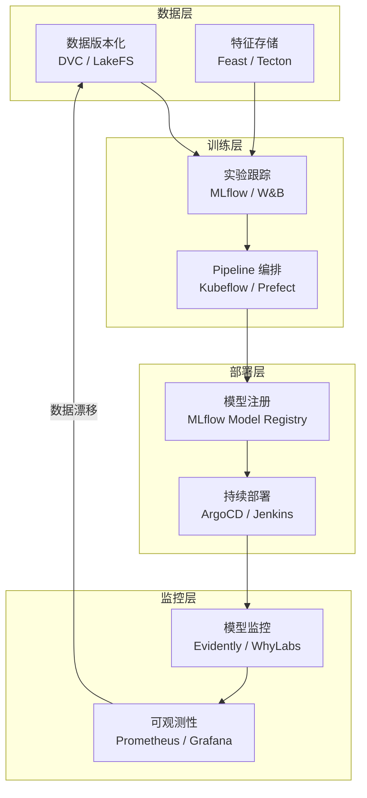

# MLOps 流水线 (MLOps Pipeline)

> **一句话理解**: MLOps 是 DevOps 的"AI 版"——如果说开发一个模型像造一辆车，MLOps 就是建造并运营整条汽车生产线，确保模型能持续、稳定、高效地在生产环境中运行。

---

## 本章内容

| 文档 | 内容 | 适用读者 |
|------|------|----------|
| [MLOps-in-nutshell](./MLOps-in-nutshell.md) | 30 分钟速览：成熟度模型、生命周期、关键工具 | 快速入门 |
| [MLOps Pipeline](./MLOps_Pipeline.md) | 完整流水线设计：数据版本化、特征存储、模型注册、持续部署 | 系统学习 |
| [MLOps Pipeline for Dummy](./MLOps_Pipeline_for_dummy.md) | MLOps 概念的简化版解释 | 初学者 |

---

## 学习路径

- **快速入门** → [MLOps-in-nutshell](./MLOps-in-nutshell.md)（30 分钟）
- **系统学习** → [MLOps Pipeline](./MLOps_Pipeline.md)（2-3 小时）
- **简化版** → [MLOps Pipeline for Dummy](./MLOps_Pipeline_for_dummy.md)

---

## 与其他章节的关联

### 前置知识
- [模型训练](../07_Model_Training/) — 训练流程是 MLOps 的输入
- [模型评估](../08_Model_Evaluation/) — 评估是流水线中的质量门禁
- [部署推理](../09_Deployment_Inference/README.md) — MLOps 的最终交付环节

### 进阶方向
- [AI Ops](../16_AI_Ops/README.md) — 模型监控、告警、自动回滚
- [测试](../15_Testing/README.md) — AI 系统的测试策略
- [架构基础设施](../12_Architecture_Infrastructure/) — 底层基础设施支撑
- [RAG 系统](../11_RAG_Systems/) — 知识密集型应用的 MLOps 实践

---

## 关键技术栈

---

*本章内容持续完善中。*
