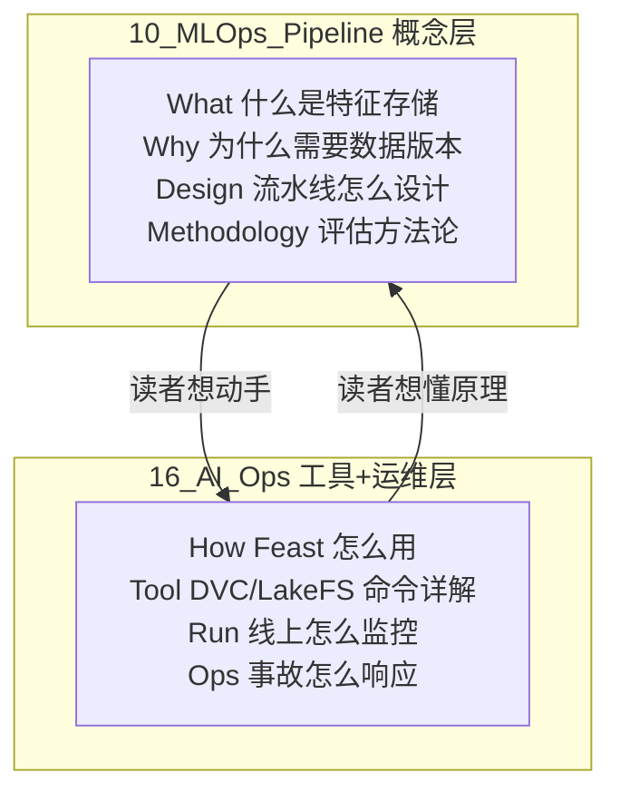

# 10_MLOps_Pipeline 与 16_AI_Ops 边界声明

> **核心原则**: 10 是「**建设方法论**」（What/Why/Design），16 是「**工具产品页 + 运维实践**」（How/Tool/Run）。
> 二者是**概念层与实现层的互补关系**，不是重复。

---

## 一、为什么需要这份声明

诊断（[[MLOps_Section_Enhancement_Plan_2026]]）发现：`16_AI_Ops/` 有 **14 个工具深度解析**与 `10_MLOps_Pipeline/` 主题重叠，包括 DVC/LakeFS/Feast/MLflow/Kubeflow/ClearML/LangSmith/Helicone/Braintrust/Guardrails 及 3 篇可观测性指南 + CI/CD。

如果不明确分工，任何后续内容填充都会在两章之间制造重复，读者也不知道该看哪。

---

## 二、分工原则



| 维度 | 10_MLOps_Pipeline | 16_AI_Ops |
|------|------------------|-----------|
| **抽象层级** | 概念 / 方法论 / 设计原则 | 工具产品 / 运维实践 |
| **回答的问题** | What / Why / 怎么设计 | How / 用什么工具 / 怎么运维 |
| **读者视角** | ML 工程师 / 架构师（设计流水线） | SRE / DevOps（运维线上系统） |
| **生命周期阶段** | Build-time（建设期） | Run-time（运行期） |
| **内容形态** | 概念解释 + 流程图 + 决策树 | 工具教程 + 命令示例 + Runbook |
| **典型标题** | "Feature Store 深度解析"（讲原理） | "Feast Deep Dive"（讲用法） |

**一句话**：10 讲「该做什么、为什么」，16 讲「用什么工具做、上线后怎么管」。

---

## 三、主题归属矩阵（SSOT）

> 下表是每个重叠主题的**权威源**（Single Source of Truth）。
> 非权威方应：① 不重复展开，② 一句话定义 + 链接到权威方。

### 3.1 构建类工具（权威源：10 概念 ↔ 16 工具页）

| 主题 | 10 的权威页（概念） | 16 的工具页（实现） | 关系 |
|------|------------------|------------------|------|
| **数据版本控制** | [[Data_Versioning_DVC_LakeFS]] | [[16_AI_Ops/DVC_Deep_Dive]]、[[16_AI_Ops/LakeFS_Deep_Dive]] | 概念↔工具 |
| **特征存储** | [[Feature_Store_Deep_Dive]] | [[16_AI_Ops/Feast_Deep_Dive]] | 概念↔工具 |
| **实验追踪** | [[Experiment_Tracking_Deep_Dive]] | [[16_AI_Ops/MLflow_Deep_Dive]]、[[16_AI_Ops/ClearML_Deep_Dive]] | 概念↔工具 |
| **流水线编排** | [[Data_Pipeline_Orchestration]] | [[16_AI_Ops/Kubeflow_Deep_Dive]]、[[16_AI_Ops/Prefect_Deep_Dive]] | 概念↔工具 |
| **模型注册** | [[Model_Registry_and_Cards_Deep_Dive]] | （16 暂无独立工具页） | 10 独占 |
| **ML CI/CD** | [[ML_CI_CD]] | [[16_AI_Ops/CI_CD_Pipeline_AI_2026]] | 概念↔实践 |

### 3.2 运维类主题（权威源：16）

| 主题 | 权威源（16） | 10 的辅助页（仅链向 16） |
|------|------------|---------------------|
| **AI 系统可观测（总览）** | [[16_AI_Ops/AI_Observability_Guide_2026]]、[[16_AI_Ops/AI_Observability_Deep_Dive]] | [[ML_Observability_SLO]]（ML 专属 SLO） |
| **LLM 可观测** | [[16_AI_Ops/LangSmith_Deep_Dive]]、[[16_AI_Ops/Helicone_Deep_Dive]]、[[16_AI_Ops/Phoenix_Deep_Dive]] | [[LLM_Observability]]（LLM 专属语义监控） |
| **LLM 评估工具** | [[16_AI_Ops/Braintrust_Deep_Dive]] | [[LLM_Evaluation_Pipeline]]（评估方法论） |
| **安全护栏** | [[16_AI_Ops/Guardrails_Deep_Dive]] | [[Privacy_Compliance_Pipeline]]（合规方法论） |
| **Prompt 管理** | [[16_AI_Ops/PromptLayer_Deep_Dive]] | [[Prompt_Engineering_Ops]]（Prompt 工程化方法论） |
| **事故响应** | [[16_AI_Ops/AI_Incident_Response_Playbook]]、[[16_AI_Ops/SRE_for_AI_Systems]] | （10 不涉及） |
| **混沌工程** | [[16_AI_Ops/Chaos_Engineering_AI]] | （10 不涉及） |

### 3.3 独占主题（无重叠）

| 章节 | 独占主题 |
|------|---------|
| **仅 10** | LLMOps 主线、Prompt/Eval/RAG 流水线、成本与延迟 SLO、再训练、合规、MLOps 成熟度 |
| **仅 16** | Incident Response、SRE、Chaos Engineering、AI Ops 总览 |

---

## 四、写作规范（消除重复的执行细则）

### 4.1 概念页（10）怎么写工具

**应当**：
- 用对比表横向比较 2-5 个工具的**设计哲学差异**
- 讲「选型决策树」（什么场景用什么）
- 讲「训练-服务偏差」「数据血源」等**跨工具共性问题**

**不应**：
- 写具体命令行用法（→ 16 的工具页）
- 写安装部署步骤（→ 16 的工具页）
- 写版本变更日志（→ 工具官方文档）

**示例**：`Feature_Store_Deep_Dive.md` 应写「Feast vs Tecton vs Hopsworks 的设计哲学对比 + 选型决策」，而**不是**「Feast 的 `feature_store.yaml` 怎么写」（后者归 [[16_AI_Ops/Feast_Deep_Dive]]）。

### 4.2 工具页（16）怎么写概念

**应当**：
- 开头一句话链向 10 的概念页：「本文讲 Feast 用法，特征存储的概念见 [[Feature_Store_Deep_Dive]]」
- 聚焦该工具的**具体命令、配置、部署、踩坑**

**不应**：
- 重复讲「什么是特征存储」「为什么需要特征存储」（→ 10）

### 4.3 交叉链接模板

概念页（10）末尾：
```markdown
## 工具实现（详见 16_AI_Ops）
- [[16_AI_Ops/Feast_Deep_Dive]] — Feast 开源特征存储
- [[16_AI_Ops/LakeFS_Deep_Dive]] — LakeFS 数据湖版本控制
```

工具页（16）开头：
```markdown
> 本文讲 X 工具的用法。概念与选型方法论见 [[10_MLOps_Pipeline/Y]]。
```

---

## 五、已有文件的处理决策

**不迁移文件**（避免破坏现有 wikilink）。通过以下方式消除重复：

| 文件当前位置 | 处理方式 |
|------------|---------|
| `16_AI_Ops/DVC_Deep_Dive.md` 等 14 篇 | 保留原位，按 §4.2 补充「概念见 10」的头部链接 |
| `10_MLOps_Pipeline/Data_Versioning_DVC_LakeFS.md` | 按 §4.1 调整为概念层（已在 P0 做到） |
| `10_MLOps_Pipeline/Feature_Store_Deep_Dive.md` 等 6 篇 | P1 阶段扩充时，按 §4.1 规范写成概念层 |

**长期可选**：若 10 的概念页与 16 的工具页仍读者混淆，可考虑把 16 的构建类工具页（DVC/LakeFS/Feast/MLflow/Kubeflow）物理迁移到 `10_MLOps_Pipeline/tools/` 子目录。但当前阶段用交叉链接解决即可。

---

## 六、与相邻章节的边界补充

### 6.1 10 vs 09_Deployment_Inference

| 主题 | 权威源 | 边界 |
|------|--------|------|
| 推理引擎（vLLM/TGI/SGLang） | **09** | 10 不展开 |
| 量化 / KV Cache / 投机解码 | **09** | 10 不展开 |
| 部署策略（Shadow/Canary） | **10** | 09 讲推理服务，10 讲部署流程 |
| 模型服务模式（在线/批/流） | **10**（P2 待建） | 09 讲引擎，10 讲模式 |

### 6.2 10 vs 15_Testing

| 主题 | 权威源 | 边界 |
|------|--------|------|
| 测试框架（Ragas/DeepEval/Promptfoo）工具用法 | **15** | 10 不展开 |
| 评估方法论（LLM-as-Judge/Eval-Driven） | **10** | 15 讲工具，10 讲方法 |

### 6.3 10 vs 19_Ethics_Safety

| 主题 | 权威源 | 边界 |
|------|--------|------|
| 红队 / 越狱 / 安全攻防 | **19** | 10 不展开 |
| 合规流水线 / Model Card 门禁 | **10** | 19 讲攻防，10 讲流程 |

---

## 七、验证清单

边界声明落地后，应满足：

- [ ] 10 的每个概念页末尾有「工具实现见 16」链接
- [ ] 16 的 14 个工具页头部有「概念见 10」链接
- [ ] 10 不再出现具体工具的命令行教程
- [ ] 16 不再重复讲概念性内容
- [ ] 无 wikilink 死链
- [ ] README 互相引用边界声明

---

## 八、Related

- [[MLOps_Section_Enhancement_Plan_2026]] — 章节加强计划（本声明是其 P0 交付物）
- [[10_MLOps_Pipeline/README]] — 10 章节导航
- [[16_AI_Ops/README]] — 16 章节导航
- [[_quality-assessment]] — 全库质量评估

---

*边界声明制定: 2026-06-15 · 维护者: opencode*
