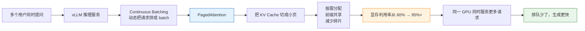

# vLLM 大白话解释

> **一句话秒懂**: vLLM 就是一套让开源大模型在 GPU 上跑得更猛、更省、更稳的推理服务端引擎。

---

## 1. vLLM 是干啥的？

vLLM 是伯克利搞出来的一套**专门把大模型跑得快、省显存的服务端推理引擎**。

你可以把它理解成：

```
你的大模型 = 一辆跑车
vLLM = 专业的赛车改装厂 + 高速公路收费站系统
```

它不负责训练模型，只负责一件事：**让已经训练好的模型，在被别人调用时跑得更快、更便宜、更稳定**。

---

## 2. 大模型推理到底卡在哪儿？

大模型生成一句话，不是一次性全蹦出来，而是一个字一个字（一个 token 一个 token）往外蹦。

每生成一个新 token，模型都要回看之前所有 token，算出一种叫 **KV Cache** 的东西。

```
KV Cache = 模型对"已经说过的话"的记忆
```

这个 KV Cache 非常吃显存。比如：
- 一个 70B 模型
- 1000 token 的上下文
- 可能就要吃掉好几 GB 显存

传统做法是：每个请求一来，就给它预先分配一大块显存，哪怕它实际用不了那么多。结果就像酒店给每个客人都留一间套房，很多房间空着，造成了巨大浪费。

---

## 3. vLLM 的杀手锏：PagedAttention

vLLM 的核心发明叫 **PagedAttention**，灵感来自操作系统里的"虚拟内存 + 分页"。

### 传统方法：连续显存

```
请求 A: [=================]  预先分配 1000 token 空间
请求 B: [=================]  预先分配 1000 token 空间
请求 C: [=========]          实际只用了 500，但剩下 500 也占着
```

很多空间被浪费了，而且请求长度不一样时，碎片很严重。

### PagedAttention：分页显存

```
把 KV Cache 切成固定大小的"页"（page）

请求 A: [页1][页3][页5]
请求 B: [页2][页6]
请求 C: [页4]

这些页不需要连续，用一张"页表"记录每个请求用到哪些页
```

就像操作系统把物理内存切成页，按需分配给不同进程一样，vLLM 把显存里的 KV Cache 切成页，按需分配给不同请求。

好处是：
- **不浪费**：用多少分配多少
- **不碎片**：小块页可以灵活拼凑
- **能复用**：多个请求共享相同前缀时，可以直接共用页
- **能换出**：请求暂停时，可以把页临时放到 CPU 内存

---

## 4. PagedAttention 和 Attention 是啥关系？

### Attention 是"注意力机制"

Attention 是 Transformer 模型的核心算法。作用是：

> 生成当前 token 时，模型会"看"一遍前面所有 token，决定每个词有多重要。

```
"我喜欢吃苹果，因为它很__"
        ↑
生成"甜"的时候，模型会重点关注"苹果"和"很"
```

这个计算过程会产生 **Key（K）** 和 **Value（V）** 两部分，合称 KV Cache。

### PagedAttention 是 Attention 的"仓库管理员"

PagedAttention **不是 Attention 的替代**，而是给 Attention 计算背后的 KV Cache 做了一个高效的"仓储系统"。

```
Attention 算法本身：负责"怎么算"
PagedAttention：负责"算出来的 KV Cache 怎么存、怎么取、怎么共享"
```

就像：
- Attention 是厨房里的厨师
- PagedAttention 是仓库管理员，负责把食材（KV Cache）摆放得井井有条，让厨师做饭更快、厨房更省地方

---

## 5. vLLM 还解决了什么问题？

| 问题 | vLLM 的做法 |
|------|------------|
| 显存浪费 | PagedAttention 按需分页分配 |
| 请求排队 | Continuous Batching，动态拼 batch |
| 长短请求互相等 | 支持抢占和恢复 |
| 接口不统一 | 提供 OpenAI 兼容 API |
| 多卡并行 | 支持张量并行、流水线并行 |

---

## 6. 适合用 vLLM 的场景

- ✅ 自托管开源大模型（Llama、Qwen、Mistral 等）
- ✅ 高并发 API 服务
- ✅ 长上下文对话
- ✅ 成本和吞吐量敏感的生产环境
- ❌ 只跑极小模型或 CPU 推理（llama.cpp 更合适）
- ❌ 追求极致单请求延迟（TensorRT-LLM / Groq 可能更好）

---

## 7. 一句话总结

> **vLLM = 用 PagedAttention 这种"分页显存"技术，把大模型 KV Cache 管理得井井有条，让开源 LLM 在 GPU 上跑得更猛、更省、更稳的推理引擎。**

---

## 8. 一张架构图看懂：为什么 vLLM 能让 GPU 服务更多人



### 链路大白话

```
1. 很多人同时问问题
        ↓
2. vLLM 不一个个排队处理，而是把大家"拼桌"
        ↓
3. PagedAttention 把每个人的"记忆"（KV Cache）切成小块
        ↓
4. 用多少切多少，共同记得的部分还共用同一块
        ↓
5. 原来空着的显存被填满了
        ↓
6. 所以同一张 GPU 能同时服务更多人，速度也就更快
```

---

*Last updated: 2026-06-15*

## Related

- [[10_部署推理/02_Inference_Engines/vLLM_Deep_Dive|vLLM 深度解析]]
- [[10_部署推理/02_Inference_Engines/LLM_Inference_Engine_Selection_Guide|LLM 推理引擎选型指南]]
- [[概念/paged-attention|PagedAttention 概念卡片]]
- [[概念/kv-cache|KV Cache 概念卡片]]
- [[概念/continuous-batching|Continuous Batching 概念卡片]]

## 核心知识体系

| 知识域 | 核心内容 | 重要程度 | 学习优先级 |
|--------|----------|----------|------------|
| 基础理论 | 核心概念/原理/方法论 | 最高 | P0 |
| 技术实践 | 工具/框架/最佳实践 | 高 | P0 |
| 工程方法 | 设计模式/架构/流程 | 高 | P1 |
| 前沿趋势 | 新技术/新方向/研究 | 中 | P2 |
| 行业应用 | 实际案例/落地经验 | 中 | P1 |

## 技术对比与选型

| 维度 | 方案A | 方案B | 方案C | 选型建议 |
|------|-------|-------|-------|----------|
| 性能 | 高吞吐 | 低延迟 | 均衡 | 按场景选择 |
| 复杂度 | 简单 | 中等 | 复杂 | 按团队能力 |
| 成本 | 低 | 中 | 高 | 按预算约束 |
| 生态 | 成熟 | 发展中 | 新兴 | 按稳定性需求 |
| 扩展性 | 有限 | 良好 | 优秀 | 按增长预期 |

## 最佳实践清单

| 实践 | 说明 | 优先级 | 预期收益 |
|------|------|--------|----------|
| 标准化流程 | 统一规范和流程 | P0 | 减少错误+提升效率 |
| 自动化 | 重复工作自动化 | P0 | 节省时间+降低风险 |
| 持续监控 | 关键指标实时监控 | P1 | 及时发现问题 |
| 定期回顾 | 周期性复盘改进 | P1 | 持续优化 |
| 知识沉淀 | 文档化经验教训 | P2 | 团队能力提升 |
| 安全优先 | 安全贯穿全流程 | P0 | 降低风险 |

## 常见问题与解决方案

| 问题 | 根因分析 | 解决方案 | 预防措施 |
|------|----------|----------|----------|
| 效率低下 | 流程不规范/工具不当 | 优化流程+引入工具 | 标准化+培训 |
| 质量不稳定 | 缺乏检查机制 | 引入质量门禁 | 自动化测试 |
| 协作困难 | 职责不清/沟通不畅 | 明确分工+定期同步 | 文档化+工具 |
| 技术债务 | 赶工忽略质量 | 定期重构+代码审查 | 质量优先文化 |
| 安全风险 | 意识不足/措施缺失 | 安全培训+工具扫描 | 安全左移 |

## 学习路径建议

| 阶段 | 内容 | 时间 | 产出 |
|------|------|------|------|
| 入门 | 核心概念+基础操作 | 1-2周 | 理解基本框架 |
| 基础 | 工具使用+简单实践 | 2-3周 | 能独立完成基础任务 |
| 进阶 | 深入原理+复杂场景 | 3-4周 | 能处理复杂问题 |
| 实战 | 生产级应用+优化 | 4-6周 | 独立负责项目 |
| 精通 | 架构设计+前沿探索 | 持续 | 技术领导力 |

## 术语速查表

| 术语 | 含义 |
|------|------|
| Best Practice | 行业公认的最佳做法 |
| Anti-pattern | 反模式(应避免的做法) |
| Technical Debt | 技术债务(为速度牺牲质量) |
| CI/CD | 持续集成/持续部署 |
| SLA | 服务等级协议 |
| KPI | 关键绩效指标 |
| ROI | 投资回报率 |
| TCO | 总拥有成本 |

## 检查清单

- [ ] 核心概念和原理已理解
- [ ] 主流工具和框架已掌握
- [ ] 最佳实践已应用到工作中
- [ ] 常见问题能独立解决
- [ ] 持续关注前沿趋势
- [ ] 知识已文档化沉淀
