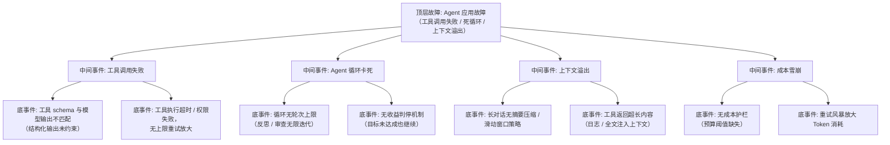

> [!warning] 生产安全提示 · Production Safety
> 本文档含可执行命令/操作步骤。执行前请核对风险等级（🟢低/🔶中/🔴高），高危命令必须 dry-run 并确认回滚方案。完整策略见 [生产安全策略](../../../../治理/Production_Safety_Policy.md)。
<!-- op-safety-banner v1 -->
# FTA: Agent 应用故障（工具调用失败 / 死循环 / 上下文溢出）

> 中文简称：FTA: Agent 应用故障（工具调用失败 / 死循环 / 上下文溢出） ｜ English: FTA Agent Tool Failure and Infinite Loop

> **一句话理解**: Agent 故障三大类——工具调用失败、循环卡死、上下文溢出，共同点是缺护栏：轮次上限、超时重试、上下文压缩、成本阈值缺一不可。

---

## 故障树（FTA）



## 问题现象

- 工具调用持续报参数格式错误（JSON schema 校验失败），或同一工具反复重试。
- Agent 任务长时间不结束：日志显示反思/审查循环反复执行，Token 消耗异常增长。
- 多轮对话后请求报上下文超限（`max_tokens` 被输入占满），或输出质量骤降（上下文过长稀释注意力）。
- 单次任务成本远超预期（死循环智能体一夜烧掉数千美元）。

## 根因分析

| 根因类别 | 具体原因 | 适用引擎 |
|---------|---------|---------|
| 输出未约束 | 工具调用未用 guided decoding / 结构化输出约束，模型自由生成导致格式漂移 | 两者（LLM 侧） |
| 重试无上限 | 工具失败重试未设次数与退避，故障工具反复调用 | 两者 |
| 循环无界 | 无轮次上限、无收益判停，Reflection/审查循环无限迭代 | 两者 |
| 上下文膨胀 | 无摘要压缩/滑动窗口，工具返回全文注入 | 两者 |
| 成本失控 | 无预算阈值与熔断，循环+重试放大 Token 消耗 | 两者 |

## 诊断步骤

```bash
# 1. 查任务执行轨迹（轮次、工具调用、耗时）
# Agent 框架日志：统计单任务的 tool_call 次数与循环轮数
grep -cE "tool_call" /var/log/agent.log   # 🟢 只读
grep -E "loop_iteration|reflection_round" /var/log/agent.log | tail -20   # 🟢 只读

# 2. 查工具失败模式
grep -iE "tool.*(error|fail|timeout)" /var/log/agent.log | tail -20   # 🟢 只读

# 3. 查 Token 消耗与成本
# 从 LLM 网关 / 计费面板取该任务 token 数，对比预期量级

# 4. 查上下文占用
# 工具返回内容大小（如 retriever 返回全文而非摘要）
grep -oE '"prompt_tokens": [0-9]+' /var/log/agent.log | tail -5
```

排查要点：

1. **看轮次曲线**：单任务轮次数超出设计上限（如 > 10 轮）即异常。
2. **看工具失败率**：> 1% 触发关注；同一工具持续失败说明工具本身故障而非格式问题。
3. **看输入构成**：上下文是否被工具返回内容占满（如 32k 窗口中 30k 是检索全文）。

## 解决方案

**工具调用失败**：

- 开启结构化输出约束：SGLang `--grammar`/xgrammar、vLLM `guided_json`，从生成层保证工具参数合法（关联 Guided Decoding FTA）。
- 工具执行设置超时（如 30s）+ 重试上限（如 3 次）+ 指数退避；持续失败触发工具熔断。
- 工具返回内容截断/摘要化，避免超大 payload 污染上下文。

**循环卡死**：

```python
# 护栏配置（伪代码）：轮次上限 + 收益判停
MAX_ITERATIONS = 10           # 硬上限
min_progress_delta = 0.01     # 每轮收益增量低于阈值即判停
if iteration > MAX_ITERATIONS or progress < min_progress_delta:
    stop_agent("收益停滞，人工介入")
```

- Reflection 类流程设置收益判停：无改善即终止并转人工。
- 多 Agent 审查场景固定审查轮数（如最多 2 轮），避免无限回文。

**上下文溢出**：

- 对话超窗策略：摘要压缩 + 滑动窗口（保留最近 N 轮 + 全局摘要）。
- 工具返回限制：`max_tokens` 截断、字段级过滤，而非全文注入。

**成本雪崩**：

- 单任务 Token 预算 + 单日预算双阈值，超限熔断并通知。
- 重试与循环消耗计入预算（同一预算池），防止护栏被绕过。

## 预防措施

- Agent 上线前红队测试：覆盖死循环、上下文溢出、工具滥用场景（`08_Agent_红队测试_2026`）。
- 生产护栏默认开启：轮次上限、超时重试、上下文压缩、成本熔断四项缺一不可。
- 监控工具失败率、单任务轮次、单任务成本，超阈值自动告警。
- 每轮循环强制携带进度摘要，为收益判停提供依据。

---

## 交叉引用

- [[10_部署推理/02_推理引擎/FTA/推理/FTA_vLLM_SGLang_Guided_Decoding_报错.md|Guided Decoding 报错 FTA]]
- [[15_智能体/03_Agent工作流/03_AgentOps_生产_指南.md|AgentOps 生产指南]]
- [[15_智能体/01_Agent基础/06_Agent_生产_部署_操作手册.md|Agent 生产部署操作手册]]
- [[15_智能体/07_Agent评估/08_Agent_红队测试_2026.md|Agent 红队测试 2026]]
- [[10_部署推理/02_推理引擎/FTA/推理/FTA_vLLM_SGLang_排队超时.md|排队超时 FTA]]

*Last updated: 2026-08-28*
