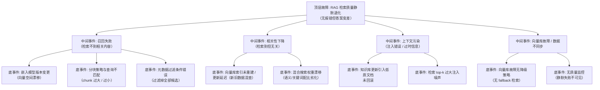

> [!warning] 生产安全提示 · Production Safety
> 本文档含可执行命令/操作步骤。执行前请核对风险等级（🟢低/🔶中/🔴高），高危命令必须 dry-run 并确认回滚方案。完整策略见 [生产安全策略](../../../../治理/Production_Safety_Policy.md)。
<!-- op-safety-banner v1 -->
# FTA: RAG 静默失败与检索质量退化

> 中文简称：FTA: RAG 静默失败与检索质量退化 ｜ English: FTA RAG Silent Failure and Retrieval Degradation

> **一句话理解**: RAG 最危险的是「不报错但答错」——检索不到、检索到无关内容、上下文被污染都无异常码；靠质量监控 + 分块/嵌入版本管理 + 降级策略三道防线。

---

## 故障树（FTA）



## 问题现象

- 答案从准确变为含糊或张冠李戴，但服务无任何报错、延迟正常——静默失败。
- 同一问题短时间前后答案不一致，或引用内容与知识库现况不符（过时/错误文档被检索）。
- 检索调试发现：`recall@k` 骤降、检索结果与查询主题明显无关、top-k 结果几乎相同（去重失效）。
- 向量库升级/重建后整体质量下降（嵌入版本变更的典型表现）。

## 根因分析

| 根因类别 | 具体原因 | 适用引擎 |
|---------|---------|---------|
| 嵌入漂移 | 嵌入模型升级未重建索引，新旧向量空间不兼容 | 通用 |
| 分块失配 | 分块大小/重叠与查询粒度不匹配（chunk 过大稀释语义） | 通用 |
| 索引滞后 | 文档更新后索引未重建/增量同步失败，新旧数据混查 | 通用 |
| 权重漂移 | 混合搜索（语义+关键词）权重配比变化未回归验证 | 通用 |
| 内容污染 | 新入库文档质量差未过滤，检索到错误信息并注入上下文 | 通用 |
| 降级缺失 | 向量库故障时无 fallback（关键词检索），直接空检索 | 通用 |
| 监控缺失 | 无检索质量指标，退化过程不可见 | 通用 |

## 诊断步骤

```bash
# 1. 检索质量自查：用黄金问题集测 recall@k
# 脚本：对 50 个标注过正确文档的问题跑检索，统计 top-5 命中率
python eval_retrieval.py --questions golden.json --topk 5   # 🟢 只读

# 2. 检查嵌入版本与索引一致性
# 向量库元数据：当前嵌入模型 id 与索引构建时是否一致
curl -s <vector-db>/collections/<name> | grep -iE "embedding|model"   # 🟢 只读

# 3. 检查索引新鲜度（最新文档是否可检索）
curl -s <vector-db>/search -d '{"query": "<最新文档唯一词>", "top_k": 5}' | head -20

# 4. 检查混合搜索权重配置与降级逻辑
grep -E "hybrid_weight|rrf|fallback" /etc/rag/config.yaml   # 🟢 只读
```

排查要点：

1. **先分「查不到」vs「查不对」**：查不到 = 嵌入/分块/过滤；查不对 = 索引新鲜度/权重/噪声。
2. **看变更窗口**：质量退化通常伴随某次变更（嵌入升级、知识库更新、权重调整），回查变更记录。
3. **看 top-k 分布**：结果雷同 = 去重失效或数据单一；结果无关 = 嵌入或权重问题。

## 解决方案

**嵌入/索引不一致（最高发根因）**：

```text
Step 1: 固定嵌入模型版本（如 text-embedding-3-large@2026-05），变更必须走灰度
Step 2: 嵌入模型变更后全量重建索引（新旧向量不可混用）
Step 3: 重建后跑黄金问题集回归：recall@k 不低于旧版基线
```

**相关性下降**：

- 分块调优：按文档类型定 chunk 大小（代码/表格/长文分开），加重叠（如 10-15%）。
- 混合搜索权重回归：语义/关键词权重变更必须配黄金集验证。
- top-k 收敛：从 10 收到 5，配合 reranker 降噪。

**上下文污染**：

- 新文档入库加质量门槛（长度、重复度、格式校验），低质文档拒入或隔离。
- 知识库更新质量退化时回滚（`RAG_监控_and_可观测性` 的 recommendation 机制）。
- 检索结果按分数阈值过滤，低分结果不注入。

**故障兜底**：

- 向量库故障降级：fallback 到关键词检索（ES）或缓存最近结果，保证可用性。
- 质量监控：`recall@k` 抽样评估、检索分数分布、bad case 人工抽检，静默失败显性化。

## 预防措施

- 黄金问题集（50-100 条）随知识库版本维护，每次变更跑回归。
- 嵌入模型、分块策略、混合权重三类变更全部走「灰度 → 回归 → 全量」流程。
- 检索日志留存（query、召回文档、分数），支持事后 bad case 分析。
- 降级路径（关键词 fallback）随主链路一起压测，故障时可用。

---

## 交叉引用

- [[14_RAG系统/04_高级RAG/13_RAG_调试_Cheat_Sheet.md|RAG 调试 Cheat Sheet]]
- [[14_RAG系统/05_RAG生产实践/03_RAG_监控_and_可观测性.md|RAG 监控与可观测性]]
- [[14_RAG系统/04_高级RAG/06_混合搜索.md|混合搜索]]
- [[14_RAG系统/02_嵌入技术/README.md|嵌入技术]]
- [[10_部署推理/02_推理引擎/FTA/推理/FTA_可观测性缺失.md|可观测性缺失 FTA]]

*Last updated: 2026-08-28*
