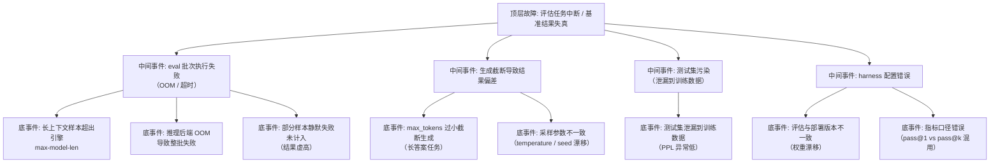

> [!warning] 生产安全提示 · Production Safety
> 本文档含可执行命令/操作步骤。执行前请核对风险等级（🟢低/🔶中/🔴高），高危命令必须 dry-run 并确认回滚方案。完整策略见 [生产安全策略](../../../../治理/Production_Safety_Policy.md)。
<!-- op-safety-banner v1 -->
# FTA: 评估任务中断与基准结果失真

> 中文简称：FTA: 评估任务中断与基准结果失真 ｜ English: FTA Evaluation Interruption and Benchmark Distortion

> **一句话理解**: 基准分不可信的三大来源——任务中断（OOM/超时）、生成截断、测试集泄漏；评估前固定环境与参数、评估中监控失败样本、评估后查污染。

---

## 故障树（FTA）



## 问题现象

- 评估任务中途崩溃或超时，重跑后分数与上次明显不同（失败样本被跳过/重算导致）。
- 生成类任务（代码/长文）结果大量截断，`finish_reason=length` 占比高，分数偏低。
- 某模型在公开基准分数异常高，但实际能力不符——测试集泄漏的典型信号。
- 同一模型两次评估结果波动超过误差范围（环境/参数不一致）。

## 根因分析

| 根因类别 | 具体原因 | 适用引擎 |
|---------|---------|---------|
| 上下文超限 | 长上下文样本超出引擎 `max-model-len`，被截断或整批失败 | vLLM / SGLang |
| 后端 OOM | eval 批量并发高导致后端 OOM，部分样本静默失败 | 两者 |
| 静默失败 | harness 跳过失败样本仍出分，失败率越高分数越虚 | 两者 |
| 生成截断 | `max_tokens` 小于任务所需输出长度 | 两者 |
| 参数漂移 | temperature/seed/top-p 未固定，结果不可复现 | 两者 |
| 数据污染 | 测试集泄漏到训练语料（PPL 异常低可检出） | 通用 |
| 版本漂移 | 评估用模型权重与部署版本不一致 | 通用 |

## 诊断步骤

```bash
# 1. 核对失败/跳过样本数（harness 报告）
grep -E "failed|skipped|aborted" eval_results.json | wc -l   # 🟢 只读

# 2. 检查 finish_reason 分布（length 占比高 = 截断）
grep -oE '"finish_reason": "[a-z]+"' eval_results.json | sort | uniq -c

# 3. 检查评估后端配置（max-model-len / max_tokens / 并发）
# vLLM: --max-model-len；harness: max_length / batch_size

# 4. 污染检测：对比模型在测试集 vs 随机文本的 PPL
# PPL 异常低（远低于训练数据水平）→ 疑似泄漏
python ppl_check.py --model <model> --data <testset>   # 🟢 只读
```

排查要点：

1. **先看失败率**：失败/跳过样本 > 5% 时分数不可信，先修复执行再谈结论。
2. **看截断分布**：`finish_reason=length` 占比与任务输出长度需求对比。
3. **看一致性**：同一配置两次运行结果波动应 < 1%；波动大说明环境未固定。

## 解决方案

**任务中断与静默失败**：

```text
Step 1: 对齐上下文窗口——评估样本最长长度 ≤ max-model-len - max_tokens 余量
Step 2: 降低 eval 并发（batch_size 8→4），避免后端 OOM
Step 3: harness 配置 fail_on_error / 失败即重试，禁止静默跳过出分
Step 4: 复跑验证：失败率 = 0 后再采信分数
```

**生成截断**：

- 按任务类型配置 `max_tokens`：代码生成/长文任务放宽（如 4096+），短答任务收紧。
- 固定采样参数：`temperature=0`（或固定 seed）、`top_p=1`，写入评估配置随结果归档。

**污染与版本漂移**：

- 泄漏检测：新模型上线前跑 PPL 污染检测（HF Leaderboard Eval 指南 §5 流程）。
- 训练数据与测试集重叠检查（n-gram 匹配），发现即重训或换测试集。
- 评估镜像与部署镜像同源（同一 commit + 权重 sha256），杜绝版本漂移。

**指标口径**：

- 统一指标定义并归档：pass@1 vs pass@k、准确率 vs 匹配率，避免跨轮次混用。

## 预防措施

- 评估配置（模型 commit、权重 sha256、采样参数、max_tokens、后端版本）全部归档，可复现。
- CI 化评估：每次权重变更自动跑黄金子集，失败率 > 0 即阻断发布。
- 监控评估后端（复用推理监控）：OOM、超时、队列积压实时可见。
- 定期抽查公开基准分数与内部复测的一致性，及早发现污染。

---

## 交叉引用

- [[08_模型评估/02_基准测试/05_HF_Leaderboard_Eval_指南.md|HF Leaderboard Eval 指南]]
- [[08_模型评估/05_自动化评估/02_评估_自动化_2026.md|评估自动化 2026]]
- [[08_模型评估/02_基准测试/07_LLM_基准测试_Suite_2026.md|LLM 基准测试 Suite 2026]]
- [[10_部署推理/02_推理引擎/FTA/推理/FTA_vLLM_SGLang_推理_OOM.md|推理 OOM FTA]]
- [[10_部署推理/02_推理引擎/FTA/推理/FTA_可观测性缺失.md|可观测性缺失 FTA]]

*Last updated: 2026-08-28*
