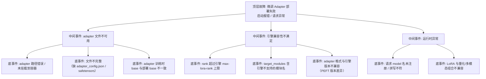

> [!warning] 生产安全提示 · Production Safety
> 本文档含可执行命令/操作步骤。执行前请核对风险等级（🟢低/🔶中/🔴高），高危命令必须 dry-run 并确认回滚方案。完整策略见 [生产安全策略](../../../../治理/Production_Safety_Policy.md)。
<!-- op-safety-banner v1 -->
# FTA: vLLM / SGLang 微调 Adapter 部署到推理引擎失败

> 中文简称：FTA: vLLM / SGLang Adapter 部署失败

> **一句话理解**: 微调 adapter 部署失败时，先验证文件与 base 一致性，再查 rank/格式兼容性——训练产物到推理引擎之间有一条「格式 + 版本」鸿沟。

---

## 故障树（FTA）



## 问题现象

- 引擎启动时加载 adapter 失败：`Failed to load LoRA`、`No such file or directory`、`Unsupported LoRA type`。
- 启动成功但请求指定 adapter 时 404/报错，或输出与 base 相同（静默失效）。
- 同一 adapter 在 vLLM 可用、SGLang 报错（或反之），跨引擎行为不一致。

## 根因分析

| 根因 | 机制说明 | 适用引擎 |
|------|---------|---------|
| 路径/挂载问题 | 容器内未挂载 adapter 目录，或路径权限不足 | 两者 |
| 文件不完整 | 训练产物只拷贝了 safetensors，漏了 `adapter_config.json`（引擎靠它读 rank 与 target） | 两者 |
| base 不一致 | adapter 挂在不同 base（8B vs 8B-Instruct）上训练，部署时加载到另一 base 上错位 | 两者 |
| rank 超限 | 训练 rank=64，引擎 `max-lora-rank` 默认较小则拒载 | vLLM |
| 模块名不识别 | `target_modules` 用了引擎未实现的模块名（如部分自研层） | 两者 |
| PEFT 版本漂移 | 训练用新版 PEFT 产出的 config 字段，旧版引擎解析失败 | 两者 |
| 组合限制 | AWQ 量化 base + LoRA、多模态架构 + LoRA 的组合支持不完整 | 两者 |

## 诊断步骤

```bash
# 1. 文件完整性检查（引擎读取的三个关键件）
ls -la /path/to/adapter/   # adapter_config.json + adapter_model.safetensors 🟢 只读

# 2. 查看 adapter_config.json 关键字段
cat /path/to/adapter/adapter_config.json   # r、lora_alpha、target_modules、base_model_name_or_path 🟢 只读

# 3. 引擎启动日志确认注册结果
# vLLM: "Loading LoRA modules" 后是否报错
# SGLang: lora 加载记录

# 4. 最小验证：单 adapter 启动 + 直接请求
# 排除多 adapter 相互干扰
```

排查要点：

1. **文件三件套**：`adapter_config.json` + `adapter_model.safetensors` + `tokenizer`（如需要）缺一不可。
2. **base 一致性**：adapter 里声明的 base 与部署模型逐字符比对（含 Instruct 后缀、revision）。
3. **rank 合规**：`adapter_config.json` 的 `r` ≤ 引擎 `max-lora-rank`。
4. **跨引擎差异**：vLLM 与 SGLang 对 PEFT 字段的容错不同，报错信息指向的具体字段即问题字段。
5. **隔离测试**：单独部署一个 adapter 复现，区分「adapter 本身坏」与「引擎配置问题」。

## 解决方案

**vLLM**：

```bash
# 方案 A: 完整注册（确认路径 + 放宽 rank）
python -m vllm.entrypoints.openai.api_server \
    --model meta-llama/Llama-3.1-8B-Instruct \
    --enable-lora \
    --lora-modules sft=/models/sft-adapter \
    --max-lora-rank 64

# 方案 B: 请求用注册名
# curl model="sft" 与 --lora-modules 注册名一致
```

**SGLang**：

```bash
# 方案 A: 显式注册 adapter 并预留显存
python -m sglang.launch_server \
    --model-path meta-llama/Meta-Llama-3.1-8B-Instruct \
    --max-lora-ranks 8 \
    --lora-names base,sft

# 方案 B: 请求按注册名指定
# curl model="sft" 对应 --lora-names 中名称
```

**通用方案**：

- 训练产物打包规范：adapter 目录固定包含 `adapter_config.json` + `adapter_model.safetensors`，随镜像一起发布。
- base 版本映射表：每个 adapter 标注「训练 base 版本 + 目标部署引擎」，发布时自动校验。
- 引擎不支持的组合（量化 + LoRA 等）提前查支持矩阵，必要时用合并产物替代。
- 跨引擎迁移时先用官方转换工具校验 adapter 格式（PEFT 版本对齐）。

## 预防措施

- 训练完成后立即做「adapter 冒烟部署」：用目标引擎（vLLM/SGLang）各加载一次，通过才放行。
- adapter 制品加入 CI 校验：文件完整性 + rank 合规 + base 一致性，三项全过才可发布。
- 引擎升级后重跑 adapter 冒烟测试（PEFT 解析行为随版本变化）。
- 监控请求中 adapter 分布与「回退 base」情况，静默失效必须可发现。

---

## 交叉引用

- [[10_部署推理/02_推理引擎/29_vLLM_深入分析.md|vLLM_Deep_Dive]]
- [[10_部署推理/02_推理引擎/23_SGLang_深入分析.md|SGLang_Deep_Dive]]
- [[10_部署推理/02_推理引擎/FTA/推理/FTA_vLLM_SGLang_多LoRA冲突.md|多 LoRA 冲突 FTA]]
- [[10_部署推理/02_推理引擎/FTA/微调/FTA_vLLM_SGLang_LoRA_合并失败.md|LoRA 合并失败 FTA]]

*Last updated: 2026-08-13*
