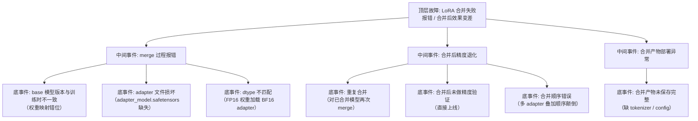

> [!warning] 生产安全提示 · Production Safety
> 本文档含可执行命令/操作步骤。执行前请核对风险等级（🟢低/🔶中/🔴高），高危命令必须 dry-run 并确认回滚方案。完整策略见 [生产安全策略](../../../../治理/Production_Safety_Policy.md)。
<!-- op-safety-banner v1 -->
# FTA: vLLM / SGLang LoRA 合并失败 / 合并后效果变差

> 中文简称：FTA: vLLM / SGLang LoRA 合并失败

> **一句话理解**: LoRA 合并翻车时，base 模型版本不一致是第一嫌疑，其次是合并流程与精度验证缺失——合并后必须与合并前跑同一基准对比。

---

## 故障树（FTA）



## 问题现象

- `merge_and_unload()` 抛错：张量形状不匹配、`weights not found`、key 缺失。
- 合并成功但部署到 vLLM/SGLang 后输出质量下降：目标任务指标与合并前 LoRA 效果明显差异。
- 合并后模型在 MMLU 等通用基准上大幅跌落（远超 1% 的正常浮动）。

## 根因分析

| 根因 | 机制说明 |
|------|---------|
| base 版本不一致 | 训练用 `Llama-3.1-8B`，合并用 `8B-Instruct` 或不同 revision，权重结构与语义错位 |
| 文件损坏 | `adapter_config.json` 与 `adapter_model.safetensors` 不配套（版本漂移） |
| dtype 不匹配 | 加载 base 用 `torch.float16`，adapter 是 BF16 训练产物，合并时数值语义改变 |
| 重复合并 | 已合并模型再次 merge（adapter 权重叠加两次），效果漂移 |
| 多 adapter 叠加 | 多个 adapter（sft + rlhf）合并顺序不同，最终权重不同 |
| 验证缺失 | 未跑合并前后 benchmark 对比，精度退化上线后才暴露 |

## 诊断步骤

```bash
# 1. 核对 base 模型版本（训练日志中的 model name + revision）
# 训练脚本: model_name_or_path=meta-llama/Llama-3.1-8B
# 合并脚本: 必须与之一致，含 Instruct 后缀与 revision

# 2. 验证 adapter 文件完整性
ls -la /path/to/adapter/   # adapter_config.json + adapter_model.safetensors 🟢 只读

# 3. 检查 adapter 的 base 声明
cat /path/to/adapter/adapter_config.json | grep -E "base_model|r|target_modules"   # 🟢 只读

# 4. 合并前后 benchmark 对比
# 合并前: 用 PeftModel 加载评估 MMLU/业务集
# 合并后: 用合并模型评估同一测试集，差距应 < 1%
```

排查要点：

1. **版本核对**：`adapter_config.json` 的 `base_model_name_or_path` 与合并脚本加载的模型必须逐字符一致。
2. **单次合并**：确认合并对象是「纯净 base + adapter」，而非「已合并模型」。
3. **dtype 统一**：加载 base 的 dtype 与训练时一致（推荐 BF16 全家桶）。
4. **先验证后部署**：合并产物先用 transformers 评估（跑业务样例），再进 vLLM/SGLang。
5. **多 adapter 规范**：多 adapter 场景明确合并顺序，或直接部署 adapter 模式（不合并）用引擎多 LoRA 能力。

## 解决方案

```python
# 方案 A: 正确的合并流程（base 严格一致 + 验证）
from peft import PeftModel
from transformers import AutoModelForCausalLM, AutoTokenizer
import torch

# 1. 加载与训练时完全一致的 base（含版本）
base_model = AutoModelForCausalLM.from_pretrained(
    "meta-llama/Llama-3.1-8B",  # 必须与训练时完全一致
    torch_dtype=torch.bfloat16,
)

# 2. 加载 adapter
model = PeftModel.from_pretrained(base_model, "path/to/adapter")

# 3. Merge（注意: 不可逆操作，先备份纯净 base）
merged_model = model.merge_and_unload()

# 4. 验证 merge 精度（前后差距应 < 1%）
print("Merge 前:", evaluate(model))
print("Merge 后:", evaluate(merged_model))

# 5. 保存完整产物（权重 + tokenizer + config）
merged_model.save_pretrained("path/to/merged")
tokenizer.save_pretrained("path/to/merged")
```

**vLLM / SGLang 部署验证**：

```bash
# 合并产物部署后跑代表性 prompt 抽查
curl http://localhost:8000/v1/chat/completions \
  -H "Content-Type: application/json" \
  -d '{"model": "default", "messages": [{"role": "user", "content": "<微调特征问题>"}]}'
# 输出应体现微调特征；与 adapter 模式（多 LoRA）输出对比
```

**通用方案**：

- 若合并风险不可控，改用引擎的原生多 LoRA 能力（vLLM `--lora-modules` / SGLang `--lora-names`），跳过合并。
- 合并产物与 adapter 双轨发布：adapter 用于灵活切换，合并产物用于固定版本。

## 预防措施

- 训练脚本固化 base 版本（含 commit hash），合并脚本从同一配置读取，杜绝手填。
- 合并流程脚本化并纳入 CI：加载 → merge → benchmark 对比 → 打包，任一环节失败即阻断发布。
- 合并是不可逆操作：执行前备份纯净 base 权重，保留 adapter 原始文件。
- 对每次合并产物建立「合并前 vs 合并后」指标台账，偏差 > 1% 触发人工评审。

---

## 交叉引用

- [[10_部署推理/02_推理引擎/29_vLLM_深入分析.md|vLLM_Deep_Dive]]
- [[10_部署推理/02_推理引擎/23_SGLang_深入分析.md|SGLang_Deep_Dive]]
- [[10_部署推理/02_推理引擎/FTA/微调/FTA_vLLM_SGLang_LoRA_Adapter_部署失败.md|LoRA Adapter 部署失败 FTA]]
- [[05_大模型/06_微调技术/09_PEFT_2026.md|PEFT/LoRA 详解]]

*Last updated: 2026-08-13*
