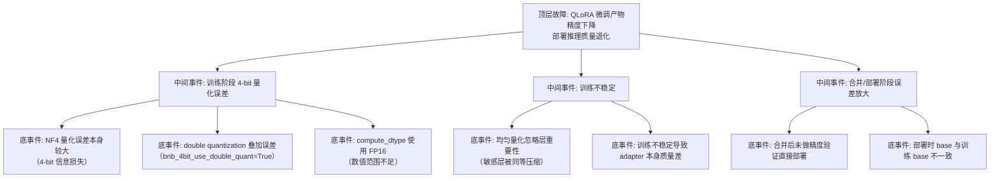

> [!warning] 生产安全提示 · Production Safety
> 本文档含可执行命令/操作步骤。执行前请核对风险等级（🟢低/🔶中/🔴高），高危命令必须 dry-run 并确认回滚方案。完整策略见 [生产安全策略](../../../../治理/Production_Safety_Policy.md)。
<!-- op-safety-banner v1 -->
# FTA: vLLM / SGLang QLoRA 4-bit 精度问题（影响部署推理）

> 中文简称：FTA: vLLM / SGLang QLoRA 4-bit 精度问题

> **一句话理解**: QLoRA 精度翻车时，按「NF4 量化误差 → double quant 误差 → 计算精度 → 合并部署验证」四层排查，4-bit 产物上线前必须做精度对比验证。

---

## 故障树（FTA）



## 问题现象

- QLoRA 微调产物在目标任务上表现差：训练 loss 降了但评测分数不达标。
- 合并产物部署到 vLLM/SGLang 后输出质量比预期低，甚至比 base 还差。
- 部分层表现特别差（如数学推理），其他层正常——量化误差不均匀分布。

## 根因分析

| 根因 | 机制说明 | 适用阶段 |
|------|---------|---------|
| NF4 固有误差 | 4-bit 量化（NF4 块内归一化）信息损失大于 8-bit，任务敏感度不同影响不同 | 训练 |
| double quant 误差 | `bnb_4bit_use_double_quant=True` 节省约 0.4 B/参数显存，但叠加二次量化误差 | 训练 |
| compute_dtype 过低 | `bnb_4bit_compute_dtype=float16` 时数值溢出风险高于 bfloat16 | 训练 |
| 层重要性不均 | 均匀量化对所有层同等压缩，数学/推理关键层误差被放大 | 训练 |
| 验证缺失 | 未跑「QLoRA adapter / 合并产物 vs 全参微调 / base」对比，退化不可见 | 部署 |
| base 漂移 | 训练 base 与部署 base 不一致，量化 scale 与权重错位 | 部署 |

## 诊断步骤

```bash
# 1. 检查训练配置中的量化参数
# 训练脚本: bnb_4bit_quant_type、bnb_4bit_use_double_quant、bnb_4bit_compute_dtype

# 2. 精度对比三件套（同一测试集）
# A. base 模型基线
# B. QLoRA adapter 评估（PeftModel 加载）
# C. 合并产物评估（merge 后）
# 任一环节显著低于基线即定位到该环节

# 3. 敏感层误差分析
# 逐层对比 QLoRA 产物与全参微调产物的输出分布，定位误差集中的层
```

排查要点：

1. **量化配置复盘**：`quant_type=nf4`、`use_double_quant=False`、`compute_dtype=bfloat16` 是精度优先组合。
2. **对比定位**：adapter 模式差 → 训练/量化问题；adapter 好但合并产物差 → 合并流程问题。
3. **任务敏感性**：数学/代码类任务对量化误差敏感，优先 8-bit（`load_in_8bit`）或全参 LoRA。
4. **部署侧复核**：vLLM/SGLang 部署时确认 base 与训练一致，量化 scale 匹配。
5. **替代方案**：精度优先场景用 GPTQ/AWQ 预量化 base + LoRA，替代 bitsandbytes 4-bit。

## 解决方案

**训练阶段（精度优先配置）**：

```python
from transformers import BitsAndBytesConfig
import torch

# 方案 A: 精度优先的 4-bit 配置
bnb_config = BitsAndBytesConfig(
    load_in_4bit=True,
    bnb_4bit_quant_type="nf4",           # NF4 优于 FP4
    bnb_4bit_use_double_quant=False,     # 关闭 double quant 减少误差
    bnb_4bit_compute_dtype=torch.bfloat16,  # 计算精度用 BF16
)

# 方案 B: 显存允许时升到 8-bit
# load_in_8bit=True（精度损失更小，显存多 ~4B/参数）
```

**部署阶段（vLLM / SGLang）**：

```bash
# 方案 A: 产物上线前跑精度对比（合并 vs adapter）
# 合并前后同一业务集评估，差距 > 1% 不得上线

# 方案 B: 用引擎多 LoRA 直接加载 adapter（跳过合并，保持训练态精度）
python -m vllm.entrypoints.openai.api_server \
    --model meta-llama/Llama-3.1-8B-Instruct \
    --enable-lora \
    --lora-modules sft=/models/sft-adapter \
    --max-lora-rank 64
```

**通用方案**：

- 训练完成后保留三份产物（adapter / 合并模型 / 量化配置），评估矩阵统一覆盖。
- 关键业务（数学、代码）优先全参 LoRA（base FP16/BF16 + LoRA），显存不够再考虑 4-bit。
- 敏感层保护：对误差集中层改用更高精度（8-bit）重新微调该部分。

## 预防措施

- QLoRA 配置模板固化「NF4 + 无 double quant + BF16 compute」为默认精度档，改动走评审。
- 训练产物上线门槛：adapter 与合并产物均须通过「对比 base 的评测」质量门禁。
- 任务类型与量化档位匹配表：简单分类可用 4-bit，复杂推理默认 8-bit 或全精度 LoRA。
- 每次 QLoRA 训练记录量化配置与评测结果，积累「任务 × 量化档位」经验库。

---

## 交叉引用

- [[10_部署推理/02_推理引擎/29_vLLM_深入分析.md|vLLM_Deep_Dive]]
- [[10_部署推理/02_推理引擎/23_SGLang_深入分析.md|SGLang_Deep_Dive]]
- [[10_部署推理/02_推理引擎/FTA/推理/FTA_vLLM_SGLang_量化部署_精度下降.md|量化部署精度下降 FTA]]
- [[05_大模型/06_微调技术/09_PEFT_2026.md|PEFT/LoRA 详解]]

*Last updated: 2026-08-13*
