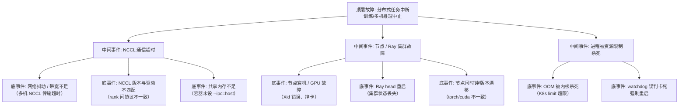

> [!warning] 生产安全提示 · Production Safety
> 本文档含可执行命令/操作步骤。执行前请核对风险等级（🟢低/🔶中/🔴高），高危命令必须 dry-run 并确认回滚方案。完整策略见 [生产安全策略](../../../../治理/Production_Safety_Policy.md)。
<!-- op-safety-banner v1 -->
# FTA: vLLM / SGLang 分布式训练 / 多机部署中断（Ray / NCCL）

> 中文简称：FTA: vLLM / SGLang 分布式训练 / 多机部署中断

> **一句话理解**: 分布式任务中断时，先看日志定位「网络层 / 资源层 / 进程层」——NCCL 超时、节点掉线、OOM 被杀是三大高频根因，恢复的关键是断点续训与状态落盘。

---

## 故障树（FTA）



## 问题现象

- 训练进行中突然中断：`NCCL timeout`、`rank X stopped`、`Process group is destroyed`、`CUDA error: device-side assert triggered`。
- 多机推理（TP 跨节点）请求全部失败，节点掉线后其余节点继续运行但服务不可用。
- K8s 下 Pod 反复重启（CrashLoopBackOff），或 Ray 任务显示 `Task failed / Node dead`。
- 中断后无 checkpoint 可恢复，训练进度回退到数小时前。

## 根因分析

| 根因 | 机制说明 | 适用场景 |
|------|---------|---------|
| NCCL 超时 | 多机网络抖动或带宽不足，AllReduce 超过默认 timeout（如 30 分钟） | 训练/多机推理 |
| 共享内存不足 | `/dev/shm` 默认 64MB，NCCL 共享内存缓冲写满即报错 | Docker 部署 |
| 节点掉线 | GPU 故障（Xid 错误）、节点重启、网络分区 | 训练/多机推理 |
| Ray 状态丢失 | head 节点重启后集群句柄失效，所有依赖 Ray 的任务中断 | 训练/多机推理 |
| OOM 被杀 | K8s memory limit 超限触发 OOMKilled，进程无缓冲退出 | 训练 |
| 版本漂移 | 各节点 torch/CUDA/NCCL 版本不一致，rank 间行为分裂 | 训练 |

## 诊断步骤

```bash
# 1. 定位中断层级：训练日志末尾 + 系统日志
# 训练日志: 最后 200 行（NCCL error / watchdog / rank 退出原因）
# 系统日志: dmesg | tail（GPU Xid 错误、OOM killer）🟢 只读

# 2. 检查节点健康
nvidia-smi   # 每节点确认 GPU 在位、无 Xid 错误 🟢

# 3. 检查 Ray 集群状态（多机场景）
ray status   # 节点数、GPU 数、异常 actor 🟢 只读

# 4. 检查容器资源与共享内存
docker inspect <container> | grep -E "ShmSize|Memory"   # 🟢 只读
```

排查要点：

1. **看中断信号**：`OOMKilled` → 资源问题；`NCCL timeout` → 网络/通信问题；`Xid` → GPU 硬件问题；三者处理路径完全不同。
2. **检查点先于根因**：确认最近 checkpoint 位置，评估回退损失，再决定继续排查还是先恢复训练。
3. **跨节点一致性**：核对各节点 `torch.__version__`、`CUDA`、`NCCL` 版本一致。
4. **共享内存核查**：Docker 必须 `--ipc=host`，否则 NCCL 大消息缓冲直接失败。
5. **watchdog 与真实卡死**：区分「真的卡死」与「watchdog 误杀」，看卡死时 GPU 利用率是否持续为 0。

## 解决方案

**通用恢复流程**：

```bash
# 1. 断点续训（训练场景）：从最近 checkpoint 恢复
# torchrun / deepspeed 均支持 --resume-from-checkpoint

# 2. 多机推理恢复：重建 Ray 集群后重启服务
ray stop --force   # 清理旧集群状态
ray start --head
ray start --address="<head-ip>:6379"
```

**NCCL 超时处理**：

```bash
# 方案 A: 适当放宽超时（网络抖动频繁的环境）
export NCCL_TIMEOUT=3600   # 单位秒，默认 1800

# 方案 B: 网络优先传输（多机跨交换机场景）
export NCCL_SOCKET_IFNAME=eth0   # 指定真实业务网卡
```

**容器化部署**：

```bash
# 方案 A: Docker 必须开共享内存
docker run --gpus all --ipc=host -v ...   # /dev/shm 共享宿主机

# 方案 B: K8s 下显式加大 shm 卷
# volumeMounts: mountPath: /dev/shm, emptyDir.medium: Memory
```

**资源类中断**：

- K8s memory limit 按峰值 + 20% 余量设置，OOMKilled 时先查 limit 而非盲目加内存。
- 训练场景开启 checkpoint 自动落盘（每 N 步），中断最多回退 N 步。
- GPU 硬件故障（Xid）需更换节点，先隔离故障卡再恢复训练。

## 预防措施

- 训练框架标配「自动 checkpoint + 断点续训」：中断后由调度器自动恢复，人工只负责评估损失。
- 多机环境统一镜像与依赖版本（torch/CUDA/NCCL 锁版本），杜绝节点间漂移。
- Ray 集群与训练任务解耦：head 高可用（多副本）或任务失败自动重建集群。
- 网络抖动监控：对 NCCL 超时事件记录告警，连续超时触发链路质量评估。
- 容器模板强制 `--ipc=host`，作为部署检查项而非可选项。

---

## 交叉引用

- [[07_模型训练/04_分布式训练/03_分布式训练_2026.md|分布式训练]]
- [[07_模型训练/04_分布式训练/04_分布式训练_Hang_操作手册.md|分布式训练卡死 Runbook]]
- [[10_部署推理/02_推理引擎/FTA/推理/FTA_vLLM_SGLang_TP_启动失败.md|TP 启动失败 FTA]]
- [[07_模型训练/07_训练监控/03_模型_故障排查_指南.md|模型问题排查手册]]

*Last updated: 2026-08-13*
