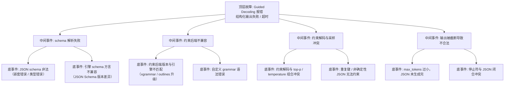

> [!warning] 生产安全提示 · Production Safety
> 本文档含可执行命令/操作步骤。执行前请核对风险等级（🟢低/🔶中/🔴高），高危命令必须 dry-run 并确认回滚方案。完整策略见 [生产安全策略](../../../../治理/Production_Safety_Policy.md)。
<!-- op-safety-banner v1 -->
# FTA: vLLM / SGLang Guided Decoding / 结构化输出报错

> 中文简称：FTA: vLLM / SGLang Guided Decoding 报错

> **一句话理解**: 结构化输出失败时，按「schema 合法性 → 约束后端兼容性 → 采样参数冲突 → 输出截断」四层排查，大部分问题出在 schema 定义与引擎版本不匹配。

---

## 故障树（FTA）



## 问题现象

- 请求带 `response_format` / `guided_json` 时直接报错：`JSON schema validation failed`、`Failed to build grammar`、`Unsupported grammar backend`。
- 输出 JSON 解析失败：字段缺失、格式不完整、被 `finish_reason=length` 截断。
- 约束解码开启后性能大幅下降（正常范围是慢 10-30%，超过则异常）。

## 根因分析

| 根因 | 机制说明 | 适用引擎 |
|------|---------|---------|
| schema 非法 | schema 含未定义类型、非法组合（如 `required` 引用不存在字段） | 两者 |
| 方言不兼容 | vLLM/SGLang 底层约束库对 JSON Schema 支持子集不同，同一 schema 行为不一 | 两者 |
| 后端版本漂移 | xgrammar（SGLang）/ outlines（vLLM）升级后语法树构建行为变化 | 两者 |
| 采样冲突 | 约束解码要求确定性子集，部分采样参数组合下行为未定义或被忽略 | 两者 |
| 长度截断 | `max_tokens` 太小，JSON 未闭合即触发 `finish_reason=length` | 两者 |
| 停止符冲突 | 自定义 stop token 落在 JSON 内部（如提前触发 `}` 结束） | 两者 |

## 诊断步骤

```bash
# 1. 本地验证 schema 合法性（独立于引擎）
python3 -c "
import json, jsonschema
schema = json.load(open('schema.json'))
jsonschema.Draft7Validator.check_schema(schema)
print('schema valid')"   # 🟢 只读，验证定义本身

# 2. 最小复现：去掉 response_format 后是否正常
# 正常 → 问题在约束解码链路；仍异常 → 问题在模型/请求本身

# 3. 检查约束后端版本
pip show xgrammar outlines lm-format-enforcer   # 🟢 只读
```

排查要点：

1. **先验 schema**：用独立 jsonschema 校验器验证定义，排除引擎干扰。
2. **看 finish_reason**：`length` 截断 → 放大 `max_tokens` 或精简 schema；`stop` 截断 → 查停止符冲突。
3. **对比引擎**：同一 schema 在 vLLM（outlines/lm-format-enforcer）与 SGLang（xgrammar）表现不同，多半是方言差异，改用双方都支持的简化 schema。
4. **版本对齐**：约束后端与引擎必须配套升级，禁止单独升级 xgrammar/outlines。
5. **性能异常**：慢 > 30% 时检查是否启用了过于复杂的 schema（深层嵌套、超大 enum）。

## 解决方案

**vLLM**：

```python
# 方案 A: 使用 OpenAI 兼容 response_format（json_schema）
response = client.chat.completions.create(
    model="default",
    messages=[{"role": "user", "content": "返回一个 JSON 对象"}],
    response_format={
        "type": "json_schema",
        "json_schema": {
            "name": "person",
            "schema": {
                "type": "object",
                "properties": {
                    "name": {"type": "string"},
                    "age": {"type": "integer"}
                },
                "required": ["name", "age"]
            }
        }
    },
)

# 方案 B: 后端切换（outlines 不可用时尝试 lm-format-enforcer）
# vllm serve ... --guided-decoding-backend outlines
```

**SGLang**：

```python
# 方案 A: 使用 response_format 内联 schema（xgrammar 后端）
response = client.chat.completions.create(
    model="default",
    messages=[{"role": "user", "content": "返回一个 JSON 对象"}],
    response_format={
        "type": "json_schema",
        "json_schema": {
            "name": "person",
            "schema": {
                "type": "object",
                "properties": {
                    "name": {"type": "string"},
                    "age": {"type": "integer"}
                },
                "required": ["name", "age"]
            }
        }
    },
)
```

**通用方案**：

- schema 简化为标准 JSON Schema（Draft-07 子集）：避免 `oneOf` 深层嵌套、超大 `enum`、`patternProperties` 等易出问题的特性。
- `max_tokens` 按「schema 结构 + 内容长度」估算，预留 1.5-2 倍余量。
- 应用侧兜底：即使约束解码保证语法合法，也保留解析异常重试逻辑。

## 预防措施

- schema 库统一由后端团队维护，变更走评审，避免业务侧随手改 schema 导致兼容性问题。
- 约束后端版本与引擎版本一起锁定（requirements 固定），升级同步验证结构化输出用例。
- 结构化输出用例纳入回归测试：每个 schema 配「合法输入 + 边界输入」测试。
- 监控 `finish_reason=length` 占比，异常升高说明 schema 与 max_tokens 预算失衡。

---

## 交叉引用

- [[10_部署推理/02_推理引擎/29_vLLM_深入分析.md|vLLM_Deep_Dive]]
- [[10_部署推理/02_推理引擎/23_SGLang_深入分析.md|SGLang_Deep_Dive]]
- [[10_部署推理/02_推理引擎/FTA/推理/FTA_vLLM_SGLang_解码延迟高.md|解码延迟高 FTA]]
- [[07_模型训练/07_训练监控/03_模型_故障排查_指南.md|模型问题排查手册]]

*Last updated: 2026-08-13*
