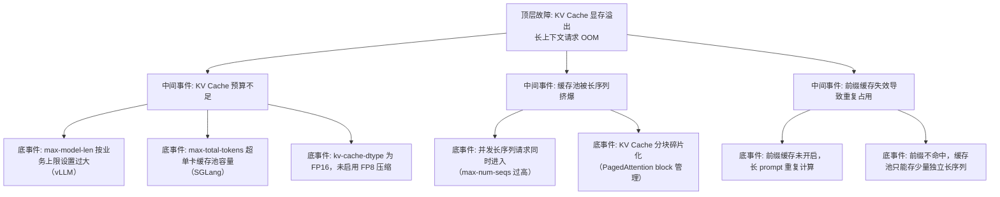

> [!warning] 生产安全提示 · Production Safety
> 本文档含可执行命令/操作步骤。执行前请核对风险等级（🟢低/🔶中/🔴高），高危命令必须 dry-run 并确认回滚方案。完整策略见 [生产安全策略](../../../../治理/Production_Safety_Policy.md)。
<!-- op-safety-banner v1 -->
# FTA: vLLM / SGLang KV Cache 显存溢出（长上下文 OOM）

> 中文简称：FTA: vLLM / SGLang KV Cache 显存溢出 ｜ English: FTA KV Cache Overflow

> **一句话理解**: 长上下文请求把 KV Cache 缓存池撑爆导致 OOM 时，按「长度预算 → 缓存精度 → 前缀复用」三层依次收紧，把缓存池压回安全水位。

---

## 故障树（FTA）



## 问题现象

- 上下文较长的请求（如 32K+ tokens）触发 `CUDA out of memory`，短请求正常。
- 日志出现 KV Cache 分配相关报错，或 `vllm:gpu_cache_usage_perc` 冲顶后请求失败。
- 表现为「请求越长约容易 OOM」，并发上来后最先挂掉的是长上下文请求。

## 根因分析

| 根因 | 机制说明 | 适用引擎 |
|------|---------|---------|
| 长度预算过大 | `max-model-len` 决定缓存池容量，设置过大直接撑爆单卡显存 | vLLM |
| 总 token 超限 | `--max-total-tokens` 超缓存池容量，长序列入队即失败 | SGLang |
| 精度未压缩 | FP16 KV Cache 每 token 需 2 × layers × heads × dim × 2B；FP8 可省约 50% | 两者 |
| 并发长序列 | 每条长序列独占大量 block，N 条并发 = N 倍缓存占用 | 两者 |
| 碎片化 | PagedAttention 按 block（默认 16 token）分配，极端长度下碎片累积 | vLLM |
| 前缀未复用 | RAG/多轮场景不开前缀缓存，相同 system prompt 反复 prefill | 两者 |

## 诊断步骤

```bash
# 1. 计算 KV Cache 理论占用（对照显存上限判断预算）
# 单序列 KV 占用 ≈ 2 × layers × kv_heads × head_dim × seq_len × bytes

# 2. 查看 vLLM 启动日志中的缓存池信息（打印了缓存大小与比例）
# 启动时日志: "GPU KV cache size: xxx GiB"

# 3. 观察监控指标
# vLLM: vllm:gpu_cache_usage_perc（> 90% 预警）
# SGLang: sglang:token_usage、sglang:cache_hit_rate
```

排查要点：

1. **区分触发条件**：单条长请求 OOM 还是并发后才 OOM？前者指向 `max-model-len` 预算，后者指向并发 × 长度乘积。
2. **看缓存池水位**：`gpu_cache_usage_perc` 若在长请求到达时从 60% 跳升到 100%，即为缓存池耗尽。
3. **验证前缀命中**：RAG 场景 `cache_hit_rate` 偏低，说明重复前缀未复用，缓存被重复计算浪费。
4. **试 FP8**：临时以 `--kv-cache-dtype fp8` 启动，观察缓存池容量是否翻倍（确认是容量问题）。

## 解决方案

**vLLM**：

```bash
# 方案 A: 按业务实际需求收紧长度预算
python -m vllm.entrypoints.openai.api_server \
    --model meta-llama/Llama-3.1-70B-Instruct \
    --max-model-len 8192 \
    --gpu-memory-utilization 0.90

# 方案 B: KV Cache 降精度，缓存池容量近似翻倍
python -m vllm.entrypoints.openai.api_server \
    --model meta-llama/Llama-3.1-70B-Instruct \
    --kv-cache-dtype fp8

# 方案 C: 开启前缀缓存，长 prompt 共享前缀只存一份
python -m vllm.entrypoints.openai.api_server \
    --model meta-llama/Llama-3.1-70B-Instruct \
    --enable-prefix-caching
```

**SGLang**：

```bash
# 方案 A: 限制总 token 预算（低于缓存池容量）
python -m sglang.launch_server \
    --model-path meta-llama/Meta-Llama-3.1-70B-Instruct \
    --max-total-tokens 16384 \
    --mem-fraction-static 0.85

# 方案 B: 保持 RadixAttention 开启（默认），长 prompt 前缀复用
python -m sglang.launch_server \
    --model-path meta-llama/Meta-Llama-3.1-70B-Instruct \
    --enable-radix-attn
```

**通用方案**：

- 长上下文与短请求分离部署：长上下文实例独立配置更大的缓存预算。
- 多卡 TP 分摊：`--tensor-parallel-size 2` 让每卡缓存池减半。
- 应用侧限流：对超长 prompt 做截断或摘要，从源头控制序列长度。

## 预防措施

- 按「缓存池容量 = 显存预算 − 权重 − 激活 − 余量」反推 `max-model-len`，勿直接按模型宣称的最大长度配置。
- KV Cache 水位与请求长度分布挂钩告警：`gpu_cache_usage_perc` > 90% 且出现长请求时立即扩容或限流。
- RAG/多轮对话务必开启前缀缓存（vLLM `--enable-prefix-caching` / SGLang 默认 RadixAttention），并监控命中率。
- 长上下文场景优先 FP8 KV Cache，容量与带宽双收益。

---

## 交叉引用

- [[10_部署推理/02_推理引擎/29_vLLM_深入分析.md|vLLM_Deep_Dive]]
- [[10_部署推理/02_推理引擎/23_SGLang_深入分析.md|SGLang_Deep_Dive]]
- [[10_部署推理/02_推理引擎/FTA/推理/FTA_vLLM_SGLang_推理_OOM.md|推理 OOM FTA]]
- [[07_模型训练/07_训练监控/03_模型_故障排查_指南.md|模型问题排查手册]]

*Last updated: 2026-08-28*
