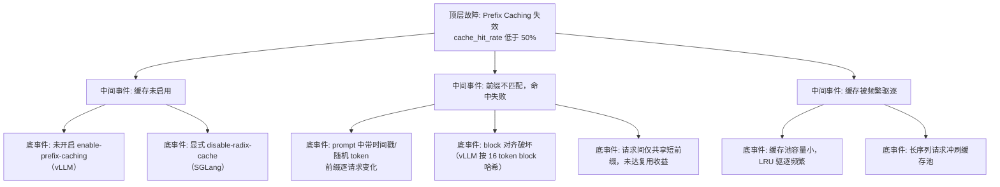

> [!warning] 生产安全提示 · Production Safety
> 本文档含可执行命令/操作步骤。执行前请核对风险等级（🟢低/🔶中/🔴高），高危命令必须 dry-run 并确认回滚方案。完整策略见 [生产安全策略](../../../../治理/Production_Safety_Policy.md)。
<!-- op-safety-banner v1 -->
# FTA: vLLM / SGLang Prefix Caching 失效（命中率低）

> 中文简称：FTA: vLLM / SGLang Prefix Caching 失效

> **一句话理解**: 前缀缓存命中率跌破 50% 时，优先怀疑「前缀本身不一致」——时间戳、随机 token、block 对齐与缓存开关是四大检查点。

---

## 故障树（FTA）



## 问题现象

- `sglang:cache_hit_rate`（SGLang）长期低于 50%，vLLM 前缀缓存日志中命中数极少。
- RAG/多轮对话场景 TTFT 无改善，重复 system prompt 仍全量 prefill。
- 显存占用高但吞吐未受益——缓存池里存了却用不上。

## 根因分析

| 根因 | 机制说明 | 适用引擎 |
|------|---------|---------|
| 缓存未启用 | vLLM 默认关闭 `enable-prefix-caching`；SGLang 被显式 `--disable-radix-cache` | 两者 |
| 前缀不一致 | system prompt 中嵌入时间戳/随机 ID/会话变量，每次请求 token 序列都不同 | 两者 |
| block 对齐破坏 | vLLM 按 block（16 token）哈希匹配，任何 token 差异使后续 block 全部失配 | vLLM |
| 前缀过短 | 共享前缀不足一个 block 或收益阈值，命中但无加速价值 | 两者 |
| LRU 驱逐 | 缓存池容量受 `gpu-memory-utilization` 约束，被长序列持续冲刷 | 两者 |
| 对话不连续 | 多轮对话未携带历史消息，前缀无复用机会 | 两者 |

## 诊断步骤

```bash
# 1. 看命中率指标
# SGLang: sglang:cache_hit_rate；vLLM: 日志中 prefix cache hit 计数

# 2. 抓取实际请求前缀做对比（hexdump / tokenize 对比）
# 连续两次发送相同 system prompt，检查 token 序列是否完全一致

# 3. 检查请求构造
# 确认 prompt 中无时间戳、随机数、trace_id 等动态内容
```

排查要点：

1. **确认开关**：vLLM 是否传了 `--enable-prefix-caching`；SGLang 是否误加 `--disable-radix-cache`。
2. **对比 token 流**：用同一 system prompt 发两次请求，比对 token id 序列；任何差异都导致后续全失配。
3. **看缓存池大小**：`gpu-memory-utilization` 过低时缓存池小，长序列一来缓存被清空。
4. **验证收益场景**：只有多轮对话/RAG（重复长前缀）才有收益，短随机 prompt 命中率低属正常。

## 解决方案

**vLLM**：

```bash
# 方案 A: 显式开启前缀缓存
python -m vllm.entrypoints.openai.api_server \
    --model meta-llama/Llama-3.1-8B-Instruct \
    --enable-prefix-caching

# 方案 B: 应用侧固定 prompt 模板，动态内容后置
# 正确: [固定 system prompt + 固定指令] + [用户 query]
# 错误: [固定 system prompt + 当前时间] + [用户 query]
```

**SGLang**：

```bash
# 方案 A: 确认 RadixAttention 开启（默认），勿传 --disable-radix-cache
python -m sglang.launch_server \
    --model-path meta-llama/Meta-Llama-3.1-8B-Instruct \
    --enable-radix-attn

# 方案 B: 提高缓存池可用显存（mem-fraction-static 0.85-0.90）
python -m sglang.launch_server \
    --model-path meta-llama/Meta-Llama-3.1-8B-Instruct \
    --mem-fraction-static 0.88
```

**通用方案**：

- 应用层改造：system prompt 完全静态化，所有动态内容（时间、ID、检索结果）放到用户消息段。
- 会话缓存策略：多轮对话把历史消息原样回传（SGLang 的 RadixAttention 对任意长度前缀匹配更宽容，vLLM 需 block 对齐）。
- 对 RAG 场景，文档块顺序固定化，避免每次检索顺序不同导致前缀漂移。

## 预防措施

- 将 `cache_hit_rate` 纳入 RAG/多轮业务的核心可观测指标，低于 50% 触发 prompt 模板审查。
- 建立 prompt 模板规范：静态前缀 + 动态后缀，禁止动态内容插入前缀区。
- 定期用双请求对比脚本巡检命中率，防止应用侧改动悄悄破坏前缀一致性。
- 缓存容量与业务特征匹配：前缀复用越高的业务，越要预留足够缓存池。

---

## 交叉引用

- [[10_部署推理/02_推理引擎/29_vLLM_深入分析.md|vLLM_Deep_Dive]]
- [[10_部署推理/02_推理引擎/23_SGLang_深入分析.md|SGLang_Deep_Dive]]
- [[10_部署推理/02_推理引擎/FTA/推理/FTA_vLLM_SGLang_TTFT_抖动.md|TTFT 抖动 FTA]]
- [[10_部署推理/02_推理引擎/FTA/推理/FTA_vLLM_SGLang_KV_Cache_溢出.md|KV Cache 溢出 FTA]]

*Last updated: 2026-08-13*
