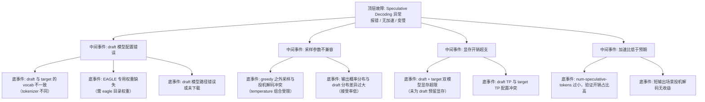

> [!warning] 生产安全提示 · Production Safety
> 本文档含可执行命令/操作步骤。执行前请核对风险等级（🟢低/🔶中/🔴高），高危命令必须 dry-run 并确认回滚方案。完整策略见 [生产安全策略](../../../../治理/Production_Safety_Policy.md)。
<!-- op-safety-banner v1 -->
# FTA: vLLM / SGLang Speculative Decoding 异常（无加速 / 报错）

> 中文简称：FTA: vLLM / SGLang Speculative Decoding 异常

> **一句话理解**: 投机解码不上速或报错时，按「draft 模型匹配性 → 采样兼容性 → 显存开销 → 加速比验证」四层排查，draft 与 target 的 vocab 一致性是首要检查点。

---

## 故障树（FTA）



## 问题现象

- 启动报错：`Speculative decoding requires vocab size matching`、EAGLE 权重加载失败、draft 模型不存在。
- 服务正常但吞吐/延迟与关闭投机解码时无差异，甚至更慢。
- 显存占用明显升高（双模型），出现 OOM 或 `gpu_cache_usage_perc` 下降。

## 根因分析

| 根因 | 机制说明 | 适用引擎 |
|------|---------|---------|
| vocab 不一致 | draft 与 target 使用不同 tokenizer（词表不同），无法逐位置对齐验证 | 两者 |
| EAGLE 权重缺失 | EAGLE 需要专用 draft 权重（含特征层），普通小模型不适用 | SGLang |
| 采样冲突 | 投机解码在高 temperature / 非 greedy 下接受率显著下降 | 两者 |
| 显存超支 | draft 与 target 同时驻留显存，KV Cache 池被压缩 | 两者 |
| 接受率低 | draft 与 target 能力差距大，预测命中率低，验证开销白费 | 两者 |
| 步数不匹配 | `num-speculative-tokens` 过大（如 > 8）时接受率衰减，验证成本上升 | 两者 |
| 场景不匹配 | 短输出（几十 token）场景投机解码收益被固定开销吞掉 | 两者 |

## 诊断步骤

```bash
# 1. 确认 draft 与 target 的 tokenizer 一致（vocab 对齐）
# 对比两个模型的 tokenizer.json 的 vocab size 与 special tokens

# 2. 查看启动日志中的投机解码配置
# 确认 draft 模型加载成功、每步投机 token 数生效

# 3. 加速比 A/B 验证
# 同一请求分别开启/关闭投机解码，对比 TPOT 与吞吐

# 4. 检查显存分配
# nvidia-smi 观察双模型是否导致 KV Cache 池收缩 🟢
```

排查要点：

1. **vocab 对齐**：draft 与 target 必须同 tokenizer（同词表）；跨词表（如 Qwen draft + Llama target）直接不可用。
2. **看接受率**：引擎日志/metrics 有接受率指标（vLLM `speculative_acceptance`）；持续 < 50% 说明 draft 选型不当。
3. **看加速比**：短输出、低并发场景先算理论收益（`num-speculative-tokens` × 接受率），不划算就不开。
4. **EAGLE 专项**：SGLang 的 EAGLE 必须用带 EAGLE 头的专用权重，普通小模型只能配非 EAGLE 算法。
5. **显存核查**：draft 模型占用未预留时，KV Cache 池变小，长上下文反而更差。

## 解决方案

**vLLM**：

```bash
# 方案 A: 选择同 tokenizer 家族的 draft 模型（8B draft + 70B target）
python -m vllm.entrypoints.openai.api_server \
    --model meta-llama/Llama-3.1-70B-Instruct \
    --speculative-model meta-llama/Llama-3.1-8B-Instruct \
    --num-speculative-tokens 5 \
    --tensor-parallel-size 4

# 方案 B: draft 单独 TP 配置，避免显存挤占
# --speculative-draft-tensor-parallel-size 1（draft 不跨卡）

# 方案 C: 低接受率时减少投机步数或回退 greedy
# --num-speculative-tokens 3；temperature 固定 0 或低值
```

**SGLang**：

```bash
# 方案 A: EAGLE 投机解码（必须使用专用 EAGLE 权重）
python -m sglang.launch_server \
    --model-path meta-llama/Meta-Llama-3.1-70B-Instruct \
    --speculative-algorithm EAGLE \
    --speculative-draft-model-path meta-llama/Meta-Llama-3.1-8B-Instruct \
    --speculative-num-steps 5 \
    --speculative-eagle-topk 4 \
    --tp 4

# 方案 B: 无 EAGLE 权重时改用标准 draft 路径（非 EAGLE 算法）
# 移除 --speculative-algorithm EAGLE，仅提供 draft 模型路径
```

**通用方案**：

- 选型规则：draft 与 target 同家族（词表一致）、参数比约 1/8-1/10、能力不能太弱（接受率才有保障）。
- 采样收敛：投机解码优先配低 temperature（≤ 0.3）或 greedy，高随机性场景收益低。
- 场景甄别：长文本生成（1K+ tokens）、高并发 decode 收益最大；短输出关闭。

## 预防措施

- 投机解码上线前跑「开/关 A/B 压测」，以实测加速比（目标 ≥ 1.3×）为准，不凭理论值。
- 将接受率纳入监控（vLLM 有对应 metric），接受率跌破阈值触发 draft 模型评估。
- draft 模型随 target 一起版本化，target 升级必须重新验证 draft 兼容性。
- 显存预算提前计入 draft：`gpu-memory-utilization` 需覆盖双模型 + KV Cache。

---

## 交叉引用

- [[10_部署推理/02_推理引擎/29_vLLM_深入分析.md|vLLM_Deep_Dive]]
- [[10_部署推理/02_推理引擎/23_SGLang_深入分析.md|SGLang_Deep_Dive]]
- [[10_部署推理/03_推理优化/12_Speculative_Decoding_高级_2026.md|投机解码]]
- [[10_部署推理/02_推理引擎/FTA/推理/FTA_vLLM_SGLang_解码延迟高.md|解码延迟高 FTA]]

*Last updated: 2026-08-13*
