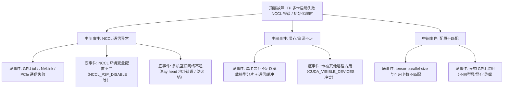

> [!warning] 生产安全提示 · Production Safety
> 本文档含可执行命令/操作步骤。执行前请核对风险等级（🟢低/🔶中/🔴高），高危命令必须 dry-run 并确认回滚方案。完整策略见 [生产安全策略](../../../../治理/Production_Safety_Policy.md)。
<!-- op-safety-banner v1 -->
# FTA: vLLM / SGLang Tensor Parallel 多卡启动失败（NCCL）

> 中文简称：FTA: vLLM / SGLang TP 多卡启动失败 ｜ English: FTA Tensor Parallel Failure

> **一句话理解**: TP 多卡启动失败九成是 NCCL 通信问题——先查 GPU 互连（NVLink）与 NCCL 环境变量，再查 TP 规模与卡数匹配，最后查 Ray 集群状态。

---

## 故障树（FTA）



## 问题现象

- 启动卡在初始化阶段：`NCCL error`、`Timed out waiting for rank`、`Failed to initialize NCCL communicator`、`AllReduce failed`。
- 日志中 rank 之间握手失败，进程启动后快速退出，K8s 下表现为 CrashLoopBackOff。
- 单卡（TP=1）启动正常，一旦 TP≥2 就失败——基本锁定通信问题。

## 根因分析

| 根因 | 机制说明 | 适用引擎 |
|------|---------|---------|
| 互连缺失 | TP 依赖 GPU 间高带宽通信，PCIe 直连（无 NVLink）时通信易超时 | 两者 |
| NCCL 环境 | `NCCL_P2P_DISABLE=1` 或 `NCCL_SOCKET_IFNAME` 配置错误阻断通信 | 两者 |
| 多机网络 | Ray 集群节点间端口不通（GCS 6379、NCCL 动态端口） | 两者 |
| 卡数不匹配 | TP=8 但节点只有 4 卡，或 `CUDA_VISIBLE_DEVICES` 只暴露部分卡 | 两者 |
| 资源冲突 | 其他进程占用目标卡，rank 初始化时显存不足 | 两者 |
| 异构混插 | 不同算力/显存的卡混插导致分片失败或慢卡拖垮通信 | 两者 |

## 诊断步骤

```bash
# 1. 确认可见卡与互连拓扑
nvidia-smi   # 检查 GPU 数量、型号、显存 🟢

# 2. 查看 NVLink 拓扑（H100/A100 等）
nvidia-smi topo -m   # 看 PIX/PXB/NV 互连等级 🟢 只读

# 3. 检查 NCCL 环境变量
env | grep NCCL   # 🟢 只读

# 4. 单卡验证（排除模型问题）
# TP=1 启动成功 → 问题在通信；TP=1 也失败 → 模型/显存问题

# 5. 多机场景检查 Ray 集群
ray status   # 🟢 只读，确认节点数与 GPU 数
```

排查要点：

1. **确认卡数**：`nvidia-smi` 可用卡数 ≥ `--tensor-parallel-size`，且 `CUDA_VISIBLE_DEVICES` 未隐藏卡。
2. **看拓扑**：`topo -m` 显示 PIX/NV 为佳；PCIe 互联（PXB/SYS）需调小 TP 或开启 NCCL 通信优化。
3. **查 NCCL 变量**：确认未误设 `NCCL_P2P_DISABLE=1`；多机场景确认 `NCCL_SOCKET_IFNAME` 指向真实网卡。
4. **同构校验**：混插不同型号卡时建议按型号分组部署或改 PP/DP。
5. **看日志顺序**：NCCL 握手超时（timeout）多为网络/防火墙；AllReduce 报错多为互连带宽或驱动问题。

## 解决方案

**vLLM**：

```bash
# 方案 A: 显式指定 TP 规模并确认卡数匹配
python -m vllm.entrypoints.openai.api_server \
    --model meta-llama/Llama-3.1-70B-Instruct \
    --tensor-parallel-size 4 \
    --port 8000

# 方案 B: PCIe 互联场景关闭 P2P 直连（NCCL 走共享内存/网络兜底）
NCCL_P2P_DISABLE=1 python -m vllm.entrypoints.openai.api_server \
    --model meta-llama/Llama-3.1-70B-Instruct \
    --tensor-parallel-size 2

# 方案 C: 多机指定 Ray 地址
ray start --head   # head 节点
ray start --address="<head-ip>:6379"   # worker 节点
```

**SGLang**：

```bash
# 方案 A: 指定 TP 与多机地址
python -m sglang.launch_server \
    --model-path meta-llama/Meta-Llama-3.1-70B-Instruct \
    --tensor-parallel-size 4 \
    --port 30000

# 方案 B: 多机（Ray backend）
python -m sglang.launch_server \
    --model-path meta-llama/Meta-Llama-3.1-405B-Instruct \
    --tp 8 \
    --dist-init-addr "head-ip:6379" \
    --nnodes 2
```

**通用方案**：

- 多机场景放通 NCCL 通信端口（GCS 6379 + NCCL 动态端口段），并核对 `NCCL_SOCKET_IFNAME`。
- 异构 GPU 按型号分组部署，避免混插；必要时降级为 Data Parallel。
- 检查 `--ipc=host`（Docker 共享内存不足会引发 NCCL 失败）。

## 预防措施

- 部署前用 `nvidia-smi topo -m` 校验互连拓扑，TP 规模与 NVLink 域匹配。
- 多卡配置模板中显式固化 `CUDA_VISIBLE_DEVICES` 与 TP 规模，防止调度漂移。
- 容器化部署固定 `--ipc=host` 与 NCCL 环境变量，避免共享内存与 socket 默认值踩坑。
- 建立「TP 启动 smoke test」：每次升级引擎/驱动后先跑一次多卡最小启动。

---

## 交叉引用

- [[10_部署推理/02_推理引擎/29_vLLM_深入分析.md|vLLM_Deep_Dive]]
- [[10_部署推理/02_推理引擎/23_SGLang_深入分析.md|SGLang_Deep_Dive]]
- [[10_部署推理/02_推理引擎/FTA/微调/FTA_vLLM_SGLang_分布式训练中断.md|分布式训练中断 FTA]]
- [[07_模型训练/07_训练监控/03_模型_故障排查_指南.md|模型问题排查手册]]

*Last updated: 2026-08-28*
