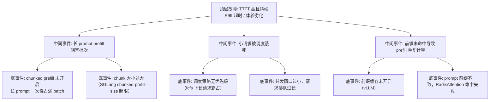

> [!warning] 生产安全提示 · Production Safety
> 本文档含可执行命令/操作步骤。执行前请核对风险等级（🟢低/🔶中/🔴高），高危命令必须 dry-run 并确认回滚方案。完整策略见 [生产安全策略](../../../../治理/Production_Safety_Policy.md)。
<!-- op-safety-banner v1 -->
# FTA: vLLM / SGLang TTFT 高且抖动（长 prompt 阻塞）

> 中文简称：FTA: vLLM / SGLang TTFT 高且抖动 ｜ English: FTA TTFT Jitter

> **一句话理解**: 首 token 时间忽高忽低时，核心矛盾是长 prefill 与 decode 抢资源，chunked prefill 与调度策略是把抖动压平的两种主要手段。

---

## 故障树（FTA）



## 问题现象

- `vllm:time_to_first_token_seconds` P99 超过 2 秒（监控建议阈值），且波动大。
- 同样的请求，有时几百毫秒返回，有时数秒；长 prompt 请求越多越明显。
- 交互式应用（聊天/流式输出）体感「先卡一下再出字」，并发高峰时尤其严重。

## 根因分析

| 根因 | 机制说明 | 适用引擎 |
|------|---------|---------|
| prefill 独占批次 | 未开 chunked prefill 时，4K+ tokens 的 prefill 一次性执行，decode 全部等待 | 两者 |
| chunk 过大 | `--chunked-prefill-size` 设到 8192+，等效于没分块 | SGLang |
| 调度无优先级 | fcfs 策略下长请求先到先得，短请求与交互请求被排在后面 | 两者 |
| 前缀未复用 | 相同 system prompt 反复 prefill，每次都从零算起，TTFT 翻倍 | 两者 |
| 高并发排队 | 并发超过批容量时请求进入 waiting 队列，TTFT 叠加排队时间 | 两者 |

## 诊断步骤

```bash
# 1. 拆分 TTFT 构成：排队时间 vs prefill 计算时间
# vLLM: vllm:time_to_first_token_seconds + vllm:num_requests_waiting
# 若 waiting 指标高 → 并发/调度问题；否则 → prefill 计算问题

# 2. 对比长/短请求 TTFT
# 短请求也慢 → 调度或排队问题；仅长请求慢 → prefill 阻塞问题

# 3. 观察 cache_hit_rate（SGLang）/ 前缀命中日志（vLLM）
# 命中率低说明前缀复用失效，prefill 负担重
```

排查要点：

1. **看 waiting 队列**：`num_requests_waiting` 持续 > 10，先解决并发与调度，再谈 prefill 优化。
2. **看请求长度分布**：TTFT 抖动是否与长 prompt 请求同频出现。
3. **看缓存命中**：RAG/多轮场景命中率低，优先修前缀一致性与缓存开关。
4. **验证 chunked prefill**：临时开启后观察 TTFT P99 是否收敛。

## 解决方案

**vLLM**：

```bash
# 方案 A: 开启 chunked prefill，长 prompt 分块与 decode 交错
python -m vllm.entrypoints.openai.api_server \
    --model meta-llama/Llama-3.1-8B-Instruct \
    --enable-chunked-prefill \
    --max-num-batched-tokens 4096

# 方案 B: 前缀缓存加速重复前缀（RAG/多轮必开）
python -m vllm.entrypoints.openai.api_server \
    --model meta-llama/Llama-3.1-8B-Instruct \
    --enable-prefix-caching

# 方案 C: latency 敏感场景用 priority 调度
# --scheduling-policy priority（配合请求优先级）
```

**SGLang**：

```bash
# 方案 A: 显式配置 chunked prefill（1024-4096 推荐）
python -m sglang.launch_server \
    --model-path meta-llama/Meta-Llama-3.1-8B-Instruct \
    --chunked-prefill-size 2048

# 方案 B: 用最短剩余时间优先调度，交互请求更快响应
python -m sglang.launch_server \
    --model-path meta-llama/Meta-Llama-3.1-8B-Instruct \
    --schedule-policy srtf

# 方案 C: 保持 RadixAttention 开启，重复前缀直接命中
```

**通用方案**：

- 交互式业务与批处理业务拆分实例部署，避免互相干扰。
- 应用侧对超长 prompt 提前截断/摘要，控制 prefill 体积。
- 高并发场景扩容副本（K8s HPA），缩短排队时间。

## 预防措施

- TTFT P99 与 `num_requests_waiting`、请求长度分布共同告警，避免只看单一指标误判。
- RAG/多轮场景强制开启前缀缓存并每周核查命中率。
- 长 prompt 场景把 chunked prefill 写入标准部署模板，而非出了问题再补。
- 交互式场景预留独立资源池，与离线批处理物理隔离。

---

## 交叉引用

- [[10_部署推理/02_推理引擎/29_vLLM_深入分析.md|vLLM_Deep_Dive]]
- [[10_部署推理/02_推理引擎/23_SGLang_深入分析.md|SGLang_Deep_Dive]]
- [[10_部署推理/02_推理引擎/FTA/推理/FTA_vLLM_SGLang_吞吐量异常.md|吞吐量异常 FTA]]
- [[10_部署推理/02_推理引擎/FTA/推理/FTA_vLLM_SGLang_Prefix_Caching_失效.md|Prefix Caching 失效 FTA]]

*Last updated: 2026-08-28*
