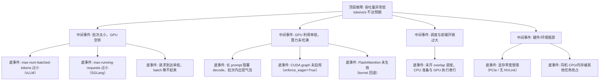

> [!warning] 生产安全提示 · Production Safety
> 本文档含可执行命令/操作步骤。执行前请核对风险等级（🟢低/🔶中/🔴高），高危命令必须 dry-run 并确认回滚方案。完整策略见 [生产安全策略](../../../../治理/Production_Safety_Policy.md)。
<!-- op-safety-banner v1 -->
# FTA: vLLM / SGLang 吞吐量异常低

> 中文简称：FTA: vLLM / SGLang 吞吐量异常低

> **一句话理解**: 吞吐量上不去时，按「批大小 → GPU 利用率 → 调度开销 → 硬件瓶颈」四层逐级排查，先放大批再抠细节，避免在错误层浪费时间。

---

## 故障树（FTA）



## 问题现象

- 吞吐指标（`vllm:generation_tokens_total` / `sglang:gen_throughput`）远低于同硬件基准（如 H100 上 8B 模型应达 15,000+ tok/s）。
- `nvidia-smi` 显示 GPU 利用率（SM%）长期低于 60%，显存带宽利用率低。
- 并发上来后吞吐不升反降，或 P99 延迟与吞吐同时恶化。

## 根因分析

| 根因 | 机制说明 | 适用引擎 |
|------|---------|---------|
| 批预算过小 | `max-num-batched-tokens` / `max-num-seqs` 限制批次容量，GPU 吃不满 | vLLM |
| 并发窗口过小 | `max-running-requests` 太小，SGLang 批内序列数不足 | SGLang |
| 长 prompt 阻塞 | 长 prefill 独占批次，decode 请求空等（chunked prefill 未开） | 两者 |
| CUDA graph 未启用 | `enforce_eager=True`（调试遗留）关闭图捕获，kernel 启动开销大 | vLLM |
| 调度串行 | 未启用 overlap scheduling，CPU 准备批次与 GPU 执行无法重叠 | SGLang |
| 通信瓶颈 | 多卡 TP 时 PCIe 带宽不足 / NVLink 未连通，通信占比高 | 两者 |

## 诊断步骤

```bash
# 1. 看 GPU 利用率（SM% 与显存带宽%）
nvidia-smi   # 利用率持续 < 60% 说明批太小或 kernel 开销大 🟢

# 2. 看引擎指标
# vLLM: vllm:num_requests_running、gpu_cache_usage_perc
# SGLang: sglang:num_running_reqs、sglang:gen_throughput

# 3. 压测定位（用基准请求打满并发）
# 记录不同并发（1/16/64/256）下的吞吐曲线，观察拐点
```

排查要点：

1. **压测定基线**：低并发下吞吐线性增长、高并发后增速放缓属正常；若 8 并发就封顶，优先查批预算。
2. **看利用率**：SM 利用率低 → 批次或 kernel 问题；SM 高但吞吐低 → 显存带宽或通信瓶颈。
3. **看序列组成**：批次内若有大量超长 prefill，TTFT 与吞吐会互相拖累，应开 chunked prefill。
4. **核对调试参数**：检查是否残留 `enforce_eager=True` 等调试配置。
5. **对比基准**：对照同型号 GPU 的官方 benchmark（如 H100 8B 15K+ tok/s），确认是配置问题还是硬件问题。

## 解决方案

**vLLM**：

```bash
# 方案 A: 放大批预算（吞吐优先场景）
python -m vllm.entrypoints.openai.api_server \
    --model meta-llama/Llama-3.1-8B-Instruct \
    --max-num-batched-tokens 32768 \
    --max-num-seqs 256 \
    --gpu-memory-utilization 0.90

# 方案 B: 确认 CUDA graph 启用（不要加 enforce_eager）
# 默认启用；调试完成后必须移除 enforce_eager=True

# 方案 C: 长 prompt 场景开 chunked prefill，消除批次内气泡
python -m vllm.entrypoints.openai.api_server \
    --model meta-llama/Llama-3.1-8B-Instruct \
    --enable-chunked-prefill
```

**SGLang**：

```bash
# 方案 A: 提高并发窗口与调度效率
python -m sglang.launch_server \
    --model-path meta-llama/Meta-Llama-3.1-8B-Instruct \
    --max-running-requests 128 \
    --max-total-tokens 32768

# 方案 B: 确认 RadixAttention 与 overlap 调度开启（默认）
# overlap scheduling 默认开启，勿通过 --disable-overlap-schedule 关闭
```

**通用方案**：

- 长 prompt 场景开 chunked prefill（vLLM `--enable-chunked-prefill` / SGLang `--chunked-prefill-size 1024-4096`）。
- 多卡场景核对 NVLink 状态；PCIe 互联时调小 TP 规模或改用数据并行。
- 量化（AWQ/INT8）可缓解显存带宽瓶颈型吞吐受限。

## 预防措施

- 上线前用标准压测脚本建立基线，固化「并发 × 吞吐」曲线作为回归参考。
- 吞吐类指标与请求特征（平均 prompt 长度、并发数）联动告警，避免误报。
- 生产参数与调试参数分离管理，禁止 `enforce_eager=True` 等调试配置流入生产。
- 大模型（70B+）优先 TP 部署并确认 NVLink，避免 PCIe 通信成为吞吐天花板。

---

## 交叉引用

- [[10_部署推理/02_推理引擎/29_vLLM_深入分析.md|vLLM_Deep_Dive]]
- [[10_部署推理/02_推理引擎/23_SGLang_深入分析.md|SGLang_Deep_Dive]]
- [[10_部署推理/02_推理引擎/FTA/推理/FTA_vLLM_SGLang_TTFT_抖动.md|TTFT 抖动 FTA]]
- [[07_模型训练/07_训练监控/03_模型_故障排查_指南.md|模型问题排查手册]]

*Last updated: 2026-08-13*
