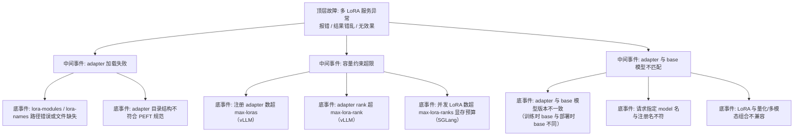

> [!warning] 生产安全提示 · Production Safety
> 本文档含可执行命令/操作步骤。执行前请核对风险等级（🟢低/🔶中/🔴高），高危命令必须 dry-run 并确认回滚方案。完整策略见 [生产安全策略](../../../../治理/Production_Safety_Policy.md)。
<!-- op-safety-banner v1 -->
# FTA: vLLM / SGLang 多 LoRA 服务冲突 / 加载异常

> 中文简称：FTA: vLLM / SGLang 多 LoRA 服务冲突 ｜ English: FTA Multi-LoRA Conflict

> **一句话理解**: 多 LoRA 服务出问题时，先确认「adapter 是否真的加载成功」，再看 rank 上限、base 模型一致性、并发 adapter 数量这三个容量约束。

---

## 故障树（FTA）



## 问题现象

- 请求指定 LoRA 名称时报 `LoRA not found` / `Unknown model`，或静默回退到 base 模型（输出无微调特征）。
- 加载时报 rank 超限、显存不足等错误，多 adapter 同时使用（如 sft + rlhf 混合批）时崩溃。
- 同一 adapter 在不同引擎（vLLM / SGLang）加载行为不一致，部分请求生效部分不生效。

## 根因分析

| 根因 | 机制说明 | 适用引擎 |
|------|---------|---------|
| 路径/格式错误 | `--lora-modules name=path` 路径不可达，或 adapter 目录缺 `adapter_config.json` | vLLM |
| rank 超限 | adapter 训练 rank（如 64）超过 `--max-lora-rank`（默认 16/32）即拒绝加载 | vLLM |
| 注册数超限 | 注册 adapter 总数超过 `--max-loras` | vLLM |
| 显存预算不足 | SGLang `--max-lora-ranks` 决定 LoRA 权重显存池，rank 总和超限则排队/失败 | SGLang |
| base 不一致 | 训练时 LoRA 挂在 Llama-3.1-8B，部署时 base 是 8B-Instruct，权重映射错位 | 两者 |
| 名称不匹配 | 请求 `model="sft"` 但注册名为 `sft-v1`，引擎找不到对应 adapter | 两者 |
| 组合不兼容 | AWQ 量化 + LoRA 或某些多模态架构对 LoRA 支持不完整 | 两者 |

## 诊断步骤

```bash
# 1. 验证 adapter 文件完整性（adapter_config.json + adapter_model.safetensors）
ls -la /path/to/adapter/   # 🟢 只读

# 2. 查看启动日志中的 LoRA 注册信息
# vLLM: 启动时打印 "Loading LoRA modules: [sft, rlhf]"
# SGLang: 启动时打印 LoRA 加载记录

# 3. 直接调用验证
curl http://localhost:8000/v1/chat/completions \
  -H "Content-Type: application/json" \
  -d '{"model": "sft", "messages": [{"role": "user", "content": "hi"}]}'
# 观察返回是 LoRA 效果还是 base 效果（用微调特征问题验证）
```

排查要点：

1. **先看注册**：启动日志是否确认 adapter 注册成功；失败则查路径与格式。
2. **再查 rank**：`adapter_config.json` 中 `r` 是否 ≤ 引擎 `max-lora-rank`。
3. **核对 base**：adapter 的 `base_model_name_or_path` 与部署模型是否一致（含 Instruct 后缀差异）。
4. **看并发**：混合批（同一 batch 多个不同 adapter）是否触发显存错误；必要时减小 `max-loras`/`max-lora-ranks` 或减少并发。
5. **隔离验证**：单独只注册一个 adapter 测试，区分「adapter 本身坏」与「多 adapter 互斥」。

## 解决方案

**vLLM**：

```bash
# 方案 A: 完整注册并放宽 rank 上限
python -m vllm.entrypoints.openai.api_server \
    --model meta-llama/Llama-3.1-8B-Instruct \
    --enable-lora \
    --lora-modules sft=/models/sft-adapter rlhf=/models/rlhf-adapter \
    --max-loras 8 \
    --max-lora-rank 64

# 方案 B: 确认请求 model 名与注册名一致
# curl 请求中 model="sft" 必须与 --lora-modules 的注册名完全匹配
```

**SGLang**：

```bash
# 方案 A: 显式声明 LoRA 并预留显存
python -m sglang.launch_server \
    --model-path meta-llama/Meta-Llama-3.1-8B-Instruct \
    --max-lora-ranks 8 \
    --lora-names base,sft,rlhf

# 方案 B: 请求时按注册名指定
# curl 请求中 model="sft" 对应 --lora-names 中注册名
```

**通用方案**：

- 训练时记录 base 模型精确版本（含 revision/hash），部署时严格复用同一 base。
- 统一 adapter 目录规范：`adapter_config.json` + `adapter_model.safetensors`，缺失即拒载。
- 多 adapter 场景先单测每个 adapter，再测混合批，逐步加并发。

## 预防措施

- 把「adapter 版本 × base 模型版本」的映射表纳入发布清单，任何一侧升级都触发回归测试。
- 启动参数固化：`max-lora-rank` 取业务最大 rank，`max-loras` 按实际注册数 + 余量。
- 监控请求中 model 字段分布，发现未知 model 名（静默回退 base）立即告警。
- 定期用代表性 prompt 抽查各 adapter 输出，防止静默失效（加载成功但效果漂移）。

---

## 交叉引用

- [[10_部署推理/02_推理引擎/29_vLLM_深入分析.md|vLLM_Deep_Dive]]
- [[10_部署推理/02_推理引擎/23_SGLang_深入分析.md|SGLang_Deep_Dive]]
- [[10_部署推理/02_推理引擎/FTA/微调/FTA_vLLM_SGLang_LoRA_Adapter_部署失败.md|LoRA Adapter 部署失败 FTA]]
- [[10_部署推理/02_推理引擎/FTA/微调/FTA_vLLM_SGLang_LoRA_合并失败.md|LoRA 合并失败 FTA]]

*Last updated: 2026-08-28*
