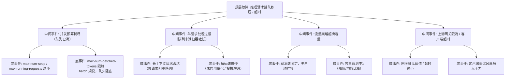

> [!warning] 生产安全提示 · Production Safety
> 本文档含可执行命令/操作步骤。执行前请核对风险等级（🟢低/🔶中/🔴高），高危命令必须 dry-run 并确认回滚方案。完整策略见 [生产安全策略](../../../../治理/Production_Safety_Policy.md)。
<!-- op-safety-banner v1 -->
# FTA: vLLM / SGLang 并发限流与排队超时

> 中文简称：FTA: vLLM / SGLang 并发限流与排队超时 ｜ English: FTA Queueing Timeout and Request Backlog

> **一句话理解**: 请求排队超时通常是并发预算与流量不匹配——先看 running/queued 指标区分「队列满」还是「处理慢」，再对症调并发预算或扩容。

---

## 故障树（FTA）



## 问题现象

- 客户端报 `429 Too Many Requests`、`503` 或客户端侧 `timeout`，服务端日志显示请求进入 queue 后迟迟未调度。
- vLLM 监控指标 `vllm:num_requests_running` 触顶、`vllm:num_requests_waiting` 持续增长；SGLang 观察 `sglang:running_requests` / `sglang:queue_length`。
- TTFT 分位数急剧恶化（P95 从秒级恶化到分钟级），但吞吐量并未下降（队列满而非算力满的典型特征）。

## 根因分析

| 根因类别 | 具体原因 | 适用引擎 |
|---------|---------|---------|
| 并发预算过小 | `--max-num-seqs` 或 `--max-running-requests` 未按显存余量反推，队列易满 | vLLM / SGLang |
| batch 受限 | `--max-num-batched-tokens` 过小，prefill 批规模受限，调度效率低 | 两者 |
| 慢请求占坑 | 超长上下文请求占用 running slot 数分钟，短请求被阻塞（队头阻塞） | 两者 |
| 解码吞吐低 | 未开启投机解码 / 量化，单请求生成速度慢拉长占用时间 | 两者 |
| 容量不足 | 副本数固定且无 HPA，流量突增（营销活动/业务高峰）直接打满 | 两者 |
| 网关阈值 | 上游 API 网关排队或超时配置小于引擎实际处理时间 | 两者 |
| 重试风暴 | 客户端超时后无退避重试，放大压力形成雪崩 | 两者 |

## 诊断步骤

```bash
# 1. 区分「队列满」还是「处理慢」——看调度指标
curl -s localhost:8000/metrics | grep -E "num_requests_(running|waiting)"   # vLLM 🟢 只读
curl -s localhost:30000/metrics | grep -E "running_requests|queue_length"   # SGLang 🟢 只读

# 2. 看 TTFT / 吞吐指标定位瓶颈层级
curl -s localhost:8000/metrics | grep -E "time_to_first_token|time_per_output_token"

# 3. 观察请求特征（是否存在超长上下文占坑）
# 从访问日志提取 seq_len 分布
grep -oE '"prompt_tokens": [0-9]+' /var/log/vllm.log | sort -n | tail -20
```

排查要点：

1. **队列满 vs 处理慢**：`num_requests_waiting` 高但 running 已满 = 并发预算问题；running 未满但 TTFT 高 = 调度/prefill 问题。
2. **看慢请求**：长上下文请求（> 32k token）是否挤占 slot——可对长短请求分实例部署。
3. **看扩容配置**：`kubectl get hpa` 是否触发；副本数是否因 GPU 资源不足无法扩容。

## 解决方案

**vLLM**：

```bash
# 方案 A: 调大并发预算（需显存有富余）
python -m vllm.entrypoints.openai.api_server \
    --model meta-llama/Llama-3.1-8B-Instruct \
    --max-num-seqs 128 \
    --max-num-batched-tokens 8192

# 方案 B: 分离长短请求（长上下文单独实例）
# 短请求实例: --max-model-len 8192；长请求实例: --max-model-len 131072
```

**SGLang**：

```bash
# 方案 A: 调整并发与批预算
python -m sglang.launch_server \
    --model-path meta-llama/Meta-Llama-3.1-8B-Instruct \
    --max-running-requests 128 \
    --max-total-tokens 16384

# 方案 B: 开启 chunked prefill，避免单一大 prefill 阻塞
python -m sglang.launch_server \
    --model-path meta-llama/Meta-Llama-3.1-8B-Instruct \
    --chunked-prefill-size 4096
```

**容量与网关**：

- 配置 HPA：按 `num_requests_waiting` 或队列长度扩缩容；GPU 集群需预留可调度资源。
- 网关侧：排队阈值与超时对齐引擎实际能力（TTFT P95 + 生成时长余量）；对长请求单独设置更长超时。
- 客户端：指数退避重试 + 请求熔断，避免重试风暴。
- 长上下文业务分实例：短请求实例与长请求实例隔离，杜绝队头阻塞。

## 预防措施

- 容量规划按「峰值 QPS × 平均生成时长 × 并发系数」反推副本数，预留 30% 余量。
- 上线前压测：用长尾请求（10% 长上下文）验证排队表现，而非纯短请求。
- 监控 `num_requests_waiting` / `queue_length` 并设告警（持续 > 0 数分钟即告警）。
- 网关超时、客户端重试策略、HPA 阈值三者联动演练，覆盖流量突增场景。

---

## 交叉引用

- [[10_部署推理/02_推理引擎/FTA/推理/FTA_vLLM_SGLang_吞吐量异常.md|吞吐量异常 FTA]]
- [[10_部署推理/02_推理引擎/FTA/推理/FTA_vLLM_SGLang_TTFT_抖动.md|TTFT 抖动 FTA]]
- [[10_部署推理/02_推理引擎/FTA/推理/FTA_vLLM_SGLang_解码延迟高.md|解码延迟高 FTA]]
- [[11_模型运维/09_成本管理/03_LLM_成本_延迟_SLO.md|LLM 成本与延迟 SLO]]
- [[12_架构基建/11_AI网关/README.md|AI 网关]]

*Last updated: 2026-08-28*
