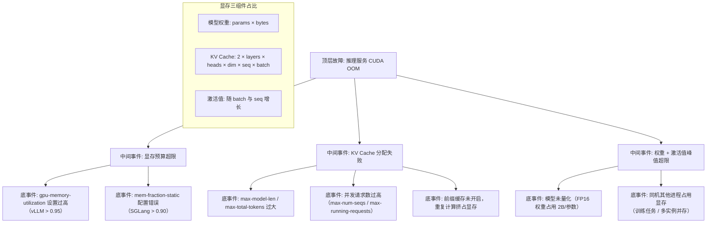

> [!warning] 生产安全提示 · Production Safety
> 本文档含可执行命令/操作步骤。执行前请核对风险等级（🟢低/🔶中/🔴高），高危命令必须 dry-run 并确认回滚方案。完整策略见 [生产安全策略](../../../../治理/Production_Safety_Policy.md)。
<!-- op-safety-banner v1 -->
# FTA: vLLM / SGLang 推理 OOM（显存不足）

> 中文简称：FTA: vLLM / SGLang 推理 OOM

> **一句话理解**: 推理服务抛出 CUDA out of memory 时，按「模型权重 → KV Cache → 激活值」三组件逐一排查显存去向，再通过量化、限长、调并发预算对症解决。

---

## 故障树（FTA）



## 问题现象

- 服务启动或推理请求进行中抛出 `CUDA out of memory` / `torch.OutOfMemoryError`，进程可能直接退出或反复重启（K8s CrashLoopBackOff）。
- `nvidia-smi` 显示显存占用接近 100%，服务日志出现 `Failed to allocate` 或 `RuntimeError: CUDA error: out of memory`。
- 表现为请求大量失败（HTTP 500 / connection reset），伴随吞吐骤降。

## 根因分析

| 根因类别 | 具体原因 | 适用引擎 |
|---------|---------|---------|
| 显存预算超限 | `--gpu-memory-utilization` 设到 0.95+，留给碎片与上下文切换的余量不足 | vLLM |
| 显存预算超限 | `--mem-fraction-static` 设到 0.90+，KV Cache 池与模型权重争夺显存 | SGLang |
| KV Cache 过大 | `--max-model-len` / `--max-total-tokens` 按业务上限配置，长序列并发时缓存池撑爆 | 两者 |
| 并发过高 | `--max-num-seqs` / `--max-running-requests` 未按显存反推，批内序列过多 | 两者 |
| 重复计算 | 前缀缓存未开启，多请求共享前缀反复 prefill，KV Cache 与算力双浪费 | 两者 |
| 权重过大 | 全精度部署 70B+ 模型，权重 + 激活值占用超出单卡显存 | 两者 |
| 环境干扰 | 同卡跑训练/评测任务，或残留僵尸进程占用显存 | 两者 |

## 诊断步骤

```bash
# 1. 确认显存占用分布（区分权重 vs KV Cache vs 激活）
nvidia-smi   # 观察每个进程的显存占用 🟢

# 2. 查询可用显存与进程占用
nvidia-smi --query-gpu=memory.total,memory.used,memory.free --format=csv

# 3. 检查残留进程（训练残留 / 多实例并存）
ps aux | grep -E "vllm|sglang|python" | grep -v grep   # 🟢 只读
```

排查要点：

1. **看预算参数**：核对 `--gpu-memory-utilization`（vLLM）与 `--mem-fraction-static`（SGLang）是否留有 5-10% 余量。
2. **看请求特征**：是否存在超长上下文请求（接近 `max-model-len`）或并发尖峰。
3. **看监控指标**：`vllm:gpu_cache_usage_perc` 是否持续 > 90%；SGLang 观察 `sglang:token_usage`。
4. **复现定位**：先发单个短请求验证，再逐步增大并发，二分定位是「权重/激活」还是「KV Cache」导致。

## 解决方案

**vLLM**：

```bash
# 方案 A: 收紧显存预算，留出余量
python -m vllm.entrypoints.openai.api_server \
    --model meta-llama/Llama-3.1-8B-Instruct \
    --gpu-memory-utilization 0.85 \
    --max-model-len 8192

# 方案 B: KV Cache 压缩（FP8 省约 50% 显存）
python -m vllm.entrypoints.openai.api_server \
    --model meta-llama/Llama-3.1-8B-Instruct \
    --kv-cache-dtype fp8

# 方案 C: 开启前缀缓存，减少重复 prefill
python -m vllm.entrypoints.openai.api_server \
    --model meta-llama/Llama-3.1-8B-Instruct \
    --enable-prefix-caching
```

**SGLang**：

```bash
# 方案 A: 调整静态显存比例（0.80-0.90 为推荐区间）
python -m sglang.launch_server \
    --model-path meta-llama/Meta-Llama-3.1-8B-Instruct \
    --mem-fraction-static 0.85

# 方案 B: 限制总 token 预算与并发
python -m sglang.launch_server \
    --model-path meta-llama/Meta-Llama-3.1-8B-Instruct \
    --max-total-tokens 16384 \
    --max-running-requests 32
```

**通用方案**：

- 模型量化：AWQ / GPTQ / FP8，权重占用降至 0.5-1 B/参数。
- 多卡张量并行：`--tensor-parallel-size 2` 分摊权重与 KV Cache。
- 清理环境：确认无同卡残留进程后重启服务（需确认无其他业务依赖该卡）。

## 预防措施

- 部署前按「权重 + KV Cache + 激活 + 碎片余量」估算显存，预算参数控制在 0.85-0.90。
- 对 KV Cache 占用设置监控告警（`vllm:gpu_cache_usage_perc` > 90% 告警），SGLang 关注 `sglang:token_usage`。
- 为长上下文业务单独部署实例，避免与短请求混跑导致缓存池互相挤占。
- 通过 K8s 资源限制（`nvidia.com/gpu: 1`）与存活探针，让 OOM 可自动恢复而非拖垮节点。

---

## 交叉引用

- [[10_部署推理/02_推理引擎/29_vLLM_深入分析.md|vLLM_Deep_Dive]]
- [[10_部署推理/02_推理引擎/23_SGLang_深入分析.md|SGLang_Deep_Dive]]
- [[10_部署推理/02_推理引擎/FTA/推理/FTA_vLLM_SGLang_KV_Cache_溢出.md|KV Cache 溢出 FTA]]
- [[07_模型训练/07_训练监控/03_模型_故障排查_指南.md|模型问题排查手册]]

*Last updated: 2026-08-13*
