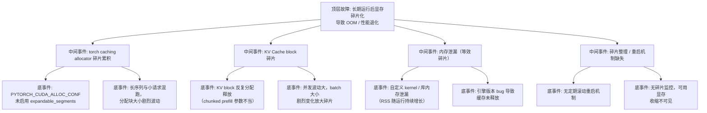

> [!warning] 生产安全提示 · Production Safety
> 本文档含可执行命令/操作步骤。执行前请核对风险等级（🟢低/🔶中/🔴高），高危命令必须 dry-run 并确认回滚方案。完整策略见 [生产安全策略](../../../../治理/Production_Safety_Policy.md)。
<!-- op-safety-banner v1 -->
# FTA: vLLM / SGLang 显存碎片化与长期运行退化

> 中文简称：FTA: vLLM / SGLang 显存碎片化与长期运行退化

> **一句话理解**: 服务跑几天后开始 OOM 或变慢、重启就好——这不是请求变多，而是进程级显存碎片化/泄漏累积；用 expandable_segments 与碎片监控根治。

---

## 故障树（FTA）



## 问题现象

- 服务运行数天至数周后，偶发 `CUDA out of memory`，但 `nvidia-smi` 显示进程占用并未增长、请求量也未增加。
- 可用显存逐渐收缩：`gpu_cache_usage_perc` 未满，但新请求仍 OOM（实际是显存碎片导致大块分配失败）。
- 重启进程后一切恢复正常——典型的碎片化/泄漏特征。
- 推理延迟随时间缓慢劣化（碎片导致缓存命中率下降、分配耗时增加）。

## 根因分析

| 根因类别 | 具体原因 | 适用引擎 |
|---------|---------|---------|
| allocator 碎片 | torch caching allocator 默认不整理碎片，长序列与小请求混跑时块大小剧烈波动 | 两者 |
| 缺 expandable | 未设置 `PYTORCH_CUDA_ALLOC_CONF=expandable_segments:True`，无法合并相邻碎片 | 两者 |
| KV block 碎片 | chunked prefill 参数不当，KV block 频繁分配释放 | 两者 |
| 泄漏累积 | 自定义 kernel（量化/投机解码）或引擎 bug 未释放显存，RSS 持续增长 | 两者 |
| 并发波动 | 业务潮汐导致 batch 剧烈伸缩，加剧碎片 | 两者 |
| 无恢复机制 | 未配置定期滚动重启，碎片只能累积到 OOM | 两者 |
| 不可观测 | 未监控「可用显存/碎片率」，退化过程不可见 | 两者 |

## 诊断步骤

```bash
# 1. 确认是碎片而非真实显存不足
nvidia-smi --query-gpu=memory.total,memory.used,memory.free --format=csv   # 🟢 只读
# 若 used 未到上限却 OOM → 碎片化；若 used 接近 100% → 见 OOM FTA

# 2. 观察内存增长曲线（区分泄漏 vs 碎片）
# 连续采样 RSS：单调增长 = 泄漏；波动后回不到起点 = 碎片累积
for i in {1..60}; do
  ps -o rss= -p $(pgrep -f vllm | head -1); sleep 60
done | uniq -c | tail -20

# 3. 检查 allocator 配置
echo ${PYTORCH_CUDA_ALLOC_CONF:-"未设置（默认）"}

# 4. 引擎内部指标
curl -s localhost:8000/metrics | grep -E "gpu_cache_usage_perc|gpu_mem"   # vLLM 🟢 只读
```

排查要点：

1. **区分三类**：RSS 单调增长 = 泄漏；重启即好但增长缓慢 = 碎片；`nvidia-smi` 满 = 真实 OOM（走 OOM FTA）。
2. **看启动配置**：是否设置 `expandable_segments`；vLLM 0.6+ 默认启用需确认版本。
3. **看复现周期**：与业务高峰/长序列请求是否相关。

## 解决方案

**根治碎片化（推荐）**：

```bash
# torch caching allocator 开启可扩展段（允许相邻段合并，碎片率大幅下降）
export PYTORCH_CUDA_ALLOC_CONF=expandable_segments:True
# vLLM 启动
python -m vllm.entrypoints.openai.api_server --model <model> --gpu-memory-utilization 0.9
```

**缓解长期退化**：

- 配置定期滚动重启（如每 7 天窗口内滚动替换所有副本，流量无损）。
- 长/短请求分实例部署，减少分配块大小波动（与排队超时 FTA 的隔离策略一致）。
- 升级到修复碎片/泄漏问题的引擎版本（关注 release notes 中 memory leak fix）。
- 压测验证：长跑 72 小时观察 RSS 与可用显存曲线，确认平稳后再上线。

**SGLang 侧**：

```bash
# SGLang 同样依赖 torch allocator，配置相同
export PYTORCH_CUDA_ALLOC_CONF=expandable_segments:True
python -m sglang.launch_server --model-path <model> --mem-fraction-static 0.85
```

## 预防措施

- 生产环境统一注入 `PYTORCH_CUDA_ALLOC_CONF=expandable_segments:True`。
- 监控「进程可用显存」与 `gpu_cache_usage_perc` 双指标，碎片退化（可用显存收缩但 cache 未满）设告警。
- 长跑稳定性纳入上线验收：72 小时 soak test 通过才可放量。
- 定期滚动重启纳入运维日历；重启窗口避开业务高峰。

---

## 交叉引用

- [[10_部署推理/02_推理引擎/FTA/推理/FTA_vLLM_SGLang_KV_Cache_溢出.md|KV Cache 溢出 FTA]]
- [[10_部署推理/02_推理引擎/FTA/推理/FTA_vLLM_SGLang_推理_OOM.md|推理 OOM FTA]]
- [[10_部署推理/02_推理引擎/FTA/推理/FTA_模型热加载_回滚_失败.md|热加载回滚 FTA]]
- [[10_部署推理/03_推理优化/07_kv_cache_paged_attention.md|KV Cache x PagedAttention]]
- [[10_部署推理/02_推理引擎/29_vLLM_深入分析.md|vLLM_Deep_Dive]]

*Last updated: 2026-08-13*
