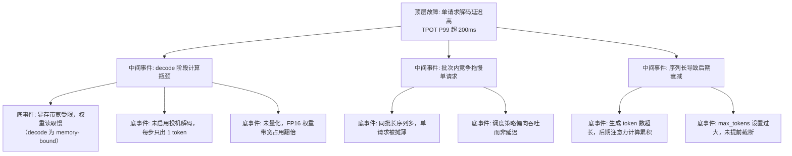

> [!warning] 生产安全提示 · Production Safety
> 本文档含可执行命令/操作步骤。执行前请核对风险等级（🟢低/🔶中/🔴高），高危命令必须 dry-run 并确认回滚方案。完整策略见 [生产安全策略](../../../../治理/Production_Safety_Policy.md)。
<!-- op-safety-banner v1 -->
# FTA: vLLM / SGLang 单请求解码延迟高（TPOT 异常）

> 中文简称：FTA: vLLM / SGLang 单请求解码延迟高 ｜ English: FTA High Decode Latency

> **一句话理解**: 单请求出字慢（TPOT 高）时，decode 是显存带宽主导的串行阶段，先看带宽与批次竞争，再考虑投机解码与量化这类针对性加速。

---

## 故障树（FTA）



## 问题现象

- `vllm:time_per_output_token_seconds` P99 超过 200ms（监控建议阈值），流式输出「一个字一个字挤」。
- 单请求低并发下也慢（排除排队因素），多请求并发时更慢。
- 生成长文本（如 1K+ tokens）时，后半段明显比前半段慢。

## 根因分析

| 根因 | 机制说明 | 适用引擎 |
|------|---------|---------|
| 带宽瓶颈 | decode 每步要读全部权重，显存带宽决定单步下限 | 两者 |
| 无投机解码 | 每步串行生成 1 token，无法并行验证候选 | 两者 |
| 未量化 | FP16 权重读取量是 INT4 的 4 倍，带宽占用大 | 两者 |
| 批次竞争 | 批内其他长序列挤占本轮计算，单请求体验被摊薄 | 两者 |
| 调度偏向 | 默认策略优先整体吞吐，单请求延迟不保证 | 两者 |
| 长序列衰减 | 序列越长注意力计算量越大，TPOT 随生成长度上升 | 两者 |

## 诊断步骤

```bash
# 1. 看 TPOT 与批次大小的关系
# vLLM: vllm:time_per_output_token_seconds、vllm:num_requests_running
# 低并发仍慢 → 带宽/投机问题；并发越高越慢 → 批次竞争问题

# 2. 对比不同模型大小的 TPOT
# 同卡 8B 与 70B 对比，确认是否权重读取带宽主导

# 3. 检查生成长度分布
# 是否所有请求都设了很大的 max_tokens，后期衰减明显
```

排查要点：

1. **区分并发敏感度**：单请求慢 → 引擎能力问题；并发后变慢 → 容量与调度问题。
2. **看硬件能力**：确认 GPU 型号与显存带宽（H100 3.35 TB/s 是 8B FP16 decode 的理论下限参考）。
3. **尝试投机解码**：接入 draft 模型后 TPOT 是否下降，用于确认瓶颈是否在串行生成步。
4. **检查调度策略**：latency 敏感场景是否配置了 priority/srtf 而非 fcfs。

## 解决方案

**vLLM**：

```bash
# 方案 A: 投机解码，用 8B draft 加速 70B 生成
python -m vllm.entrypoints.openai.api_server \
    --model meta-llama/Llama-3.1-70B-Instruct \
    --speculative-model meta-llama/Llama-3.1-8B-Instruct \
    --num-speculative-tokens 5 \
    --tensor-parallel-size 4

# 方案 B: 量化降低权重读取量（带宽瓶颈场景）
python -m vllm.entrypoints.openai.api_server \
    --model meta-llama/Llama-3.1-8B-Instruct \
    --quantization awq

# 方案 C: latency 优先调度
# --scheduling-policy priority
```

**SGLang**：

```bash
# 方案 A: EAGLE 投机解码
python -m sglang.launch_server \
    --model-path meta-llama/Meta-Llama-3.1-70B-Instruct \
    --speculative-algorithm EAGLE \
    --speculative-draft-model-path meta-llama/Meta-Llama-3.1-8B-Instruct \
    --speculative-num-steps 5 \
    --speculative-eagle-topk 4 \
    --tp 4

# 方案 B: 最短剩余时间优先调度，保障单请求延迟
python -m sglang.launch_server \
    --model-path meta-llama/Meta-Llama-3.1-8B-Instruct \
    --schedule-policy srtf
```

**通用方案**：

- 应用侧合理设置 `max_tokens`，避免无意义的超长生成。
- 交互式场景限制并发（`max-num-seqs` / `max-running-requests`），牺牲吞吐保延迟。
- 长文本场景拆分生成（分段续写），规避后期衰减。

## 预防措施

- 将 TPOT P99 作为流式业务的 SLO 核心指标，与 `max_tokens` 分布联动告警。
- 带宽瓶颈型延迟优先上量化，其次投机解码；先量化后投机避免双倍显存压力。
- 延迟敏感请求与吞吐型请求分流部署，用不同调度策略与并发预算。
- 上线前用固定 prompt 与长度基准记录 TPOT，作为硬件退化（降频/故障）的回归信号。

---

## 交叉引用

- [[10_部署推理/02_推理引擎/29_vLLM_深入分析.md|vLLM_Deep_Dive]]
- [[10_部署推理/02_推理引擎/23_SGLang_深入分析.md|SGLang_Deep_Dive]]
- [[10_部署推理/02_推理引擎/FTA/推理/FTA_vLLM_SGLang_Speculative_Decoding_异常.md|Speculative Decoding 异常 FTA]]
- [[10_部署推理/03_推理优化/12_Speculative_Decoding_高级_2026.md|投机解码]]

*Last updated: 2026-08-28*
