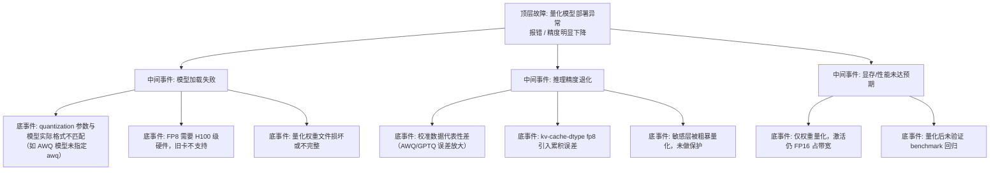

> [!warning] 生产安全提示 · Production Safety
> 本文档含可执行命令/操作步骤。执行前请核对风险等级（🟢低/🔶中/🔴高），高危命令必须 dry-run 并确认回滚方案。完整策略见 [生产安全策略](../../../../治理/Production_Safety_Policy.md)。
<!-- op-safety-banner v1 -->
# FTA: vLLM / SGLang 量化模型部署报错 / 精度下降

> 中文简称：FTA: vLLM / SGLang 量化模型部署报错 / 精度下降

> **一句话理解**: 量化模型部署翻车时，先区分「加载报错」与「精度退化」两类故障——前者查参数匹配与硬件支持，后者用 Perplexity 与逐层误差定位敏感层。

---

## 故障树（FTA）



## 问题现象

- 启动报错：如 `Unrecognized quantization method`、权重张量形状不匹配、`Unsupported hardware for FP8`。
- 服务正常但输出质量明显下降：Perplexity 相对 FP16 基线升高 > 2-5%，目标任务 benchmark 分数跌落。
- 量化后吞吐提升有限或反而更慢，与预期不符。

## 根因分析

| 根因 | 机制说明 | 适用引擎 |
|------|---------|---------|
| 参数不匹配 | 模型目录实际是 AWQ 格式但启动未加 `--quantization awq`，按 FP16 解析失败 | vLLM |
| 硬件不支持 | FP8 依赖 Hopper 架构（H100/H200），A100/RTX 4090 不支持 | 两者 |
| 校准数据差 | AWQ/GPTQ 权重量化由校准集决定，校准集偏离业务分布则误差放大 | 两者 |
| KV Cache 量化误差 | `--kv-cache-dtype fp8` 对敏感任务（长上下文推理）可能引入可感知误差 | vLLM |
| 敏感层受损 | 输出层/embedding 层量化误差被放大，RNN/注意力 score 层尤其敏感 | 两者 |
| 激活未量化 | 仅权重 INT4，激活 FP16，decode 带宽收益打折 | 两者 |

## 诊断步骤

```bash
# 1. 确认模型实际量化格式（查看 config.json 中的 quantization_config）
cat /path/to/model/config.json | grep -A 10 quantization   # 🟢 只读

# 2. Perplexity 对比（FP16 基线 vs 量化后）
# 在固定测试集上分别计算 PPL，delta > 2% 需要警惕，> 5% 判定退化

# 3. 逐层误差分析（定位敏感层）
# 逐层对比 FP16 与量化模型的激活输出 MSE，找误差最大的层

# 4. 硬件能力确认
nvidia-smi   # 查看 GPU 架构（Hopper 才支持 FP8）🟢
```

排查要点：

1. **加载报错优先查参数**：`--quantization` 是否与模型格式一致；`config.json` 中 `quantization_config` 字段为准。
2. **精度退化查校准**：AWQ/GPTQ 是否用业务相近数据校准；换用更大、更贴近业务的校准集重做。
3. **敏感层保护**：AWQ 自动保护敏感层；GPTQ 可对敏感层回退高精度。
4. **KV Cache 单独验证**：`kv-cache-dtype fp8` 打开/关闭对比 PPL，确认误差来源。
5. **回归基准**：与 FP16 部署跑同一 benchmark 集，量化损失应 < 1-2%（AWQ 参考值）。

## 解决方案

**vLLM**：

```bash
# 方案 A: 按模型实际格式显式声明量化方法
python -m vllm.entrypoints.openai.api_server \
    --model casperhansen/llama-3.1-8b-instruct-awq \
    --quantization awq

python -m vllm.entrypoints.openai.api_server \
    --model TheBloke/Llama-2-7B-GPTQ \
    --quantization gptq

# 方案 B: FP8 场景确认硬件（H100/H200）后启用
python -m vllm.entrypoints.openai.api_server \
    --model meta-llama/Llama-3.1-8B-Instruct \
    --quantization fp8 \
    --kv-cache-dtype fp8

# 方案 C: 精度优先时 KV Cache 回退 FP16
# 移除 --kv-cache-dtype fp8，仅保留权重量化
```

**SGLang**：

```bash
# 方案 A: 加载 AWQ/FP8 权重（SGLang 自动识别量化配置）
python -m sglang.launch_server \
    --model-path casperhansen/llama-3.1-8b-instruct-awq

# 方案 B: FP8 权重 + 显存预算调整
python -m sglang.launch_server \
    --model-path meta-llama/Meta-Llama-3.1-8B-Instruct \
    --quantization fp8 \
    --mem-fraction-static 0.85
```

**通用方案**：

- 量化方案选型参考精度损失梯度：AWQ（低 ~1%）< GPTQ（低-中 ~1-2%）< NF4（中 ~2-3%）< Round-to-Nearest（高）。
- 校准数据重建：用业务真实 prompt 分布采样，量级 128-512 条即可显著改善 AWQ/GPTQ。
- 混合精度保护：敏感层（首尾层、attention 关键层）保留 FP16。

## 预防措施

- 量化模型上线前必须跑「FP16 vs 量化」双基准对比，PPL 与任务指标双验证。
- 维护模型格式清单：每个量化模型标注格式（AWQ/GPTQ/FP8）与目标硬件，防止参数误配。
- FP8 仅部署到 Hopper 及以上架构，部署模板内做硬件断言。
- 量化配置与权重文件一起版本化，校准集变更视为模型变更走发布流程。

---

## 交叉引用

- [[10_部署推理/02_推理引擎/29_vLLM_深入分析.md|vLLM_Deep_Dive]]
- [[10_部署推理/02_推理引擎/23_SGLang_深入分析.md|SGLang_Deep_Dive]]
- [[10_部署推理/04_模型量化/04_量化_技术_2026.md|量化技术 2026]]
- [[07_模型训练/07_训练监控/03_模型_故障排查_指南.md|模型问题排查手册]]

*Last updated: 2026-08-13*
