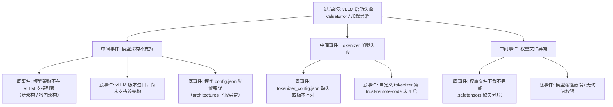

> [!warning] 生产安全提示 · Production Safety
> 本文档含可执行命令/操作步骤。执行前请核对风险等级（🟢低/🔶中/🔴高），高危命令必须 dry-run 并确认回滚方案。完整策略见 [生产安全策略](../../../../治理/Production_Safety_Policy.md)。
<!-- op-safety-banner v1 -->
# FTA: vLLM 启动失败（模型架构不支持 / Tokenizer 不匹配）

> 中文简称：FTA: vLLM 启动失败（架构 / Tokenizer） ｜ English: FTA vLLM Startup Failure

> **一句话理解**: vLLM 启动报架构不支持或 tokenizer 错误时，按「引擎版本 → 模型 config → 权重完整性 → 远端代码信任」四步排查，多数是版本滞后与文件缺失。

---

## 故障树（FTA）



## 问题现象

- 启动即报 `ValueError: model architectures not supported`，列出支持的架构列表。
- 报 `tokenizer_config.json` 相关错误：文件缺失、字段不兼容、`special tokens` 解析失败。
- 权重加载中断：`safetensors` 分片缺失、`weights only contain ...`、`SafeSliceError`。

## 根因分析

| 根因 | 机制说明 |
|------|---------|
| 架构未收录 | 新发布架构（如新 MoE、新多模态）vLLM 尚未实现对应 `ModelForCausalLM` 类 |
| 版本滞后 | 引擎版本与模型发布时间不匹配，升级 vLLM 即可支持 |
| config 异常 | `config.json` 的 `architectures` 字段与权重不符（如误标 LlamaForCausalLM 但权重是别的结构） |
| tokenizer 缺失 | `tokenizer_config.json`、`tokenizer.json`、`vocab` 文件不完整（上传/下载遗漏） |
| 远端代码 | 自定义模型/分词器需要执行 `modeling_*.py`，未加 `--trust-remote-code` 被安全策略拒绝 |
| 权重不完整 | HuggingFace 分片文件（`model-00001-of-00002.safetensors`）未全部下载 |

## 诊断步骤

```bash
# 1. 确认模型本地目录完整性
ls -la /path/to/model/   # 检查 config.json、tokenizer*、safetensors 分片 🟢 只读

# 2. 查看 config.json 的架构声明
cat /path/to/model/config.json | grep -E "architectures|model_type"   # 🟢 只读

# 3. 核对 vLLM 版本与支持列表
pip show vllm   # 🟢 只读
# 到 docs.vllm.ai 查该架构是否在支持列表中、最低版本要求

# 4. 单独用 transformers 加载验证（区分 vLLM 问题 vs 模型文件问题）
python3 -c "
from transformers import AutoTokenizer, AutoConfig
AutoConfig.from_pretrained('/path/to/model')
AutoTokenizer.from_pretrained('/path/to/model')
print('model files OK')"   # 🟢 只读验证
```

排查要点：

1. **先验文件**：用 transformers 独立加载 config 与 tokenizer，能过则问题在 vLLM 侧（版本/架构支持），不能过则先修文件。
2. **看版本**：`pip show vllm` 与模型发布日期对比，新模型配旧引擎是最常见原因。
3. **查 trust-remote-code**：报 `requires trust_remote_code` 类错误时显式开启，但需先审查远端代码。
4. **重新下载**：tokenizer 相关文件从 HuggingFace 完整重下（`tokenizer.json` 与 `tokenizer_config.json` 需配套版本）。
5. **查路径权限**：容器内挂载路径只读/未挂载会表现为「文件不存在」。

## 解决方案

**vLLM**：

```bash
# 方案 A: 升级引擎到支持该架构的版本
pip install -U vllm

# 方案 B: 自定义模型/分词器显式信任远端代码
python -m vllm.entrypoints.openai.api_server \
    --model /path/to/custom-model \
    --trust-remote-code

# 方案 C: 用支持列表内的同类模型替换（新架构发布初期的规避手段）
# 如新 MoE 架构暂不支持时，先用同规模 Llama/Qwen 系模型过渡
```

**通用方案**：

- 从 HuggingFace 重新下载完整模型目录（重点补 `tokenizer.json`、`tokenizer_config.json`、全部分片）。
- 若为私有模型，用 `huggingface-cli download` 校验完整性（sha256 校验）。
- 架构确实不支持时，改用 transformers + TGI 或等待 vLLM 新版本；SGLang 同样适用「版本滞后」逻辑。

## 预防措施

- 模型选型时提前核对推理引擎的支持矩阵（vLLM/SGLang 官方文档），避免选冷门架构。
- 模型目录纳入制品管理：完整目录 + sha256 清单，部署时校验文件完整性。
- 引擎版本与模型发布时间挂钩：发布新模型前先升级引擎并跑冒烟测试。
- 对自定义模型统一加 `--trust-remote-code` 审查流程，并记录每次执行的安全评估。

---

## 交叉引用

- [[10_部署推理/02_推理引擎/29_vLLM_深入分析.md|vLLM_Deep_Dive]]
- [[10_部署推理/02_推理引擎/23_SGLang_深入分析.md|SGLang_Deep_Dive]]
- [[10_部署推理/02_推理引擎/FTA/推理/FTA_vLLM_SGLang_TP_启动失败.md|TP 启动失败 FTA]]
- [[07_模型训练/07_训练监控/03_模型_故障排查_指南.md|模型问题排查手册]]

*Last updated: 2026-08-28*
