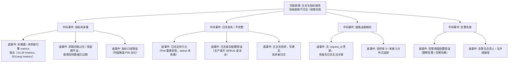

> [!warning] 生产安全提示 · Production Safety
> 本文档含可执行命令/操作步骤。执行前请核对风险等级（🟢低/🔶中/🔴高），高危命令必须 dry-run 并确认回滚方案。完整策略见 [生产安全策略](../../../../治理/Production_Safety_Policy.md)。
<!-- op-safety-banner v1 -->
# FTA: 可观测性缺失（日志与指标不完整）

> 中文简称：FTA: 可观测性缺失（日志与指标不完整）

> **一句话理解**: 故障发生时「没日志、没指标、没 Trace、没告警」本身就是故障——可观测性缺失会让一切排障变成黑盒猜测，按「采集→存储→关联→告警」四层补齐。

---

## 故障树（FTA）



## 问题现象

- 故障发生时日志目录为空、`kubectl logs` 只看到最近几行（Pod 已重建，历史日志丢失）。
- 监控面板有 CPU/内存，但无 `gpu_cache_usage_perc`、TTFT、`cache_hit_rate` 等推理专属指标。
- 一次「回答变慢」无法定位：分不清是检索层慢、上游 API 限流还是引擎排队——无 Trace 可查。
- 事故后复盘发现：告警没触发（阈值错了）或触发了没人响应（无升级路径）。

## 根因分析

| 根因类别 | 具体原因 | 适用引擎 |
|---------|---------|---------|
| 端点未采集 | vLLM `/metrics` 与 SGLang `/metrics` 未暴露到 Prometheus 抓取路径 | 两者 |
| 口径错误 | 用均值统计 TTFT/TPOT，长尾劣化被平均掩盖 | 两者 |
| 日志易失 | stdout 未接采集 Agent，Pod 重建日志即丢 | 两者 |
| 无贯穿 ID | 网关 → 引擎 → 应用各段日志无公共 request_id | 两者 |
| 无追踪 | 未接入 OpenTelemetry，跨服务调用链不可见 | 两者 |
| 告警静默 | 阈值高于实际劣化水平，或表达式写错导致永不触发 | 两者 |
| 无升级路径 | 告警无 on-call 轮值与升级策略，半夜无人响应 | 两者 |

## 诊断步骤

```bash
# 1. 验证引擎 metrics 端点是否可抓
curl -s localhost:8000/metrics | grep -cE "vllm_"          # vLLM，0 = 未暴露 🟢 只读
curl -s localhost:30000/metrics | grep -cE "sglang_"       # SGLang，0 = 未暴露 🟢 只读

# 2. 检查 Prometheus 抓取配置与目标状态
curl -s "localhost:9090/api/v1/targets" | grep -E "vllm|sglang"   # 🟢 只读

# 3. 验证日志链路（以真实 request_id 贯穿查询）
# 网关日志 → 引擎日志 → 应用日志，能否用同一 id 串联
grep "<request_id>" /var/log/gateway.log | tail -5   # 🟢 只读

# 4. 检查告警规则是否生效（对比最近一次故障的指标走势）
curl -s "localhost:9090/api/v1/rules" | grep -A3 "vllm"   # 🟢 只读
```

排查要点：

1. **按层定位缺失**：采集（端点/抓取）→ 存储（保留期/持久化）→ 关联（request_id/Trace）→ 告警（阈值/升级）。
2. **看关键指标是否在**：`vllm:gpu_cache_usage_perc`、`vllm:time_to_first_token_seconds`、`vllm:time_per_output_token_seconds`、`sglang:cache_hit_rate`、`sglang:gen_throughput`。
3. **验证告警真实性**：用历史故障数据回放，确认阈值会触发而非静默。

## 解决方案

**补齐采集层**：

```yaml
# Prometheus 抓取 vLLM / SGLang metrics 端点
scrape_configs:
  - job_name: "vllm"
    metrics_path: /metrics
    static_configs:
      - targets: ["vllm-svc:8000"]
  - job_name: "sglang"
    metrics_path: /metrics
    static_configs:
      - targets: ["sglang-svc:30000"]
```

**补齐日志层**：

- 引擎日志接 stdout + 采集 Agent（Loki/ELK），Pod 重建不丢历史。
- 生产日志级别固定 INFO；调 DEBUG 需走变更流程并限时。
- logrotate / 采集侧限流双保险，防止日志写满磁盘（关联磁盘 FTA）。

**补齐关联层**：

- 网关注入 `request_id` 并透传引擎（OpenAI 兼容接口可用 `X-Request-Id` 头）。
- 接入 OpenTelemetry：引擎（vLLM/SGLang 原生支持 OTLP）→ 网关 → 应用全链路。
- 关键指标用分位数（P50/P95/P99）而非均值，TTFT/TPOT/队列长度按分位监控。

**补齐告警层**：

- 核心告警（SLO 驱动）：TTFT P95、错误率、队列长度、`gpu_cache_usage_perc` > 90%、`cache_hit_rate` 突降。
- 告警分级 + on-call 轮值 + 升级路径（P0 → 15 分钟响应，P1 → 30 分钟）。
- 每月用故障演练验证告警真实触发。

## 预防措施

- 新服务上线清单包含可观测性验收：metrics 端点可抓、日志可查、request_id 贯穿、核心告警已配置。
- 推理指标基线化：上线前记录指标基线，变更后对比基线检测漂移。
- 告警规则纳入代码仓库（GitOps），变更可审计。
- 定期演练「故障时能否 5 分钟内定位到组件」作为可观测性健康度指标。

---

## 交叉引用

- [[11_模型运维/10_LLMOps_大模型运维/05_LLMOps_2026.md|LLMOps 2026]]
- [[14_RAG系统/05_RAG生产实践/03_RAG_监控_and_可观测性.md|RAG 监控与可观测性]]
- [[11_模型运维/08_可观测性/README.md|可观测性章节]]
- [[10_部署推理/02_推理引擎/29_vLLM_深入分析.md|vLLM_Deep_Dive]]
- [[10_部署推理/02_推理引擎/FTA/推理/FTA_vLLM_SGLang_排队超时.md|排队超时 FTA]]

*Last updated: 2026-08-13*
