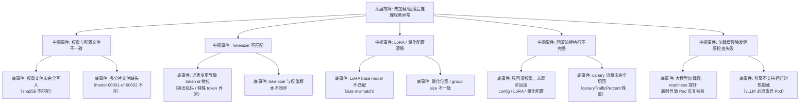

> [!warning] 生产安全提示 · Production Safety
> 本文档含可执行命令/操作步骤。执行前请核对风险等级（🟢低/🔶中/🔴高），高危命令必须 dry-run 并确认回滚方案。完整策略见 [生产安全策略](../../../../治理/Production_Safety_Policy.md)。
<!-- op-safety-banner v1 -->
# FTA: 模型热加载与回滚失败

> 中文简称：FTA: 模型热加载与回滚失败 ｜ English: FTA Hot Reload and Rollback Failure

> **一句话理解**: 模型热加载/回滚后服务异常，九成是「权重、tokenizer、LoRA、量化配置」四项没有一起换——先校验文件一致性，再查回滚流程是否完整执行。

---

## 故障树（FTA）



## 问题现象

- 热加载新版本后服务崩溃或拒绝请求，日志报 `SafetensorError` / `EOFError` / `size mismatch`。
- 生成结果乱码、special token 行为异常、质量骤降（Tokenizer 不匹配的典型表现）。
- 回滚后问题依然存在——回滚只换了权重，其余组件仍是异常版本。
- 滚动更新期间 Pod 反复 CrashLoopBackOff，readiness 探针持续失败。

## 根因分析

| 根因类别 | 具体原因 | 适用引擎 |
|---------|---------|---------|
| 文件不完整 | 权重文件传输/写入中断，未做 sha256 校验即上线 | 两者 |
| 版本不同步 | tokenizer 与权重分开更新，词表漂移 | 两者 |
| 组件不匹配 | LoRA 适配器的 base model 与当前权重不一致 | vLLM（Multi-LoRA）/ SGLang |
| 配置漂移 | 量化位宽、group size 与引擎版本不匹配（`cannot import AWQ`） | 两者 |
| 回滚不完整 | 只回滚权重，config / tokenizer / LoRA / 量化配置未同步 | 两者 |
| 流量残留 | KServe canary 流量未归零，新旧版本并存 | 两者 |
| 探针误杀 | 大模型加载 10-30 分钟，readiness 超时被 K8s 反复重启 | 两者 |

## 诊断步骤

```bash
# 1. 校验权重文件完整性（与源站对比）
ls -lh /models/<model-path>/model.safetensors   # 🟢 只读
sha256sum /models/<model-path>/model.safetensors

# 2. 查看 Pod 上次崩溃日志
kubectl logs <pod> -n <ns> --previous   # 🟢 只读

# 3. 核对 tokenizer 与模型词表匹配
python -c "
from transformers import AutoTokenizer, AutoConfig
m = AutoConfig.from_pretrained('/models/<version>')
t = AutoTokenizer.from_pretrained('/models/<version>')
assert t.vocab_size <= m.vocab_size, 'tokenizer vocab too large'
print('OK')"

# 4. 检查 canary 流量是否归零
kubectl get inferenceservice <name> -n <ns> -o jsonpath='{.spec.predictor.canaryTrafficPercent}'
```

排查要点：

1. **四项一致性**：权重、tokenizer、config、LoRA/量化配置必须同一版本批次更新或回滚。
2. **看滚动状态**：`kubectl rollout status` 是否卡住；新 Pod ready 前旧 Pod 是否已被摘流量。
3. **看探针配置**：readiness 超时是否小于模型加载时间（70B 模型可能需 20+ 分钟）。

## 解决方案

**权重与配置不完整**：

```bash
# 重新拉取完整模型目录并校验（原子写入：先写临时目录再 rename）
huggingface-cli download <repo> --local-dir /models/<version>.tmp
sha256sum /models/<version>.tmp/*.safetensors
mv /models/<version>.tmp /models/<version>   # 完成后才对外可见
```

**回滚不完整**：

```text
Step 1: 从模型仓库（MLflow / Harbor / OSS）拉取上一版本
Step 2: 同步回滚权重 + tokenizer + config + LoRA + 量化配置
Step 3: 更新 K8s ConfigMap / Secret / PVC 引用
Step 4: kubectl rollout restart deployment/<name>
Step 5: 验证健康检查通过，监控 TTFT / TPOT / 错误率 5-10 分钟
```

**KServe canary 残留**：

```bash
# 异常版本流量归零
kubectl patch inferenceservice <name> -n <ns> --type=merge -p \
  '{"spec": {"predictor": {"canaryTrafficPercent": 0}}}'
```

**加载慢被探针误杀**：调大 readiness `initialDelaySeconds` / `periodSeconds`，或加 startupProbe 宽限模型加载窗口。

**引擎限制**：vLLM / TGI 不支持运行时热加载，必须通过 K8s rolling restart 完成；Triton 支持 model repository polling 可目录级切换。

## 预防措施

- 建立「模型-适配器版本矩阵」，任何变更批次化（权重 + tokenizer + config + LoRA + 量化一起发布）。
- 模型文件落地强制 sha256 校验 + 原子写入（先临时目录后 rename）。
- 回滚演练纳入发布流程：明确「回滚 = 五项组件同步回滚」，并记录 incident。
- 金丝雀发布：新版本先 10% 流量观察 10-15 分钟，异常立即归零。
- startupProbe 覆盖模型加载窗口，避免大模型被探针误杀。

---

## 交叉引用

- [[10_部署推理/01_部署基础/08_模型_Hot_Reload_and_回滚_操作手册.md|热加载与回滚 Runbook]]
- [[11_模型运维/12_故障排查/05_模型_版本_回滚_Playbook.md|模型版本回滚 Playbook]]
- [[10_部署推理/02_推理引擎/FTA/推理/FTA_vLLM_启动失败_架构_Tokenizer.md|启动失败 FTA（架构/Tokenizer）]]
- [[10_部署推理/02_推理引擎/FTA/推理/FTA_vLLM_SGLang_推理_OOM.md|推理 OOM FTA]]

*Last updated: 2026-08-28*
