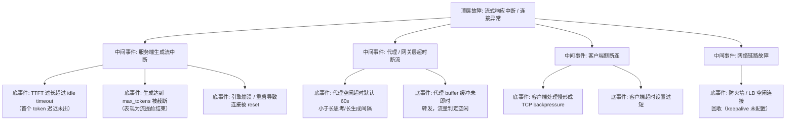

> [!warning] 生产安全提示 · Production Safety
> 本文档含可执行命令/操作步骤。执行前请核对风险等级（🟢低/🔶中/🔴高），高危命令必须 dry-run 并确认回滚方案。完整策略见 [生产安全策略](../../../../治理/Production_Safety_Policy.md)。
<!-- op-safety-banner v1 -->
# FTA: 流式响应中断与连接异常

> 中文简称：FTA: 流式响应中断与连接异常 ｜ English: FTA Streaming Interruption and Connection Error

> **一句话理解**: 流式响应中断大多不是引擎挂了，而是代理层空闲超时、首 token 太慢或生成被截断——从「服务端 vs 代理层 vs 客户端」三段链路定位断点。

---

## 故障树（FTA）



## 问题现象

- 客户端收到部分 token 后连接中断（`connection reset` / `stream ended unexpectedly`），无报错码。
- 长思考模型（o1 类）首个 token 需 30-60 秒，代理层 60s 空闲超时直接断流。
- 流在接近结束处提前终止，输出疑似被截断（可能命中 `max_tokens`）。
- 偶发性中断，重试即恢复；多实例时固定某副本中断（LB 空闲回收）。

## 根因分析

| 根因类别 | 具体原因 | 适用引擎 |
|---------|---------|---------|
| 首 token 过慢 | 长思考 / 长 prefill 场景 TTFT 超过代理 idle timeout | 两者 |
| 生成截断 | `max_tokens` 设置小于实际需求，流在 token 边界被引擎终止 | 两者 |
| 引擎故障 | 进程崩溃、OOM 重启导致 in-flight 连接全部 reset | 两者 |
| 代理超时 | Nginx/Envoy idle timeout（默认 60s）短于 token 间隔 | 两者 |
| 缓冲问题 | 代理缓冲未 flush，长时间无数据转发被判定空闲 | 两者 |
| backpressure | 客户端消费慢，TCP 窗口满，服务端写阻塞后超时断开 | 两者 |
| LB 回收 | 负载均衡器空闲连接回收，客户端无自动重连 | 两者 |

## 诊断步骤

```bash
# 1. 复现并抓包定位断点（服务端 vs 代理 vs 客户端）
# 服务端日志：引擎是否在断流前有报错/重启记录
journalctl -u vllm --since "10 minutes ago" | grep -iE "error|reset|restart"   # 🟢 只读

# 2. 代理层：查看 upstream 响应与空闲超时配置
nginx -T 2>/dev/null | grep -E "proxy_read_timeout|proxy_buffering"   # 🟢 只读
# Envoy: 检查 route timeout / idle_timeout

# 3. 验证是否 max_tokens 截断：对比 finish_reason
# 正常应为 stop；若大量 finish_reason=length 说明截断

# 4. 客户端抓流时间线（首 token 间隔、token 间隔、断点位置）
curl -N -m 300 -X POST localhost:8000/v1/chat/completions \
  -H "Content-Type: application/json" \
  -d '{"model":"m","messages":[{"role":"user","content":"hi"}],"stream":true}'
```

排查要点：

1. **看断点位置**：首个 token 前断 = TTFT/idle timeout；中间断 = 代理/网络；尾部断 = `max_tokens` 截断。
2. **看是否偶发**：固定副本断流 → LB 空闲回收；全部断 → 引擎或代理配置。
3. **看 finish_reason**：`length` 占比高即截断，需调 `max_tokens` 或加输出长度告警。

## 解决方案

**代理层（最常见根因）**：

```nginx
# Nginx: 放宽空闲超时 + 关闭缓冲即时转发
proxy_read_timeout 300s;
proxy_send_timeout 300s;
proxy_buffering off;          # SSE 必须关闭缓冲
```

```yaml
# Envoy: route 超时与 idle 超时对齐引擎能力
route:
  timeout: 300s
  idle_timeout: 300s
```

**服务端**：

- 长思考/长 prefill 业务：代理超时按「TTFT P99 + 生成时长」配置，并开启 `proxy_buffering off` 保证数据即时 flush。
- `max_tokens` 按业务真实需求配置，监控 `finish_reason=length` 占比，超阈值即告警。
- 引擎崩溃类：配合 K8s readiness 探针摘流量，重启前不接收新连接（in-flight 无法避免，客户端需重试）。

**客户端**：

- 流式读取超时按「首 token 等待（如 120s）+ 生成间隔（如 30s）」分别设置，而非整体固定超时。
- 支持断点重连：记录已消费内容，断流后带 `stop` 续接或整请求重试（幂等场景）。
- LB/防火墙侧配置 TCP keepalive，避免空闲连接被回收。

## 预防措施

- SSE 服务全链路禁用代理缓冲（`proxy_buffering off`），超时按引擎真实指标配置。
- 压测覆盖长思考与长生成场景，验证代理层断流边界。
- 监控流式指标：首 token 等待时间、token 间隔 P95、断流率、`finish_reason` 分布。
- 客户端统一流式 SDK，内置重连与退避，避免人工处理断流。

---

## 交叉引用

- [[10_部署推理/02_推理引擎/FTA/推理/FTA_vLLM_SGLang_TTFT_抖动.md|TTFT 抖动 FTA]]
- [[10_部署推理/02_推理引擎/FTA/推理/FTA_vLLM_SGLang_解码延迟高.md|解码延迟高 FTA]]
- [[10_部署推理/02_推理引擎/FTA/推理/FTA_vLLM_SGLang_排队超时.md|排队超时 FTA]]
- [[10_部署推理/02_推理引擎/23_SGLang_深入分析.md|SGLang_Deep_Dive]]
- [[12_架构基建/11_AI网关/README.md|AI 网关]]

*Last updated: 2026-08-28*
