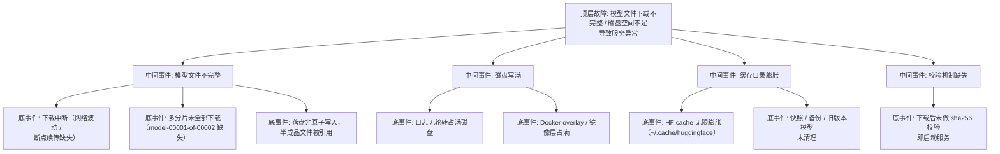

> [!warning] 生产安全提示 · Production Safety
> 本文档含可执行命令/操作步骤。执行前请核对风险等级（🟢低/🔶中/🔴高），高危命令必须 dry-run 并确认回滚方案。完整策略见 [生产安全策略](../../../../治理/Production_Safety_Policy.md)。
<!-- op-safety-banner v1 -->
# FTA: 磁盘空间不足与模型文件下载不完整

> 中文简称：FTA: 磁盘空间不足与模型文件下载不完整 ｜ English: FTA Disk Full and Incomplete Model Download

> **一句话理解**: 模型加载报错先查文件完整性——分片没下全、sha256 没过、磁盘写满三类原因占九成；下载要带校验、落地要原子写入、磁盘要留余量。

---

## 故障树（FTA）



## 问题现象

- 服务启动即崩溃，报 `SafetensorError: Error while deserializing header` 或 `EOFError`（分片不完整）。
- 模型加载到一半报 `No space left on device`，进程退出。
- 启动变慢后失败：`huggingface_hub` 反复重试下载，磁盘剩余空间持续下降。
- 偶发「换了节点就启动成功」——完整文件只在部分节点（缓存未同步）。

## 根因分析

| 根因类别 | 具体原因 | 适用引擎 |
|---------|---------|---------|
| 下载中断 | 网络波动、代理超时导致分片下载中断，且未启用断点续传 | 两者 |
| 分片缺失 | HF 大模型按多分片存储，任一 `model-XXXXX-of-XXXXX.safetensors` 缺失即加载失败 | 两者 |
| 非原子写入 | 直接写入目标目录，下载一半的文件被服务引用 | 两者 |
| 磁盘写满 | 日志无轮转、Docker overlay 膨胀、快照堆积占满节点盘 | 两者 |
| 缓存膨胀 | `~/.cache/huggingface` 多版本模型缓存无限增长 | 两者 |
| 校验缺失 | 下载流程无 sha256 校验，损坏文件直接进入服务 | 两者 |

## 诊断步骤

```bash
# 1. 检查磁盘剩余空间（模型盘与系统盘分别查）
df -h / /models /var/lib/docker   # 🟢 只读

# 2. 检查模型目录文件完整性（分片数量与大小）
ls -lh /models/<model-path>/ | grep safetensors   # 🟢 只读
cat /models/<model-path>/model.safetensors.index.json | head -20   # 对照分片清单

# 3. 与源站比对 sha256（HuggingFace 提供 .sha256 文件）
sha256sum /models/<model-path>/model.safetensors

# 4. 检查 HF 缓存占用
du -sh ~/.cache/huggingface 2>/dev/null   # 🟢 只读

# 5. 看下载日志是否中断重试
journalctl -u <download-job> | grep -iE "retry|interrupted|incomplete"   # 🟢 只读
```

排查要点：

1. **先磁盘后文件**：`df -h` 确认空间；再对照 `model.safetensors.index.json` 核对分片是否齐全。
2. **看缓存命中**：换节点成功说明原节点缓存损坏/缺失，需全量重下。
3. **看写入方式**：部署流程是否「先临时目录 → 校验 → rename」原子落地。

## 解决方案

**完整重下（带校验 + 原子写入）**：

```bash
# 下载到临时目录，校验后原子改名
huggingface-cli download <repo> --local-dir /models/<version>.tmp
cd /models/<version>.tmp && sha256sum -c *.sha256 2>/dev/null || true
# 确认分片齐全：对比 model.safetensors.index.json 中 total_size 与实际文件大小
mv /models/<version>.tmp /models/<version>
```

**磁盘清理（先确认可删除对象）**：

```bash
# 查看大目录分布后清理（删除前必须确认非在用版本）
du -h -d 1 /models ~/.cache/huggingface 2>/dev/null | sort -h
# 日志轮转（logrotate 配置）
# 旧模型版本 / 快照归档到冷存储后再删除
```

**下载可靠性**：

- 使用 `huggingface-cli download --resume`（断点续传）；CI 下载任务加失败重试与完整性校验。
- 模型版本目录化（`/models/<version>/`），服务只引用完整版本，杜绝半成品被引用。
- 下载完成后跑 `from_pretrained` 冒烟加载（加载成功才算下载完成）。

## 预防措施

- 磁盘监控：模型盘与系统盘剩余空间 < 20% 告警；日志统一 logrotate。
- 下载流水线强制 sha256 校验 + 原子 rename + 冒烟加载三步闭环。
- HF 缓存定期清理（保留在用版本 + 最近 1 个历史版本）。
- 镜像/快照生命周期管理，避免 overlay 与备份无上限增长。

---

## 交叉引用

- [[10_部署推理/02_推理引擎/FTA/推理/FTA_vLLM_启动失败_架构_Tokenizer.md|启动失败 FTA（架构/Tokenizer）]]
- [[10_部署推理/02_推理引擎/FTA/推理/FTA_vLLM_SGLang_量化部署_精度下降.md|量化部署精度下降 FTA]]
- [[10_部署推理/02_推理引擎/FTA/推理/FTA_模型热加载_回滚_失败.md|热加载回滚 FTA]]
- [[13_运维/04_问题排查/04_diagnosis_k8s_storage_failure.md|K8s 存储故障诊断]]
- [[10_部署推理/02_推理引擎/29_vLLM_深入分析.md|vLLM_Deep_Dive]]

*Last updated: 2026-08-28*
