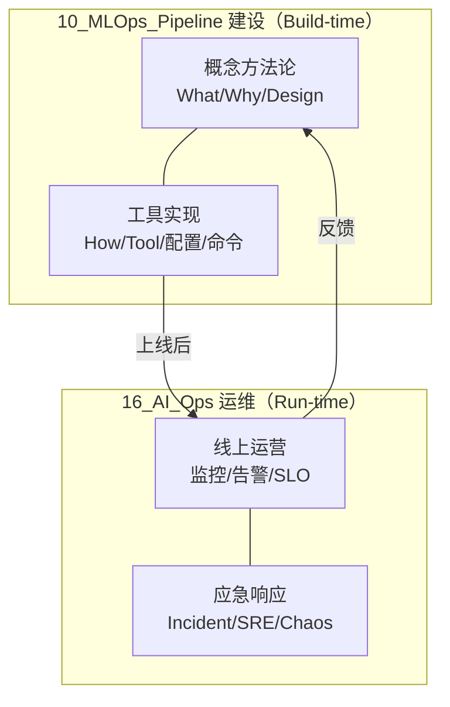

# 10_MLOps_Pipeline 与 16_AI_Ops 边界声明

> **核心原则**: 10 是「**ML 建设**」（概念 + 工具实现），16 是「**AI 运维**」（线上运营 + 应急响应）。
> 工具深度解析已于 2026-06-15 从 16 迁入 10，物理结构现已对齐边界原则。

---

## 一、为什么需要这份声明

2026-06-15 诊断发现：`13_AI_Ops/` 有 16 个工具深度解析与 `11_MLOps_Pipeline/` 主题重叠。为消除重复、建立权威源（SSOT），明确划分两章职责。

**2026-06-15 迁移已完成**：工具深度解析（DVC/Feast/MLflow/Kubeflow/LangSmith/Helicone/Phoenix/Braintrust/ClearML/Prefect/LakeFS + 3 篇 Observability + CI_CD_Pipeline + LLM_Production_Pipeline）已从 16 迁入 10。

---

## 二、分工原则

| 维度 | 10_MLOps_Pipeline | 16_AI_Ops |
|------|------------------|-----------|
| **职责** | ML/LLM 流水线的**建设** | AI 系统的**运维** |
| **生命周期** | Build-time（设计、构建、工具选型） | Run-time（运营、监控、应急） |
| **内容** | 概念方法论 + 工具深度解析 + 流水线设计 | 线上运维 + 事故响应 + SRE + 混沌工程 |
| **读者** | ML 工程师 / LLM 应用工程师 / 数据工程师 | SRE / DevOps / 平台运维 |
| **典型文件** | LLMOps_2026、Feature_Store_Deep_Dive、Feast_Deep_Dive | AI_Incident_Response_Playbook、SRE_for_AI_Systems |

---

## 三、主题归属矩阵（SSOT）

### 3.1 已迁入 10 的工具深度解析（权威源：10）

以下 16 个工具页已从 16 迁入 10，10 是唯一权威源：

| 工具页（现居 10） | 对应概念页（也在 10） |
|------------------|---------------------|
| [[DVC_Deep_Dive]] | [[Data_Versioning_DVC_LakeFS]] |
| [[LakeFS_Deep_Dive]] | [[Data_Versioning_DVC_LakeFS]] |
| [[Feast_Deep_Dive]] | [[Feature_Store_Deep_Dive]] |
| [[MLflow_Deep_Dive]] | [[Experiment_Tracking_Deep_Dive]] |
| [[ClearML_Deep_Dive]] | [[Experiment_Tracking_Deep_Dive]] |
| [[Kubeflow_Deep_Dive]] | [[Data_Pipeline_Orchestration]] |
| [[Prefect_Deep_Dive]] | [[Data_Pipeline_Orchestration]] |
| [[LangSmith_Deep_Dive]] | [[LLM_Evaluation_Pipeline]] / [[LLM_Observability]] |
| [[Helicone_Deep_Dive]] | [[LLM_Observability]] |
| [[Phoenix_Deep_Dive]] | [[LLM_Observability]] / [[ML_Observability_SLO]] |
| [[Braintrust_Deep_Dive]] | [[LLM_Evaluation_Pipeline]] |
| [[AI_Observability_Deep_Dive]] | [[ML_Observability_SLO]] |
| [[AI_Observability_Guide]] | [[ML_Observability_SLO]] |
| [[AI_Observability_Guide_2026]] | [[ML_Observability_SLO]] |
| [[CI_CD_Pipeline_AI_2026]] | [[ML_CI_CD]] |
| [[LLM_Production_Pipeline_2026]] | [[LLMOps_2026]] |

### 3.2 保留在 16 的运维主题（权威源：16）

| 主题 | 权威页 |
|------|--------|
| **AI 运维总览** | [[13_AI_Ops/AI_Ops_2026]] |
| **事故响应** | [[13_AI_Ops/AI_Incident_Response_Playbook]]、[[13_AI_Ops/Incident_Response_for_AI_Systems]] |
| **SRE 实践** | [[13_AI_Ops/SRE_for_AI_Systems]] |
| **混沌工程** | [[13_AI_Ops/Chaos_Engineering_AI]] |
| **安全护栏（工具）** | [[13_AI_Ops/Guardrails_Deep_Dive]]（未迁移，留 16） |
| **Prompt 管理（工具）** | [[13_AI_Ops/PromptLayer_Deep_Dive]]（未迁移，留 16） |

### 3.3 独占主题

| 章节 | 独占主题 |
|------|---------|
| **仅 10** | LLMOps 主线、Prompt/Eval/RAG 流水线、成本与延迟 SLO、再训练、合规、MLOps 成熟度、全部工具深度解析 |
| **仅 16** | Incident Response、SRE、Chaos Engineering、AI Ops 总览 |

---

## 四、写作规范

### 4.1 概念页（10）怎么写

- 用对比表横向比较工具的**设计哲学差异**
- 讲「选型决策树」（什么场景用什么）
- 讲跨工具共性概念（如训练-服务偏差、数据血源）
- **不应**重复具体命令用法（→ 同章的工具深度解析页）

### 4.2 工具页（10）怎么写

- 开头链向概念页：「概念与选型见 [[对应概念页]]」
- 聚焦该工具的**具体命令、配置、部署、踩坑**

### 4.3 运维页（16）怎么写

- 聚焦线上运营、应急响应
- 引用 10 的概念作为背景：「模型监控门禁设计见 [[11_MLOps_Pipeline/Observability/ML_Observability_SLO]]」

---

## 五、与相邻章节的边界

### 10 vs 09_Deployment_Inference

| 主题 | 权威源 |
|------|--------|
| 推理引擎（vLLM/TGI/SGLang） | **09** |
| 量化 / KV Cache / 投机解码 | **09** |
| 部署策略（Shadow/Canary） | **10** |
| 模型服务模式（在线/批/流） | **10**（P2 待建） |

### 10 vs 15_Testing

| 主题 | 权威源 |
|------|--------|
| 测试框架工具用法（Ragas/DeepEval） | **15** |
| 评估方法论（LLM-as-Judge/Eval-Driven） | **10** |

### 10 vs 19_Ethics_Safety

| 主题 | 权威源 |
|------|--------|
| 红队 / 越狱 / 安全攻防 | **19** |
| 合规流水线 / Model Card 门禁 | **10** |

---

## 六、Related

- [[92_Plan/MLOps_Section_Enhancement_Plan_2026|章节加强计划 2026]] — 含本声明的背景与后续路线图
- [[README]] — 10 章节导航
- [[13_AI_Ops/README]] — 16 章节导航

---

*边界声明: 2026-06-15 · 工具迁移已于同日完成 · 维护者: opencode*
