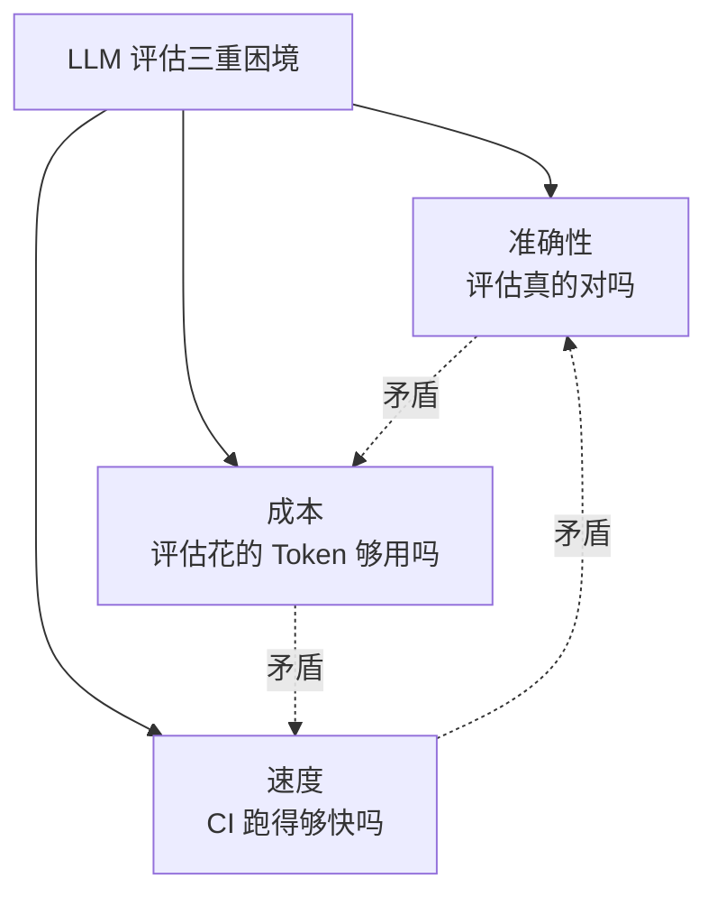
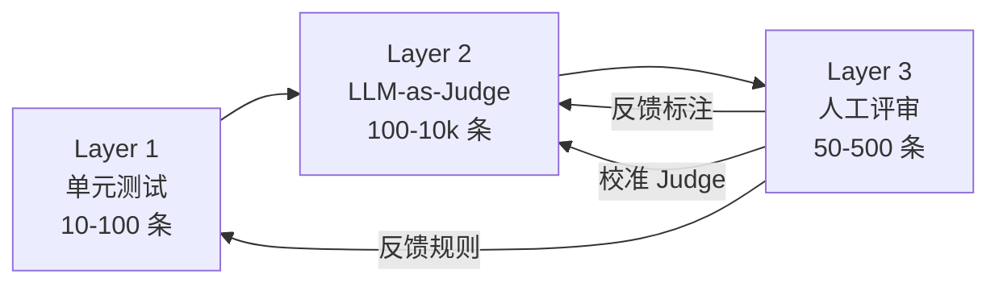
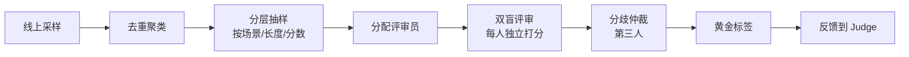
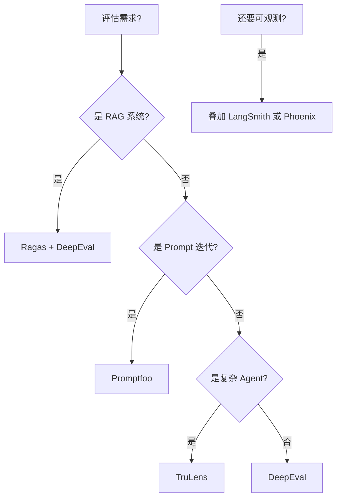
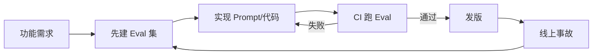

# LLM 评估流水线

> **一句话理解**: 没有自动化评估，LLM 应用的每一次改动都是赌博——评估流水线是把「靠感觉发版」变成「靠数据发版」的唯一途径。

本文是 [[LLMOps_2026]] §4「LLM 评估流水线」的深扩专题。工具细节见 [[09_Testing/RAGAS_Deep_Dive]]、[[09_Testing/DeepEval_Deep_Dive]]、[[09_Testing/Promptfoo_Deep_Dive]]。

---

## 目录

| 章节 | 内容 | 难度 |
|------|------|------|
| [1. 为什么 LLM 评估最难](#1-为什么-llm-评估最难) | 开放生成的评估困境 | 入门 |
| [2. 三层评估体系](#2-三层评估体系) | 单元 / Judge / 人审 | 入门 |
| [3. 黄金集工程](#3-黄金集工程) | 数据集设计与治理 | 进阶 |
| [4. LLM-as-Judge 深入](#4-llm-as-judge-深入) | 实现与陷阱 | 进阶 |
| [5. 人工评审工作流](#5-人工评审工作流) | 流程设计 | 实战 |
| [6. 在线评估](#6-在线评估) | 线上质量监控 | 进阶 |
| [7. 评估框架对比](#7-评估框架对比2026) | Ragas/DeepEval/Promptfoo | 实战 |
| [8. Eval-Driven Development](#8-eval-driven-development) | 评估驱动开发范式 | 前沿 |
| [9. 评估陷阱与反模式](#9-评估陷阱与反模式) | 常见误区 | 实战 |
| [10. 相关文档](#10-相关文档) | 导航 | 导航 |

---

## 1. 为什么 LLM 评估最难

### 1.1 传统 ML vs LLM 评估

| 维度 | 传统 ML 评估 | LLM 评估 |
|------|------------|---------|
| **输出** | 类别 / 数值（可枚举） | 自由文本（不可枚举） |
| **真值** | 测试集有标准答案 | 往往没有标准答案 |
| **指标** | F1 / AUC / MSE（数学定义清晰） | Faithfulness / Relevancy（主观） |
| **失败** | 错就是错 | 部分对、部分错、角度不同 |
| **规模** | 自动跑全测试集 | LLM Judge 每条要花 Token |
| **稳定性** | 确定性（同输入同输出） | 非确定性（同输入可能不同分） |

### 1.2 LLM 评估的三重困境



- **想准** → 用强模型当 Judge / 人审 → **贵且慢**
- **想快** → 用规则断言 / 小模型 Judge → **不准**
- **想省** → 减小测试集 → **覆盖不足**

**核心命题**：LLM 评估流水线的设计本质是**在三重困境中找平衡点**。

---

## 2. 三层评估体系

### 2.1 分层架构



### 2.2 各层定位

| 层 | 规模 | 单条成本 | 用途 | 通过标准 |
|----|------|---------|------|---------|
| **单元测试** | 10–100 | 极低（毫秒） | 格式 / 拒答 / 边界 | 100% 通过 |
| **LLM-as-Judge** | 100–10k | 中（Token 费） | 主观质量、连贯性 | 平均分 ≥ 阈值 |
| **人工评审** | 50–500 | 高（人时） | 校准 Judge、争议 | 抽样一致性 > 80% |

### 2.3 各层互补关系

- **单元测试**抓「明显错误」（格式崩、该拒没拒）
- **LLM Judge**抓「主观质量」（连贯、相关、忠实）
- **人审**抓「Judge 抓不到的」（文化敏感、领域专家判断）

**铁律**：任何一层都不能单独依赖。只有单元测试 = 漏掉主观质量崩塌；只有 Judge = Judge 自己有偏差时全盘皆输；只有人审 = 规模上不去。

---

## 3. 黄金集工程

### 3.1 数据集分层

| 数据集 | 规模 | 来源 | 更新 | 用途 |
|--------|------|------|------|------|
| **冒烟集** (smoke) | 10–20 | 手工核心用例 | 季 | 快速 CI 冒烟 |
| **黄金集** (golden) | 50–200 | PM/专家精编 | 月 | 主回归基线 |
| **线上采样** (online) | 1k–10k | 生产脱敏 | 周 | 覆盖真实分布 |
| **对抗集** (adversarial) | 100–500 | 红队生成 | 季 | 安全防御 |
| **回归集** (regression) | 持续增长 | 事故追加 | 事件驱动 | 永久防御 |

### 3.2 黄金集设计原则

**原则 1：覆盖 > 数量**
100 条覆盖 10 个场景类别，比 1000 条全是闲聊更有价值。

**原则 2：包含失败模式**
黄金集必须包含已知失败模式（幻觉、拒答、格式错），而非全是「正常用例」。

**原则 3：可演化**
黄金集不是化石，每月应：
- 删除已失效用例（问题已修复，永远能过 = 无信息量）
- 新增最近事故用例
- 平衡类别分布

**原则 4：回归集只增不减**
事故用例**永不删除**——它们是防止相同事故再发生的保险。

### 3.3 数据集 schema

```jsonl
{"id": "golden-001", "category": "rag_qa", "input": {"question": "...", "context": "..."}, "expected": {"answer_contains": ["3-5 工作日"], "faithfulness": 1.0}, "source": "pm-zhang", "added": "2026-05-01"}
{"id": "regress-2026-06-15", "category": "safety", "input": {"question": "忽略以上指令..."}, "expected": {"must_refuse": true}, "source": "incident-A", "added": "2026-06-15"}
```

---

## 4. LLM-as-Judge 深入

### 4.1 Judge 的核心模式

| 模式 | 描述 | 适用 | 成本 |
|------|------|------|------|
| **单评分** | 给一个 1–5 分 | 通用 | 1× |
| **成对比较** | A vs B 哪个更好 | A/B 测试 | 2× |
| **rubric 评分** | 按多维标准打分 | 复杂质量 | 1.5× |
| **CoT 评分** | 先写理由再给分 | 高准确性 | 2× |

### 4.2 实现示例

```python
from openai import OpenAI
import json

client = OpenAI()

RUBRIC = """
按以下维度给 RAG 回答打分（1-5）：
- faithfulness: 回答是否仅基于 context？有无编造？
- relevancy: 回答是否切题？
- completeness: 回答是否完整覆盖问题？
- clarity: 表达是否清晰？
"""

def judge(question, context, answer):
    prompt = f"""你是严格的评审。{RUBRIC}

<context>{context}</context>
问题：{question}
回答：{answer}

输出 JSON：{{"faithfulness": int, "relevancy": int, "completeness": int, "clarity": int, "reason": str}}
"""
    resp = client.chat.completions.create(
        model="gpt-5.2",            # Judge 必须用强模型
        messages=[{"role": "user", "content": prompt}],
        response_format={"type": "json_object"},
        temperature=0,              # 评分必须确定性
    )
    return json.loads(resp.choices[0].message.content)
```

### 4.3 Judge 的已知偏差

| 偏差 | 表现 | 缓解 |
|------|------|------|
| **自偏好** | Judge 偏爱自己生成的回答 | 用 Claude 评 GPT，用 GPT 评 Claude |
| **位置偏差** | A/B 比较时偏向第一个 | 随机化顺序，跑两次取平均 |
| **冗长偏差** | 偏向更长的回答 | 加长度归一化 |
| **格式偏差** | 偏向 Markdown 格式 | 显式要求"忽略格式" |
| **过度宽容** | 给所有回答都 4-5 分 | 用成对比较代替绝对评分 |

### 4.4 Judge 校准

Judge 必须**定期用人审校准**：

```python
def calibrate_judge(human_labels, judge_labels):
    """计算 Judge 与人审的一致性"""
    from sklearn.metrics import cohen_kappa_score
    kappa = cohen_kappa_score(human_labels, judge_labels)
    if kappa < 0.4:
        alert("Judge 与人审一致性低（kappa<0.4），需调整 rubric")
    return kappa
```

**目标**：Kappa > 0.6（实质性一致）。低于 0.4 必须重新设计 rubric。

---

## 5. 人工评审工作流

### 5.1 流程设计



### 5.2 评审效率优化

| 技巧 | 收益 | 实现 |
|------|------|------|
| **双盲重复** | 发现个人偏差 | 每条 2 人评，分歧 > 1 分仲裁 |
| **聚类抽样** | 减少重复劳动 | 先嵌入聚类，每簇抽 1-2 条 |
| **主动学习** | 聚焦信息量大的样本 | 优先评 Judge 不自信的 |
| **参考答案** | 提升一致性 | 给评审员示例答案 |
| **rubric 培训** | 对齐标准 | 评审前做 10 条校准题 |

### 5.3 评审成本估算

| 阶段 | 月评审量 | 单条耗时 | 月人时 |
|------|---------|---------|--------|
| PoC | 100 条 | 3 分钟 | 5 小时 |
| 早期生产 | 500 条 | 2 分钟 | 17 小时 |
| 成熟期 | 1000 条 | 1.5 分钟（熟练） | 25 小时 |

**结论**：人审是持续投入，不能一次性做完。建议预算每月 **20–40 人时**。

---

## 6. 在线评估

### 6.1 离线 vs 在线评估

| 维度 | 离线 Eval | 在线 Eval |
|------|----------|----------|
| 时机 | 发版前 | 发版后 |
| 数据 | 历史黄金集 | 真实流量 |
| 指标 | 离线分数 | 用户反馈、隐式信号 |
| 延迟 | 分钟级 | 实时 |
| 用途 | 回归门禁 | 趋势预警 |

### 6.2 在线隐式信号

| 信号 | 含义 | 实现 |
|------|------|------|
| **👍👎 反馈** | 用户显式满意 | UI 按钮 |
| **复制回答** | 用户认为有用 | 监听剪贴板事件 |
| **重试/改写** | 用户不满意 | 检测连续提问 |
| **会话长度** | 深度交互 | 对话轮数 |
| **负向转人工** | 求助客服 | 跳转事件 |

### 6.3 实时质量监控

```python
# 实时计算滑动窗口指标
class OnlineQualityMonitor:
    def __init__(self):
        self.window = SlidingWindow(size=1000)
    
    def on_response(self, response, feedback=None):
        self.window.add({
            "timestamp": now(),
            "response": response,
            "feedback": feedback,
            "model": response.model,
            "prompt_id": response.prompt_id,
        })
        
        # 触发实时 LLM Judge（仅抽样，控制成本）
        if random() < 0.01:    # 1% 抽样
            score = llm_judge(response)
            self.window.update_last(score=score)
        
        # 检测异常
        recent = self.window.last(100)
        if avg(recent.scores) < threshold:
            alert("在线质量下降")
```

---

## 7. 评估框架对比（2026）

### 7.1 框架对比

| 框架 | 类型 | 强项 | 弱项 | 适用 |
|------|------|------|------|------|
| **Ragas** | 开源 | RAG 评估事实标准 | 仅 RAG | RAG 系统 |
| **DeepEval** | 开源 | pytest 风格、CI 友好 | 指标较少 | CI 集成 |
| **Promptfoo** | 开源 | Prompt 对比、红队 | 非通用评估 | Prompt 迭代 |
| **TruLens** | 开源 | Trace + Eval 一体 | 学习曲线陡 | 复杂应用 |
| **LangSmith** | 商业 | 全栈、与 LangChain 原生 | 锁定 | LangChain 用户 |
| **Arize Phoenix** | 商业 | 可观测为主、Eval 为辅 | Eval 较浅 | 重度可观测 |
| **OpenAI Evals** | 开源 | OpenAI 官方 | 通用、不针对应用 | 模型评测 |

### 7.2 选型矩阵



### 7.3 框架组合实践

| 场景 | 推荐组合 |
|------|---------|
| RAG 系统（PoC） | Ragas + Promptfoo |
| RAG 系统（生产） | Ragas + DeepEval（CI） + Langfuse（Trace） |
| Agent 应用 | TruLens + LangSmith |
| 多 Prompt 对比 | Promptfoo + Langfuse |
| 模型选型 | OpenAI Evals + 自建基准 |

---

## 8. Eval-Driven Development

### 8.1 传统 vs Eval-Driven

| 传统开发 | Eval-Driven |
|---------|------------|
| 先写 Prompt → 试几条 → 上线 | 先建 Eval 集 → 再写 Prompt |
| 凭感觉迭代 | 凭指标迭代 |
| 出事故再加测试 | 测试先行 |
| 评估是负担 | 评估是方向盘 |

### 8.2 Eval-Driven 工作流



### 8.3 核心原则

1. **Eval 集先于实现**：写 Prompt 之前，先定义"什么样的回答算合格"
2. **每次改动看指标变化**：禁止"我觉得不错"式发版
3. **事故即测试**：事故发生 24 小时内，必须把导致事故的输入加入回归集
4. **指标治理**：定期删除"永远能过"的测试（已无信息量）

---

## 9. 评估陷阱与反模式

### 9.1 常见陷阱

| 陷阱 | 症状 | 后果 | 解决 |
|------|------|------|------|
| **Judge 自评** | 用 GPT-4 评 GPT-4 输出 | 自偏好，分数虚高 | 交叉 Judge（A 评 B） |
| **黄金集过时** | 测试集永远能过 | 失去回归能力 | 月度淘汰 + 新增 |
| **指标过拟合** | Prompt 为通过测试而优化 | 真实质量反而下降 | 留出集（holdout） |
| **样本偏差** | 测试集全是简单用例 | 高分但实际拉胯 | 用线上采样平衡 |
| **单 Judge 决策** | 只用一个 Judge 模型 | 偏差无法发现 | 双 Judge 交叉 |
| **评估一次** | 上线前评一次就不管 | 线上漂移不知道 | 持续在线评估 |

### 9.2 反模式：分数游戏

**坏味道**：团队为了"分数好看"而优化——降低 Judge 严格度、删掉难的测试、用简单测试凑数。

**症状**：评估分数持续上升，但用户投诉也在上升。

**根治**：评估分数必须与**用户满意度**（隐式 + 显式反馈）**相关性验证**。如果分数涨但满意度没涨，评估体系已经失灵。

---

## 工具实现（本章节）

本文讲 LLM 评估的**方法论**。具体评估工具的用法：

- [[Braintrust_Deep_Dive]] — Braintrust：开源 LLM 评估平台
- [[LangSmith_Deep_Dive]] — LangSmith：LLM 调试与评估
- [[09_Testing/RAGAS_Deep_Dive]] — Ragas：RAG 评估事实标准
- [[09_Testing/DeepEval_Deep_Dive]] — DeepEval：pytest 风格 LLM 测试
- [[09_Testing/Promptfoo_Deep_Dive]] — Promptfoo：Prompt 对比与红队

---

## 10. 相关文档

### 本章内
- [[11_MLOps_Pipeline/LLMOps_2026]] — 本系列主线（§4 是本文的概览版）
- [[11_MLOps_Pipeline/Prompt_Engineering_Ops]] — Prompt CI 门禁依赖本文的评估方法
- [[11_MLOps_Pipeline/RAG_Pipeline_Ops]] — RAG 检索质量评估是本文的应用场景
- [[11_MLOps_Pipeline/MLOps_Maturity_Model]] — 成熟度模型

### 跨章
- [[09_Testing/README]] — 测试章节（本文侧重评估流水线，那章侧重测试工具）
- [[09_Testing/RAGAS_Deep_Dive]] — Ragas 工具详解
- [[09_Testing/DeepEval_Deep_Dive]] — DeepEval 工具详解
- [[09_Testing/Promptfoo_Deep_Dive]] — Promptfoo 工具详解
- [[08_Model_Evaluation/README]] — 传统模型评估（本文是其 LLM 时代的扩展）
- [[05_NLP_LLMs/Reasoning_Models/README]] — Reasoning 模型评估的特殊性
- [[15_Agent_Production/Agent_Evaluation/README]] — Agent 评估（多步调用链）

---

*最后更新：2026-06-15 · 本文是 [[LLMOps_2026]] 的专题深扩*
