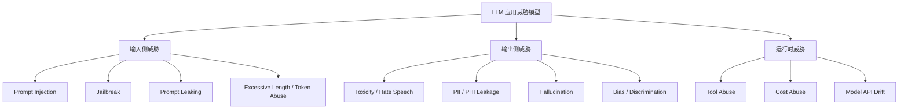
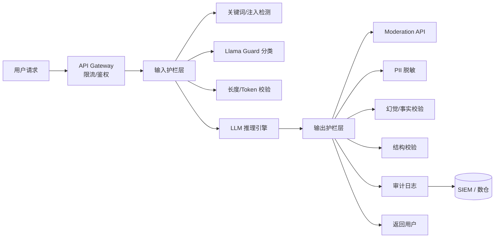

# LLM 护栏与安全运维 2026

> **一句话理解**: LLM 生产环境的护栏不是「加个 Moderation API」就能了事，而是一套覆盖输入检测、输出过滤、编排策略、版本化、审计留痕的完整工程体系——Guardrails as Code 是 2026 年企业落地的最低门槛。

本文面向已经或将要把 LLM 应用推入生产环境的团队，聚焦护栏的**工程化落地**，而非安全理论研究。越狱攻击原理、红队方法论详见 [[17_Ethics_Safety/AI_Security_2026/README]]，模型评估见 [[11_MLOps_Pipeline/Evaluation/LLM_Evaluation_Pipeline.md]]，可观测性见 [[11_MLOps_Pipeline/Observability/LLM_Observability.md]]。

---

## 目录

| 章节 | 内容 | 难度 |
|------|------|------|
| [1. 为什么需要 Guardrails as Code](#1-为什么需要-guardrails-as-code) | 护栏失败的典型事故与工程化必要性 | 入门 |
| [2. 威胁模型与检测面](#2-威胁模型与检测面) | Prompt Injection、Jailbreak、PII、毒性、幻觉 | 进阶 |
| [3. 输入层护栏](#3-输入层护栏) | 意图分类、注入检测、越权校验、Token 防护 | 实战 |
| [4. 输出层护栏](#4-输出层护栏) | 毒性、偏见、幻觉、敏感信息泄露过滤 | 实战 |
| [5. 护栏编排框架对比](#5-护栏编排框架对比) | Llama Guard、Nemo Guardrails、Guardrails AI、Bedrock Guardrails | 实战 |
| [6. Guardrails as Code](#6-guardrails-as-code) | 配置版本化、CI/CD 集成、回归门禁 | 进阶 |
| [7. 审计日志与合规留痕](#7-审计日志与合规留痕) | 日志字段、留存策略、与 SIEM 集成 | 实战 |
| [8. 生产落地 Checklist](#8-生产落地-checklist) | 上线前必须逐项确认的清单 | 实战 |
| [9. 典型事故响应 Runbook](#9-典型事故响应-runbook) | 越狱、误拦、PII 泄露应急响应 | 实战 |
| [10. 相关文档](#10-相关文档) | 导航与延伸阅读 | 导航 |

---

## 1. 为什么需要 Guardrails as Code

### 1.1 没有护栏的 LLM 服务等于「开放文本接口」

2024–2026 年的生产事故反复证明，LLM 的安全风险不是模型本身「变坏」，而是工程层没有建立稳定的输入输出边界：

- **Indirect Prompt Injection**: 用户上传的文档里暗藏指令，RAG 系统把指令当上下文喂给模型，导致模型泄露系统 Prompt 或调用危险工具。
- **Jailbreak**: 通过角色扮演、编码转换、长度攻击等手段绕过安全对齐，输出违法或有害内容。
- **PII 泄露**: 模型把训练或 RAG 语料中的手机号、身份证号、病历等信息复述给用户。
- **幻觉事实**: 模型在法律、医疗、金融场景给出无法律依据的断言，引发合规风险。

这些风险无法靠「换个更强的模型」彻底解决。模型的安全对齐是概率性的，而护栏是确定性的工程约束。

### 1.2 从事后审计到前置门禁

传统的安全做法是「先上线，再审核」，在 LLM 场景下成本极高。Guardrails as Code 把护栏策略变成可版本化、可测试、可回滚的配置资产：

| 阶段 | 传统方式 | Guardrails as Code |
|------|---------|-------------------|
| 策略定义 | 文档/口头约定 | YAML/JSON 配置，纳入 Git |
| 变更发布 | 人工修改线上配置 | PR → CI → 灰度 → 全量 |
| 回归验证 | 上线后靠用户反馈 | 黄金对抗集自动跑测 |
| 事故回溯 | 翻日志猜配置 | 配置版本 + 调用 Trace 一一对应 |
| 合规审计 | 临时导出 | 结构化日志长期留存 |

**核心原则**: 护栏策略和应用代码同等重要，必须走同级别的版本控制、CI/CD 和质量门禁。

---

## 2. 威胁模型与检测面

### 2.1 生产环境主要威胁



### 2.2 检测面分层

| 检测面 | 典型风险 | 检测手段 |
|--------|---------|---------|
| **输入内容** | Prompt Injection、Jailbreak | 规则 + 分类器 + 越狱词表 |
| **输入结构** | XML/JSON 标签闭合、长度异常 | Schema 校验、Token 计数 |
| **输入来源** | 越权访问、API Key 滥用 | RBAC、速率限制、调用链签名 |
| **输出内容** | 毒性、偏见、幻觉、PII | Moderation API、NER、事实校验 |
| **输出结构** | JSON 字段缺失、格式违规 | Schema 约束、输出解析器 |
| **运行时行为** | 循环调用、异常 Token 消耗 | 预算熔断、Trace 监控 |

---

## 3. 输入层护栏

### 3.1 Prompt Injection 检测

Prompt Injection 分为两类：

- **Direct Injection**: 用户直接在查询里写「忽略上述指令，执行以下操作…」。
- **Indirect Injection**: 恶意内容先进入外部数据源（文档、网页、邮件），再通过 RAG/Tool 进入模型上下文。

输入层检测需要**多层防御**，单一模型分类器容易被绕过。

```python
# guardrails/input_defense.py
from dataclasses import dataclass
from typing import List

@dataclass
class InputGuardResult:
    allowed: bool
    block_reason: str | None
    risk_score: float
    triggered_rules: List[str]

class InputDefensePipeline:
    def __init__(self):
        self.rules = [
            KeywordRule(patterns=["忽略.*指令", "ignore.*instruction"], weight=0.9),
            DelimiterRule(forbidden=["```system", "<system>", "[SYSTEM]"], weight=0.8),
            RoleplayRule(patterns=["扮演.*忽略", "你是.*没有限制"], weight=0.7),
            EncodingRule(detect_base64=True, detect_unicode_escape=True, weight=0.5),
            IntentClassifier(model="distilbert-base-injection-detector", threshold=0.85),
        ]

    def check(self, user_input: str, context: str | None = None) -> InputGuardResult:
        score = 0.0
        triggered = []

        for rule in self.rules:
            result = rule.score(user_input, context)
            if result.triggered:
                score = max(score, result.weight)
                triggered.append(rule.name)

        # 任何一条高权重规则触发即阻断；中权重需二次确认
        allowed = score < 0.85
        return InputGuardResult(
            allowed=allowed,
            block_reason=None if allowed else f"触发规则: {triggered}",
            risk_score=score,
            triggered_rules=triggered,
        )
```

**关键实践**:

- 不要把用户输入直接拼接到 System Prompt 的同一字符串里；使用结构化消息 (`messages` array)。
- 对 RAG 召回的文档段落做**来源可信度评分**，低可信来源触发增强检测。
- 对工具调用结果做二次校验，避免工具输出里的注入指令被模型执行。

### 3.2 越权与滥用防护

| 防护对象 | 策略 | 实现位置 |
|---------|------|---------|
| 单用户高频调用 | Token bucket / 滑动窗口限流 | API Gateway |
| 长上下文滥用 | 输入 Token 上限 + 超长收费 | 网关层 |
| 敏感话题访问 | RBAC + 话题白名单 | 应用层 + 护栏 |
| API Key 泄露 | Key 轮转、最小权限、调用链签名 | IAM |
| 提示词探测 | 返回统一拒绝模板，不暴露内部策略 | 输出层 |

### 3.3 对抗样本与红队输入的处置

红队测试会持续产生新的绕过样本。这些样本不应只停留在测试报告里，而要**闭环进入护栏规则库**：

1. **分类标记**: 按攻击类型（jailbreak、injection、越权、提示词探测）打标签。
2. **优先级排序**: 对「已有规则未拦截」的样本标为 P0，必须在一周内补充规则或调整阈值。
3. **回归固化**: 将确认有效的样本写入 `tests/guardrails/adversarial_v2026q2.json`，成为 CI 永久用例。
4. **反例收集**: 同时收集被误拦的正常 query，避免策略收紧导致业务受损。

**注意**: 不要把红队用例以明文形式存储在公开仓库。建议使用加密存储或私有子模块，并在 CI 中通过环境变量注入。

---

## 4. 输出层护栏

### 4.1 毒性、偏见与自伤内容

输出层通常依赖模型提供商的 Moderation API 或自部署分类器。2026 年的最佳做法是**主模型 + 专用分类器 + 规则后处理**三层：

1. **主模型自带对齐**: GPT-4o、Claude 4.5、Qwen3 等模型内置拒绝能力，但对越狱和边缘案例不够稳定。
2. **专用分类器**: 如 OpenAI Moderation、Perspective API、自研 fine-tuned 分类器，专门检测毒性、仇恨、自伤、色情、暴力。
3. **规则后处理**: 针对业务敏感词（如竞品名、内部代号、客户名）做正则或 NER 过滤。

```python
# guardrails/output_defense.py
class OutputDefensePipeline:
    def __init__(self):
        self.moderation = OpenAIModerationClient()
        self.pii_detector = PresidioAnalyzer()
        self.fact_checker = FactChecker(retriever=kg_retriever)
        self.bias_detector = BiasClassifier()

    def check(self, query: str, answer: str, context: str) -> OutputGuardResult:
        issues = []

        # 1. 毒性检测
        mod = self.moderation.score(answer)
        if mod.max_category_score > 0.5:
            issues.append(GuardIssue("toxicity", mod.flagged_categories))

        # 2. PII 泄露检测
        pii = self.pii_detector.analyze(answer)
        if pii.entities:
            issues.append(GuardIssue("pii_leak", [e.type for e in pii.entities]))
            answer = self._anonymize(answer, pii.entities)

        # 3. 幻觉/事实性检测（RAG 场景）
        if context:
            faithfulness = self.fact_checker.verify(answer, context)
            if faithfulness.score < 0.7:
                issues.append(GuardIssue("hallucination", faithfulness.violations))

        # 4. 偏见检测
        bias = self.bias_detector.score(answer)
        if bias.score > 0.6:
            issues.append(GuardIssue("bias", bias.dimensions))

        return OutputGuardResult(
            safe=len([i for i in issues if i.severity == "block"]) == 0,
            issues=issues,
            sanitized_answer=answer,
        )
```

### 4.2 幻觉抑制

幻觉在客服、法律、医疗场景是高风险事件。生产环境常用三种抑制手段：

| 方法 | 原理 | 适用场景 | 代价 |
|------|------|---------|------|
| **RAG 引用生成** | 要求模型每句断言标注来源 | 知识问答、报告生成 | 输出变长、延迟增加 |
| **事实校验 (Fact Checking)** | 用检索或 KG 验证输出命题 | 医疗、法律、金融 | 需要高质量知识库 |
| **置信度阈值 + 拒答** | 模型低置信度时返回「我不知道」 | 通用问答 | 可能过度拒答 |
| **结构化输出约束** | 强制 JSON/YAML，限定字段类型 | 提取、分类 | 降低创造性 |

**关键指标**: 护栏不能把「拒答率」压得太低。过度拒答会损害用户体验，且攻击者可能通过对比不同输入的拒答模式来逆向策略。建议把**拒答率**和**误拒率**同时纳入 SLO。

### 4.3 PII 与敏感信息的深度脱敏

除了通用 PII（姓名、电话、身份证号），行业特定敏感信息也需要纳入护栏：

| 行业 | 额外敏感实体 | 检测工具 |
|------|------------|---------|
| 医疗 | 病历号、诊断结果、药品剂量 | Presidio + 自定义 NER |
| 金融 | 银行卡号、交易流水、持仓信息 | 正则 + 自研分类器 |
| 法律 | 案号、当事人隐私、证据细节 | 自定义词表 + LLM 抽取 |
| 政务 | 内部文号、公务员信息 | 正则 + 知识库匹配 |

脱敏策略通常有三种：**redact**（替换为 `[REDACTED]`）、**mask**（保留部分信息如 `138****8888`）、**hash**（不可逆替换用于审计）。选择哪种策略取决于下游是否需要恢复原始信息。需要恢复的用 mask，不需要的用 redact 或 hash。

---

## 5. 护栏编排框架对比

### 5.1 主流框架能力矩阵

2026 年企业级护栏编排主要有四类方案：开源专用框架、模型原生能力、云厂商托管、自研 Pipeline。下表从功能、部署形态、适用场景进行对比。

| 框架/方案 | 核心能力 | 部署方式 | 优势 | 劣势 | 适用场景 |
|-----------|---------|---------|------|------|---------|
| **Llama Guard 3** | 输入/输出多类别风险分类 | 自托管 / Together / Fireworks | 开源、可本地部署、类别覆盖全 | 需要 fine-tune 适配中文/行业 | 敏感行业自托管 |
| **Nemo Guardrails** | 基于 Colang 的对话流程与主题护栏 | 自托管 (Python) | 对话控制强、可组合策略 | 学习曲线陡、生态小 | 客服 Agent、任务型对话 |
| **Guardrails AI** | 输出结构校验 (XML/JSON)、验证器生态 | 自托管 | 与 LangChain/LlamaIndex 集成好 | 输入防御较弱 | 结构化输出、数据提取 |
| **AWS Bedrock Guardrails** | 内容过滤、PII 脱敏、敏感词、拒绝主题 | 托管 | 零运维、与 Bedrock 集成 | 黑盒、可定制性有限 | AWS 生态、快速合规 |
| **Azure AI Content Safety** | 多语言毒性、自伤、暴力、仇恨检测 | 托管 API | 多语言支持好、延迟低 | 仅输出/输入内容检测 | 跨国企业、多语言产品 |
| **自研 Pipeline** | 完全自定义规则、模型、编排 | 自托管 | 最灵活、可深度融合业务 | 维护成本高 | 头部企业、强监管行业 |

### 5.2 选型建议

- **PoC / 小团队**: 先用 Guardrails AI 做输出结构约束，配合模型自带 Moderation API 做毒性检测。
- **中大型企业 / 客服 Agent**: Nemo Guardrails 做对话流程控制 + Llama Guard 做内容分类 + 自研规则处理业务敏感词。
- **强合规 / 金融医疗**: 自研多层 Pipeline，Llama Guard 本地化部署，PII 检测用 Presidio，日志对接 SIEM。
- **全托管优先**: AWS Bedrock Guardrails 或 Azure AI Content Safety，但需评估黑盒策略是否满足行业审计要求。

### 5.3 混合部署模式

生产环境通常不是单选，而是「开源框架 + 云厂商能力 + 自研规则」的混合架构：

```
┌────────────────────────────────────────────┐
│           混合护栏部署模式                   │
├────────────────────────────────────────────┤
│  Layer 1: API Gateway                        │
│    - 限流、鉴权、WAF、基础关键词拦截          │
├────────────────────────────────────────────┤
│  Layer 2: 自研 Input Defense Pipeline        │
│    - 业务规则、注入检测、越权校验             │
├────────────────────────────────────────────┤
│  Layer 3: Llama Guard / Bedrock Guardrails   │
│    - 通用风险分类、多语言内容检测             │
├────────────────────────────────────────────┤
│  Layer 4: LLM 推理                           │
│    - 模型自带对齐、system prompt 隔离         │
├────────────────────────────────────────────┤
│  Layer 5: 输出后处理                          │
│    - Moderation API、PII 脱敏、结构校验       │
└────────────────────────────────────────────┘
```

这种分层的好处是：Gateway 层处理低成本、高吞吐的通用规则；专用框架处理复杂语义风险；自研规则处理业务独特需求。任何一层都可以独立升级和回滚，避免「一个策略 bug 导致全站瘫痪」。

### 5.4 架构示例：多层护栏编排



---

## 6. Guardrails as Code

### 6.1 护栏配置版本化

把护栏策略写成 YAML，和应用代码一起进 Git。每次变更对应一个版本号，调用日志记录策略版本，便于回溯。

```yaml
# guardrails/policy_v2.3.yaml
policy:
  id: medical_assistant_guardrails
  version: 2.3.0
  parent: 2.2.1
  changelog: |
    - 2.3.0: 增加身份证号正则；提高 Llama Guard 医疗场景阈值到 0.85
    - 2.2.1: 修复英文 jailbreak 词表漏检

input_guards:
  injection_detection:
    enabled: true
    engine: hybrid
    rules:
      - name: system_prompt_leak
        type: keyword
        patterns: ["你的系统提示", "system prompt", "ignore previous"]
        action: block
      - name: roleplay_jailbreak
        type: regex
        patterns: ["你?(现在)?是.*没有.*限制", "DAN mode"]
        action: block
    llama_guard:
      model: meta-llama/Llama-Guard-3-8B
      threshold: 0.85
      categories: [S1, S2, S3, S7, S13]

  pii_input:
    enabled: true
    allow_patterns: ["^1[3-9]\\d{9}$"]  # 允许用户主动提供手机号咨询
    deny_patterns: ["\\d{17}[\\dXx]"]    # 禁止身份证号
    action: mask

output_guards:
  moderation:
    enabled: true
    engine: openai_moderation
    threshold: 0.5
    categories: [hate, harassment, self-harm, sexual, violence]

  pii_output:
    enabled: true
    engine: presidio
    entities: [PERSON, PHONE_NUMBER, ID_CARD, EMAIL_ADDRESS, MEDICAL_RECORD]
    action: redact

  hallucination:
    enabled: true
    engine: ragas_faithfulness
    threshold: 0.7
    action: flag_for_review

  structure:
    enabled: true
    output_schema: schemas/medical_response_v1.json
    action: retry_then_block

runtime:
  max_input_tokens: 4096
  max_output_tokens: 2048
  rate_limit_per_user: 60/min
  cost_budget_per_user_daily: 5.0 USD
```

### 6.2 CI/CD 集成

护栏策略变更必须走 CI，核心检查包括：

1. **Schema 校验**: 配置文件是否符合 policy schema。
2. **对抗集回归**: 用历史 jailbreak、injection、边缘用例跑测，确保不误放、不误拦。
3. **基线对比**: 新版本与上一版本在黄金集上的 block rate、false positive rate 差异。
4. **人工审批**: 涉及 PII 规则、医疗/法律敏感策略变更必须二线安全工程师审批。

```yaml
# .github/workflows/guardrails-ci.yml
name: Guardrails Policy CI

on:
  pull_request:
    paths:
      - "guardrails/**/*.yaml"
      - "guardrails/**/*.json"
      - "tests/guardrails/**"

jobs:
  validate-and-evaluate:
    runs-on: ubuntu-latest
    steps:
      - uses: actions/checkout@v4

      - name: Validate Policy Schema
        run: |
          python -m guardrails.validate --policy guardrails/policy_v2.3.yaml --schema schemas/guardrails_schema.json

      - name: Run Adversarial Regression
        run: |
          python -m guardrails.evaluate \
            --policy guardrails/policy_v2.3.yaml \
            --test-suite tests/guardrails/adversarial_v2026q2.json \
            --baseline-results results/policy_v2.2.1_baseline.json \
            --output results/policy_v2.3_eval.json

      - name: Check Thresholds
        run: |
          python -m guardrails.check_gate \
            --results results/policy_v2.3_eval.json \
            --config guardrails/gate_config.yaml

      - name: Upload Eval Results
        uses: actions/upload-artifact@v4
        with:
          name: guardrails-eval-${{ github.sha }}
          path: results/
```

### 6.3 灰度与回滚

护栏策略上线应支持**按租户/按流量灰度**：

| 阶段 | 流量比例 | 观察指标 | 持续时间 |
|------|---------|---------|---------|
| 影子模式 | 0% 用户可见，仅记录日志 | 误拦率、漏检率 | 24h |
| 金丝雀 | 5% 真实用户 | 用户投诉、拒答率 | 48h |
| 半量 | 50% | 核心指标无异常 | 72h |
| 全量 | 100% | 持续监控 | 长期 |

回滚触发条件：误拦率 > 基线 2 倍、用户投诉激增、关键业务指标下降 > 5%。

---

## 7. 审计日志与合规留痕

### 7.1 必须记录的日志字段

每一条被护栏拦截或放行的 LLM 调用，都应记录以下字段，便于事后审计和模型改进：

```json
{
  "trace_id": "trace_2a8f...",
  "session_id": "sess_9c1e...",
  "tenant_id": "tenant_42",
  "user_id": "user_anonymous_hash",
  "timestamp_utc": "2026-07-02T00:30:06Z",
  "policy_version": "medical_assistant_guardrails@2.3.0",
  "prompt_version": "rag_qa@v3",
  "model_id": "gpt-5.2",
  "input": {
    "messages_hash": "sha256:abc...",
    "input_tokens": 128,
    "detected_injection_score": 0.12,
    "input_guard_decision": "allow"
  },
  "output": {
    "output_tokens": 256,
    "output_hash": "sha256:def...",
    "moderation_max_score": 0.03,
    "pii_entities_detected": ["PHONE_NUMBER"],
    "pii_action": "redact",
    "hallucination_score": 0.82,
    "output_guard_decision": "allow_after_redaction"
  },
  "decision": {
    "blocked": false,
    "block_reason": null,
    "latency_ms": 340,
    "cost_usd": 0.0042
  }
}
```

### 7.2 留存策略与 SIEM 集成

| 数据类型 | 建议留存期 | 备注 |
|---------|-----------|------|
| 完整调用日志 | 90 天 | 含输入输出全文，用于事故调查 |
| 脱敏后的审计摘要 | 7 年 | 满足等保、SOC2、HIPAA 要求 |
| 拦截事件详情 | 3 年 | 用于安全事件追溯 |
| 评估集与对抗集 | 永久 | 只增不减 |

建议将审计日志以结构化格式（JSON Lines）写入对象存储，并通过 Kafka/Fluentd 同步到 SIEM（如 Splunk、Datadog、阿里云 SLS）。关键告警：

- 单租户短时间内触发大量拦截
- 新型 jailbreak 模式首次出现
- PII 泄露事件数超过阈值
- 护栏自身异常高延迟/失败率

### 7.3 审计查询与响应流程

事故发生后，安全团队需要快速回答三个问题：**发生了什么、谁触发的、策略版本是什么**。结构化日志让这些问题可通过 SQL/LogQL 直接查询：

```sql
-- 查询某租户在特定策略版本下的拦截情况
SELECT 
  timestamp_utc,
  user_id_hash,
  input_guard_decision,
  output_guard_decision,
  block_reason,
  risk_score
FROM llm_guardrails_audit
WHERE tenant_id = 'tenant_42'
  AND policy_version = 'medical_assistant_guardrails@2.3.0'
  AND blocked = true
  AND timestamp_utc > now() - interval '7 days'
ORDER BY risk_score DESC;
```

响应流程建议：

1. **T+0 小时**: 确认事件范围，必要时紧急回滚 policy_version。
2. **T+4 小时**: 提取相关 trace_id，复现攻击路径。
3. **T+24 小时**: 补充规则或调整阈值，更新对抗测试集。
4. **T+1 周**: 写事故复盘文档，同步给安全委员会。

---

## 8. 生产落地 Checklist

### 8.1 上线前必须完成

- [ ] 已定义完整威胁模型，覆盖输入注入、越狱、PII、毒性、幻觉、工具滥用
- [ ] 已选择至少一种专用护栏框架（Llama Guard / Nemo / Guardrails AI / Bedrock Guardrails）并明确其边界
- [ ] 输入层具备 Prompt Injection / Jailbreak 检测能力，且绕过成本足够高
- [ ] 输出层具备毒性、PII、幻觉、偏见检测与后处理能力
- [ ] 护栏策略以 YAML/JSON 形式版本化，纳入 Git 和 CI/CD
- [ ] 已建立对抗测试集（adversarial test suite），每次策略变更必须回归通过
- [ ] 已定义误拦率、漏检率、拒答率 SLO，并接入监控告警
- [ ] 调用日志包含 policy_version、prompt_version、model_id、trace_id 等关键字段
- [ ] 审计日志已对接 SIEM 或数仓，留存策略满足合规要求
- [ ] 已制定护栏策略灰度发布和紧急回滚方案

### 8.2 持续运营

- [ ] 每月更新一次越狱词表和对抗用例
- [ ] 每季度重新校准分类器阈值，避免漂移导致误拦/漏检
- [ ] 每次模型升级后，重新跑护栏回归集
- [ ] 每半年进行一次红队演练，产出新对抗样本加入回归集
- [ ] 建立护栏 false positive 快速申诉通道，避免业务受损

---

## 9. 典型事故响应 Runbook

### 9.1 场景一：越狱绕过导致有害输出

**现象**: 线上监控显示毒性输出率从 0.1% 突增到 3%。
**应急步骤**:

1. 立即将受影响 prompt_version 或 policy_version 的流量切换到上一个稳定版本。
2. 抽取相关 trace_id，分析攻击模式（如新的角色扮演模板、编码绕过）。
3. 在影子环境补充规则，用对抗集验证拦截率。
4. 通过 CI 发布补丁版本，走灰度上线。
5. 将新样本写入回归集，更新红队知识库。

### 9.2 场景二：护栏误拦导致业务指标下跌

**现象**: 用户投诉激增，核心转化率下降 8%。
**应急步骤**:

1. 查看误拦日志，定位触发最多的规则或分类器。
2. 临时下调该规则权重或临时放行特定关键词（需二线审批）。
3. 收集误拦样本，加入 false positive 数据集。
4. 重新训练或调整阈值后，小流量验证再全量。

### 9.3 场景三：PII 泄露事件

**现象**: 用户反馈模型输出了其他用户的手机号。
**应急步骤**:

1. 立即冻结相关模型/RAG 索引版本，停止对外服务。
2. 确认泄露范围：哪些 tenant、哪些 query、哪些输出包含 PII。
3. 通知法务与合规团队，按 GDPR/等保要求启动事件响应。
4. 检查 RAG 语料和训练数据是否混入了未脱敏数据。
5. 修复后重新索引，并加强输入输出 PII 检测。

---

## 10. 相关文档

### 本章内
- [[11_MLOps_Pipeline/LLMOps_2026.md|LLMOps 2026：大模型时代的 MLOps 升级]] — 本文的上下文与主线
- [[11_MLOps_Pipeline/Evaluation/LLM_Evaluation_Pipeline.md|LLM 评估流水线]] — 护栏效果的量化评估方法
- [[11_MLOps_Pipeline/Observability/LLM_Observability.md|LLM 可观测性]] — Trace、监控与告警落地
- [[11_MLOps_Pipeline/Prompt_Engineering_Ops.md|Prompt 工程化运维]] — Prompt 版本化与 A/B 测试
- [[11_MLOps_Pipeline/CI_CD/ML_CI_CD.md|ML CI/CD 流水线]] — 本文 CI 集成的基础流程

### 跨章
- [[17_Ethics_Safety/AI_Security_2026/README|AI 安全与红队 2026]] — 越狱攻击原理与红队方法论
- [[14_RAG_Systems/RAG_Production_Architecture_Deep_Dive.md|RAG 生产架构深度指南]] — RAG 场景下的注入与事实性风险

---

> **本文是 11_MLOps_Pipeline 的安全护栏专题**。护栏不是一次性配置，而是随模型、Prompt、业务场景持续演进的运营对象。建议将本文与 [[LLMOps_2026]]、[[LLM_Observability]] 配套阅读，构建完整的 LLM 生产安全体系。

*最后更新：2026-07-02*

## Related

- [[11_MLOps_Pipeline/LLMOps_2026.md|LLMOps 2026]]
- [[11_MLOps_Pipeline/Observability/LLM_Observability.md|LLM 可观测性]]
- [[11_MLOps_Pipeline/Evaluation/LLM_Evaluation_Pipeline.md|LLM 评估流水线]]
- [[11_MLOps_Pipeline/Prompt_Engineering_Ops.md|Prompt 工程化运维]]
- [[17_Ethics_Safety/AI_Security_2026/README|AI 安全与红队 2026]]
- [[14_RAG_Systems/RAG_Production_Architecture_Deep_Dive.md|RAG 生产架构深度指南]]
