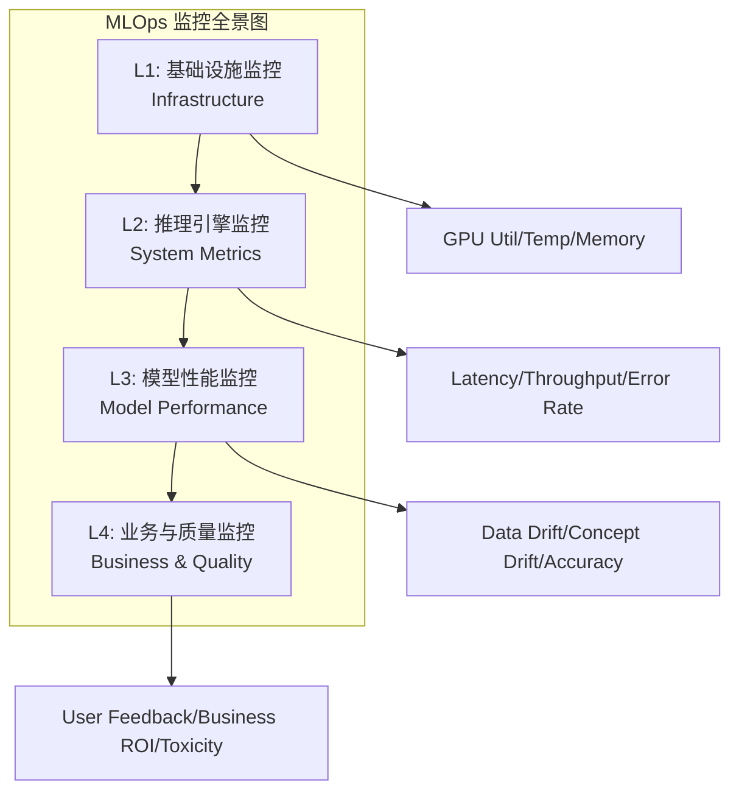
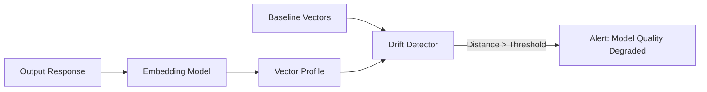

# Model Monitoring and Drift Detection 2026

> **一句话理解**: 模型监控是 AI 生产系统的“哨兵”——不仅要确保系统在运行，更要确保模型没有因为数据分布的变化而产生“幻觉”或性能退化。

---

## 目录

| 章节 | 内容 | 难度 |
|------|------|------|
| [监控分层架构](#1-监控分层架构) | 基础设施、系统指标、业务指标、模型指标 | 入门 |
| [漂移检测理论](#2-漂移检测理论) | 数据漂移、概念漂移、标签漂移、预测漂移 | 进阶 |
| [统计检测方法](#3-统计检测方法) | PSI、KS 检验、KL 散度、Wasserstein 距离 | 进阶 |
| [生成式 AI 监控](#4-生成式-ai-监控) | 幻觉率、毒性、语义漂移、RAG 评估 | 前沿 |
| [闭环监控体系](#5-闭环监控体系) | 反馈回路、A/B 测试、影子模式、金丝雀发布 | 进阶 |
| [实战代码](#6-实战代码) | Evidently、WhyLabs、Deepchecks 示例 | 实战 |
| [相关文档](#7-相关文档) | 导航与延伸阅读 | 导航 |

---

## 1. 监控分层架构

在 2026 年的生产实践中，一个完整的 MLOps 监控体系被划分为四个层级：



### 1.1 四层监控对比

| 层级 | 关注点 | 核心指标 | 常用工具 |
|------|-------|---------|---------|
| **L1: 基础设施** | 算力与网络 | GPU 显存、GPU 利用率、功耗、磁盘 I/O | Prometheus, DCGM |
| **L2: 推理引擎** | 系统吞吐与延迟 | P99 Latency, TTFT, TPS, 5xx Rate | Grafana, Jaeger |
| **L3: 模型性能** | 算法有效性 | PSI, KS 统计量, F1-score, 预测漂移 | Evidently, WhyLabs |
| **L4: 业务质量** | 真实产出与风险 | 用户满意度、幻觉率、Token 成本、ROI | LangSmith, Langfuse |

---

## 2. 漂移检测理论

漂移 (Drift) 是指生产环境数据与训练环境数据之间分布的不一致，是导致模型性能下降的核心原因。

### 2.1 数据漂移 (Data Drift / Covariate Shift)

**定义**: 特征 $P(X)$ 的分布发生了变化，但条件概率 $P(Y|X)$ 保持不变。

- **现象**: 输入数据的分布变了，但模型对给定输入的判断逻辑依然正确。
- **示例**: 一个医疗诊断模型，训练数据主要来自年轻人，上线后大量老年人使用，导致特征分布变化。

### 2.2 概念漂移 (Concept Drift)

**定义**: 特征与目标之间的关系 $P(Y|X)$ 发生了变化，即模型的“知识”过时了。

- **现象**: 相同的输入，现在的输出标签不同了。
- **示例**: 金融风控模型中，欺诈者的作案手段升级，旧的欺诈特征不再对应欺诈行为。

### 2.3 预测漂移 (Prediction Drift)

**定义**: 模型预测值 $P(\hat{Y})$ 的分布发生了显著偏移。

- **价值**: 预测漂移通常是数据漂移或概念漂移的早期信号。由于生产环境中通常无法实时获得真实标签 (Ground Truth)，监控预测值的分布是**成本最低**且**最实时**的方法。

### 2.4 漂移检测全景

```mermaid
flowchart LR
    subgraph "Drift Types"
        A[Data Drift<br/>P(X) changed]
        B[Concept Drift<br/>P(Y|X) changed]
        C[Label Drift<br/>P(Y) changed]
    end

    A --> D[Feature level]
    B --> E[Model level]
    C --> F[Label level]

    D --> G[Monitor input distribution]
    E --> H[Monitor accuracy/error]
    F --> I[Monitor target distribution]
```

---

## 3. 统计检测方法

### 3.1 PSI (Population Stability Index)

PSI 是工业界（尤其是金融领域）衡量分布稳定性最常用的指标。

- **公式**: $PSI = \sum (Actual\% - Reference\%) \times \ln(\frac{Actual\%}{Reference\%})$
- **阈值标准**:
 - $PSI < 0.1$: 分布稳定，无显著变化。
 - $0.1 \le PSI < 0.25$: 发生中度漂移，需警惕。
 - $PSI \ge 0.25$: 发生显著漂移，必须重新训练或检查。

```python
def calculate_psi(expected, actual, buckets=10):
    """
    计算群体稳定性指数 (PSI)
    """
    import numpy as np
    
    def scale_range(input_data, min_val, max_val):
        return (input_data - min_val) / (max_val - min_val)

    # 确定分箱边界
    breakpoints = np.percentile(expected, np.arange(0, 101, 100 // buckets))
    
    expected_percents = np.histogram(expected, bins=breakpoints)[0] / len(expected)
    actual_percents = np.histogram(actual, bins=breakpoints)[0] / len(actual)

    # 避免除以 0
    expected_percents = np.clip(expected_percents, 1e-6, None)
    actual_percents = np.clip(actual_percents, 1e-6, None)

    psi_value = np.sum((actual_percents - expected_percents) * np.log(actual_percents / expected_percents))
    return psi_value
```

### 3.2 KS 检验 (Kolmogorov-Smirnov Test)

KS 检验用于检测两个分布的累积分布函数 (CDF) 之间的最大差距。

- **优势**: 非参数检验，对分布类型无要求。
- **p-value**: 如果 $p < 0.05$，则拒绝原假设，认为两个分布存在显著差异。

### 3.3 KL 散度与 JS 散度

- **KL 散度 (Kullback-Leibler Divergence)**: 衡量两个分布的差异，不对称。
- **JS 散度 (Jensen-Shannon Divergence)**: 对称版 KL 散度，数值在 [0, 1] 之间，更易于设定告警阈值。

### 3.4 Wasserstein 距离 (Earth Mover's Distance)

衡量将一个分布“搬运”成另一个分布所需的最小代价。对于数值型特征，能够捕捉到分布的整体偏移。

---

## 4. 生成式 AI 监控 (LLMOps)

在 2026 年，大模型的监控重点从简单的数值统计转向了语义和内容的评估。

### 4.1 LLM 指标矩阵

| 维度 | 指标 | 说明 | 检测工具 |
|------|-----|------|---------|
| **性能** | **TTFT / TPS** | 首 Token 延迟与吞吐 | Prometheus |
| **质量** | **幻觉率 (Hallucination)** | 回答是否符合已知事实 | LLM-as-Judge |
| **安全** | **毒性 (Toxicity)** | 是否包含歧视、暴力内容 | Safety Guardrails |
| **语义** | **语义漂移 (Semantic Drift)** | 回答的 Embedding 空间分布变化 | Vector DB + PSI |
| **成本** | **Token Efficiency** | 单个请求的平均 Token 成本 | CloudWatch / Custom |

### 4.2 语义漂移监控 (Semantic Drift)

通过对比生产环境回答与 Golden Set（黄金标准集）的 Embedding 距离，可以发现模型能力的退化。



### 4.3 RAG 监控三支柱 (RAG Triad)

1. **Context Relevance**: 检索到的上下文是否与问题相关？
2. **Faithfulness**: 回答是否基于检索到的上下文（无幻觉）？
3. **Answer Relevance**: 回答是否真正解决了用户的问题？

---

## 5. 闭环监控体系

监控不是终点，自动化的响应才是关键。

### 5.1 部署策略与监控集成

- **金丝雀发布 (Canary Release)**: 将 5% 的流量导向新模型，实时监控其漂移和错误率。
- **影子模式 (Shadow Mode)**: 新旧模型同时对同一请求进行预测，但只有旧模型的预测返回给用户。监控新旧模型预测的一致性。
- **A/B 测试**: 通过业务指标 (如点击率、转化率) 决定新模型是否胜出。

### 5.2 反馈回路 (Feedback Loops)

- **显式反馈**: 用户点击“赞/踩”。
- **隐式反馈**: 用户是否采纳了建议、后续停留时间、是否重复提问。

---

## 6. 实战代码

### 6.1 使用 Evidently 检测数据漂移 (推荐用于回归/分类)

```python
import pandas as pd
from sklearn import datasets
from evidently.report import Report
from evidently.metric_preset import DataDriftPreset, TargetDriftPreset

# 1. 模拟数据：参考集 (训练数据) 和 当前集 (生产数据)
iris = datasets.load_iris()
iris_frame = pd.DataFrame(iris.data, columns=iris.feature_names)
reference = iris_frame.iloc[:75]
current = iris_frame.iloc[75:]

# 2. 创建漂移报告
data_drift_report = Report(metrics=[
    DataDriftPreset(),
    TargetDriftPreset(),
])

data_drift_report.run(reference_data=reference, current_data=current)

# 3. 导出结果
data_drift_report.save_html("iris_drift_report.html")
# data_drift_report.save_json("drift_report.json")

# 4. 获取核心统计量
result = data_drift_report.as_dict()
drift_share = result['metrics'][0]['result']['share_of_drifted_columns']
print(f"漂移特征占比: {drift_share:.2%}")
```

### 6.2 使用 WhyLabs 进行无服务器监控

WhyLabs 支持通过 `whylogs` 库在边缘或推理端生成 Profile（数据摘要），极大地减少了监控的数据传输成本。

```python
import whylogs as why
from whylogs.api.writer.whylabs import WhyLabsWriter

# 1. 初始化 Writer
writer = WhyLabsWriter()

# 2. 对生产数据生成 Profile (不传输原始数据，仅传输统计摘要)
profile = why.log(production_dataframe).profile()

# 3. 写入 WhyLabs 平台进行可视化与告警
writer.write(file=profile.view())
```

---

## 7. 相关文档

### 项目内导航

- [MLOps Pipeline](./MLOps_Pipeline.md) — MLOps 整体架构与成熟度模型
- [AI Observability Guide](AI_Observability_Guide.md) — 基础设施与推理层面的实时监控
- [Model Evaluation](../08_Model_Evaluation/Model_Evaluation.md) — 静态评估与基准测试方法
- [LLMOps 2026 Best Practices](./LLMOps_2026_Best_Practices.md) — 生成式 AI 专属运维实践

### 关键工具链

- **Evidently AI**: 开源的数据与模型质量报告工具。
- **WhyLabs / whylogs**: 专注于数据 Profile 和大规模漂移检测的平台。
- **Deepchecks**: 用于数据与模型测试的自动化框架。
- **Giskard**: 针对模型漏洞、偏见和幻觉的开源扫描器。

---

*Last updated: 2026-06-04*

## 延伸阅读

- [[_synthesis/mlops-monitoring-convergence|MLOps 监控趋势：从数值统计到语义观测的融合]]
