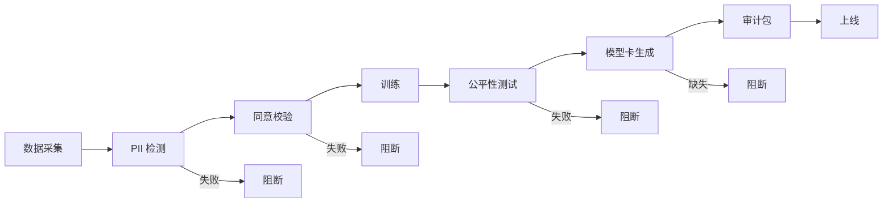

# 隐私与合规流水线

> **一句话理解**: 合规不是上线后补的论文，是流水线的门禁——PII 检测、数据血源、模型卡强制化、审计追溯，让每个模型都能回答「用了谁的数据、给谁用、合不合规」。

本文是合规视角的 MLOps。隐私保护技术（联邦学习/差分隐私）见 [[17_Ethics_Safety/Privacy_Preserving_AI/README]]，安全红队见 [[17_Ethics_Safety/AI_Security_2026/README]]。

---

## 目录

| 章节 | 内容 | 难度 |
|------|------|------|
| [1. 为什么合规是流水线问题](#1-为什么合规是流水线问题) | 上线即审计 | 入门 |
| [2. PII 检测与脱敏](#2-pii-检测与脱敏) | 数据进门第一关 | 实战 |
| [3. 数据血源与同意](#3-数据血源与同意) | 来源可追溯 | 进阶 |
| [4. 模型卡强制化](#4-模型卡强制化) | 文档即门禁 | 进阶 |
| [5. 公平性门禁](#5-公平性门禁) | 算法歧视防御 | 实战 |
| [6. 审计与追溯](#6-审计与追溯) | 出事能查清 | 管理 |
| [7. 合规框架对标](#7-合规框架对标) | GDPR/AI Act/个保法 | 管理 |
| [8. 相关文档](#8-相关文档) | 导航 | 导航 |

---

## 1. 为什么合规是流水线问题

### 1.1 事后补合规的灾难

| 场景 | 后果 |
|------|------|
| 训练数据混入他人数据 | 被起诉、模型下线 |
| 上线后才发现有偏见 | 公关危机、监管处罚 |
| 审计要求追溯模型来源 | 无法回答，违规 |
| 用户要求删除数据（GDPR） | 数据已进模型，无法删除 |

### 1.2 Shift-Left Compliance

像「测试左移」一样，合规检查必须**左移到流水线最早阶段**：



**核心**：任何一环不通过，模型就不能上线。合规是**门禁**，不是文档。

---

## 2. PII 检测与脱敏

### 2.1 PII 类型

| 类型 | 例子 | 风险 |
|------|------|------|
| **直接标识** | 身份证号、护照号 | 极高 |
| **准标识** | 邮编+生日+性别 | 中（组合可识别） |
| **敏感属性** | 种族、宗教、健康 | 高（特殊保护） |
| **联系方式** | 手机、邮箱、地址 | 中 |
| **生物特征** | 人脸、指纹 | 极高 |

### 2.2 检测与脱敏

```python
from presidio_analyzer import AnalyzerEngine
from presidio_anonymizer import AnonymizerEngine

analyzer = AnalyzerEngine()
anonymizer = AnonymizerEngine()

PII_ENTITIES = [
    "PHONE_NUMBER", "EMAIL_ADDRESS", "ID_CARD",
    "BANK_ACCOUNT", "IP_ADDRESS", "PERSON",
]

def scrub_dataset(text: str, mode: str = "anonymize"):
    """检测并处理 PII"""
    results = analyzer.analyze(text=text, entities=PII_ENTITIES, language="zh")
    
    if not results:
        return text, []
    
    if mode == "anonymize":        # 替换为占位符
        return anonymizer.anonymize(text, results).text, results
    elif mode == "redact":          # 完全删除
        return redact_all(text, results), results
    elif mode == "flag":            # 仅标记，不处理
        return text, results
```

### 2.3 脱敏策略对比

| 策略 | 描述 | 适用 |
|------|------|------|
| **脱敏（Anonymize）** | 替换为 `[EMAIL]` | 训练数据 |
| **假名化（Pseudonymize）** | 替换为可逆 token | 需要反查 |
| **删除（Redact）** | 直接删 | 不需要该字段 |
| **泛化（Generalize）** | 年龄 25→20-30 | 统计分析 |
| **加密（Encrypt）** | 加密存储 | 静态数据 |

---

## 3. 数据血源与同意

### 3.1 数据血源（Data Lineage）

每个训练样本必须能追溯到来源：

```json
{
  "sample_id": "train-001",
  "source": {
    "system": "crm",
    "table": "user_events",
    "exported_at": "2026-06-01",
    "consent": "user_consent_v2",
    "legal_basis": "合同履行"
  },
  "transformations": [
    {"step": "dedup", "timestamp": "2026-06-02"},
    {"step": "pii_scrub", "timestamp": "2026-06-02"},
    {"step": "feature_extract", "timestamp": "2026-06-03"}
  ]
}
```

### 3.2 同意管理

| 同意状态 | 能否用于训练 |
|---------|------------|
| 明确同意 | ✅ |
| 默认同意（可撤回） | ✅（需监听撤回） |
| 未同意 | ❌ |
| 曾同意后撤回 | ❌（需从数据集删除） |

**GDPR 陷阱**：用户撤回同意后，**已训练的模型怎么办**？技术上很难「从模型里删除数据」。解决方案：
- 用差分隐私训练，降低单样本影响
- 必要时承诺「撤回后重训」
- 法律上限定数据保留期

---

## 4. 模型卡强制化

### 4.1 模型卡（Model Card）最小要素

```yaml
model_card:
  name: recsys-v2
  version: "2.3"
  owner: team-recsys
  
  training_data:
    sources: [crm.user_events, events.purchase_log]
    time_range: 2026-01-01 to 2026-05-31
    size: 12M samples
    pii_status: scrubbed
    consent_version: user_consent_v2
  
  intended_use:
    primary: 商品推荐
    out_of_scope: [信用评估, 定价]
  
  evaluation:
    overall: { f1: 0.89 }
    by_group:
      gender: { male: 0.90, female: 0.88 }
      age: { "<25": 0.91, "25-45": 0.89, ">45": 0.84 }
    fairness_check: passed
  
  risks:
    - type: age_bias
      description: ">45 岁群体 F1 偏低"
      mitigation: "持续收集该群体数据，下版重训"
  
  ethical_review:
    status: approved
    reviewer: ethics-committee
    date: 2026-06-10
```

### 4.2 模型卡作为门禁

```python
def deploy_gate(model):
    card = load_model_card(model.id)
    
    if not card:
        return reject("无模型卡，禁止上线")
    if not card.evaluation.by_group:
        return reject("缺分群体评估")
    if card.evaluation.fairness_check != "passed":
        return reject("公平性未通过")
    if card.ethical_review.status != "approved":
        return reject("未过伦理审查")
    
    return approve()
```

详见 [[Model_Registry_and_Cards_Deep_Dive]]。

---

## 5. 公平性门禁

### 5.1 公平性指标

| 指标 | 含义 |
|------|------|
| **Demographic Parity** | 各群体正例率相近 |
| **Equal Opportunity** | 各群体召回率相近 |
| **Equalized Odds** | 各群体 FPR/TPR 相近 |
| **Disparate Impact** | 四分之五规则 |

### 5.2 自动公平性测试

```python
def fairness_gate(model, test_set):
    results = {}
    for group in ["gender", "age_group", "region"]:
        metrics = evaluate_by_group(model, test_set, group)
        results[group] = metrics
        
        # 群体间差距 > 10% 告警
        max_gap = max(metrics.values()) - min(metrics.values())
        if max_gap > 0.10:
            return reject(f"{group} 群体差距 {max_gap} > 0.10")
    
    return approve(results)
```

详见 [[08_Model_Evaluation/Fairness_Evaluation_for_dummy]]。

---

## 6. 审计与追溯

### 6.1 审计包内容

每次模型上线必须归档审计包：

| 文件 | 用途 |
|------|------|
| 模型卡 | 模型说明 |
| 训练数据血源 | 数据来源 |
| 评估报告（含分群体） | 性能与公平性 |
| 代码 commit + data version | 可复现 |
| 伦理审查记录 | 合规签字 |
| 上线决策记录 | 谁批准的、基于什么 |

### 6.2 审计追溯查询

```sql
-- 监管要求：「这个模型用了哪些数据？」
SELECT sample_sources 
FROM model_audit 
WHERE model_id = 'recsys-v2' AND version = '2.3';

-- 「用户 X 的数据是否被用于训练？」
SELECT model_id, version 
FROM data_lineage 
WHERE user_id = 'X' AND consent_status = 'consented';
```

---

## 7. 合规框架对标

### 7.1 主要法规

| 法规 | 地区 | 核心要求 |
|------|------|---------|
| **GDPR** | 欧盟 | 同意、删除权、数据可携带 |
| **AI Act** | 欧盟 | 风险分级、高风险模型审查 |
| **CCPA/CPRA** | 加州 | 知情权、删除权、退出权 |
| **个人信息保护法** | 中国 | 单独同意、跨境传输限制 |
| **数据安全法** | 中国 | 数据分级、安全评估 |

### 7.2 AI Act 风险分级（2026 生效）

| 等级 | 例子 | 要求 |
|------|------|------|
| **不可接受** | 社会评分 | 禁止 |
| **高风险** | 招聘、信贷、执法 | 严格审查、透明度、人工监督 |
| **有限风险** | 聊天机器人 | 透明度（告知是 AI） |
| **低风险** | 垃圾邮件过滤 | 无特殊要求 |

**对 MLOps 的影响**：高风险 AI 系统必须做完整审计追溯，本文的全部实践都是其前置条件。

---

## 工具实现（详见 16_AI_Ops）

本文讲隐私合规的**方法论与门禁设计**。具体安全护栏工具的用法：

- [[13_AI_Ops/Guardrails_Deep_Dive]] — Guardrails AI：LLM 输入/输出护栏

---

## 8. 相关文档

### 本章内
- [[11_MLOps_Pipeline/MLOps_Pipeline]] — 全流水线（合规是横切关注点）
- [[11_MLOps_Pipeline/Experiment_Tracking/Model_Registry_and_Cards_Deep_Dive]] — 模型卡
- [[11_MLOps_Pipeline/Orchestration/Data_Versioning_DVC_LakeFS]] — 数据血源基础
- [[11_MLOps_Pipeline/Observability/LLM_Observability]] — PII 在线检测

### 跨章
- [[17_Ethics_Safety/README]] — 伦理与安全
- [[17_Ethics_Safety/Privacy_Preserving_AI/README]] — 联邦学习/差分隐私
- [[17_Ethics_Safety/Value_Alignment/README]] — 价值对齐
- [[08_Model_Evaluation/Fairness_Evaluation_for_dummy]] — 公平性评估
- [[_concepts/mlops]] — MLOps 概念

---

*最后更新：2026-06-15*
