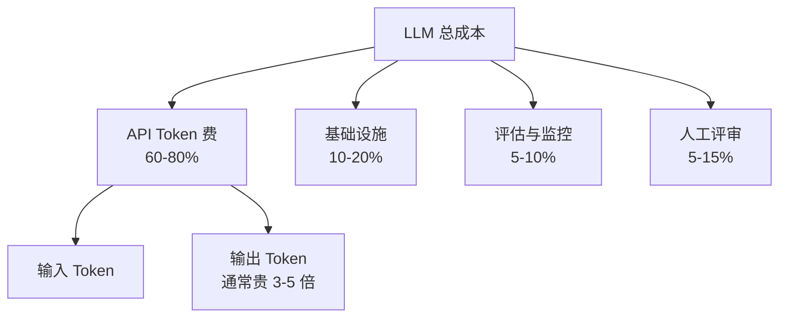
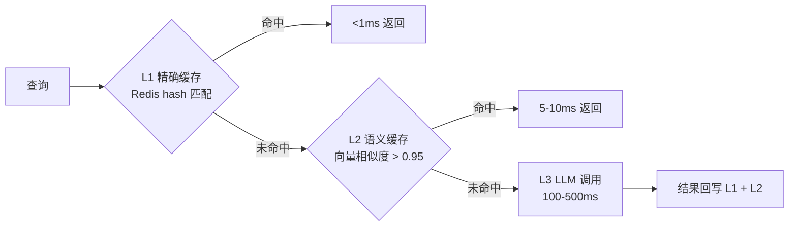
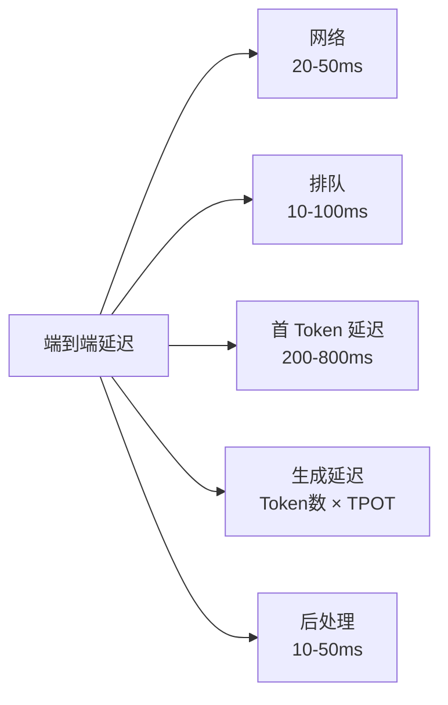

# LLM 成本与延迟 SLO

> **一句话理解**: LLM 推理成本比传统 ML 高 100–1000 倍——成本管理不是优化项，是 LLMOps 的生死线，必须从架构层设计缓存、路由、预算三道防线。

本文是 [[LLMOps_2026]] §5「成本与延迟 SLO」的深扩专题。传统 ML 基础设施成本（GPU 调度 / Spot）见 [[Cost_Optimization_MLOps]]，推理引擎层优化见 [[10_部署推理/LLM_Cost_Optimization]]。

---

## 目录

| 章节 | 内容 | 难度 |
|------|------|------|
| [1. 成本爆炸的数学](#1-成本爆炸的数学) | 为什么 LLM 贵 1000 倍 | 入门 |
| [2. 三层缓存架构](#2-三层缓存架构) | 精确 / 语义 / 调用 | 实战 |
| [3. 智能路由与级联](#3-智能路由与级联) | 按复杂度选模型 | 实战 |
| [4. Token 预算与熔断](#4-token-预算与熔断) | 多维度预算 | 进阶 |
| [5. 延迟 SLO 设计](#5-延迟-slo-设计) | TTFT / TPOT / 端到端 | 进阶 |
| [6. FinOps 实践](#6-finops-实践) | 成本归因与分摊 | 管理 |
| [7. 相关文档](#7-相关文档) | 导航 | 导航 |

---

## 1. 成本爆炸的数学

### 1.1 传统 ML vs LLM 单次推理成本

| 模型类型 | 单次推理成本 | 延迟 |
|---------|------------|------|
| XGBoost（自托管） | ~$0.000001 | <10ms |
| ResNet50（自托管 GPU） | ~$0.0001 | 50ms |
| BERT（自托管 GPU） | ~$0.0005 | 100ms |
| GPT-5.2（API，1k token） | ~$0.015 | 1–3s |
| GPT-5.2（API，10k token） | ~$0.15 | 5–10s |

**量级差异**：LLM 比传统 ML 贵 **1000–10000 倍**。日 100 万次调用，传统 ML 约 $1，LLM 约 $15k。

### 1.2 成本结构分解



**关键洞察**：API Token 费是大头，且**输出 Token 通常比输入贵 3–5 倍**。优化重点应放在「减少输出 Token」（限制 max_tokens、让回答更简洁）。

---

## 2. 三层缓存架构

### 2.1 缓存层级



| 层 | 命中条件 | 延迟 | 成本节省 | 命中率（实测） |
|----|---------|------|---------|--------------|
| **L1 精确** | Query hash 完全相同 | <1ms | 100% | FAQ 场景 30–50% |
| **L2 语义** | Embedding 相似度 > 0.95 | 5–10ms | 95% | 客服场景 20–40% |
| **L3 调用** | 必须调 LLM | 100–500ms | 0% | — |

### 2.2 语义缓存实现

```python
import numpy as np
from redis import Redis

redis = Redis()
EMBED_DIM = 1536

def semantic_cache_lookup(query: str, threshold: float = 0.95):
    """语义缓存查询"""
    q_vec = embed(query)
    
    # 用 Redis Vector 搜索近似邻居
    candidates = redis.ft_search(
        index="sem_cache",
        query=q_vec,
        num=10,
    )
    
    for hit in candidates:
        if cosine_sim(q_vec, hit.vec) >= threshold:
            # 二次校验：避免语义相似但意图不同的误命中
            if intent_match(query, hit.original_query):
                return hit.answer
    
    return None  # 未命中

def semantic_cache_store(query: str, answer: str):
    """写入语义缓存"""
    q_vec = embed(query)
    redis.hset(f"sem:{hash(query)}", mapping={
        "vec": q_vec.tobytes(),
        "query": query,
        "answer": answer,
        "ttl": 86400,   # 24h
    })
```

### 2.3 缓存的陷阱

| 陷阱 | 后果 | 防御 |
|------|------|------|
| **缓存过期数据** | RAG 知识更新后返回旧答案 | 文档更新时清空相关缓存 |
| **语义误命中** | "退款流程" 命中 "退款政策" 答案 | 二次意图校验 |
| **个性化泄漏** | A 用户缓存被 B 用户命中 | 缓存 key 加 user_id |
| **缓存毒化** | 错误答案被缓存放大 | 写入前质量校验 |

**场景适配**：
- 客服 / FAQ：三层缓存收益 40–70% ✅
- 创作 / 代码生成：L2 命中率 <10%，不值得做 ❌
- RAG 问答：L1 收益高（同问题反复问），L2 谨慎（知识可能变）

---

## 3. 智能路由与级联

### 3.1 按复杂度路由

```python
def route_model(query: str) -> str:
    """根据查询复杂度路由到不同模型"""
    complexity = classify_complexity(query)
    
    if complexity == "simple":        # 闲聊、FAQ、信息提取
        return "gpt-5.2-mini"          # $0.15/M tokens
    elif complexity == "medium":      # 摘要、改写、分类
        return "claude-4.5-sonnet"     # $3/M tokens
    else:                              # 复杂推理、代码、创作
        return "gpt-5.2"               # $15/M tokens
```

**实测收益**：RAG 场景可节省 **60–90% 成本**，质量损失 <2%。

### 3.2 级联（Cascade）策略

```python
def cascade_answer(query: str):
    """先试便宜模型，置信度低再升级"""
    # 第一级：便宜模型
    cheap = call("gpt-5.2-mini", query)
    confidence = self_assess_confidence(cheap)
    
    if confidence >= 0.8:
        return cheap
    
    # 第二级：中等模型
    mid = call("claude-4.5-sonnet", query)
    confidence = self_assess_confidence(mid)
    
    if confidence >= 0.7:
        return mid
    
    # 第三级：强模型兜底
    return call("gpt-5.2", query)
```

### 3.3 路由分类器

| 方法 | 实现 | 延迟 | 准确率 |
|------|------|------|--------|
| **规则** | 关键词 / 长度 | <1ms | 70% |
| **小分类模型** | distilled BERT | 10ms | 85% |
| **Embedding + KNN** | 历史查询聚类 | 5ms | 88% |
| **LLM 路由** | 用 mini-LLM 判断 | 200ms | 92% |

**经验**：规则 + Embedding KNN 组合，延迟 <10ms，准确率 ~88%，性价比最高。

### 3.4 路由的风险

| 风险 | 后果 | 防御 |
|------|------|------|
| **误降级** | 复杂问题被路由到弱模型 | 保留「升级」反馈通道 |
| **路由抖动** | 同问题时而便宜时而贵 | 缓存路由决策 |
| **质量断层** | 模型切换处质量突降 | 灰度验证边界用例 |

---

## 4. Token 预算与熔断

### 4.1 多维度预算

| 维度 | 阈值 | 动作 |
|------|------|------|
| 单用户日 Token | > 100k | 限流 |
| 单会话 Token | > 50k | 中断 + 提示 |
| 单租户月预算 | > 80% | 告警 |
| 单租户月预算 | > 100% | 降级到便宜模型 |
| 全局日 Token | > 日均 3 倍 | P0 告警 |
| 全局日 Token | > 预算 100% | 自动熔断 |

### 4.2 熔断实现

```python
class TokenBudget:
    def __init__(self):
        self.redis = Redis()
    
    def check_and_reserve(self, user_id, tenant_id, est_tokens):
        # 多级检查
        if self.exceeds_user_daily(user_id, est_tokens):
            raise RateLimit("用户日限")
        if self.exceeds_tenant_monthly(tenant_id, est_tokens):
            raise BudgetExceeded("租户月限，降级模型")
        if self.exceeds_global_daily(est_tokens):
            raise CircuitBreaker("全局熔断")
        
        # 预扣
        self.reserve(user_id, tenant_id, est_tokens)
    
    def settle(self, user_id, tenant_id, actual_tokens):
        """实际结算，差额回补"""
        self.adjust(user_id, tenant_id, actual_tokens)
```

### 4.3 预算估算

调用前预估 Token 数，避免超额：

```python
def estimate_tokens(text: str) -> int:
    """粗略估算 Token 数"""
    # 中文：约 1 字 = 1.5 token
    # 英文：约 4 字符 = 1 token
    chinese_chars = len(re.findall(r'[\u4e00-\u9fff]', text))
    other_chars = len(text) - chinese_chars
    return int(chinese_chars * 1.5 + other_chars / 4)
```

---

## 5. 延迟 SLO 设计

### 5.1 LLM 延迟分解



| 指标 | 含义 | 健康阈值 |
|------|------|---------|
| **TTFT** (Time To First Token) | 首 Token 延迟 | < 800ms |
| **TPOT** (Time Per Output Token) | 每输出 Token 耗时 | < 30ms |
| **端到端 P50** | 中位数总延迟 | < 2s |
| **端到端 P99** | 长尾延迟 | < 8s |

### 5.2 延迟优化手段

| 手段 | 收益 | 代价 |
|------|------|------|
| **流式输出** | 用户感知延迟降 80% | 前端复杂度 |
| **Prompt 缓存** | TTFT 降 50% | 需上游支持 |
| **并行函数调用** | 总延迟降 40% | 调试复杂 |
| **限制 max_tokens** | 尾部延迟可控 | 可能截断 |
| **预热连接** | 网络延迟降 30ms | 长连接维护 |

详见 [[10_部署推理/06_Caching/Prompt_Caching_Advanced]]。

---

## 6. FinOps 实践

### 6.1 成本归因

每个 Token 调用必须打标签，便于成本分摊：

```json
{
  "trace_id": "abc123",
  "tenant_id": "acme-corp",
  "user_id": "user-456",
  "feature": "rag_qa",
  "model": "gpt-5.2",
  "prompt_id": "rag_qa@v4",
  "input_tokens": 1200,
  "output_tokens": 350,
  "cost_usd": 0.024
}
```

### 6.2 成本看板维度

| 维度 | 用途 |
|------|------|
| 按租户 | 计费 / 配额 |
| 按功能 | 哪个功能烧钱 |
| 按模型 | 路由策略效果 |
| 按 Prompt 版本 | Prompt 优化的成本影响 |
| 按时间 | 趋势 / 异常 |

### 6.3 月度成本评审

每月必须开 FinOps 评审会，回答：
- 总成本 vs 预算？
- Top 3 烧钱功能？
- 缓存命中率趋势？
- 路由降级比例？
- 单位产出成本（如「每次成功问答成本」）？

---

## 7. 相关文档

### 本章内
- [[11_模型运维/LLMOps_2026]] — 本系列主线（§5 是本文概览版）
- [[11_模型运维/09_Cost/Cost_Optimization_MLOps]] — 传统 ML 基础设施成本（GPU/Spot）
- [[11_模型运维/08_Observability/LLM_Observability]] — 成本是可观测性的核心维度

### 跨章
- [[10_部署推理/LLM_Cost_Optimization]] — 推理引擎层成本优化
- [[10_部署推理/06_Caching/Prompt_Caching_Advanced]] — Prompt 缓存工程实现
- [[10_部署推理/06_Caching/Prompt_Caching_and_KV_Cache_Optimization]] — KV Cache
- [[12_架构基建/11_AI_Gateway/README]] — AI 网关（路由/限流/计费）
- [[概念/mlops]] — MLOps 概念

---

*最后更新：2026-06-15 · 本文是 [[LLMOps_2026]] 的专题深扩*
