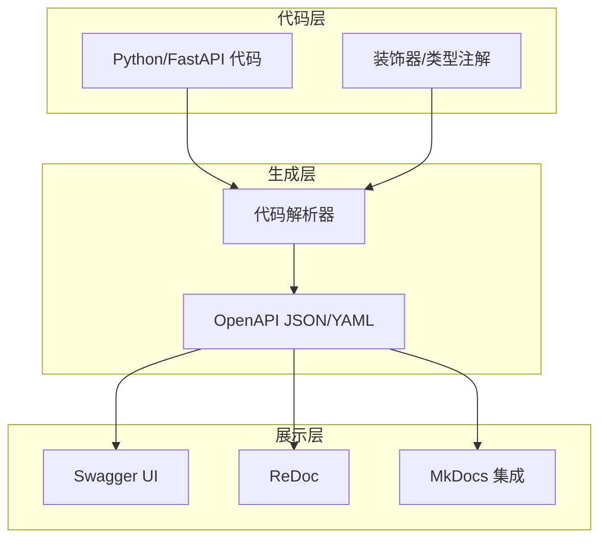
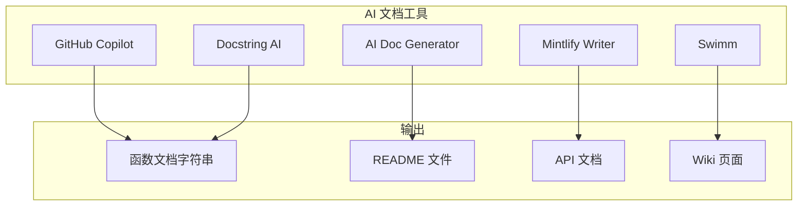
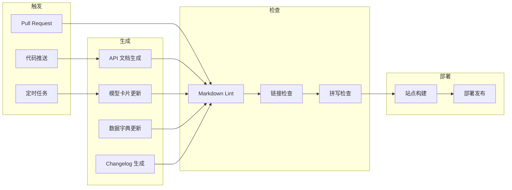

# AI 文档自动化

> **一句话秒懂**: AI 文档自动化就是用工具链让文档"自己写自己、自己更新自己"，告别手动维护文档的噩梦。

## 目录

- [为什么需要文档自动化？](#为什么需要文档自动化)
- [自动化 API 文档](#自动化-api-文档)
- [AI 驱动的代码文档工具](#ai-驱动的代码文档工具)
- [MkDocs + Material 主题](#mkdocs--material-主题)
- [自动生成模型卡片](#自动生成模型卡片)
- [数据字典自动化](#数据字典自动化)
- [Changelog 自动生成](#changelog-自动生成)
- [CI/CD 文档流水线](#cicd-文档流水线)

---

## 为什么需要文档自动化？

### 文档的痛点

```
传统文档维护周期：

第1天:  "我来更新文档！" 🎉
第5天:  "代码改了，文档没更新..."
第10天: "文档和代码已经完全对不上了" 😱
第30天: "算了，重新写吧..."
第31天:  "我来更新文档！" 🎉  ← 循环

自动化文档：

代码更新 → 文档自动更新 → 永远同步 ✨
```

### 自动化覆盖率矩阵

| 文档类型 | 自动化程度 | 工具 |
|----------|-----------|------|
| API 文档 | 95% | Swagger/OpenAPI |
| 代码注释 | 70% | AI 代码助手 |
| 架构文档 | 40% | Mermaid + AI |
| 模型卡片 | 80% | 模板 + 自动采集 |
| 数据字典 | 85% | Schema 提取 |
| Changelog | 90% | Git conventional commits |
| 用户手册 | 30% | AI 辅助生成 |

---

## 自动化 API 文档

### OpenAPI 规范



### FastAPI 自动文档

```python
from fastapi import FastAPI, Query, Path, HTTPException
from pydantic import BaseModel, Field
from typing import Optional
from enum import Enum

app = FastAPI(
    title="AI Guru API",
    description="AI 模型推理服务 API 文档",
    version="2.0.0",
    docs_url="/docs",
    redoc_url="/redoc",
    openapi_tags=[
        {"name": "Chat", "description": "对话推理接口"},
        {"name": "Embeddings", "description": "向量嵌入接口"},
        {"name": "Models", "description": "模型管理接口"},
    ],
)

class ModelName(str, Enum):
    gpt4o = "gpt-4o"
    gpt4o_mini = "gpt-4o-mini"
    claude_sonnet = "claude-sonnet-4-20250514"

class ChatRequest(BaseModel):
    model: ModelName = Field(
        description="使用的模型名称",
        examples=["gpt-4o"]
    )
    messages: list[dict] = Field(
        description="对话消息列表",
        examples=``[ [{"role": "user", "content": "你好"}] ]``
    )
    temperature: float = Field(
        default=0.7,
        ge=0.0,
        le=2.0,
        description="生成温度，越高越随机"
    )
    max_tokens: Optional[int] = Field(
        default=None,
        ge=1,
        le=128000,
        description="最大生成 token 数"
    )

    model_config = {
        "json_schema_extra": {
            "examples": [{
                "model": "gpt-4o",
                "messages": [{"role": "user", "content": "解释 AI"}],
                "temperature": 0.7,
            }]
        }
    }

class ChatResponse(BaseModel):
    id: str = Field(description="响应唯一 ID")
    content: str = Field(description="生成的文本内容")
    model: str = Field(description="实际使用的模型")
    usage: dict = Field(description="Token 使用统计")

@app.post(
    "/v1/chat/completions",
    response_model=ChatResponse,
    summary="对话推理",
    description="发送对话消息，获取 AI 模型的回复",
    tags=["Chat"],
    responses={
        200: {"description": "成功返回推理结果"},
        400: {"description": "请求参数错误"},
        401: {"description": "认证失败"},
        429: {"description": "请求频率超限"},
        503: {"description": "模型服务不可用"},
    },
)
async def chat_completions(
    request: ChatRequest,
    api_key: str = Query(description="API Key", alias="X-API-Key"),
):
    """
    对话推理接口

    - 支持 OpenAI 兼容格式
    - 支持流式和非流式响应
    - 自动 token 计费
    """
    pass
```

### 自动导出 OpenAPI 规范

```python
import json

# 导出 OpenAPI JSON
openapi_schema = app.openapi()

with open("openapi.json", "w", encoding="utf-8") as f:
    json.dump(openapi_schema, f, indent=2, ensure_ascii=False)

# 或通过命令行
# uvicorn main:app --host 0.0.0.0 --port 8000
# curl http://localhost:8000/openapi.json > openapi.json
```

---

## AI 驱动的代码文档工具

### 工具生态



### AI 文档生成工具对比

| 工具 | 类型 | 语言支持 | 特色 |
|------|------|---------|------|
| GitHub Copilot | IDE 插件 | 全语言 | 实时建议 |
| Mintlify | VSCode 插件 | JS/TS/Python | 美观文档生成 |
| AI Docstring | VSCode 插件 | Python | 自动 docstring |
| CodiumAI | IDE 插件 | 主流语言 | 测试 + 文档 |
| Swimm | IDE 插件 | 全语言 | 文档和代码同步 |

### 使用 AI 生成文档字符串

```python
def process_embeddings(
    texts: list[str],
    model: str = "text-embedding-3-small",
    batch_size: int = 100,
    normalize: bool = True,
) -> list[list[float]]:
    """
    批量处理文本向量嵌入。

    该函数将输入文本列表分批发送到嵌入模型，
    返回对应的向量表示。支持自动归一化和批处理优化。

    Args:
        texts: 需要编码的文本列表，每个文本不超过 8191 tokens
        model: 嵌入模型名称，默认 text-embedding-3-small
        batch_size: 每批处理的文本数量，建议 50-200
        normalize: 是否对向量进行 L2 归一化

    Returns:
        嵌入向量列表，每个向量维度取决于模型
        text-embedding-3-small: 1536 维
        text-embedding-3-large: 3072 维

    Raises:
        ValueError: 当文本为空列表或模型不存在时
        RateLimitError: 当 API 调用频率超限时

    Example:
        >>> vectors = process_embeddings(
        ...     ["你好世界", "AI 文档自动化"],
        ...     model="text-embedding-3-small"
        ... )
        >>> len(vectors)
        2
        >>> len(vectors[0])
        1536

    Note:
        对于超过 10000 条文本的情况，建议使用异步版本
        process_embeddings_async 以获得更好的性能。
    """
    pass
```

---

## MkDocs + Material 主题

### 项目结构

```
ai-guru-docs/
├── mkdocs.yml          # 配置文件
├── docs/
│   ├── index.md        # 首页
│   ├── api/
│   │   ├── chat.md     # Chat API
│   │   ├── embeddings.md
│   │   └── models.md
│   ├── guides/
│   │   ├── quickstart.md
│   │   └── deployment.md
│   └── assets/
│       ├── images/
│       └── stylesheets/
├── requirements.txt
└── .github/
    └── workflows/
        └── docs.yml    # CI/CD
```

### mkdocs.yml 配置

```yaml
site_name: AI Guru 知识库
site_description: AI 工程师全栈知识体系
site_author: AI Guru Team
site_url: https://docs.ai-guru.com

theme:
  name: material
  language: zh
  palette:
    - media: "(prefers-color-scheme: light)"
      scheme: default
      primary: indigo
      accent: indigo
      toggle:
        icon: material/brightness-7
        name: 切换到暗色模式
    - media: "(prefers-color-scheme: dark)"
      scheme: slate
      primary: indigo
      accent: indigo
      toggle:
        icon: material/brightness-4
        name: 切换到亮色模式
  features:
    - navigation.instant       # 即时加载
    - navigation.tracking      # URL 追踪
    - navigation.tabs          # 顶部标签
    - navigation.sections      # 分节导航
    - navigation.expand        # 展开侧边栏
    - navigation.indexes       # 分节首页
    - navigation.top           # 返回顶部
    - search.suggest           # 搜索建议
    - search.highlight         # 搜索高亮
    - content.code.copy        # 代码复制
    - content.code.annotate    # 代码注释
    - content.tabs.link        # 标签链接
    - toc.follow               # 目录跟随

plugins:
  - search:
      lang:
        - zh
        - en
  - git-revision-date-localized:
      type: datetime
      timezone: Asia/Shanghai
      locale: zh
  - minify:
      minify_html: true
  - awesome-pages            # 自动导航
  - glightbox                # 图片放大
  - mkdocs-openapi:
      spec: openapi.json     # OpenAPI 文档
  - mermaid2:                # Mermaid 图表
      arguments:
        theme: default

markdown_extensions:
  - abbr                     # 缩写
  - admonition               # 提示块
  - attr_list                # 属性列表
  - codehilite               # 代码高亮
  - def_list                 # 定义列表
  - footnotes                # 脚注
  - md_in_html               # HTML 中的 Markdown
  - meta                     # 元数据
  - pymdownx.details         # 折叠详情
  - pymdownx.emoji:          # Emoji
      emoji_index: !!python/name:material.extensions.emoji.twemoji
      emoji_generator: !!python/name:material.extensions.emoji.to_svg
  - pymdownx.highlight:      # 代码高亮增强
      anchor_linenums: true
      line_spans: __span
      pygments_lang_class: true
  - pymdownx.inlinehilite    # 行内代码高亮
  - pymdownx.keys            # 键盘按键
  - pymdownx.mark            # 文字标记
  - pymdownx.smartsymbols    # 智能符号
  - pymdownx.snippets        # 代码片段
  - pymdownx.superfences:    # 超级围栏（支持 Mermaid）
      custom_fences:
        - name: mermaid
          class: mermaid
          format: !!python/name:pymdownx.superfences.fence_code_format
  - pymdownx.tabbed:         # 标签页
      alternate_style: true
  - pymdownx.tasklist:       # 任务列表
      custom_checkbox: true
  - pymdownx.tilde           # 删除线
  - tables                   # 表格
  - toc:                     # 目录
      permalink: true
      slugify: !!python/name:pymdownx.slugs.uslugify

nav:
  - 首页: index.md
  - API 文档:
    - api/index.md
    - 对话接口: api/chat.md
    - 嵌入接口: api/embeddings.md
    - 模型管理: api/models.md
  - 使用指南:
    - guides/index.md
    - 快速开始: guides/quickstart.md
    - 部署指南: guides/deployment.md

extra:
  social:
    - icon: fontawesome/brands/github
      link: https://github.com/ai-guru
  analytics:
    provider: google
    property: G-XXXXXXXXXX
  version:
    provider: mike
```

### 本地运行

```bash
# 安装依赖
pip install mkdocs-material mkdocs-git-revision-date-localized-plugin \
            mkdocs-minify-plugin mkdocs-awesome-pages-plugin \
            mkdocs-glightbox mkdocs-openapi-plugin mkdocs-mermaid2-plugin

# 本地预览
mkdocs serve

# 构建静态站点
mkdocs build

# 部署到 GitHub Pages
mkdocs gh-deploy
```

---

## 自动生成模型卡片

### 模型卡片模板

```python
import yaml
import json
from datetime import datetime
from pathlib import Path
from dataclasses import dataclass, asdict
from typing import Optional

@dataclass
class ModelCard:
    """自动生成的模型卡片"""

    # 基本信息
    model_name: str
    model_id: str
    version: str
    release_date: str
    model_type: str  # base, fine-tuned, adapter
    base_model: Optional[str] = None

    # 训练信息
    training_data: str = ""
    training_framework: str = ""
    training_duration: str = ""
    training_gpu: str = ""
    hyperparameters: dict = None

    # 性能指标
    metrics: dict = None
    benchmarks: list = None

    # 限制和风险
    limitations: list = None
    biases: list = None
    risks: list = None

    # 使用信息
    license: str = ""
    intended_use: str = ""
    prohibited_use: list = None

    # 技术细节
    parameters: str = ""
    context_length: int = 0
    vocab_size: int = 0
    hidden_size: int = 0
    num_layers: int = 0

    def to_markdown(self) -> str:
        return f"""# {self.model_name} 模型卡片

> 自动生成于 {datetime.now().strftime('%Y-%m-%d %H:%M')}

## 基本信息

| 属性 | 值 |
|------|-----|
| 模型 ID | `{self.model_id}` |
| 版本 | {self.version} |
| 发布日期 | {self.release_date} |
| 模型类型 | {self.model_type} |
| 基础模型 | {self.base_model or 'N/A'} |
| 参数量 | {self.parameters} |
| 上下文长度 | {self.context_length:,} tokens |

## 性能指标

| 基准测试 | 得分 |
|----------|------|
{self._format_benchmarks()}

## 使用许可

- **许可证**: {self.license}
- **预期用途**: {self.intended_use}
- **禁止用途**: {', '.join(self.prohibited_use or [])}

## 限制和风险

### 已知限制
{self._format_list(self.limitations)}

### 潜在偏见
{self._format_list(self.biases)}

## 训练细节

- **训练数据**: {self.training_data}
- **框架**: {self.training_framework}
- **训练时长**: {self.training_duration}
- **GPU**: {self.training_gpu}

### 超参数

```yaml
{yaml.dump(self.hyperparameters or {}, default_flow_style=False, allow_unicode=True)}
```
"""

    def _format_benchmarks(self) -> str:
        if not self.benchmarks:
            return "| - | - |"
        return "\n".join(
            f"| {b['name']} | {b['score']} |"
            for b in self.benchmarks
        )

    def _format_list(self, items) -> str:
        if not items:
            return "- 暂无"
        return "\n".join(f"- {item}" for item in items)


class ModelCardGenerator:
    """从训练日志自动生成模型卡片"""

    def __init__(self, config_path: str):
        with open(config_path) as f:
            self.config = yaml.safe_load(f)

    def from_training_output(self, output_dir: str) -> ModelCard:
        output = Path(output_dir)

        # 从训练配置提取信息
        with open(output / "trainer_state.json") as f:
            state = json.load(f)

        with open(output / "training_args.json") as f:
            args = json.load(f)

        # 从评估结果提取指标
        metrics = {}
        eval_file = output / "eval_results.json"
        if eval_file.exists():
            with open(eval_file) as f:
                metrics = json.load(f)

        return ModelCard(
            model_name=self.config["model_name"],
            model_id=self.config["model_id"],
            version=self.config["version"],
            release_date=datetime.now().strftime("%Y-%m-%d"),
            model_type=self.config.get("model_type", "fine-tuned"),
            base_model=args.get("model_name_or_path"),
            training_data=self.config["training_data"],
            training_framework="PyTorch + HuggingFace Transformers",
            hyperparameters={
                "learning_rate": args.get("learning_rate"),
                "batch_size": args.get("per_device_train_batch_size"),
                "epochs": args.get("num_train_epochs"),
                "warmup_steps": args.get("warmup_steps"),
                "weight_decay": args.get("weight_decay"),
            },
            metrics=metrics,
            parameters=self._count_parameters(args),
            context_length=args.get("model_max_length", 0),
            license=self.config.get("license", "MIT"),
            intended_use=self.config.get("intended_use", ""),
            limitations=self.config.get("limitations", []),
        )

    def _count_parameters(self, args: dict) -> str:
        model_path = args.get("model_name_or_path", "")
        try:
            from transformers import AutoModel
            model = AutoModel.from_pretrained(model_path)
            total = sum(p.numel() for p in model.parameters())
            if total >= 1e9:
                return f"{total/1e9:.1f}B"
            elif total >= 1e6:
                return f"{total/1e6:.1f}M"
            return f"{total:,}"
        except Exception:
            return "Unknown"


# 使用示例
generator = ModelCardGenerator("model_config.yaml")
card = generator.from_training_output("./training_output")
Path("MODEL_CARD.md").write_text(card.to_markdown(), encoding="utf-8")
```

---

## 数据字典自动化

### Schema 自动提取

```python
from pydantic import BaseModel
from typing import Optional
import json

class Customer(BaseModel):
    id: int
    name: str
    email: str
    age: Optional[int] = None
    tier: str = "free"
    created_at: str
    metadata: Optional[dict] = None

class DataDictionaryGenerator:
    """从 Pydantic 模型自动生成数据字典"""

    def __init__(self):
        self.entries = []

    def add_model(self, model_class: type[BaseModel], table_name: str):
        schema = model_class.model_json_schema()
        properties = schema.get("properties", {})
        required = schema.get("required", [])

        for field_name, field_info in properties.items():
            self.entries.append({
                "table": table_name,
                "column": field_name,
                "type": field_info.get("type", "unknown"),
                "format": field_info.get("format", ""),
                "required": field_name in required,
                "default": field_info.get("default", ""),
                "description": field_info.get("description", ""),
                "examples": field_info.get("examples", []),
            })

    def to_markdown(self) -> str:
        tables = {}
        for entry in self.entries:
            table = entry["table"]
            if table not in tables:
                tables[table] = []
            tables[table].append(entry)

        output = "# 数据字典\n\n"

        for table_name, fields in tables.items():
            output += f"## {table_name}\n\n"
            output += "| 字段 | 类型 | 必填 | 默认值 | 说明 |\n"
            output += "|------|------|------|--------|------|\n"

            for field in fields:
                required = "是" if field["required"] else "否"
                default = str(field["default"]) if field["default"] else "-"
                desc = field["description"] or field.get("examples", [""])[0]
                output += f"| `{field['column']}` | {field['type']} | {required} | {default} | {desc} |\n"

            output += "\n"

        return output

    def to_json(self) -> str:
        return json.dumps(self.entries, indent=2, ensure_ascii=False)


# 使用
gen = DataDictionaryGenerator()
gen.add_model(Customer, "customers")
print(gen.to_markdown())
```

---

## Changelog 自动生成

### Conventional Commits 规范

```
<type>(<scope>): <description>

[optional body]

[optional footer(s)]
```

类型说明：

| 类型 | 说明 | Changelog 区域 |
|------|------|---------------|
| `feat` | 新功能 | Features |
| `fix` | 修复 | Bug Fixes |
| `perf` | 性能优化 | Performance |
| `docs` | 文档 | (不包含) |
| `style` | 格式 | (不包含) |
| `refactor` | 重构 | (不包含) |
| `test` | 测试 | (不包含) |
| `ci` | CI/CD | (不包含) |

### 配置 git-cliff

```toml
# cliff.toml
[changelog]
header = """
# Changelog\n
All notable changes to this project will be documented in this file.\n
"""
body = """
\
    ## [{{ version | trim_start_matches(pat="v") }}] - {{ timestamp | date(format="%Y-%m-%d") }}
\
    ## [Unreleased]
\

    ### {{ group | upper_first }}
    
        - **{{ commit.scope }}**: \
            {{ commit.message | upper_first }}\
             (**BREAKING**)\
    
\n
"""
trim = true
footer = "<!-- generated by git-cliff -->"

[git]
conventional_commits = true
filter_unconventional = true
split_commits = false
commit_parsers = [
    { message = "^feat", group = "Features" },
    { message = "^fix", group = "Bug Fixes" },
    { message = "^perf", group = "Performance" },
    { message = "^doc", group = "Documentation", skip = true },
    { message = "^style", group = "Styling", skip = true },
    { message = "^refactor", group = "Refactor", skip = true },
    { message = "^test", group = "Tests", skip = true },
    { message = "^ci", group = "CI", skip = true },
    { message = "^chore", skip = true },
    { body = ".*security", group = "Security" },
    { message = "^revert", group = "Reverted Changes" },
]
protect_breaking_commits = false
filter_commits = false
tag_pattern = "v[0-9].*"
sort_commits = "oldest"
```

### 使用命令

```bash
# 安装
# cargo install git-cliff  或  brew install git-cliff

# 生成 changelog
git-cliff -o CHANGELOG.md

# 生成指定版本范围
git-cliff v1.0.0..v2.0.0 -o CHANGELOG.md

# 生成到 stdout
git-cliff --unreleased

# 初始化配置
git-cliff --init
```

---

## CI/CD 文档流水线

### 完整流水线



### GitHub Actions 配置

```yaml
# .github/workflows/docs.yml
name: Documentation CI/CD

on:
  push:
    branches: [main]
    paths:
      - 'docs/**'
      - 'mkdocs.yml'
      - 'openapi.json'
  pull_request:
    branches: [main]
  schedule:
    - cron: '0 2 * * 0'  # 每周日凌晨2点

permissions:
  contents: write
  pages: write
  id-token: write

jobs:
  lint:
    runs-on: ubuntu-latest
    steps:
      - uses: actions/checkout@v4

      - name: Markdown Lint
        uses: DavidAnson/markdownlint-cli2-action@v16
        with:
          globs: '**/*.md'
          config: '.markdownlint.json'

      - name: Check Links
        uses: lycheeverse/lychee-action@v1
        with:
          args: '--verbose "docs/**/*.md"'
          fail: true

  generate:
    runs-on: ubuntu-latest
    needs: lint
    steps:
      - uses: actions/checkout@v4

      - name: Set up Python
        uses: actions/setup-python@v5
        with:
          python-version: '3.12'

      - name: Install dependencies
        run: |
          pip install -r requirements.txt
          pip install mkdocs-material mkdocs-minify-plugin

      - name: Generate API docs
        run: python scripts/generate_api_docs.py

      - name: Generate model cards
        if: github.event_name == 'schedule'
        run: python scripts/generate_model_cards.py

      - name: Generate changelog
        run: |
          # 使用 git-cliff 生成
          curl -L https://github.com/orhun/git-cliff/releases/latest/download/git-cliff-linux.tar.gz | tar xz
          ./git-cliff -o docs/CHANGELOG.md

      - name: Build site
        run: mkdocs build --strict

      - name: Upload artifact
        uses: actions/upload-pages-artifact@v3
        with:
          path: site

  deploy:
    if: github.ref == 'refs/heads/main' && github.event_name == 'push'
    runs-on: ubuntu-latest
    needs: generate
    environment:
      name: github-pages
      url: ${{ steps.deployment.outputs.page_url }}
    steps:
      - name: Deploy to GitHub Pages
        id: deployment
        uses: actions/deploy-pages@v4
```

### Pre-commit 检查

```yaml
# .pre-commit-config.yaml
repos:
  - repo: https://github.com/igorshubovych/markdownlint-cli
    rev: v0.38.0
    hooks:
      - id: markdownlint
        args: ['--fix']

  - repo: https://github.com/pre-commit/pre-commit-hooks
    rev: v4.6.0
    hooks:
      - id: trailing-whitespace
      - id: end-of-file-fixer
      - id: check-yaml

  - repo: local
    hooks:
      - id: check-doc-freshness
        name: Check doc freshness
        entry: python scripts/check_doc_freshness.py
        language: python
        types: [markdown]
```

### 文档新鲜度检查脚本

```python
#!/usr/bin/env python3
"""检查文档是否和代码同步"""

import os
import re
from pathlib import Path
from datetime import datetime, timedelta

def check_doc_freshness(docs_dir: str = "docs", max_age_days: int = 90):
    """检查文档的新鲜度"""
    warnings = []
    now = datetime.now()

    for md_file in Path(docs_dir).rglob("*.md"):
        stat = md_file.stat()
        modified = datetime.fromtimestamp(stat.st_mtime)
        age_days = (now - modified).days

        if age_days > max_age_days:
            warnings.append(
                f"⚠️ {md_file}: {age_days} 天未更新 (超过 {max_age_days} 天)"
            )

        content = md_file.read_text(encoding="utf-8")
        todos = len(re.findall(r'TODO|FIXME|HACK', content))
        if todos:
            warnings.append(f"📝 {md_file}: 包含 {todos} 个待办标记")

        code_blocks = re.findall(r'```(\w+)', content)
        for lang in set(code_blocks):
            if lang in ["python", "javascript", "typescript"]:
                code = re.findall(
                    rf'```{lang}\n(.*?)```',
                    content,
                    re.DOTALL
                )
                for block in code:
                    if "print(" in block and lang == "python":
                        if "= " not in block:
                            pass

    if warnings:
        print("文档新鲜度报告：")
        for w in warnings:
            print(f"  {w}")
        return 1
    else:
        print("✅ 所有文档状态良好")
        return 0

if __name__ == "__main__":
    exit(check_doc_freshness())
```

---

## 总结

### 工具链总览

```
┌─────────────────────────────────────────────┐
│          AI 文档自动化工具链                  │
├─────────────────────────────────────────────┤
│                                             │
│  代码 → FastAPI/OpenAPI → 自动 API 文档     │
│  代码 → AI Copilot    → 自动注释文档        │
│  训练 → ModelCard Gen → 自动模型卡片        │
│  数据 → Schema 提取   → 自动数据字典        │
│  Git  → git-cliff     → 自动 Changelog      │
│  所有 → MkDocs Material → 统一文档站        │
│  所有 → GitHub Actions  → 自动部署          │
│                                             │
└─────────────────────────────────────────────┘
```

### 相关文档

- [API 设计 for AI](../12_架构基建/11_AI_Gateway/API_Design_for_AI.md) - API 文档的基础
- [Prompt 管理平台](./Prompt_Ops/Prompt_Management_Platform.md) - Prompt 文档管理
- [AI Gateway 对比](12_架构基建/11_AI_Gateway/AI_Gateway_Comparison_2026.md) - 网关文档自动化

## Related

- [[治理/Document_Templates|文档模板规范]]
- [[治理/Import_Guide|导入指南]]
- [[治理/index|项目治理]]
- [[00_入门/03_Learning_Path/AI_Tools_Practical_Guide.md|AI_Tools_Practical_Guide]]
