# AI 系统架构全景图 (AI System Architecture 2026)

> **一句话理解**: 系统架构全景图是 AI 系统的"设计蓝图"——展示从用户请求到模型响应的完整链路，帮助理解各组件如何协作、数据如何流动、系统如何扩展。

> **相关文档**: [AI 基础设施完全指南](./AI_Infrastructure_2026.md) | [多租户架构](./Multi_Tenant_Architecture.md) | [容量规划](./Capacity_Planning_2026.md) | [成本优化](./AI_Cost_Optimization_2026.md) | [高可用设计](./High_Availability_2026.md) | [边缘 AI](./Edge_AI_2026.md)

---

## 1. 架构全景概览

### 1.1 四层架构模型

```
┌─────────────────────────────────────────────────────────────────────────┐
│                        AI 系统架构全景图 2026                              │
├─────────────────────────────────────────────────────────────────────────┤
│                                                                         │
│  ┌─────────────────────────────────────────────────────────────────┐   │
│  │                      L4: 应用层 (Application)                     │   │
│  │  ┌───────────┬───────────┬───────────┬───────────┬───────────┐  │   │
│  │  │ Web 前端   │ 移动端     │ API 接口   │ CLI 工具   │ 插件集成   │  │   │
│  │  └───────────┴───────────┴───────────┴───────────┴───────────┘  │   │
│  └─────────────────────────────────────────────────────────────────┘   │
│                                    │                                    │
│                                    ▼                                    │
│  ┌─────────────────────────────────────────────────────────────────┐   │
│  │                      L3: 服务层 (Services)                        │   │
│  │  ┌───────────┬───────────┬───────────┬───────────┬───────────┐  │   │
│  │  │ LLM 服务   │ Agent 服务 │ RAG 服务   │ 向量服务   │ 审核服务   │  │   │
│  │  └───────────┴───────────┴───────────┴───────────┴───────────┘  │   │
│  │  ┌───────────┬───────────┬───────────┬───────────┬───────────┐  │   │
│  │  │ 工作流引擎 │ 调度服务   │ 缓存服务   │ 日志服务   │ 监控服务   │  │   │
│  │  └───────────┴───────────┴───────────┴───────────┴───────────┘  │   │
│  └─────────────────────────────────────────────────────────────────┘   │
│                                    │                                    │
│                                    ▼                                    │
│  ┌─────────────────────────────────────────────────────────────────┐   │
│  │                      L2: 数据层 (Data)                            │   │
│  │  ┌───────────┬───────────┬───────────┬───────────┬───────────┐  │   │
│  │  │ 向量数据库 │ 关系数据库 │ 对象存储   │ 消息队列   │ 缓存集群   │  │   │
│  │  │ (Milvus)  │ (PostgreSQL)│ (S3/MinIO)│ (Kafka)   │ (Redis)   │  │   │
│  │  └───────────┴───────────┴───────────┴───────────┴───────────┘  │   │
│  └─────────────────────────────────────────────────────────────────┘   │
│                                    │                                    │
│                                    ▼                                    │
│  ┌─────────────────────────────────────────────────────────────────┐   │
│  │                      L1: 基础设施层 (Infrastructure)              │   │
│  │  ┌───────────┬───────────┬───────────┬───────────┬───────────┐  │   │
│  │  │ Kubernetes│ GPU 集群   │ 网络      │ 存储       │ 安全       │  │   │
│  │  │ (K8s)     │ (NVIDIA)   │ (VPC/CDN) │ (PV/NFS)  │ (IAM/mTLS) │  │   │
│  │  └───────────┴───────────┴───────────┴───────────┴───────────┘  │   │
│  └─────────────────────────────────────────────────────────────────┘   │
│                                                                         │
└─────────────────────────────────────────────────────────────────────────┘
```

### 1.2 架构设计原则

| 原则 | 说明 | 实践方式 |
|-----|------|---------|
| **解耦** | 各层独立变化 | 依赖倒置、接口抽象 |
| **可扩展** | 支持水平扩展 | 无状态服务、分片存储 |
| **高可用** | 容错容灾 | 多副本、故障转移 |
| **可观测** | 全链路监控 | 日志、指标、追踪 |
| **安全** | 纵深防御 | 认证、授权、加密 |

---

## 2. L4 应用层详解

### 2.1 应用层架构

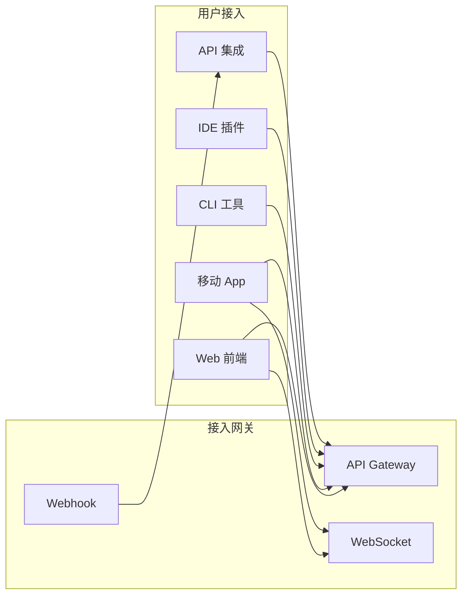

### 2.2 接入网关设计

```yaml
# API Gateway 配置示例
gateway:
  routes:
    - path: /v1/chat/*
      service: llm-service
      rate_limit: 100/second
      timeout: 60s
      
    - path: /v1/agent/*
      service: agent-service
      rate_limit: 50/second
      timeout: 300s  # Agent 可能需要更长时间
      
    - path: /v1/embedding/*
      service: embedding-service
      rate_limit: 500/second
      timeout: 10s
      
    - path: /v1/files/*
      service: file-service
      rate_limit: 20/second
      max_body_size: 100MB
      
  middleware:
    - authentication
    - rate_limiting
    - request_logging
    - cors
    - compression
```

### 2.3 认证授权流程

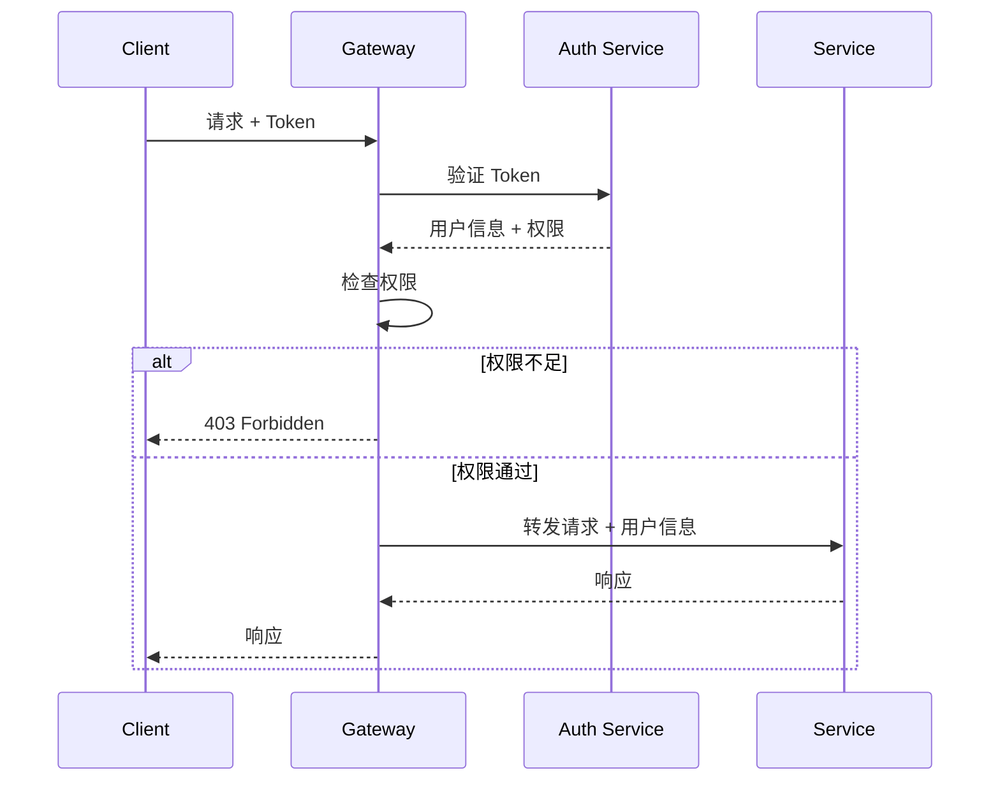

---

## 3. L3 服务层详解

### 3.1 核心服务架构

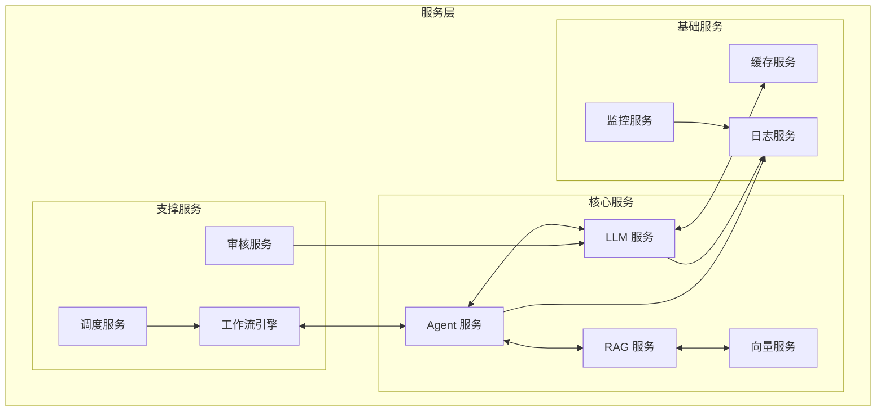

### 3.2 LLM 服务设计

```python
# LLM 服务接口定义
from dataclasses import dataclass
from typing import AsyncIterator, Optional
from enum import Enum

class ModelProvider(Enum):
    OPENAI = "openai"
    ANTHROPIC = "anthropic"
    AZURE = "azure"
    VERTEX = "vertex"
    LOCAL = "local"

@dataclass
class LLMRequest:
    """LLM 请求"""
    messages: list[dict]
    model: str
    temperature: float = 0.7
    max_tokens: int = 4096
    stream: bool = False
    tools: Optional[list] = None
    response_format: Optional[dict] = None

@dataclass
class LLMResponse:
    """LLM 响应"""
    content: str
    model: str
    usage: dict
    finish_reason: str
    latency_ms: float

class LLMService:
    """LLM 服务接口"""
    
    async def complete(self, request: LLMRequest) -> LLMResponse:
        """同步完成"""
        pass
    
    async def stream(
        self, 
        request: LLMRequest
    ) -> AsyncIterator[str]:
        """流式完成"""
        pass
    
    async def embed(self, texts: list[str]) -> list[list[float]]:
        """获取向量嵌入"""
        pass
```

### 3.3 Agent 服务设计

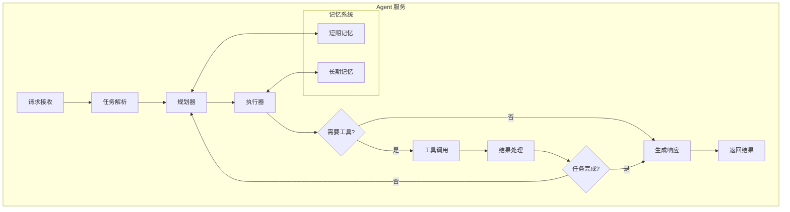

### 3.4 RAG 服务设计

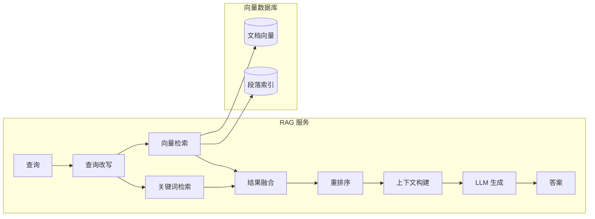

---

## 4. L2 数据层详解

### 4.1 数据层架构

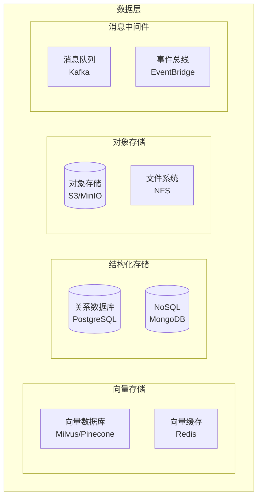

### 4.2 数据流设计

```yaml
# 数据流配置
data_flows:
  # 文档处理流水线
  document_pipeline:
    source: s3://documents/
    steps:
      - name: extract
        type: document_loader
        output: raw_text
        
      - name: chunk
        type: text_splitter
        params:
          chunk_size: 512
          overlap: 50
        output: chunks
        
      - name: embed
        type: embedding_model
        model: text-embedding-3-large
        output: vectors
        
      - name: store
        type: vector_db_writer
        target: milvus://knowledge_base
        
  # 查询处理流水线
  query_pipeline:
    steps:
      - name: rewrite
        type: query_rewriter
        
      - name: retrieve
        type: hybrid_retriever
        vector_weight: 0.7
        keyword_weight: 0.3
        
      - name: rerank
        type: cross_encoder_reranker
        
      - name: generate
        type: llm_generator
```

### 4.3 缓存策略

| 缓存类型 | 存储位置 | TTL | 失效策略 |
|---------|---------|-----|---------|
| 向量缓存 | Redis | 7 天 | LRU |
| 响应缓存 | Redis | 1 小时 | 精确匹配 |
| 会话缓存 | Redis | 30 分钟 | 滑动窗口 |
| 热点数据 | 内存 | 5 分钟 | 定时刷新 |

---

## 5. L1 基础设施层详解

> 详细的基础设施技术选型、硬件规格、训练集群设计请参考 [AI 基础设施完全指南](./AI_Infrastructure_2026.md)

### 5.1 Kubernetes 部署架构

```yaml
# Kubernetes 部署架构
clusters:
  production:
    region: us-west-2
    node_groups:
      - name: cpu-nodes
        instance_type: c6i.4xlarge
        min_size: 3
        max_size: 20
        
      - name: gpu-nodes
        instance_type: g6.12xlarge  # NVIDIA L4
        min_size: 2
        max_size: 10
        accelerator: nvidia-l4
        
      - name: inference-nodes
        instance_type: g6.48xlarge  # 高吞吐推理
        min_size: 1
        max_size: 5
        
      - name: vector-nodes        # 向量计算专用
        instance_type: r6i.4xlarge
        min_size: 2
        max_size: 8
        
  staging:
    region: us-west-2
    node_groups:
      - name: cpu-nodes
        instance_type: c6i.2xlarge
        min_size: 2
        max_size: 5
```

### 5.2 服务网格配置

```yaml
# Istio 服务网格配置
apiVersion: networking.istio.io/v1beta1
kind: VirtualService
metadata:
  name: llm-service
spec:
  hosts:
    - llm-service
  http:
    - route:
        - destination:
            host: llm-service
            subset: v1
          weight: 90
        - destination:
            host: llm-service
            subset: v2
          weight: 10
      retries:
        attempts: 3
        perTryTimeout: 30s
        retryOn: gateway-error,connect-failure
      timeout: 60s
```

### 5.3 GPU 资源调度

```yaml
# GPU 资源配额
apiVersion: v1
kind: ResourceQuota
metadata:
  name: gpu-quota
  namespace: ai-services
spec:
  hard:
    requests.nvidia.com/gpu: "20"
    limits.nvidia.com/gpu: "20"
  scopeSelector:
    matchScopes:
      - operator: In
        scopeName: PriorityClass
        values:
          - high-priority
          - medium-priority
```

---

## 6. 关键架构模式

### 6.1 请求处理模式

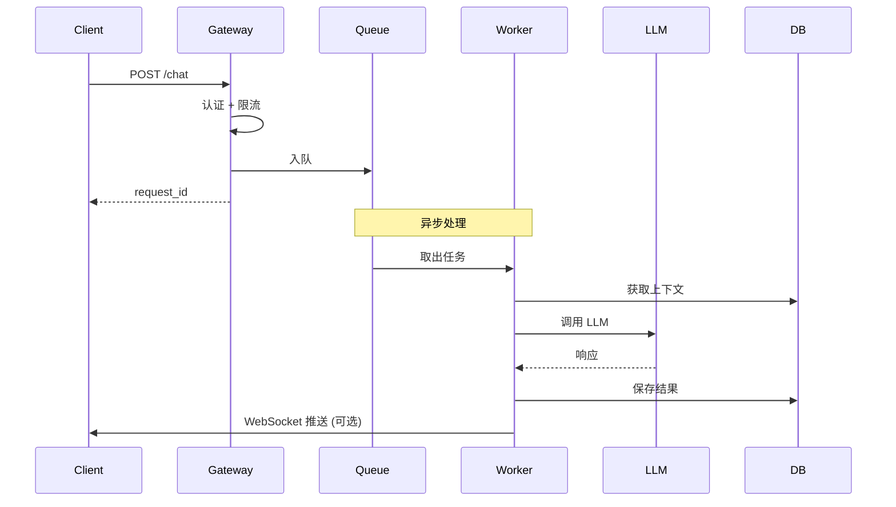

### 6.2 流式响应模式

```python
# SSE 流式响应实现
from fastapi import FastAPI
from fastapi.responses import StreamingResponse
import asyncio

app = FastAPI()

@app.post("/v1/chat/stream")
async def chat_stream(request: ChatRequest):
    async def generate():
        # 创建生成器
        stream = llm_service.stream(
            messages=request.messages,
            model=request.model
        )
        
        async for chunk in stream:
            # SSE 格式
            yield f"data: {chunk.json()}\n\n"
        
        # 结束标记
        yield "data: [DONE]\n\n"
    
    return StreamingResponse(
        generate(),
        media_type="text/event-stream"
    )
```

### 6.3 批处理模式

```python
# 批处理调度器
class BatchProcessor:
    def __init__(
        self,
        max_batch_size: int = 32,
        max_wait_ms: int = 50
    ):
        self.batch_size = max_batch_size
        self.max_wait = max_wait_ms / 1000
        self.queue = asyncio.Queue()
        self.pending = []
    
    async def submit(self, request: LLMRequest) -> LLMResponse:
        future = asyncio.Future()
        await self.queue.put((request, future))
        return await future
    
    async def run(self):
        while True:
            batch = []
            futures = []
            
            # 收集批次
            deadline = asyncio.get_event_loop().time() + self.max_wait
            
            while len(batch) < self.batch_size:
                timeout = deadline - asyncio.get_event_loop().time()
                if timeout <= 0:
                    break
                
                try:
                    request, future = await asyncio.wait_for(
                        self.queue.get(),
                        timeout=timeout
                    )
                    batch.append(request)
                    futures.append(future)
                except asyncio.TimeoutError:
                    break
            
            if batch:
                # 批量处理
                results = await self._process_batch(batch)
                
                # 返回结果
                for future, result in zip(futures, results):
                    future.set_result(result)
    
    async def _process_batch(
        self, 
        batch: list[LLMRequest]
    ) -> list[LLMResponse]:
        # 实际批量调用 LLM
        pass
```

---

## 7. 可观测性设计

### 7.1 三支柱架构

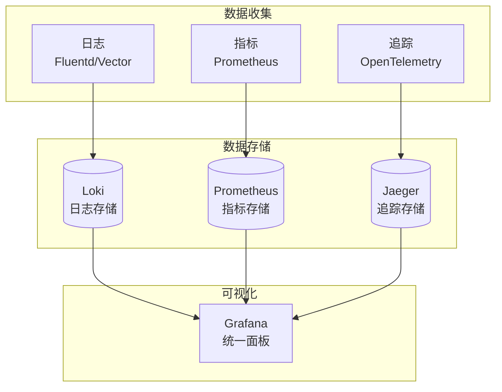

### 7.2 关键指标

```yaml
# Prometheus 指标定义
metrics:
  # 延迟指标
  - name: llm_request_duration_seconds
    type: histogram
    labels: [model, provider, endpoint]
    buckets: [0.1, 0.5, 1, 2, 5, 10, 30, 60]
    
  # 吞吐量指标
  - name: llm_requests_total
    type: counter
    labels: [model, provider, status]
    
  # 错误指标
  - name: llm_errors_total
    type: counter
    labels: [model, provider, error_type]
    
  # Token 指标
  - name: llm_tokens_total
    type: counter
    labels: [model, type]  # type: input/output
    
  # 队列指标
  - name: queue_depth
    type: gauge
    labels: [queue_name]
    
  # 资源指标
  - name: gpu_utilization
    type: gauge
    labels: [node, gpu_id]
    
  - name: gpu_memory_used_bytes
    type: gauge
    labels: [node, gpu_id]
```

### 7.3 告警规则

```yaml
# 告警规则定义
groups:
  - name: llm-alerts
    rules:
      - alert: HighLatency
        expr: |
          histogram_quantile(0.95, 
            rate(llm_request_duration_seconds_bucket[5m])
          ) > 10
        for: 5m
        labels:
          severity: warning
        annotations:
          summary: "LLM 请求延迟过高"
          
      - alert: HighErrorRate
        expr: |
          rate(llm_errors_total[5m]) 
          / rate(llm_requests_total[5m]) > 0.05
        for: 2m
        labels:
          severity: critical
        annotations:
          summary: "LLM 错误率过高"
          
      - alert: QueueBacklog
        expr: queue_depth > 100
        for: 1m
        labels:
          severity: warning
        annotations:
          summary: "队列积压过多"
```

---

## 8. 安全架构

### 8.1 安全分层设计

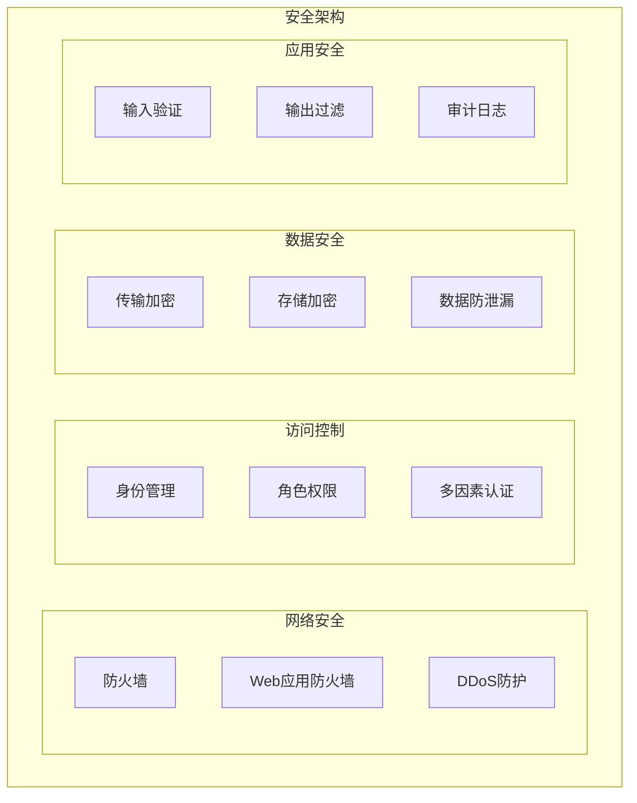

### 8.2 认证授权

```yaml
# OAuth 2.0 + JWT 配置
authentication:
  providers:
    - type: oauth2
      issuer: https://auth.example.com
      audience: ai-api
      algorithms: [RS256]
      
    - type: api_key
      header: X-API-Key
      prefix: sk-
      
    - type: jwt
      secret: ${JWT_SECRET}
      expiry: 3600
      
authorization:
  model: RBAC
  roles:
    - name: admin
      permissions: ["*"]
      
    - name: developer
      permissions:
        - "llm:chat"
        - "llm:embed"
        - "rag:query"
        
    - name: viewer
      permissions:
        - "llm:chat:read"
```

### 8.3 数据安全

| 数据类型 | 存储加密 | 传输加密 | 访问控制 |
|---------|---------|---------|---------|
| 用户数据 | AES-256 | TLS 1.3 | 用户级别 |
| 模型权重 | AES-256 | TLS 1.3 | 服务级别 |
| 向量数据 | AES-256 | TLS 1.3 | 租户级别 |
| 日志数据 | AES-256 | TLS 1.3 | 管理员 |
| API 密钥 | KMS 托管 | - | 服务级别 |

---

## 9. 扩展性设计

### 9.1 水平扩展策略

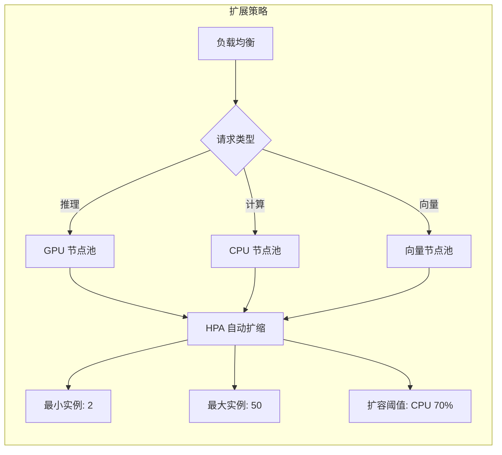

### 9.2 数据分片策略

```yaml
# 数据分片配置
sharding:
  # 向量数据库分片
  vector_db:
    strategy: hash
    key: document_id
    shards: 4
    
  # 关系数据库分片
  relational_db:
    strategy: range
    key: user_id
    shards:
      - range: [0, 1000000]
        host: db-shard-1
      - range: [1000000, 2000000]
        host: db-shard-2
        
  # 缓存分片
  cache:
    strategy: consistent_hash
    replicas: 150
    nodes: 6
```

---

## 10. 容灾架构

### 10.1 高可用设计

```
┌─────────────────────────────────────────────────────────────────┐
│                         多可用区部署                              │
├─────────────────────────────────────────────────────────────────┤
│                                                                 │
│   ┌─────────────┐     ┌─────────────┐     ┌─────────────┐      │
│   │  AZ-1       │     │  AZ-2       │     │  AZ-3       │      │
│   │  ┌───────┐  │     │  ┌───────┐  │     │  ┌───────┐  │      │
│   │  │ API   │  │     │  │ API   │  │     │  │ API   │  │      │
│   │  └───────┘  │     │  └───────┘  │     │  └───────┘  │      │
│   │  ┌───────┐  │     │  ┌───────┐  │     │  ┌───────┐  │      │
│   │  │ LLM   │  │     │  │ LLM   │  │     │  │ LLM   │  │      │
│   │  └───────┘  │     │  └───────┘  │     │  └───────┘  │      │
│   │  ┌───────┐  │     │  ┌───────┐  │     │  ┌───────┐  │      │
│   │  │ DB    │◄─┼────┼─►│ DB    │◄─┼────┼─►│ DB    │  │      │
│   │  └───────┘  │     │  └───────┘  │     │  └───────┘  │      │
│   └─────────────┘     └─────────────┘     └─────────────┘      │
│                                                                 │
│                    ┌─────────────┐                              │
│                    │ Global LB   │                              │
│                    └─────────────┘                              │
│                                                                 │
└─────────────────────────────────────────────────────────────────┘
```

### 10.2 故障恢复流程

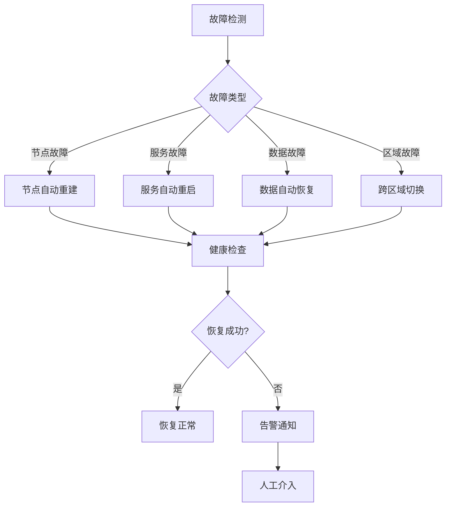

---

## 11. 技术选型参考

### 11.1 核心组件选型

| 组件 | 推荐方案 | 备选方案 | 选型依据 |
|-----|---------|---------|---------|
| 容器编排 | Kubernetes | Docker Swarm | 生态成熟、企业标准 |
| 服务网格 | Istio | Linkerd | 功能全面、社区活跃 |
| 向量数据库 | Milvus | Pinecone/Weaviate | 开源、性能好 |
| 缓存 | Redis Cluster | Memcached | 支持持久化、丰富数据结构 |
| 消息队列 | Kafka | RabbitMQ | 高吞吐、持久化 |
| 日志 | Loki | Elasticsearch | 轻量级、与 Grafana 集成好 |
| 监控 | Prometheus + Grafana | Datadog | 开源、灵活 |

### 11.2 LLM 推理框架

| 框架 | 适用场景 | 特点 |
|-----|---------|------|
| vLLM | 高吞吐推理 | PagedAttention、连续批处理 |
| TensorRT-LLM | NVIDIA GPU 优化 | 极致性能 |
| TGI | HuggingFace 生态 | 易用、开箱即用 |
| SGLang | 结构化输出 | 灵活的输出控制 |
| llama.cpp | 边缘/本地部署 | 轻量、跨平台 |

---

## 12. 架构与基础设施集成

### 12.1 端到端部署拓扑

```
┌────────────────────────────────────────────────────────────────────────┐
│                    AI 系统端到端部署拓扑                                  │
├────────────────────────────────────────────────────────────────────────┤
│                                                                        │
│  Region A (Primary)              Region B (DR)                        │
│  ┌─────────────────────────┐    ┌─────────────────────────┐          │
│  │ AZ-1      AZ-2    AZ-3 │    │ AZ-1      AZ-2         │          │
│  │ ┌──────┐ ┌──────┐┌────┐│    │ ┌──────┐ ┌──────┐      │          │
│  │ │API(3)│ │API(3)││API │││    │ │API(2)│ │API(2)│      │          │
│  │ │LLM(2)│ │LLM(2)││LLM│││    │ │LLM(1)│ │LLM(1)│      │          │
│  │ │DB(R) │ │DB(W) ││DB │││    │ │DB(R) │ │DB(R) │      │          │
│  │ └──────┘ └──────┘└────┘│    │ └──────┘ └──────┘      │          │
│  └─────────────────────────┘    └─────────────────────────┘          │
│                                                                        │
│  边缘节点 (Edge)                                                        │
│  ┌──────────┐  ┌──────────┐  ┌──────────┐                            │
│  │ CDN Edge │  │ 企业边缘  │  │ 端侧设备  │                            │
│  │ 缓存加速  │  │ 私有推理  │  │ 本地模型  │                            │
│  └──────────┘  └──────────┘  └──────────┘                            │
│                                                                        │
└────────────────────────────────────────────────────────────────────────┘
```

### 12.2 架构决策矩阵

| 决策维度 | 小规模 (<1K QPS) | 中规模 (1K-10K QPS) | 大规模 (>10K QPS) |
|---------|-----------------|-------------------|-----------------|
| **推理引擎** | vLLM | SGLang/vLLM | SGLang + TensorRT |
| **部署方式** | 单集群 K8s | 多 AZ K8s | 多 Region + 边缘 |
| **GPU 选型** | L40S | H100 | H200/B200 |
| **缓存策略** | Redis 精确匹配 | 语义缓存 | 多级缓存 |
| **高可用** | 多副本 | 跨 AZ 容灾 | 跨 Region 容灾 |
| **成本优化** | API 调用 | 混合 (API+自托管) | 全自托管 |

### 12.3 运维集成要点

| 领域 | 关键实践 | 参考文档 |
|-----|---------|---------|
| **容量规划** | GPU 显存计算、QPS 预测、弹性扩缩容 | [容量规划指南](./Capacity_Planning_2026.md) |
| **成本管理** | Token 经济学、智能路由、FinOps | [成本优化](./AI_Cost_Optimization_2026.md) |
| **高可用** | 多 AZ 部署、故障自动恢复、数据一致性 | [高可用设计](./High_Availability_2026.md) |
| **边缘部署** | 云边协同、模型量化、隐私保护 | [边缘 AI](./Edge_AI_2026.md) |
| **多租户** | 租户隔离、资源配额、计费计量 | [多租户架构](./Multi_Tenant_Architecture.md) |

---

## 13. 参考资源

- [Azure AI Architecture](https://learn.microsoft.com/en-us/azure/architecture/ai-ml/)
- [AWS AI Architecture](https://aws.amazon.com/architecture/reference-architecture-diagrams/)
- [Google Cloud AI Infrastructure](https://cloud.google.com/architecture/ai-infrastructure)
- [NVIDIA AI Enterprise Architecture](https://www.nvidia.com/en-us/data-center/products/ai-enterprise/)

---

*Last updated: 2026-04-14*
*Version: 2.0.0 (Enhanced with infrastructure integration)*

## Related

- [[12_Architecture_Infrastructure/AI_Infrastructure_2026.md|AI_Infrastructure_2026]]
- [[12_Architecture_Infrastructure/Architecture-in-nutshell.md|Architecture-in-nutshell]]
- [[12_Architecture_Infrastructure/Architecture_Infrastructure_for_dummy.md|Architecture_Infrastructure_for_dummy]]
- [[12_Architecture_Infrastructure/Spring_AI_Architecture.md|Spring_AI_Architecture]]
- [[_concepts/llm-infrastructure.md|llm-infrastructure]]
